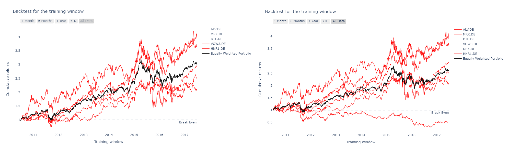
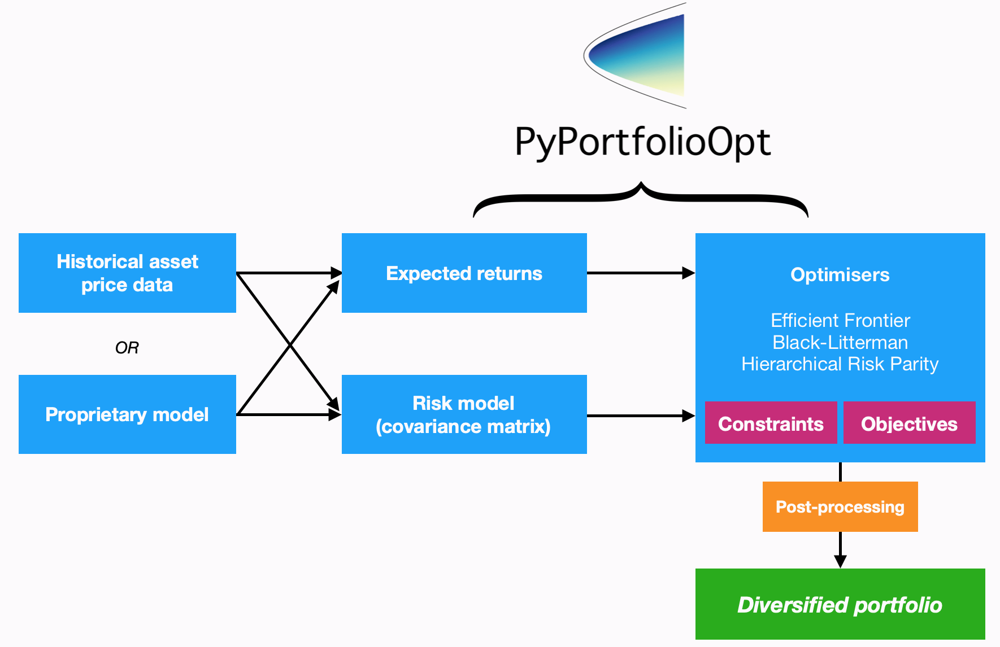
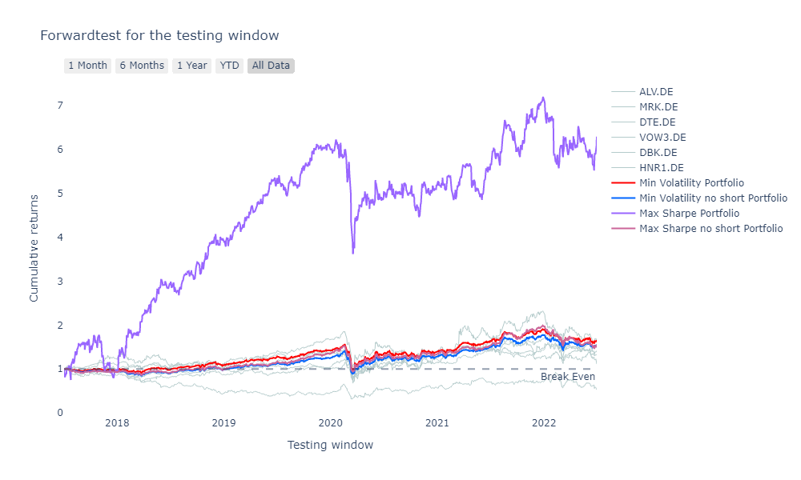
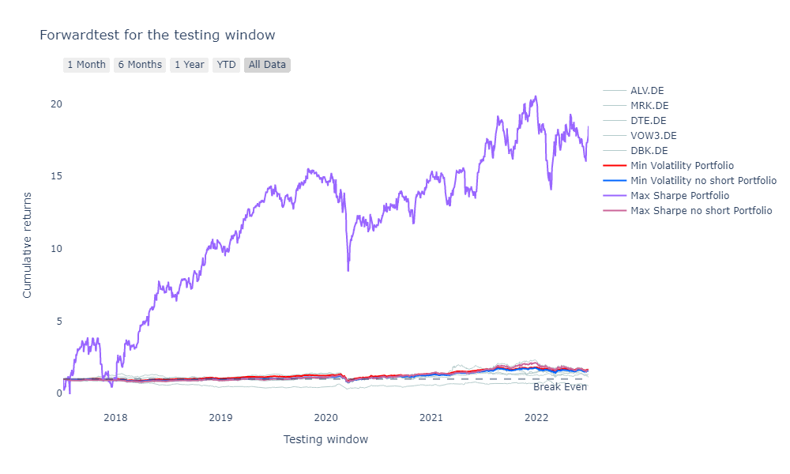
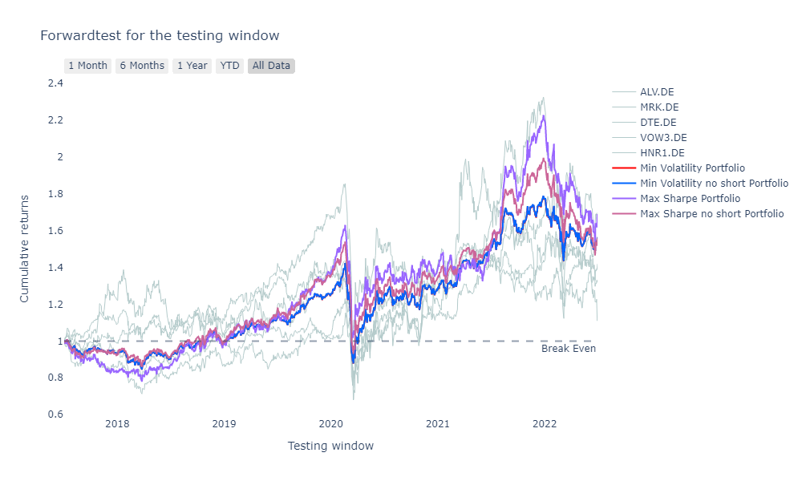
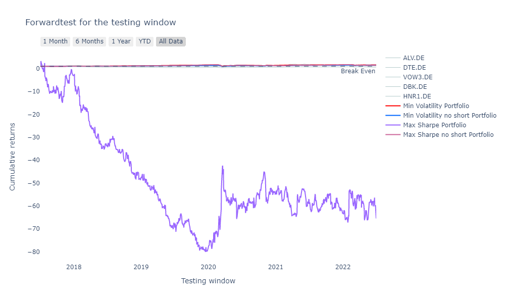
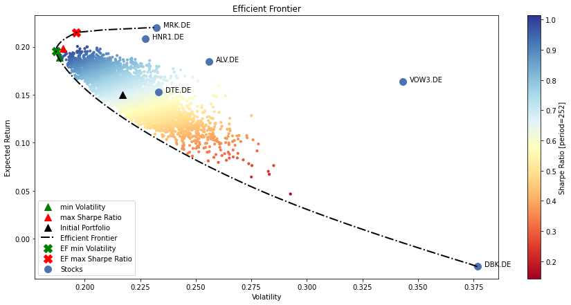

# Python Project 2: Portfolio Optimization and Analysis

**Author**: Chinh X. Mai, **Date**: July 3, 2022

## Project Description

This project focuses on constructing, optimizing, and analyzing a portfolio of chosen stocks in Python. Considering a realistic scenario when one has a certain amount of fund and wants to invest in the stock market either to make profit or to keep its value. He needs to know which stocks to buy and by how much. His friend has chosen some potential stocks (Table 1) and now he only needs to decide how to spend the money.


| Symbol  | Company Name                                | Last Price | Change | % Change | Volume     |
| ------- | ------------------------------------------- | ---------- | ------ | -------- | ---------- |
| ALV.DE  | Allianz SE                                  | 181.04     | \-0.16 | \-0.09%  | 1,069,053  |
| MRK.DE  | MERCK Kommanditgesellschaft auf Aktien      | 165.1      | 0.3    | 0.18%    | 313,644    |
| DTE.DE  | Deutsche Telekom AG                         | 18.84      | \-0.04 | \-0.20%  | 6,880,550  |
| VOW3.DE | Volkswagen AG                               | 138.88     | \-0.3  | \-0.22%  | 913,070    |
| DBK.DE  | Deutsche Bank Aktiengesellschaft            | 8.89       | \-0.03 | \-0.33%  | 10,112,593 |
| HNR1.DE | Hannover Rück SE                            | 136.4      | \-0.45 | \-0.33%  | 95,892     |

**Table 1**: list of suggested stocks to invest in (source: [Yahoo! Finance](https://finance.yahoo.com/quote/%5EGDAXI/components?p=%5EGDAXI), accessed on June 27, 2022)

These stocks are the components of the DAX30 Index, which includes many German blue chip companies trading on the Frankfurt Stock Exchange. This analysis will go through the process of constructing and validating the performance of a stocks portfolio that can serve the needs of the investor. This process will also provide many insights for the investor to understand the investment strategy that he can take to adjust the performance of the portfolio.

## Objectives

This project demonstrates my familiarity with many python packages used to perform a wide range of tasks necessary to optimize a portfolio. Besides the core packages used to calculate and manipulate data such as `pandas` and `numpy`, `plotly` is also used extensively to visualize stock data in the analysis and many simulations. Moreover, many utility functions and a class are generated from functions in `pypfopt` to simulate and present the optimization results. In details, the project aims to achieve the following objectives:

* Fetching stock data of chosen stocks from online source and save the data in a pandas DataFrame for further manipulations and calculations
* Investigating and cleaning the data for further analyses
* Understanding stock characteristics by calculations and visualizations
* Creating and optimizing stock portfolios for different risk preferences
* Validating and comparing the performance of these portfolios
* Constructing an efficient frontier from the chosen stocks

Besides these objectives, the project also showcases my ability to utilize flexibly different tools provided by different packages in Python and present the results in an authentic and aesthetic manner.

## Loading libraries and python options

Manually generated functions are stored in a separate python file called `portfolio.py`, these functions are also imported and called together with other functions. The logic behind each employed function will be explained briefly when it is used during the analysis.


```python
# Data and array manipulation
import pandas as pd
import numpy as np
from IPython.display import display, HTML, Image
import warnings

# Datetime manipulation
import datetime as dt

# Plotting and Visualization
import matplotlib.pyplot as plt
import plotly.express as px
import plotly.graph_objects as go
import plotly.io as pio
import chart_studio.plotly as py
import cufflinks as cf

# Fetching stock data from web
import pandas_datareader.data as web
import yfinance as yf

# Interactive charts
from ipywidgets import interact, fixed, IntSlider
from plotly.offline import download_plotlyjs, init_notebook_mode, plot, iplot

# Portfolio optimization
import pypfopt
from pypfopt import risk_models
from pypfopt import plotting
from pypfopt import expected_returns
from pypfopt import EfficientFrontier
from pypfopt import discrete_allocation
from finquant.portfolio import build_portfolio

# Self-made utilities functions
from portfolio import backtest, fnc_fetchdata, ef_summary, fnc_value, forwardtest, stock_hist

# Options
cached_data = {} 
init_notebook_mode(connected = True)
cf.go_offline()
warnings.filterwarnings(action = 'ignore')
pd.options.display.float_format = '{:,.4f}'.format

# Default graphic settings
default_yaxis = dict(showgrid = False,
                     zeroline = False,
                     showline = False,
                     showticklabels = True)
default_RgSlct = dict(buttons = list([dict(count = 1, label = "1 Month", step = "month", stepmode = "backward"),
                                      dict(count = 6, label = "6 Months", step = "month", stepmode = "backward"),
                                      dict(count = 1, label = "1 Year", step = "year", stepmode = "backward"),
                                      dict(count = 1, label = "YTD", step = "year", stepmode = "todate"),
                                      dict(label = "All Data", step = "all")]))
```


<script type="text/javascript">
window.PlotlyConfig = {MathJaxConfig: 'local'};
if (window.MathJax && window.MathJax.Hub && window.MathJax.Hub.Config) {window.MathJax.Hub.Config({SVG: {font: "STIX-Web"}});}
if (typeof require !== 'undefined') {
require.undef("plotly");
requirejs.config({
    paths: {
        'plotly': ['https://cdn.plot.ly/plotly-2.12.1.min']
    }
});
require(['plotly'], function(Plotly) {
    window._Plotly = Plotly;
});
}
</script>


<script type="text/javascript">
window.PlotlyConfig = {MathJaxConfig: 'local'};
if (window.MathJax && window.MathJax.Hub && window.MathJax.Hub.Config) {window.MathJax.Hub.Config({SVG: {font: "STIX-Web"}});}
if (typeof require !== 'undefined') {
require.undef("plotly");
requirejs.config({
    paths: {
        'plotly': ['https://cdn.plot.ly/plotly-2.12.1.min']
    }
});
require(['plotly'], function(Plotly) {
    window._Plotly = Plotly;
});
}
</script>


<script type="text/javascript">
window.PlotlyConfig = {MathJaxConfig: 'local'};
if (window.MathJax && window.MathJax.Hub && window.MathJax.Hub.Config) {window.MathJax.Hub.Config({SVG: {font: "STIX-Web"}});}
if (typeof require !== 'undefined') {
require.undef("plotly");
requirejs.config({
    paths: {
        'plotly': ['https://cdn.plot.ly/plotly-2.12.1.min']
    }
});
require(['plotly'], function(Plotly) {
    window._Plotly = Plotly;
});
}
</script>


<script type="text/javascript">
window.PlotlyConfig = {MathJaxConfig: 'local'};
if (window.MathJax && window.MathJax.Hub && window.MathJax.Hub.Config) {window.MathJax.Hub.Config({SVG: {font: "STIX-Web"}});}
if (typeof require !== 'undefined') {
require.undef("plotly");
requirejs.config({
    paths: {
        'plotly': ['https://cdn.plot.ly/plotly-2.12.1.min']
    }
});
require(['plotly'], function(Plotly) {
    window._Plotly = Plotly;
});
}
</script>


<script type="text/javascript">
window.PlotlyConfig = {MathJaxConfig: 'local'};
if (window.MathJax && window.MathJax.Hub && window.MathJax.Hub.Config) {window.MathJax.Hub.Config({SVG: {font: "STIX-Web"}});}
if (typeof require !== 'undefined') {
require.undef("plotly");
requirejs.config({
    paths: {
        'plotly': ['https://cdn.plot.ly/plotly-2.12.1.min']
    }
});
require(['plotly'], function(Plotly) {
    window._Plotly = Plotly;
});
}
</script>


## Investment Scenario and analysis process

To make the case realistic, an investment scenario is considered as follows. Usually, the optimization result gives the weights of the chosen stocks in the portfolio, these weights often have the form of a fraction such as stock A accounts for 20% of the portfolio value rather than 1 or 2 stocks in the portfolio. This information is theoretically useful, but practically useless since the investor would prefer to know how many units of each stock he needs to buy (or sell) to form the portfolio. This question is regarded as the discrete allocation and requires a certain amount of fund to answer. In this project, 2,000 EUR is given to invest in the chosen stocks, the list of the chosen stock is summarized as given above.


```python
# Listing the tickers of the chosen stocks
tickers = ['ALV.DE', 'MRK.DE', 'DTE.DE', 'VOW3.DE', 'DBK.DE', 'HNR1.DE']

# Fund
fund = 2000
```

The core philosophy of the analysis taken in this project can be summarized by the following sentence: "Applying what is learned from historical data to formulate a model that helps to predict the future". Detailed steps are explained as follows. Firstly, historical data is loaded. Stock data are time series, when the data of many stocks are presented in the same table, a table data is created. To make it more practical, the loaded data is separated into two windows. The first window is regarded as the "training window", the data in this window is used to construct optimized portfolios. The second window is called the "testing window", the data of which is used to validate the performance of the portfolios and also to understand the effect of each stock on this performance. Last but not least, an efficient frontier is constructed to present how these portfolios are relevant to each other.

## Fetching data

Firstly, the data is fetched from Yahoo! Finance using the function `fnc_fetchdata`, which receives the list of tickers of chosen stocks, start day and end day, and returns a data table that contains information about `Date`, `Ticker`, `Open` price, `High` price, `Low` price, `Close` price, `Adj Close` price, and traded `Volume` for the chosen time period. This is the standard information that Yahoo! Finance provides, and can be downloaded directly from the platform's [website](https://finance.yahoo.com/). This table is stored in the valuable `df` and regarded as the master table. When time data is not given to the function `fnc_fetchdata`, all available data is loaded, so the master table includes all available information of each stock.


```python
# full data
df = fnc_fetchdata(t = tickers)
df.head()
```

    [*********************100%***********************]  6 of 6 completed
    


<div>
<style scoped>
    .dataframe tbody tr th:only-of-type {
        vertical-align: middle;
    }

    .dataframe tbody tr th {
        vertical-align: top;
    }

    .dataframe thead th {
        text-align: right;
    }
</style>
<table border="1" class="dataframe">
  <thead>
    <tr style="text-align: right;">
      <th></th>
      <th>Date</th>
      <th>Ticker</th>
      <th>Open</th>
      <th>High</th>
      <th>Low</th>
      <th>Close</th>
      <th>Adj Close</th>
      <th>Volume</th>
    </tr>
  </thead>
  <tbody>
    <tr>
      <th>0</th>
      <td>1996-12-16</td>
      <td>ALV.DE</td>
      <td>145.1380</td>
      <td>145.2070</td>
      <td>143.6730</td>
      <td>144.1590</td>
      <td>66.7052</td>
      <td>58,799.0000</td>
    </tr>
    <tr>
      <th>1</th>
      <td>1996-12-17</td>
      <td>ALV.DE</td>
      <td>143.2130</td>
      <td>143.2130</td>
      <td>140.7590</td>
      <td>141.5260</td>
      <td>65.4868</td>
      <td>76,694.0000</td>
    </tr>
    <tr>
      <th>2</th>
      <td>1996-12-18</td>
      <td>ALV.DE</td>
      <td>142.1390</td>
      <td>142.5480</td>
      <td>140.1960</td>
      <td>140.6560</td>
      <td>65.0843</td>
      <td>76,182.0000</td>
    </tr>
    <tr>
      <th>3</th>
      <td>1996-12-19</td>
      <td>ALV.DE</td>
      <td>141.3720</td>
      <td>141.4740</td>
      <td>139.7360</td>
      <td>140.0940</td>
      <td>64.8242</td>
      <td>96,634.0000</td>
    </tr>
    <tr>
      <th>4</th>
      <td>1996-12-20</td>
      <td>ALV.DE</td>
      <td>141.3720</td>
      <td>142.6500</td>
      <td>140.9120</td>
      <td>141.4740</td>
      <td>65.4628</td>
      <td>131,913.0000</td>
    </tr>
  </tbody>
</table>
</div>


For this analysis, I would only use the adjusted closing prices of these stocks as they "amends a stock's closing price to reflect that stock's value after accounting for any corporate actions" ([Investopedia, 2020, accessed on July 3, 2022](https://www.investopedia.com/terms/a/adjusted_closing_price.asp#:~:text=Key%20Takeaways-,The%20adjusted%20closing%20price%20amends%20a%20stock%27s%20closing%20price%20to,price%20before%20the%20market%20closes.)) to construct further analyses. This is done easily also by the function `fnc_fetchdata` as follows.


```python
# fetching data of adjusted closing prices
df_price = fnc_fetchdata(t = tickers, c = 'Adj Close')
df_price.head()
```

    [*********************100%***********************]  6 of 6 completed
    Extracting column Adj Close
    


<div>
<style scoped>
    .dataframe tbody tr th:only-of-type {
        vertical-align: middle;
    }

    .dataframe tbody tr th {
        vertical-align: top;
    }

    .dataframe thead th {
        text-align: right;
    }
</style>
<table border="1" class="dataframe">
  <thead>
    <tr style="text-align: right;">
      <th>Ticker</th>
      <th>ALV.DE</th>
      <th>DBK.DE</th>
      <th>DTE.DE</th>
      <th>HNR1.DE</th>
      <th>MRK.DE</th>
      <th>VOW3.DE</th>
    </tr>
    <tr>
      <th>Date</th>
      <th></th>
      <th></th>
      <th></th>
      <th></th>
      <th></th>
      <th></th>
    </tr>
  </thead>
  <tbody>
    <tr>
      <th>1996-11-18</th>
      <td>NaN</td>
      <td>16.5037</td>
      <td>5.5788</td>
      <td>NaN</td>
      <td>NaN</td>
      <td>NaN</td>
    </tr>
    <tr>
      <th>1996-11-19</th>
      <td>NaN</td>
      <td>16.5801</td>
      <td>5.5788</td>
      <td>NaN</td>
      <td>NaN</td>
      <td>NaN</td>
    </tr>
    <tr>
      <th>1996-11-20</th>
      <td>NaN</td>
      <td>16.5917</td>
      <td>5.4223</td>
      <td>NaN</td>
      <td>NaN</td>
      <td>NaN</td>
    </tr>
    <tr>
      <th>1996-11-21</th>
      <td>NaN</td>
      <td>16.5245</td>
      <td>5.4070</td>
      <td>NaN</td>
      <td>NaN</td>
      <td>NaN</td>
    </tr>
    <tr>
      <th>1996-11-22</th>
      <td>NaN</td>
      <td>16.4643</td>
      <td>5.4972</td>
      <td>NaN</td>
      <td>NaN</td>
      <td>NaN</td>
    </tr>
  </tbody>
</table>
</div>


This wide table contains information of the adjusted closing prices of all the chosen stocks, each of which is stored in a table's column. This is regarded as the price table and stored in the variable `df_price`.

## Data description and cleaning

Stock data provided by Yahoo! Finance is usually quite clean, but it is still necessary to check its completeness. Firstly, let us see the data counts of all stocks


```python
# check start date, end date, and length of each ticker
df.groupby('Ticker')['Date'].agg(['min', 'max', 'count'])
```


<div>
<style scoped>
    .dataframe tbody tr th:only-of-type {
        vertical-align: middle;
    }

    .dataframe tbody tr th {
        vertical-align: top;
    }

    .dataframe thead th {
        text-align: right;
    }
</style>
<table border="1" class="dataframe">
  <thead>
    <tr style="text-align: right;">
      <th></th>
      <th>min</th>
      <th>max</th>
      <th>count</th>
    </tr>
    <tr>
      <th>Ticker</th>
      <th></th>
      <th></th>
      <th></th>
    </tr>
  </thead>
  <tbody>
    <tr>
      <th>ALV.DE</th>
      <td>1996-12-16</td>
      <td>2022-07-05</td>
      <td>6550</td>
    </tr>
    <tr>
      <th>DBK.DE</th>
      <td>1996-11-18</td>
      <td>2022-07-05</td>
      <td>6570</td>
    </tr>
    <tr>
      <th>DTE.DE</th>
      <td>1996-11-18</td>
      <td>2022-07-05</td>
      <td>6570</td>
    </tr>
    <tr>
      <th>HNR1.DE</th>
      <td>2000-10-23</td>
      <td>2022-07-05</td>
      <td>5545</td>
    </tr>
    <tr>
      <th>MRK.DE</th>
      <td>1998-06-26</td>
      <td>2022-07-05</td>
      <td>6151</td>
    </tr>
    <tr>
      <th>VOW3.DE</th>
      <td>1998-07-22</td>
      <td>2022-07-05</td>
      <td>6133</td>
    </tr>
  </tbody>
</table>
</div>


As can be seen from the table, the number of observations of these stocks are different, some observations are missing or not available. This is understandable and might not be caused by missing data as stock data is only available when the company being considered starts selling its stocks. 

Next the master table is used to check whether there is any missing prices in the daily data.


```python
# Counting null values
df.isnull().sum()
```


    Date         0
    Ticker       0
    Open         0
    High         0
    Low          0
    Close        0
    Adj Close    0
    Volume       0
    dtype: int64


As can be seen from the NA counts table, if the data of a day is not missing, all prices are available. The summary table of the price data is given below, these statistics are calculated using all the available observations. The table only gives a rough image about the characteristics since the numbers of observations are not similar


```python
df_price.describe()
```


<div>
<style scoped>
    .dataframe tbody tr th:only-of-type {
        vertical-align: middle;
    }

    .dataframe tbody tr th {
        vertical-align: top;
    }

    .dataframe thead th {
        text-align: right;
    }
</style>
<table border="1" class="dataframe">
  <thead>
    <tr style="text-align: right;">
      <th>Ticker</th>
      <th>ALV.DE</th>
      <th>DBK.DE</th>
      <th>DTE.DE</th>
      <th>HNR1.DE</th>
      <th>MRK.DE</th>
      <th>VOW3.DE</th>
    </tr>
  </thead>
  <tbody>
    <tr>
      <th>count</th>
      <td>6,550.0000</td>
      <td>6,570.0000</td>
      <td>6,570.0000</td>
      <td>5,545.0000</td>
      <td>6,151.0000</td>
      <td>6,133.0000</td>
    </tr>
    <tr>
      <th>mean</th>
      <td>101.0315</td>
      <td>26.0764</td>
      <td>8.6263</td>
      <td>57.5180</td>
      <td>50.9198</td>
      <td>78.0552</td>
    </tr>
    <tr>
      <th>std</th>
      <td>50.5534</td>
      <td>12.6095</td>
      <td>4.5174</td>
      <td>47.2005</td>
      <td>44.4890</td>
      <td>56.7900</td>
    </tr>
    <tr>
      <th>min</th>
      <td>21.3237</td>
      <td>4.7684</td>
      <td>2.9908</td>
      <td>8.7968</td>
      <td>6.2921</td>
      <td>10.9888</td>
    </tr>
    <tr>
      <th>25%</th>
      <td>54.3540</td>
      <td>15.5842</td>
      <td>5.1575</td>
      <td>19.5262</td>
      <td>16.2350</td>
      <td>18.8210</td>
    </tr>
    <tr>
      <th>50%</th>
      <td>89.5967</td>
      <td>25.8776</td>
      <td>6.3595</td>
      <td>30.2693</td>
      <td>32.1021</td>
      <td>71.1192</td>
    </tr>
    <tr>
      <th>75%</th>
      <td>143.8100</td>
      <td>33.4000</td>
      <td>11.6545</td>
      <td>95.1953</td>
      <td>82.2628</td>
      <td>127.5329</td>
    </tr>
    <tr>
      <th>max</th>
      <td>220.2194</td>
      <td>64.5286</td>
      <td>34.4515</td>
      <td>183.2961</td>
      <td>227.0566</td>
      <td>228.3794</td>
    </tr>
  </tbody>
</table>
</div>


Before going to further analyses, the rows containing NA values are dropped from the tables to make it more convenient to calculate other statistics.


```python
df.dropna(inplace = True)
df_price.dropna(inplace = True)
```

## Calculations

Firstly the training and testing windows are generated, because I am interested in knowing whether what has been learned in the training window is still true in the testing window. For cross sectional data, this process usually involves the random sampling of data. However, for time series data, random sampling cannot be used since the data is usually auto-correlated, so the training and testing windows are two time windows that are next to each other so that what is learned in the training window can still be true in the testing window. In this project, I use the data of seven years from July 2010 to July 2017 as the training data, and the data after that to the date this analysis is conducted as the testing data.


```python
# Setting training windows for calculating portfolio weights
start_train = dt.datetime(2010, 6, 30)
end_train = dt.datetime(2017, 6, 30)

# Setting testing windows for verifying portfolio performance
start_test = dt.datetime(2017, 7, 1)
end_test = dt.datetime(2022, 7, 1)
```

The first information to calculate is the daily returns. The raw data only contains information of the daily prices, but this information might be not so convenient to visualize and analyze due to its scale and autocorrelation. The prices of some stocks might be greatly higher than those of other stocks. When visualized on the same chart, it might be very hard to detect the trend in the prices of the stocks that are lower due to the wider volatilities in the prices of the stocks that are higher. Auto-correlation in the prices makes it difficult to see the correlation in the prices of different stocks when presented on a scatter plot. These phenomenons are easily eliminated by using returns instead of the raw prices. 

Daily returns can be calculated either by using the log returns or percentage changes. For this project, percentage changes are used. For daily data, the daily percentage change on a particular day $t$ for a stock is denoted as $r_t$ and calculated from the closing prices $p_t$ and $p_{t-1}$ using the following formula

$$r_t = \frac{p_t}{p_{t-1}} - 1$$

In Python, daily returns are calculated easily using the method `pct_change`. Usually, when calculating returns, the return of the first day in the considered window is not available. However, in this scenario, the prices of all days are available, and the training window is 10 years away from the oldest data, so we can have the returns of all days in the training window.


```python
# Calculating daily returns
df_return = df_price.pct_change().iloc[1:, :]
df_return.loc[start_train:end_train]
```


<div>
<style scoped>
    .dataframe tbody tr th:only-of-type {
        vertical-align: middle;
    }

    .dataframe tbody tr th {
        vertical-align: top;
    }

    .dataframe thead th {
        text-align: right;
    }
</style>
<table border="1" class="dataframe">
  <thead>
    <tr style="text-align: right;">
      <th>Ticker</th>
      <th>ALV.DE</th>
      <th>DBK.DE</th>
      <th>DTE.DE</th>
      <th>HNR1.DE</th>
      <th>MRK.DE</th>
      <th>VOW3.DE</th>
    </tr>
    <tr>
      <th>Date</th>
      <th></th>
      <th></th>
      <th></th>
      <th></th>
      <th></th>
      <th></th>
    </tr>
  </thead>
  <tbody>
    <tr>
      <th>2010-06-30</th>
      <td>0.0058</td>
      <td>0.0152</td>
      <td>0.0008</td>
      <td>0.0058</td>
      <td>-0.0061</td>
      <td>-0.0143</td>
    </tr>
    <tr>
      <th>2010-07-01</th>
      <td>-0.0217</td>
      <td>-0.0364</td>
      <td>0.0018</td>
      <td>-0.0037</td>
      <td>-0.0215</td>
      <td>-0.0333</td>
    </tr>
    <tr>
      <th>2010-07-02</th>
      <td>0.0046</td>
      <td>0.0012</td>
      <td>-0.0191</td>
      <td>0.0028</td>
      <td>-0.0056</td>
      <td>0.0014</td>
    </tr>
    <tr>
      <th>2010-07-05</th>
      <td>-0.0099</td>
      <td>-0.0040</td>
      <td>0.0116</td>
      <td>0.0013</td>
      <td>-0.0045</td>
      <td>-0.0010</td>
    </tr>
    <tr>
      <th>2010-07-06</th>
      <td>0.0237</td>
      <td>0.0195</td>
      <td>0.0132</td>
      <td>0.0191</td>
      <td>0.0220</td>
      <td>0.0197</td>
    </tr>
    <tr>
      <th>...</th>
      <td>...</td>
      <td>...</td>
      <td>...</td>
      <td>...</td>
      <td>...</td>
      <td>...</td>
    </tr>
    <tr>
      <th>2017-06-26</th>
      <td>0.0037</td>
      <td>0.0094</td>
      <td>-0.0024</td>
      <td>0.0043</td>
      <td>-0.0027</td>
      <td>0.0049</td>
    </tr>
    <tr>
      <th>2017-06-27</th>
      <td>-0.0011</td>
      <td>0.0319</td>
      <td>-0.0229</td>
      <td>-0.0057</td>
      <td>-0.0126</td>
      <td>-0.0015</td>
    </tr>
    <tr>
      <th>2017-06-28</th>
      <td>0.0000</td>
      <td>0.0142</td>
      <td>0.0003</td>
      <td>-0.0038</td>
      <td>-0.0119</td>
      <td>0.0019</td>
    </tr>
    <tr>
      <th>2017-06-29</th>
      <td>-0.0072</td>
      <td>0.0054</td>
      <td>-0.0209</td>
      <td>-0.0005</td>
      <td>-0.0217</td>
      <td>-0.0100</td>
    </tr>
    <tr>
      <th>2017-06-30</th>
      <td>-0.0040</td>
      <td>-0.0190</td>
      <td>-0.0116</td>
      <td>-0.0005</td>
      <td>-0.0005</td>
      <td>0.0026</td>
    </tr>
  </tbody>
</table>
<p>1780 rows × 6 columns</p>
</div>


The next metric to calculate is cumulative return. The cumulative return of a stock answer a more practical question. Suppose that I want to invest in a stock for a certain period and the stock does not pay dividend, then I would like to know how much I would get from the increase in the stock price afer the investment period I would like to have. In this case, the investment period is five years. Denoting the initial stock price as $p_t$ then the change in price of the stock between the period $t$ and $t + k$ is 

$$
p_{t+k} = \Pi^r_{j = 1} (1 + r_j) \times p_t
$$

which means the final price is the initial price compouned by the returns over the chosen period and the cumulative return is $\Pi^r_{j = 1} (1 + r_j)$. The cummulative returns of the chosen stocks are calculated as follows


```python
# calculating cumulative returns for the training windows
df_cumprice_W1 = (1 + df_return.loc[start_train:end_train]).cumprod()
df_cumprice_W1
```


<div>
<style scoped>
    .dataframe tbody tr th:only-of-type {
        vertical-align: middle;
    }

    .dataframe tbody tr th {
        vertical-align: top;
    }

    .dataframe thead th {
        text-align: right;
    }
</style>
<table border="1" class="dataframe">
  <thead>
    <tr style="text-align: right;">
      <th>Ticker</th>
      <th>ALV.DE</th>
      <th>DBK.DE</th>
      <th>DTE.DE</th>
      <th>HNR1.DE</th>
      <th>MRK.DE</th>
      <th>VOW3.DE</th>
    </tr>
    <tr>
      <th>Date</th>
      <th></th>
      <th></th>
      <th></th>
      <th></th>
      <th></th>
      <th></th>
    </tr>
  </thead>
  <tbody>
    <tr>
      <th>2010-06-30</th>
      <td>1.0058</td>
      <td>1.0152</td>
      <td>1.0008</td>
      <td>1.0058</td>
      <td>0.9939</td>
      <td>0.9857</td>
    </tr>
    <tr>
      <th>2010-07-01</th>
      <td>0.9839</td>
      <td>0.9783</td>
      <td>1.0026</td>
      <td>1.0021</td>
      <td>0.9725</td>
      <td>0.9529</td>
    </tr>
    <tr>
      <th>2010-07-02</th>
      <td>0.9884</td>
      <td>0.9795</td>
      <td>0.9834</td>
      <td>1.0050</td>
      <td>0.9670</td>
      <td>0.9542</td>
    </tr>
    <tr>
      <th>2010-07-05</th>
      <td>0.9786</td>
      <td>0.9755</td>
      <td>0.9948</td>
      <td>1.0063</td>
      <td>0.9627</td>
      <td>0.9533</td>
    </tr>
    <tr>
      <th>2010-07-06</th>
      <td>1.0018</td>
      <td>0.9946</td>
      <td>1.0079</td>
      <td>1.0255</td>
      <td>0.9839</td>
      <td>0.9721</td>
    </tr>
    <tr>
      <th>...</th>
      <td>...</td>
      <td>...</td>
      <td>...</td>
      <td>...</td>
      <td>...</td>
      <td>...</td>
    </tr>
    <tr>
      <th>2017-06-26</th>
      <td>2.9533</td>
      <td>0.4783</td>
      <td>2.5339</td>
      <td>3.6828</td>
      <td>4.0638</td>
      <td>2.0701</td>
    </tr>
    <tr>
      <th>2017-06-27</th>
      <td>2.9499</td>
      <td>0.4935</td>
      <td>2.4759</td>
      <td>3.6619</td>
      <td>4.0125</td>
      <td>2.0670</td>
    </tr>
    <tr>
      <th>2017-06-28</th>
      <td>2.9499</td>
      <td>0.5005</td>
      <td>2.4767</td>
      <td>3.6480</td>
      <td>3.9648</td>
      <td>2.0709</td>
    </tr>
    <tr>
      <th>2017-06-29</th>
      <td>2.9287</td>
      <td>0.5032</td>
      <td>2.4249</td>
      <td>3.6463</td>
      <td>3.8787</td>
      <td>2.0501</td>
    </tr>
    <tr>
      <th>2017-06-30</th>
      <td>2.9169</td>
      <td>0.4937</td>
      <td>2.3967</td>
      <td>3.6446</td>
      <td>3.8768</td>
      <td>2.0555</td>
    </tr>
  </tbody>
</table>
<p>1780 rows × 6 columns</p>
</div>


The volatility of each stock can be explained by either the changes in the price of that stock or the changes in the price of other stocks. This is presented by the variance - covariance matrix. 


```python
# Varirance - Covariance matrix
Mcov_W1 = df_return.loc[start_train:end_train].cov()
Mcov_W1
```


<div>
<style scoped>
    .dataframe tbody tr th:only-of-type {
        vertical-align: middle;
    }

    .dataframe tbody tr th {
        vertical-align: top;
    }

    .dataframe thead th {
        text-align: right;
    }
</style>
<table border="1" class="dataframe">
  <thead>
    <tr style="text-align: right;">
      <th>Ticker</th>
      <th>ALV.DE</th>
      <th>DBK.DE</th>
      <th>DTE.DE</th>
      <th>HNR1.DE</th>
      <th>MRK.DE</th>
      <th>VOW3.DE</th>
    </tr>
    <tr>
      <th>Ticker</th>
      <th></th>
      <th></th>
      <th></th>
      <th></th>
      <th></th>
      <th></th>
    </tr>
  </thead>
  <tbody>
    <tr>
      <th>ALV.DE</th>
      <td>0.0003</td>
      <td>0.0003</td>
      <td>0.0001</td>
      <td>0.0002</td>
      <td>0.0001</td>
      <td>0.0002</td>
    </tr>
    <tr>
      <th>DBK.DE</th>
      <td>0.0003</td>
      <td>0.0006</td>
      <td>0.0002</td>
      <td>0.0002</td>
      <td>0.0001</td>
      <td>0.0003</td>
    </tr>
    <tr>
      <th>DTE.DE</th>
      <td>0.0001</td>
      <td>0.0002</td>
      <td>0.0002</td>
      <td>0.0001</td>
      <td>0.0001</td>
      <td>0.0001</td>
    </tr>
    <tr>
      <th>HNR1.DE</th>
      <td>0.0002</td>
      <td>0.0002</td>
      <td>0.0001</td>
      <td>0.0002</td>
      <td>0.0001</td>
      <td>0.0001</td>
    </tr>
    <tr>
      <th>MRK.DE</th>
      <td>0.0001</td>
      <td>0.0001</td>
      <td>0.0001</td>
      <td>0.0001</td>
      <td>0.0002</td>
      <td>0.0001</td>
    </tr>
    <tr>
      <th>VOW3.DE</th>
      <td>0.0002</td>
      <td>0.0003</td>
      <td>0.0001</td>
      <td>0.0001</td>
      <td>0.0001</td>
      <td>0.0005</td>
    </tr>
  </tbody>
</table>
</div>


Correlation matrix is the standardized version of the variance - covariance matrix.


```python
# Correlation matrix
Mcorr_W1 = df_return.loc[start_train:end_train].corr()
Mcorr_W1
```


<div>
<style scoped>
    .dataframe tbody tr th:only-of-type {
        vertical-align: middle;
    }

    .dataframe tbody tr th {
        vertical-align: top;
    }

    .dataframe thead th {
        text-align: right;
    }
</style>
<table border="1" class="dataframe">
  <thead>
    <tr style="text-align: right;">
      <th>Ticker</th>
      <th>ALV.DE</th>
      <th>DBK.DE</th>
      <th>DTE.DE</th>
      <th>HNR1.DE</th>
      <th>MRK.DE</th>
      <th>VOW3.DE</th>
    </tr>
    <tr>
      <th>Ticker</th>
      <th></th>
      <th></th>
      <th></th>
      <th></th>
      <th></th>
      <th></th>
    </tr>
  </thead>
  <tbody>
    <tr>
      <th>ALV.DE</th>
      <td>1.0000</td>
      <td>0.7403</td>
      <td>0.6180</td>
      <td>0.7111</td>
      <td>0.4992</td>
      <td>0.5542</td>
    </tr>
    <tr>
      <th>DBK.DE</th>
      <td>0.7403</td>
      <td>1.0000</td>
      <td>0.5163</td>
      <td>0.5848</td>
      <td>0.4190</td>
      <td>0.5171</td>
    </tr>
    <tr>
      <th>DTE.DE</th>
      <td>0.6180</td>
      <td>0.5163</td>
      <td>1.0000</td>
      <td>0.5128</td>
      <td>0.4967</td>
      <td>0.4249</td>
    </tr>
    <tr>
      <th>HNR1.DE</th>
      <td>0.7111</td>
      <td>0.5848</td>
      <td>0.5128</td>
      <td>1.0000</td>
      <td>0.4533</td>
      <td>0.4554</td>
    </tr>
    <tr>
      <th>MRK.DE</th>
      <td>0.4992</td>
      <td>0.4190</td>
      <td>0.4967</td>
      <td>0.4533</td>
      <td>1.0000</td>
      <td>0.3854</td>
    </tr>
    <tr>
      <th>VOW3.DE</th>
      <td>0.5542</td>
      <td>0.5171</td>
      <td>0.4249</td>
      <td>0.4554</td>
      <td>0.3854</td>
      <td>1.0000</td>
    </tr>
  </tbody>
</table>
</div>


These metrics show two important characteristics of a stock in general, return and volatility. For a large number of stocks, this information is presented by the daily return table and variance covariance matrix. For a more compact view, the investor usually looks at expected returns $\mu$ and standard deviation $\sigma$. When investigating a stock, `mean` daily percentage change is the return that an investor could expect to get from investing in it for a day, so it is regarded as expected return of the stock, $E[r_t]$ or $\mu$. `std` is the standard deviation of the daily return $\sigma$, it shows the average deviation that the actual return deviates from the expected return. The larger `std` is, the further  the actual return might deviates from the expected return, so it is used to present the risk in the return of the stock. It should be noted that `mean` values in the table above is very small, but these are expected daily returns. When these returns compound over 252 trading days of a year, the equivalent annual returns would be much higher. These metrics are calculated easily by the `describe` method as follows.


```python
df_return.describe().loc['mean':'std']
```


<div>
<style scoped>
    .dataframe tbody tr th:only-of-type {
        vertical-align: middle;
    }

    .dataframe tbody tr th {
        vertical-align: top;
    }

    .dataframe thead th {
        text-align: right;
    }
</style>
<table border="1" class="dataframe">
  <thead>
    <tr style="text-align: right;">
      <th>Ticker</th>
      <th>ALV.DE</th>
      <th>DBK.DE</th>
      <th>DTE.DE</th>
      <th>HNR1.DE</th>
      <th>MRK.DE</th>
      <th>VOW3.DE</th>
    </tr>
  </thead>
  <tbody>
    <tr>
      <th>mean</th>
      <td>0.0002</td>
      <td>0.0000</td>
      <td>0.0002</td>
      <td>0.0006</td>
      <td>0.0006</td>
      <td>0.0006</td>
    </tr>
    <tr>
      <th>std</th>
      <td>0.0213</td>
      <td>0.0260</td>
      <td>0.0184</td>
      <td>0.0202</td>
      <td>0.0181</td>
      <td>0.0238</td>
    </tr>
  </tbody>
</table>
</div>


From these metrics, it can be seen that `DBK.DE` is the most volatiled stock, but it might not be the least attractive one. Usually, high volatiled stocks offer higher returns, so it is still unclear which stock is relatively better with only `mean` and `std`. In reality, it is more efficient to consider the so-called Sharpe ratio, which is calculated by the ratio

$$S_X = \frac{\mu_X - r_f}{\sigma_X}$$

where $S_X$ is the Sharpe ratio of the stock, $r_f$ is the risk-free rate, and $\mu_X, \sigma_X$ are respectively the expected return and volatility of the stock $X$. Sharpe ratio reflects how much return a stock can offer for each unit of volatility that the investor has to bear, so it is more useful for comparing between stocks. The Sharpe ratio of these stocks is calculated simply as follows.


```python
_ = df_return.describe().loc['mean':'std'].T
_['S'] = _['mean'] / _['std']
_.sort_values('S', ascending = False)
```


<div>
<style scoped>
    .dataframe tbody tr th:only-of-type {
        vertical-align: middle;
    }

    .dataframe tbody tr th {
        vertical-align: top;
    }

    .dataframe thead th {
        text-align: right;
    }
</style>
<table border="1" class="dataframe">
  <thead>
    <tr style="text-align: right;">
      <th></th>
      <th>mean</th>
      <th>std</th>
      <th>S</th>
    </tr>
    <tr>
      <th>Ticker</th>
      <th></th>
      <th></th>
      <th></th>
    </tr>
  </thead>
  <tbody>
    <tr>
      <th>MRK.DE</th>
      <td>0.0006</td>
      <td>0.0181</td>
      <td>0.0343</td>
    </tr>
    <tr>
      <th>HNR1.DE</th>
      <td>0.0006</td>
      <td>0.0202</td>
      <td>0.0276</td>
    </tr>
    <tr>
      <th>VOW3.DE</th>
      <td>0.0006</td>
      <td>0.0238</td>
      <td>0.0272</td>
    </tr>
    <tr>
      <th>DTE.DE</th>
      <td>0.0002</td>
      <td>0.0184</td>
      <td>0.0126</td>
    </tr>
    <tr>
      <th>ALV.DE</th>
      <td>0.0002</td>
      <td>0.0213</td>
      <td>0.0107</td>
    </tr>
    <tr>
      <th>DBK.DE</th>
      <td>0.0000</td>
      <td>0.0260</td>
      <td>0.0012</td>
    </tr>
  </tbody>
</table>
</div>


The Sharpe ratio gives a better insight to the relative performance of these stocks. It can be seen that `DBK.DE` is the worst stock with regard to the Sharpe ratio. However, the investor also needs to consider the volatility when making the investment decision, since a stock can have a good Sharpe ratio but its volatility might be very high, so it might not be so attractive compared to other less volatiled stocks.

## Data Visualization

Visualization is a great mean to detect trends in data. For stock data, line, scatter plots, and correlation heatmap provide visual insight to the returns and volatilities of all selected stocks, while being very effective means for comparison of such statistics among these stocks. Firstly, let us look the line chart for price changes in the training window.


```python
# Visualizing prices for the training window
fig = px.line(df_price.loc[start_train:end_train], 
              x = df_price.loc[start_train:end_train].index, 
              y = df_price.loc[start_train:end_train].columns,
              title = 'Changes in prices in the training window',
              labels = {'value': 'Price', 'x': 'Training window'},
              width = 1000, height = 600)

# Updating layout to reduce clutter
fig.update_layout(yaxis = default_yaxis, autosize = True, plot_bgcolor = 'white')

# Creating slider
fig.update_xaxes(rangeselector = default_RgSlct)

# Showing the visualization
fig.show()
```


<div>                            <div id="3c3387a6-7ea7-4aeb-a120-273968f76546" class="plotly-graph-div" style="height:600px; width:1000px;"></div>            <script type="text/javascript">                require(["plotly"], function(Plotly) {                    window.PLOTLYENV=window.PLOTLYENV || {};                                    if (document.getElementById("3c3387a6-7ea7-4aeb-a120-273968f76546")) {                    Plotly.newPlot(                        "3c3387a6-7ea7-4aeb-a120-273968f76546",                        [{"hovertemplate":"Ticker=ALV.DE<br>Training window=%{x}<br>Price=%{y}<extra></extra>","legendgroup":"ALV.DE","line":{"color":"#636efa","dash":"solid"},"marker":{"symbol":"circle"},"mode":"lines","name":"ALV.DE","showlegend":true,"x":["2010-06-30T00:00:00","2010-07-01T00:00:00","2010-07-02T00:00:00","2010-07-05T00:00:00","2010-07-06T00:00:00","2010-07-07T00:00:00","2010-07-08T00:00:00","2010-07-09T00:00:00","2010-07-12T00:00:00","2010-07-13T00:00:00","2010-07-14T00:00:00","2010-07-15T00:00:00","2010-07-16T00:00:00","2010-07-19T00:00:00","2010-07-20T00:00:00","2010-07-21T00:00:00","2010-07-22T00:00:00","2010-07-23T00:00:00","2010-07-26T00:00:00","2010-07-27T00:00:00","2010-07-28T00:00:00","2010-07-29T00:00:00","2010-07-30T00:00:00","2010-08-02T00:00:00","2010-08-03T00:00:00","2010-08-04T00:00:00","2010-08-05T00:00:00","2010-08-06T00:00:00","2010-08-09T00:00:00","2010-08-10T00:00:00","2010-08-11T00:00:00","2010-08-12T00:00:00","2010-08-13T00:00:00","2010-08-16T00:00:00","2010-08-17T00:00:00","2010-08-18T00:00:00","2010-08-19T00:00:00","2010-08-20T00:00:00","2010-08-23T00:00:00","2010-08-24T00:00:00","2010-08-25T00:00:00","2010-08-26T00:00:00","2010-08-27T00:00:00","2010-08-30T00:00:00","2010-08-31T00:00:00","2010-09-01T00:00:00","2010-09-02T00:00:00","2010-09-03T00:00:00","2010-09-06T00:00:00","2010-09-07T00:00:00","2010-09-08T00:00:00","2010-09-09T00:00:00","2010-09-10T00:00:00","2010-09-13T00:00:00","2010-09-14T00:00:00","2010-09-15T00:00:00","2010-09-16T00:00:00","2010-09-17T00:00:00","2010-09-20T00:00:00","2010-09-21T00:00:00","2010-09-22T00:00:00","2010-09-23T00:00:00","2010-09-24T00:00:00","2010-09-27T00:00:00","2010-09-28T00:00:00","2010-09-29T00:00:00","2010-09-30T00:00:00","2010-10-01T00:00:00","2010-10-04T00:00:00","2010-10-05T00:00:00","2010-10-06T00:00:00","2010-10-07T00:00:00","2010-10-08T00:00:00","2010-10-11T00:00:00","2010-10-12T00:00:00","2010-10-13T00:00:00","2010-10-14T00:00:00","2010-10-15T00:00:00","2010-10-18T00:00:00","2010-10-19T00:00:00","2010-10-20T00:00:00","2010-10-21T00:00:00","2010-10-22T00:00:00","2010-10-25T00:00:00","2010-10-26T00:00:00","2010-10-27T00:00:00","2010-10-28T00:00:00","2010-10-29T00:00:00","2010-11-01T00:00:00","2010-11-02T00:00:00","2010-11-03T00:00:00","2010-11-04T00:00:00","2010-11-05T00:00:00","2010-11-08T00:00:00","2010-11-09T00:00:00","2010-11-10T00:00:00","2010-11-11T00:00:00","2010-11-12T00:00:00","2010-11-15T00:00:00","2010-11-16T00:00:00","2010-11-17T00:00:00","2010-11-18T00:00:00","2010-11-19T00:00:00","2010-11-22T00:00:00","2010-11-23T00:00:00","2010-11-24T00:00:00","2010-11-25T00:00:00","2010-11-26T00:00:00","2010-11-29T00:00:00","2010-11-30T00:00:00","2010-12-01T00:00:00","2010-12-02T00:00:00","2010-12-03T00:00:00","2010-12-06T00:00:00","2010-12-07T00:00:00","2010-12-08T00:00:00","2010-12-09T00:00:00","2010-12-10T00:00:00","2010-12-13T00:00:00","2010-12-14T00:00:00","2010-12-15T00:00:00","2010-12-16T00:00:00","2010-12-17T00:00:00","2010-12-20T00:00:00","2010-12-21T00:00:00","2010-12-22T00:00:00","2010-12-23T00:00:00","2010-12-27T00:00:00","2010-12-28T00:00:00","2010-12-29T00:00:00","2010-12-30T00:00:00","2011-01-03T00:00:00","2011-01-04T00:00:00","2011-01-05T00:00:00","2011-01-06T00:00:00","2011-01-07T00:00:00","2011-01-10T00:00:00","2011-01-11T00:00:00","2011-01-12T00:00:00","2011-01-13T00:00:00","2011-01-14T00:00:00","2011-01-17T00:00:00","2011-01-18T00:00:00","2011-01-19T00:00:00","2011-01-20T00:00:00","2011-01-21T00:00:00","2011-01-24T00:00:00","2011-01-25T00:00:00","2011-01-26T00:00:00","2011-01-27T00:00:00","2011-01-28T00:00:00","2011-01-31T00:00:00","2011-02-01T00:00:00","2011-02-02T00:00:00","2011-02-03T00:00:00","2011-02-04T00:00:00","2011-02-07T00:00:00","2011-02-08T00:00:00","2011-02-09T00:00:00","2011-02-10T00:00:00","2011-02-11T00:00:00","2011-02-14T00:00:00","2011-02-15T00:00:00","2011-02-16T00:00:00","2011-02-17T00:00:00","2011-02-18T00:00:00","2011-02-21T00:00:00","2011-02-22T00:00:00","2011-02-23T00:00:00","2011-02-24T00:00:00","2011-02-25T00:00:00","2011-02-28T00:00:00","2011-03-01T00:00:00","2011-03-02T00:00:00","2011-03-03T00:00:00","2011-03-04T00:00:00","2011-03-07T00:00:00","2011-03-08T00:00:00","2011-03-09T00:00:00","2011-03-10T00:00:00","2011-03-11T00:00:00","2011-03-14T00:00:00","2011-03-15T00:00:00","2011-03-16T00:00:00","2011-03-17T00:00:00","2011-03-18T00:00:00","2011-03-21T00:00:00","2011-03-22T00:00:00","2011-03-23T00:00:00","2011-03-24T00:00:00","2011-03-25T00:00:00","2011-03-28T00:00:00","2011-03-29T00:00:00","2011-03-30T00:00:00","2011-03-31T00:00:00","2011-04-01T00:00:00","2011-04-04T00:00:00","2011-04-05T00:00:00","2011-04-06T00:00:00","2011-04-07T00:00:00","2011-04-08T00:00:00","2011-04-11T00:00:00","2011-04-12T00:00:00","2011-04-13T00:00:00","2011-04-14T00:00:00","2011-04-15T00:00:00","2011-04-18T00:00:00","2011-04-19T00:00:00","2011-04-20T00:00:00","2011-04-21T00:00:00","2011-04-26T00:00:00","2011-04-27T00:00:00","2011-04-28T00:00:00","2011-04-29T00:00:00","2011-05-02T00:00:00","2011-05-03T00:00:00","2011-05-04T00:00:00","2011-05-05T00:00:00","2011-05-06T00:00:00","2011-05-09T00:00:00","2011-05-10T00:00:00","2011-05-11T00:00:00","2011-05-12T00:00:00","2011-05-13T00:00:00","2011-05-16T00:00:00","2011-05-17T00:00:00","2011-05-18T00:00:00","2011-05-19T00:00:00","2011-05-20T00:00:00","2011-05-23T00:00:00","2011-05-24T00:00:00","2011-05-25T00:00:00","2011-05-26T00:00:00","2011-05-27T00:00:00","2011-05-30T00:00:00","2011-05-31T00:00:00","2011-06-01T00:00:00","2011-06-02T00:00:00","2011-06-03T00:00:00","2011-06-06T00:00:00","2011-06-07T00:00:00","2011-06-08T00:00:00","2011-06-09T00:00:00","2011-06-10T00:00:00","2011-06-13T00:00:00","2011-06-14T00:00:00","2011-06-15T00:00:00","2011-06-16T00:00:00","2011-06-17T00:00:00","2011-06-20T00:00:00","2011-06-21T00:00:00","2011-06-22T00:00:00","2011-06-23T00:00:00","2011-06-24T00:00:00","2011-06-27T00:00:00","2011-06-28T00:00:00","2011-06-29T00:00:00","2011-06-30T00:00:00","2011-07-01T00:00:00","2011-07-04T00:00:00","2011-07-05T00:00:00","2011-07-06T00:00:00","2011-07-07T00:00:00","2011-07-08T00:00:00","2011-07-11T00:00:00","2011-07-12T00:00:00","2011-07-13T00:00:00","2011-07-14T00:00:00","2011-07-15T00:00:00","2011-07-18T00:00:00","2011-07-19T00:00:00","2011-07-20T00:00:00","2011-07-21T00:00:00","2011-07-22T00:00:00","2011-07-25T00:00:00","2011-07-26T00:00:00","2011-07-27T00:00:00","2011-07-28T00:00:00","2011-07-29T00:00:00","2011-08-01T00:00:00","2011-08-02T00:00:00","2011-08-03T00:00:00","2011-08-04T00:00:00","2011-08-05T00:00:00","2011-08-08T00:00:00","2011-08-09T00:00:00","2011-08-10T00:00:00","2011-08-11T00:00:00","2011-08-12T00:00:00","2011-08-15T00:00:00","2011-08-16T00:00:00","2011-08-17T00:00:00","2011-08-18T00:00:00","2011-08-19T00:00:00","2011-08-22T00:00:00","2011-08-23T00:00:00","2011-08-24T00:00:00","2011-08-25T00:00:00","2011-08-26T00:00:00","2011-08-29T00:00:00","2011-08-30T00:00:00","2011-08-31T00:00:00","2011-09-01T00:00:00","2011-09-02T00:00:00","2011-09-05T00:00:00","2011-09-06T00:00:00","2011-09-07T00:00:00","2011-09-08T00:00:00","2011-09-09T00:00:00","2011-09-12T00:00:00","2011-09-13T00:00:00","2011-09-14T00:00:00","2011-09-15T00:00:00","2011-09-16T00:00:00","2011-09-19T00:00:00","2011-09-20T00:00:00","2011-09-21T00:00:00","2011-09-22T00:00:00","2011-09-23T00:00:00","2011-09-26T00:00:00","2011-09-27T00:00:00","2011-09-28T00:00:00","2011-09-29T00:00:00","2011-09-30T00:00:00","2011-10-04T00:00:00","2011-10-05T00:00:00","2011-10-06T00:00:00","2011-10-07T00:00:00","2011-10-10T00:00:00","2011-10-11T00:00:00","2011-10-12T00:00:00","2011-10-13T00:00:00","2011-10-14T00:00:00","2011-10-17T00:00:00","2011-10-18T00:00:00","2011-10-19T00:00:00","2011-10-20T00:00:00","2011-10-21T00:00:00","2011-10-24T00:00:00","2011-10-25T00:00:00","2011-10-26T00:00:00","2011-10-27T00:00:00","2011-10-28T00:00:00","2011-10-31T00:00:00","2011-11-01T00:00:00","2011-11-02T00:00:00","2011-11-03T00:00:00","2011-11-04T00:00:00","2011-11-07T00:00:00","2011-11-08T00:00:00","2011-11-09T00:00:00","2011-11-10T00:00:00","2011-11-11T00:00:00","2011-11-14T00:00:00","2011-11-15T00:00:00","2011-11-16T00:00:00","2011-11-17T00:00:00","2011-11-18T00:00:00","2011-11-21T00:00:00","2011-11-22T00:00:00","2011-11-23T00:00:00","2011-11-24T00:00:00","2011-11-25T00:00:00","2011-11-28T00:00:00","2011-11-29T00:00:00","2011-11-30T00:00:00","2011-12-01T00:00:00","2011-12-02T00:00:00","2011-12-05T00:00:00","2011-12-06T00:00:00","2011-12-07T00:00:00","2011-12-08T00:00:00","2011-12-09T00:00:00","2011-12-12T00:00:00","2011-12-13T00:00:00","2011-12-14T00:00:00","2011-12-15T00:00:00","2011-12-16T00:00:00","2011-12-19T00:00:00","2011-12-20T00:00:00","2011-12-21T00:00:00","2011-12-22T00:00:00","2011-12-23T00:00:00","2011-12-27T00:00:00","2011-12-28T00:00:00","2011-12-29T00:00:00","2011-12-30T00:00:00","2012-01-02T00:00:00","2012-01-03T00:00:00","2012-01-04T00:00:00","2012-01-05T00:00:00","2012-01-06T00:00:00","2012-01-09T00:00:00","2012-01-10T00:00:00","2012-01-11T00:00:00","2012-01-12T00:00:00","2012-01-13T00:00:00","2012-01-16T00:00:00","2012-01-17T00:00:00","2012-01-18T00:00:00","2012-01-19T00:00:00","2012-01-20T00:00:00","2012-01-23T00:00:00","2012-01-24T00:00:00","2012-01-25T00:00:00","2012-01-26T00:00:00","2012-01-27T00:00:00","2012-01-30T00:00:00","2012-01-31T00:00:00","2012-02-01T00:00:00","2012-02-02T00:00:00","2012-02-03T00:00:00","2012-02-06T00:00:00","2012-02-07T00:00:00","2012-02-08T00:00:00","2012-02-09T00:00:00","2012-02-10T00:00:00","2012-02-13T00:00:00","2012-02-14T00:00:00","2012-02-15T00:00:00","2012-02-16T00:00:00","2012-02-17T00:00:00","2012-02-20T00:00:00","2012-02-21T00:00:00","2012-02-22T00:00:00","2012-02-23T00:00:00","2012-02-24T00:00:00","2012-02-27T00:00:00","2012-02-28T00:00:00","2012-02-29T00:00:00","2012-03-01T00:00:00","2012-03-02T00:00:00","2012-03-05T00:00:00","2012-03-06T00:00:00","2012-03-07T00:00:00","2012-03-08T00:00:00","2012-03-09T00:00:00","2012-03-12T00:00:00","2012-03-13T00:00:00","2012-03-14T00:00:00","2012-03-15T00:00:00","2012-03-16T00:00:00","2012-03-19T00:00:00","2012-03-20T00:00:00","2012-03-21T00:00:00","2012-03-22T00:00:00","2012-03-23T00:00:00","2012-03-26T00:00:00","2012-03-27T00:00:00","2012-03-28T00:00:00","2012-03-29T00:00:00","2012-03-30T00:00:00","2012-04-02T00:00:00","2012-04-03T00:00:00","2012-04-04T00:00:00","2012-04-05T00:00:00","2012-04-10T00:00:00","2012-04-11T00:00:00","2012-04-12T00:00:00","2012-04-13T00:00:00","2012-04-16T00:00:00","2012-04-17T00:00:00","2012-04-18T00:00:00","2012-04-19T00:00:00","2012-04-20T00:00:00","2012-04-23T00:00:00","2012-04-24T00:00:00","2012-04-25T00:00:00","2012-04-26T00:00:00","2012-04-27T00:00:00","2012-04-30T00:00:00","2012-05-02T00:00:00","2012-05-03T00:00:00","2012-05-04T00:00:00","2012-05-07T00:00:00","2012-05-08T00:00:00","2012-05-09T00:00:00","2012-05-10T00:00:00","2012-05-11T00:00:00","2012-05-14T00:00:00","2012-05-15T00:00:00","2012-05-16T00:00:00","2012-05-17T00:00:00","2012-05-18T00:00:00","2012-05-21T00:00:00","2012-05-22T00:00:00","2012-05-23T00:00:00","2012-05-24T00:00:00","2012-05-25T00:00:00","2012-05-28T00:00:00","2012-05-29T00:00:00","2012-05-30T00:00:00","2012-05-31T00:00:00","2012-06-01T00:00:00","2012-06-04T00:00:00","2012-06-05T00:00:00","2012-06-06T00:00:00","2012-06-07T00:00:00","2012-06-08T00:00:00","2012-06-11T00:00:00","2012-06-12T00:00:00","2012-06-13T00:00:00","2012-06-14T00:00:00","2012-06-15T00:00:00","2012-06-18T00:00:00","2012-06-19T00:00:00","2012-06-20T00:00:00","2012-06-21T00:00:00","2012-06-22T00:00:00","2012-06-25T00:00:00","2012-06-26T00:00:00","2012-06-27T00:00:00","2012-06-28T00:00:00","2012-06-29T00:00:00","2012-07-02T00:00:00","2012-07-03T00:00:00","2012-07-04T00:00:00","2012-07-05T00:00:00","2012-07-06T00:00:00","2012-07-09T00:00:00","2012-07-10T00:00:00","2012-07-11T00:00:00","2012-07-12T00:00:00","2012-07-13T00:00:00","2012-07-16T00:00:00","2012-07-17T00:00:00","2012-07-18T00:00:00","2012-07-19T00:00:00","2012-07-20T00:00:00","2012-07-23T00:00:00","2012-07-24T00:00:00","2012-07-25T00:00:00","2012-07-26T00:00:00","2012-07-27T00:00:00","2012-07-30T00:00:00","2012-07-31T00:00:00","2012-08-01T00:00:00","2012-08-02T00:00:00","2012-08-03T00:00:00","2012-08-06T00:00:00","2012-08-07T00:00:00","2012-08-08T00:00:00","2012-08-09T00:00:00","2012-08-10T00:00:00","2012-08-13T00:00:00","2012-08-14T00:00:00","2012-08-15T00:00:00","2012-08-16T00:00:00","2012-08-17T00:00:00","2012-08-20T00:00:00","2012-08-21T00:00:00","2012-08-22T00:00:00","2012-08-23T00:00:00","2012-08-24T00:00:00","2012-08-27T00:00:00","2012-08-28T00:00:00","2012-08-29T00:00:00","2012-08-30T00:00:00","2012-08-31T00:00:00","2012-09-03T00:00:00","2012-09-04T00:00:00","2012-09-05T00:00:00","2012-09-06T00:00:00","2012-09-07T00:00:00","2012-09-10T00:00:00","2012-09-11T00:00:00","2012-09-12T00:00:00","2012-09-13T00:00:00","2012-09-14T00:00:00","2012-09-17T00:00:00","2012-09-18T00:00:00","2012-09-19T00:00:00","2012-09-20T00:00:00","2012-09-21T00:00:00","2012-09-24T00:00:00","2012-09-25T00:00:00","2012-09-26T00:00:00","2012-09-27T00:00:00","2012-09-28T00:00:00","2012-10-01T00:00:00","2012-10-02T00:00:00","2012-10-04T00:00:00","2012-10-05T00:00:00","2012-10-08T00:00:00","2012-10-09T00:00:00","2012-10-10T00:00:00","2012-10-11T00:00:00","2012-10-12T00:00:00","2012-10-15T00:00:00","2012-10-16T00:00:00","2012-10-17T00:00:00","2012-10-18T00:00:00","2012-10-19T00:00:00","2012-10-22T00:00:00","2012-10-23T00:00:00","2012-10-24T00:00:00","2012-10-25T00:00:00","2012-10-26T00:00:00","2012-10-29T00:00:00","2012-10-30T00:00:00","2012-10-31T00:00:00","2012-11-01T00:00:00","2012-11-02T00:00:00","2012-11-05T00:00:00","2012-11-06T00:00:00","2012-11-07T00:00:00","2012-11-08T00:00:00","2012-11-09T00:00:00","2012-11-12T00:00:00","2012-11-13T00:00:00","2012-11-14T00:00:00","2012-11-15T00:00:00","2012-11-16T00:00:00","2012-11-19T00:00:00","2012-11-20T00:00:00","2012-11-21T00:00:00","2012-11-22T00:00:00","2012-11-23T00:00:00","2012-11-26T00:00:00","2012-11-27T00:00:00","2012-11-28T00:00:00","2012-11-29T00:00:00","2012-11-30T00:00:00","2012-12-03T00:00:00","2012-12-04T00:00:00","2012-12-05T00:00:00","2012-12-06T00:00:00","2012-12-07T00:00:00","2012-12-10T00:00:00","2012-12-11T00:00:00","2012-12-12T00:00:00","2012-12-13T00:00:00","2012-12-14T00:00:00","2012-12-17T00:00:00","2012-12-18T00:00:00","2012-12-19T00:00:00","2012-12-20T00:00:00","2012-12-21T00:00:00","2012-12-27T00:00:00","2012-12-28T00:00:00","2013-01-02T00:00:00","2013-01-03T00:00:00","2013-01-04T00:00:00","2013-01-07T00:00:00","2013-01-08T00:00:00","2013-01-09T00:00:00","2013-01-10T00:00:00","2013-01-11T00:00:00","2013-01-14T00:00:00","2013-01-15T00:00:00","2013-01-16T00:00:00","2013-01-17T00:00:00","2013-01-18T00:00:00","2013-01-21T00:00:00","2013-01-22T00:00:00","2013-01-23T00:00:00","2013-01-24T00:00:00","2013-01-25T00:00:00","2013-01-28T00:00:00","2013-01-29T00:00:00","2013-01-30T00:00:00","2013-01-31T00:00:00","2013-02-01T00:00:00","2013-02-04T00:00:00","2013-02-05T00:00:00","2013-02-06T00:00:00","2013-02-07T00:00:00","2013-02-08T00:00:00","2013-02-11T00:00:00","2013-02-12T00:00:00","2013-02-13T00:00:00","2013-02-14T00:00:00","2013-02-15T00:00:00","2013-02-18T00:00:00","2013-02-19T00:00:00","2013-02-20T00:00:00","2013-02-21T00:00:00","2013-02-22T00:00:00","2013-02-25T00:00:00","2013-02-26T00:00:00","2013-02-27T00:00:00","2013-02-28T00:00:00","2013-03-01T00:00:00","2013-03-04T00:00:00","2013-03-05T00:00:00","2013-03-06T00:00:00","2013-03-07T00:00:00","2013-03-08T00:00:00","2013-03-11T00:00:00","2013-03-12T00:00:00","2013-03-13T00:00:00","2013-03-14T00:00:00","2013-03-15T00:00:00","2013-03-18T00:00:00","2013-03-19T00:00:00","2013-03-20T00:00:00","2013-03-21T00:00:00","2013-03-22T00:00:00","2013-03-25T00:00:00","2013-03-26T00:00:00","2013-03-27T00:00:00","2013-03-28T00:00:00","2013-04-02T00:00:00","2013-04-03T00:00:00","2013-04-04T00:00:00","2013-04-05T00:00:00","2013-04-08T00:00:00","2013-04-09T00:00:00","2013-04-10T00:00:00","2013-04-11T00:00:00","2013-04-12T00:00:00","2013-04-15T00:00:00","2013-04-16T00:00:00","2013-04-17T00:00:00","2013-04-18T00:00:00","2013-04-19T00:00:00","2013-04-22T00:00:00","2013-04-23T00:00:00","2013-04-24T00:00:00","2013-04-25T00:00:00","2013-04-26T00:00:00","2013-04-29T00:00:00","2013-04-30T00:00:00","2013-05-02T00:00:00","2013-05-03T00:00:00","2013-05-06T00:00:00","2013-05-07T00:00:00","2013-05-08T00:00:00","2013-05-09T00:00:00","2013-05-10T00:00:00","2013-05-13T00:00:00","2013-05-14T00:00:00","2013-05-15T00:00:00","2013-05-16T00:00:00","2013-05-17T00:00:00","2013-05-20T00:00:00","2013-05-21T00:00:00","2013-05-22T00:00:00","2013-05-23T00:00:00","2013-05-24T00:00:00","2013-05-27T00:00:00","2013-05-28T00:00:00","2013-05-29T00:00:00","2013-05-30T00:00:00","2013-05-31T00:00:00","2013-06-03T00:00:00","2013-06-04T00:00:00","2013-06-05T00:00:00","2013-06-06T00:00:00","2013-06-07T00:00:00","2013-06-10T00:00:00","2013-06-11T00:00:00","2013-06-12T00:00:00","2013-06-13T00:00:00","2013-06-14T00:00:00","2013-06-17T00:00:00","2013-06-18T00:00:00","2013-06-19T00:00:00","2013-06-20T00:00:00","2013-06-21T00:00:00","2013-06-24T00:00:00","2013-06-25T00:00:00","2013-06-26T00:00:00","2013-06-27T00:00:00","2013-06-28T00:00:00","2013-07-01T00:00:00","2013-07-02T00:00:00","2013-07-03T00:00:00","2013-07-04T00:00:00","2013-07-05T00:00:00","2013-07-08T00:00:00","2013-07-09T00:00:00","2013-07-10T00:00:00","2013-07-11T00:00:00","2013-07-12T00:00:00","2013-07-15T00:00:00","2013-07-16T00:00:00","2013-07-17T00:00:00","2013-07-18T00:00:00","2013-07-19T00:00:00","2013-07-22T00:00:00","2013-07-23T00:00:00","2013-07-24T00:00:00","2013-07-25T00:00:00","2013-07-26T00:00:00","2013-07-29T00:00:00","2013-07-30T00:00:00","2013-07-31T00:00:00","2013-08-01T00:00:00","2013-08-02T00:00:00","2013-08-05T00:00:00","2013-08-06T00:00:00","2013-08-07T00:00:00","2013-08-08T00:00:00","2013-08-09T00:00:00","2013-08-12T00:00:00","2013-08-13T00:00:00","2013-08-14T00:00:00","2013-08-15T00:00:00","2013-08-16T00:00:00","2013-08-19T00:00:00","2013-08-20T00:00:00","2013-08-21T00:00:00","2013-08-22T00:00:00","2013-08-23T00:00:00","2013-08-26T00:00:00","2013-08-27T00:00:00","2013-08-28T00:00:00","2013-08-29T00:00:00","2013-08-30T00:00:00","2013-09-02T00:00:00","2013-09-03T00:00:00","2013-09-04T00:00:00","2013-09-05T00:00:00","2013-09-06T00:00:00","2013-09-09T00:00:00","2013-09-10T00:00:00","2013-09-11T00:00:00","2013-09-12T00:00:00","2013-09-13T00:00:00","2013-09-16T00:00:00","2013-09-17T00:00:00","2013-09-18T00:00:00","2013-09-19T00:00:00","2013-09-20T00:00:00","2013-09-23T00:00:00","2013-09-24T00:00:00","2013-09-25T00:00:00","2013-09-26T00:00:00","2013-09-27T00:00:00","2013-09-30T00:00:00","2013-10-01T00:00:00","2013-10-02T00:00:00","2013-10-04T00:00:00","2013-10-07T00:00:00","2013-10-08T00:00:00","2013-10-09T00:00:00","2013-10-10T00:00:00","2013-10-11T00:00:00","2013-10-14T00:00:00","2013-10-15T00:00:00","2013-10-16T00:00:00","2013-10-17T00:00:00","2013-10-18T00:00:00","2013-10-21T00:00:00","2013-10-22T00:00:00","2013-10-23T00:00:00","2013-10-24T00:00:00","2013-10-25T00:00:00","2013-10-28T00:00:00","2013-10-29T00:00:00","2013-10-30T00:00:00","2013-10-31T00:00:00","2013-11-01T00:00:00","2013-11-04T00:00:00","2013-11-05T00:00:00","2013-11-06T00:00:00","2013-11-07T00:00:00","2013-11-08T00:00:00","2013-11-11T00:00:00","2013-11-12T00:00:00","2013-11-13T00:00:00","2013-11-14T00:00:00","2013-11-15T00:00:00","2013-11-18T00:00:00","2013-11-19T00:00:00","2013-11-20T00:00:00","2013-11-21T00:00:00","2013-11-22T00:00:00","2013-11-25T00:00:00","2013-11-26T00:00:00","2013-11-27T00:00:00","2013-11-28T00:00:00","2013-11-29T00:00:00","2013-12-02T00:00:00","2013-12-03T00:00:00","2013-12-04T00:00:00","2013-12-05T00:00:00","2013-12-06T00:00:00","2013-12-09T00:00:00","2013-12-10T00:00:00","2013-12-11T00:00:00","2013-12-12T00:00:00","2013-12-13T00:00:00","2013-12-16T00:00:00","2013-12-17T00:00:00","2013-12-18T00:00:00","2013-12-19T00:00:00","2013-12-20T00:00:00","2013-12-23T00:00:00","2013-12-27T00:00:00","2013-12-30T00:00:00","2014-01-02T00:00:00","2014-01-03T00:00:00","2014-01-06T00:00:00","2014-01-07T00:00:00","2014-01-08T00:00:00","2014-01-09T00:00:00","2014-01-10T00:00:00","2014-01-13T00:00:00","2014-01-14T00:00:00","2014-01-15T00:00:00","2014-01-16T00:00:00","2014-01-17T00:00:00","2014-01-20T00:00:00","2014-01-21T00:00:00","2014-01-22T00:00:00","2014-01-23T00:00:00","2014-01-24T00:00:00","2014-01-27T00:00:00","2014-01-28T00:00:00","2014-01-29T00:00:00","2014-01-30T00:00:00","2014-01-31T00:00:00","2014-02-03T00:00:00","2014-02-04T00:00:00","2014-02-05T00:00:00","2014-02-06T00:00:00","2014-02-07T00:00:00","2014-02-10T00:00:00","2014-02-11T00:00:00","2014-02-12T00:00:00","2014-02-13T00:00:00","2014-02-14T00:00:00","2014-02-17T00:00:00","2014-02-18T00:00:00","2014-02-19T00:00:00","2014-02-20T00:00:00","2014-02-21T00:00:00","2014-02-24T00:00:00","2014-02-25T00:00:00","2014-02-26T00:00:00","2014-02-27T00:00:00","2014-02-28T00:00:00","2014-03-03T00:00:00","2014-03-04T00:00:00","2014-03-05T00:00:00","2014-03-06T00:00:00","2014-03-07T00:00:00","2014-03-10T00:00:00","2014-03-11T00:00:00","2014-03-12T00:00:00","2014-03-13T00:00:00","2014-03-14T00:00:00","2014-03-17T00:00:00","2014-03-18T00:00:00","2014-03-19T00:00:00","2014-03-20T00:00:00","2014-03-21T00:00:00","2014-03-24T00:00:00","2014-03-25T00:00:00","2014-03-26T00:00:00","2014-03-27T00:00:00","2014-03-28T00:00:00","2014-03-31T00:00:00","2014-04-01T00:00:00","2014-04-02T00:00:00","2014-04-03T00:00:00","2014-04-04T00:00:00","2014-04-07T00:00:00","2014-04-08T00:00:00","2014-04-09T00:00:00","2014-04-10T00:00:00","2014-04-11T00:00:00","2014-04-14T00:00:00","2014-04-15T00:00:00","2014-04-16T00:00:00","2014-04-17T00:00:00","2014-04-22T00:00:00","2014-04-23T00:00:00","2014-04-24T00:00:00","2014-04-25T00:00:00","2014-04-28T00:00:00","2014-04-29T00:00:00","2014-04-30T00:00:00","2014-05-02T00:00:00","2014-05-05T00:00:00","2014-05-06T00:00:00","2014-05-07T00:00:00","2014-05-08T00:00:00","2014-05-09T00:00:00","2014-05-12T00:00:00","2014-05-13T00:00:00","2014-05-14T00:00:00","2014-05-15T00:00:00","2014-05-16T00:00:00","2014-05-19T00:00:00","2014-05-20T00:00:00","2014-05-21T00:00:00","2014-05-22T00:00:00","2014-05-23T00:00:00","2014-05-26T00:00:00","2014-05-27T00:00:00","2014-05-28T00:00:00","2014-05-29T00:00:00","2014-05-30T00:00:00","2014-06-02T00:00:00","2014-06-03T00:00:00","2014-06-04T00:00:00","2014-06-05T00:00:00","2014-06-06T00:00:00","2014-06-09T00:00:00","2014-06-10T00:00:00","2014-06-11T00:00:00","2014-06-12T00:00:00","2014-06-13T00:00:00","2014-06-16T00:00:00","2014-06-17T00:00:00","2014-06-18T00:00:00","2014-06-19T00:00:00","2014-06-20T00:00:00","2014-06-23T00:00:00","2014-06-24T00:00:00","2014-06-25T00:00:00","2014-06-26T00:00:00","2014-06-27T00:00:00","2014-06-30T00:00:00","2014-07-01T00:00:00","2014-07-02T00:00:00","2014-07-03T00:00:00","2014-07-04T00:00:00","2014-07-07T00:00:00","2014-07-08T00:00:00","2014-07-09T00:00:00","2014-07-10T00:00:00","2014-07-11T00:00:00","2014-07-14T00:00:00","2014-07-15T00:00:00","2014-07-16T00:00:00","2014-07-17T00:00:00","2014-07-18T00:00:00","2014-07-21T00:00:00","2014-07-22T00:00:00","2014-07-23T00:00:00","2014-07-24T00:00:00","2014-07-25T00:00:00","2014-07-28T00:00:00","2014-07-29T00:00:00","2014-07-30T00:00:00","2014-07-31T00:00:00","2014-08-01T00:00:00","2014-08-04T00:00:00","2014-08-05T00:00:00","2014-08-06T00:00:00","2014-08-07T00:00:00","2014-08-08T00:00:00","2014-08-11T00:00:00","2014-08-12T00:00:00","2014-08-13T00:00:00","2014-08-14T00:00:00","2014-08-15T00:00:00","2014-08-18T00:00:00","2014-08-19T00:00:00","2014-08-20T00:00:00","2014-08-21T00:00:00","2014-08-22T00:00:00","2014-08-25T00:00:00","2014-08-26T00:00:00","2014-08-27T00:00:00","2014-08-28T00:00:00","2014-08-29T00:00:00","2014-09-01T00:00:00","2014-09-02T00:00:00","2014-09-03T00:00:00","2014-09-04T00:00:00","2014-09-05T00:00:00","2014-09-08T00:00:00","2014-09-09T00:00:00","2014-09-10T00:00:00","2014-09-11T00:00:00","2014-09-12T00:00:00","2014-09-15T00:00:00","2014-09-16T00:00:00","2014-09-17T00:00:00","2014-09-18T00:00:00","2014-09-19T00:00:00","2014-09-22T00:00:00","2014-09-23T00:00:00","2014-09-24T00:00:00","2014-09-25T00:00:00","2014-09-26T00:00:00","2014-09-29T00:00:00","2014-09-30T00:00:00","2014-10-01T00:00:00","2014-10-02T00:00:00","2014-10-06T00:00:00","2014-10-07T00:00:00","2014-10-08T00:00:00","2014-10-09T00:00:00","2014-10-10T00:00:00","2014-10-13T00:00:00","2014-10-14T00:00:00","2014-10-15T00:00:00","2014-10-16T00:00:00","2014-10-17T00:00:00","2014-10-20T00:00:00","2014-10-21T00:00:00","2014-10-22T00:00:00","2014-10-23T00:00:00","2014-10-24T00:00:00","2014-10-27T00:00:00","2014-10-28T00:00:00","2014-10-29T00:00:00","2014-10-30T00:00:00","2014-10-31T00:00:00","2014-11-03T00:00:00","2014-11-04T00:00:00","2014-11-05T00:00:00","2014-11-06T00:00:00","2014-11-07T00:00:00","2014-11-10T00:00:00","2014-11-11T00:00:00","2014-11-12T00:00:00","2014-11-13T00:00:00","2014-11-14T00:00:00","2014-11-17T00:00:00","2014-11-18T00:00:00","2014-11-19T00:00:00","2014-11-20T00:00:00","2014-11-21T00:00:00","2014-11-24T00:00:00","2014-11-25T00:00:00","2014-11-26T00:00:00","2014-11-27T00:00:00","2014-11-28T00:00:00","2014-12-01T00:00:00","2014-12-02T00:00:00","2014-12-03T00:00:00","2014-12-04T00:00:00","2014-12-05T00:00:00","2014-12-08T00:00:00","2014-12-09T00:00:00","2014-12-10T00:00:00","2014-12-11T00:00:00","2014-12-12T00:00:00","2014-12-15T00:00:00","2014-12-16T00:00:00","2014-12-17T00:00:00","2014-12-18T00:00:00","2014-12-19T00:00:00","2014-12-22T00:00:00","2014-12-23T00:00:00","2014-12-29T00:00:00","2014-12-30T00:00:00","2015-01-02T00:00:00","2015-01-05T00:00:00","2015-01-06T00:00:00","2015-01-07T00:00:00","2015-01-08T00:00:00","2015-01-09T00:00:00","2015-01-12T00:00:00","2015-01-13T00:00:00","2015-01-14T00:00:00","2015-01-15T00:00:00","2015-01-16T00:00:00","2015-01-19T00:00:00","2015-01-20T00:00:00","2015-01-21T00:00:00","2015-01-22T00:00:00","2015-01-23T00:00:00","2015-01-26T00:00:00","2015-01-27T00:00:00","2015-01-28T00:00:00","2015-01-29T00:00:00","2015-01-30T00:00:00","2015-02-02T00:00:00","2015-02-03T00:00:00","2015-02-04T00:00:00","2015-02-05T00:00:00","2015-02-06T00:00:00","2015-02-09T00:00:00","2015-02-10T00:00:00","2015-02-11T00:00:00","2015-02-12T00:00:00","2015-02-13T00:00:00","2015-02-16T00:00:00","2015-02-17T00:00:00","2015-02-18T00:00:00","2015-02-19T00:00:00","2015-02-20T00:00:00","2015-02-23T00:00:00","2015-02-24T00:00:00","2015-02-25T00:00:00","2015-02-26T00:00:00","2015-02-27T00:00:00","2015-03-02T00:00:00","2015-03-03T00:00:00","2015-03-04T00:00:00","2015-03-05T00:00:00","2015-03-06T00:00:00","2015-03-09T00:00:00","2015-03-10T00:00:00","2015-03-11T00:00:00","2015-03-12T00:00:00","2015-03-13T00:00:00","2015-03-16T00:00:00","2015-03-17T00:00:00","2015-03-18T00:00:00","2015-03-19T00:00:00","2015-03-20T00:00:00","2015-03-23T00:00:00","2015-03-24T00:00:00","2015-03-25T00:00:00","2015-03-26T00:00:00","2015-03-27T00:00:00","2015-03-30T00:00:00","2015-03-31T00:00:00","2015-04-01T00:00:00","2015-04-02T00:00:00","2015-04-07T00:00:00","2015-04-08T00:00:00","2015-04-09T00:00:00","2015-04-10T00:00:00","2015-04-13T00:00:00","2015-04-14T00:00:00","2015-04-15T00:00:00","2015-04-16T00:00:00","2015-04-17T00:00:00","2015-04-20T00:00:00","2015-04-21T00:00:00","2015-04-22T00:00:00","2015-04-23T00:00:00","2015-04-24T00:00:00","2015-04-27T00:00:00","2015-04-28T00:00:00","2015-04-29T00:00:00","2015-04-30T00:00:00","2015-05-04T00:00:00","2015-05-05T00:00:00","2015-05-06T00:00:00","2015-05-07T00:00:00","2015-05-08T00:00:00","2015-05-11T00:00:00","2015-05-12T00:00:00","2015-05-13T00:00:00","2015-05-14T00:00:00","2015-05-15T00:00:00","2015-05-18T00:00:00","2015-05-19T00:00:00","2015-05-20T00:00:00","2015-05-21T00:00:00","2015-05-22T00:00:00","2015-05-26T00:00:00","2015-05-27T00:00:00","2015-05-28T00:00:00","2015-05-29T00:00:00","2015-06-01T00:00:00","2015-06-02T00:00:00","2015-06-03T00:00:00","2015-06-04T00:00:00","2015-06-05T00:00:00","2015-06-08T00:00:00","2015-06-09T00:00:00","2015-06-10T00:00:00","2015-06-11T00:00:00","2015-06-12T00:00:00","2015-06-15T00:00:00","2015-06-16T00:00:00","2015-06-17T00:00:00","2015-06-18T00:00:00","2015-06-19T00:00:00","2015-06-22T00:00:00","2015-06-23T00:00:00","2015-06-24T00:00:00","2015-06-25T00:00:00","2015-06-26T00:00:00","2015-06-29T00:00:00","2015-06-30T00:00:00","2015-07-01T00:00:00","2015-07-02T00:00:00","2015-07-03T00:00:00","2015-07-06T00:00:00","2015-07-07T00:00:00","2015-07-08T00:00:00","2015-07-09T00:00:00","2015-07-10T00:00:00","2015-07-13T00:00:00","2015-07-14T00:00:00","2015-07-15T00:00:00","2015-07-16T00:00:00","2015-07-17T00:00:00","2015-07-20T00:00:00","2015-07-21T00:00:00","2015-07-22T00:00:00","2015-07-23T00:00:00","2015-07-24T00:00:00","2015-07-27T00:00:00","2015-07-28T00:00:00","2015-07-29T00:00:00","2015-07-30T00:00:00","2015-07-31T00:00:00","2015-08-03T00:00:00","2015-08-04T00:00:00","2015-08-05T00:00:00","2015-08-06T00:00:00","2015-08-07T00:00:00","2015-08-10T00:00:00","2015-08-11T00:00:00","2015-08-12T00:00:00","2015-08-13T00:00:00","2015-08-14T00:00:00","2015-08-17T00:00:00","2015-08-18T00:00:00","2015-08-19T00:00:00","2015-08-20T00:00:00","2015-08-21T00:00:00","2015-08-24T00:00:00","2015-08-25T00:00:00","2015-08-26T00:00:00","2015-08-27T00:00:00","2015-08-28T00:00:00","2015-08-31T00:00:00","2015-09-01T00:00:00","2015-09-02T00:00:00","2015-09-03T00:00:00","2015-09-04T00:00:00","2015-09-07T00:00:00","2015-09-08T00:00:00","2015-09-09T00:00:00","2015-09-10T00:00:00","2015-09-11T00:00:00","2015-09-14T00:00:00","2015-09-15T00:00:00","2015-09-16T00:00:00","2015-09-17T00:00:00","2015-09-18T00:00:00","2015-09-21T00:00:00","2015-09-22T00:00:00","2015-09-23T00:00:00","2015-09-24T00:00:00","2015-09-25T00:00:00","2015-09-28T00:00:00","2015-09-29T00:00:00","2015-09-30T00:00:00","2015-10-01T00:00:00","2015-10-02T00:00:00","2015-10-05T00:00:00","2015-10-06T00:00:00","2015-10-07T00:00:00","2015-10-08T00:00:00","2015-10-09T00:00:00","2015-10-12T00:00:00","2015-10-13T00:00:00","2015-10-14T00:00:00","2015-10-15T00:00:00","2015-10-16T00:00:00","2015-10-19T00:00:00","2015-10-20T00:00:00","2015-10-21T00:00:00","2015-10-22T00:00:00","2015-10-23T00:00:00","2015-10-26T00:00:00","2015-10-27T00:00:00","2015-10-28T00:00:00","2015-10-29T00:00:00","2015-10-30T00:00:00","2015-11-02T00:00:00","2015-11-03T00:00:00","2015-11-04T00:00:00","2015-11-05T00:00:00","2015-11-06T00:00:00","2015-11-09T00:00:00","2015-11-10T00:00:00","2015-11-11T00:00:00","2015-11-12T00:00:00","2015-11-13T00:00:00","2015-11-16T00:00:00","2015-11-17T00:00:00","2015-11-18T00:00:00","2015-11-19T00:00:00","2015-11-20T00:00:00","2015-11-23T00:00:00","2015-11-24T00:00:00","2015-11-25T00:00:00","2015-11-26T00:00:00","2015-11-27T00:00:00","2015-11-30T00:00:00","2015-12-01T00:00:00","2015-12-02T00:00:00","2015-12-03T00:00:00","2015-12-04T00:00:00","2015-12-07T00:00:00","2015-12-08T00:00:00","2015-12-09T00:00:00","2015-12-10T00:00:00","2015-12-11T00:00:00","2015-12-14T00:00:00","2015-12-15T00:00:00","2015-12-16T00:00:00","2015-12-17T00:00:00","2015-12-18T00:00:00","2015-12-21T00:00:00","2015-12-22T00:00:00","2015-12-23T00:00:00","2015-12-25T00:00:00","2015-12-28T00:00:00","2015-12-29T00:00:00","2015-12-30T00:00:00","2016-01-04T00:00:00","2016-01-05T00:00:00","2016-01-06T00:00:00","2016-01-07T00:00:00","2016-01-08T00:00:00","2016-01-11T00:00:00","2016-01-12T00:00:00","2016-01-13T00:00:00","2016-01-14T00:00:00","2016-01-15T00:00:00","2016-01-18T00:00:00","2016-01-19T00:00:00","2016-01-20T00:00:00","2016-01-21T00:00:00","2016-01-22T00:00:00","2016-01-25T00:00:00","2016-01-26T00:00:00","2016-01-27T00:00:00","2016-01-28T00:00:00","2016-01-29T00:00:00","2016-02-01T00:00:00","2016-02-02T00:00:00","2016-02-03T00:00:00","2016-02-04T00:00:00","2016-02-05T00:00:00","2016-02-08T00:00:00","2016-02-09T00:00:00","2016-02-10T00:00:00","2016-02-11T00:00:00","2016-02-12T00:00:00","2016-02-15T00:00:00","2016-02-16T00:00:00","2016-02-17T00:00:00","2016-02-18T00:00:00","2016-02-19T00:00:00","2016-02-22T00:00:00","2016-02-23T00:00:00","2016-02-24T00:00:00","2016-02-25T00:00:00","2016-02-26T00:00:00","2016-02-29T00:00:00","2016-03-01T00:00:00","2016-03-02T00:00:00","2016-03-03T00:00:00","2016-03-04T00:00:00","2016-03-07T00:00:00","2016-03-08T00:00:00","2016-03-09T00:00:00","2016-03-10T00:00:00","2016-03-11T00:00:00","2016-03-14T00:00:00","2016-03-15T00:00:00","2016-03-16T00:00:00","2016-03-17T00:00:00","2016-03-18T00:00:00","2016-03-21T00:00:00","2016-03-22T00:00:00","2016-03-23T00:00:00","2016-03-24T00:00:00","2016-03-29T00:00:00","2016-03-30T00:00:00","2016-03-31T00:00:00","2016-04-01T00:00:00","2016-04-04T00:00:00","2016-04-05T00:00:00","2016-04-06T00:00:00","2016-04-07T00:00:00","2016-04-08T00:00:00","2016-04-11T00:00:00","2016-04-12T00:00:00","2016-04-13T00:00:00","2016-04-14T00:00:00","2016-04-15T00:00:00","2016-04-18T00:00:00","2016-04-19T00:00:00","2016-04-20T00:00:00","2016-04-21T00:00:00","2016-04-22T00:00:00","2016-04-25T00:00:00","2016-04-26T00:00:00","2016-04-27T00:00:00","2016-04-28T00:00:00","2016-04-29T00:00:00","2016-05-02T00:00:00","2016-05-03T00:00:00","2016-05-04T00:00:00","2016-05-05T00:00:00","2016-05-06T00:00:00","2016-05-09T00:00:00","2016-05-10T00:00:00","2016-05-11T00:00:00","2016-05-12T00:00:00","2016-05-13T00:00:00","2016-05-17T00:00:00","2016-05-18T00:00:00","2016-05-19T00:00:00","2016-05-20T00:00:00","2016-05-23T00:00:00","2016-05-24T00:00:00","2016-05-25T00:00:00","2016-05-26T00:00:00","2016-05-27T00:00:00","2016-05-30T00:00:00","2016-05-31T00:00:00","2016-06-01T00:00:00","2016-06-02T00:00:00","2016-06-03T00:00:00","2016-06-06T00:00:00","2016-06-07T00:00:00","2016-06-08T00:00:00","2016-06-09T00:00:00","2016-06-10T00:00:00","2016-06-13T00:00:00","2016-06-14T00:00:00","2016-06-15T00:00:00","2016-06-16T00:00:00","2016-06-17T00:00:00","2016-06-20T00:00:00","2016-06-21T00:00:00","2016-06-22T00:00:00","2016-06-23T00:00:00","2016-06-24T00:00:00","2016-06-27T00:00:00","2016-06-28T00:00:00","2016-06-29T00:00:00","2016-06-30T00:00:00","2016-07-01T00:00:00","2016-07-04T00:00:00","2016-07-05T00:00:00","2016-07-06T00:00:00","2016-07-07T00:00:00","2016-07-08T00:00:00","2016-07-11T00:00:00","2016-07-12T00:00:00","2016-07-13T00:00:00","2016-07-14T00:00:00","2016-07-15T00:00:00","2016-07-18T00:00:00","2016-07-19T00:00:00","2016-07-20T00:00:00","2016-07-21T00:00:00","2016-07-22T00:00:00","2016-07-25T00:00:00","2016-07-26T00:00:00","2016-07-27T00:00:00","2016-07-28T00:00:00","2016-07-29T00:00:00","2016-08-01T00:00:00","2016-08-02T00:00:00","2016-08-03T00:00:00","2016-08-04T00:00:00","2016-08-05T00:00:00","2016-08-08T00:00:00","2016-08-09T00:00:00","2016-08-10T00:00:00","2016-08-11T00:00:00","2016-08-12T00:00:00","2016-08-15T00:00:00","2016-08-16T00:00:00","2016-08-17T00:00:00","2016-08-18T00:00:00","2016-08-19T00:00:00","2016-08-22T00:00:00","2016-08-23T00:00:00","2016-08-24T00:00:00","2016-08-25T00:00:00","2016-08-26T00:00:00","2016-08-29T00:00:00","2016-08-30T00:00:00","2016-08-31T00:00:00","2016-09-01T00:00:00","2016-09-02T00:00:00","2016-09-05T00:00:00","2016-09-06T00:00:00","2016-09-07T00:00:00","2016-09-08T00:00:00","2016-09-09T00:00:00","2016-09-12T00:00:00","2016-09-13T00:00:00","2016-09-14T00:00:00","2016-09-15T00:00:00","2016-09-16T00:00:00","2016-09-19T00:00:00","2016-09-20T00:00:00","2016-09-21T00:00:00","2016-09-22T00:00:00","2016-09-23T00:00:00","2016-09-26T00:00:00","2016-09-27T00:00:00","2016-09-28T00:00:00","2016-09-29T00:00:00","2016-09-30T00:00:00","2016-10-04T00:00:00","2016-10-05T00:00:00","2016-10-06T00:00:00","2016-10-07T00:00:00","2016-10-10T00:00:00","2016-10-11T00:00:00","2016-10-12T00:00:00","2016-10-13T00:00:00","2016-10-14T00:00:00","2016-10-17T00:00:00","2016-10-18T00:00:00","2016-10-19T00:00:00","2016-10-20T00:00:00","2016-10-21T00:00:00","2016-10-24T00:00:00","2016-10-25T00:00:00","2016-10-26T00:00:00","2016-10-27T00:00:00","2016-10-28T00:00:00","2016-10-31T00:00:00","2016-11-01T00:00:00","2016-11-02T00:00:00","2016-11-03T00:00:00","2016-11-04T00:00:00","2016-11-07T00:00:00","2016-11-08T00:00:00","2016-11-09T00:00:00","2016-11-10T00:00:00","2016-11-11T00:00:00","2016-11-14T00:00:00","2016-11-15T00:00:00","2016-11-16T00:00:00","2016-11-17T00:00:00","2016-11-18T00:00:00","2016-11-21T00:00:00","2016-11-22T00:00:00","2016-11-23T00:00:00","2016-11-24T00:00:00","2016-11-25T00:00:00","2016-11-28T00:00:00","2016-11-29T00:00:00","2016-11-30T00:00:00","2016-12-01T00:00:00","2016-12-02T00:00:00","2016-12-05T00:00:00","2016-12-06T00:00:00","2016-12-07T00:00:00","2016-12-08T00:00:00","2016-12-09T00:00:00","2016-12-12T00:00:00","2016-12-13T00:00:00","2016-12-14T00:00:00","2016-12-15T00:00:00","2016-12-16T00:00:00","2016-12-19T00:00:00","2016-12-20T00:00:00","2016-12-21T00:00:00","2016-12-22T00:00:00","2016-12-23T00:00:00","2016-12-27T00:00:00","2016-12-28T00:00:00","2016-12-29T00:00:00","2016-12-30T00:00:00","2017-01-02T00:00:00","2017-01-03T00:00:00","2017-01-04T00:00:00","2017-01-05T00:00:00","2017-01-06T00:00:00","2017-01-09T00:00:00","2017-01-10T00:00:00","2017-01-11T00:00:00","2017-01-12T00:00:00","2017-01-13T00:00:00","2017-01-16T00:00:00","2017-01-17T00:00:00","2017-01-18T00:00:00","2017-01-19T00:00:00","2017-01-20T00:00:00","2017-01-23T00:00:00","2017-01-24T00:00:00","2017-01-25T00:00:00","2017-01-26T00:00:00","2017-01-27T00:00:00","2017-01-30T00:00:00","2017-01-31T00:00:00","2017-02-01T00:00:00","2017-02-02T00:00:00","2017-02-03T00:00:00","2017-02-06T00:00:00","2017-02-07T00:00:00","2017-02-08T00:00:00","2017-02-09T00:00:00","2017-02-10T00:00:00","2017-02-13T00:00:00","2017-02-14T00:00:00","2017-02-15T00:00:00","2017-02-16T00:00:00","2017-02-17T00:00:00","2017-02-20T00:00:00","2017-02-21T00:00:00","2017-02-22T00:00:00","2017-02-23T00:00:00","2017-02-24T00:00:00","2017-02-27T00:00:00","2017-02-28T00:00:00","2017-03-01T00:00:00","2017-03-02T00:00:00","2017-03-03T00:00:00","2017-03-06T00:00:00","2017-03-07T00:00:00","2017-03-08T00:00:00","2017-03-09T00:00:00","2017-03-10T00:00:00","2017-03-13T00:00:00","2017-03-14T00:00:00","2017-03-15T00:00:00","2017-03-16T00:00:00","2017-03-17T00:00:00","2017-03-20T00:00:00","2017-03-21T00:00:00","2017-03-22T00:00:00","2017-03-23T00:00:00","2017-03-24T00:00:00","2017-03-27T00:00:00","2017-03-28T00:00:00","2017-03-29T00:00:00","2017-03-30T00:00:00","2017-03-31T00:00:00","2017-04-03T00:00:00","2017-04-04T00:00:00","2017-04-05T00:00:00","2017-04-06T00:00:00","2017-04-07T00:00:00","2017-04-10T00:00:00","2017-04-11T00:00:00","2017-04-12T00:00:00","2017-04-13T00:00:00","2017-04-18T00:00:00","2017-04-19T00:00:00","2017-04-20T00:00:00","2017-04-21T00:00:00","2017-04-24T00:00:00","2017-04-25T00:00:00","2017-04-26T00:00:00","2017-04-27T00:00:00","2017-04-28T00:00:00","2017-05-02T00:00:00","2017-05-03T00:00:00","2017-05-04T00:00:00","2017-05-05T00:00:00","2017-05-08T00:00:00","2017-05-09T00:00:00","2017-05-10T00:00:00","2017-05-11T00:00:00","2017-05-12T00:00:00","2017-05-15T00:00:00","2017-05-16T00:00:00","2017-05-17T00:00:00","2017-05-18T00:00:00","2017-05-19T00:00:00","2017-05-22T00:00:00","2017-05-23T00:00:00","2017-05-24T00:00:00","2017-05-25T00:00:00","2017-05-26T00:00:00","2017-05-29T00:00:00","2017-05-30T00:00:00","2017-05-31T00:00:00","2017-06-01T00:00:00","2017-06-02T00:00:00","2017-06-05T00:00:00","2017-06-06T00:00:00","2017-06-07T00:00:00","2017-06-08T00:00:00","2017-06-09T00:00:00","2017-06-12T00:00:00","2017-06-13T00:00:00","2017-06-14T00:00:00","2017-06-15T00:00:00","2017-06-16T00:00:00","2017-06-19T00:00:00","2017-06-20T00:00:00","2017-06-21T00:00:00","2017-06-22T00:00:00","2017-06-23T00:00:00","2017-06-26T00:00:00","2017-06-27T00:00:00","2017-06-28T00:00:00","2017-06-29T00:00:00","2017-06-30T00:00:00"],"xaxis":"x","y":[46.63692855834961,45.622711181640625,45.83353042602539,45.3776969909668,46.45459747314453,46.790775299072266,47.3890380859375,47.81068420410156,48.175350189208984,48.767921447753906,49.65678405761719,49.17247772216797,48.31779861450195,48.21523666381836,48.10697555541992,47.998714447021484,49.30351257324219,49.48015594482422,50.08413314819336,50.99578094482422,50.73368453979492,50.60832595825195,50.76786804199219,52.11256408691406,51.810577392578125,51.96441650390625,51.371849060058594,51.40033721923828,52.049888610839844,51.26927947998047,49.83342742919922,49.423179626464844,49.240840911865234,48.9616584777832,49.4687614440918,49.21805191040039,48.00441360473633,46.984493255615234,47.00728225708008,45.987369537353516,45.88481903076172,45.90190505981445,46.397621154785156,46.23237991333008,46.11841583251953,47.65114212036133,47.65114212036133,48.169654846191406,47.9702262878418,47.485904693603516,47.822078704833984,48.03290939331055,47.9189453125,48.57989501953125,49.0813102722168,48.99013900756836,48.796409606933594,47.816375732421875,48.24942398071289,47.953128814697266,47.57137680053711,47.40613555908203,48.2209358215332,47.9702262878418,47.998714447021484,47.67962646484375,47.23520278930664,47.34916687011719,46.73948669433594,47.3548583984375,48.198143005371094,48.397560119628906,48.11836242675781,48.14686584472656,48.038597106933594,49.29212188720703,49.71946716308594,50.101219177246094,50.59693145751953,50.63112258911133,50.67101287841797,51.21229553222656,50.95590591430664,50.756473541259766,50.83054733276367,50.745079040527344,51.309173583984375,51.303470611572266,51.22939682006836,51.62254333496094,51.14393615722656,52.35187530517578,52.8191032409668,52.85329055786133,52.682342529296875,51.360443115234375,50.76217269897461,51.26927947998047,51.33766174316406,50.4943733215332,51.11543655395508,51.987220764160156,51.89034652709961,51.599761962890625,50.4943733215332,50.24937057495117,50.31204605102539,49.514347076416016,48.75652313232422,48.14686584472656,48.99013900756836,49.86760711669922,49.11549377441406,48.790714263916016,49.0984001159668,50.192378997802734,51.77639389038086,51.59405517578125,51.66243362426758,51.7820930480957,51.383243560791016,51.3946418762207,51.223697662353516,51.50859069824219,51.92453384399414,51.63394546508789,51.3946418762207,50.933109283447266,51.08695602416992,51.10974884033203,50.67101287841797,51.121131896972656,51.27497863769531,51.15532302856445,51.95302200317383,51.75360107421875,51.303470611572266,50.96729278564453,52.42024612426758,54.129608154296875,54.36322021484375,54.300540924072266,54.955787658691406,54.68230056762695,55.160919189453125,55.69650650024414,56.10675811767578,55.554073333740234,55.36603546142578,57.4913330078125,57.177955627441406,57.804710388183594,60.53969192504883,60.397247314453125,60.05536651611328,60.34026336669922,60.4542236328125,61.052494049072266,60.59666442871094,60.34026336669922,60.682132720947266,59.99840545654297,60.682132720947266,61.47984313964844,61.13795852661133,61.565303802490234,60.31177520751953,60.140838623046875,59.59953689575195,58.00414276123047,58.40299606323242,59.4855842590332,58.9727783203125,58.34601593017578,59.37162399291992,59.62803649902344,59.54256820678711,59.3431510925293,59.42860412597656,58.11810302734375,56.875972747802734,55.21220779418945,53.59400177001953,51.99860382080078,54.15808868408203,53.508541107177734,55.20079040527344,55.274871826171875,55.63383483886719,56.511295318603516,56.27769088745117,56.442928314208984,55.776283264160156,57.177955627441406,56.425838470458984,57.377384185791016,57.0355110168457,57.29191970825195,58.061119079589844,58.11810302734375,59.05824661254883,59.45709228515625,59.00127410888672,59.4855842590332,58.431488037109375,58.85882568359375,56.049781799316406,56.363155364990234,57.66227340698242,58.2320556640625,58.773353576660156,59.25767135620117,60.16932678222656,60.568172454833984,60.34026336669922,60.59666442871094,59.6565055847168,59.80535888671875,60.638893127441406,59.20999526977539,60.13282012939453,60.51981735229492,59.65650939941406,58.46577835083008,58.072837829589844,57.17977523803711,57.57866668701172,58.001380920410156,57.23929977416992,55.96520233154297,55.67346954345703,56.512943267822266,55.774681091308594,56.82848358154297,56.28669357299805,57.263118743896484,56.39387893676758,55.10786819458008,55.36387252807617,54.64346694946289,55.149539947509766,54.69706344604492,55.6258430480957,54.93519592285156,54.93519592285156,55.917572021484375,55.20313262939453,54.89352035522461,55.780643463134766,55.578208923339844,56.893978118896484,56.67965316772461,55.97114944458008,54.69706344604492,54.56606674194336,54.80422592163086,56.50699234008789,57.3524169921875,58.00733947753906,57.959693908691406,58.00733947753906,57.54890823364258,57.62034606933594,56.84636306762695,54.512481689453125,53.5777473449707,54.13740158081055,53.58965301513672,53.22052764892578,52.291744232177734,53.21457290649414,54.05404281616211,55.328147888183594,55.536529541015625,55.01261520385742,55.36981964111328,54.60774612426758,55.048316955566406,54.21479797363281,52.88115692138672,51.55347442626953,50.54729461669922,49.31487274169922,47.094120025634766,45.843841552734375,45.945045471191406,42.24777603149414,43.25395202636719,45.55210876464844,45.89741134643555,45.46875,45.23059844970703,42.72407150268555,40.961761474609375,41.295169830322266,41.00344467163086,41.65835189819336,40.33662414550781,39.3840217590332,40.67598342895508,40.54499816894531,42.706214904785156,42.15251541137695,40.4854621887207,38.0146598815918,37.44309616088867,38.82436752319336,39.223270416259766,36.57980728149414,34.21617126464844,35.24617004394531,36.68102264404297,39.133968353271484,39.83055114746094,37.7288818359375,38.437374114990234,37.03229522705078,34.72819519042969,35.139007568359375,38.705299377441406,41.78338623046875,41.49760055541992,43.164649963378906,42.188232421875,39.84246063232422,42.7419319152832,45.26036071777344,45.462791442871094,47.457298278808594,47.08221435546875,48.15388488769531,46.92145538330078,46.439208984375,45.58185958862305,45.224647521972656,47.18938446044922,45.01030731201172,46.77262496948242,47.82048034667969,47.522789001464844,46.82025146484375,50.39249801635742,49.48157501220703,48.35035705566406,44.50423812866211,45.397308349609375,46.867881774902344,45.37944793701172,44.88528823852539,45.26036071777344,43.015804290771484,42.98604202270508,45.397308349609375,44.653079986572266,43.68857955932617,43.54568862915039,43.15869140625,42.896732330322266,41.41425323486328,40.69980239868164,39.205406188964844,38.901763916015625,39.16968536376953,42.0572509765625,43.38493728637695,45.83193588256836,45.397308349609375,46.867881774902344,48.01099395751953,47.75498962402344,47.445396423339844,45.784297943115234,47.26677322387695,44.200592041015625,43.48615646362305,42.587135314941406,43.742164611816406,43.32539749145508,43.00390625,44.90909957885742,44.87337875366211,45.135337829589844,45.23059844970703,44.92100524902344,43.55164337158203,43.58736801147461,44.00413513183594,45.671173095703125,46.48088073730469,45.319908142089844,44.569732666015625,43.986263275146484,43.218231201171875,45.26036071777344,45.87361145019531,46.695220947265625,46.46897506713867,46.76667022705078,47.641868591308594,47.63591003417969,49.61850357055664,49.981685638427734,50.91047286987305,50.5294303894043,50.54729461669922,50.886653900146484,50.946189880371094,49.63041687011719,50.047176361083984,51.49393081665039,51.994056701660156,52.702545166015625,52.506080627441406,52.940704345703125,53.06572341918945,52.58346939086914,51.785675048828125,52.44058609008789,52.08931350708008,52.41676712036133,52.39890670776367,53.381282806396484,54.339820861816406,53.940921783447266,53.47652816772461,53.643245697021484,54.28028869628906,54.46486282348633,54.5184326171875,54.19692611694336,54.48867416381836,54.26242446899414,53.684913635253906,51.67255783081055,51.73208999633789,52.56561279296875,52.750186920166016,53.05382537841797,53.708736419677734,54.39936828613281,55.072139739990234,55.96520233154297,56.48912811279297,55.42340087890625,55.20313262939453,54.435089111328125,54.2862434387207,55.14358139038086,55.06023406982422,54.39936828613281,53.16694641113281,53.26815414428711,54.095726013183594,53.67897033691406,51.83924865722656,51.6070556640625,49.713775634765625,50.1126708984375,50.05312728881836,48.74925994873047,48.82071304321289,50.46394348144531,50.02931213378906,49.65422439575195,50.40440368652344,48.9874153137207,49.356544494628906,50.30318832397461,50.0352668762207,50.59492111206055,50.118621826171875,50.178165435791016,50.54133987426758,49.993587493896484,50.15434646606445,49.55302047729492,49.82688903808594,50.305084228515625,50.443519592285156,48.54330825805664,48.19095230102539,48.00218963623047,47.07725143432617,47.38557052612305,47.66242218017578,48.55589294433594,47.517696380615234,47.47994613647461,47.68758773803711,47.31635284423828,47.096134185791016,45.98872756958008,46.00131607055664,44.057064056396484,44.25212478637695,44.18290710449219,45.296600341796875,45.724464416503906,45.57974624633789,45.70558547973633,45.41615295410156,45.63637161254883,45.99502182006836,47.00175857543945,46.48579788208008,47.190513610839844,47.81972122192383,48.046234130859375,47.66242218017578,46.347381591796875,46.69973373413086,47.49253845214844,46.99546813964844,49.776554107666016,50.443519592285156,50.946876525878906,50.588233947753906,49.97161102294922,49.00262451171875,49.084434509277344,49.38644790649414,49.26689147949219,48.90824890136719,49.74509811401367,50.021949768066406,50.07228469848633,50.83992004394531,50.98463821411133,50.24845886230469,47.75680160522461,46.66197967529297,46.68715286254883,48.7886962890625,50.13520431518555,51.03497314453125,51.02238464355469,51.2363166809082,49.46824264526367,52.268211364746094,53.29381561279297,54.067752838134766,54.350887298583984,54.464141845703125,54.457855224609375,54.4830207824707,54.77874755859375,54.388641357421875,54.84796905517578,55.11852264404297,55.20032501220703,55.5715446472168,55.50233840942383,55.061893463134766,54.96751403808594,55.31986999511719,55.16886520385742,54.753578186035156,53.98594665527344,54.91088104248047,55.19402313232422,55.43312072753906,55.867279052734375,57.352210998535156,58.100955963134766,58.42815399169922,59.11397933959961,59.77465057373047,59.43488311767578,60.73105239868164,60.52341079711914,59.78095626831055,59.66767883300781,59.20206832885742,59.762081146240234,59.25871276855469,60.03892135620117,59.13286590576172,58.74275588989258,58.258262634277344,59.13286590576172,58.730167388916016,58.226802825927734,58.484779357910156,57.86815643310547,57.572425842285156,57.314449310302734,58.0317497253418,57.905906677246094,58.45331954956055,59.749488830566406,60.29059982299805,60.46677780151367,60.11442184448242,59.99486541748047,59.06364440917969,58.547698974609375,58.87488555908203,59.09511184692383,58.59174728393555,60.03892135620117,60.18993377685547,60.441612243652344,60.19621658325195,59.969703674316406,60.649253845214844,59.3467903137207,59.227230072021484,58.767921447753906,59.139156341552734,59.799827575683594,59.70542907714844,59.58588790893555,58.13872528076172,59.453758239746094,60.28431701660156,60.54228973388672,60.98902893066406,61.737770080566406,61.71889877319336,61.945411682128906,62.11530685424805,62.79484558105469,62.88922119140625,63.0465202331543,63.109458923339844,63.61280822753906,64.61953735351562,64.68246459960938,64.80830383300781,64.77684783935547,65.40604400634766,65.46897888183594,65.28021240234375,65.24874114990234,65.53190612792969,66.1611099243164,66.34986114501953,66.28694152832031,66.60154724121094,65.94088745117188,68.14311981201172,67.95433807373047,68.08019256591797,67.76557922363281,67.3565902709961,66.12964630126953,66.0038070678711,66.44424438476562,66.69593048095703,66.50717163085938,65.15437316894531,65.37460327148438,65.34312438964844,65.65772247314453,64.83975982666016,64.77684783935547,65.68919372558594,66.19257354736328,65.43750762939453,66.44424438476562,66.1611099243164,66.28694152832031,66.41278839111328,64.21056365966797,65.31167602539062,64.14763641357422,64.39932250976562,64.5251693725586,64.5251693725586,65.24874114990234,65.46897888183594,64.96561431884766,64.36786651611328,64.96561431884766,66.28694152832031,65.62627410888672,64.02179718017578,65.56334686279297,66.50717163085938,64.6510009765625,65.18583679199219,65.87794494628906,65.46897888183594,65.46897888183594,67.13638305664062,68.58355712890625,69.46443939208984,70.59700775146484,69.74758911132812,69.96780395507812,70.21947479248047,71.38352966308594,70.62846374511719,69.4015121459961,68.74085998535156,69.43297576904297,68.55209350585938,68.58355712890625,67.76557922363281,68.14311981201172,66.5700912475586,66.66445922851562,68.4891586303711,67.29366302490234,67.16783142089844,66.25548553466797,65.90941619873047,66.12964630126953,68.14311981201172,67.95433807373047,67.51390075683594,67.41951751708984,67.45097351074219,65.62627410888672,64.9970703125,65.21729278564453,65.97234344482422,68.67792510986328,69.55880737304688,70.06217956542969,69.84196472167969,70.75431060791016,70.50263214111328,71.47789764404297,73.11383819580078,73.33406829833984,75.94526672363281,76.79491424560547,76.6968765258789,76.3700942993164,76.17402648925781,76.95830535888672,77.35044860839844,77.61188507080078,78.16741943359375,78.55953979492188,78.52688598632812,79.60527038574219,76.86027526855469,76.53347778320312,77.28509521484375,78.82099151611328,77.41580963134766,79.60527038574219,78.26545715332031,77.15438079833984,77.84062957763672,75.8799057006836,73.98454284667969,76.40277862548828,76.33741760253906,74.57276916503906,73.88652038574219,73.88652038574219,74.50740814208984,75.29168701171875,75.5531234741211,75.2263412475586,71.59900665283203,68.9520263671875,69.70364379882812,70.5859603881836,72.154541015625,73.42901611328125,73.3636474609375,73.88652038574219,73.29829406738281,71.56632232666016,74.11526489257812,72.2525634765625,74.21330261230469,74.6054458618164,74.6707992553711,75.78186798095703,75.78186798095703,76.53347778320312,75.455078125,76.4681167602539,76.95830535888672,76.89295196533203,77.1217041015625,76.40277862548828,76.72955322265625,77.05633544921875,76.6642074584961,76.4354476928711,76.4681167602539,76.59884643554688,77.67724609375,78.33080291748047,78.16741943359375,76.92562866210938,77.28509521484375,77.54651641845703,77.67724609375,77.51383972167969,77.18706512451172,76.79491424560547,75.97795104980469,75.5531234741211,75.03026580810547,74.08258056640625,73.69043731689453,74.21330261230469,74.21330261230469,74.18062591552734,72.48133087158203,72.12186431884766,72.02381896972656,70.84739685058594,72.05651092529297,72.12186431884766,72.31793975830078,72.54669189453125,73.20027160644531,73.52704620361328,74.44204711914062,74.14794921875,73.7884750366211,73.69043731689453,75.5531234741211,75.71651458740234,76.04329681396484,76.63153076171875,76.2393798828125,76.20671081542969,77.3177719116211,77.28509521484375,76.59884643554688,76.95830535888672,75.94526672363281,76.4681167602539,76.6642074584961,76.72955322265625,76.56616973876953,76.50080108642578,76.50080108642578,78.20010375976562,78.06937408447266,78.4288558959961,79.11510467529297,79.70331573486328,79.99742889404297,80.58563995361328,80.16082763671875,81.30457305908203,80.58563995361328,81.4026107788086,80.7817153930664,80.52027893066406,80.87974548339844,80.61831665039062,80.97779083251953,80.68367767333984,80.97779083251953,80.61831665039062,80.94511413574219,80.38957977294922,81.20653533935547,82.3829574584961,82.02350616455078,82.05619049072266,83.46136474609375,83.7554702758789,84.27833557128906,84.21298217773438,83.98422241210938,82.90583038330078,82.80779266357422,82.54635620117188,82.35028839111328,82.84046936035156,83.52672576904297,83.55940246582031,83.52672576904297,81.860107421875,81.0758285522461,80.7817153930664,81.82743835449219,82.35028839111328,81.23921203613281,80.25885009765625,79.34386444091797,80.25885009765625,82.05619049072266,80.97779083251953,82.02350616455078,83.1019058227539,84.18030548095703,84.73583221435547,85.48744201660156,85.19334411621094,83.7554702758789,83.59208679199219,83.91886138916016,85.02994537353516,84.57243347167969,83.624755859375,84.4090347290039,83.98422241210938,84.57243347167969,87.2520980834961,87.28477478027344,87.51351165771484,86.76190948486328,86.66387939453125,85.58547973632812,83.26529693603516,81.5333251953125,81.1084976196289,82.4156494140625,81.1084976196289,81.66403198242188,80.91243743896484,79.44189453125,80.1935043334961,80.12813568115234,81.4026107788086,82.4156494140625,82.15422058105469,83.65744018554688,83.91886138916016,84.63780212402344,84.73583221435547,84.63780212402344,84.44172668457031,84.73583221435547,84.80118560791016,84.3763656616211,85.48744201660156,85.61815643310547,85.61815643310547,83.65744018554688,84.76851654052734,81.99083709716797,82.93850708007812,82.48101043701172,82.77511596679688,81.17386627197266,80.2915267944336,80.1935043334961,79.67064666748047,78.85367584228516,78.75563049316406,80.32421112060547,80.32421112060547,79.53992462158203,79.27850341796875,78.4288558959961,77.77527618408203,79.18045043945312,80.91243743896484,80.1935043334961,80.38957977294922,80.1935043334961,80.61831665039062,80.48761749267578,80.35688781738281,80.74903869628906,79.24580383300781,79.57260131835938,79.27850341796875,78.65760040283203,78.10205841064453,77.97135162353516,76.59884643554688,77.28509521484375,77.80795288085938,79.50725555419922,79.60527038574219,80.25885009765625,79.24580383300781,79.7686767578125,81.33724212646484,81.59867858886719,81.1084976196289,81.04313659667969,80.91243743896484,81.95814514160156,82.87940216064453,82.46996307373047,83.22061920166016,83.22061920166016,83.69831085205078,83.66417694091797,82.81117248535156,82.70880126953125,82.64057159423828,83.22061920166016,83.1865005493164,83.11825561523438,84.00540161132812,84.8584213256836,85.09725952148438,85.02902221679688,84.89253234863281,84.96076965332031,84.68781280517578,84.27836608886719,84.72193145751953,84.55133056640625,85.33611297607422,85.57495880126953,85.1655044555664,84.55133056640625,84.5172119140625,84.00540161132812,84.34660339355469,84.14188385009766,84.48309326171875,83.9371566772461,83.49358367919922,83.56182861328125,83.28886413574219,82.94764709472656,82.84529113769531,83.05001068115234,83.56182861328125,83.76654815673828,84.8584213256836,85.77967071533203,86.427978515625,86.39385223388672,87.75868225097656,86.97390747070312,87.1445083618164,88.81642150878906,88.71406555175781,89.60121154785156,88.64582061767578,88.47521209716797,86.93977355957031,88.0657730102539,87.92929077148438,88.57758331298828,87.92929077148438,87.6221923828125,87.96340942382812,86.87153625488281,85.2337417602539,83.732421875,83.45946502685547,83.56182861328125,83.0841293334961,82.77705383300781,83.1865005493164,84.61957550048828,84.82429504394531,85.84791564941406,86.49622344970703,86.0867691040039,87.04215240478516,87.34923553466797,87.00802612304688,87.8269271850586,87.51983642578125,88.71406555175781,89.29411315917969,88.98702239990234,88.37286376953125,88.57758331298828,88.81642150878906,89.22587585449219,90.21537780761719,91.20487976074219,90.86366271972656,91.17076873779297,90.96604919433594,91.34136962890625,91.03427124023438,90.7954330444336,91.44373321533203,91.47785186767578,91.88729095458984,93.79804992675781,94.48047637939453,94.41223907470703,93.69569396972656,94.03690338134766,93.25212860107422,87.48571014404297,87.69043731689453,87.58807373046875,86.9056625366211,85.5067138671875,85.84791564941406,85.5067138671875,84.9266586303711,84.89253234863281,83.90303039550781,83.86891174316406,83.35710906982422,81.58282470703125,80.45683288574219,82.19699096679688,81.78754425048828,82.81117248535156,83.35710906982422,84.14188385009766,83.97127532958984,83.42533874511719,84.27836608886719,84.44896697998047,84.75605010986328,86.46209716796875,85.71143341064453,85.5067138671875,86.46209716796875,86.427978515625,89.532958984375,90.24951171875,90.24951171875,89.0552749633789,89.32823944091797,89.532958984375,90.0447769165039,90.76130676269531,90.76130676269531,91.06839752197266,92.7061996459961,93.14976501464844,92.8768081665039,93.3544921875,94.17340087890625,94.48047637939453,93.79804992675781,93.83218383789062,94.37812805175781,93.42273712158203,94.75344848632812,94.48047637939453,92.8426742553711,93.28624725341797,94.0027847290039,91.7849349975586,89.60121154785156,91.54608154296875,91.81906127929688,94.07103729248047,94.48047637939453,95.06053924560547,95.33350372314453,95.02641296386719,93.7298355102539,93.28624725341797,91.00016784667969,91.10252380371094,91.9555435180664,94.37812805175781,92.7061996459961,93.218017578125,95.09465026855469,94.10515594482422,95.9817886352539,97.24425506591797,97.00541687011719,97.24425506591797,97.79019165039062,98.8820571899414,100.82694244384766,101.47522735595703,100.17865753173828,100.82694244384766,101.13402557373047,99.90568542480469,101.64584350585938,102.49885559082031,102.08941650390625,101.50936126708984,101.78231048583984,100.24689483642578,99.76921081542969,99.93980407714844,101.13402557373047,101.4070053100586,100.38337707519531,100.31513214111328,99.93980407714844,100.24689483642578,100.04216766357422,100.92930603027344,101.81645965576172,102.32826232910156,101.71408081054688,102.08941650390625,103.21540069580078,101.98705291748047,103.07890319824219,102.87419891357422,103.21540069580078,103.42012023925781,102.80595397949219,104.98968505859375,105.43325805664062,106.11566925048828,109.15243530273438,108.3676528930664,107.75346374511719,108.12879180908203,110.38076782226562,109.25479125976562,110.4831314086914,110.10780334472656,109.25479125976562,109.35713195800781,110.79022216796875,110.44902038574219,111.54088592529297,111.57500457763672,112.93983459472656,112.83747100830078,113.41751861572266,115.80598449707031,115.66949462890625,114.88471984863281,114.74822235107422,112.97395324707031,110.03956604003906,111.81383514404297,111.43852996826172,110.65372467041016,108.94769287109375,106.49099731445312,107.92406463623047,105.77445220947266,103.76133728027344,104.13665771484375,105.67210388183594,102.73770904541016,105.22853088378906,105.4427719116211,107.83515167236328,106.65682220458984,103.90736389160156,103.65740966796875,105.94267272949219,104.94286346435547,106.26403045654297,108.54928588867188,108.29931640625,108.8349380493164,108.54928588867188,106.87103271484375,107.33524322509766,104.83575439453125,101.94348907470703,101.83636474609375,101.94348907470703,102.94328308105469,102.58619689941406,102.19343566894531,100.30096435546875,99.80106353759766,101.55069732666016,103.30033874511719,101.76493835449219,99.80106353759766,100.08670806884766,99.47970581054688,101.30077362060547,100.05101013183594,104.62149810791016,104.97856903076172,104.3001480102539,104.33585357666016,104.62149810791016,100.80085754394531,99.76536560058594,102.014892578125,101.26506042480469,101.12223052978516,99.01551055908203,97.1230239868164,98.62273406982422,100.97938537597656,104.5857925415039,106.65682220458984,107.69231414794922,108.29931640625,110.33463287353516,110.08468627929688,110.72740936279297,108.90634155273438,109.549072265625,109.83473205566406,109.08487701416016,105.90697479248047,107.15670776367188,107.12100219726562,107.40665435791016,106.478271484375,108.44216918945312,109.263427734375,110.54886627197266,110.69170379638672,109.44194793701172,112.334228515625,110.22750091552734,107.33524322509766,108.94207000732422,108.87063598632812,108.62069702148438,108.94207000732422,106.94245147705078,103.19322204589844,99.90818786621094,95.48050689697266,99.72964477539062,99.1583480834961,101.33645629882812,101.33645629882812,101.58642578125,99.19403076171875,100.08670806884766,103.08611297607422,99.94390106201172,100.4080810546875,101.51499938964844,102.05060577392578,101.40787506103516,100.58662414550781,100.4080810546875,100.97938537597656,101.87206268310547,101.22933959960938,97.83717346191406,99.3725814819336,96.9087905883789,97.65864562988281,96.65885925292969,98.80127716064453,97.9085922241211,98.0514144897461,100.15812683105469,98.76556396484375,99.58682250976562,102.2291259765625,102.97898864746094,102.94328308105469,103.69313049316406,104.47868347167969,104.65721130371094,103.90736389160156,103.0504150390625,104.3001480102539,105.94267272949219,106.40684509277344,106.26403045654297,106.9067611694336,109.263427734375,111.47724914550781,112.26280975341797,111.83432006835938,112.9055404663086,112.79840850830078,113.79821014404297,113.97674560546875,114.54803466796875,113.3340072631836,113.58397674560547,112.334228515625,111.87002563476562,112.79840850830078,114.6551742553711,113.61967468261719,112.54847717285156,112.9055404663086,114.76228332519531,114.61947631835938,115.15506744384766,115.4764404296875,116.54765319824219,115.51214599609375,119.97552490234375,119.68986511230469,119.47560119628906,119.72557067871094,119.65416717529297,119.5470199584961,116.08345031738281,115.94062805175781,117.86881256103516,116.33338928222656,115.22649383544922,115.65498352050781,113.08406829833984,111.19158935546875,113.69108581542969,114.36952209472656,116.5119400024414,115.65498352050781,114.76228332519531,114.47663879394531,116.4048080444336,116.4048080444336,115.3336181640625,117.83309173583984,116.7975845336914,111.40585327148438,111.7629165649414,112.11998748779297,109.79901123046875,108.40644836425781,108.8349380493164,110.19181060791016,110.3703384399414,108.47785949707031,106.58539581298828,105.7641372680664,106.9067611694336,103.26464080810547,103.58599853515625,105.79983520507812,105.47846984863281,105.04998779296875,105.33564758300781,103.30033874511719,106.15690612792969,105.33564758300781,102.7647476196289,100.51520538330078,100.4080810546875,98.58702087402344,96.48031616210938,93.80228424072266,95.40910339355469,90.37442016601562,92.12406921386719,93.87371063232422,93.15956115722656,96.12324523925781,96.94450378417969,95.73046875,97.30156707763672,96.40890502929688,94.87350463867188,96.44461059570312,98.44419860839844,98.01571655273438,99.80106353759766,101.58642578125,101.0508041381836,100.80085754394531,100.7651596069336,100.55091094970703,101.26506042480469,98.97981262207031,103.30033874511719,104.44297790527344,104.33585357666016,104.65721130371094,104.0859146118164,103.51457977294922,103.62171936035156,103.80025482177734,103.90736389160156,101.83636474609375,102.19343566894531,103.22893524169922,102.0863037109375,100.12242889404297,99.72964477539062,97.05162048339844,98.30137634277344,97.19446563720703,99.19403076171875,99.72964477539062,101.47929382324219,104.76433563232422,105.22854614257812,105.37135314941406,105.87126159667969,108.0850830078125,110.90594482421875,110.90594482421875,110.83451843261719,110.15609741210938,109.1919937133789,108.33503723144531,108.6563949584961,105.87126159667969,108.9777603149414,108.12080383300781,106.97817993164062,105.0638198852539,104.61338806152344,105.77700805664062,106.37759399414062,104.23802947998047,102.6614990234375,103.52482604980469,102.88672637939453,103.337158203125,102.2861328125,103.4122314453125,103.37469482421875,106.52772521972656,109.00511932373047,110.1312026977539,110.16873931884766,110.3564224243164,110.1312026977539,109.38048553466797,108.85498046875,107.09078216552734,107.01570129394531,107.87903594970703,107.31598663330078,104.98875427246094,101.1600570678711,98.23223876953125,96.50556945800781,97.10614776611328,97.10614776611328,97.85687255859375,101.7606430053711,102.43628692626953,103.75005340576172,106.2274398803711,95.19180297851562,90.1994857788086,93.08977508544922,95.3419418334961,95.94252014160156,95.56716918945312,94.70382690429688,91.58832550048828,89.4863052368164,89.93672943115234,91.9261474609375,93.99063873291016,95.30440521240234,95.19180297851562,96.88093566894531,96.09268188476562,95.52963256835938,94.29093933105469,95.07919311523438,94.14079284667969,94.4786148071289,94.59122467041016,95.07919311523438,96.91846466064453,95.67976379394531,96.31788635253906,96.1677474975586,95.11672973632812,95.60469818115234,96.24280548095703,94.92903900146484,97.78179931640625,100.44686889648438,102.02337646484375,101.79818725585938,101.00991821289062,101.19760131835938,99.69615173339844,98.68266296386719,99.02050018310547,96.91846466064453,97.03107452392578,98.26976013183594,97.93193817138672,97.1436767578125,97.29383087158203,96.99353790283203,99.47093200683594,100.25920104980469,100.48440551757812,101.87324523925781,101.72310638427734,101.12252044677734,101.38528442382812,101.83570861816406,102.51136779785156,101.27265930175781,99.43339538574219,98.53251647949219,99.50846862792969,97.59412384033203,98.41992950439453,99.39585876464844,100.59701538085938,102.54889678955078,102.54889678955078,99.32079315185547,97.74425506591797,98.79528045654297,98.57006072998047,99.17064666748047,99.80874633789062,101.00991821289062,101.79818725585938,101.94831848144531,103.036865234375,102.92425537109375,104.16294860839844,101.7606430053711,103.67500305175781,103.67500305175781,104.4632339477539,104.53831481933594,104.8386001586914,105.10136413574219,106.64035034179688,107.35354614257812,107.0532455444336,107.31598663330078,106.52772521972656,106.6028060913086,105.88961029052734,103.22454833984375,103.71251678466797,102.43628692626953,105.47672271728516,106.00222778320312,109.2303466796875,111.67018127441406,113.20917510986328,114.33525848388672,114.71062469482422,114.14756774902344,114.18512725830078,113.17164611816406,112.79627990722656,114.41032409667969,113.24673461914062,113.20917510986328,113.13410949707031,111.52005767822266,112.90888977050781,112.45845031738281,111.70772552490234,111.33236694335938,113.50947570800781,115.46135711669922,117.15048217773438,118.95221710205078,118.05134582519531,116.39974975585938,117.45076751708984,116.39974975585938,117.67597961425781,117.60092163085938,117.33817291259766,118.42670440673828,118.38916015625,118.08888244628906,117.82612609863281,117.75104522705078,117.41323852539062,117.0378646850586,117.86366271972656,118.08888244628906,119.77800750732422,120.41612243652344,120.641357421875,120.94163513183594,120.34105682373047,120.15336608886719,120.26598358154297,119.51526641845703,120.71641540527344,119.92815399169922,119.66539764404297,119.92815399169922,119.77800750732422,119.55278778076172,118.20149230957031,118.08888244628906,121.9926528930664,122.36801147460938,121.61727905273438,119.55278778076172,117.71350860595703,118.5393295288086,117.97626495361328,118.83960723876953,117.37570190429688,117.3006362915039,116.54989624023438,117.5633773803711,117.75104522705078,118.98975372314453,119.47771453857422,119.17742919921875,118.87715148925781,122.21786499023438,123.1562728881836,124.20728302001953,124.95801544189453,124.35740661621094,122.93106079101562,122.70585632324219,123.26889038085938,125.8588638305664,125.6336669921875,125.70873260498047,125.59611511230469,126.38439178466797,126.38439178466797,127.62308502197266,126.98495483398438,127.51046752929688,126.98495483398438,127.2477035522461,128.18612670898438,127.92335510253906,127.69815063476562,127.81075286865234,126.79727172851562,128.59902954101562,127.28524017333984,127.3227767944336,128.78671264648438,129.31222534179688,129.68756103515625,130.36322021484375,129.12452697753906,130.0629425048828,129.1995849609375,129.98785400390625,129.5374298095703,129.0869903564453,128.11105346679688,128.67408752441406,128.18612670898438,127.02250671386719,126.83482360839844,126.79727172851562,127.81075286865234,131.4893035888672,131.7520751953125,131.7520751953125,131.0013427734375,131.2265625,132.20248413085938,132.3901824951172,136.3913116455078,136.43052673339844,135.64598083496094,136.15594482421875,136.0774688720703,135.95982360839844,135.56753540039062,136.19517517089844,135.72445678710938,133.52774047851562,133.4492950439453,133.2139434814453,134.2338409423828,134.19461059570312,134.42996215820312,134.31228637695312,134.19461059570312,134.62611389160156,134.03770446777344,134.07691955566406,134.5084228515625,135.99903869628906,135.99903869628906,134.2338409423828,133.80233764648438,134.9791259765625,136.3913116455078,136.19517517089844,135.92059326171875,136.46975708007812,135.72445678710938,136.8620147705078,138.23495483398438,137.96038818359375,137.33273315429688,137.21505737304688,136.43052673339844,136.9404754638672,136.7835693359375,136.7835693359375,135.8029022216797,135.2537078857422],"yaxis":"y","type":"scattergl"},{"hovertemplate":"Ticker=DBK.DE<br>Training window=%{x}<br>Price=%{y}<extra></extra>","legendgroup":"DBK.DE","line":{"color":"#EF553B","dash":"solid"},"marker":{"symbol":"circle"},"mode":"lines","name":"DBK.DE","showlegend":true,"x":["2010-06-30T00:00:00","2010-07-01T00:00:00","2010-07-02T00:00:00","2010-07-05T00:00:00","2010-07-06T00:00:00","2010-07-07T00:00:00","2010-07-08T00:00:00","2010-07-09T00:00:00","2010-07-12T00:00:00","2010-07-13T00:00:00","2010-07-14T00:00:00","2010-07-15T00:00:00","2010-07-16T00:00:00","2010-07-19T00:00:00","2010-07-20T00:00:00","2010-07-21T00:00:00","2010-07-22T00:00:00","2010-07-23T00:00:00","2010-07-26T00:00:00","2010-07-27T00:00:00","2010-07-28T00:00:00","2010-07-29T00:00:00","2010-07-30T00:00:00","2010-08-02T00:00:00","2010-08-03T00:00:00","2010-08-04T00:00:00","2010-08-05T00:00:00","2010-08-06T00:00:00","2010-08-09T00:00:00","2010-08-10T00:00:00","2010-08-11T00:00:00","2010-08-12T00:00:00","2010-08-13T00:00:00","2010-08-16T00:00:00","2010-08-17T00:00:00","2010-08-18T00:00:00","2010-08-19T00:00:00","2010-08-20T00:00:00","2010-08-23T00:00:00","2010-08-24T00:00:00","2010-08-25T00:00:00","2010-08-26T00:00:00","2010-08-27T00:00:00","2010-08-30T00:00:00","2010-08-31T00:00:00","2010-09-01T00:00:00","2010-09-02T00:00:00","2010-09-03T00:00:00","2010-09-06T00:00:00","2010-09-07T00:00:00","2010-09-08T00:00:00","2010-09-09T00:00:00","2010-09-10T00:00:00","2010-09-13T00:00:00","2010-09-14T00:00:00","2010-09-15T00:00:00","2010-09-16T00:00:00","2010-09-17T00:00:00","2010-09-20T00:00:00","2010-09-21T00:00:00","2010-09-22T00:00:00","2010-09-23T00:00:00","2010-09-24T00:00:00","2010-09-27T00:00:00","2010-09-28T00:00:00","2010-09-29T00:00:00","2010-09-30T00:00:00","2010-10-01T00:00:00","2010-10-04T00:00:00","2010-10-05T00:00:00","2010-10-06T00:00:00","2010-10-07T00:00:00","2010-10-08T00:00:00","2010-10-11T00:00:00","2010-10-12T00:00:00","2010-10-13T00:00:00","2010-10-14T00:00:00","2010-10-15T00:00:00","2010-10-18T00:00:00","2010-10-19T00:00:00","2010-10-20T00:00:00","2010-10-21T00:00:00","2010-10-22T00:00:00","2010-10-25T00:00:00","2010-10-26T00:00:00","2010-10-27T00:00:00","2010-10-28T00:00:00","2010-10-29T00:00:00","2010-11-01T00:00:00","2010-11-02T00:00:00","2010-11-03T00:00:00","2010-11-04T00:00:00","2010-11-05T00:00:00","2010-11-08T00:00:00","2010-11-09T00:00:00","2010-11-10T00:00:00","2010-11-11T00:00:00","2010-11-12T00:00:00","2010-11-15T00:00:00","2010-11-16T00:00:00","2010-11-17T00:00:00","2010-11-18T00:00:00","2010-11-19T00:00:00","2010-11-22T00:00:00","2010-11-23T00:00:00","2010-11-24T00:00:00","2010-11-25T00:00:00","2010-11-26T00:00:00","2010-11-29T00:00:00","2010-11-30T00:00:00","2010-12-01T00:00:00","2010-12-02T00:00:00","2010-12-03T00:00:00","2010-12-06T00:00:00","2010-12-07T00:00:00","2010-12-08T00:00:00","2010-12-09T00:00:00","2010-12-10T00:00:00","2010-12-13T00:00:00","2010-12-14T00:00:00","2010-12-15T00:00:00","2010-12-16T00:00:00","2010-12-17T00:00:00","2010-12-20T00:00:00","2010-12-21T00:00:00","2010-12-22T00:00:00","2010-12-23T00:00:00","2010-12-27T00:00:00","2010-12-28T00:00:00","2010-12-29T00:00:00","2010-12-30T00:00:00","2011-01-03T00:00:00","2011-01-04T00:00:00","2011-01-05T00:00:00","2011-01-06T00:00:00","2011-01-07T00:00:00","2011-01-10T00:00:00","2011-01-11T00:00:00","2011-01-12T00:00:00","2011-01-13T00:00:00","2011-01-14T00:00:00","2011-01-17T00:00:00","2011-01-18T00:00:00","2011-01-19T00:00:00","2011-01-20T00:00:00","2011-01-21T00:00:00","2011-01-24T00:00:00","2011-01-25T00:00:00","2011-01-26T00:00:00","2011-01-27T00:00:00","2011-01-28T00:00:00","2011-01-31T00:00:00","2011-02-01T00:00:00","2011-02-02T00:00:00","2011-02-03T00:00:00","2011-02-04T00:00:00","2011-02-07T00:00:00","2011-02-08T00:00:00","2011-02-09T00:00:00","2011-02-10T00:00:00","2011-02-11T00:00:00","2011-02-14T00:00:00","2011-02-15T00:00:00","2011-02-16T00:00:00","2011-02-17T00:00:00","2011-02-18T00:00:00","2011-02-21T00:00:00","2011-02-22T00:00:00","2011-02-23T00:00:00","2011-02-24T00:00:00","2011-02-25T00:00:00","2011-02-28T00:00:00","2011-03-01T00:00:00","2011-03-02T00:00:00","2011-03-03T00:00:00","2011-03-04T00:00:00","2011-03-07T00:00:00","2011-03-08T00:00:00","2011-03-09T00:00:00","2011-03-10T00:00:00","2011-03-11T00:00:00","2011-03-14T00:00:00","2011-03-15T00:00:00","2011-03-16T00:00:00","2011-03-17T00:00:00","2011-03-18T00:00:00","2011-03-21T00:00:00","2011-03-22T00:00:00","2011-03-23T00:00:00","2011-03-24T00:00:00","2011-03-25T00:00:00","2011-03-28T00:00:00","2011-03-29T00:00:00","2011-03-30T00:00:00","2011-03-31T00:00:00","2011-04-01T00:00:00","2011-04-04T00:00:00","2011-04-05T00:00:00","2011-04-06T00:00:00","2011-04-07T00:00:00","2011-04-08T00:00:00","2011-04-11T00:00:00","2011-04-12T00:00:00","2011-04-13T00:00:00","2011-04-14T00:00:00","2011-04-15T00:00:00","2011-04-18T00:00:00","2011-04-19T00:00:00","2011-04-20T00:00:00","2011-04-21T00:00:00","2011-04-26T00:00:00","2011-04-27T00:00:00","2011-04-28T00:00:00","2011-04-29T00:00:00","2011-05-02T00:00:00","2011-05-03T00:00:00","2011-05-04T00:00:00","2011-05-05T00:00:00","2011-05-06T00:00:00","2011-05-09T00:00:00","2011-05-10T00:00:00","2011-05-11T00:00:00","2011-05-12T00:00:00","2011-05-13T00:00:00","2011-05-16T00:00:00","2011-05-17T00:00:00","2011-05-18T00:00:00","2011-05-19T00:00:00","2011-05-20T00:00:00","2011-05-23T00:00:00","2011-05-24T00:00:00","2011-05-25T00:00:00","2011-05-26T00:00:00","2011-05-27T00:00:00","2011-05-30T00:00:00","2011-05-31T00:00:00","2011-06-01T00:00:00","2011-06-02T00:00:00","2011-06-03T00:00:00","2011-06-06T00:00:00","2011-06-07T00:00:00","2011-06-08T00:00:00","2011-06-09T00:00:00","2011-06-10T00:00:00","2011-06-13T00:00:00","2011-06-14T00:00:00","2011-06-15T00:00:00","2011-06-16T00:00:00","2011-06-17T00:00:00","2011-06-20T00:00:00","2011-06-21T00:00:00","2011-06-22T00:00:00","2011-06-23T00:00:00","2011-06-24T00:00:00","2011-06-27T00:00:00","2011-06-28T00:00:00","2011-06-29T00:00:00","2011-06-30T00:00:00","2011-07-01T00:00:00","2011-07-04T00:00:00","2011-07-05T00:00:00","2011-07-06T00:00:00","2011-07-07T00:00:00","2011-07-08T00:00:00","2011-07-11T00:00:00","2011-07-12T00:00:00","2011-07-13T00:00:00","2011-07-14T00:00:00","2011-07-15T00:00:00","2011-07-18T00:00:00","2011-07-19T00:00:00","2011-07-20T00:00:00","2011-07-21T00:00:00","2011-07-22T00:00:00","2011-07-25T00:00:00","2011-07-26T00:00:00","2011-07-27T00:00:00","2011-07-28T00:00:00","2011-07-29T00:00:00","2011-08-01T00:00:00","2011-08-02T00:00:00","2011-08-03T00:00:00","2011-08-04T00:00:00","2011-08-05T00:00:00","2011-08-08T00:00:00","2011-08-09T00:00:00","2011-08-10T00:00:00","2011-08-11T00:00:00","2011-08-12T00:00:00","2011-08-15T00:00:00","2011-08-16T00:00:00","2011-08-17T00:00:00","2011-08-18T00:00:00","2011-08-19T00:00:00","2011-08-22T00:00:00","2011-08-23T00:00:00","2011-08-24T00:00:00","2011-08-25T00:00:00","2011-08-26T00:00:00","2011-08-29T00:00:00","2011-08-30T00:00:00","2011-08-31T00:00:00","2011-09-01T00:00:00","2011-09-02T00:00:00","2011-09-05T00:00:00","2011-09-06T00:00:00","2011-09-07T00:00:00","2011-09-08T00:00:00","2011-09-09T00:00:00","2011-09-12T00:00:00","2011-09-13T00:00:00","2011-09-14T00:00:00","2011-09-15T00:00:00","2011-09-16T00:00:00","2011-09-19T00:00:00","2011-09-20T00:00:00","2011-09-21T00:00:00","2011-09-22T00:00:00","2011-09-23T00:00:00","2011-09-26T00:00:00","2011-09-27T00:00:00","2011-09-28T00:00:00","2011-09-29T00:00:00","2011-09-30T00:00:00","2011-10-04T00:00:00","2011-10-05T00:00:00","2011-10-06T00:00:00","2011-10-07T00:00:00","2011-10-10T00:00:00","2011-10-11T00:00:00","2011-10-12T00:00:00","2011-10-13T00:00:00","2011-10-14T00:00:00","2011-10-17T00:00:00","2011-10-18T00:00:00","2011-10-19T00:00:00","2011-10-20T00:00:00","2011-10-21T00:00:00","2011-10-24T00:00:00","2011-10-25T00:00:00","2011-10-26T00:00:00","2011-10-27T00:00:00","2011-10-28T00:00:00","2011-10-31T00:00:00","2011-11-01T00:00:00","2011-11-02T00:00:00","2011-11-03T00:00:00","2011-11-04T00:00:00","2011-11-07T00:00:00","2011-11-08T00:00:00","2011-11-09T00:00:00","2011-11-10T00:00:00","2011-11-11T00:00:00","2011-11-14T00:00:00","2011-11-15T00:00:00","2011-11-16T00:00:00","2011-11-17T00:00:00","2011-11-18T00:00:00","2011-11-21T00:00:00","2011-11-22T00:00:00","2011-11-23T00:00:00","2011-11-24T00:00:00","2011-11-25T00:00:00","2011-11-28T00:00:00","2011-11-29T00:00:00","2011-11-30T00:00:00","2011-12-01T00:00:00","2011-12-02T00:00:00","2011-12-05T00:00:00","2011-12-06T00:00:00","2011-12-07T00:00:00","2011-12-08T00:00:00","2011-12-09T00:00:00","2011-12-12T00:00:00","2011-12-13T00:00:00","2011-12-14T00:00:00","2011-12-15T00:00:00","2011-12-16T00:00:00","2011-12-19T00:00:00","2011-12-20T00:00:00","2011-12-21T00:00:00","2011-12-22T00:00:00","2011-12-23T00:00:00","2011-12-27T00:00:00","2011-12-28T00:00:00","2011-12-29T00:00:00","2011-12-30T00:00:00","2012-01-02T00:00:00","2012-01-03T00:00:00","2012-01-04T00:00:00","2012-01-05T00:00:00","2012-01-06T00:00:00","2012-01-09T00:00:00","2012-01-10T00:00:00","2012-01-11T00:00:00","2012-01-12T00:00:00","2012-01-13T00:00:00","2012-01-16T00:00:00","2012-01-17T00:00:00","2012-01-18T00:00:00","2012-01-19T00:00:00","2012-01-20T00:00:00","2012-01-23T00:00:00","2012-01-24T00:00:00","2012-01-25T00:00:00","2012-01-26T00:00:00","2012-01-27T00:00:00","2012-01-30T00:00:00","2012-01-31T00:00:00","2012-02-01T00:00:00","2012-02-02T00:00:00","2012-02-03T00:00:00","2012-02-06T00:00:00","2012-02-07T00:00:00","2012-02-08T00:00:00","2012-02-09T00:00:00","2012-02-10T00:00:00","2012-02-13T00:00:00","2012-02-14T00:00:00","2012-02-15T00:00:00","2012-02-16T00:00:00","2012-02-17T00:00:00","2012-02-20T00:00:00","2012-02-21T00:00:00","2012-02-22T00:00:00","2012-02-23T00:00:00","2012-02-24T00:00:00","2012-02-27T00:00:00","2012-02-28T00:00:00","2012-02-29T00:00:00","2012-03-01T00:00:00","2012-03-02T00:00:00","2012-03-05T00:00:00","2012-03-06T00:00:00","2012-03-07T00:00:00","2012-03-08T00:00:00","2012-03-09T00:00:00","2012-03-12T00:00:00","2012-03-13T00:00:00","2012-03-14T00:00:00","2012-03-15T00:00:00","2012-03-16T00:00:00","2012-03-19T00:00:00","2012-03-20T00:00:00","2012-03-21T00:00:00","2012-03-22T00:00:00","2012-03-23T00:00:00","2012-03-26T00:00:00","2012-03-27T00:00:00","2012-03-28T00:00:00","2012-03-29T00:00:00","2012-03-30T00:00:00","2012-04-02T00:00:00","2012-04-03T00:00:00","2012-04-04T00:00:00","2012-04-05T00:00:00","2012-04-10T00:00:00","2012-04-11T00:00:00","2012-04-12T00:00:00","2012-04-13T00:00:00","2012-04-16T00:00:00","2012-04-17T00:00:00","2012-04-18T00:00:00","2012-04-19T00:00:00","2012-04-20T00:00:00","2012-04-23T00:00:00","2012-04-24T00:00:00","2012-04-25T00:00:00","2012-04-26T00:00:00","2012-04-27T00:00:00","2012-04-30T00:00:00","2012-05-02T00:00:00","2012-05-03T00:00:00","2012-05-04T00:00:00","2012-05-07T00:00:00","2012-05-08T00:00:00","2012-05-09T00:00:00","2012-05-10T00:00:00","2012-05-11T00:00:00","2012-05-14T00:00:00","2012-05-15T00:00:00","2012-05-16T00:00:00","2012-05-17T00:00:00","2012-05-18T00:00:00","2012-05-21T00:00:00","2012-05-22T00:00:00","2012-05-23T00:00:00","2012-05-24T00:00:00","2012-05-25T00:00:00","2012-05-28T00:00:00","2012-05-29T00:00:00","2012-05-30T00:00:00","2012-05-31T00:00:00","2012-06-01T00:00:00","2012-06-04T00:00:00","2012-06-05T00:00:00","2012-06-06T00:00:00","2012-06-07T00:00:00","2012-06-08T00:00:00","2012-06-11T00:00:00","2012-06-12T00:00:00","2012-06-13T00:00:00","2012-06-14T00:00:00","2012-06-15T00:00:00","2012-06-18T00:00:00","2012-06-19T00:00:00","2012-06-20T00:00:00","2012-06-21T00:00:00","2012-06-22T00:00:00","2012-06-25T00:00:00","2012-06-26T00:00:00","2012-06-27T00:00:00","2012-06-28T00:00:00","2012-06-29T00:00:00","2012-07-02T00:00:00","2012-07-03T00:00:00","2012-07-04T00:00:00","2012-07-05T00:00:00","2012-07-06T00:00:00","2012-07-09T00:00:00","2012-07-10T00:00:00","2012-07-11T00:00:00","2012-07-12T00:00:00","2012-07-13T00:00:00","2012-07-16T00:00:00","2012-07-17T00:00:00","2012-07-18T00:00:00","2012-07-19T00:00:00","2012-07-20T00:00:00","2012-07-23T00:00:00","2012-07-24T00:00:00","2012-07-25T00:00:00","2012-07-26T00:00:00","2012-07-27T00:00:00","2012-07-30T00:00:00","2012-07-31T00:00:00","2012-08-01T00:00:00","2012-08-02T00:00:00","2012-08-03T00:00:00","2012-08-06T00:00:00","2012-08-07T00:00:00","2012-08-08T00:00:00","2012-08-09T00:00:00","2012-08-10T00:00:00","2012-08-13T00:00:00","2012-08-14T00:00:00","2012-08-15T00:00:00","2012-08-16T00:00:00","2012-08-17T00:00:00","2012-08-20T00:00:00","2012-08-21T00:00:00","2012-08-22T00:00:00","2012-08-23T00:00:00","2012-08-24T00:00:00","2012-08-27T00:00:00","2012-08-28T00:00:00","2012-08-29T00:00:00","2012-08-30T00:00:00","2012-08-31T00:00:00","2012-09-03T00:00:00","2012-09-04T00:00:00","2012-09-05T00:00:00","2012-09-06T00:00:00","2012-09-07T00:00:00","2012-09-10T00:00:00","2012-09-11T00:00:00","2012-09-12T00:00:00","2012-09-13T00:00:00","2012-09-14T00:00:00","2012-09-17T00:00:00","2012-09-18T00:00:00","2012-09-19T00:00:00","2012-09-20T00:00:00","2012-09-21T00:00:00","2012-09-24T00:00:00","2012-09-25T00:00:00","2012-09-26T00:00:00","2012-09-27T00:00:00","2012-09-28T00:00:00","2012-10-01T00:00:00","2012-10-02T00:00:00","2012-10-04T00:00:00","2012-10-05T00:00:00","2012-10-08T00:00:00","2012-10-09T00:00:00","2012-10-10T00:00:00","2012-10-11T00:00:00","2012-10-12T00:00:00","2012-10-15T00:00:00","2012-10-16T00:00:00","2012-10-17T00:00:00","2012-10-18T00:00:00","2012-10-19T00:00:00","2012-10-22T00:00:00","2012-10-23T00:00:00","2012-10-24T00:00:00","2012-10-25T00:00:00","2012-10-26T00:00:00","2012-10-29T00:00:00","2012-10-30T00:00:00","2012-10-31T00:00:00","2012-11-01T00:00:00","2012-11-02T00:00:00","2012-11-05T00:00:00","2012-11-06T00:00:00","2012-11-07T00:00:00","2012-11-08T00:00:00","2012-11-09T00:00:00","2012-11-12T00:00:00","2012-11-13T00:00:00","2012-11-14T00:00:00","2012-11-15T00:00:00","2012-11-16T00:00:00","2012-11-19T00:00:00","2012-11-20T00:00:00","2012-11-21T00:00:00","2012-11-22T00:00:00","2012-11-23T00:00:00","2012-11-26T00:00:00","2012-11-27T00:00:00","2012-11-28T00:00:00","2012-11-29T00:00:00","2012-11-30T00:00:00","2012-12-03T00:00:00","2012-12-04T00:00:00","2012-12-05T00:00:00","2012-12-06T00:00:00","2012-12-07T00:00:00","2012-12-10T00:00:00","2012-12-11T00:00:00","2012-12-12T00:00:00","2012-12-13T00:00:00","2012-12-14T00:00:00","2012-12-17T00:00:00","2012-12-18T00:00:00","2012-12-19T00:00:00","2012-12-20T00:00:00","2012-12-21T00:00:00","2012-12-27T00:00:00","2012-12-28T00:00:00","2013-01-02T00:00:00","2013-01-03T00:00:00","2013-01-04T00:00:00","2013-01-07T00:00:00","2013-01-08T00:00:00","2013-01-09T00:00:00","2013-01-10T00:00:00","2013-01-11T00:00:00","2013-01-14T00:00:00","2013-01-15T00:00:00","2013-01-16T00:00:00","2013-01-17T00:00:00","2013-01-18T00:00:00","2013-01-21T00:00:00","2013-01-22T00:00:00","2013-01-23T00:00:00","2013-01-24T00:00:00","2013-01-25T00:00:00","2013-01-28T00:00:00","2013-01-29T00:00:00","2013-01-30T00:00:00","2013-01-31T00:00:00","2013-02-01T00:00:00","2013-02-04T00:00:00","2013-02-05T00:00:00","2013-02-06T00:00:00","2013-02-07T00:00:00","2013-02-08T00:00:00","2013-02-11T00:00:00","2013-02-12T00:00:00","2013-02-13T00:00:00","2013-02-14T00:00:00","2013-02-15T00:00:00","2013-02-18T00:00:00","2013-02-19T00:00:00","2013-02-20T00:00:00","2013-02-21T00:00:00","2013-02-22T00:00:00","2013-02-25T00:00:00","2013-02-26T00:00:00","2013-02-27T00:00:00","2013-02-28T00:00:00","2013-03-01T00:00:00","2013-03-04T00:00:00","2013-03-05T00:00:00","2013-03-06T00:00:00","2013-03-07T00:00:00","2013-03-08T00:00:00","2013-03-11T00:00:00","2013-03-12T00:00:00","2013-03-13T00:00:00","2013-03-14T00:00:00","2013-03-15T00:00:00","2013-03-18T00:00:00","2013-03-19T00:00:00","2013-03-20T00:00:00","2013-03-21T00:00:00","2013-03-22T00:00:00","2013-03-25T00:00:00","2013-03-26T00:00:00","2013-03-27T00:00:00","2013-03-28T00:00:00","2013-04-02T00:00:00","2013-04-03T00:00:00","2013-04-04T00:00:00","2013-04-05T00:00:00","2013-04-08T00:00:00","2013-04-09T00:00:00","2013-04-10T00:00:00","2013-04-11T00:00:00","2013-04-12T00:00:00","2013-04-15T00:00:00","2013-04-16T00:00:00","2013-04-17T00:00:00","2013-04-18T00:00:00","2013-04-19T00:00:00","2013-04-22T00:00:00","2013-04-23T00:00:00","2013-04-24T00:00:00","2013-04-25T00:00:00","2013-04-26T00:00:00","2013-04-29T00:00:00","2013-04-30T00:00:00","2013-05-02T00:00:00","2013-05-03T00:00:00","2013-05-06T00:00:00","2013-05-07T00:00:00","2013-05-08T00:00:00","2013-05-09T00:00:00","2013-05-10T00:00:00","2013-05-13T00:00:00","2013-05-14T00:00:00","2013-05-15T00:00:00","2013-05-16T00:00:00","2013-05-17T00:00:00","2013-05-20T00:00:00","2013-05-21T00:00:00","2013-05-22T00:00:00","2013-05-23T00:00:00","2013-05-24T00:00:00","2013-05-27T00:00:00","2013-05-28T00:00:00","2013-05-29T00:00:00","2013-05-30T00:00:00","2013-05-31T00:00:00","2013-06-03T00:00:00","2013-06-04T00:00:00","2013-06-05T00:00:00","2013-06-06T00:00:00","2013-06-07T00:00:00","2013-06-10T00:00:00","2013-06-11T00:00:00","2013-06-12T00:00:00","2013-06-13T00:00:00","2013-06-14T00:00:00","2013-06-17T00:00:00","2013-06-18T00:00:00","2013-06-19T00:00:00","2013-06-20T00:00:00","2013-06-21T00:00:00","2013-06-24T00:00:00","2013-06-25T00:00:00","2013-06-26T00:00:00","2013-06-27T00:00:00","2013-06-28T00:00:00","2013-07-01T00:00:00","2013-07-02T00:00:00","2013-07-03T00:00:00","2013-07-04T00:00:00","2013-07-05T00:00:00","2013-07-08T00:00:00","2013-07-09T00:00:00","2013-07-10T00:00:00","2013-07-11T00:00:00","2013-07-12T00:00:00","2013-07-15T00:00:00","2013-07-16T00:00:00","2013-07-17T00:00:00","2013-07-18T00:00:00","2013-07-19T00:00:00","2013-07-22T00:00:00","2013-07-23T00:00:00","2013-07-24T00:00:00","2013-07-25T00:00:00","2013-07-26T00:00:00","2013-07-29T00:00:00","2013-07-30T00:00:00","2013-07-31T00:00:00","2013-08-01T00:00:00","2013-08-02T00:00:00","2013-08-05T00:00:00","2013-08-06T00:00:00","2013-08-07T00:00:00","2013-08-08T00:00:00","2013-08-09T00:00:00","2013-08-12T00:00:00","2013-08-13T00:00:00","2013-08-14T00:00:00","2013-08-15T00:00:00","2013-08-16T00:00:00","2013-08-19T00:00:00","2013-08-20T00:00:00","2013-08-21T00:00:00","2013-08-22T00:00:00","2013-08-23T00:00:00","2013-08-26T00:00:00","2013-08-27T00:00:00","2013-08-28T00:00:00","2013-08-29T00:00:00","2013-08-30T00:00:00","2013-09-02T00:00:00","2013-09-03T00:00:00","2013-09-04T00:00:00","2013-09-05T00:00:00","2013-09-06T00:00:00","2013-09-09T00:00:00","2013-09-10T00:00:00","2013-09-11T00:00:00","2013-09-12T00:00:00","2013-09-13T00:00:00","2013-09-16T00:00:00","2013-09-17T00:00:00","2013-09-18T00:00:00","2013-09-19T00:00:00","2013-09-20T00:00:00","2013-09-23T00:00:00","2013-09-24T00:00:00","2013-09-25T00:00:00","2013-09-26T00:00:00","2013-09-27T00:00:00","2013-09-30T00:00:00","2013-10-01T00:00:00","2013-10-02T00:00:00","2013-10-04T00:00:00","2013-10-07T00:00:00","2013-10-08T00:00:00","2013-10-09T00:00:00","2013-10-10T00:00:00","2013-10-11T00:00:00","2013-10-14T00:00:00","2013-10-15T00:00:00","2013-10-16T00:00:00","2013-10-17T00:00:00","2013-10-18T00:00:00","2013-10-21T00:00:00","2013-10-22T00:00:00","2013-10-23T00:00:00","2013-10-24T00:00:00","2013-10-25T00:00:00","2013-10-28T00:00:00","2013-10-29T00:00:00","2013-10-30T00:00:00","2013-10-31T00:00:00","2013-11-01T00:00:00","2013-11-04T00:00:00","2013-11-05T00:00:00","2013-11-06T00:00:00","2013-11-07T00:00:00","2013-11-08T00:00:00","2013-11-11T00:00:00","2013-11-12T00:00:00","2013-11-13T00:00:00","2013-11-14T00:00:00","2013-11-15T00:00:00","2013-11-18T00:00:00","2013-11-19T00:00:00","2013-11-20T00:00:00","2013-11-21T00:00:00","2013-11-22T00:00:00","2013-11-25T00:00:00","2013-11-26T00:00:00","2013-11-27T00:00:00","2013-11-28T00:00:00","2013-11-29T00:00:00","2013-12-02T00:00:00","2013-12-03T00:00:00","2013-12-04T00:00:00","2013-12-05T00:00:00","2013-12-06T00:00:00","2013-12-09T00:00:00","2013-12-10T00:00:00","2013-12-11T00:00:00","2013-12-12T00:00:00","2013-12-13T00:00:00","2013-12-16T00:00:00","2013-12-17T00:00:00","2013-12-18T00:00:00","2013-12-19T00:00:00","2013-12-20T00:00:00","2013-12-23T00:00:00","2013-12-27T00:00:00","2013-12-30T00:00:00","2014-01-02T00:00:00","2014-01-03T00:00:00","2014-01-06T00:00:00","2014-01-07T00:00:00","2014-01-08T00:00:00","2014-01-09T00:00:00","2014-01-10T00:00:00","2014-01-13T00:00:00","2014-01-14T00:00:00","2014-01-15T00:00:00","2014-01-16T00:00:00","2014-01-17T00:00:00","2014-01-20T00:00:00","2014-01-21T00:00:00","2014-01-22T00:00:00","2014-01-23T00:00:00","2014-01-24T00:00:00","2014-01-27T00:00:00","2014-01-28T00:00:00","2014-01-29T00:00:00","2014-01-30T00:00:00","2014-01-31T00:00:00","2014-02-03T00:00:00","2014-02-04T00:00:00","2014-02-05T00:00:00","2014-02-06T00:00:00","2014-02-07T00:00:00","2014-02-10T00:00:00","2014-02-11T00:00:00","2014-02-12T00:00:00","2014-02-13T00:00:00","2014-02-14T00:00:00","2014-02-17T00:00:00","2014-02-18T00:00:00","2014-02-19T00:00:00","2014-02-20T00:00:00","2014-02-21T00:00:00","2014-02-24T00:00:00","2014-02-25T00:00:00","2014-02-26T00:00:00","2014-02-27T00:00:00","2014-02-28T00:00:00","2014-03-03T00:00:00","2014-03-04T00:00:00","2014-03-05T00:00:00","2014-03-06T00:00:00","2014-03-07T00:00:00","2014-03-10T00:00:00","2014-03-11T00:00:00","2014-03-12T00:00:00","2014-03-13T00:00:00","2014-03-14T00:00:00","2014-03-17T00:00:00","2014-03-18T00:00:00","2014-03-19T00:00:00","2014-03-20T00:00:00","2014-03-21T00:00:00","2014-03-24T00:00:00","2014-03-25T00:00:00","2014-03-26T00:00:00","2014-03-27T00:00:00","2014-03-28T00:00:00","2014-03-31T00:00:00","2014-04-01T00:00:00","2014-04-02T00:00:00","2014-04-03T00:00:00","2014-04-04T00:00:00","2014-04-07T00:00:00","2014-04-08T00:00:00","2014-04-09T00:00:00","2014-04-10T00:00:00","2014-04-11T00:00:00","2014-04-14T00:00:00","2014-04-15T00:00:00","2014-04-16T00:00:00","2014-04-17T00:00:00","2014-04-22T00:00:00","2014-04-23T00:00:00","2014-04-24T00:00:00","2014-04-25T00:00:00","2014-04-28T00:00:00","2014-04-29T00:00:00","2014-04-30T00:00:00","2014-05-02T00:00:00","2014-05-05T00:00:00","2014-05-06T00:00:00","2014-05-07T00:00:00","2014-05-08T00:00:00","2014-05-09T00:00:00","2014-05-12T00:00:00","2014-05-13T00:00:00","2014-05-14T00:00:00","2014-05-15T00:00:00","2014-05-16T00:00:00","2014-05-19T00:00:00","2014-05-20T00:00:00","2014-05-21T00:00:00","2014-05-22T00:00:00","2014-05-23T00:00:00","2014-05-26T00:00:00","2014-05-27T00:00:00","2014-05-28T00:00:00","2014-05-29T00:00:00","2014-05-30T00:00:00","2014-06-02T00:00:00","2014-06-03T00:00:00","2014-06-04T00:00:00","2014-06-05T00:00:00","2014-06-06T00:00:00","2014-06-09T00:00:00","2014-06-10T00:00:00","2014-06-11T00:00:00","2014-06-12T00:00:00","2014-06-13T00:00:00","2014-06-16T00:00:00","2014-06-17T00:00:00","2014-06-18T00:00:00","2014-06-19T00:00:00","2014-06-20T00:00:00","2014-06-23T00:00:00","2014-06-24T00:00:00","2014-06-25T00:00:00","2014-06-26T00:00:00","2014-06-27T00:00:00","2014-06-30T00:00:00","2014-07-01T00:00:00","2014-07-02T00:00:00","2014-07-03T00:00:00","2014-07-04T00:00:00","2014-07-07T00:00:00","2014-07-08T00:00:00","2014-07-09T00:00:00","2014-07-10T00:00:00","2014-07-11T00:00:00","2014-07-14T00:00:00","2014-07-15T00:00:00","2014-07-16T00:00:00","2014-07-17T00:00:00","2014-07-18T00:00:00","2014-07-21T00:00:00","2014-07-22T00:00:00","2014-07-23T00:00:00","2014-07-24T00:00:00","2014-07-25T00:00:00","2014-07-28T00:00:00","2014-07-29T00:00:00","2014-07-30T00:00:00","2014-07-31T00:00:00","2014-08-01T00:00:00","2014-08-04T00:00:00","2014-08-05T00:00:00","2014-08-06T00:00:00","2014-08-07T00:00:00","2014-08-08T00:00:00","2014-08-11T00:00:00","2014-08-12T00:00:00","2014-08-13T00:00:00","2014-08-14T00:00:00","2014-08-15T00:00:00","2014-08-18T00:00:00","2014-08-19T00:00:00","2014-08-20T00:00:00","2014-08-21T00:00:00","2014-08-22T00:00:00","2014-08-25T00:00:00","2014-08-26T00:00:00","2014-08-27T00:00:00","2014-08-28T00:00:00","2014-08-29T00:00:00","2014-09-01T00:00:00","2014-09-02T00:00:00","2014-09-03T00:00:00","2014-09-04T00:00:00","2014-09-05T00:00:00","2014-09-08T00:00:00","2014-09-09T00:00:00","2014-09-10T00:00:00","2014-09-11T00:00:00","2014-09-12T00:00:00","2014-09-15T00:00:00","2014-09-16T00:00:00","2014-09-17T00:00:00","2014-09-18T00:00:00","2014-09-19T00:00:00","2014-09-22T00:00:00","2014-09-23T00:00:00","2014-09-24T00:00:00","2014-09-25T00:00:00","2014-09-26T00:00:00","2014-09-29T00:00:00","2014-09-30T00:00:00","2014-10-01T00:00:00","2014-10-02T00:00:00","2014-10-06T00:00:00","2014-10-07T00:00:00","2014-10-08T00:00:00","2014-10-09T00:00:00","2014-10-10T00:00:00","2014-10-13T00:00:00","2014-10-14T00:00:00","2014-10-15T00:00:00","2014-10-16T00:00:00","2014-10-17T00:00:00","2014-10-20T00:00:00","2014-10-21T00:00:00","2014-10-22T00:00:00","2014-10-23T00:00:00","2014-10-24T00:00:00","2014-10-27T00:00:00","2014-10-28T00:00:00","2014-10-29T00:00:00","2014-10-30T00:00:00","2014-10-31T00:00:00","2014-11-03T00:00:00","2014-11-04T00:00:00","2014-11-05T00:00:00","2014-11-06T00:00:00","2014-11-07T00:00:00","2014-11-10T00:00:00","2014-11-11T00:00:00","2014-11-12T00:00:00","2014-11-13T00:00:00","2014-11-14T00:00:00","2014-11-17T00:00:00","2014-11-18T00:00:00","2014-11-19T00:00:00","2014-11-20T00:00:00","2014-11-21T00:00:00","2014-11-24T00:00:00","2014-11-25T00:00:00","2014-11-26T00:00:00","2014-11-27T00:00:00","2014-11-28T00:00:00","2014-12-01T00:00:00","2014-12-02T00:00:00","2014-12-03T00:00:00","2014-12-04T00:00:00","2014-12-05T00:00:00","2014-12-08T00:00:00","2014-12-09T00:00:00","2014-12-10T00:00:00","2014-12-11T00:00:00","2014-12-12T00:00:00","2014-12-15T00:00:00","2014-12-16T00:00:00","2014-12-17T00:00:00","2014-12-18T00:00:00","2014-12-19T00:00:00","2014-12-22T00:00:00","2014-12-23T00:00:00","2014-12-29T00:00:00","2014-12-30T00:00:00","2015-01-02T00:00:00","2015-01-05T00:00:00","2015-01-06T00:00:00","2015-01-07T00:00:00","2015-01-08T00:00:00","2015-01-09T00:00:00","2015-01-12T00:00:00","2015-01-13T00:00:00","2015-01-14T00:00:00","2015-01-15T00:00:00","2015-01-16T00:00:00","2015-01-19T00:00:00","2015-01-20T00:00:00","2015-01-21T00:00:00","2015-01-22T00:00:00","2015-01-23T00:00:00","2015-01-26T00:00:00","2015-01-27T00:00:00","2015-01-28T00:00:00","2015-01-29T00:00:00","2015-01-30T00:00:00","2015-02-02T00:00:00","2015-02-03T00:00:00","2015-02-04T00:00:00","2015-02-05T00:00:00","2015-02-06T00:00:00","2015-02-09T00:00:00","2015-02-10T00:00:00","2015-02-11T00:00:00","2015-02-12T00:00:00","2015-02-13T00:00:00","2015-02-16T00:00:00","2015-02-17T00:00:00","2015-02-18T00:00:00","2015-02-19T00:00:00","2015-02-20T00:00:00","2015-02-23T00:00:00","2015-02-24T00:00:00","2015-02-25T00:00:00","2015-02-26T00:00:00","2015-02-27T00:00:00","2015-03-02T00:00:00","2015-03-03T00:00:00","2015-03-04T00:00:00","2015-03-05T00:00:00","2015-03-06T00:00:00","2015-03-09T00:00:00","2015-03-10T00:00:00","2015-03-11T00:00:00","2015-03-12T00:00:00","2015-03-13T00:00:00","2015-03-16T00:00:00","2015-03-17T00:00:00","2015-03-18T00:00:00","2015-03-19T00:00:00","2015-03-20T00:00:00","2015-03-23T00:00:00","2015-03-24T00:00:00","2015-03-25T00:00:00","2015-03-26T00:00:00","2015-03-27T00:00:00","2015-03-30T00:00:00","2015-03-31T00:00:00","2015-04-01T00:00:00","2015-04-02T00:00:00","2015-04-07T00:00:00","2015-04-08T00:00:00","2015-04-09T00:00:00","2015-04-10T00:00:00","2015-04-13T00:00:00","2015-04-14T00:00:00","2015-04-15T00:00:00","2015-04-16T00:00:00","2015-04-17T00:00:00","2015-04-20T00:00:00","2015-04-21T00:00:00","2015-04-22T00:00:00","2015-04-23T00:00:00","2015-04-24T00:00:00","2015-04-27T00:00:00","2015-04-28T00:00:00","2015-04-29T00:00:00","2015-04-30T00:00:00","2015-05-04T00:00:00","2015-05-05T00:00:00","2015-05-06T00:00:00","2015-05-07T00:00:00","2015-05-08T00:00:00","2015-05-11T00:00:00","2015-05-12T00:00:00","2015-05-13T00:00:00","2015-05-14T00:00:00","2015-05-15T00:00:00","2015-05-18T00:00:00","2015-05-19T00:00:00","2015-05-20T00:00:00","2015-05-21T00:00:00","2015-05-22T00:00:00","2015-05-26T00:00:00","2015-05-27T00:00:00","2015-05-28T00:00:00","2015-05-29T00:00:00","2015-06-01T00:00:00","2015-06-02T00:00:00","2015-06-03T00:00:00","2015-06-04T00:00:00","2015-06-05T00:00:00","2015-06-08T00:00:00","2015-06-09T00:00:00","2015-06-10T00:00:00","2015-06-11T00:00:00","2015-06-12T00:00:00","2015-06-15T00:00:00","2015-06-16T00:00:00","2015-06-17T00:00:00","2015-06-18T00:00:00","2015-06-19T00:00:00","2015-06-22T00:00:00","2015-06-23T00:00:00","2015-06-24T00:00:00","2015-06-25T00:00:00","2015-06-26T00:00:00","2015-06-29T00:00:00","2015-06-30T00:00:00","2015-07-01T00:00:00","2015-07-02T00:00:00","2015-07-03T00:00:00","2015-07-06T00:00:00","2015-07-07T00:00:00","2015-07-08T00:00:00","2015-07-09T00:00:00","2015-07-10T00:00:00","2015-07-13T00:00:00","2015-07-14T00:00:00","2015-07-15T00:00:00","2015-07-16T00:00:00","2015-07-17T00:00:00","2015-07-20T00:00:00","2015-07-21T00:00:00","2015-07-22T00:00:00","2015-07-23T00:00:00","2015-07-24T00:00:00","2015-07-27T00:00:00","2015-07-28T00:00:00","2015-07-29T00:00:00","2015-07-30T00:00:00","2015-07-31T00:00:00","2015-08-03T00:00:00","2015-08-04T00:00:00","2015-08-05T00:00:00","2015-08-06T00:00:00","2015-08-07T00:00:00","2015-08-10T00:00:00","2015-08-11T00:00:00","2015-08-12T00:00:00","2015-08-13T00:00:00","2015-08-14T00:00:00","2015-08-17T00:00:00","2015-08-18T00:00:00","2015-08-19T00:00:00","2015-08-20T00:00:00","2015-08-21T00:00:00","2015-08-24T00:00:00","2015-08-25T00:00:00","2015-08-26T00:00:00","2015-08-27T00:00:00","2015-08-28T00:00:00","2015-08-31T00:00:00","2015-09-01T00:00:00","2015-09-02T00:00:00","2015-09-03T00:00:00","2015-09-04T00:00:00","2015-09-07T00:00:00","2015-09-08T00:00:00","2015-09-09T00:00:00","2015-09-10T00:00:00","2015-09-11T00:00:00","2015-09-14T00:00:00","2015-09-15T00:00:00","2015-09-16T00:00:00","2015-09-17T00:00:00","2015-09-18T00:00:00","2015-09-21T00:00:00","2015-09-22T00:00:00","2015-09-23T00:00:00","2015-09-24T00:00:00","2015-09-25T00:00:00","2015-09-28T00:00:00","2015-09-29T00:00:00","2015-09-30T00:00:00","2015-10-01T00:00:00","2015-10-02T00:00:00","2015-10-05T00:00:00","2015-10-06T00:00:00","2015-10-07T00:00:00","2015-10-08T00:00:00","2015-10-09T00:00:00","2015-10-12T00:00:00","2015-10-13T00:00:00","2015-10-14T00:00:00","2015-10-15T00:00:00","2015-10-16T00:00:00","2015-10-19T00:00:00","2015-10-20T00:00:00","2015-10-21T00:00:00","2015-10-22T00:00:00","2015-10-23T00:00:00","2015-10-26T00:00:00","2015-10-27T00:00:00","2015-10-28T00:00:00","2015-10-29T00:00:00","2015-10-30T00:00:00","2015-11-02T00:00:00","2015-11-03T00:00:00","2015-11-04T00:00:00","2015-11-05T00:00:00","2015-11-06T00:00:00","2015-11-09T00:00:00","2015-11-10T00:00:00","2015-11-11T00:00:00","2015-11-12T00:00:00","2015-11-13T00:00:00","2015-11-16T00:00:00","2015-11-17T00:00:00","2015-11-18T00:00:00","2015-11-19T00:00:00","2015-11-20T00:00:00","2015-11-23T00:00:00","2015-11-24T00:00:00","2015-11-25T00:00:00","2015-11-26T00:00:00","2015-11-27T00:00:00","2015-11-30T00:00:00","2015-12-01T00:00:00","2015-12-02T00:00:00","2015-12-03T00:00:00","2015-12-04T00:00:00","2015-12-07T00:00:00","2015-12-08T00:00:00","2015-12-09T00:00:00","2015-12-10T00:00:00","2015-12-11T00:00:00","2015-12-14T00:00:00","2015-12-15T00:00:00","2015-12-16T00:00:00","2015-12-17T00:00:00","2015-12-18T00:00:00","2015-12-21T00:00:00","2015-12-22T00:00:00","2015-12-23T00:00:00","2015-12-25T00:00:00","2015-12-28T00:00:00","2015-12-29T00:00:00","2015-12-30T00:00:00","2016-01-04T00:00:00","2016-01-05T00:00:00","2016-01-06T00:00:00","2016-01-07T00:00:00","2016-01-08T00:00:00","2016-01-11T00:00:00","2016-01-12T00:00:00","2016-01-13T00:00:00","2016-01-14T00:00:00","2016-01-15T00:00:00","2016-01-18T00:00:00","2016-01-19T00:00:00","2016-01-20T00:00:00","2016-01-21T00:00:00","2016-01-22T00:00:00","2016-01-25T00:00:00","2016-01-26T00:00:00","2016-01-27T00:00:00","2016-01-28T00:00:00","2016-01-29T00:00:00","2016-02-01T00:00:00","2016-02-02T00:00:00","2016-02-03T00:00:00","2016-02-04T00:00:00","2016-02-05T00:00:00","2016-02-08T00:00:00","2016-02-09T00:00:00","2016-02-10T00:00:00","2016-02-11T00:00:00","2016-02-12T00:00:00","2016-02-15T00:00:00","2016-02-16T00:00:00","2016-02-17T00:00:00","2016-02-18T00:00:00","2016-02-19T00:00:00","2016-02-22T00:00:00","2016-02-23T00:00:00","2016-02-24T00:00:00","2016-02-25T00:00:00","2016-02-26T00:00:00","2016-02-29T00:00:00","2016-03-01T00:00:00","2016-03-02T00:00:00","2016-03-03T00:00:00","2016-03-04T00:00:00","2016-03-07T00:00:00","2016-03-08T00:00:00","2016-03-09T00:00:00","2016-03-10T00:00:00","2016-03-11T00:00:00","2016-03-14T00:00:00","2016-03-15T00:00:00","2016-03-16T00:00:00","2016-03-17T00:00:00","2016-03-18T00:00:00","2016-03-21T00:00:00","2016-03-22T00:00:00","2016-03-23T00:00:00","2016-03-24T00:00:00","2016-03-29T00:00:00","2016-03-30T00:00:00","2016-03-31T00:00:00","2016-04-01T00:00:00","2016-04-04T00:00:00","2016-04-05T00:00:00","2016-04-06T00:00:00","2016-04-07T00:00:00","2016-04-08T00:00:00","2016-04-11T00:00:00","2016-04-12T00:00:00","2016-04-13T00:00:00","2016-04-14T00:00:00","2016-04-15T00:00:00","2016-04-18T00:00:00","2016-04-19T00:00:00","2016-04-20T00:00:00","2016-04-21T00:00:00","2016-04-22T00:00:00","2016-04-25T00:00:00","2016-04-26T00:00:00","2016-04-27T00:00:00","2016-04-28T00:00:00","2016-04-29T00:00:00","2016-05-02T00:00:00","2016-05-03T00:00:00","2016-05-04T00:00:00","2016-05-05T00:00:00","2016-05-06T00:00:00","2016-05-09T00:00:00","2016-05-10T00:00:00","2016-05-11T00:00:00","2016-05-12T00:00:00","2016-05-13T00:00:00","2016-05-17T00:00:00","2016-05-18T00:00:00","2016-05-19T00:00:00","2016-05-20T00:00:00","2016-05-23T00:00:00","2016-05-24T00:00:00","2016-05-25T00:00:00","2016-05-26T00:00:00","2016-05-27T00:00:00","2016-05-30T00:00:00","2016-05-31T00:00:00","2016-06-01T00:00:00","2016-06-02T00:00:00","2016-06-03T00:00:00","2016-06-06T00:00:00","2016-06-07T00:00:00","2016-06-08T00:00:00","2016-06-09T00:00:00","2016-06-10T00:00:00","2016-06-13T00:00:00","2016-06-14T00:00:00","2016-06-15T00:00:00","2016-06-16T00:00:00","2016-06-17T00:00:00","2016-06-20T00:00:00","2016-06-21T00:00:00","2016-06-22T00:00:00","2016-06-23T00:00:00","2016-06-24T00:00:00","2016-06-27T00:00:00","2016-06-28T00:00:00","2016-06-29T00:00:00","2016-06-30T00:00:00","2016-07-01T00:00:00","2016-07-04T00:00:00","2016-07-05T00:00:00","2016-07-06T00:00:00","2016-07-07T00:00:00","2016-07-08T00:00:00","2016-07-11T00:00:00","2016-07-12T00:00:00","2016-07-13T00:00:00","2016-07-14T00:00:00","2016-07-15T00:00:00","2016-07-18T00:00:00","2016-07-19T00:00:00","2016-07-20T00:00:00","2016-07-21T00:00:00","2016-07-22T00:00:00","2016-07-25T00:00:00","2016-07-26T00:00:00","2016-07-27T00:00:00","2016-07-28T00:00:00","2016-07-29T00:00:00","2016-08-01T00:00:00","2016-08-02T00:00:00","2016-08-03T00:00:00","2016-08-04T00:00:00","2016-08-05T00:00:00","2016-08-08T00:00:00","2016-08-09T00:00:00","2016-08-10T00:00:00","2016-08-11T00:00:00","2016-08-12T00:00:00","2016-08-15T00:00:00","2016-08-16T00:00:00","2016-08-17T00:00:00","2016-08-18T00:00:00","2016-08-19T00:00:00","2016-08-22T00:00:00","2016-08-23T00:00:00","2016-08-24T00:00:00","2016-08-25T00:00:00","2016-08-26T00:00:00","2016-08-29T00:00:00","2016-08-30T00:00:00","2016-08-31T00:00:00","2016-09-01T00:00:00","2016-09-02T00:00:00","2016-09-05T00:00:00","2016-09-06T00:00:00","2016-09-07T00:00:00","2016-09-08T00:00:00","2016-09-09T00:00:00","2016-09-12T00:00:00","2016-09-13T00:00:00","2016-09-14T00:00:00","2016-09-15T00:00:00","2016-09-16T00:00:00","2016-09-19T00:00:00","2016-09-20T00:00:00","2016-09-21T00:00:00","2016-09-22T00:00:00","2016-09-23T00:00:00","2016-09-26T00:00:00","2016-09-27T00:00:00","2016-09-28T00:00:00","2016-09-29T00:00:00","2016-09-30T00:00:00","2016-10-04T00:00:00","2016-10-05T00:00:00","2016-10-06T00:00:00","2016-10-07T00:00:00","2016-10-10T00:00:00","2016-10-11T00:00:00","2016-10-12T00:00:00","2016-10-13T00:00:00","2016-10-14T00:00:00","2016-10-17T00:00:00","2016-10-18T00:00:00","2016-10-19T00:00:00","2016-10-20T00:00:00","2016-10-21T00:00:00","2016-10-24T00:00:00","2016-10-25T00:00:00","2016-10-26T00:00:00","2016-10-27T00:00:00","2016-10-28T00:00:00","2016-10-31T00:00:00","2016-11-01T00:00:00","2016-11-02T00:00:00","2016-11-03T00:00:00","2016-11-04T00:00:00","2016-11-07T00:00:00","2016-11-08T00:00:00","2016-11-09T00:00:00","2016-11-10T00:00:00","2016-11-11T00:00:00","2016-11-14T00:00:00","2016-11-15T00:00:00","2016-11-16T00:00:00","2016-11-17T00:00:00","2016-11-18T00:00:00","2016-11-21T00:00:00","2016-11-22T00:00:00","2016-11-23T00:00:00","2016-11-24T00:00:00","2016-11-25T00:00:00","2016-11-28T00:00:00","2016-11-29T00:00:00","2016-11-30T00:00:00","2016-12-01T00:00:00","2016-12-02T00:00:00","2016-12-05T00:00:00","2016-12-06T00:00:00","2016-12-07T00:00:00","2016-12-08T00:00:00","2016-12-09T00:00:00","2016-12-12T00:00:00","2016-12-13T00:00:00","2016-12-14T00:00:00","2016-12-15T00:00:00","2016-12-16T00:00:00","2016-12-19T00:00:00","2016-12-20T00:00:00","2016-12-21T00:00:00","2016-12-22T00:00:00","2016-12-23T00:00:00","2016-12-27T00:00:00","2016-12-28T00:00:00","2016-12-29T00:00:00","2016-12-30T00:00:00","2017-01-02T00:00:00","2017-01-03T00:00:00","2017-01-04T00:00:00","2017-01-05T00:00:00","2017-01-06T00:00:00","2017-01-09T00:00:00","2017-01-10T00:00:00","2017-01-11T00:00:00","2017-01-12T00:00:00","2017-01-13T00:00:00","2017-01-16T00:00:00","2017-01-17T00:00:00","2017-01-18T00:00:00","2017-01-19T00:00:00","2017-01-20T00:00:00","2017-01-23T00:00:00","2017-01-24T00:00:00","2017-01-25T00:00:00","2017-01-26T00:00:00","2017-01-27T00:00:00","2017-01-30T00:00:00","2017-01-31T00:00:00","2017-02-01T00:00:00","2017-02-02T00:00:00","2017-02-03T00:00:00","2017-02-06T00:00:00","2017-02-07T00:00:00","2017-02-08T00:00:00","2017-02-09T00:00:00","2017-02-10T00:00:00","2017-02-13T00:00:00","2017-02-14T00:00:00","2017-02-15T00:00:00","2017-02-16T00:00:00","2017-02-17T00:00:00","2017-02-20T00:00:00","2017-02-21T00:00:00","2017-02-22T00:00:00","2017-02-23T00:00:00","2017-02-24T00:00:00","2017-02-27T00:00:00","2017-02-28T00:00:00","2017-03-01T00:00:00","2017-03-02T00:00:00","2017-03-03T00:00:00","2017-03-06T00:00:00","2017-03-07T00:00:00","2017-03-08T00:00:00","2017-03-09T00:00:00","2017-03-10T00:00:00","2017-03-13T00:00:00","2017-03-14T00:00:00","2017-03-15T00:00:00","2017-03-16T00:00:00","2017-03-17T00:00:00","2017-03-20T00:00:00","2017-03-21T00:00:00","2017-03-22T00:00:00","2017-03-23T00:00:00","2017-03-24T00:00:00","2017-03-27T00:00:00","2017-03-28T00:00:00","2017-03-29T00:00:00","2017-03-30T00:00:00","2017-03-31T00:00:00","2017-04-03T00:00:00","2017-04-04T00:00:00","2017-04-05T00:00:00","2017-04-06T00:00:00","2017-04-07T00:00:00","2017-04-10T00:00:00","2017-04-11T00:00:00","2017-04-12T00:00:00","2017-04-13T00:00:00","2017-04-18T00:00:00","2017-04-19T00:00:00","2017-04-20T00:00:00","2017-04-21T00:00:00","2017-04-24T00:00:00","2017-04-25T00:00:00","2017-04-26T00:00:00","2017-04-27T00:00:00","2017-04-28T00:00:00","2017-05-02T00:00:00","2017-05-03T00:00:00","2017-05-04T00:00:00","2017-05-05T00:00:00","2017-05-08T00:00:00","2017-05-09T00:00:00","2017-05-10T00:00:00","2017-05-11T00:00:00","2017-05-12T00:00:00","2017-05-15T00:00:00","2017-05-16T00:00:00","2017-05-17T00:00:00","2017-05-18T00:00:00","2017-05-19T00:00:00","2017-05-22T00:00:00","2017-05-23T00:00:00","2017-05-24T00:00:00","2017-05-25T00:00:00","2017-05-26T00:00:00","2017-05-29T00:00:00","2017-05-30T00:00:00","2017-05-31T00:00:00","2017-06-01T00:00:00","2017-06-02T00:00:00","2017-06-05T00:00:00","2017-06-06T00:00:00","2017-06-07T00:00:00","2017-06-08T00:00:00","2017-06-09T00:00:00","2017-06-12T00:00:00","2017-06-13T00:00:00","2017-06-14T00:00:00","2017-06-15T00:00:00","2017-06-16T00:00:00","2017-06-19T00:00:00","2017-06-20T00:00:00","2017-06-21T00:00:00","2017-06-22T00:00:00","2017-06-23T00:00:00","2017-06-26T00:00:00","2017-06-27T00:00:00","2017-06-28T00:00:00","2017-06-29T00:00:00","2017-06-30T00:00:00"],"xaxis":"x","y":[30.3950252532959,29.288576126098633,29.324369430541992,29.20722007751465,29.776716232299805,30.89293670654297,31.90176773071289,32.05471420288086,31.892000198364258,32.790184020996094,32.82923126220703,31.999393463134766,31.023107528686523,30.59354591369629,30.81157684326172,31.062149047851562,32.341094970703125,32.38014221191406,32.790184020996094,34.26112365722656,34.658145904541016,34.72323226928711,34.88594436645508,35.86222839355469,36.41545486450195,36.350372314453125,36.46101760864258,36.187660217285156,36.545631408691406,35.9793815612793,34.918487548828125,34.50193786621094,34.43033981323242,33.864097595214844,34.53448486328125,34.202537536621094,33.317378997802734,33.08957290649414,33.362937927246094,32.82923126220703,32.3899040222168,32.54936599731445,32.63397979736328,32.31505584716797,32.269493103027344,33.180702209472656,32.11329650878906,32.54936599731445,32.64699935913086,32.10353469848633,31.898508071899414,32.55587387084961,31.045888900756836,31.573083877563477,32.03843688964844,31.547048568725586,30.616317749023438,30.063093185424805,30.512184143066406,29.1258602142334,29.255483627319336,29.30898094177246,29.31611442565918,29.351778030395508,28.70981788635254,28.003664016723633,28.63492202758789,28.388839721679688,28.228347778320312,28.92023468017578,29.351778030395508,29.234085083007812,28.995134353637695,28.8453426361084,28.577861785888672,29.708419799804688,29.465898513793945,29.10212516784668,29.565763473510742,30.100727081298828,30.218421936035156,30.075763702392578,30.025836944580078,29.858213424682617,29.380306243896484,29.66205596923828,29.66205596923828,29.544363021850586,29.230520248413086,29.29471206665039,28.859607696533203,29.51938819885254,29.76190948486328,29.847509384155273,29.89387321472168,29.216251373291016,28.759750366210938,28.83107566833496,29.066457748413086,28.638486862182617,28.97373390197754,29.312545776367188,28.838207244873047,28.435203552246094,27.77897834777832,27.750444412231445,27.757579803466797,27.297508239746094,26.47722816467285,26.102754592895508,26.869539260864258,27.618488311767578,27.73974609375,27.301076889038086,27.240449905395508,27.504362106323242,28.10352325439453,28.385263442993164,28.57429313659668,28.649187088012695,28.164155960083008,28.313945770263672,28.388839721679688,28.117786407470703,28.267580032348633,28.117786407470703,28.196252822875977,28.007230758666992,28.128490447998047,28.128490447998047,27.889537811279297,28.217649459838867,28.888139724731445,29.64422607421875,29.729825973510742,29.25191879272461,28.73834991455078,28.877443313598633,30.129262924194336,30.564367294311523,30.856813430786133,30.646392822265625,31.020872116088867,31.02800178527832,31.056537628173828,31.58080291748047,31.620033264160156,31.124284744262695,30.867507934570312,31.099328994750977,31.1207275390625,30.79261589050293,31.299053192138672,31.684228897094727,32.16926193237305,32.978843688964844,33.3961181640625,33.56373977661133,33.40325164794922,32.818355560302734,32.93247985839844,32.93247985839844,33.45317840576172,34.62296676635742,34.134368896484375,34.1878662109375,33.08940124511719,33.178565979003906,32.87541580200195,32.68282699584961,33.228492736816406,33.22492599487305,32.67926788330078,32.77555465698242,32.71849822998047,32.015899658203125,31.76982307434082,31.812612533569336,31.181360244750977,30.86037826538086,30.47876739501953,30.40387535095215,29.262619018554688,28.674150466918945,29.08786392211914,28.823938369750977,29.380306243896484,29.333948135375977,29.180587768554688,29.64779281616211,29.508695602416992,29.69058609008789,29.562198638916016,29.918840408325195,29.590728759765625,30.4930362701416,30.08289337158203,29.886743545532227,29.908140182495117,30.307579040527344,30.614295959472656,30.400306701660156,29.958070755004883,30.450233459472656,29.669187545776367,29.29828453063965,28.531496047973633,28.531496047973633,28.813241958618164,29.312545776367188,29.67989158630371,29.81541633605957,31.23128890991211,31.455974578857422,31.52374267578125,30.84967613220215,30.61073112487793,30.364643096923828,30.79261589050293,30.12212562561035,30.66065788269043,30.66065788269043,30.564367294311523,30.136390686035156,29.886743545532227,29.747650146484375,30.022266387939453,30.172056198120117,29.59429359436035,29.023666381835938,28.859607696533203,29.33037567138672,29.209117889404297,29.735898971557617,29.5142879486084,30.091934204101562,29.826723098754883,29.143728256225586,29.699569702148438,29.147356033325195,29.209117889404297,28.79496192932129,28.87851905822754,28.809492111206055,28.693233489990234,29.22365379333496,28.86762046813965,28.896686553955078,29.29994773864746,29.23818588256836,29.972043991088867,29.85578727722168,29.092864990234375,28.67507553100586,28.279077529907227,28.896686553955078,29.18732261657715,29.608745574951172,30.375303268432617,30.164594650268555,29.91754913330078,29.60511016845703,29.608745574951172,28.954805374145508,27.970272064208984,27.68690299987793,27.556114196777344,27.39263153076172,26.993003845214844,26.062965393066406,26.488019943237305,27.378095626831055,28.21731948852539,28.115589141845703,27.77046012878418,27.973909378051758,27.519786834716797,27.850385665893555,27.988441467285156,26.884016036987305,26.211915969848633,25.706933975219727,24.61703872680664,24.217411041259766,23.25104331970215,22.57893943786621,20.904138565063477,21.154813766479492,22.008562088012695,22.50264549255371,22.339162826538086,21.848709106445312,20.315593719482422,19.770648956298828,19.58900260925293,19.381921768188477,19.643495559692383,19.919599533081055,19.338327407836914,19.908702850341797,19.97772979736328,20.522676467895508,20.097618103027344,18.9060001373291,17.231199264526367,17.078615188598633,17.85243797302246,18.084951400756836,16.7734432220459,15.549132347106934,16.817041397094727,17.089513778686523,18.084951400756836,18.23753547668457,17.409217834472656,17.765247344970703,17.365619659423828,15.908795356750488,16.795244216918945,18.248432159423828,20.551738739013672,19.763383865356445,20.52630615234375,19.123981475830078,17.899667739868164,19.25476837158203,19.763383865356445,19.418251037597656,19.99952507019043,20.235668182373047,21.27833366394043,20.08671760559082,19.83967399597168,19.22933578491211,19.193008422851562,20.00316047668457,18.909631729125977,20.217504501342773,20.68979263305664,20.744287490844727,20.657093048095703,23.828676223754883,24.122953414916992,22.048526763916016,20.29016876220703,20.8242130279541,21.27833366394043,20.61349868774414,20.48997688293457,20.73702049255371,19.832406997680664,19.908702850341797,21.07125473022461,20.809680938720703,20.311962127685547,20.598966598510742,19.828777313232422,19.58900260925293,18.629898071289062,17.994123458862305,17.590862274169922,17.667158126831055,18.019556045532227,19.316526412963867,19.581737518310547,20.79151725769043,20.806045532226562,21.855976104736328,21.972232818603516,21.550806045532227,21.45271873474121,20.52630615234375,21.496315002441406,20.32286262512207,20.170278549194336,19.796077728271484,20.08671760559082,19.872373580932617,19.737951278686523,20.816946029663086,20.620765686035156,21.281967163085938,21.648897171020508,21.612565994262695,20.798778533935547,21.314661026000977,21.3873233795166,22.0557918548584,22.291933059692383,21.525375366210938,20.319231033325195,19.618066787719727,19.15667724609375,19.966833114624023,20.301063537597656,20.715221405029297,21.034923553466797,21.23110580444336,21.703392028808594,21.761518478393555,23.59616470336914,23.617969512939453,24.34819984436035,23.904977798461914,24.006698608398438,24.25736427307129,24.34819984436035,23.436323165893555,23.530771255493164,24.733291625976562,24.6279354095459,24.733291625976562,24.449922561645508,24.66790008544922,25.04572868347168,25.332735061645508,24.319133758544922,24.4462890625,23.974002838134766,24.075716018676758,24.1120548248291,24.577077865600586,25.125656127929688,24.59524154663086,24.003063201904297,24.22467613220215,25.325468063354492,25.30367088317871,25.48895263671875,25.470787048339844,26.041162490844727,26.05206298828125,25.521650314331055,24.217411041259766,24.689697265625,25.76869010925293,25.597942352294922,25.89584732055664,26.811355590820312,27.734130859375,27.91577911376953,28.097431182861328,28.70050048828125,28.188247680664062,28.119226455688477,27.614240646362305,27.854021072387695,28.31177520751953,28.08289909362793,27.821321487426758,26.82952117919922,27.105627059936523,27.26911163330078,26.448057174682617,25.51801872253418,25.547082901000977,24.48261833190918,25.052995681762695,25.547082901000977,24.726030349731445,24.587974548339844,25.699665069580078,25.169252395629883,24.63157081604004,25.052995681762695,23.963102340698242,24.282804489135742,24.80231285095215,24.11931800842285,24.340932846069336,23.883176803588867,23.29463768005371,22.69156265258789,22.58257293701172,22.924068450927734,22.350059509277344,22.099388122558594,22.69156265258789,22.644332885742188,21.710657119750977,21.34372901916504,21.114850997924805,20.7006893157959,20.682525634765625,21.034923553466797,21.550806045532227,20.954999923706055,21.12938117980957,21.354625701904297,21.191139221191406,21.238372802734375,20.944103240966797,21.13301658630371,20.249210357666016,20.461769104003906,20.435665130615234,21.18522071838379,21.39405632019043,21.285907745361328,21.170305252075195,20.9652042388916,20.871976852416992,20.74518394470215,21.241159439086914,21.00249481201172,21.341846466064453,21.56932258605957,21.468637466430664,21.274721145629883,20.413288116455078,20.465499877929688,21.013683319091797,20.07021141052246,21.256078720092773,21.636445999145508,22.042922973632812,21.781883239746094,21.427616119384766,20.42447853088379,20.234294891357422,19.988168716430664,19.853919982910156,19.454904556274414,19.093177795410156,18.95893096923828,18.776199340820312,19.13792610168457,19.24234390258789,18.38091278076172,17.54185676574707,17.504566192626953,16.78857421875,17.623897552490234,18.164623260498047,18.530078887939453,18.55245018005371,18.276498794555664,17.310649871826172,18.813491821289062,18.96265983581543,19.134199142456055,19.055885314941406,19.19386100769043,18.90298843383789,18.716535568237305,18.7314510345459,18.697887420654297,19.249801635742188,19.928504943847656,19.64508819580078,20.64449691772461,20.56245231628418,20.51770782470703,20.327524185180664,20.823495864868164,20.43193817138672,20.484146118164062,20.118690490722656,21.088266372680664,21.170305252075195,20.68178939819336,20.752643585205078,22.218191146850586,23.385412216186523,23.750871658325195,24.72416877746582,24.60856819152832,24.026823043823242,25.279813766479492,25.40660285949707,24.16480255126953,24.5377140045166,24.27294158935547,24.683151245117188,24.451946258544922,24.459396362304688,22.870790481567383,23.17658233642578,22.930456161499023,23.54949378967285,23.54949378967285,24.217010498046875,24.485509872436523,23.873929977416992,23.609159469604492,23.82172203063965,24.686880111694336,24.32515525817871,24.563819885253906,25.805622100830078,26.103952407836914,26.655864715576172,25.678831100463867,25.809349060058594,24.888254165649414,25.056066513061523,24.910629272460938,25.104543685913086,24.832311630249023,25.951051712036133,26.08157730102539,26.84232521057129,26.56636619567871,26.182262420654297,26.82740592956543,25.641542434692383,25.593059539794922,25.0001277923584,24.921817779541016,25.402873992919922,24.795028686523438,24.9180850982666,23.98207664489746,25.104543685913086,24.74281883239746,24.474323272705078,24.87333869934082,25.212690353393555,24.72416877746582,25.298458099365234,24.821130752563477,25.22760581970215,25.31337547302246,25.35812759399414,25.74222755432129,26.066661834716797,26.044286727905273,25.768329620361328,25.47372817993164,25.596790313720703,25.563230514526367,24.869609832763672,24.351259231567383,24.26922035217285,24.798755645751953,25.134376525878906,25.011314392089844,24.60856819152832,24.80994415283203,24.57500648498535,25.47745704650879,25.757144927978516,25.94732666015625,26.681968688964844,27.013866424560547,27.37186050415039,27.711212158203125,27.785795211791992,27.58441925048828,27.39796257019043,27.33829689025879,27.409151077270508,27.301006317138672,27.330839157104492,26.80503273010254,26.402284622192383,27.095905303955078,27.33829689025879,27.591880798339844,27.532211303710938,27.707481384277344,28.498058319091797,28.732990264892578,27.767148971557617,28.166166305541992,27.744773864746094,27.22269630432129,27.46135711669922,27.248796463012695,27.535940170288086,27.409151077270508,27.088443756103516,26.83486557006836,26.92809295654297,27.315921783447266,27.006404876708984,25.95478630065918,26.454492568969727,26.991487503051758,25.675098419189453,26.070392608642578,26.171077728271484,25.03742027282715,24.72416877746582,25.54831314086914,25.346939086914062,25.328292846679688,25.786977767944336,25.499832153320312,25.47745704650879,25.171667098999023,25.593059539794922,25.432708740234375,24.955379486083984,23.870201110839844,24.19463539123535,24.3885498046875,24.16107177734375,23.392871856689453,23.333202362060547,22.736541748046875,22.684337615966797,23.43389129638672,22.94537353515625,22.743999481201172,22.57246208190918,22.516523361206055,23.21014404296875,24.19463539123535,24.213281631469727,23.34066390991211,23.236248016357422,23.325748443603516,22.54262924194336,22.13614845275879,22.449398040771484,22.482961654663086,23.63526725769043,24.28786277770996,24.586193084716797,24.12751007080078,24.5377140045166,26.036828994750977,26.603656768798828,27.36812973022461,27.289817810058594,27.68883514404297,27.46135711669922,27.446441650390625,26.998947143554688,26.92436408996582,26.92436408996582,27.427799224853516,27.256248474121094,27.975976943969727,27.979711532592773,27.342025756835938,27.733583450317383,26.80503273010254,26.622217178344727,27.06020736694336,27.574373245239258,27.13637924194336,27.555328369140625,27.479154586791992,27.34966468811035,27.974271774291992,27.300151824951172,26.679346084594727,27.681011199951172,27.62388038635254,27.07163429260254,26.203271865844727,26.29086685180664,26.344188690185547,26.25278091430664,26.527000427246094,26.20707893371582,25.243501663208008,25.289203643798828,24.755998611450195,25.06830406188965,25.66244888305664,25.243501663208008,24.493202209472656,24.672204971313477,24.310388565063477,23.959997177124023,24.660781860351562,24.199939727783203,24.54651641845703,24.736948013305664,25.20922088623047,25.42630958557129,25.494869232177734,25.776704788208008,25.5329532623291,25.631977081298828,26.36323356628418,26.736474990844727,27.102102279663086,26.968801498413086,27.46392059326172,27.441070556640625,27.524850845336914,27.34966468811035,26.279443740844727,25.826215744018555,26.48129653930664,26.279443740844727,26.077587127685547,25.52533721923828,25.51772117614746,25.87952995300293,26.01283836364746,26.127099990844727,26.03949737548828,25.86049461364746,25.71576499938965,26.020456314086914,25.74623680114746,25.31586456298828,25.037832260131836,25.548187255859375,25.875730514526367,25.814790725708008,24.938810348510742,24.877872467041016,24.77884864807129,24.95404624938965,25.441545486450195,25.357757568359375,25.521530151367188,25.651020050048828,25.79574966430664,25.845258712768555,26.488916397094727,26.747901916503906,26.679346084594727,26.576515197753906,26.759326934814453,27.052589416503906,27.094484329223633,27.498199462890625,26.934526443481445,26.843116760253906,27.010698318481445,26.321338653564453,26.16899299621582,26.009033203125,25.852876663208008,26.279443740844727,26.287057876586914,26.39370346069336,25.963327407836914,25.830026626586914,25.87952995300293,26.660301208496094,27.01450538635254,27.193511962890625,27.559139251708984,27.840972900390625,27.99332046508789,28.252304077148438,27.833356857299805,27.91714859008789,27.30776596069336,27.48296356201172,27.486772537231445,27.345853805541992,27.581987380981445,27.11733627319336,27.140186309814453,26.995464324951172,26.66792106628418,26.245166778564453,26.405128479003906,26.549854278564453,26.469871520996094,26.477487564086914,26.127099990844727,25.97856330871582,25.894773483276367,25.80336570739746,26.001407623291016,25.79193878173828,25.727191925048828,25.731000900268555,26.00522232055664,26.431787490844727,26.359424591064453,26.38226890563965,26.736474990844727,27.033546447753906,26.934526443481445,26.412742614746094,26.153759002685547,25.704343795776367,25.913814544677734,25.97475242614746,25.628170013427734,25.502485275268555,25.26634979248047,25.235877990722656,25.635784149169922,25.308238983154297,25.167325973510742,25.5329532623291,25.898582458496094,26.191837310791016,26.38226890563965,26.412742614746094,25.96713638305664,26.203271865844727,26.29086685180664,27.086868286132812,27.6276912689209,27.547710418701172,28.05806541442871,29.375844955444336,29.512954711914062,30.434640884399414,30.1375675201416,29.9661808013916,28.343711853027344,28.656017303466797,28.50367546081543,28.515098571777344,28.027587890625,27.8942928314209,28.088533401489258,27.886676788330078,28.122812271118164,27.338237762451172,26.827882766723633,26.595558166503906,26.76694679260254,27.20874786376953,26.984037399291992,26.747901916503906,27.044971466064453,27.353471755981445,27.231595993041992,27.182085037231445,27.1897029876709,27.345853805541992,27.086868286132812,26.85073471069336,26.835500717163086,27.1897029876709,27.083059310913086,26.706008911132812,26.660301208496094,26.843116760253906,26.016645431518555,26.427978515625,26.241355895996094,26.538429260253906,25.822406768798828,25.456783294677734,25.24730682373047,24.736948013305664,24.028549194335938,23.662921905517578,23.90286636352539,24.283729553222656,24.717910766601562,24.797893524169922,24.618885040283203,24.028549194335938,24.31800651550293,24.48939323425293,24.291343688964844,24.607458114624023,24.736948013305664,25.171127319335938,25.3806095123291,25.09496307373047,25.20922088623047,24.698867797851562,24.60365104675293,24.66839027404785,24.424644470214844,23.959997177124023,24.169469833374023,23.73147964477539,23.899057388305664,24.291343688964844,24.576990127563477,24.41322135925293,24.337047576904297,23.849546432495117,23.937143325805664,24.45892333984375,24.19232177734375,24.07425308227539,23.819076538085938,23.255401611328125,23.27063751220703,23.678157806396484,23.52200698852539,23.651498794555664,23.86478042602539,23.758140563964844,23.4039363861084,23.41155433654785,23.0040340423584,23.034503936767578,22.981182098388672,23.12590980529785,23.37973976135254,23.52813148498535,23.656999588012695,23.645288467407227,23.53203773498535,23.207916259765625,23.18057632446289,23.079050064086914,23.207916259765625,22.31755828857422,23.071453094482422,23.202472686767578,23.079641342163086,23.071453094482422,22.84626579284668,22.809417724609375,22.461400985717773,22.354948043823242,22.46549415588379,22.75619125366211,22.109289169311523,22.088817596435547,22.019216537475586,21.810405731201172,21.290428161621094,21.290428161621094,21.04067611694336,21.11027717590332,21.14303207397461,21.67938804626465,21.691669464111328,21.36821937561035,20.91374969482422,21.310897827148438,20.885089874267578,20.840055465698242,21.323183059692383,21.736705780029297,22.06015968322754,21.818593978881836,21.896385192871094,21.642539978027344,21.8267822265625,21.683481216430664,22.0233097076416,21.884103775024414,21.847253799438477,21.87591552734375,21.58112335205078,21.028390884399414,20.676279067993164,20.541166305541992,20.279132843017578,20.13173484802246,20.123546600341797,20.098981857299805,20.11945343017578,20.049850463867188,20.311887741088867,20.201339721679688,20.00071907043457,20.209529876708984,20.303699493408203,20.324169158935547,20.50432014465332,20.590303421020508,21.04886245727539,21.478763580322266,21.728519439697266,21.38459587097168,21.323183059692383,21.269954681396484,21.3272762298584,21.8267822265625,22.109289169311523,22.14613914489746,22.215742111206055,22.07244110107422,22.281251907348633,22.334476470947266,22.178892135620117,22.064254760742188,22.031497955322266,22.1747989654541,22.690683364868164,23.173810958862305,22.997756958007812,22.567853927612305,22.83807945251465,22.592416763305664,22.678401947021484,22.51053237915039,22.74390983581543,22.69477653503418,21.978273391723633,22.268970489501953,21.753084182739258,21.53199005126953,21.233108520507812,20.72950553894043,20.590303421020508,20.48794174194336,19.7141170501709,19.1081600189209,19.72640037536621,19.76734161376953,20.303699493408203,20.36101722717285,20.578014373779297,20.549360275268555,20.250471115112305,20.676279067993164,20.18496322631836,19.898361206054688,20.373302459716797,20.307790756225586,19.996625900268555,20.24637794494629,20.205432891845703,19.877887725830078,19.783720016479492,19.76734161376953,19.394760131835938,19.476646423339844,19.55853271484375,19.718210220336914,19.931114196777344,20.013004302978516,19.779624938964844,20.41424560546875,20.82367515563965,21.208539962768555,21.507427215576172,21.564748764038086,21.523805618286133,21.175785064697266,21.48286247253418,21.740802764892578,21.212635040283203,21.986459732055664,21.71623420715332,20.905563354492188,20.74588394165039,20.930130004882812,20.385583877563477,19.8041934967041,20.025285720825195,19.943397521972656,20.766357421875,20.45928382873535,20.52069854736328,20.75816535949707,20.76226043701172,20.45928382873535,20.680376052856445,19.836946487426758,19.583099365234375,19.689552307128906,20.049850463867188,19.579004287719727,19.579004287719727,20.201339721679688,19.808284759521484,20.266847610473633,20.23000144958496,20.51250648498535,20.737695693969727,20.966976165771484,21.52789878845215,21.392786026000977,21.499237060546875,20.770448684692383,20.59439468383789,21.122560501098633,21.12665557861328,21.589311599731445,22.289438247680664,22.215742111206055,22.215742111206055,22.178892135620117,21.998741149902344,21.92095184326172,21.830875396728516,22.52281379699707,23.21475601196289,23.59552764892578,23.24341583251953,23.656940460205078,23.6364688873291,23.88212776184082,23.779769897460938,23.95582389831543,23.665130615234375,23.89031410217285,24.054086685180664,24.0909366607666,23.56277084350586,23.693788528442383,23.94354248046875,24.144163131713867,24.049991607666016,23.906692504882812,24.51674461364746,24.316123962402344,24.66823387145996,25.315135955810547,24.954837799072266,25.10223388671875,25.405210494995117,25.91699981689453,26.10124397277832,26.613035202026367,26.129905700683594,26.0070743560791,25.900623321533203,26.518863677978516,26.49839210510254,26.768619537353516,26.834125518798828,27.14120101928711,26.96923828125,27.022464752197266,27.096160888671875,27.182144165039062,26.797277450561523,26.98971176147461,25.982511520385742,25.139081954956055,25.622211456298828,25.397024154663086,25.745038986206055,25.72047233581543,25.855587005615234,24.66823387145996,23.767488479614258,23.284358978271484,23.52182960510254,23.579147338867188,23.083738327026367,23.280263900756836,23.325302124023438,23.6364688873291,23.80843162536621,23.591432571411133,23.570960998535156,23.869842529296875,23.783864974975586,23.734729766845703,24.226049423217773,24.279277801513672,24.287464141845703,24.18665313720703,23.627979278564453,23.812803268432617,23.5313663482666,23.031503677368164,22.892887115478516,23.237333297729492,23.55657196044922,23.611181259155273,23.199527740478516,24.02703285217285,23.42215347290039,23.92201805114746,24.064834594726562,23.90101432800293,23.27933692932129,23.262535095214844,23.24993324279785,22.834083557128906,22.472837448120117,23.270936965942383,23.598575592041016,23.594377517700195,23.913616180419922,24.22025489807129,22.813079833984375,22.640853881835938,23.753995895385742,23.77079963684082,23.669984817504883,22.972700119018555,22.430830001831055,22.603052139282227,23.027305603027344,23.968223571777344,24.766324996948242,24.955347061157227,25.20318031311035,25.623233795166016,25.560222625732422,25.959274291992188,25.73664665222168,25.816455841064453,26.018081665039062,25.75765037536621,24.736919403076172,25.156972885131836,25.42160415649414,26.757375717163086,26.900197982788086,26.870790481567383,26.177703857421875,26.383527755737305,26.127294540405273,25.841659545898438,25.925670623779297,25.404808044433594,24.33786964416504,24.652910232543945,24.32526969909668,24.18665313720703,24.153047561645508,23.73719596862793,23.027305603027344,22.23760414123535,20.68760871887207,21.9771728515625,21.620126724243164,22.355220794677734,22.15779685974121,22.073781967163086,21.494110107421875,21.5067138671875,22.26280975341797,21.363895416259766,21.439504623413086,22.04438018798828,22.0695858001709,21.73354148864746,21.536113739013672,21.641128540039062,21.993974685668945,21.834352493286133,22.145193099975586,21.162269592285156,21.380699157714844,20.733816146850586,20.57419776916504,20.31376075744629,20.7296142578125,19.759292602539062,19.750890731811523,20.221349716186523,19.868505477905273,19.994522094726562,21.0362548828125,21.183271408081055,21.405899047851562,21.027851104736328,21.754545211791992,21.62432861328125,21.410099029541016,21.19587516784668,21.439504623413086,21.813352584838867,22.619853973388672,22.3048152923584,22.28801155090332,22.834083557128906,23.317140579223633,22.997901916503906,22.985300064086914,23.081912994384766,21.494110107421875,21.397499084472656,21.708337783813477,21.708337783813477,21.38909912109375,21.212675094604492,21.552919387817383,21.28408432006836,20.927040100097656,20.801023483276367,20.364168167114258,20.01552391052246,19.881107330322266,20.217151641845703,20.48178482055664,20.733816146850586,20.502784729003906,20.288558959960938,19.910511016845703,20.179344177246094,20.35576820373535,20.158344268798828,20.418777465820312,20.54899024963379,20.275959014892578,19.687883377075195,19.49045753479004,19.45685577392578,18.898181915283203,18.759567260742188,18.671356201171875,17.843852996826172,17.44900131225586,17.9782657623291,18.00347328186035,18.3773193359375,18.27230453491211,18.083280563354492,18.10848617553711,18.746965408325195,18.746965408325195,18.63355255126953,19.091407775878906,18.923385620117188,18.020273208618164,18.310110092163086,18.158889770507812,17.768239974975586,17.192768096923828,17.394392013549805,17.654827117919922,17.554012298583984,16.806320190429688,16.11323356628418,15.583966255187988,15.84439754486084,14.886677742004395,14.38681411743164,14.769062995910645,13.9541597366333,14.382615089416504,14.370012283325195,13.588713645935059,13.777737617492676,13.710530281066895,13.177062034606934,12.383161544799805,12.727604866027832,12.828417778015137,11.610264778137207,11.114601135253906,12.24874496459961,11.49685001373291,12.853620529174805,12.815815925598145,12.782212257385254,13.592913627624512,13.03004264831543,12.769610404968262,13.273674011230469,12.786413192749023,12.303352355957031,12.635193824768066,13.366086959838867,13.429094314575195,13.727330207824707,14.43302059173584,14.819469451904297,15.134510040283203,14.90347957611084,14.588440895080566,14.46662425994873,14.340608596801758,15.407543182373047,15.567164421081543,15.163911819458008,14.491827964782715,14.197790145874023,14.344809532165527,14.210392951965332,14.03396987915039,13.630720138549805,13.118254661560059,12.908227920532227,12.731805801391602,12.559585571289062,12.525980949401855,12.43356990814209,11.803488731384277,11.900102615356445,11.547256469726562,11.753083229064941,11.761483192443848,11.744681358337402,12.908227920532227,12.95023250579834,12.89562702178955,13.126656532287598,13.139257431030273,13.8113431930542,14.042370796203613,14.11378002166748,13.504704475402832,13.8113431930542,14.029770851135254,14.58423900604248,13.836545944213867,13.466898918151855,12.622591972351074,12.55538272857666,12.290749549865723,12.383161544799805,12.307551383972168,12.605790138244629,12.36635971069336,12.198338508605957,12.3285551071167,12.105925559997559,12.387362480163574,12.551182746887207,12.715003967285156,12.736005783081055,13.07204818725586,13.521506309509277,13.601314544677734,13.68112564086914,13.765135765075684,13.487899780273438,13.143457412719727,13.101451873779297,12.60158920288086,12.643594741821289,12.828417778015137,12.597389221191406,12.374760627746582,11.790887832641602,11.38343620300293,11.055795669555664,11.160807609558105,10.917176246643066,11.488449096679688,12.164732933044434,12.43356990814209,12.668797492980957,13.076250076293945,11.228015899658203,10.534928321838379,10.623139381408691,10.635740280151367,10.354305267333984,10.547531127929688,10.362707138061523,10.266096115112305,9.694822311401367,9.606613159179688,9.875445365905762,10.102273941040039,10.740753173828125,10.560131072998047,10.94237995147705,10.938179969787598,11.022189140319824,10.719752311706543,10.879371643066406,11.072596549987793,10.99278736114502,11.055795669555664,10.795361518859863,10.455118179321289,10.005661964416504,10.102273941040039,9.917449951171875,9.438590049743652,9.409186363220215,9.573007583618164,9.913249969482422,10.21568775177002,10.396309852600098,10.715550422668457,10.723952293395996,10.71135139465332,10.719752311706543,10.644143104553223,10.320701599121094,10.362707138061523,10.039266586303711,10.056068420410156,10.413113594055176,10.656744003295898,10.497124671936035,10.581133842468262,10.429915428161621,10.8247652053833,11.097799301147461,10.988585472106934,11.19021224975586,11.131403923034668,10.837367057800293,10.879371643066406,11.013789176940918,11.467445373535156,11.173409461975098,10.954981803894043,10.875171661376953,11.005388259887695,10.072870254516602,9.829239845275879,9.455391883850098,9.472193717956543,9.778834342956543,9.585609436035156,8.863118171691895,8.863118171691895,9.043741226196289,9.136152267456055,9.720026969909668,9.867045402526855,10.1400785446167,10.110674858093262,10.156880378723145,10.501323699951172,10.337503433227539,10.3753080368042,10.072870254516602,10.278696060180664,10.266096115112305,10.455118179321289,10.543329238891602,10.946579933166504,11.022189140319824,11.223814964294434,11.043192863464355,11.169209480285645,11.236418724060059,11.194411277770996,11.051593780517578,10.627340316772461,10.329103469848633,10.316499710083008,10.274495124816895,10.807963371276855,10.833166122436523,11.223814964294434,11.84969425201416,12.391562461853027,12.857823371887207,12.853620529174805,12.656196594238281,12.618391990661621,12.567985534667969,12.609990119934082,12.525980949401855,12.517578125,12.475573539733887,12.475573539733887,12.164732933044434,12.315953254699707,12.48397445678711,12.71080207824707,12.462971687316895,12.836819648742676,13.853348731994629,14.601042747497559,15.016895294189453,14.567438125610352,14.491827964782715,14.676651000976562,14.487627983093262,15.264725685119629,15.394941329956055,14.706053733825684,15.184914588928223,15.117707252502441,14.911880493164062,14.962286949157715,14.73546028137207,14.718657493591309,14.374214172363281,14.491827964782715,14.739659309387207,14.882477760314941,15.34033489227295,15.21851921081543,15.390739440917969,15.20591926574707,14.836271286010742,15.180716514587402,14.655649185180664,15.24372386932373,14.78166389465332,14.680851936340332,14.752260208129883,14.874075889587402,15.17231559753418,15.004292488098145,15.411745071411133,16.29805564880371,16.3316593170166,16.11323356628418,15.63437271118164,15.449548721313477,16.11323356628418,15.273127555847168,15.827596664428711,15.525157928466797,15.382340431213379,15.067300796508789,15.121907234191895,14.953886985778809,15.231120109558105,15.474752426147461,15.865401268005371,15.554561614990234,15.289928436279297,15.537759780883789,15.613370895385742,15.642775535583496,15.575563430786133,15.239522933959961,15.466350555419922,15.625971794128418,16.424070358276367,16.289653778076172,16.079626083374023,14.811067581176758,14.54643440246582,14.815268516540527,15.02109432220459,15.34033489227295,15.424345016479492,15.24372386932373,15.378140449523926,15.231120109558105,15.004292488098145,14.445622444152832,15.065306663513184,14.806452751159668,14.834692001342773,14.622902870178223,14.5946626663208,15.018241882324219,15.215913772583008,15.093545913696289,15.20179271697998,14.778213500976562,14.679378509521484,14.72644329071045,14.75938892364502,14.618194580078125,14.6370210647583,14.40640640258789,14.387578964233398,14.23697280883789,14.02518367767334,14.307570457458496,14.434643745422363,14.651140213012695,15.992474555969238,15.94541072845459,16.317218780517578,15.719501495361328,15.559483528137207,15.695967674255371,15.813629150390625,16.185440063476562,16.39252471923828,16.41605567932129,16.317218780517578,16.458412170410156,16.317218780517578,16.176025390625,16.538419723510742,16.434879302978516,15.860695838928223,15.818337440490723,16.27056121826172,16.170597076416016,16.299123764038086,16.13727378845215,16.042070388793945,15.69933032989502,15.642208099365234,15.361352920532227,14.828204154968262,14.861525535583496,14.842483520507812,14.842483520507812,14.594950675964355,14.742518424987793,14.875804901123047,15.056694984436035,14.718717575073242,14.818682670593262,14.542587280273438,14.395020484924316,14.280774116516113,14.642553329467773,14.485465049743652,14.466423988342285,14.323616027832031,14.185567855834961,14.318855285644531,14.775840759277344,14.985291481018066,15.066215515136719,14.780601501464844],"yaxis":"y","type":"scattergl"},{"hovertemplate":"Ticker=DTE.DE<br>Training window=%{x}<br>Price=%{y}<extra></extra>","legendgroup":"DTE.DE","line":{"color":"#00cc96","dash":"solid"},"marker":{"symbol":"circle"},"mode":"lines","name":"DTE.DE","showlegend":true,"x":["2010-06-30T00:00:00","2010-07-01T00:00:00","2010-07-02T00:00:00","2010-07-05T00:00:00","2010-07-06T00:00:00","2010-07-07T00:00:00","2010-07-08T00:00:00","2010-07-09T00:00:00","2010-07-12T00:00:00","2010-07-13T00:00:00","2010-07-14T00:00:00","2010-07-15T00:00:00","2010-07-16T00:00:00","2010-07-19T00:00:00","2010-07-20T00:00:00","2010-07-21T00:00:00","2010-07-22T00:00:00","2010-07-23T00:00:00","2010-07-26T00:00:00","2010-07-27T00:00:00","2010-07-28T00:00:00","2010-07-29T00:00:00","2010-07-30T00:00:00","2010-08-02T00:00:00","2010-08-03T00:00:00","2010-08-04T00:00:00","2010-08-05T00:00:00","2010-08-06T00:00:00","2010-08-09T00:00:00","2010-08-10T00:00:00","2010-08-11T00:00:00","2010-08-12T00:00:00","2010-08-13T00:00:00","2010-08-16T00:00:00","2010-08-17T00:00:00","2010-08-18T00:00:00","2010-08-19T00:00:00","2010-08-20T00:00:00","2010-08-23T00:00:00","2010-08-24T00:00:00","2010-08-25T00:00:00","2010-08-26T00:00:00","2010-08-27T00:00:00","2010-08-30T00:00:00","2010-08-31T00:00:00","2010-09-01T00:00:00","2010-09-02T00:00:00","2010-09-03T00:00:00","2010-09-06T00:00:00","2010-09-07T00:00:00","2010-09-08T00:00:00","2010-09-09T00:00:00","2010-09-10T00:00:00","2010-09-13T00:00:00","2010-09-14T00:00:00","2010-09-15T00:00:00","2010-09-16T00:00:00","2010-09-17T00:00:00","2010-09-20T00:00:00","2010-09-21T00:00:00","2010-09-22T00:00:00","2010-09-23T00:00:00","2010-09-24T00:00:00","2010-09-27T00:00:00","2010-09-28T00:00:00","2010-09-29T00:00:00","2010-09-30T00:00:00","2010-10-01T00:00:00","2010-10-04T00:00:00","2010-10-05T00:00:00","2010-10-06T00:00:00","2010-10-07T00:00:00","2010-10-08T00:00:00","2010-10-11T00:00:00","2010-10-12T00:00:00","2010-10-13T00:00:00","2010-10-14T00:00:00","2010-10-15T00:00:00","2010-10-18T00:00:00","2010-10-19T00:00:00","2010-10-20T00:00:00","2010-10-21T00:00:00","2010-10-22T00:00:00","2010-10-25T00:00:00","2010-10-26T00:00:00","2010-10-27T00:00:00","2010-10-28T00:00:00","2010-10-29T00:00:00","2010-11-01T00:00:00","2010-11-02T00:00:00","2010-11-03T00:00:00","2010-11-04T00:00:00","2010-11-05T00:00:00","2010-11-08T00:00:00","2010-11-09T00:00:00","2010-11-10T00:00:00","2010-11-11T00:00:00","2010-11-12T00:00:00","2010-11-15T00:00:00","2010-11-16T00:00:00","2010-11-17T00:00:00","2010-11-18T00:00:00","2010-11-19T00:00:00","2010-11-22T00:00:00","2010-11-23T00:00:00","2010-11-24T00:00:00","2010-11-25T00:00:00","2010-11-26T00:00:00","2010-11-29T00:00:00","2010-11-30T00:00:00","2010-12-01T00:00:00","2010-12-02T00:00:00","2010-12-03T00:00:00","2010-12-06T00:00:00","2010-12-07T00:00:00","2010-12-08T00:00:00","2010-12-09T00:00:00","2010-12-10T00:00:00","2010-12-13T00:00:00","2010-12-14T00:00:00","2010-12-15T00:00:00","2010-12-16T00:00:00","2010-12-17T00:00:00","2010-12-20T00:00:00","2010-12-21T00:00:00","2010-12-22T00:00:00","2010-12-23T00:00:00","2010-12-27T00:00:00","2010-12-28T00:00:00","2010-12-29T00:00:00","2010-12-30T00:00:00","2011-01-03T00:00:00","2011-01-04T00:00:00","2011-01-05T00:00:00","2011-01-06T00:00:00","2011-01-07T00:00:00","2011-01-10T00:00:00","2011-01-11T00:00:00","2011-01-12T00:00:00","2011-01-13T00:00:00","2011-01-14T00:00:00","2011-01-17T00:00:00","2011-01-18T00:00:00","2011-01-19T00:00:00","2011-01-20T00:00:00","2011-01-21T00:00:00","2011-01-24T00:00:00","2011-01-25T00:00:00","2011-01-26T00:00:00","2011-01-27T00:00:00","2011-01-28T00:00:00","2011-01-31T00:00:00","2011-02-01T00:00:00","2011-02-02T00:00:00","2011-02-03T00:00:00","2011-02-04T00:00:00","2011-02-07T00:00:00","2011-02-08T00:00:00","2011-02-09T00:00:00","2011-02-10T00:00:00","2011-02-11T00:00:00","2011-02-14T00:00:00","2011-02-15T00:00:00","2011-02-16T00:00:00","2011-02-17T00:00:00","2011-02-18T00:00:00","2011-02-21T00:00:00","2011-02-22T00:00:00","2011-02-23T00:00:00","2011-02-24T00:00:00","2011-02-25T00:00:00","2011-02-28T00:00:00","2011-03-01T00:00:00","2011-03-02T00:00:00","2011-03-03T00:00:00","2011-03-04T00:00:00","2011-03-07T00:00:00","2011-03-08T00:00:00","2011-03-09T00:00:00","2011-03-10T00:00:00","2011-03-11T00:00:00","2011-03-14T00:00:00","2011-03-15T00:00:00","2011-03-16T00:00:00","2011-03-17T00:00:00","2011-03-18T00:00:00","2011-03-21T00:00:00","2011-03-22T00:00:00","2011-03-23T00:00:00","2011-03-24T00:00:00","2011-03-25T00:00:00","2011-03-28T00:00:00","2011-03-29T00:00:00","2011-03-30T00:00:00","2011-03-31T00:00:00","2011-04-01T00:00:00","2011-04-04T00:00:00","2011-04-05T00:00:00","2011-04-06T00:00:00","2011-04-07T00:00:00","2011-04-08T00:00:00","2011-04-11T00:00:00","2011-04-12T00:00:00","2011-04-13T00:00:00","2011-04-14T00:00:00","2011-04-15T00:00:00","2011-04-18T00:00:00","2011-04-19T00:00:00","2011-04-20T00:00:00","2011-04-21T00:00:00","2011-04-26T00:00:00","2011-04-27T00:00:00","2011-04-28T00:00:00","2011-04-29T00:00:00","2011-05-02T00:00:00","2011-05-03T00:00:00","2011-05-04T00:00:00","2011-05-05T00:00:00","2011-05-06T00:00:00","2011-05-09T00:00:00","2011-05-10T00:00:00","2011-05-11T00:00:00","2011-05-12T00:00:00","2011-05-13T00:00:00","2011-05-16T00:00:00","2011-05-17T00:00:00","2011-05-18T00:00:00","2011-05-19T00:00:00","2011-05-20T00:00:00","2011-05-23T00:00:00","2011-05-24T00:00:00","2011-05-25T00:00:00","2011-05-26T00:00:00","2011-05-27T00:00:00","2011-05-30T00:00:00","2011-05-31T00:00:00","2011-06-01T00:00:00","2011-06-02T00:00:00","2011-06-03T00:00:00","2011-06-06T00:00:00","2011-06-07T00:00:00","2011-06-08T00:00:00","2011-06-09T00:00:00","2011-06-10T00:00:00","2011-06-13T00:00:00","2011-06-14T00:00:00","2011-06-15T00:00:00","2011-06-16T00:00:00","2011-06-17T00:00:00","2011-06-20T00:00:00","2011-06-21T00:00:00","2011-06-22T00:00:00","2011-06-23T00:00:00","2011-06-24T00:00:00","2011-06-27T00:00:00","2011-06-28T00:00:00","2011-06-29T00:00:00","2011-06-30T00:00:00","2011-07-01T00:00:00","2011-07-04T00:00:00","2011-07-05T00:00:00","2011-07-06T00:00:00","2011-07-07T00:00:00","2011-07-08T00:00:00","2011-07-11T00:00:00","2011-07-12T00:00:00","2011-07-13T00:00:00","2011-07-14T00:00:00","2011-07-15T00:00:00","2011-07-18T00:00:00","2011-07-19T00:00:00","2011-07-20T00:00:00","2011-07-21T00:00:00","2011-07-22T00:00:00","2011-07-25T00:00:00","2011-07-26T00:00:00","2011-07-27T00:00:00","2011-07-28T00:00:00","2011-07-29T00:00:00","2011-08-01T00:00:00","2011-08-02T00:00:00","2011-08-03T00:00:00","2011-08-04T00:00:00","2011-08-05T00:00:00","2011-08-08T00:00:00","2011-08-09T00:00:00","2011-08-10T00:00:00","2011-08-11T00:00:00","2011-08-12T00:00:00","2011-08-15T00:00:00","2011-08-16T00:00:00","2011-08-17T00:00:00","2011-08-18T00:00:00","2011-08-19T00:00:00","2011-08-22T00:00:00","2011-08-23T00:00:00","2011-08-24T00:00:00","2011-08-25T00:00:00","2011-08-26T00:00:00","2011-08-29T00:00:00","2011-08-30T00:00:00","2011-08-31T00:00:00","2011-09-01T00:00:00","2011-09-02T00:00:00","2011-09-05T00:00:00","2011-09-06T00:00:00","2011-09-07T00:00:00","2011-09-08T00:00:00","2011-09-09T00:00:00","2011-09-12T00:00:00","2011-09-13T00:00:00","2011-09-14T00:00:00","2011-09-15T00:00:00","2011-09-16T00:00:00","2011-09-19T00:00:00","2011-09-20T00:00:00","2011-09-21T00:00:00","2011-09-22T00:00:00","2011-09-23T00:00:00","2011-09-26T00:00:00","2011-09-27T00:00:00","2011-09-28T00:00:00","2011-09-29T00:00:00","2011-09-30T00:00:00","2011-10-04T00:00:00","2011-10-05T00:00:00","2011-10-06T00:00:00","2011-10-07T00:00:00","2011-10-10T00:00:00","2011-10-11T00:00:00","2011-10-12T00:00:00","2011-10-13T00:00:00","2011-10-14T00:00:00","2011-10-17T00:00:00","2011-10-18T00:00:00","2011-10-19T00:00:00","2011-10-20T00:00:00","2011-10-21T00:00:00","2011-10-24T00:00:00","2011-10-25T00:00:00","2011-10-26T00:00:00","2011-10-27T00:00:00","2011-10-28T00:00:00","2011-10-31T00:00:00","2011-11-01T00:00:00","2011-11-02T00:00:00","2011-11-03T00:00:00","2011-11-04T00:00:00","2011-11-07T00:00:00","2011-11-08T00:00:00","2011-11-09T00:00:00","2011-11-10T00:00:00","2011-11-11T00:00:00","2011-11-14T00:00:00","2011-11-15T00:00:00","2011-11-16T00:00:00","2011-11-17T00:00:00","2011-11-18T00:00:00","2011-11-21T00:00:00","2011-11-22T00:00:00","2011-11-23T00:00:00","2011-11-24T00:00:00","2011-11-25T00:00:00","2011-11-28T00:00:00","2011-11-29T00:00:00","2011-11-30T00:00:00","2011-12-01T00:00:00","2011-12-02T00:00:00","2011-12-05T00:00:00","2011-12-06T00:00:00","2011-12-07T00:00:00","2011-12-08T00:00:00","2011-12-09T00:00:00","2011-12-12T00:00:00","2011-12-13T00:00:00","2011-12-14T00:00:00","2011-12-15T00:00:00","2011-12-16T00:00:00","2011-12-19T00:00:00","2011-12-20T00:00:00","2011-12-21T00:00:00","2011-12-22T00:00:00","2011-12-23T00:00:00","2011-12-27T00:00:00","2011-12-28T00:00:00","2011-12-29T00:00:00","2011-12-30T00:00:00","2012-01-02T00:00:00","2012-01-03T00:00:00","2012-01-04T00:00:00","2012-01-05T00:00:00","2012-01-06T00:00:00","2012-01-09T00:00:00","2012-01-10T00:00:00","2012-01-11T00:00:00","2012-01-12T00:00:00","2012-01-13T00:00:00","2012-01-16T00:00:00","2012-01-17T00:00:00","2012-01-18T00:00:00","2012-01-19T00:00:00","2012-01-20T00:00:00","2012-01-23T00:00:00","2012-01-24T00:00:00","2012-01-25T00:00:00","2012-01-26T00:00:00","2012-01-27T00:00:00","2012-01-30T00:00:00","2012-01-31T00:00:00","2012-02-01T00:00:00","2012-02-02T00:00:00","2012-02-03T00:00:00","2012-02-06T00:00:00","2012-02-07T00:00:00","2012-02-08T00:00:00","2012-02-09T00:00:00","2012-02-10T00:00:00","2012-02-13T00:00:00","2012-02-14T00:00:00","2012-02-15T00:00:00","2012-02-16T00:00:00","2012-02-17T00:00:00","2012-02-20T00:00:00","2012-02-21T00:00:00","2012-02-22T00:00:00","2012-02-23T00:00:00","2012-02-24T00:00:00","2012-02-27T00:00:00","2012-02-28T00:00:00","2012-02-29T00:00:00","2012-03-01T00:00:00","2012-03-02T00:00:00","2012-03-05T00:00:00","2012-03-06T00:00:00","2012-03-07T00:00:00","2012-03-08T00:00:00","2012-03-09T00:00:00","2012-03-12T00:00:00","2012-03-13T00:00:00","2012-03-14T00:00:00","2012-03-15T00:00:00","2012-03-16T00:00:00","2012-03-19T00:00:00","2012-03-20T00:00:00","2012-03-21T00:00:00","2012-03-22T00:00:00","2012-03-23T00:00:00","2012-03-26T00:00:00","2012-03-27T00:00:00","2012-03-28T00:00:00","2012-03-29T00:00:00","2012-03-30T00:00:00","2012-04-02T00:00:00","2012-04-03T00:00:00","2012-04-04T00:00:00","2012-04-05T00:00:00","2012-04-10T00:00:00","2012-04-11T00:00:00","2012-04-12T00:00:00","2012-04-13T00:00:00","2012-04-16T00:00:00","2012-04-17T00:00:00","2012-04-18T00:00:00","2012-04-19T00:00:00","2012-04-20T00:00:00","2012-04-23T00:00:00","2012-04-24T00:00:00","2012-04-25T00:00:00","2012-04-26T00:00:00","2012-04-27T00:00:00","2012-04-30T00:00:00","2012-05-02T00:00:00","2012-05-03T00:00:00","2012-05-04T00:00:00","2012-05-07T00:00:00","2012-05-08T00:00:00","2012-05-09T00:00:00","2012-05-10T00:00:00","2012-05-11T00:00:00","2012-05-14T00:00:00","2012-05-15T00:00:00","2012-05-16T00:00:00","2012-05-17T00:00:00","2012-05-18T00:00:00","2012-05-21T00:00:00","2012-05-22T00:00:00","2012-05-23T00:00:00","2012-05-24T00:00:00","2012-05-25T00:00:00","2012-05-28T00:00:00","2012-05-29T00:00:00","2012-05-30T00:00:00","2012-05-31T00:00:00","2012-06-01T00:00:00","2012-06-04T00:00:00","2012-06-05T00:00:00","2012-06-06T00:00:00","2012-06-07T00:00:00","2012-06-08T00:00:00","2012-06-11T00:00:00","2012-06-12T00:00:00","2012-06-13T00:00:00","2012-06-14T00:00:00","2012-06-15T00:00:00","2012-06-18T00:00:00","2012-06-19T00:00:00","2012-06-20T00:00:00","2012-06-21T00:00:00","2012-06-22T00:00:00","2012-06-25T00:00:00","2012-06-26T00:00:00","2012-06-27T00:00:00","2012-06-28T00:00:00","2012-06-29T00:00:00","2012-07-02T00:00:00","2012-07-03T00:00:00","2012-07-04T00:00:00","2012-07-05T00:00:00","2012-07-06T00:00:00","2012-07-09T00:00:00","2012-07-10T00:00:00","2012-07-11T00:00:00","2012-07-12T00:00:00","2012-07-13T00:00:00","2012-07-16T00:00:00","2012-07-17T00:00:00","2012-07-18T00:00:00","2012-07-19T00:00:00","2012-07-20T00:00:00","2012-07-23T00:00:00","2012-07-24T00:00:00","2012-07-25T00:00:00","2012-07-26T00:00:00","2012-07-27T00:00:00","2012-07-30T00:00:00","2012-07-31T00:00:00","2012-08-01T00:00:00","2012-08-02T00:00:00","2012-08-03T00:00:00","2012-08-06T00:00:00","2012-08-07T00:00:00","2012-08-08T00:00:00","2012-08-09T00:00:00","2012-08-10T00:00:00","2012-08-13T00:00:00","2012-08-14T00:00:00","2012-08-15T00:00:00","2012-08-16T00:00:00","2012-08-17T00:00:00","2012-08-20T00:00:00","2012-08-21T00:00:00","2012-08-22T00:00:00","2012-08-23T00:00:00","2012-08-24T00:00:00","2012-08-27T00:00:00","2012-08-28T00:00:00","2012-08-29T00:00:00","2012-08-30T00:00:00","2012-08-31T00:00:00","2012-09-03T00:00:00","2012-09-04T00:00:00","2012-09-05T00:00:00","2012-09-06T00:00:00","2012-09-07T00:00:00","2012-09-10T00:00:00","2012-09-11T00:00:00","2012-09-12T00:00:00","2012-09-13T00:00:00","2012-09-14T00:00:00","2012-09-17T00:00:00","2012-09-18T00:00:00","2012-09-19T00:00:00","2012-09-20T00:00:00","2012-09-21T00:00:00","2012-09-24T00:00:00","2012-09-25T00:00:00","2012-09-26T00:00:00","2012-09-27T00:00:00","2012-09-28T00:00:00","2012-10-01T00:00:00","2012-10-02T00:00:00","2012-10-04T00:00:00","2012-10-05T00:00:00","2012-10-08T00:00:00","2012-10-09T00:00:00","2012-10-10T00:00:00","2012-10-11T00:00:00","2012-10-12T00:00:00","2012-10-15T00:00:00","2012-10-16T00:00:00","2012-10-17T00:00:00","2012-10-18T00:00:00","2012-10-19T00:00:00","2012-10-22T00:00:00","2012-10-23T00:00:00","2012-10-24T00:00:00","2012-10-25T00:00:00","2012-10-26T00:00:00","2012-10-29T00:00:00","2012-10-30T00:00:00","2012-10-31T00:00:00","2012-11-01T00:00:00","2012-11-02T00:00:00","2012-11-05T00:00:00","2012-11-06T00:00:00","2012-11-07T00:00:00","2012-11-08T00:00:00","2012-11-09T00:00:00","2012-11-12T00:00:00","2012-11-13T00:00:00","2012-11-14T00:00:00","2012-11-15T00:00:00","2012-11-16T00:00:00","2012-11-19T00:00:00","2012-11-20T00:00:00","2012-11-21T00:00:00","2012-11-22T00:00:00","2012-11-23T00:00:00","2012-11-26T00:00:00","2012-11-27T00:00:00","2012-11-28T00:00:00","2012-11-29T00:00:00","2012-11-30T00:00:00","2012-12-03T00:00:00","2012-12-04T00:00:00","2012-12-05T00:00:00","2012-12-06T00:00:00","2012-12-07T00:00:00","2012-12-10T00:00:00","2012-12-11T00:00:00","2012-12-12T00:00:00","2012-12-13T00:00:00","2012-12-14T00:00:00","2012-12-17T00:00:00","2012-12-18T00:00:00","2012-12-19T00:00:00","2012-12-20T00:00:00","2012-12-21T00:00:00","2012-12-27T00:00:00","2012-12-28T00:00:00","2013-01-02T00:00:00","2013-01-03T00:00:00","2013-01-04T00:00:00","2013-01-07T00:00:00","2013-01-08T00:00:00","2013-01-09T00:00:00","2013-01-10T00:00:00","2013-01-11T00:00:00","2013-01-14T00:00:00","2013-01-15T00:00:00","2013-01-16T00:00:00","2013-01-17T00:00:00","2013-01-18T00:00:00","2013-01-21T00:00:00","2013-01-22T00:00:00","2013-01-23T00:00:00","2013-01-24T00:00:00","2013-01-25T00:00:00","2013-01-28T00:00:00","2013-01-29T00:00:00","2013-01-30T00:00:00","2013-01-31T00:00:00","2013-02-01T00:00:00","2013-02-04T00:00:00","2013-02-05T00:00:00","2013-02-06T00:00:00","2013-02-07T00:00:00","2013-02-08T00:00:00","2013-02-11T00:00:00","2013-02-12T00:00:00","2013-02-13T00:00:00","2013-02-14T00:00:00","2013-02-15T00:00:00","2013-02-18T00:00:00","2013-02-19T00:00:00","2013-02-20T00:00:00","2013-02-21T00:00:00","2013-02-22T00:00:00","2013-02-25T00:00:00","2013-02-26T00:00:00","2013-02-27T00:00:00","2013-02-28T00:00:00","2013-03-01T00:00:00","2013-03-04T00:00:00","2013-03-05T00:00:00","2013-03-06T00:00:00","2013-03-07T00:00:00","2013-03-08T00:00:00","2013-03-11T00:00:00","2013-03-12T00:00:00","2013-03-13T00:00:00","2013-03-14T00:00:00","2013-03-15T00:00:00","2013-03-18T00:00:00","2013-03-19T00:00:00","2013-03-20T00:00:00","2013-03-21T00:00:00","2013-03-22T00:00:00","2013-03-25T00:00:00","2013-03-26T00:00:00","2013-03-27T00:00:00","2013-03-28T00:00:00","2013-04-02T00:00:00","2013-04-03T00:00:00","2013-04-04T00:00:00","2013-04-05T00:00:00","2013-04-08T00:00:00","2013-04-09T00:00:00","2013-04-10T00:00:00","2013-04-11T00:00:00","2013-04-12T00:00:00","2013-04-15T00:00:00","2013-04-16T00:00:00","2013-04-17T00:00:00","2013-04-18T00:00:00","2013-04-19T00:00:00","2013-04-22T00:00:00","2013-04-23T00:00:00","2013-04-24T00:00:00","2013-04-25T00:00:00","2013-04-26T00:00:00","2013-04-29T00:00:00","2013-04-30T00:00:00","2013-05-02T00:00:00","2013-05-03T00:00:00","2013-05-06T00:00:00","2013-05-07T00:00:00","2013-05-08T00:00:00","2013-05-09T00:00:00","2013-05-10T00:00:00","2013-05-13T00:00:00","2013-05-14T00:00:00","2013-05-15T00:00:00","2013-05-16T00:00:00","2013-05-17T00:00:00","2013-05-20T00:00:00","2013-05-21T00:00:00","2013-05-22T00:00:00","2013-05-23T00:00:00","2013-05-24T00:00:00","2013-05-27T00:00:00","2013-05-28T00:00:00","2013-05-29T00:00:00","2013-05-30T00:00:00","2013-05-31T00:00:00","2013-06-03T00:00:00","2013-06-04T00:00:00","2013-06-05T00:00:00","2013-06-06T00:00:00","2013-06-07T00:00:00","2013-06-10T00:00:00","2013-06-11T00:00:00","2013-06-12T00:00:00","2013-06-13T00:00:00","2013-06-14T00:00:00","2013-06-17T00:00:00","2013-06-18T00:00:00","2013-06-19T00:00:00","2013-06-20T00:00:00","2013-06-21T00:00:00","2013-06-24T00:00:00","2013-06-25T00:00:00","2013-06-26T00:00:00","2013-06-27T00:00:00","2013-06-28T00:00:00","2013-07-01T00:00:00","2013-07-02T00:00:00","2013-07-03T00:00:00","2013-07-04T00:00:00","2013-07-05T00:00:00","2013-07-08T00:00:00","2013-07-09T00:00:00","2013-07-10T00:00:00","2013-07-11T00:00:00","2013-07-12T00:00:00","2013-07-15T00:00:00","2013-07-16T00:00:00","2013-07-17T00:00:00","2013-07-18T00:00:00","2013-07-19T00:00:00","2013-07-22T00:00:00","2013-07-23T00:00:00","2013-07-24T00:00:00","2013-07-25T00:00:00","2013-07-26T00:00:00","2013-07-29T00:00:00","2013-07-30T00:00:00","2013-07-31T00:00:00","2013-08-01T00:00:00","2013-08-02T00:00:00","2013-08-05T00:00:00","2013-08-06T00:00:00","2013-08-07T00:00:00","2013-08-08T00:00:00","2013-08-09T00:00:00","2013-08-12T00:00:00","2013-08-13T00:00:00","2013-08-14T00:00:00","2013-08-15T00:00:00","2013-08-16T00:00:00","2013-08-19T00:00:00","2013-08-20T00:00:00","2013-08-21T00:00:00","2013-08-22T00:00:00","2013-08-23T00:00:00","2013-08-26T00:00:00","2013-08-27T00:00:00","2013-08-28T00:00:00","2013-08-29T00:00:00","2013-08-30T00:00:00","2013-09-02T00:00:00","2013-09-03T00:00:00","2013-09-04T00:00:00","2013-09-05T00:00:00","2013-09-06T00:00:00","2013-09-09T00:00:00","2013-09-10T00:00:00","2013-09-11T00:00:00","2013-09-12T00:00:00","2013-09-13T00:00:00","2013-09-16T00:00:00","2013-09-17T00:00:00","2013-09-18T00:00:00","2013-09-19T00:00:00","2013-09-20T00:00:00","2013-09-23T00:00:00","2013-09-24T00:00:00","2013-09-25T00:00:00","2013-09-26T00:00:00","2013-09-27T00:00:00","2013-09-30T00:00:00","2013-10-01T00:00:00","2013-10-02T00:00:00","2013-10-04T00:00:00","2013-10-07T00:00:00","2013-10-08T00:00:00","2013-10-09T00:00:00","2013-10-10T00:00:00","2013-10-11T00:00:00","2013-10-14T00:00:00","2013-10-15T00:00:00","2013-10-16T00:00:00","2013-10-17T00:00:00","2013-10-18T00:00:00","2013-10-21T00:00:00","2013-10-22T00:00:00","2013-10-23T00:00:00","2013-10-24T00:00:00","2013-10-25T00:00:00","2013-10-28T00:00:00","2013-10-29T00:00:00","2013-10-30T00:00:00","2013-10-31T00:00:00","2013-11-01T00:00:00","2013-11-04T00:00:00","2013-11-05T00:00:00","2013-11-06T00:00:00","2013-11-07T00:00:00","2013-11-08T00:00:00","2013-11-11T00:00:00","2013-11-12T00:00:00","2013-11-13T00:00:00","2013-11-14T00:00:00","2013-11-15T00:00:00","2013-11-18T00:00:00","2013-11-19T00:00:00","2013-11-20T00:00:00","2013-11-21T00:00:00","2013-11-22T00:00:00","2013-11-25T00:00:00","2013-11-26T00:00:00","2013-11-27T00:00:00","2013-11-28T00:00:00","2013-11-29T00:00:00","2013-12-02T00:00:00","2013-12-03T00:00:00","2013-12-04T00:00:00","2013-12-05T00:00:00","2013-12-06T00:00:00","2013-12-09T00:00:00","2013-12-10T00:00:00","2013-12-11T00:00:00","2013-12-12T00:00:00","2013-12-13T00:00:00","2013-12-16T00:00:00","2013-12-17T00:00:00","2013-12-18T00:00:00","2013-12-19T00:00:00","2013-12-20T00:00:00","2013-12-23T00:00:00","2013-12-27T00:00:00","2013-12-30T00:00:00","2014-01-02T00:00:00","2014-01-03T00:00:00","2014-01-06T00:00:00","2014-01-07T00:00:00","2014-01-08T00:00:00","2014-01-09T00:00:00","2014-01-10T00:00:00","2014-01-13T00:00:00","2014-01-14T00:00:00","2014-01-15T00:00:00","2014-01-16T00:00:00","2014-01-17T00:00:00","2014-01-20T00:00:00","2014-01-21T00:00:00","2014-01-22T00:00:00","2014-01-23T00:00:00","2014-01-24T00:00:00","2014-01-27T00:00:00","2014-01-28T00:00:00","2014-01-29T00:00:00","2014-01-30T00:00:00","2014-01-31T00:00:00","2014-02-03T00:00:00","2014-02-04T00:00:00","2014-02-05T00:00:00","2014-02-06T00:00:00","2014-02-07T00:00:00","2014-02-10T00:00:00","2014-02-11T00:00:00","2014-02-12T00:00:00","2014-02-13T00:00:00","2014-02-14T00:00:00","2014-02-17T00:00:00","2014-02-18T00:00:00","2014-02-19T00:00:00","2014-02-20T00:00:00","2014-02-21T00:00:00","2014-02-24T00:00:00","2014-02-25T00:00:00","2014-02-26T00:00:00","2014-02-27T00:00:00","2014-02-28T00:00:00","2014-03-03T00:00:00","2014-03-04T00:00:00","2014-03-05T00:00:00","2014-03-06T00:00:00","2014-03-07T00:00:00","2014-03-10T00:00:00","2014-03-11T00:00:00","2014-03-12T00:00:00","2014-03-13T00:00:00","2014-03-14T00:00:00","2014-03-17T00:00:00","2014-03-18T00:00:00","2014-03-19T00:00:00","2014-03-20T00:00:00","2014-03-21T00:00:00","2014-03-24T00:00:00","2014-03-25T00:00:00","2014-03-26T00:00:00","2014-03-27T00:00:00","2014-03-28T00:00:00","2014-03-31T00:00:00","2014-04-01T00:00:00","2014-04-02T00:00:00","2014-04-03T00:00:00","2014-04-04T00:00:00","2014-04-07T00:00:00","2014-04-08T00:00:00","2014-04-09T00:00:00","2014-04-10T00:00:00","2014-04-11T00:00:00","2014-04-14T00:00:00","2014-04-15T00:00:00","2014-04-16T00:00:00","2014-04-17T00:00:00","2014-04-22T00:00:00","2014-04-23T00:00:00","2014-04-24T00:00:00","2014-04-25T00:00:00","2014-04-28T00:00:00","2014-04-29T00:00:00","2014-04-30T00:00:00","2014-05-02T00:00:00","2014-05-05T00:00:00","2014-05-06T00:00:00","2014-05-07T00:00:00","2014-05-08T00:00:00","2014-05-09T00:00:00","2014-05-12T00:00:00","2014-05-13T00:00:00","2014-05-14T00:00:00","2014-05-15T00:00:00","2014-05-16T00:00:00","2014-05-19T00:00:00","2014-05-20T00:00:00","2014-05-21T00:00:00","2014-05-22T00:00:00","2014-05-23T00:00:00","2014-05-26T00:00:00","2014-05-27T00:00:00","2014-05-28T00:00:00","2014-05-29T00:00:00","2014-05-30T00:00:00","2014-06-02T00:00:00","2014-06-03T00:00:00","2014-06-04T00:00:00","2014-06-05T00:00:00","2014-06-06T00:00:00","2014-06-09T00:00:00","2014-06-10T00:00:00","2014-06-11T00:00:00","2014-06-12T00:00:00","2014-06-13T00:00:00","2014-06-16T00:00:00","2014-06-17T00:00:00","2014-06-18T00:00:00","2014-06-19T00:00:00","2014-06-20T00:00:00","2014-06-23T00:00:00","2014-06-24T00:00:00","2014-06-25T00:00:00","2014-06-26T00:00:00","2014-06-27T00:00:00","2014-06-30T00:00:00","2014-07-01T00:00:00","2014-07-02T00:00:00","2014-07-03T00:00:00","2014-07-04T00:00:00","2014-07-07T00:00:00","2014-07-08T00:00:00","2014-07-09T00:00:00","2014-07-10T00:00:00","2014-07-11T00:00:00","2014-07-14T00:00:00","2014-07-15T00:00:00","2014-07-16T00:00:00","2014-07-17T00:00:00","2014-07-18T00:00:00","2014-07-21T00:00:00","2014-07-22T00:00:00","2014-07-23T00:00:00","2014-07-24T00:00:00","2014-07-25T00:00:00","2014-07-28T00:00:00","2014-07-29T00:00:00","2014-07-30T00:00:00","2014-07-31T00:00:00","2014-08-01T00:00:00","2014-08-04T00:00:00","2014-08-05T00:00:00","2014-08-06T00:00:00","2014-08-07T00:00:00","2014-08-08T00:00:00","2014-08-11T00:00:00","2014-08-12T00:00:00","2014-08-13T00:00:00","2014-08-14T00:00:00","2014-08-15T00:00:00","2014-08-18T00:00:00","2014-08-19T00:00:00","2014-08-20T00:00:00","2014-08-21T00:00:00","2014-08-22T00:00:00","2014-08-25T00:00:00","2014-08-26T00:00:00","2014-08-27T00:00:00","2014-08-28T00:00:00","2014-08-29T00:00:00","2014-09-01T00:00:00","2014-09-02T00:00:00","2014-09-03T00:00:00","2014-09-04T00:00:00","2014-09-05T00:00:00","2014-09-08T00:00:00","2014-09-09T00:00:00","2014-09-10T00:00:00","2014-09-11T00:00:00","2014-09-12T00:00:00","2014-09-15T00:00:00","2014-09-16T00:00:00","2014-09-17T00:00:00","2014-09-18T00:00:00","2014-09-19T00:00:00","2014-09-22T00:00:00","2014-09-23T00:00:00","2014-09-24T00:00:00","2014-09-25T00:00:00","2014-09-26T00:00:00","2014-09-29T00:00:00","2014-09-30T00:00:00","2014-10-01T00:00:00","2014-10-02T00:00:00","2014-10-06T00:00:00","2014-10-07T00:00:00","2014-10-08T00:00:00","2014-10-09T00:00:00","2014-10-10T00:00:00","2014-10-13T00:00:00","2014-10-14T00:00:00","2014-10-15T00:00:00","2014-10-16T00:00:00","2014-10-17T00:00:00","2014-10-20T00:00:00","2014-10-21T00:00:00","2014-10-22T00:00:00","2014-10-23T00:00:00","2014-10-24T00:00:00","2014-10-27T00:00:00","2014-10-28T00:00:00","2014-10-29T00:00:00","2014-10-30T00:00:00","2014-10-31T00:00:00","2014-11-03T00:00:00","2014-11-04T00:00:00","2014-11-05T00:00:00","2014-11-06T00:00:00","2014-11-07T00:00:00","2014-11-10T00:00:00","2014-11-11T00:00:00","2014-11-12T00:00:00","2014-11-13T00:00:00","2014-11-14T00:00:00","2014-11-17T00:00:00","2014-11-18T00:00:00","2014-11-19T00:00:00","2014-11-20T00:00:00","2014-11-21T00:00:00","2014-11-24T00:00:00","2014-11-25T00:00:00","2014-11-26T00:00:00","2014-11-27T00:00:00","2014-11-28T00:00:00","2014-12-01T00:00:00","2014-12-02T00:00:00","2014-12-03T00:00:00","2014-12-04T00:00:00","2014-12-05T00:00:00","2014-12-08T00:00:00","2014-12-09T00:00:00","2014-12-10T00:00:00","2014-12-11T00:00:00","2014-12-12T00:00:00","2014-12-15T00:00:00","2014-12-16T00:00:00","2014-12-17T00:00:00","2014-12-18T00:00:00","2014-12-19T00:00:00","2014-12-22T00:00:00","2014-12-23T00:00:00","2014-12-29T00:00:00","2014-12-30T00:00:00","2015-01-02T00:00:00","2015-01-05T00:00:00","2015-01-06T00:00:00","2015-01-07T00:00:00","2015-01-08T00:00:00","2015-01-09T00:00:00","2015-01-12T00:00:00","2015-01-13T00:00:00","2015-01-14T00:00:00","2015-01-15T00:00:00","2015-01-16T00:00:00","2015-01-19T00:00:00","2015-01-20T00:00:00","2015-01-21T00:00:00","2015-01-22T00:00:00","2015-01-23T00:00:00","2015-01-26T00:00:00","2015-01-27T00:00:00","2015-01-28T00:00:00","2015-01-29T00:00:00","2015-01-30T00:00:00","2015-02-02T00:00:00","2015-02-03T00:00:00","2015-02-04T00:00:00","2015-02-05T00:00:00","2015-02-06T00:00:00","2015-02-09T00:00:00","2015-02-10T00:00:00","2015-02-11T00:00:00","2015-02-12T00:00:00","2015-02-13T00:00:00","2015-02-16T00:00:00","2015-02-17T00:00:00","2015-02-18T00:00:00","2015-02-19T00:00:00","2015-02-20T00:00:00","2015-02-23T00:00:00","2015-02-24T00:00:00","2015-02-25T00:00:00","2015-02-26T00:00:00","2015-02-27T00:00:00","2015-03-02T00:00:00","2015-03-03T00:00:00","2015-03-04T00:00:00","2015-03-05T00:00:00","2015-03-06T00:00:00","2015-03-09T00:00:00","2015-03-10T00:00:00","2015-03-11T00:00:00","2015-03-12T00:00:00","2015-03-13T00:00:00","2015-03-16T00:00:00","2015-03-17T00:00:00","2015-03-18T00:00:00","2015-03-19T00:00:00","2015-03-20T00:00:00","2015-03-23T00:00:00","2015-03-24T00:00:00","2015-03-25T00:00:00","2015-03-26T00:00:00","2015-03-27T00:00:00","2015-03-30T00:00:00","2015-03-31T00:00:00","2015-04-01T00:00:00","2015-04-02T00:00:00","2015-04-07T00:00:00","2015-04-08T00:00:00","2015-04-09T00:00:00","2015-04-10T00:00:00","2015-04-13T00:00:00","2015-04-14T00:00:00","2015-04-15T00:00:00","2015-04-16T00:00:00","2015-04-17T00:00:00","2015-04-20T00:00:00","2015-04-21T00:00:00","2015-04-22T00:00:00","2015-04-23T00:00:00","2015-04-24T00:00:00","2015-04-27T00:00:00","2015-04-28T00:00:00","2015-04-29T00:00:00","2015-04-30T00:00:00","2015-05-04T00:00:00","2015-05-05T00:00:00","2015-05-06T00:00:00","2015-05-07T00:00:00","2015-05-08T00:00:00","2015-05-11T00:00:00","2015-05-12T00:00:00","2015-05-13T00:00:00","2015-05-14T00:00:00","2015-05-15T00:00:00","2015-05-18T00:00:00","2015-05-19T00:00:00","2015-05-20T00:00:00","2015-05-21T00:00:00","2015-05-22T00:00:00","2015-05-26T00:00:00","2015-05-27T00:00:00","2015-05-28T00:00:00","2015-05-29T00:00:00","2015-06-01T00:00:00","2015-06-02T00:00:00","2015-06-03T00:00:00","2015-06-04T00:00:00","2015-06-05T00:00:00","2015-06-08T00:00:00","2015-06-09T00:00:00","2015-06-10T00:00:00","2015-06-11T00:00:00","2015-06-12T00:00:00","2015-06-15T00:00:00","2015-06-16T00:00:00","2015-06-17T00:00:00","2015-06-18T00:00:00","2015-06-19T00:00:00","2015-06-22T00:00:00","2015-06-23T00:00:00","2015-06-24T00:00:00","2015-06-25T00:00:00","2015-06-26T00:00:00","2015-06-29T00:00:00","2015-06-30T00:00:00","2015-07-01T00:00:00","2015-07-02T00:00:00","2015-07-03T00:00:00","2015-07-06T00:00:00","2015-07-07T00:00:00","2015-07-08T00:00:00","2015-07-09T00:00:00","2015-07-10T00:00:00","2015-07-13T00:00:00","2015-07-14T00:00:00","2015-07-15T00:00:00","2015-07-16T00:00:00","2015-07-17T00:00:00","2015-07-20T00:00:00","2015-07-21T00:00:00","2015-07-22T00:00:00","2015-07-23T00:00:00","2015-07-24T00:00:00","2015-07-27T00:00:00","2015-07-28T00:00:00","2015-07-29T00:00:00","2015-07-30T00:00:00","2015-07-31T00:00:00","2015-08-03T00:00:00","2015-08-04T00:00:00","2015-08-05T00:00:00","2015-08-06T00:00:00","2015-08-07T00:00:00","2015-08-10T00:00:00","2015-08-11T00:00:00","2015-08-12T00:00:00","2015-08-13T00:00:00","2015-08-14T00:00:00","2015-08-17T00:00:00","2015-08-18T00:00:00","2015-08-19T00:00:00","2015-08-20T00:00:00","2015-08-21T00:00:00","2015-08-24T00:00:00","2015-08-25T00:00:00","2015-08-26T00:00:00","2015-08-27T00:00:00","2015-08-28T00:00:00","2015-08-31T00:00:00","2015-09-01T00:00:00","2015-09-02T00:00:00","2015-09-03T00:00:00","2015-09-04T00:00:00","2015-09-07T00:00:00","2015-09-08T00:00:00","2015-09-09T00:00:00","2015-09-10T00:00:00","2015-09-11T00:00:00","2015-09-14T00:00:00","2015-09-15T00:00:00","2015-09-16T00:00:00","2015-09-17T00:00:00","2015-09-18T00:00:00","2015-09-21T00:00:00","2015-09-22T00:00:00","2015-09-23T00:00:00","2015-09-24T00:00:00","2015-09-25T00:00:00","2015-09-28T00:00:00","2015-09-29T00:00:00","2015-09-30T00:00:00","2015-10-01T00:00:00","2015-10-02T00:00:00","2015-10-05T00:00:00","2015-10-06T00:00:00","2015-10-07T00:00:00","2015-10-08T00:00:00","2015-10-09T00:00:00","2015-10-12T00:00:00","2015-10-13T00:00:00","2015-10-14T00:00:00","2015-10-15T00:00:00","2015-10-16T00:00:00","2015-10-19T00:00:00","2015-10-20T00:00:00","2015-10-21T00:00:00","2015-10-22T00:00:00","2015-10-23T00:00:00","2015-10-26T00:00:00","2015-10-27T00:00:00","2015-10-28T00:00:00","2015-10-29T00:00:00","2015-10-30T00:00:00","2015-11-02T00:00:00","2015-11-03T00:00:00","2015-11-04T00:00:00","2015-11-05T00:00:00","2015-11-06T00:00:00","2015-11-09T00:00:00","2015-11-10T00:00:00","2015-11-11T00:00:00","2015-11-12T00:00:00","2015-11-13T00:00:00","2015-11-16T00:00:00","2015-11-17T00:00:00","2015-11-18T00:00:00","2015-11-19T00:00:00","2015-11-20T00:00:00","2015-11-23T00:00:00","2015-11-24T00:00:00","2015-11-25T00:00:00","2015-11-26T00:00:00","2015-11-27T00:00:00","2015-11-30T00:00:00","2015-12-01T00:00:00","2015-12-02T00:00:00","2015-12-03T00:00:00","2015-12-04T00:00:00","2015-12-07T00:00:00","2015-12-08T00:00:00","2015-12-09T00:00:00","2015-12-10T00:00:00","2015-12-11T00:00:00","2015-12-14T00:00:00","2015-12-15T00:00:00","2015-12-16T00:00:00","2015-12-17T00:00:00","2015-12-18T00:00:00","2015-12-21T00:00:00","2015-12-22T00:00:00","2015-12-23T00:00:00","2015-12-25T00:00:00","2015-12-28T00:00:00","2015-12-29T00:00:00","2015-12-30T00:00:00","2016-01-04T00:00:00","2016-01-05T00:00:00","2016-01-06T00:00:00","2016-01-07T00:00:00","2016-01-08T00:00:00","2016-01-11T00:00:00","2016-01-12T00:00:00","2016-01-13T00:00:00","2016-01-14T00:00:00","2016-01-15T00:00:00","2016-01-18T00:00:00","2016-01-19T00:00:00","2016-01-20T00:00:00","2016-01-21T00:00:00","2016-01-22T00:00:00","2016-01-25T00:00:00","2016-01-26T00:00:00","2016-01-27T00:00:00","2016-01-28T00:00:00","2016-01-29T00:00:00","2016-02-01T00:00:00","2016-02-02T00:00:00","2016-02-03T00:00:00","2016-02-04T00:00:00","2016-02-05T00:00:00","2016-02-08T00:00:00","2016-02-09T00:00:00","2016-02-10T00:00:00","2016-02-11T00:00:00","2016-02-12T00:00:00","2016-02-15T00:00:00","2016-02-16T00:00:00","2016-02-17T00:00:00","2016-02-18T00:00:00","2016-02-19T00:00:00","2016-02-22T00:00:00","2016-02-23T00:00:00","2016-02-24T00:00:00","2016-02-25T00:00:00","2016-02-26T00:00:00","2016-02-29T00:00:00","2016-03-01T00:00:00","2016-03-02T00:00:00","2016-03-03T00:00:00","2016-03-04T00:00:00","2016-03-07T00:00:00","2016-03-08T00:00:00","2016-03-09T00:00:00","2016-03-10T00:00:00","2016-03-11T00:00:00","2016-03-14T00:00:00","2016-03-15T00:00:00","2016-03-16T00:00:00","2016-03-17T00:00:00","2016-03-18T00:00:00","2016-03-21T00:00:00","2016-03-22T00:00:00","2016-03-23T00:00:00","2016-03-24T00:00:00","2016-03-29T00:00:00","2016-03-30T00:00:00","2016-03-31T00:00:00","2016-04-01T00:00:00","2016-04-04T00:00:00","2016-04-05T00:00:00","2016-04-06T00:00:00","2016-04-07T00:00:00","2016-04-08T00:00:00","2016-04-11T00:00:00","2016-04-12T00:00:00","2016-04-13T00:00:00","2016-04-14T00:00:00","2016-04-15T00:00:00","2016-04-18T00:00:00","2016-04-19T00:00:00","2016-04-20T00:00:00","2016-04-21T00:00:00","2016-04-22T00:00:00","2016-04-25T00:00:00","2016-04-26T00:00:00","2016-04-27T00:00:00","2016-04-28T00:00:00","2016-04-29T00:00:00","2016-05-02T00:00:00","2016-05-03T00:00:00","2016-05-04T00:00:00","2016-05-05T00:00:00","2016-05-06T00:00:00","2016-05-09T00:00:00","2016-05-10T00:00:00","2016-05-11T00:00:00","2016-05-12T00:00:00","2016-05-13T00:00:00","2016-05-17T00:00:00","2016-05-18T00:00:00","2016-05-19T00:00:00","2016-05-20T00:00:00","2016-05-23T00:00:00","2016-05-24T00:00:00","2016-05-25T00:00:00","2016-05-26T00:00:00","2016-05-27T00:00:00","2016-05-30T00:00:00","2016-05-31T00:00:00","2016-06-01T00:00:00","2016-06-02T00:00:00","2016-06-03T00:00:00","2016-06-06T00:00:00","2016-06-07T00:00:00","2016-06-08T00:00:00","2016-06-09T00:00:00","2016-06-10T00:00:00","2016-06-13T00:00:00","2016-06-14T00:00:00","2016-06-15T00:00:00","2016-06-16T00:00:00","2016-06-17T00:00:00","2016-06-20T00:00:00","2016-06-21T00:00:00","2016-06-22T00:00:00","2016-06-23T00:00:00","2016-06-24T00:00:00","2016-06-27T00:00:00","2016-06-28T00:00:00","2016-06-29T00:00:00","2016-06-30T00:00:00","2016-07-01T00:00:00","2016-07-04T00:00:00","2016-07-05T00:00:00","2016-07-06T00:00:00","2016-07-07T00:00:00","2016-07-08T00:00:00","2016-07-11T00:00:00","2016-07-12T00:00:00","2016-07-13T00:00:00","2016-07-14T00:00:00","2016-07-15T00:00:00","2016-07-18T00:00:00","2016-07-19T00:00:00","2016-07-20T00:00:00","2016-07-21T00:00:00","2016-07-22T00:00:00","2016-07-25T00:00:00","2016-07-26T00:00:00","2016-07-27T00:00:00","2016-07-28T00:00:00","2016-07-29T00:00:00","2016-08-01T00:00:00","2016-08-02T00:00:00","2016-08-03T00:00:00","2016-08-04T00:00:00","2016-08-05T00:00:00","2016-08-08T00:00:00","2016-08-09T00:00:00","2016-08-10T00:00:00","2016-08-11T00:00:00","2016-08-12T00:00:00","2016-08-15T00:00:00","2016-08-16T00:00:00","2016-08-17T00:00:00","2016-08-18T00:00:00","2016-08-19T00:00:00","2016-08-22T00:00:00","2016-08-23T00:00:00","2016-08-24T00:00:00","2016-08-25T00:00:00","2016-08-26T00:00:00","2016-08-29T00:00:00","2016-08-30T00:00:00","2016-08-31T00:00:00","2016-09-01T00:00:00","2016-09-02T00:00:00","2016-09-05T00:00:00","2016-09-06T00:00:00","2016-09-07T00:00:00","2016-09-08T00:00:00","2016-09-09T00:00:00","2016-09-12T00:00:00","2016-09-13T00:00:00","2016-09-14T00:00:00","2016-09-15T00:00:00","2016-09-16T00:00:00","2016-09-19T00:00:00","2016-09-20T00:00:00","2016-09-21T00:00:00","2016-09-22T00:00:00","2016-09-23T00:00:00","2016-09-26T00:00:00","2016-09-27T00:00:00","2016-09-28T00:00:00","2016-09-29T00:00:00","2016-09-30T00:00:00","2016-10-04T00:00:00","2016-10-05T00:00:00","2016-10-06T00:00:00","2016-10-07T00:00:00","2016-10-10T00:00:00","2016-10-11T00:00:00","2016-10-12T00:00:00","2016-10-13T00:00:00","2016-10-14T00:00:00","2016-10-17T00:00:00","2016-10-18T00:00:00","2016-10-19T00:00:00","2016-10-20T00:00:00","2016-10-21T00:00:00","2016-10-24T00:00:00","2016-10-25T00:00:00","2016-10-26T00:00:00","2016-10-27T00:00:00","2016-10-28T00:00:00","2016-10-31T00:00:00","2016-11-01T00:00:00","2016-11-02T00:00:00","2016-11-03T00:00:00","2016-11-04T00:00:00","2016-11-07T00:00:00","2016-11-08T00:00:00","2016-11-09T00:00:00","2016-11-10T00:00:00","2016-11-11T00:00:00","2016-11-14T00:00:00","2016-11-15T00:00:00","2016-11-16T00:00:00","2016-11-17T00:00:00","2016-11-18T00:00:00","2016-11-21T00:00:00","2016-11-22T00:00:00","2016-11-23T00:00:00","2016-11-24T00:00:00","2016-11-25T00:00:00","2016-11-28T00:00:00","2016-11-29T00:00:00","2016-11-30T00:00:00","2016-12-01T00:00:00","2016-12-02T00:00:00","2016-12-05T00:00:00","2016-12-06T00:00:00","2016-12-07T00:00:00","2016-12-08T00:00:00","2016-12-09T00:00:00","2016-12-12T00:00:00","2016-12-13T00:00:00","2016-12-14T00:00:00","2016-12-15T00:00:00","2016-12-16T00:00:00","2016-12-19T00:00:00","2016-12-20T00:00:00","2016-12-21T00:00:00","2016-12-22T00:00:00","2016-12-23T00:00:00","2016-12-27T00:00:00","2016-12-28T00:00:00","2016-12-29T00:00:00","2016-12-30T00:00:00","2017-01-02T00:00:00","2017-01-03T00:00:00","2017-01-04T00:00:00","2017-01-05T00:00:00","2017-01-06T00:00:00","2017-01-09T00:00:00","2017-01-10T00:00:00","2017-01-11T00:00:00","2017-01-12T00:00:00","2017-01-13T00:00:00","2017-01-16T00:00:00","2017-01-17T00:00:00","2017-01-18T00:00:00","2017-01-19T00:00:00","2017-01-20T00:00:00","2017-01-23T00:00:00","2017-01-24T00:00:00","2017-01-25T00:00:00","2017-01-26T00:00:00","2017-01-27T00:00:00","2017-01-30T00:00:00","2017-01-31T00:00:00","2017-02-01T00:00:00","2017-02-02T00:00:00","2017-02-03T00:00:00","2017-02-06T00:00:00","2017-02-07T00:00:00","2017-02-08T00:00:00","2017-02-09T00:00:00","2017-02-10T00:00:00","2017-02-13T00:00:00","2017-02-14T00:00:00","2017-02-15T00:00:00","2017-02-16T00:00:00","2017-02-17T00:00:00","2017-02-20T00:00:00","2017-02-21T00:00:00","2017-02-22T00:00:00","2017-02-23T00:00:00","2017-02-24T00:00:00","2017-02-27T00:00:00","2017-02-28T00:00:00","2017-03-01T00:00:00","2017-03-02T00:00:00","2017-03-03T00:00:00","2017-03-06T00:00:00","2017-03-07T00:00:00","2017-03-08T00:00:00","2017-03-09T00:00:00","2017-03-10T00:00:00","2017-03-13T00:00:00","2017-03-14T00:00:00","2017-03-15T00:00:00","2017-03-16T00:00:00","2017-03-17T00:00:00","2017-03-20T00:00:00","2017-03-21T00:00:00","2017-03-22T00:00:00","2017-03-23T00:00:00","2017-03-24T00:00:00","2017-03-27T00:00:00","2017-03-28T00:00:00","2017-03-29T00:00:00","2017-03-30T00:00:00","2017-03-31T00:00:00","2017-04-03T00:00:00","2017-04-04T00:00:00","2017-04-05T00:00:00","2017-04-06T00:00:00","2017-04-07T00:00:00","2017-04-10T00:00:00","2017-04-11T00:00:00","2017-04-12T00:00:00","2017-04-13T00:00:00","2017-04-18T00:00:00","2017-04-19T00:00:00","2017-04-20T00:00:00","2017-04-21T00:00:00","2017-04-24T00:00:00","2017-04-25T00:00:00","2017-04-26T00:00:00","2017-04-27T00:00:00","2017-04-28T00:00:00","2017-05-02T00:00:00","2017-05-03T00:00:00","2017-05-04T00:00:00","2017-05-05T00:00:00","2017-05-08T00:00:00","2017-05-09T00:00:00","2017-05-10T00:00:00","2017-05-11T00:00:00","2017-05-12T00:00:00","2017-05-15T00:00:00","2017-05-16T00:00:00","2017-05-17T00:00:00","2017-05-18T00:00:00","2017-05-19T00:00:00","2017-05-22T00:00:00","2017-05-23T00:00:00","2017-05-24T00:00:00","2017-05-25T00:00:00","2017-05-26T00:00:00","2017-05-29T00:00:00","2017-05-30T00:00:00","2017-05-31T00:00:00","2017-06-01T00:00:00","2017-06-02T00:00:00","2017-06-05T00:00:00","2017-06-06T00:00:00","2017-06-07T00:00:00","2017-06-08T00:00:00","2017-06-09T00:00:00","2017-06-12T00:00:00","2017-06-13T00:00:00","2017-06-14T00:00:00","2017-06-15T00:00:00","2017-06-16T00:00:00","2017-06-19T00:00:00","2017-06-20T00:00:00","2017-06-21T00:00:00","2017-06-22T00:00:00","2017-06-23T00:00:00","2017-06-26T00:00:00","2017-06-27T00:00:00","2017-06-28T00:00:00","2017-06-29T00:00:00","2017-06-30T00:00:00"],"xaxis":"x","y":[5.076916217803955,5.085811614990234,4.988491058349609,5.046568870544434,5.113019943237305,5.20353889465332,5.217142581939697,5.21818733215332,5.172667503356934,5.245397567749023,5.27417516708374,5.326498985290527,5.2532453536987305,5.295104503631592,5.234932899475098,5.26109504699707,5.373589038848877,5.3421950340271,5.365740776062012,5.4023661613464355,5.363124370574951,5.410214900970459,5.39451789855957,5.467770099639893,5.449457168579102,5.493930816650391,5.3421950340271,5.313417434692383,5.3971333503723145,5.357891082763672,5.297720432281494,5.436376571655273,5.486082553863525,5.53579044342041,5.499164581298828,5.449457168579102,5.339578628540039,5.287255764007568,5.350044250488281,5.323882102966309,5.355276107788086,5.321266174316406,5.444225311279297,5.407598972320557,5.436376571655273,5.473002910614014,5.42852783203125,5.423295497894287,5.425911903381348,5.418062686920166,5.465154647827148,5.493930816650391,5.465154647827148,5.493930816650391,5.478234767913818,5.4834675788879395,5.46253776550293,5.404982566833496,5.457306385040283,5.389285564422607,5.302952766418457,5.289872169494629,5.347427845001221,5.302952766418457,5.305568218231201,5.295104503631592,5.250629425048828,5.258478164672852,5.2218523025512695,5.263710975646973,5.258478164672852,5.237548351287842,5.187317371368408,5.208771705627441,5.171620845794678,5.255861759185791,5.216619491577148,5.287255764007568,5.26109504699707,5.266326427459717,5.268942832946777,5.300337314605713,5.26109504699707,5.2532453536987305,5.300337314605713,5.300337314605713,5.46253776550293,5.446841716766357,5.467770099639893,5.512244701385498,5.467770099639893,5.373589038848877,5.34481143951416,5.297720432281494,5.347427845001221,5.331730365753174,5.318649768829346,5.289872169494629,5.287255764007568,5.232316493988037,5.248013496398926,5.305568218231201,5.289872169494629,5.248013496398926,5.17999267578125,5.226560592651367,5.228130340576172,5.215572834014893,5.162202835083008,5.162202835083008,5.258478164672852,5.240165710449219,5.21086311340332,5.153308391571045,5.157494068145752,5.1601104736328125,5.185748100280762,5.175283432006836,5.150691509246826,5.170050621032715,5.137087821960449,5.149646282196045,5.061742305755615,5.059649467468262,5.095229148864746,5.059649467468262,5.071683883666992,5.049185276031494,5.046568870544434,5.077439785003662,5.05180025100708,5.082148551940918,5.059649467468262,5.032440662384033,5.115635871887207,5.157494068145752,5.06331205368042,5.037673473358154,5.075346946716309,5.049185276031494,5.040289878845215,4.996338844299316,5.026162624359131,5.026162624359131,5.0873799324035645,5.200921535491943,5.2145256996154785,5.184178352355957,5.154877662658691,5.159586429595947,5.090519428253174,5.095229148864746,5.156447887420654,5.197258472442627,5.2113871574401855,5.266326427459717,5.263710975646973,5.240165710449219,5.234932899475098,5.206155300140381,5.17999267578125,5.176329612731934,5.17999267578125,5.232316493988037,5.212955951690674,5.237548351287842,5.240165710449219,5.232316493988037,5.207723617553711,5.190457344055176,5.096799850463867,5.0988922119140625,5.075346946716309,5.10203218460083,5.074299335479736,5.0800557136535645,5.038720607757568,5.237548351287842,5.284640312194824,5.3421950340271,5.316033363342285,5.242781162261963,5.089996337890625,5.031918048858643,5.085811614990234,5.017790794372559,5.582880973815918,5.650901794433594,5.679679870605469,5.677062511444092,5.616892337799072,5.616892337799072,5.629972457885742,5.69799280166626,5.687527179718018,5.805254936218262,5.823568344116211,5.82095193862915,5.781709671020508,5.773859977722168,5.789557456970215,5.831417083740234,5.766011714935303,5.802638530731201,5.797406196594238,5.8915886878967285,5.813102722167969,5.755548000335693,5.878507137298584,5.786942005157471,5.875890254974365,5.786942005157471,5.852344989776611,5.8680419921875,5.89682149887085,5.917749881744385,5.89682149887085,5.841881275177002,5.875890254974365,5.818336009979248,5.873275279998779,5.904669284820557,5.9229817390441895,5.850478172302246,5.839323997497559,5.777975082397461,5.875575065612793,5.917404651641846,5.861632823944092,5.808649063110352,5.750089645385742,5.73893404006958,5.666430950164795,5.655275821685791,5.672008037567139,5.7612433433532715,5.697105884552002,5.5995049476623535,5.596715927124023,5.579984664916992,5.627389907836914,5.593927383422852,5.658064365386963,5.655275821685791,5.7305684089660645,5.895095348358154,5.772397994995117,5.7974958419799805,5.844901084899902,5.858844757080078,5.920193195343018,5.950867176055908,5.903461933135986,5.786340713500977,5.833746433258057,5.808649063110352,5.900672435760498,6.031736850738525,5.962021827697754,5.964811325073242,5.928558349609375,5.892306327819824,5.950867176055908,5.897883415222168,5.786340713500977,5.669219970703125,5.750089645385742,5.716625213623047,5.722202301025391,5.627389907836914,5.769608974456787,5.858844757080078,5.895095348358154,5.973176002502441,5.922982215881348,6.017794132232666,5.950867176055908,5.984330654144287,6.045680522918701,5.817014217376709,5.772397994995117,5.719414234161377,5.658064365386963,5.559906005859375,5.442784786224365,5.25371789932251,5.079709529876709,5.155002117156982,5.314509391784668,5.310049057006836,5.340164661407471,5.322317600250244,5.1137309074401855,5.025053024291992,5.0886335372924805,5.331241130828857,5.420475959777832,5.273238182067871,5.2330827713012695,5.369165897369385,5.3172993659973145,4.911278247833252,5.019476413726807,4.8705644607543945,4.645803928375244,4.596724510192871,4.709384441375732,4.726673126220703,4.540394306182861,4.431640148162842,4.564934253692627,4.670343399047852,4.729460716247559,4.741174221038818,4.643014907836914,4.846025466918945,4.75177001953125,4.601186752319336,4.5844550132751465,4.7166337966918945,4.8889689445495605,4.835428714752197,4.928009986877441,4.9252214431762695,4.83877420425415,5.0819411277771,5.15556001663208,5.058516025543213,5.223601341247559,5.234199047088623,5.342952728271484,5.266545295715332,5.325664043426514,5.243121147155762,5.220254898071289,5.271564960479736,5.129904270172119,5.1628098487854,5.10257625579834,5.079152584075928,5.044572830200195,5.259851932525635,5.2146782875061035,5.127673149108887,4.956454277038574,5.073575019836426,5.15556001663208,5.028957843780518,4.987685203552246,5.02561092376709,4.9001240730285645,5.0830559730529785,5.257621765136719,5.2291789054870605,5.178983211517334,5.146635055541992,5.15556001663208,5.187906265258789,5.0138983726501465,4.991589069366455,4.873911380767822,4.84658145904541,4.922990322113037,5.121537685394287,5.169502258300781,5.3764166831970215,5.326221466064453,5.163367748260498,5.124326705932617,5.100902557373047,5.084729194641113,5.06242036819458,5.180099010467529,5.029513835906982,5.090305805206299,5.06242036819458,5.038438320159912,5.019476413726807,4.959242343902588,4.927452087402344,4.881161689758301,4.913509368896484,4.920201778411865,4.91183614730835,4.853275299072266,4.926894187927246,4.944183349609375,5.114288330078125,5.1377129554748535,5.029513835906982,4.964820384979248,4.938606262207031,4.907932281494141,4.998840808868408,4.987128734588623,4.988801002502441,4.930241107940674,4.974858283996582,5.037322044372559,4.982666015625,4.98545503616333,4.917970657348633,4.896777629852295,4.856622219085693,4.8482561111450195,4.937490940093994,4.888411521911621,4.864429473876953,4.795272350311279,4.8415632247924805,4.8705644607543945,4.923547744750977,4.94864559173584,4.954780578613281,4.964262008666992,4.974858283996582,4.96928071975708,4.964262008666992,4.987128734588623,4.974300384521484,4.934145450592041,4.992146968841553,5.018360137939453,5.0317463874816895,5.000513076782227,4.849370956420898,4.904028415679932,4.945298671722412,4.915182113647461,4.885623931884766,4.863313674926758,4.829851150512695,4.83877420425415,4.732250690460205,4.757347106933594,4.822043418884277,4.855506896972656,4.8599677085876465,4.913509368896484,4.920201778411865,4.927452087402344,4.948087215423584,5.011667728424072,5.038438320159912,5.063535690307617,5.045689105987549,5.078593730926514,5.121537685394287,5.15556001663208,5.093094825744629,5.0060906410217285,5.034534454345703,5.079709529876709,5.044572830200195,4.935818195343018,4.908490180969238,4.8415632247924805,4.882277011871338,4.86889123916626,4.773521900177002,4.769618034362793,4.854390621185303,4.783002853393555,4.736154079437256,4.765713691711426,4.695440769195557,4.758463382720947,4.755675315856934,4.72834587097168,4.7567901611328125,4.750097751617432,4.7127299308776855,4.706037998199463,4.716076850891113,4.746751308441162,4.775753021240234,4.764598369598389,4.907932281494141,4.96147346496582,4.9185285568237305,4.9291253089904785,4.885066032409668,4.851602554321289,4.880045413970947,4.9291253089904785,4.9653778076171875,4.854390621185303,4.949760437011719,4.942494869232178,4.901322841644287,4.846830368041992,4.791126251220703,4.828060150146484,4.7275519371032715,4.722708702087402,4.668820381164551,4.723918437957764,4.720285415649414,4.743293285369873,4.766907215118408,4.849857807159424,4.877708911895752,4.906772136688232,4.917065620422363,4.902533531188965,5.004859447479248,5.088414669036865,5.047243118286133,5.128981113433838,5.012125015258789,5.071461200714111,5.158649444580078,5.124138355255127,5.23978328704834,5.275506496429443,5.271267414093018,5.246443748474121,5.241599082946777,5.147751808166504,5.1725754737854,5.195584297180176,5.282772541046143,5.257342338562012,5.557052135467529,5.533438682556152,5.558869361877441,5.678147315979004,5.742933750152588,5.50377082824707,5.394179821014404,5.346347332000732,5.33302640914917,5.557052135467529,5.60670280456543,5.569162845611572,5.556447505950928,5.574610233306885,5.465625762939453,5.661194324493408,5.62183952331543,5.691467761993408,5.685412883758545,5.573400020599365,5.572795391082764,5.561896800994873,5.661194324493408,5.618811130523682,5.722952365875244,5.725374698638916,5.74535608291626,5.736878871917725,5.710843086242676,5.666644096374512,5.7302165031433105,5.797424793243408,5.766547203063965,5.7617034912109375,5.671486854553223,5.742933750152588,5.771996021270752,5.764125347137451,5.7762346267700195,5.895513534545898,5.857368469238281,5.837387561798096,5.950610637664795,5.880982398986816,5.873716354370117,5.865238666534424,5.910649299621582,5.831938743591309,5.9663543701171875,6.063835620880127,6.078971862792969,6.02266263961792,5.914283752441406,5.865845203399658,5.890669822692871,5.797424793243408,5.820434093475342,5.896724700927734,5.66422176361084,5.747778415679932,5.661194324493408,5.5806660652160645,5.575216770172119,5.664826393127441,5.546154499053955,5.472891807556152,5.483790874481201,5.4916605949401855,5.4934773445129395,5.4553327560424805,5.409316539764404,5.3457417488098145,5.3306050300598145,5.276718616485596,5.3524017333984375,5.318495273590088,5.346347332000732,5.333632469177246,5.382676124572754,5.242205619812012,5.195584297180176,5.204061508178711,5.139880180358887,5.104762554168701,5.054508209228516,5.05269193649292,5.06782865524292,5.032710552215576,5.058140754699707,4.943100452423096,5.033316135406494,5.0230231285095215,5.069644927978516,5.09870719909668,5.092652797698975,5.076911449432373,5.032104969024658,5.0496649742126465,5.153200149536133,5.128376007080078,5.159255504608154,5.18831729888916,5.220407962799072,5.194978713989258,5.09507417678833,5.08357048034668,5.127769947052002,5.185895919799805,5.190134525299072,5.171364784240723,5.155622482299805,5.17560338973999,5.195584297180176,5.223434925079346,5.233728885650635,5.2276740074157715,5.204061508178711,5.301542282104492,5.298513889312744,5.373593330383301,5.31788969039917,5.3524017333984375,5.532227993011475,5.527383327484131,5.463809013366699,5.473496913909912,5.428085803985596,5.423848628997803,5.460176467895508,5.394784927368164,5.437167644500732,5.369961261749268,5.333632469177246,5.358455657958984,5.391757488250732,5.408710956573486,5.465625762939453,5.473496913909912,5.4819746017456055,5.463203430175781,5.355428695678711,5.322129249572754,5.28398323059082,5.2579474449157715,5.224647045135498,5.224647045135498,5.209510326385498,5.1707587242126465,5.128376007080078,4.960658550262451,5.001832008361816,5.029683589935303,4.926146507263184,4.84743595123291,4.9412841796875,5.0078864097595215,4.930991172790527,4.982456684112549,4.981245040893555,4.916459560394287,4.922514915466309,5.013941287994385,5.013335704803467,5.01939058303833,5.068434238433838,5.085992336273193,5.072066783905029,5.061773777008057,5.165915489196777,5.194978713989258,5.151989459991455,5.135036468505859,5.1707587242126465,5.144118309020996,5.158044338226318,5.1483564376831055,5.05329704284668,4.972768783569336,4.9927496910095215,5.0865983963012695,5.059957981109619,5.160465717315674,5.1120285987854,5.101128578186035,5.1108174324035645,5.213142395019531,5.316073417663574,5.3154683113098145,5.302146911621094,5.316073417663574,5.227068901062012,5.264003276824951,5.252498626708984,5.290643215179443,5.341503143310547,5.422031402587891,5.466836929321289,5.435957431793213,5.49044942855835,5.438379287719727,5.450489521026611,5.503164768218994,5.479551792144775,5.527990341186523,5.7853169441223145,5.771996021270752,5.897329807281494,5.900356769561768,5.963932991027832,5.919732093811035,6.078971862792969,5.992408752441406,6.121928691864014,6.151217460632324,6.160328388214111,6.020395755767822,6.026904582977295,6.054239749908447,6.1004509925842285,5.868746757507324,5.866794109344482,5.752243995666504,5.694969177246094,5.669585704803467,5.644853115081787,5.648108005523682,5.7561492919921875,5.841411590576172,5.789342403411865,5.726210117340088,5.7105889320373535,5.699525356292725,5.758101940155029,5.76786470413208,5.7385759353637695,5.616215705871582,5.592784881591797,5.487346172332764,5.610357761383057,5.726860523223877,5.804962635040283,5.834250450134277,5.813424110412598,5.81993293762207,5.788691520690918,5.878509998321533,5.734020233154297,5.780880928039551,5.796502113342285,5.764610290527344,5.825789928436279,5.857680797576904,5.838156223297119,5.781532287597656,5.779579162597656,5.825139045715332,5.828393459320068,5.952706813812256,6.051636219024658,6.060748100280762,6.013236045837402,5.987853050231934,5.988504409790039,6.003473281860352,5.954007148742676,6.022348403930664,5.981343746185303,5.981995582580566,5.877206802368164,5.89152717590332,6.345821857452393,6.325645446777344,6.443450450897217,6.466230392456055,6.462975978851318,6.327597141265869,6.3607916831970215,6.28919792175293,6.228017330169678,6.261211395263672,6.339313983917236,6.341916561126709,6.354935169219971,6.2377800941467285,6.224762916564941,6.307421684265137,6.308071613311768,6.388777732849121,6.3965888023376465,6.378365516662598,6.39138126373291,6.270323276519775,6.270323276519775,6.326296806335449,6.38422155380249,6.4421491622924805,6.438893795013428,6.498773097991943,6.469484329223633,6.508534908294678,6.5866379737854,6.7168097496032715,6.733080863952637,6.8241987228393555,6.879521369934082,7.035727500915527,7.016202449798584,6.973896026611328,7.042235374450684,6.986912727355957,7.283050537109375,7.361154079437256,7.2505083084106445,7.234237194061279,7.452273368835449,7.354644298553467,7.462036609649658,7.624750137329102,7.764684677124023,7.621495723724365,7.598715305328369,7.572681427001953,7.5401387214660645,7.445764541625977,7.543391227722168,7.390443325042725,7.5401387214660645,7.670310020446777,7.504341125488281,7.549901008605957,7.5661725997924805,7.647528648376465,7.624750137329102,7.553154468536377,7.380679130554199,7.383934497833252,7.315593719482422,7.257016658782959,7.244000434875488,7.276542663574219,7.276542663574219,7.315593719482422,7.296067237854004,7.276542663574219,7.341627597808838,7.341627597808838,7.406713008880615,7.559664249420166,7.5824432373046875,7.585697650909424,7.605224132537842,7.562918186187744,7.403458118438721,7.393695831298828,7.383934497833252,7.510850429534912,7.530376434326172,7.481561183929443,7.44251012802124,7.409968376159668,7.390443325042725,7.670310020446777,7.641019821166992,7.797223091125488,8.051057815551758,8.057567596435547,8.093364715576172,8.20075511932373,8.090108871459961,7.894853591918945,7.985973358154297,7.93390417098999,7.972957611083984,7.956684589385986,7.972957611083984,7.953430652618408,7.943666934967041,8.083600997924805,8.226789474487305,8.099870681762695,8.109634399414062,8.177974700927734,8.243061065673828,8.347197532653809,8.343942642211914,8.194246292114258,8.125905990600586,8.073838233947754,7.972957611083984,7.937158107757568,7.810243606567383,7.6019697189331055,7.484814643859863,7.465289115905762,7.60847806930542,7.650784015655518,7.585697650909424,7.670310020446777,7.69959831237793,7.849293231964111,7.8525471687316895,7.914378643035889,7.953430652618408,7.943666934967041,7.9469218254089355,7.9924821853637695,8.142179489135742,8.2202787399292,8.054313659667969,8.01526165008545,8.002243995666504,7.7776994705200195,7.956684589385986,7.940413951873779,7.654038429260254,7.507595539093018,7.44251012802124,7.5824432373046875,7.5661725997924805,7.364408016204834,7.318848609924316,7.3969502449035645,7.462036609649658,7.491325378417969,7.465289115905762,7.484814643859863,7.364408016204834,7.481561183929443,7.562918186187744,7.5401387214660645,7.647528648376465,7.634511470794678,7.5824432373046875,7.585697650909424,7.543391227722168,7.58895206451416,7.481561183929443,7.419731140136719,7.406713008880615,7.341627597808838,7.305830478668213,7.387187957763672,7.191931247711182,7.374170303344727,7.413222312927246,7.546647548675537,7.510850429534912,7.5824432373046875,7.452273368835449,7.504341125488281,7.693088054656982,7.865564346313477,7.9501776695251465,7.982719421386719,7.972957611083984,8.109634399414062,8.12916088104248,8.239805221557617,8.330924987792969,8.402519226074219,8.369976997375488,8.535944938659668,8.488578796386719,8.468278884887695,8.400613784790039,8.390464782714844,8.400613784790039,8.400613784790039,8.424297332763672,8.349865913391113,8.275433540344238,8.248367309570312,8.339715003967285,8.41414737701416,8.339715003967285,8.39723014831543,8.451364517211914,8.529176712036133,8.583309173583984,8.600226402282715,8.515644073486328,8.539326667785645,8.56977653503418,8.505494117736816,8.515644073486328,8.566391944885254,8.661124229431152,8.617141723632812,8.576542854309082,8.627291679382324,8.661124229431152,8.644208908081055,8.650973320007324,8.661124229431152,8.725406646728516,8.44121265411377,8.519027709960938,8.4344482421875,8.346482276916504,8.248367309570312,8.255134582519531,8.167167663574219,8.170552253723145,8.299118041992188,8.228068351745605,8.407381057739258,8.278817176818848,8.20100212097168,8.16040325164795,8.295733451843262,8.231451988220215,8.268667221069336,8.211152076721191,8.248367309570312,8.346482276916504,8.305883407592773,8.190851211547852,8.18070125579834,8.038605690002441,8.02845573425293,7.805161952972412,7.686747074127197,7.504052639007568,7.673215389251709,7.551417350769043,7.66644811630249,7.6055498123168945,7.517585277557373,7.6089324951171875,7.575100421905518,7.548035144805908,7.656299591064453,7.575100421905518,7.683365821838379,7.703665256500244,7.8017778396606445,7.734114646911621,7.700280666351318,7.761178970336914,7.818696022033691,7.876210689544678,7.903276443481445,7.937109470367432,7.947258949279785,7.937109470367432,7.862676620483398,7.8829755783081055,7.825460433959961,7.822078704833984,7.832226276397705,7.8288445472717285,7.8829755783081055,8.18070125579834,8.20100212097168,8.069056510925293,8.231451988220215,8.058905601501465,8.09273910522461,8.058905601501465,8.119805335998535,8.025074005126953,7.845760345458984,7.842375755310059,7.703665256500244,7.625850677490234,7.564950942993164,7.355188369750977,7.378872394561768,7.307824611663818,7.098062038421631,7.003331661224365,7.226625919342041,7.206326007843018,7.341656684875488,7.351806640625,7.372106075286865,7.561568260192871,7.5074357986450195,7.781477928161621,7.866060256958008,7.899893283843994,8.13333797454834,8.04875659942627,7.964175701141357,8.143487930297852,8.140103340148926,8.150253295898438,8.292348861694336,8.478429794311523,8.326184272766113,8.420912742614746,8.468278884887695,8.552861213684082,8.647591590881348,8.725406646728516,8.796455383300781,8.904718399047852,9.006217002868652,9.02313232421875,9.151695251464844,9.117864608764648,9.270110130310059,9.188911437988281,9.124629974365234,9.060348510742188,9.019749641418457,9.273492813110352,9.273492813110352,8.955467224121094,8.73893928527832,8.816753387451172,8.596841812133789,8.44121265411377,8.69834041595459,8.749090194702148,9.10771369934082,9.009598731994629,9.134780883789062,9.199061393737793,9.158463478088379,8.965618133544922,8.921636581420898,8.647591590881348,8.546093940734863,8.789688110351562,9.22274398803711,8.979150772094727,9.205827713012695,9.37498950958252,9.300559997558594,9.415590286254883,9.506937026977539,9.605051040649414,9.67271614074707,9.709933280944824,9.899394989013672,10.07870864868164,10.264785766601562,10.14975643157959,10.30876636505127,10.481314659118652,10.342599868774414,10.52529525756836,10.620027542114258,10.684308052062988,10.718141555786133,10.755358695983887,10.52529525756836,10.674159049987793,10.582813262939453,10.694458961486816,10.785805702209473,10.718141555786133,10.664010047912598,10.555746078491211,10.589578628540039,10.768888473510742,10.704607963562012,10.890687942504883,10.914369583129883,10.954970359802246,11.27976131439209,11.276378631591797,11.046317100524902,11.313592910766602,11.327127456665039,11.34066104888916,11.384642601013184,11.10721492767334,11.367725372314453,11.58425521850586,11.60455322265625,11.62823486328125,11.43539047241211,11.333893775939941,11.32036018371582,11.492907524108887,11.472607612609863,11.614703178405762,11.550421714782715,11.594404220581055,11.519972801208496,11.719584465026855,11.536886215209961,11.5335054397583,11.523356437683105,11.760183334350586,11.611320495605469,11.733118057250977,11.834615707397461,11.909045219421387,11.831232070922852,11.729732513427734,11.371109008789062,11.046317100524902,11.333893775939941,11.36095905303955,11.459074020385742,11.269612312316895,11.506439208984375,11.722968101501465,11.567337036132812,11.1647310256958,11.14781379699707,11.489521980285645,11.127514839172363,11.14781379699707,11.10721492767334,11.452306747436523,11.408326148986816,11.232396125793457,10.829789161682129,11.012484550476074,10.812871932983398,11.12413215637207,11.459074020385742,11.47598934173584,11.523356437683105,11.331648826599121,11.01097297668457,11.213136672973633,11.213136672973633,10.90640640258789,10.90640640258789,10.773953437805176,10.83669376373291,10.97960376739502,10.80532455444336,10.756526947021484,10.467222213745117,10.693784713745117,10.77743911743164,10.739097595214844,10.474193572998047,10.477679252624512,10.589218139648438,10.739097595214844,10.693784713745117,11.265420913696289,11.394387245178223,11.345590591430664,11.425758361816406,11.352560997009277,10.91337776184082,10.770467758178711,10.878520965576172,10.80532455444336,10.732126235961914,10.470707893371582,10.334769248962402,10.446310043334961,10.86806583404541,11.415302276611328,11.537297248840332,11.627923011779785,11.735976219177246,11.924196243286133,11.833575248718262,11.931169509887695,11.74643325805664,11.742947578430176,11.809174537658691,11.74643325805664,11.401359558105469,11.495469093322754,11.634893417358398,11.453643798828125,11.467585563659668,11.816144943237305,11.861459732055664,12.053165435791016,11.844030380249023,11.756888389587402,11.990426063537598,11.878886222839355,11.446672439575195,11.537297248840332,11.44318675994873,11.32816219329834,11.321191787719727,11.03537368774414,10.641501426696777,10.38356876373291,9.787531852722168,10.414937973022461,10.272028923034668,10.690299987792969,10.606645584106445,10.627559661865234,10.338254928588867,10.533448219299316,10.92034912109375,10.77743911743164,10.90640640258789,11.08765697479248,11.167825698852539,11.02491569519043,10.85063648223877,10.909891128540039,11.049315452575684,11.108570098876953,11.13994026184082,10.976116180419922,11.174798011779785,10.888978958129883,10.92732048034668,10.697271347045898,11.171309471130371,11.042343139648438,10.819268226623535,11.073713302612305,10.495107650756836,10.456765174865723,10.801837921142578,10.871550559997559,10.766982078552246,10.638016700744629,10.599672317504883,10.516020774841309,10.3731107711792,10.195347785949707,10.463736534118652,10.589218139648438,10.697271347045898,10.930806159973145,10.969146728515625,11.450157165527344,11.830086708068848,11.906768798828125,11.749918937683105,11.840544700622559,11.851000785827637,11.854485511779785,11.851000785827637,11.830086708068848,11.725518226623535,11.537297248840332,11.697633743286133,11.411816596984863,11.537297248840332,11.72203540802002,11.5686674118042,11.558211326599121,11.58609676361084,11.990426063537598,11.952082633972168,11.959053039550781,11.986937522888184,11.990426063537598,11.823114395141602,12.09847640991211,12.168190002441406,12.185617446899414,12.168190002441406,12.063621520996094,12.053165435791016,11.481527328491211,11.286335945129395,11.57215404510498,11.369989395141602,11.342105865478516,11.317706108093262,11.073713302612305,10.791380882263184,11.32816219329834,11.275877952575684,11.645349502563477,11.495469093322754,11.369989395141602,11.303763389587402,11.582611083984375,11.582611083984375,11.533812522888184,11.830086708068848,11.634893417358398,11.181767463684082,11.14691162109375,11.21662425994873,11.14691162109375,10.983089447021484,10.92034912109375,11.077200889587402,11.091142654418945,10.934290885925293,10.725154876708984,10.634530067443848,10.83669376373291,10.38356876373291,10.707727432250977,11.045830726623535,11.101598739624023,11.042343139648438,11.223594665527344,10.83669376373291,11.164340019226074,11.164340019226074,11.108570098876953,10.902921676635742,10.794866561889648,10.380081176757812,9.968783378601074,10.069865226745605,10.170947074890137,9.947868347167969,10.157004356384277,10.219744682312012,10.163976669311523,10.470707893371582,10.71469783782959,10.620586395263672,10.916863441467285,10.704240798950195,10.470707893371582,10.693784713745117,10.700757026672363,10.784411430358887,11.049315452575684,10.948234558105469,10.721670150756836,10.773953437805176,10.721670150756836,10.665900230407715,10.707727432250977,10.66241455078125,11.03537368774414,11.129485130310059,11.073713302612305,11.136454582214355,11.01097297668457,11.02491569519043,10.97263240814209,10.91337776184082,11.01097297668457,10.791380882263184,10.934290885925293,11.115541458129883,10.997031211853027,10.766982078552246,10.669386863708496,10.432365417480469,10.55784797668457,10.526477813720703,10.529963493347168,10.568305015563965,10.679841995239258,10.812294960021973,10.878520965576172,10.92732048034668,10.951719284057617,11.241023063659668,11.213136672973633,11.098114013671875,11.007488250732422,10.97960376739502,10.955204963684082,10.98657512664795,10.993544578552246,10.655444145202637,10.742583274841309,10.582246780395508,10.355683326721191,10.456765174865723,10.453279495239258,10.760010719299316,10.89594841003418,10.90640640258789,10.91337776184082,11.105084419250488,11.164340019226074,11.143425941467285,10.997031211853027,11.08765697479248,11.045830726623535,11.223594665527344,11.453643798828125,11.514951705932617,11.464463233947754,11.54019546508789,11.446429252624512,11.381516456604004,11.381516456604004,11.284149169921875,11.19759464263916,11.298572540283203,11.17956256866455,10.782870292663574,10.624192237854004,10.52682113647461,10.346506118774414,10.42223834991455,10.335686683654785,10.259955406188965,10.487152099609375,10.42223834991455,10.429451942443848,10.69271183013916,10.13733959197998,10.079639434814453,10.386176109313965,10.829752922058105,11.020885467529297,10.995641708374023,10.919909477233887,10.725168228149414,10.458300590515137,10.570097923278809,10.685498237609863,10.8045072555542,10.898270606994629,10.876633644104004,11.10383129119873,11.147107124328613,11.046128273010254,10.999248504638672,10.995641708374023,10.945154190063477,11.035311698913574,11.035311698913574,10.919909477233887,10.934334754943848,10.945154190063477,10.981216430664062,11.020885467529297,10.945154190063477,10.963187217712402,10.981216430664062,11.190382957458496,11.186776161193848,11.367090225219727,11.291358947753906,11.363485336303711,11.276934623718262,11.251690864562988,11.172350883483887,11.038918495178223,11.10383129119873,10.966791152954102,10.941547393798828,10.905485153198242,10.873026847839355,10.815327644348145,10.873026847839355,10.854995727539062,10.873026847839355,10.797294616699219,10.728775024414062,10.86942195892334,10.854995727539062,10.847783088684082,10.847783088684082,10.833357810974121,10.66025447845459,10.494365692138672,10.396993637084961,10.357324600219727,10.375357627868652,10.411419868469238,10.465514183044434,10.458300590515137,10.663860321044922,11.053342819213867,11.017280578613281,10.797294616699219,10.768445014953613,10.725168228149414,10.782870292663574,10.76123332977295,10.83696460723877,10.642223358154297,10.4258451461792,10.357324600219727,10.47272777557373,10.47272777557373,10.328474044799805,10.227499008178711,10.350111961364746,10.321261405944824,10.476332664489746,10.40060043334961,10.44748306274414,10.476332664489746,10.591733932495117,10.919909477233887,10.86942195892334,10.829752922058105,10.757625579833984,10.707138061523438,10.566490173339844,10.451089859008789,10.433056831359863,10.350111961364746,10.458300590515137,10.501577377319336,10.494365692138672,10.303231239318848,10.364537239074707,10.321261405944824,10.375357627868652,10.389781951904297,10.469120979309082,10.393386840820312,10.393386840820312,10.566490173339844,10.577309608459473,10.609766960144043,10.656647682189941,10.573704719543457,10.66025447845459,10.721561431884766,10.562885284423828,10.624192237854004,10.746807098388672,10.862208366394043,11.00285530090332,11.276934623718262,11.349061965942383,11.284149169921875,11.450037002563477,11.439217567443848,11.504131317138672,11.54019546508789,11.594290733337402,11.655596733093262,11.587078094482422,11.587078094482422,11.626748085021973,11.67723560333252,11.65920352935791,11.756571769714355,11.796242713928223,11.846731185913086,11.803455352783203,11.944100379943848,11.980165481567383,11.936888694763184,11.821486473083496,11.71690559387207,11.803455352783203,11.70969295501709,11.796242713928223,11.724117279052734,11.720510482788086,11.742148399353027,11.698872566223145,11.846731185913086,11.77099895477295,11.67723560333252,11.774605751037598,11.871975898742676,11.79263687133789,11.731328964233398,11.655596733093262,11.558225631713867,11.489706039428711,11.536588668823242,11.413973808288574,11.323816299438477,11.370698928833008,11.489706039428711,11.504131317138672,11.442824363708496,11.39233684539795,11.460855484008789,11.493313789367676,11.439217567443848,11.720510482788086,11.75296688079834,11.890006065368652,11.890006065368652,11.850337982177734,11.781816482543945,11.763785362243652,11.879185676574707,11.738543510437012,11.662810325622559,11.569045066833496,11.572651863098145,11.511343955993652,11.590682983398438,11.597895622253418,11.529376983642578,11.554619789123535,11.532981872558594,11.590682983398438,11.615927696228027,11.54019546508789,11.50773811340332,11.50773811340332,11.633956909179688,11.64477825164795,11.673628807067871,11.7673921585083,11.799850463867188,11.738543510437012,11.846731185913086,11.828700065612793,11.807062149047852,11.724117279052734,11.706085205078125,11.670022964477539,11.6844482421875,11.648385047912598,11.637566566467285,11.579864501953125,11.52577018737793,11.511343955993652,11.478888511657715,11.489706039428711,11.796242713928223,11.871975898742676,11.828700065612793,11.673628807067871,11.612321853637695,11.756571769714355,11.832306861877441,11.922464370727539,11.980165481567383,12.12441635131836,12.156872749328613,12.156872749328613,12.055898666381836,12.64372730255127,12.60766315460205,12.730276107788086,12.596843719482422,12.539142608642578,12.83846664428711,13.015177726745605,12.982718467712402,12.870923042297363,12.874529838562012,12.917803764343262,12.943049430847168,12.824041366577148,12.784371376037598,12.900086402893066,13.441454887390137,13.441454887390137,13.321579933166504,13.383450508117676,13.221037864685059,13.244240760803223,13.112765312194824,13.054760932922363,12.98902416229248,12.679669380187988,12.907819747924805,12.996759414672852,12.985157012939453,12.977424621582031,12.911685943603516,12.88461685180664,12.853682518005371,12.559794425964355,12.5636625289917,12.300710678100586,12.157634735107422],"yaxis":"y","type":"scattergl"},{"hovertemplate":"Ticker=HNR1.DE<br>Training window=%{x}<br>Price=%{y}<extra></extra>","legendgroup":"HNR1.DE","line":{"color":"#ab63fa","dash":"solid"},"marker":{"symbol":"circle"},"mode":"lines","name":"HNR1.DE","showlegend":true,"x":["2010-06-30T00:00:00","2010-07-01T00:00:00","2010-07-02T00:00:00","2010-07-05T00:00:00","2010-07-06T00:00:00","2010-07-07T00:00:00","2010-07-08T00:00:00","2010-07-09T00:00:00","2010-07-12T00:00:00","2010-07-13T00:00:00","2010-07-14T00:00:00","2010-07-15T00:00:00","2010-07-16T00:00:00","2010-07-19T00:00:00","2010-07-20T00:00:00","2010-07-21T00:00:00","2010-07-22T00:00:00","2010-07-23T00:00:00","2010-07-26T00:00:00","2010-07-27T00:00:00","2010-07-28T00:00:00","2010-07-29T00:00:00","2010-07-30T00:00:00","2010-08-02T00:00:00","2010-08-03T00:00:00","2010-08-04T00:00:00","2010-08-05T00:00:00","2010-08-06T00:00:00","2010-08-09T00:00:00","2010-08-10T00:00:00","2010-08-11T00:00:00","2010-08-12T00:00:00","2010-08-13T00:00:00","2010-08-16T00:00:00","2010-08-17T00:00:00","2010-08-18T00:00:00","2010-08-19T00:00:00","2010-08-20T00:00:00","2010-08-23T00:00:00","2010-08-24T00:00:00","2010-08-25T00:00:00","2010-08-26T00:00:00","2010-08-27T00:00:00","2010-08-30T00:00:00","2010-08-31T00:00:00","2010-09-01T00:00:00","2010-09-02T00:00:00","2010-09-03T00:00:00","2010-09-06T00:00:00","2010-09-07T00:00:00","2010-09-08T00:00:00","2010-09-09T00:00:00","2010-09-10T00:00:00","2010-09-13T00:00:00","2010-09-14T00:00:00","2010-09-15T00:00:00","2010-09-16T00:00:00","2010-09-17T00:00:00","2010-09-20T00:00:00","2010-09-21T00:00:00","2010-09-22T00:00:00","2010-09-23T00:00:00","2010-09-24T00:00:00","2010-09-27T00:00:00","2010-09-28T00:00:00","2010-09-29T00:00:00","2010-09-30T00:00:00","2010-10-01T00:00:00","2010-10-04T00:00:00","2010-10-05T00:00:00","2010-10-06T00:00:00","2010-10-07T00:00:00","2010-10-08T00:00:00","2010-10-11T00:00:00","2010-10-12T00:00:00","2010-10-13T00:00:00","2010-10-14T00:00:00","2010-10-15T00:00:00","2010-10-18T00:00:00","2010-10-19T00:00:00","2010-10-20T00:00:00","2010-10-21T00:00:00","2010-10-22T00:00:00","2010-10-25T00:00:00","2010-10-26T00:00:00","2010-10-27T00:00:00","2010-10-28T00:00:00","2010-10-29T00:00:00","2010-11-01T00:00:00","2010-11-02T00:00:00","2010-11-03T00:00:00","2010-11-04T00:00:00","2010-11-05T00:00:00","2010-11-08T00:00:00","2010-11-09T00:00:00","2010-11-10T00:00:00","2010-11-11T00:00:00","2010-11-12T00:00:00","2010-11-15T00:00:00","2010-11-16T00:00:00","2010-11-17T00:00:00","2010-11-18T00:00:00","2010-11-19T00:00:00","2010-11-22T00:00:00","2010-11-23T00:00:00","2010-11-24T00:00:00","2010-11-25T00:00:00","2010-11-26T00:00:00","2010-11-29T00:00:00","2010-11-30T00:00:00","2010-12-01T00:00:00","2010-12-02T00:00:00","2010-12-03T00:00:00","2010-12-06T00:00:00","2010-12-07T00:00:00","2010-12-08T00:00:00","2010-12-09T00:00:00","2010-12-10T00:00:00","2010-12-13T00:00:00","2010-12-14T00:00:00","2010-12-15T00:00:00","2010-12-16T00:00:00","2010-12-17T00:00:00","2010-12-20T00:00:00","2010-12-21T00:00:00","2010-12-22T00:00:00","2010-12-23T00:00:00","2010-12-27T00:00:00","2010-12-28T00:00:00","2010-12-29T00:00:00","2010-12-30T00:00:00","2011-01-03T00:00:00","2011-01-04T00:00:00","2011-01-05T00:00:00","2011-01-06T00:00:00","2011-01-07T00:00:00","2011-01-10T00:00:00","2011-01-11T00:00:00","2011-01-12T00:00:00","2011-01-13T00:00:00","2011-01-14T00:00:00","2011-01-17T00:00:00","2011-01-18T00:00:00","2011-01-19T00:00:00","2011-01-20T00:00:00","2011-01-21T00:00:00","2011-01-24T00:00:00","2011-01-25T00:00:00","2011-01-26T00:00:00","2011-01-27T00:00:00","2011-01-28T00:00:00","2011-01-31T00:00:00","2011-02-01T00:00:00","2011-02-02T00:00:00","2011-02-03T00:00:00","2011-02-04T00:00:00","2011-02-07T00:00:00","2011-02-08T00:00:00","2011-02-09T00:00:00","2011-02-10T00:00:00","2011-02-11T00:00:00","2011-02-14T00:00:00","2011-02-15T00:00:00","2011-02-16T00:00:00","2011-02-17T00:00:00","2011-02-18T00:00:00","2011-02-21T00:00:00","2011-02-22T00:00:00","2011-02-23T00:00:00","2011-02-24T00:00:00","2011-02-25T00:00:00","2011-02-28T00:00:00","2011-03-01T00:00:00","2011-03-02T00:00:00","2011-03-03T00:00:00","2011-03-04T00:00:00","2011-03-07T00:00:00","2011-03-08T00:00:00","2011-03-09T00:00:00","2011-03-10T00:00:00","2011-03-11T00:00:00","2011-03-14T00:00:00","2011-03-15T00:00:00","2011-03-16T00:00:00","2011-03-17T00:00:00","2011-03-18T00:00:00","2011-03-21T00:00:00","2011-03-22T00:00:00","2011-03-23T00:00:00","2011-03-24T00:00:00","2011-03-25T00:00:00","2011-03-28T00:00:00","2011-03-29T00:00:00","2011-03-30T00:00:00","2011-03-31T00:00:00","2011-04-01T00:00:00","2011-04-04T00:00:00","2011-04-05T00:00:00","2011-04-06T00:00:00","2011-04-07T00:00:00","2011-04-08T00:00:00","2011-04-11T00:00:00","2011-04-12T00:00:00","2011-04-13T00:00:00","2011-04-14T00:00:00","2011-04-15T00:00:00","2011-04-18T00:00:00","2011-04-19T00:00:00","2011-04-20T00:00:00","2011-04-21T00:00:00","2011-04-26T00:00:00","2011-04-27T00:00:00","2011-04-28T00:00:00","2011-04-29T00:00:00","2011-05-02T00:00:00","2011-05-03T00:00:00","2011-05-04T00:00:00","2011-05-05T00:00:00","2011-05-06T00:00:00","2011-05-09T00:00:00","2011-05-10T00:00:00","2011-05-11T00:00:00","2011-05-12T00:00:00","2011-05-13T00:00:00","2011-05-16T00:00:00","2011-05-17T00:00:00","2011-05-18T00:00:00","2011-05-19T00:00:00","2011-05-20T00:00:00","2011-05-23T00:00:00","2011-05-24T00:00:00","2011-05-25T00:00:00","2011-05-26T00:00:00","2011-05-27T00:00:00","2011-05-30T00:00:00","2011-05-31T00:00:00","2011-06-01T00:00:00","2011-06-02T00:00:00","2011-06-03T00:00:00","2011-06-06T00:00:00","2011-06-07T00:00:00","2011-06-08T00:00:00","2011-06-09T00:00:00","2011-06-10T00:00:00","2011-06-13T00:00:00","2011-06-14T00:00:00","2011-06-15T00:00:00","2011-06-16T00:00:00","2011-06-17T00:00:00","2011-06-20T00:00:00","2011-06-21T00:00:00","2011-06-22T00:00:00","2011-06-23T00:00:00","2011-06-24T00:00:00","2011-06-27T00:00:00","2011-06-28T00:00:00","2011-06-29T00:00:00","2011-06-30T00:00:00","2011-07-01T00:00:00","2011-07-04T00:00:00","2011-07-05T00:00:00","2011-07-06T00:00:00","2011-07-07T00:00:00","2011-07-08T00:00:00","2011-07-11T00:00:00","2011-07-12T00:00:00","2011-07-13T00:00:00","2011-07-14T00:00:00","2011-07-15T00:00:00","2011-07-18T00:00:00","2011-07-19T00:00:00","2011-07-20T00:00:00","2011-07-21T00:00:00","2011-07-22T00:00:00","2011-07-25T00:00:00","2011-07-26T00:00:00","2011-07-27T00:00:00","2011-07-28T00:00:00","2011-07-29T00:00:00","2011-08-01T00:00:00","2011-08-02T00:00:00","2011-08-03T00:00:00","2011-08-04T00:00:00","2011-08-05T00:00:00","2011-08-08T00:00:00","2011-08-09T00:00:00","2011-08-10T00:00:00","2011-08-11T00:00:00","2011-08-12T00:00:00","2011-08-15T00:00:00","2011-08-16T00:00:00","2011-08-17T00:00:00","2011-08-18T00:00:00","2011-08-19T00:00:00","2011-08-22T00:00:00","2011-08-23T00:00:00","2011-08-24T00:00:00","2011-08-25T00:00:00","2011-08-26T00:00:00","2011-08-29T00:00:00","2011-08-30T00:00:00","2011-08-31T00:00:00","2011-09-01T00:00:00","2011-09-02T00:00:00","2011-09-05T00:00:00","2011-09-06T00:00:00","2011-09-07T00:00:00","2011-09-08T00:00:00","2011-09-09T00:00:00","2011-09-12T00:00:00","2011-09-13T00:00:00","2011-09-14T00:00:00","2011-09-15T00:00:00","2011-09-16T00:00:00","2011-09-19T00:00:00","2011-09-20T00:00:00","2011-09-21T00:00:00","2011-09-22T00:00:00","2011-09-23T00:00:00","2011-09-26T00:00:00","2011-09-27T00:00:00","2011-09-28T00:00:00","2011-09-29T00:00:00","2011-09-30T00:00:00","2011-10-04T00:00:00","2011-10-05T00:00:00","2011-10-06T00:00:00","2011-10-07T00:00:00","2011-10-10T00:00:00","2011-10-11T00:00:00","2011-10-12T00:00:00","2011-10-13T00:00:00","2011-10-14T00:00:00","2011-10-17T00:00:00","2011-10-18T00:00:00","2011-10-19T00:00:00","2011-10-20T00:00:00","2011-10-21T00:00:00","2011-10-24T00:00:00","2011-10-25T00:00:00","2011-10-26T00:00:00","2011-10-27T00:00:00","2011-10-28T00:00:00","2011-10-31T00:00:00","2011-11-01T00:00:00","2011-11-02T00:00:00","2011-11-03T00:00:00","2011-11-04T00:00:00","2011-11-07T00:00:00","2011-11-08T00:00:00","2011-11-09T00:00:00","2011-11-10T00:00:00","2011-11-11T00:00:00","2011-11-14T00:00:00","2011-11-15T00:00:00","2011-11-16T00:00:00","2011-11-17T00:00:00","2011-11-18T00:00:00","2011-11-21T00:00:00","2011-11-22T00:00:00","2011-11-23T00:00:00","2011-11-24T00:00:00","2011-11-25T00:00:00","2011-11-28T00:00:00","2011-11-29T00:00:00","2011-11-30T00:00:00","2011-12-01T00:00:00","2011-12-02T00:00:00","2011-12-05T00:00:00","2011-12-06T00:00:00","2011-12-07T00:00:00","2011-12-08T00:00:00","2011-12-09T00:00:00","2011-12-12T00:00:00","2011-12-13T00:00:00","2011-12-14T00:00:00","2011-12-15T00:00:00","2011-12-16T00:00:00","2011-12-19T00:00:00","2011-12-20T00:00:00","2011-12-21T00:00:00","2011-12-22T00:00:00","2011-12-23T00:00:00","2011-12-27T00:00:00","2011-12-28T00:00:00","2011-12-29T00:00:00","2011-12-30T00:00:00","2012-01-02T00:00:00","2012-01-03T00:00:00","2012-01-04T00:00:00","2012-01-05T00:00:00","2012-01-06T00:00:00","2012-01-09T00:00:00","2012-01-10T00:00:00","2012-01-11T00:00:00","2012-01-12T00:00:00","2012-01-13T00:00:00","2012-01-16T00:00:00","2012-01-17T00:00:00","2012-01-18T00:00:00","2012-01-19T00:00:00","2012-01-20T00:00:00","2012-01-23T00:00:00","2012-01-24T00:00:00","2012-01-25T00:00:00","2012-01-26T00:00:00","2012-01-27T00:00:00","2012-01-30T00:00:00","2012-01-31T00:00:00","2012-02-01T00:00:00","2012-02-02T00:00:00","2012-02-03T00:00:00","2012-02-06T00:00:00","2012-02-07T00:00:00","2012-02-08T00:00:00","2012-02-09T00:00:00","2012-02-10T00:00:00","2012-02-13T00:00:00","2012-02-14T00:00:00","2012-02-15T00:00:00","2012-02-16T00:00:00","2012-02-17T00:00:00","2012-02-20T00:00:00","2012-02-21T00:00:00","2012-02-22T00:00:00","2012-02-23T00:00:00","2012-02-24T00:00:00","2012-02-27T00:00:00","2012-02-28T00:00:00","2012-02-29T00:00:00","2012-03-01T00:00:00","2012-03-02T00:00:00","2012-03-05T00:00:00","2012-03-06T00:00:00","2012-03-07T00:00:00","2012-03-08T00:00:00","2012-03-09T00:00:00","2012-03-12T00:00:00","2012-03-13T00:00:00","2012-03-14T00:00:00","2012-03-15T00:00:00","2012-03-16T00:00:00","2012-03-19T00:00:00","2012-03-20T00:00:00","2012-03-21T00:00:00","2012-03-22T00:00:00","2012-03-23T00:00:00","2012-03-26T00:00:00","2012-03-27T00:00:00","2012-03-28T00:00:00","2012-03-29T00:00:00","2012-03-30T00:00:00","2012-04-02T00:00:00","2012-04-03T00:00:00","2012-04-04T00:00:00","2012-04-05T00:00:00","2012-04-10T00:00:00","2012-04-11T00:00:00","2012-04-12T00:00:00","2012-04-13T00:00:00","2012-04-16T00:00:00","2012-04-17T00:00:00","2012-04-18T00:00:00","2012-04-19T00:00:00","2012-04-20T00:00:00","2012-04-23T00:00:00","2012-04-24T00:00:00","2012-04-25T00:00:00","2012-04-26T00:00:00","2012-04-27T00:00:00","2012-04-30T00:00:00","2012-05-02T00:00:00","2012-05-03T00:00:00","2012-05-04T00:00:00","2012-05-07T00:00:00","2012-05-08T00:00:00","2012-05-09T00:00:00","2012-05-10T00:00:00","2012-05-11T00:00:00","2012-05-14T00:00:00","2012-05-15T00:00:00","2012-05-16T00:00:00","2012-05-17T00:00:00","2012-05-18T00:00:00","2012-05-21T00:00:00","2012-05-22T00:00:00","2012-05-23T00:00:00","2012-05-24T00:00:00","2012-05-25T00:00:00","2012-05-28T00:00:00","2012-05-29T00:00:00","2012-05-30T00:00:00","2012-05-31T00:00:00","2012-06-01T00:00:00","2012-06-04T00:00:00","2012-06-05T00:00:00","2012-06-06T00:00:00","2012-06-07T00:00:00","2012-06-08T00:00:00","2012-06-11T00:00:00","2012-06-12T00:00:00","2012-06-13T00:00:00","2012-06-14T00:00:00","2012-06-15T00:00:00","2012-06-18T00:00:00","2012-06-19T00:00:00","2012-06-20T00:00:00","2012-06-21T00:00:00","2012-06-22T00:00:00","2012-06-25T00:00:00","2012-06-26T00:00:00","2012-06-27T00:00:00","2012-06-28T00:00:00","2012-06-29T00:00:00","2012-07-02T00:00:00","2012-07-03T00:00:00","2012-07-04T00:00:00","2012-07-05T00:00:00","2012-07-06T00:00:00","2012-07-09T00:00:00","2012-07-10T00:00:00","2012-07-11T00:00:00","2012-07-12T00:00:00","2012-07-13T00:00:00","2012-07-16T00:00:00","2012-07-17T00:00:00","2012-07-18T00:00:00","2012-07-19T00:00:00","2012-07-20T00:00:00","2012-07-23T00:00:00","2012-07-24T00:00:00","2012-07-25T00:00:00","2012-07-26T00:00:00","2012-07-27T00:00:00","2012-07-30T00:00:00","2012-07-31T00:00:00","2012-08-01T00:00:00","2012-08-02T00:00:00","2012-08-03T00:00:00","2012-08-06T00:00:00","2012-08-07T00:00:00","2012-08-08T00:00:00","2012-08-09T00:00:00","2012-08-10T00:00:00","2012-08-13T00:00:00","2012-08-14T00:00:00","2012-08-15T00:00:00","2012-08-16T00:00:00","2012-08-17T00:00:00","2012-08-20T00:00:00","2012-08-21T00:00:00","2012-08-22T00:00:00","2012-08-23T00:00:00","2012-08-24T00:00:00","2012-08-27T00:00:00","2012-08-28T00:00:00","2012-08-29T00:00:00","2012-08-30T00:00:00","2012-08-31T00:00:00","2012-09-03T00:00:00","2012-09-04T00:00:00","2012-09-05T00:00:00","2012-09-06T00:00:00","2012-09-07T00:00:00","2012-09-10T00:00:00","2012-09-11T00:00:00","2012-09-12T00:00:00","2012-09-13T00:00:00","2012-09-14T00:00:00","2012-09-17T00:00:00","2012-09-18T00:00:00","2012-09-19T00:00:00","2012-09-20T00:00:00","2012-09-21T00:00:00","2012-09-24T00:00:00","2012-09-25T00:00:00","2012-09-26T00:00:00","2012-09-27T00:00:00","2012-09-28T00:00:00","2012-10-01T00:00:00","2012-10-02T00:00:00","2012-10-04T00:00:00","2012-10-05T00:00:00","2012-10-08T00:00:00","2012-10-09T00:00:00","2012-10-10T00:00:00","2012-10-11T00:00:00","2012-10-12T00:00:00","2012-10-15T00:00:00","2012-10-16T00:00:00","2012-10-17T00:00:00","2012-10-18T00:00:00","2012-10-19T00:00:00","2012-10-22T00:00:00","2012-10-23T00:00:00","2012-10-24T00:00:00","2012-10-25T00:00:00","2012-10-26T00:00:00","2012-10-29T00:00:00","2012-10-30T00:00:00","2012-10-31T00:00:00","2012-11-01T00:00:00","2012-11-02T00:00:00","2012-11-05T00:00:00","2012-11-06T00:00:00","2012-11-07T00:00:00","2012-11-08T00:00:00","2012-11-09T00:00:00","2012-11-12T00:00:00","2012-11-13T00:00:00","2012-11-14T00:00:00","2012-11-15T00:00:00","2012-11-16T00:00:00","2012-11-19T00:00:00","2012-11-20T00:00:00","2012-11-21T00:00:00","2012-11-22T00:00:00","2012-11-23T00:00:00","2012-11-26T00:00:00","2012-11-27T00:00:00","2012-11-28T00:00:00","2012-11-29T00:00:00","2012-11-30T00:00:00","2012-12-03T00:00:00","2012-12-04T00:00:00","2012-12-05T00:00:00","2012-12-06T00:00:00","2012-12-07T00:00:00","2012-12-10T00:00:00","2012-12-11T00:00:00","2012-12-12T00:00:00","2012-12-13T00:00:00","2012-12-14T00:00:00","2012-12-17T00:00:00","2012-12-18T00:00:00","2012-12-19T00:00:00","2012-12-20T00:00:00","2012-12-21T00:00:00","2012-12-27T00:00:00","2012-12-28T00:00:00","2013-01-02T00:00:00","2013-01-03T00:00:00","2013-01-04T00:00:00","2013-01-07T00:00:00","2013-01-08T00:00:00","2013-01-09T00:00:00","2013-01-10T00:00:00","2013-01-11T00:00:00","2013-01-14T00:00:00","2013-01-15T00:00:00","2013-01-16T00:00:00","2013-01-17T00:00:00","2013-01-18T00:00:00","2013-01-21T00:00:00","2013-01-22T00:00:00","2013-01-23T00:00:00","2013-01-24T00:00:00","2013-01-25T00:00:00","2013-01-28T00:00:00","2013-01-29T00:00:00","2013-01-30T00:00:00","2013-01-31T00:00:00","2013-02-01T00:00:00","2013-02-04T00:00:00","2013-02-05T00:00:00","2013-02-06T00:00:00","2013-02-07T00:00:00","2013-02-08T00:00:00","2013-02-11T00:00:00","2013-02-12T00:00:00","2013-02-13T00:00:00","2013-02-14T00:00:00","2013-02-15T00:00:00","2013-02-18T00:00:00","2013-02-19T00:00:00","2013-02-20T00:00:00","2013-02-21T00:00:00","2013-02-22T00:00:00","2013-02-25T00:00:00","2013-02-26T00:00:00","2013-02-27T00:00:00","2013-02-28T00:00:00","2013-03-01T00:00:00","2013-03-04T00:00:00","2013-03-05T00:00:00","2013-03-06T00:00:00","2013-03-07T00:00:00","2013-03-08T00:00:00","2013-03-11T00:00:00","2013-03-12T00:00:00","2013-03-13T00:00:00","2013-03-14T00:00:00","2013-03-15T00:00:00","2013-03-18T00:00:00","2013-03-19T00:00:00","2013-03-20T00:00:00","2013-03-21T00:00:00","2013-03-22T00:00:00","2013-03-25T00:00:00","2013-03-26T00:00:00","2013-03-27T00:00:00","2013-03-28T00:00:00","2013-04-02T00:00:00","2013-04-03T00:00:00","2013-04-04T00:00:00","2013-04-05T00:00:00","2013-04-08T00:00:00","2013-04-09T00:00:00","2013-04-10T00:00:00","2013-04-11T00:00:00","2013-04-12T00:00:00","2013-04-15T00:00:00","2013-04-16T00:00:00","2013-04-17T00:00:00","2013-04-18T00:00:00","2013-04-19T00:00:00","2013-04-22T00:00:00","2013-04-23T00:00:00","2013-04-24T00:00:00","2013-04-25T00:00:00","2013-04-26T00:00:00","2013-04-29T00:00:00","2013-04-30T00:00:00","2013-05-02T00:00:00","2013-05-03T00:00:00","2013-05-06T00:00:00","2013-05-07T00:00:00","2013-05-08T00:00:00","2013-05-09T00:00:00","2013-05-10T00:00:00","2013-05-13T00:00:00","2013-05-14T00:00:00","2013-05-15T00:00:00","2013-05-16T00:00:00","2013-05-17T00:00:00","2013-05-20T00:00:00","2013-05-21T00:00:00","2013-05-22T00:00:00","2013-05-23T00:00:00","2013-05-24T00:00:00","2013-05-27T00:00:00","2013-05-28T00:00:00","2013-05-29T00:00:00","2013-05-30T00:00:00","2013-05-31T00:00:00","2013-06-03T00:00:00","2013-06-04T00:00:00","2013-06-05T00:00:00","2013-06-06T00:00:00","2013-06-07T00:00:00","2013-06-10T00:00:00","2013-06-11T00:00:00","2013-06-12T00:00:00","2013-06-13T00:00:00","2013-06-14T00:00:00","2013-06-17T00:00:00","2013-06-18T00:00:00","2013-06-19T00:00:00","2013-06-20T00:00:00","2013-06-21T00:00:00","2013-06-24T00:00:00","2013-06-25T00:00:00","2013-06-26T00:00:00","2013-06-27T00:00:00","2013-06-28T00:00:00","2013-07-01T00:00:00","2013-07-02T00:00:00","2013-07-03T00:00:00","2013-07-04T00:00:00","2013-07-05T00:00:00","2013-07-08T00:00:00","2013-07-09T00:00:00","2013-07-10T00:00:00","2013-07-11T00:00:00","2013-07-12T00:00:00","2013-07-15T00:00:00","2013-07-16T00:00:00","2013-07-17T00:00:00","2013-07-18T00:00:00","2013-07-19T00:00:00","2013-07-22T00:00:00","2013-07-23T00:00:00","2013-07-24T00:00:00","2013-07-25T00:00:00","2013-07-26T00:00:00","2013-07-29T00:00:00","2013-07-30T00:00:00","2013-07-31T00:00:00","2013-08-01T00:00:00","2013-08-02T00:00:00","2013-08-05T00:00:00","2013-08-06T00:00:00","2013-08-07T00:00:00","2013-08-08T00:00:00","2013-08-09T00:00:00","2013-08-12T00:00:00","2013-08-13T00:00:00","2013-08-14T00:00:00","2013-08-15T00:00:00","2013-08-16T00:00:00","2013-08-19T00:00:00","2013-08-20T00:00:00","2013-08-21T00:00:00","2013-08-22T00:00:00","2013-08-23T00:00:00","2013-08-26T00:00:00","2013-08-27T00:00:00","2013-08-28T00:00:00","2013-08-29T00:00:00","2013-08-30T00:00:00","2013-09-02T00:00:00","2013-09-03T00:00:00","2013-09-04T00:00:00","2013-09-05T00:00:00","2013-09-06T00:00:00","2013-09-09T00:00:00","2013-09-10T00:00:00","2013-09-11T00:00:00","2013-09-12T00:00:00","2013-09-13T00:00:00","2013-09-16T00:00:00","2013-09-17T00:00:00","2013-09-18T00:00:00","2013-09-19T00:00:00","2013-09-20T00:00:00","2013-09-23T00:00:00","2013-09-24T00:00:00","2013-09-25T00:00:00","2013-09-26T00:00:00","2013-09-27T00:00:00","2013-09-30T00:00:00","2013-10-01T00:00:00","2013-10-02T00:00:00","2013-10-04T00:00:00","2013-10-07T00:00:00","2013-10-08T00:00:00","2013-10-09T00:00:00","2013-10-10T00:00:00","2013-10-11T00:00:00","2013-10-14T00:00:00","2013-10-15T00:00:00","2013-10-16T00:00:00","2013-10-17T00:00:00","2013-10-18T00:00:00","2013-10-21T00:00:00","2013-10-22T00:00:00","2013-10-23T00:00:00","2013-10-24T00:00:00","2013-10-25T00:00:00","2013-10-28T00:00:00","2013-10-29T00:00:00","2013-10-30T00:00:00","2013-10-31T00:00:00","2013-11-01T00:00:00","2013-11-04T00:00:00","2013-11-05T00:00:00","2013-11-06T00:00:00","2013-11-07T00:00:00","2013-11-08T00:00:00","2013-11-11T00:00:00","2013-11-12T00:00:00","2013-11-13T00:00:00","2013-11-14T00:00:00","2013-11-15T00:00:00","2013-11-18T00:00:00","2013-11-19T00:00:00","2013-11-20T00:00:00","2013-11-21T00:00:00","2013-11-22T00:00:00","2013-11-25T00:00:00","2013-11-26T00:00:00","2013-11-27T00:00:00","2013-11-28T00:00:00","2013-11-29T00:00:00","2013-12-02T00:00:00","2013-12-03T00:00:00","2013-12-04T00:00:00","2013-12-05T00:00:00","2013-12-06T00:00:00","2013-12-09T00:00:00","2013-12-10T00:00:00","2013-12-11T00:00:00","2013-12-12T00:00:00","2013-12-13T00:00:00","2013-12-16T00:00:00","2013-12-17T00:00:00","2013-12-18T00:00:00","2013-12-19T00:00:00","2013-12-20T00:00:00","2013-12-23T00:00:00","2013-12-27T00:00:00","2013-12-30T00:00:00","2014-01-02T00:00:00","2014-01-03T00:00:00","2014-01-06T00:00:00","2014-01-07T00:00:00","2014-01-08T00:00:00","2014-01-09T00:00:00","2014-01-10T00:00:00","2014-01-13T00:00:00","2014-01-14T00:00:00","2014-01-15T00:00:00","2014-01-16T00:00:00","2014-01-17T00:00:00","2014-01-20T00:00:00","2014-01-21T00:00:00","2014-01-22T00:00:00","2014-01-23T00:00:00","2014-01-24T00:00:00","2014-01-27T00:00:00","2014-01-28T00:00:00","2014-01-29T00:00:00","2014-01-30T00:00:00","2014-01-31T00:00:00","2014-02-03T00:00:00","2014-02-04T00:00:00","2014-02-05T00:00:00","2014-02-06T00:00:00","2014-02-07T00:00:00","2014-02-10T00:00:00","2014-02-11T00:00:00","2014-02-12T00:00:00","2014-02-13T00:00:00","2014-02-14T00:00:00","2014-02-17T00:00:00","2014-02-18T00:00:00","2014-02-19T00:00:00","2014-02-20T00:00:00","2014-02-21T00:00:00","2014-02-24T00:00:00","2014-02-25T00:00:00","2014-02-26T00:00:00","2014-02-27T00:00:00","2014-02-28T00:00:00","2014-03-03T00:00:00","2014-03-04T00:00:00","2014-03-05T00:00:00","2014-03-06T00:00:00","2014-03-07T00:00:00","2014-03-10T00:00:00","2014-03-11T00:00:00","2014-03-12T00:00:00","2014-03-13T00:00:00","2014-03-14T00:00:00","2014-03-17T00:00:00","2014-03-18T00:00:00","2014-03-19T00:00:00","2014-03-20T00:00:00","2014-03-21T00:00:00","2014-03-24T00:00:00","2014-03-25T00:00:00","2014-03-26T00:00:00","2014-03-27T00:00:00","2014-03-28T00:00:00","2014-03-31T00:00:00","2014-04-01T00:00:00","2014-04-02T00:00:00","2014-04-03T00:00:00","2014-04-04T00:00:00","2014-04-07T00:00:00","2014-04-08T00:00:00","2014-04-09T00:00:00","2014-04-10T00:00:00","2014-04-11T00:00:00","2014-04-14T00:00:00","2014-04-15T00:00:00","2014-04-16T00:00:00","2014-04-17T00:00:00","2014-04-22T00:00:00","2014-04-23T00:00:00","2014-04-24T00:00:00","2014-04-25T00:00:00","2014-04-28T00:00:00","2014-04-29T00:00:00","2014-04-30T00:00:00","2014-05-02T00:00:00","2014-05-05T00:00:00","2014-05-06T00:00:00","2014-05-07T00:00:00","2014-05-08T00:00:00","2014-05-09T00:00:00","2014-05-12T00:00:00","2014-05-13T00:00:00","2014-05-14T00:00:00","2014-05-15T00:00:00","2014-05-16T00:00:00","2014-05-19T00:00:00","2014-05-20T00:00:00","2014-05-21T00:00:00","2014-05-22T00:00:00","2014-05-23T00:00:00","2014-05-26T00:00:00","2014-05-27T00:00:00","2014-05-28T00:00:00","2014-05-29T00:00:00","2014-05-30T00:00:00","2014-06-02T00:00:00","2014-06-03T00:00:00","2014-06-04T00:00:00","2014-06-05T00:00:00","2014-06-06T00:00:00","2014-06-09T00:00:00","2014-06-10T00:00:00","2014-06-11T00:00:00","2014-06-12T00:00:00","2014-06-13T00:00:00","2014-06-16T00:00:00","2014-06-17T00:00:00","2014-06-18T00:00:00","2014-06-19T00:00:00","2014-06-20T00:00:00","2014-06-23T00:00:00","2014-06-24T00:00:00","2014-06-25T00:00:00","2014-06-26T00:00:00","2014-06-27T00:00:00","2014-06-30T00:00:00","2014-07-01T00:00:00","2014-07-02T00:00:00","2014-07-03T00:00:00","2014-07-04T00:00:00","2014-07-07T00:00:00","2014-07-08T00:00:00","2014-07-09T00:00:00","2014-07-10T00:00:00","2014-07-11T00:00:00","2014-07-14T00:00:00","2014-07-15T00:00:00","2014-07-16T00:00:00","2014-07-17T00:00:00","2014-07-18T00:00:00","2014-07-21T00:00:00","2014-07-22T00:00:00","2014-07-23T00:00:00","2014-07-24T00:00:00","2014-07-25T00:00:00","2014-07-28T00:00:00","2014-07-29T00:00:00","2014-07-30T00:00:00","2014-07-31T00:00:00","2014-08-01T00:00:00","2014-08-04T00:00:00","2014-08-05T00:00:00","2014-08-06T00:00:00","2014-08-07T00:00:00","2014-08-08T00:00:00","2014-08-11T00:00:00","2014-08-12T00:00:00","2014-08-13T00:00:00","2014-08-14T00:00:00","2014-08-15T00:00:00","2014-08-18T00:00:00","2014-08-19T00:00:00","2014-08-20T00:00:00","2014-08-21T00:00:00","2014-08-22T00:00:00","2014-08-25T00:00:00","2014-08-26T00:00:00","2014-08-27T00:00:00","2014-08-28T00:00:00","2014-08-29T00:00:00","2014-09-01T00:00:00","2014-09-02T00:00:00","2014-09-03T00:00:00","2014-09-04T00:00:00","2014-09-05T00:00:00","2014-09-08T00:00:00","2014-09-09T00:00:00","2014-09-10T00:00:00","2014-09-11T00:00:00","2014-09-12T00:00:00","2014-09-15T00:00:00","2014-09-16T00:00:00","2014-09-17T00:00:00","2014-09-18T00:00:00","2014-09-19T00:00:00","2014-09-22T00:00:00","2014-09-23T00:00:00","2014-09-24T00:00:00","2014-09-25T00:00:00","2014-09-26T00:00:00","2014-09-29T00:00:00","2014-09-30T00:00:00","2014-10-01T00:00:00","2014-10-02T00:00:00","2014-10-06T00:00:00","2014-10-07T00:00:00","2014-10-08T00:00:00","2014-10-09T00:00:00","2014-10-10T00:00:00","2014-10-13T00:00:00","2014-10-14T00:00:00","2014-10-15T00:00:00","2014-10-16T00:00:00","2014-10-17T00:00:00","2014-10-20T00:00:00","2014-10-21T00:00:00","2014-10-22T00:00:00","2014-10-23T00:00:00","2014-10-24T00:00:00","2014-10-27T00:00:00","2014-10-28T00:00:00","2014-10-29T00:00:00","2014-10-30T00:00:00","2014-10-31T00:00:00","2014-11-03T00:00:00","2014-11-04T00:00:00","2014-11-05T00:00:00","2014-11-06T00:00:00","2014-11-07T00:00:00","2014-11-10T00:00:00","2014-11-11T00:00:00","2014-11-12T00:00:00","2014-11-13T00:00:00","2014-11-14T00:00:00","2014-11-17T00:00:00","2014-11-18T00:00:00","2014-11-19T00:00:00","2014-11-20T00:00:00","2014-11-21T00:00:00","2014-11-24T00:00:00","2014-11-25T00:00:00","2014-11-26T00:00:00","2014-11-27T00:00:00","2014-11-28T00:00:00","2014-12-01T00:00:00","2014-12-02T00:00:00","2014-12-03T00:00:00","2014-12-04T00:00:00","2014-12-05T00:00:00","2014-12-08T00:00:00","2014-12-09T00:00:00","2014-12-10T00:00:00","2014-12-11T00:00:00","2014-12-12T00:00:00","2014-12-15T00:00:00","2014-12-16T00:00:00","2014-12-17T00:00:00","2014-12-18T00:00:00","2014-12-19T00:00:00","2014-12-22T00:00:00","2014-12-23T00:00:00","2014-12-29T00:00:00","2014-12-30T00:00:00","2015-01-02T00:00:00","2015-01-05T00:00:00","2015-01-06T00:00:00","2015-01-07T00:00:00","2015-01-08T00:00:00","2015-01-09T00:00:00","2015-01-12T00:00:00","2015-01-13T00:00:00","2015-01-14T00:00:00","2015-01-15T00:00:00","2015-01-16T00:00:00","2015-01-19T00:00:00","2015-01-20T00:00:00","2015-01-21T00:00:00","2015-01-22T00:00:00","2015-01-23T00:00:00","2015-01-26T00:00:00","2015-01-27T00:00:00","2015-01-28T00:00:00","2015-01-29T00:00:00","2015-01-30T00:00:00","2015-02-02T00:00:00","2015-02-03T00:00:00","2015-02-04T00:00:00","2015-02-05T00:00:00","2015-02-06T00:00:00","2015-02-09T00:00:00","2015-02-10T00:00:00","2015-02-11T00:00:00","2015-02-12T00:00:00","2015-02-13T00:00:00","2015-02-16T00:00:00","2015-02-17T00:00:00","2015-02-18T00:00:00","2015-02-19T00:00:00","2015-02-20T00:00:00","2015-02-23T00:00:00","2015-02-24T00:00:00","2015-02-25T00:00:00","2015-02-26T00:00:00","2015-02-27T00:00:00","2015-03-02T00:00:00","2015-03-03T00:00:00","2015-03-04T00:00:00","2015-03-05T00:00:00","2015-03-06T00:00:00","2015-03-09T00:00:00","2015-03-10T00:00:00","2015-03-11T00:00:00","2015-03-12T00:00:00","2015-03-13T00:00:00","2015-03-16T00:00:00","2015-03-17T00:00:00","2015-03-18T00:00:00","2015-03-19T00:00:00","2015-03-20T00:00:00","2015-03-23T00:00:00","2015-03-24T00:00:00","2015-03-25T00:00:00","2015-03-26T00:00:00","2015-03-27T00:00:00","2015-03-30T00:00:00","2015-03-31T00:00:00","2015-04-01T00:00:00","2015-04-02T00:00:00","2015-04-07T00:00:00","2015-04-08T00:00:00","2015-04-09T00:00:00","2015-04-10T00:00:00","2015-04-13T00:00:00","2015-04-14T00:00:00","2015-04-15T00:00:00","2015-04-16T00:00:00","2015-04-17T00:00:00","2015-04-20T00:00:00","2015-04-21T00:00:00","2015-04-22T00:00:00","2015-04-23T00:00:00","2015-04-24T00:00:00","2015-04-27T00:00:00","2015-04-28T00:00:00","2015-04-29T00:00:00","2015-04-30T00:00:00","2015-05-04T00:00:00","2015-05-05T00:00:00","2015-05-06T00:00:00","2015-05-07T00:00:00","2015-05-08T00:00:00","2015-05-11T00:00:00","2015-05-12T00:00:00","2015-05-13T00:00:00","2015-05-14T00:00:00","2015-05-15T00:00:00","2015-05-18T00:00:00","2015-05-19T00:00:00","2015-05-20T00:00:00","2015-05-21T00:00:00","2015-05-22T00:00:00","2015-05-26T00:00:00","2015-05-27T00:00:00","2015-05-28T00:00:00","2015-05-29T00:00:00","2015-06-01T00:00:00","2015-06-02T00:00:00","2015-06-03T00:00:00","2015-06-04T00:00:00","2015-06-05T00:00:00","2015-06-08T00:00:00","2015-06-09T00:00:00","2015-06-10T00:00:00","2015-06-11T00:00:00","2015-06-12T00:00:00","2015-06-15T00:00:00","2015-06-16T00:00:00","2015-06-17T00:00:00","2015-06-18T00:00:00","2015-06-19T00:00:00","2015-06-22T00:00:00","2015-06-23T00:00:00","2015-06-24T00:00:00","2015-06-25T00:00:00","2015-06-26T00:00:00","2015-06-29T00:00:00","2015-06-30T00:00:00","2015-07-01T00:00:00","2015-07-02T00:00:00","2015-07-03T00:00:00","2015-07-06T00:00:00","2015-07-07T00:00:00","2015-07-08T00:00:00","2015-07-09T00:00:00","2015-07-10T00:00:00","2015-07-13T00:00:00","2015-07-14T00:00:00","2015-07-15T00:00:00","2015-07-16T00:00:00","2015-07-17T00:00:00","2015-07-20T00:00:00","2015-07-21T00:00:00","2015-07-22T00:00:00","2015-07-23T00:00:00","2015-07-24T00:00:00","2015-07-27T00:00:00","2015-07-28T00:00:00","2015-07-29T00:00:00","2015-07-30T00:00:00","2015-07-31T00:00:00","2015-08-03T00:00:00","2015-08-04T00:00:00","2015-08-05T00:00:00","2015-08-06T00:00:00","2015-08-07T00:00:00","2015-08-10T00:00:00","2015-08-11T00:00:00","2015-08-12T00:00:00","2015-08-13T00:00:00","2015-08-14T00:00:00","2015-08-17T00:00:00","2015-08-18T00:00:00","2015-08-19T00:00:00","2015-08-20T00:00:00","2015-08-21T00:00:00","2015-08-24T00:00:00","2015-08-25T00:00:00","2015-08-26T00:00:00","2015-08-27T00:00:00","2015-08-28T00:00:00","2015-08-31T00:00:00","2015-09-01T00:00:00","2015-09-02T00:00:00","2015-09-03T00:00:00","2015-09-04T00:00:00","2015-09-07T00:00:00","2015-09-08T00:00:00","2015-09-09T00:00:00","2015-09-10T00:00:00","2015-09-11T00:00:00","2015-09-14T00:00:00","2015-09-15T00:00:00","2015-09-16T00:00:00","2015-09-17T00:00:00","2015-09-18T00:00:00","2015-09-21T00:00:00","2015-09-22T00:00:00","2015-09-23T00:00:00","2015-09-24T00:00:00","2015-09-25T00:00:00","2015-09-28T00:00:00","2015-09-29T00:00:00","2015-09-30T00:00:00","2015-10-01T00:00:00","2015-10-02T00:00:00","2015-10-05T00:00:00","2015-10-06T00:00:00","2015-10-07T00:00:00","2015-10-08T00:00:00","2015-10-09T00:00:00","2015-10-12T00:00:00","2015-10-13T00:00:00","2015-10-14T00:00:00","2015-10-15T00:00:00","2015-10-16T00:00:00","2015-10-19T00:00:00","2015-10-20T00:00:00","2015-10-21T00:00:00","2015-10-22T00:00:00","2015-10-23T00:00:00","2015-10-26T00:00:00","2015-10-27T00:00:00","2015-10-28T00:00:00","2015-10-29T00:00:00","2015-10-30T00:00:00","2015-11-02T00:00:00","2015-11-03T00:00:00","2015-11-04T00:00:00","2015-11-05T00:00:00","2015-11-06T00:00:00","2015-11-09T00:00:00","2015-11-10T00:00:00","2015-11-11T00:00:00","2015-11-12T00:00:00","2015-11-13T00:00:00","2015-11-16T00:00:00","2015-11-17T00:00:00","2015-11-18T00:00:00","2015-11-19T00:00:00","2015-11-20T00:00:00","2015-11-23T00:00:00","2015-11-24T00:00:00","2015-11-25T00:00:00","2015-11-26T00:00:00","2015-11-27T00:00:00","2015-11-30T00:00:00","2015-12-01T00:00:00","2015-12-02T00:00:00","2015-12-03T00:00:00","2015-12-04T00:00:00","2015-12-07T00:00:00","2015-12-08T00:00:00","2015-12-09T00:00:00","2015-12-10T00:00:00","2015-12-11T00:00:00","2015-12-14T00:00:00","2015-12-15T00:00:00","2015-12-16T00:00:00","2015-12-17T00:00:00","2015-12-18T00:00:00","2015-12-21T00:00:00","2015-12-22T00:00:00","2015-12-23T00:00:00","2015-12-25T00:00:00","2015-12-28T00:00:00","2015-12-29T00:00:00","2015-12-30T00:00:00","2016-01-04T00:00:00","2016-01-05T00:00:00","2016-01-06T00:00:00","2016-01-07T00:00:00","2016-01-08T00:00:00","2016-01-11T00:00:00","2016-01-12T00:00:00","2016-01-13T00:00:00","2016-01-14T00:00:00","2016-01-15T00:00:00","2016-01-18T00:00:00","2016-01-19T00:00:00","2016-01-20T00:00:00","2016-01-21T00:00:00","2016-01-22T00:00:00","2016-01-25T00:00:00","2016-01-26T00:00:00","2016-01-27T00:00:00","2016-01-28T00:00:00","2016-01-29T00:00:00","2016-02-01T00:00:00","2016-02-02T00:00:00","2016-02-03T00:00:00","2016-02-04T00:00:00","2016-02-05T00:00:00","2016-02-08T00:00:00","2016-02-09T00:00:00","2016-02-10T00:00:00","2016-02-11T00:00:00","2016-02-12T00:00:00","2016-02-15T00:00:00","2016-02-16T00:00:00","2016-02-17T00:00:00","2016-02-18T00:00:00","2016-02-19T00:00:00","2016-02-22T00:00:00","2016-02-23T00:00:00","2016-02-24T00:00:00","2016-02-25T00:00:00","2016-02-26T00:00:00","2016-02-29T00:00:00","2016-03-01T00:00:00","2016-03-02T00:00:00","2016-03-03T00:00:00","2016-03-04T00:00:00","2016-03-07T00:00:00","2016-03-08T00:00:00","2016-03-09T00:00:00","2016-03-10T00:00:00","2016-03-11T00:00:00","2016-03-14T00:00:00","2016-03-15T00:00:00","2016-03-16T00:00:00","2016-03-17T00:00:00","2016-03-18T00:00:00","2016-03-21T00:00:00","2016-03-22T00:00:00","2016-03-23T00:00:00","2016-03-24T00:00:00","2016-03-29T00:00:00","2016-03-30T00:00:00","2016-03-31T00:00:00","2016-04-01T00:00:00","2016-04-04T00:00:00","2016-04-05T00:00:00","2016-04-06T00:00:00","2016-04-07T00:00:00","2016-04-08T00:00:00","2016-04-11T00:00:00","2016-04-12T00:00:00","2016-04-13T00:00:00","2016-04-14T00:00:00","2016-04-15T00:00:00","2016-04-18T00:00:00","2016-04-19T00:00:00","2016-04-20T00:00:00","2016-04-21T00:00:00","2016-04-22T00:00:00","2016-04-25T00:00:00","2016-04-26T00:00:00","2016-04-27T00:00:00","2016-04-28T00:00:00","2016-04-29T00:00:00","2016-05-02T00:00:00","2016-05-03T00:00:00","2016-05-04T00:00:00","2016-05-05T00:00:00","2016-05-06T00:00:00","2016-05-09T00:00:00","2016-05-10T00:00:00","2016-05-11T00:00:00","2016-05-12T00:00:00","2016-05-13T00:00:00","2016-05-17T00:00:00","2016-05-18T00:00:00","2016-05-19T00:00:00","2016-05-20T00:00:00","2016-05-23T00:00:00","2016-05-24T00:00:00","2016-05-25T00:00:00","2016-05-26T00:00:00","2016-05-27T00:00:00","2016-05-30T00:00:00","2016-05-31T00:00:00","2016-06-01T00:00:00","2016-06-02T00:00:00","2016-06-03T00:00:00","2016-06-06T00:00:00","2016-06-07T00:00:00","2016-06-08T00:00:00","2016-06-09T00:00:00","2016-06-10T00:00:00","2016-06-13T00:00:00","2016-06-14T00:00:00","2016-06-15T00:00:00","2016-06-16T00:00:00","2016-06-17T00:00:00","2016-06-20T00:00:00","2016-06-21T00:00:00","2016-06-22T00:00:00","2016-06-23T00:00:00","2016-06-24T00:00:00","2016-06-27T00:00:00","2016-06-28T00:00:00","2016-06-29T00:00:00","2016-06-30T00:00:00","2016-07-01T00:00:00","2016-07-04T00:00:00","2016-07-05T00:00:00","2016-07-06T00:00:00","2016-07-07T00:00:00","2016-07-08T00:00:00","2016-07-11T00:00:00","2016-07-12T00:00:00","2016-07-13T00:00:00","2016-07-14T00:00:00","2016-07-15T00:00:00","2016-07-18T00:00:00","2016-07-19T00:00:00","2016-07-20T00:00:00","2016-07-21T00:00:00","2016-07-22T00:00:00","2016-07-25T00:00:00","2016-07-26T00:00:00","2016-07-27T00:00:00","2016-07-28T00:00:00","2016-07-29T00:00:00","2016-08-01T00:00:00","2016-08-02T00:00:00","2016-08-03T00:00:00","2016-08-04T00:00:00","2016-08-05T00:00:00","2016-08-08T00:00:00","2016-08-09T00:00:00","2016-08-10T00:00:00","2016-08-11T00:00:00","2016-08-12T00:00:00","2016-08-15T00:00:00","2016-08-16T00:00:00","2016-08-17T00:00:00","2016-08-18T00:00:00","2016-08-19T00:00:00","2016-08-22T00:00:00","2016-08-23T00:00:00","2016-08-24T00:00:00","2016-08-25T00:00:00","2016-08-26T00:00:00","2016-08-29T00:00:00","2016-08-30T00:00:00","2016-08-31T00:00:00","2016-09-01T00:00:00","2016-09-02T00:00:00","2016-09-05T00:00:00","2016-09-06T00:00:00","2016-09-07T00:00:00","2016-09-08T00:00:00","2016-09-09T00:00:00","2016-09-12T00:00:00","2016-09-13T00:00:00","2016-09-14T00:00:00","2016-09-15T00:00:00","2016-09-16T00:00:00","2016-09-19T00:00:00","2016-09-20T00:00:00","2016-09-21T00:00:00","2016-09-22T00:00:00","2016-09-23T00:00:00","2016-09-26T00:00:00","2016-09-27T00:00:00","2016-09-28T00:00:00","2016-09-29T00:00:00","2016-09-30T00:00:00","2016-10-04T00:00:00","2016-10-05T00:00:00","2016-10-06T00:00:00","2016-10-07T00:00:00","2016-10-10T00:00:00","2016-10-11T00:00:00","2016-10-12T00:00:00","2016-10-13T00:00:00","2016-10-14T00:00:00","2016-10-17T00:00:00","2016-10-18T00:00:00","2016-10-19T00:00:00","2016-10-20T00:00:00","2016-10-21T00:00:00","2016-10-24T00:00:00","2016-10-25T00:00:00","2016-10-26T00:00:00","2016-10-27T00:00:00","2016-10-28T00:00:00","2016-10-31T00:00:00","2016-11-01T00:00:00","2016-11-02T00:00:00","2016-11-03T00:00:00","2016-11-04T00:00:00","2016-11-07T00:00:00","2016-11-08T00:00:00","2016-11-09T00:00:00","2016-11-10T00:00:00","2016-11-11T00:00:00","2016-11-14T00:00:00","2016-11-15T00:00:00","2016-11-16T00:00:00","2016-11-17T00:00:00","2016-11-18T00:00:00","2016-11-21T00:00:00","2016-11-22T00:00:00","2016-11-23T00:00:00","2016-11-24T00:00:00","2016-11-25T00:00:00","2016-11-28T00:00:00","2016-11-29T00:00:00","2016-11-30T00:00:00","2016-12-01T00:00:00","2016-12-02T00:00:00","2016-12-05T00:00:00","2016-12-06T00:00:00","2016-12-07T00:00:00","2016-12-08T00:00:00","2016-12-09T00:00:00","2016-12-12T00:00:00","2016-12-13T00:00:00","2016-12-14T00:00:00","2016-12-15T00:00:00","2016-12-16T00:00:00","2016-12-19T00:00:00","2016-12-20T00:00:00","2016-12-21T00:00:00","2016-12-22T00:00:00","2016-12-23T00:00:00","2016-12-27T00:00:00","2016-12-28T00:00:00","2016-12-29T00:00:00","2016-12-30T00:00:00","2017-01-02T00:00:00","2017-01-03T00:00:00","2017-01-04T00:00:00","2017-01-05T00:00:00","2017-01-06T00:00:00","2017-01-09T00:00:00","2017-01-10T00:00:00","2017-01-11T00:00:00","2017-01-12T00:00:00","2017-01-13T00:00:00","2017-01-16T00:00:00","2017-01-17T00:00:00","2017-01-18T00:00:00","2017-01-19T00:00:00","2017-01-20T00:00:00","2017-01-23T00:00:00","2017-01-24T00:00:00","2017-01-25T00:00:00","2017-01-26T00:00:00","2017-01-27T00:00:00","2017-01-30T00:00:00","2017-01-31T00:00:00","2017-02-01T00:00:00","2017-02-02T00:00:00","2017-02-03T00:00:00","2017-02-06T00:00:00","2017-02-07T00:00:00","2017-02-08T00:00:00","2017-02-09T00:00:00","2017-02-10T00:00:00","2017-02-13T00:00:00","2017-02-14T00:00:00","2017-02-15T00:00:00","2017-02-16T00:00:00","2017-02-17T00:00:00","2017-02-20T00:00:00","2017-02-21T00:00:00","2017-02-22T00:00:00","2017-02-23T00:00:00","2017-02-24T00:00:00","2017-02-27T00:00:00","2017-02-28T00:00:00","2017-03-01T00:00:00","2017-03-02T00:00:00","2017-03-03T00:00:00","2017-03-06T00:00:00","2017-03-07T00:00:00","2017-03-08T00:00:00","2017-03-09T00:00:00","2017-03-10T00:00:00","2017-03-13T00:00:00","2017-03-14T00:00:00","2017-03-15T00:00:00","2017-03-16T00:00:00","2017-03-17T00:00:00","2017-03-20T00:00:00","2017-03-21T00:00:00","2017-03-22T00:00:00","2017-03-23T00:00:00","2017-03-24T00:00:00","2017-03-27T00:00:00","2017-03-28T00:00:00","2017-03-29T00:00:00","2017-03-30T00:00:00","2017-03-31T00:00:00","2017-04-03T00:00:00","2017-04-04T00:00:00","2017-04-05T00:00:00","2017-04-06T00:00:00","2017-04-07T00:00:00","2017-04-10T00:00:00","2017-04-11T00:00:00","2017-04-12T00:00:00","2017-04-13T00:00:00","2017-04-18T00:00:00","2017-04-19T00:00:00","2017-04-20T00:00:00","2017-04-21T00:00:00","2017-04-24T00:00:00","2017-04-25T00:00:00","2017-04-26T00:00:00","2017-04-27T00:00:00","2017-04-28T00:00:00","2017-05-02T00:00:00","2017-05-03T00:00:00","2017-05-04T00:00:00","2017-05-05T00:00:00","2017-05-08T00:00:00","2017-05-09T00:00:00","2017-05-10T00:00:00","2017-05-11T00:00:00","2017-05-12T00:00:00","2017-05-15T00:00:00","2017-05-16T00:00:00","2017-05-17T00:00:00","2017-05-18T00:00:00","2017-05-19T00:00:00","2017-05-22T00:00:00","2017-05-23T00:00:00","2017-05-24T00:00:00","2017-05-25T00:00:00","2017-05-26T00:00:00","2017-05-29T00:00:00","2017-05-30T00:00:00","2017-05-31T00:00:00","2017-06-01T00:00:00","2017-06-02T00:00:00","2017-06-05T00:00:00","2017-06-06T00:00:00","2017-06-07T00:00:00","2017-06-08T00:00:00","2017-06-09T00:00:00","2017-06-12T00:00:00","2017-06-13T00:00:00","2017-06-14T00:00:00","2017-06-15T00:00:00","2017-06-16T00:00:00","2017-06-19T00:00:00","2017-06-20T00:00:00","2017-06-21T00:00:00","2017-06-22T00:00:00","2017-06-23T00:00:00","2017-06-26T00:00:00","2017-06-27T00:00:00","2017-06-28T00:00:00","2017-06-29T00:00:00","2017-06-30T00:00:00"],"xaxis":"x","y":[26.942415237426758,26.843191146850586,26.919513702392578,26.953861236572266,27.46905517578125,27.549190521240234,27.606435775756836,27.717105865478516,27.869752883911133,28.110177993774414,28.32387924194336,28.2475528717041,27.9269962310791,27.698026657104492,27.400358200073242,27.751453399658203,28.129255294799805,28.327701568603516,28.5108699798584,28.621545791625977,28.514690399169922,28.42691421508789,28.041486740112305,28.621545791625977,28.77419090270996,28.62917709350586,29.155813217163086,28.888681411743164,29.15199851989746,27.362194061279297,27.34311866760254,27.381277084350586,26.850828170776367,27.308767318725586,27.37364959716797,27.213367462158203,26.8660888671875,26.518810272216797,27.041637420654297,26.854650497436523,26.50354766845703,26.568429946899414,26.381431579589844,26.705810546875,26.717260360717773,26.99584197998047,26.85845184326172,27.304956436157227,27.19428253173828,27.056901931762695,26.972946166992188,27.095060348510742,26.988210678100586,27.25153160095215,27.156126022338867,26.992023468017578,26.835561752319336,26.65619659423828,27.14849090576172,27.117956161499023,26.946229934692383,26.247865676879883,26.774499893188477,26.408143997192383,26.61803436279297,26.106666564941406,25.751760482788086,25.705965042114258,25.202226638793945,25.393035888671875,25.942569732666016,26.404333114624023,27.018739700317383,26.9385929107666,26.255502700805664,26.713443756103516,26.81648063659668,27.1294002532959,27.25153160095215,27.137039184570312,26.99584197998047,27.354562759399414,27.659862518310547,27.709476470947266,27.835405349731445,27.591171264648438,27.823959350585938,27.743816375732422,27.606435775756836,27.720924377441406,27.7972412109375,28.331512451171875,28.43073844909668,28.342960357666016,28.014766693115234,28.91921043395996,28.38875961303711,28.900129318237305,29.129104614257812,28.755111694335938,28.587203979492188,29.102388381958008,29.163448333740234,28.621545791625977,27.938444137573242,28.350601196289062,28.57956886291504,28.194129943847656,27.66748809814453,27.407991409301758,28.335330963134766,29.0184326171875,28.52232551574707,28.445999145507812,28.621545791625977,29.361892700195312,30.457141876220703,30.300674438476562,30.418977737426758,30.64031982421875,31.140235900878906,31.02193832397461,31.060102462768555,31.189851760864258,31.407377243041992,31.58292579650879,30.964696884155273,31.002859115600586,30.888376235961914,30.97614288330078,30.6326847076416,31.178401947021484,30.82349395751953,30.735721588134766,31.472248077392578,31.46080207824707,30.121315002441406,30.564001083374023,31.369211196899414,31.81189727783203,31.598186492919922,31.544757843017578,31.37303352355957,30.9532470703125,30.907451629638672,30.892189025878906,31.58673667907715,31.16695213317871,31.304336547851562,31.63253402709961,31.395925521850586,31.182220458984375,31.975990295410156,32.239315032958984,32.254573822021484,32.60947799682617,32.827003479003906,32.55223846435547,32.63237762451172,32.43775177001953,32.55223846435547,32.47591018676758,32.33089828491211,32.323265075683594,33.02926254272461,33.04071807861328,32.06757354736328,31.998884201049805,31.55238914489746,31.392114639282227,31.995071411132812,32.20114517211914,31.949277877807617,31.041019439697266,30.8082332611084,31.369211196899414,31.178401947021484,31.42264175415039,31.82333755493164,31.140235900878906,29.49545669555664,28.900129318237305,28.339147567749023,28.29334831237793,29.308467864990234,28.995534896850586,29.63665771484375,29.556520462036133,29.23977279663086,29.659555435180664,29.789306640625,29.571781158447266,29.18252944946289,29.480186462402344,29.403865814208984,30.655582427978516,30.529653549194336,30.46477508544922,30.68229866027832,30.605976104736328,31.30051612854004,30.92653465270996,30.720458984375,30.869285583496094,30.327390670776367,30.235801696777344,29.44202423095703,29.556520462036133,30.083152770996094,30.106048583984375,30.33502197265625,30.781518936157227,31.186033248901367,31.163145065307617,31.342498779296875,31.025758743286133,30.888219833374023,30.694055557250977,31.078338623046875,30.62933921813965,31.10665512084961,31.19968605041504,30.948904037475586,30.204599380493164,30.26932144165039,30.342140197753906,30.418991088867188,30.386632919311523,30.26123046875,29.646379470825195,29.229740142822266,29.092205047607422,29.18929100036621,29.027484893798828,29.00321388244629,29.864818572998047,29.249963760375977,28.869728088378906,28.942541122436523,28.627025604248047,28.776691436767578,28.631067276000977,29.124568939208984,28.768606185913086,28.87377166748047,29.18929100036621,28.98299217224121,28.756458282470703,29.055805206298828,28.752418518066406,29.01535415649414,28.711971282958984,28.33173179626465,27.76542091369629,27.51462173461914,27.563167572021484,27.92722511291504,29.096254348754883,29.577617645263672,29.69087791442871,29.444129943847656,29.29446029663086,29.601886749267578,29.16905975341797,28.42072868347168,28.19015121459961,28.582529067993164,28.44903564453125,28.141611099243164,27.275968551635742,27.708791732788086,29.076025009155273,30.6131534576416,29.974035263061523,29.727283477783203,29.605934143066406,29.286375045776367,29.351091384887695,29.314693450927734,28.295324325561523,27.672382354736328,27.186973571777344,26.22020149230957,26.102893829345703,23.789112091064453,24.954092025756836,24.96218490600586,25.423320770263672,26.72988510131836,27.008989334106445,26.648977279663086,26.681339263916016,25.581079483032227,25.34646224975586,25.53253746032715,25.726699829101562,26.386049270629883,25.98963165283203,25.022859573364258,26.009857177734375,26.034130096435547,26.56807518005371,26.491220474243164,25.694339752197266,24.658798217773438,24.59003257751465,24.9581356048584,25.694339752197266,24.662841796875,23.712249755859375,24.488906860351562,24.9581356048584,25.823781967163086,26.0462646484375,25.544675827026367,25.86827850341797,25.678157806396484,24.282608032226562,24.298789978027344,26.050308227539062,27.18292808532715,27.162702560424805,27.84632110595703,27.538894653320312,25.961315155029297,27.42563247680664,28.970857620239258,28.821191787719727,29.144794464111328,28.841413497924805,29.889089584350586,29.694921493530273,29.609975814819336,29.387493133544922,29.500762939453125,30.354270935058594,29.431989669799805,30.443265914916992,30.73855209350586,30.297643661499023,30.09134292602539,30.76686668395996,30.14797019958496,29.00725746154785,27.882732391357422,28.72005844116211,29.666610717773438,29.444129943847656,29.440082550048828,29.727283477783203,29.01535415649414,29.472436904907227,30.76686668395996,30.1722412109375,30.176286697387695,30.26123046875,29.767732620239258,29.5250301361084,28.651294708251953,28.364091873168945,27.911043167114258,27.79374122619629,28.3155517578125,29.185245513916016,30.135839462280273,31.341270446777344,30.811365127563477,31.486894607543945,31.547565460205078,31.08238410949707,30.993396759033203,30.022571563720703,30.25314712524414,29.415813446044922,29.306591033935547,29.1124324798584,29.71514892578125,29.500762939453125,29.529075622558594,30.560571670532227,30.3785400390625,30.54843521118164,30.90035629272461,30.851821899414062,30.447301864624023,30.787090301513672,31.00553321838379,31.640607833862305,31.2886905670166,30.880125045776367,30.702146530151367,30.702146530151367,30.22077751159668,31.07024383544922,31.232053756713867,31.559701919555664,31.264413833618164,31.32509422302246,31.4100341796875,31.211830139160156,32.170509338378906,31.899494171142578,33.011898040771484,32.623558044433594,32.874351501464844,33.45684814453125,33.31930923461914,32.7974967956543,32.91481018066406,32.9390754699707,33.15346908569336,33.50539016723633,33.39617156982422,33.64696502685547,34.039337158203125,33.938209533691406,33.545841217041016,33.938209533691406,34.00697326660156,34.05147171020508,33.96247863769531,34.33058547973633,34.597557067871094,34.5651969909668,34.112159729003906,34.25373077392578,34.46003341674805,34.43171691894531,33.853267669677734,33.707637786865234,33.69550323486328,33.69550323486328,33.5013427734375,32.651878356933594,32.92694091796875,33.477073669433594,33.63483428955078,33.59033203125,34.08787536621094,34.650142669677734,34.35080337524414,34.46406555175781,35.25690460205078,35.49961471557617,35.70590591430664,35.046566009521484,35.27713394165039,36.06592559814453,36.43806838989258,36.10637664794922,35.75849914550781,36.033565521240234,36.23176956176758,36.26413345336914,35.26095199584961,35.4429817199707,34.876670837402344,35.27309036254883,35.600738525390625,35.27713394165039,35.2650032043457,36.77381134033203,36.48257064819336,35.89602279663086,36.58369064331055,36.22367477416992,36.94774627685547,37.170230865478516,37.05696487426758,37.05292510986328,36.94370651245117,36.58369064331055,37.971160888671875,37.22163772583008,37.95421600341797,37.755191802978516,37.72978591918945,38.11088943481445,37.6408576965332,36.91675567626953,36.688087463378906,36.920989990234375,36.51023864746094,36.05290603637695,36.42978286743164,37.26398849487305,36.73466873168945,37.302093505859375,37.530757904052734,37.04378890991211,37.124244689941406,36.50600051879883,36.633033752441406,35.70991516113281,35.20175552368164,35.15518569946289,36.55681610107422,36.992977142333984,37.23434066772461,37.149658203125,36.777008056640625,36.633033752441406,37.26398849487305,37.56463623046875,37.306331634521484,38.123600006103516,38.318382263183594,38.661376953125,38.441184997558594,37.7636604309082,38.03467559814453,38.826534271240234,38.55552291870117,39.7115478515625,40.43989944458008,40.98191452026367,40.48223876953125,40.21122741699219,39.72002029418945,39.71578598022461,40.17312240600586,40.084197998046875,39.86399841308594,39.56334686279297,39.465946197509766,39.77506637573242,40.60927200317383,41.23598861694336,40.863346099853516,39.87247085571289,39.74119567871094,39.91481018066406,41.15129470825195,41.540870666503906,41.515472412109375,41.30373764038086,41.7568359375,40.64314651489258,41.634037017822266,42.12100601196289,41.71025848388672,41.506996154785156,41.9219856262207,40.969215393066406,41.13859176635742,41.24445343017578,41.706024169921875,41.9050407409668,42.11676788330078,41.65521240234375,41.934688568115234,41.46041488647461,40.986148834228516,40.99885177612305,41.231754302978516,40.72783660888672,41.05389404296875,40.9522705078125,41.134361267089844,41.46888732910156,40.72361755371094,41.134361267089844,41.778011322021484,41.604393005371094,41.38843536376953,41.371490478515625,40.89722442626953,42.125240325927734,43.277034759521484,43.35325622558594,43.3109130859375,42.7943000793457,42.27344512939453,42.438594818115234,42.37931823730469,42.768890380859375,42.176055908203125,42.1802864074707,42.11254119873047,42.99755859375,43.97997283935547,44.61515426635742,44.67443084716797,44.53046417236328,44.53046417236328,45.318084716796875,45.318084716796875,45.29268264770508,45.96173858642578,46.842525482177734,46.87639236450195,46.63079833984375,46.139591217041016,46.45294189453125,45.893978118896484,45.80929183959961,46.698551177978516,46.35978698730469,45.08942413330078,45.3011474609375,45.96173858642578,45.580631256103516,45.10634994506836,45.318084716796875,47.34219741821289,47.29985046386719,47.376075744628906,47.14741516113281,46.94415283203125,47.0881233215332,47.316795349121094,47.0881233215332,46.44447326660156,47.21516036987305,47.61321258544922,47.75718688964844,48.129825592041016,48.2738037109375,47.94350814819336,48.146759033203125,48.21451950073242,48.07900619506836,47.977378845214844,48.2738037109375,47.4268913269043,47.51158142089844,48.621036529541016,48.65491485595703,48.44318389892578,48.773475646972656,48.99366760253906,49.078365325927734,48.82429122924805,49.163055419921875,49.51028060913086,50.65361022949219,50.58585739135742,50.408016204833984,50.35719299316406,49.93373489379883,50.9161491394043,50.85687255859375,50.61973571777344,50.56892013549805,49.94220733642578,49.96761703491211,50.297908782958984,50.450355529785156,50.37413024902344,49.53569412231445,49.5272216796875,50.408016204833984,50.297908782958984,50.4418830871582,50.424949645996094,50.38260269165039,50.47575759887695,50.81452941894531,50.92462921142578,50.746768951416016,50.27250671386719,50.35719299316406,50.67055130004883,49.6373176574707,49.3917121887207,49.315494537353516,47.88421630859375,48.290740966796875,48.24838638305664,48.493988037109375,49.20539855957031,48.781944274902344,48.75653839111328,48.82429122924805,49.45100402832031,49.17152404785156,48.60408401489258,49.247745513916016,50.086181640625,49.23080825805664,49.874454498291016,50.7552375793457,50.60279846191406,50.50116729736328,51.61061477661133,51.86469650268555,53.194339752197266,53.53309631347656,53.57544708251953,53.7109489440918,54.10899353027344,54.49010467529297,52.305084228515625,52.64385223388672,52.48293685913086,52.703128814697266,52.508338928222656,52.66078567504883,51.88162612915039,51.915504455566406,51.52593231201172,51.82234573364258,52.29661560058594,51.97479248046875,50.822994232177734,49.75588607788086,50.06924057006836,50.103118896484375,51.8985710144043,52.194984436035156,52.042537689208984,52.13570022583008,51.98325729370117,51.4751091003418,50.763710021972656,51.01777648925781,51.542869567871094,53.38913345336914,53.372188568115234,53.21974563598633,53.38913345336914,54.049713134765625,54.30379104614258,53.90574645996094,53.88880157470703,54.388484954833984,53.35525131225586,51.250022888183594,51.94892883300781,51.43752670288086,51.42048645019531,52.639305114746094,52.375083923339844,51.71879196166992,51.369346618652344,50.71305465698242,50.56816101074219,49.9118766784668,49.11069107055664,48.68453598022461,48.846473693847656,51.147743225097656,49.62208938598633,49.85221481323242,49.70732116699219,48.06234359741211,47.98563003540039,46.92876052856445,46.2298583984375,47.60209274291992,47.34639358520508,47.1418342590332,47.51685333251953,47.38048553466797,47.269683837890625,48.83795166015625,49.13626480102539,49.02546691894531,47.61061096191406,47.58504867553711,46.60487365722656,47.20150375366211,47.84074401855469,47.78960037231445,47.150360107421875,47.8577880859375,46.315086364746094,46.357704162597656,47.02251052856445,46.477027893066406,47.269683837890625,47.61913299560547,47.69584655761719,47.98563003540039,47.92596435546875,48.08791732788086,47.806644439697266,47.1333122253418,48.40327453613281,48.156097412109375,48.4288330078125,47.832218170166016,47.61913299560547,47.90040588378906,47.653221130371094,47.63618087768555,47.57651901245117,47.64470672607422,48.11348342895508,48.24985122680664,48.752723693847656,48.19871520996094,50.107906341552734,49.698795318603516,49.2896842956543,48.73567199707031,48.369178771972656,47.72993469238281,47.34639358520508,47.261165618896484,47.712890625,47.678794860839844,47.25263595581055,47.1418342590332,47.175926208496094,47.261165618896484,46.01677322387695,45.667320251464844,45.735504150390625,44.993988037109375,45.58209228515625,45.087745666503906,45.12183380126953,45.22411346435547,44.678627014160156,45.24116134643555,45.82925796508789,46.84352111816406,46.67306137084961,47.1333122253418,47.73845672607422,47.4316291809082,47.593570709228516,46.8946647644043,46.63044357299805,46.7497673034668,46.79238510131836,46.8946647644043,46.817955017089844,46.71567916870117,46.33213424682617,46.75829315185547,46.45145797729492,46.45145797729492,46.32360076904297,45.87187194824219,45.31787109375,45.68436813354492,45.99972915649414,46.349178314208984,46.96285629272461,47.51685333251953,47.97711181640625,48.78681945800781,48.85499954223633,49.357872009277344,49.62208938598633,49.9118766784668,50.227237701416016,50.51702117919922,50.789764404296875,50.372127532958984,50.36360549926758,50.406219482421875,50.448829650878906,50.985801696777344,51.62504959106445,51.95744705200195,52.31542205810547,52.298370361328125,52.11939239501953,51.82107925415039,52.298370361328125,52.05972671508789,52.28132629394531,51.9318733215332,52.08529281616211,51.80402755737305,51.96596908569336,51.87221908569336,51.78697967529297,51.99154281616211,52.06825256347656,52.238712310791016,52.323944091796875,52.18756866455078,51.590946197509766,51.531288146972656,51.53981399536133,51.63356399536133,51.48015213012695,50.9176139831543,50.43178939819336,50.261329650878906,51.80402755737305,51.7358512878418,52.144962310791016,52.53702163696289,52.886478424072266,53.13365173339844,53.593902587890625,53.16774368286133,52.74158477783203,52.66487503051758,52.6478271484375,52.34951400756836,51.80402755737305,51.53981399536133,51.77846145629883,51.32673263549805,52.16200256347656,52.767154693603516,53.01432418823242,53.08250427246094,52.86090850830078,52.78419876098633,52.443267822265625,51.86369705200195,50.960235595703125,50.406219482421875,50.64487075805664,50.380653381347656,50.47441101074219,50.20166778564453,50.18461990356445,50.28689956665039,50.764198303222656,51.122169494628906,51.15626525878906,51.15626525878906,51.60799789428711,51.81255340576172,52.06825256347656,52.41770553588867,52.65635299682617,52.63077926635742,52.48588943481445,52.34951400756836,52.443267822265625,52.71600341796875,52.52850341796875,52.383602142333984,51.96596908569336,52.58816146850586,51.548336029052734,52.07677459716797,52.18756866455078,52.05120086669922,51.232975006103516,51.75289535522461,51.08808135986328,51.39491271972656,51.06251525878906,51.04546356201172,52.06825256347656,52.06825256347656,54.37803649902344,53.87516403198242,54.46326446533203,54.25019073486328,54.957611083984375,55.62242889404297,55.41786193847656,55.56276321411133,55.341163635253906,55.61389923095703,55.26444625854492,55.00875473022461,55.596858978271484,54.770103454589844,54.71895980834961,55.784366607666016,55.8099365234375,55.750274658203125,55.81845474243164,54.923519134521484,55.2303581237793,56.29575729370117,57.22478103637695,57.31854248046875,56.74747848510742,56.43212890625,56.64521026611328,57.3952522277832,57.19921875,56.87533187866211,56.636680603027344,56.9605712890625,57.92369079589844,57.629432678222656,57.21034240722656,57.35300827026367,57.02308654785156,56.96958923339844,57.130088806152344,56.38999938964844,56.8180046081543,56.7912483215332,57.26384735107422,57.49568176269531,57.64726638793945,57.83452224731445,57.92368698120117,57.87910842895508,58.15552520751953,58.173362731933594,58.485443115234375,58.05744171142578,57.88801956176758,57.941524505615234,58.28036117553711,58.38736343383789,58.54787063598633,58.27144241333008,58.64595413208008,58.38736343383789,57.914764404296875,58.530033111572266,58.36061477661133,58.34278106689453,57.93260192871094,58.5389518737793,58.494361877441406,57.914764404296875,58.770782470703125,58.76187515258789,58.68161392211914,58.93128967285156,59.287960052490234,59.55546569824219,59.573299407958984,58.67270278930664,58.59245681762695,58.102027893066406,57.727516174316406,58.11985397338867,58.74403381347656,57.81668472290039,58.43194580078125,58.5389518737793,58.26252365112305,57.70077133178711,58.530033111572266,59.02936553955078,59.091793060302734,58.628116607666016,58.16444778442383,58.3516960144043,58.003944396972656,56.94283676147461,56.45241165161133,56.32757568359375,56.416751861572266,54.472877502441406,54.90980911254883,55.070308685302734,55.614227294921875,55.355648040771484,55.426979064941406,55.92631530761719,55.819313049316406,56.16707992553711,56.175987243652344,56.16707992553711,56.4256591796875,56.43457794189453,56.64858627319336,56.889339447021484,56.58616256713867,55.97090530395508,56.363243103027344,56.26515579223633,56.30974197387695,56.7912483215332,56.83583450317383,56.354331970214844,56.488075256347656,56.34540939331055,56.2116584777832,56.01548385620117,56.13140869140625,56.354331970214844,56.34540939331055,56.416751861572266,56.45241165161133,57.05875778198242,57.46001434326172,56.94283676147461,57.06767272949219,56.702083587646484,56.68424987792969,56.898258209228516,57.08550262451172,56.800167083740234,55.409141540527344,56.06898498535156,55.57856750488281,55.97981643676758,55.78364944458008,55.34672164916992,55.04356002807617,54.8741340637207,53.62578201293945,52.68951416015625,54.08053970336914,53.78628158569336,54.56204605102539,55.311058044433594,56.01548385620117,56.58616256713867,56.505916595458984,57.40651321411133,58.012855529785156,58.54787063598633,59.287960052490234,59.323631286621094,59.30579376220703,60.589813232421875,60.44715118408203,60.41148376464844,60.65222930908203,60.768150329589844,60.47389602661133,60.56306457519531,60.946495056152344,60.75031661987305,61.30316925048828,61.481502532958984,62.025421142578125,63.13112258911133,63.157859802246094,63.50562286376953,63.550201416015625,63.889041900634766,63.98712921142578,63.585872650146484,64.32597351074219,65.60106658935547,64.69156646728516,64.96797943115234,64.78072357177734,64.8698959350586,65.38706970214844,66.43034362792969,64.64697265625,64.10304260253906,65.21764373779297,64.79855346679688,65.38706970214844,66.12716674804688,67.09910583496094,67.69652557373047,67.27742767333984,66.84943389892578,66.67107391357422,65.8150634765625,66.26091766357422,66.30549621582031,67.00992584228516,67.27742767333984,67.24179077148438,67.14368438720703,67.52711486816406,68.3207015991211,69.86331176757812,69.05188751220703,69.65823364257812,69.01622009277344,70.65690612792969,71.81609344482422,72.0657730102539,71.99444580078125,72.88611602783203,72.21735382080078,70.83525085449219,71.84284973144531,72.96636199951172,72.24411010742188,72.73453521728516,73.18037414550781,72.00335693359375,72.99312591552734,72.97529602050781,74.26821899414062,74.00963592529297,73.43003845214844,73.2962875366211,74.14339447021484,74.4019775390625,73.93830871582031,75.14207458496094,75.1688232421875,75.58790588378906,76.319091796875,76.81844329833984,77.4693603515625,76.55984497070312,76.64009857177734,77.63880157470703,77.71904754638672,77.71904754638672,79.93041229248047,81.02718353271484,82.10610961914062,82.38253021240234,84.3531494140625,83.79139709472656,84.27289581298828,84.31749725341797,86.07411193847656,85.58367919921875,86.9925308227539,86.29702758789062,85.10216522216797,84.57608032226562,86.15435028076172,85.77984619140625,86.58235931396484,87.30464172363281,87.973388671875,88.44597625732422,88.74022674560547,90.10450744628906,90.37200164794922,89.92616271972656,90.10450744628906,89.25741577148438,87.53646850585938,88.30330657958984,89.0790786743164,87.9377212524414,87.00145721435547,85.12000274658203,86.20785522460938,84.531494140625,82.17745971679688,81.17876434326172,82.22203826904297,79.94824981689453,79.54698944091797,78.98628234863281,78.67879486083984,78.84159088134766,80.01724243164062,79.04054260253906,79.94489288330078,80.05342102050781,80.39708709716797,82.36856842041016,82.30525207519531,82.94735717773438,82.34143829345703,81.69934844970703,81.34664916992188,81.00299835205078,79.99011993408203,79.23046112060547,79.3299331665039,79.42037200927734,79.07672119140625,79.16715240478516,77.82870483398438,77.24088287353516,78.58837127685547,79.74593353271484,79.08575439453125,77.82870483398438,78.21757507324219,78.0367202758789,78.8325424194336,77.92818450927734,80.46038055419922,81.12960052490234,80.94873046875,80.93064880371094,81.43708801269531,79.47462463378906,78.4888916015625,81.1838607788086,81.84404754638672,81.31048583984375,80.12577056884766,79.24855041503906,79.58316802978516,81.45516967773438,83.44474792480469,85.91364288330078,86.24824523925781,86.12165069580078,87.2520751953125,87.93034362792969,88.45487213134766,87.68616485595703,87.7585220336914,87.98461151123047,86.74563598632812,85.23535919189453,86.80894470214844,87.74042510986328,87.3515625,87.34252166748047,90.05558013916016,90.84236907958984,87.83991241455078,88.9613037109375,88.28304290771484,89.53105163574219,87.6590347290039,86.32964324951172,87.6771240234375,88.50008392333984,88.28304290771484,88.87086486816406,87.18878173828125,85.26249694824219,82.08821868896484,78.13619232177734,81.74456787109375,80.56890106201172,81.72647857666016,81.69934844970703,81.95256805419922,79.97203826904297,80.87639617919922,82.07918548583984,80.306640625,80.8402099609375,82.27814483642578,82.82075500488281,83.35431671142578,82.88406372070312,82.69412994384766,83.33623504638672,84.24962615966797,84.59327697753906,83.8245849609375,84.95502471923828,82.81169891357422,83.7431869506836,81.2833480834961,83.71605682373047,82.54039001464844,80.93968963623047,82.78458404541016,81.89830017089844,81.59082794189453,83.10108947753906,83.77935791015625,83.50804138183594,83.77935791015625,83.66180419921875,82.52230834960938,80.79499053955078,80.60507202148438,82.3143081665039,83.6979751586914,85.38911437988281,86.65520477294922,87.50529479980469,89.32305145263672,91.2945327758789,92.60584259033203,92.96760559082031,94.45977783203125,95.18326568603516,95.1380386352539,95.1380386352539,94.5050048828125,93.91716766357422,93.46499633789062,93.55542755126953,92.5606460571289,93.329345703125,93.64586639404297,93.329345703125,93.05803680419922,94.00760650634766,98.07720184326172,97.9415512084961,98.89112091064453,98.5746078491211,98.39372253417969,98.39372253417969,100.06678771972656,99.3432846069336,99.88591003417969,100.15721893310547,100.6093978881836,100.8354721069336,97.89633178710938,98.66503143310547,100.11199188232422,98.9815673828125,97.80589294433594,96.76587677001953,94.86674499511719,93.69107818603516,97.26329040527344,97.98676300048828,99.43372344970703,97.67024230957031,95.04761505126953,95.2737045288086,96.08761596679688,96.08761596679688,95.86152648925781,97.35372161865234,95.54501342773438,93.14846801757812,92.5606460571289,92.42498016357422,90.48062896728516,89.21453857421875,89.53105163574219,91.33976745605469,90.57106018066406,88.62670135498047,86.54667663574219,85.82320404052734,87.45103454589844,84.34910583496094,84.97311401367188,85.7508544921875,86.492431640625,86.63712310791016,87.1616439819336,85.28963470458984,87.36060333251953,87.06217193603516,85.20824432373047,82.52230834960938,82.02490997314453,80.24333953857422,77.37653350830078,77.11426544189453,79.05863952636719,76.07427215576172,77.5121841430664,80.36994934082031,79.80020904541016,82.69412994384766,83.86075592041016,83.33623504638672,85.48858642578125,84.87364196777344,83.58039855957031,84.9098129272461,85.91364288330078,85.73277282714844,87.74947357177734,88.07504272460938,87.17974090576172,86.30250549316406,85.51571655273438,84.36719512939453,85.50667572021484,86.42911529541016,91.52062225341797,91.11366271972656,91.9728012084961,93.28411102294922,92.2441177368164,90.84236907958984,91.20411682128906,92.51541900634766,92.74150848388672,91.15889739990234,92.37976837158203,93.1032485961914,92.60584259033203,91.61107635498047,91.92758178710938,89.91087341308594,90.26358032226562,90.57106018066406,90.93281555175781,91.47542572021484,93.05803680419922,95.59021759033203,96.04239654541016,94.73108673095703,94.86674499511719,95.49979400634766,95.40936279296875,94.00760650634766,93.329345703125,93.01280212402344,93.28411102294922,91.52062225341797,92.1536865234375,90.05558013916016,91.65628814697266,89.91087341308594,90.11888885498047,90.05558013916016,90.48062896728516,91.47542572021484,91.33976745605469,88.9162826538086,88.16353607177734,88.48481750488281,88.61334228515625,89.05397033691406,88.23697662353516,88.94380950927734,88.25533294677734,91.06436920166016,91.32140350341797,92.62494659423828,92.62494659423828,91.98236083984375,93.03804016113281,92.44134521484375,91.67024230957031,90.44012451171875,90.50439453125,90.98173522949219,90.66963195800781,90.95420837402344,88.01664733886719,84.75780487060547,84.65681457519531,84.17028045654297,84.16110229492188,85.10662841796875,88.08090209960938,88.54907989501953,89.28347778320312,90.1463851928711,85.29940032958984,82.0313720703125,83.7571792602539,85.4095687866211,86.11641693115234,87.98910522460938,86.70392608642578,83.6653823852539,82.02217864990234,82.32511901855469,83.36245727539062,83.93160247802734,84.35387420654297,84.17945861816406,84.63844299316406,83.72965240478516,84.40894317626953,83.96832275390625,84.81287384033203,83.18804168701172,83.13294219970703,83.27983093261719,83.33490753173828,85.24433135986328,83.445068359375,84.01421356201172,83.76636505126953,83.94078826904297,83.6653823852539,79.68132781982422,82.00382232666016,84.6751708984375,86.34591674804688,86.03379821777344,86.05215454101562,85.5931625366211,85.74004364013672,84.3906021118164,83.03196716308594,83.96832275390625,82.83920288085938,83.14213562011719,84.04175567626953,84.04175567626953,83.31655883789062,83.11460876464844,83.2063980102539,83.51850128173828,84.08766174316406,83.83981323242188,85.9878921508789,85.85938262939453,85.21678161621094,85.89611053466797,86.16231536865234,85.69413757324219,85.00565338134766,85.19842529296875,85.07908630371094,85.27186584472656,84.53746795654297,85.52890014648438,85.97872924804688,86.87834930419922,89.62313079833984,89.1457748413086,87.7320785522461,86.98851013183594,87.52093505859375,87.0068588256836,87.52093505859375,86.9150619506836,87.13538360595703,85.87774658203125,85.05154418945312,87.2179946899414,87.34651184082031,87.75961303710938,86.22657012939453,88.27368927001953,87.56683349609375,88.99889373779297,89.17332458496094,90.94503021240234,91.56926727294922,92.99214935302734,92.94624328613281,92.71675109863281,93.54293823242188,92.85443878173828,93.22163391113281,92.48724365234375,90.09130096435547,91.3122329711914,89.78836822509766,91.38567352294922,91.26632690429688,92.21183776855469,96.70999908447266,95.103515625,94.828125,95.0576171875,94.09373474121094,94.18553161621094,91.61516571044922,91.75286102294922,92.21183776855469,92.02825164794922,92.07415771484375,92.44134521484375,91.50499725341797,91.89055633544922,91.93645477294922,91.07353973388672,91.58761596679688,92.99214935302734,94.55271911621094,95.70021057128906,94.64452362060547,94.73631286621094,94.87400817871094,95.14940643310547,95.14940643310547,94.55271911621094,94.55271911621094,93.86421966552734,94.59861755371094,94.1396255493164,94.09373474121094,94.59861755371094,95.0576171875,94.87400817871094,94.6904296875,94.36912536621094,95.1953125,96.11329650878906,96.93949127197266,94.1396255493164,94.2314224243164,94.00193786621094,92.94624328613281,93.22163391113281,92.53314971923828,93.58882141113281,93.12983703613281,92.80854797363281,92.80854797363281,93.22163391113281,93.35932922363281,92.34955596923828,93.22163391113281,94.828125,94.91991424560547,95.37891387939453,94.55271911621094,93.31344604492188,93.54293823242188,95.42481231689453,95.74610900878906,93.81832885742188,95.33301544189453,95.74610900878906,96.84770202636719,97.35259246826172,98.45417022705078,98.27056884765625,97.85747528076172,98.31645965576172,97.76567840576172,98.13287353515625,98.82135772705078,98.95906066894531,98.72957611083984,98.50006866455078,98.17877197265625,97.85747528076172,99.55575561523438,99.60164642333984,99.3721694946289,99.18856048583984,98.77545928955078,97.76567840576172,97.49028015136719,97.39848327636719,97.58207702636719,97.12309265136719,98.13287353515625,98.59186553955078,100.01473999023438,99.28035736083984,98.77545928955078,97.49028015136719,98.59186553955078,97.99517822265625,97.81157684326172,98.45417022705078,98.13287353515625,98.82135772705078,99.28035736083984,99.09675598144531,99.78524017333984,99.8770523071289,99.9688491821289,99.46395874023438,99.50985717773438,99.14265441894531,99.32624816894531,99.3721694946289,99.23445129394531,98.59186553955078,99.00495147705078,99.41805267333984,102.0802230834961,101.80481719970703,101.66712188720703,101.5294189453125,101.0704345703125,102.63101196289062,103.87029266357422,105.52267456054688,105.52267456054688,106.0275650024414,106.16527557373047,104.97187805175781,100.92555236816406,99.71630096435547,100.553466796875,99.4837646484375,97.4838638305664,97.29782104492188,97.80941772460938,97.53035736083984,97.53035736083984,98.32102966308594,97.90243530273438,97.80941772460938,98.50707244873047,98.32102966308594,98.60008239746094,99.01866149902344,99.5767822265625,99.5767822265625,97.25131225585938,97.29782104492188,97.4838638305664,98.69309997558594,98.97216033935547,98.78611755371094,99.06517791748047,97.85592651367188,99.34423065185547,100.46044921875,100.181396484375,99.53026580810547,98.73960876464844,98.22801208496094,98.64659881591797,98.0884780883789,97.7164077758789,97.66989135742188,97.62337493896484],"yaxis":"y","type":"scattergl"},{"hovertemplate":"Ticker=MRK.DE<br>Training window=%{x}<br>Price=%{y}<extra></extra>","legendgroup":"MRK.DE","line":{"color":"#FFA15A","dash":"solid"},"marker":{"symbol":"circle"},"mode":"lines","name":"MRK.DE","showlegend":true,"x":["2010-06-30T00:00:00","2010-07-01T00:00:00","2010-07-02T00:00:00","2010-07-05T00:00:00","2010-07-06T00:00:00","2010-07-07T00:00:00","2010-07-08T00:00:00","2010-07-09T00:00:00","2010-07-12T00:00:00","2010-07-13T00:00:00","2010-07-14T00:00:00","2010-07-15T00:00:00","2010-07-16T00:00:00","2010-07-19T00:00:00","2010-07-20T00:00:00","2010-07-21T00:00:00","2010-07-22T00:00:00","2010-07-23T00:00:00","2010-07-26T00:00:00","2010-07-27T00:00:00","2010-07-28T00:00:00","2010-07-29T00:00:00","2010-07-30T00:00:00","2010-08-02T00:00:00","2010-08-03T00:00:00","2010-08-04T00:00:00","2010-08-05T00:00:00","2010-08-06T00:00:00","2010-08-09T00:00:00","2010-08-10T00:00:00","2010-08-11T00:00:00","2010-08-12T00:00:00","2010-08-13T00:00:00","2010-08-16T00:00:00","2010-08-17T00:00:00","2010-08-18T00:00:00","2010-08-19T00:00:00","2010-08-20T00:00:00","2010-08-23T00:00:00","2010-08-24T00:00:00","2010-08-25T00:00:00","2010-08-26T00:00:00","2010-08-27T00:00:00","2010-08-30T00:00:00","2010-08-31T00:00:00","2010-09-01T00:00:00","2010-09-02T00:00:00","2010-09-03T00:00:00","2010-09-06T00:00:00","2010-09-07T00:00:00","2010-09-08T00:00:00","2010-09-09T00:00:00","2010-09-10T00:00:00","2010-09-13T00:00:00","2010-09-14T00:00:00","2010-09-15T00:00:00","2010-09-16T00:00:00","2010-09-17T00:00:00","2010-09-20T00:00:00","2010-09-21T00:00:00","2010-09-22T00:00:00","2010-09-23T00:00:00","2010-09-24T00:00:00","2010-09-27T00:00:00","2010-09-28T00:00:00","2010-09-29T00:00:00","2010-09-30T00:00:00","2010-10-01T00:00:00","2010-10-04T00:00:00","2010-10-05T00:00:00","2010-10-06T00:00:00","2010-10-07T00:00:00","2010-10-08T00:00:00","2010-10-11T00:00:00","2010-10-12T00:00:00","2010-10-13T00:00:00","2010-10-14T00:00:00","2010-10-15T00:00:00","2010-10-18T00:00:00","2010-10-19T00:00:00","2010-10-20T00:00:00","2010-10-21T00:00:00","2010-10-22T00:00:00","2010-10-25T00:00:00","2010-10-26T00:00:00","2010-10-27T00:00:00","2010-10-28T00:00:00","2010-10-29T00:00:00","2010-11-01T00:00:00","2010-11-02T00:00:00","2010-11-03T00:00:00","2010-11-04T00:00:00","2010-11-05T00:00:00","2010-11-08T00:00:00","2010-11-09T00:00:00","2010-11-10T00:00:00","2010-11-11T00:00:00","2010-11-12T00:00:00","2010-11-15T00:00:00","2010-11-16T00:00:00","2010-11-17T00:00:00","2010-11-18T00:00:00","2010-11-19T00:00:00","2010-11-22T00:00:00","2010-11-23T00:00:00","2010-11-24T00:00:00","2010-11-25T00:00:00","2010-11-26T00:00:00","2010-11-29T00:00:00","2010-11-30T00:00:00","2010-12-01T00:00:00","2010-12-02T00:00:00","2010-12-03T00:00:00","2010-12-06T00:00:00","2010-12-07T00:00:00","2010-12-08T00:00:00","2010-12-09T00:00:00","2010-12-10T00:00:00","2010-12-13T00:00:00","2010-12-14T00:00:00","2010-12-15T00:00:00","2010-12-16T00:00:00","2010-12-17T00:00:00","2010-12-20T00:00:00","2010-12-21T00:00:00","2010-12-22T00:00:00","2010-12-23T00:00:00","2010-12-27T00:00:00","2010-12-28T00:00:00","2010-12-29T00:00:00","2010-12-30T00:00:00","2011-01-03T00:00:00","2011-01-04T00:00:00","2011-01-05T00:00:00","2011-01-06T00:00:00","2011-01-07T00:00:00","2011-01-10T00:00:00","2011-01-11T00:00:00","2011-01-12T00:00:00","2011-01-13T00:00:00","2011-01-14T00:00:00","2011-01-17T00:00:00","2011-01-18T00:00:00","2011-01-19T00:00:00","2011-01-20T00:00:00","2011-01-21T00:00:00","2011-01-24T00:00:00","2011-01-25T00:00:00","2011-01-26T00:00:00","2011-01-27T00:00:00","2011-01-28T00:00:00","2011-01-31T00:00:00","2011-02-01T00:00:00","2011-02-02T00:00:00","2011-02-03T00:00:00","2011-02-04T00:00:00","2011-02-07T00:00:00","2011-02-08T00:00:00","2011-02-09T00:00:00","2011-02-10T00:00:00","2011-02-11T00:00:00","2011-02-14T00:00:00","2011-02-15T00:00:00","2011-02-16T00:00:00","2011-02-17T00:00:00","2011-02-18T00:00:00","2011-02-21T00:00:00","2011-02-22T00:00:00","2011-02-23T00:00:00","2011-02-24T00:00:00","2011-02-25T00:00:00","2011-02-28T00:00:00","2011-03-01T00:00:00","2011-03-02T00:00:00","2011-03-03T00:00:00","2011-03-04T00:00:00","2011-03-07T00:00:00","2011-03-08T00:00:00","2011-03-09T00:00:00","2011-03-10T00:00:00","2011-03-11T00:00:00","2011-03-14T00:00:00","2011-03-15T00:00:00","2011-03-16T00:00:00","2011-03-17T00:00:00","2011-03-18T00:00:00","2011-03-21T00:00:00","2011-03-22T00:00:00","2011-03-23T00:00:00","2011-03-24T00:00:00","2011-03-25T00:00:00","2011-03-28T00:00:00","2011-03-29T00:00:00","2011-03-30T00:00:00","2011-03-31T00:00:00","2011-04-01T00:00:00","2011-04-04T00:00:00","2011-04-05T00:00:00","2011-04-06T00:00:00","2011-04-07T00:00:00","2011-04-08T00:00:00","2011-04-11T00:00:00","2011-04-12T00:00:00","2011-04-13T00:00:00","2011-04-14T00:00:00","2011-04-15T00:00:00","2011-04-18T00:00:00","2011-04-19T00:00:00","2011-04-20T00:00:00","2011-04-21T00:00:00","2011-04-26T00:00:00","2011-04-27T00:00:00","2011-04-28T00:00:00","2011-04-29T00:00:00","2011-05-02T00:00:00","2011-05-03T00:00:00","2011-05-04T00:00:00","2011-05-05T00:00:00","2011-05-06T00:00:00","2011-05-09T00:00:00","2011-05-10T00:00:00","2011-05-11T00:00:00","2011-05-12T00:00:00","2011-05-13T00:00:00","2011-05-16T00:00:00","2011-05-17T00:00:00","2011-05-18T00:00:00","2011-05-19T00:00:00","2011-05-20T00:00:00","2011-05-23T00:00:00","2011-05-24T00:00:00","2011-05-25T00:00:00","2011-05-26T00:00:00","2011-05-27T00:00:00","2011-05-30T00:00:00","2011-05-31T00:00:00","2011-06-01T00:00:00","2011-06-02T00:00:00","2011-06-03T00:00:00","2011-06-06T00:00:00","2011-06-07T00:00:00","2011-06-08T00:00:00","2011-06-09T00:00:00","2011-06-10T00:00:00","2011-06-13T00:00:00","2011-06-14T00:00:00","2011-06-15T00:00:00","2011-06-16T00:00:00","2011-06-17T00:00:00","2011-06-20T00:00:00","2011-06-21T00:00:00","2011-06-22T00:00:00","2011-06-23T00:00:00","2011-06-24T00:00:00","2011-06-27T00:00:00","2011-06-28T00:00:00","2011-06-29T00:00:00","2011-06-30T00:00:00","2011-07-01T00:00:00","2011-07-04T00:00:00","2011-07-05T00:00:00","2011-07-06T00:00:00","2011-07-07T00:00:00","2011-07-08T00:00:00","2011-07-11T00:00:00","2011-07-12T00:00:00","2011-07-13T00:00:00","2011-07-14T00:00:00","2011-07-15T00:00:00","2011-07-18T00:00:00","2011-07-19T00:00:00","2011-07-20T00:00:00","2011-07-21T00:00:00","2011-07-22T00:00:00","2011-07-25T00:00:00","2011-07-26T00:00:00","2011-07-27T00:00:00","2011-07-28T00:00:00","2011-07-29T00:00:00","2011-08-01T00:00:00","2011-08-02T00:00:00","2011-08-03T00:00:00","2011-08-04T00:00:00","2011-08-05T00:00:00","2011-08-08T00:00:00","2011-08-09T00:00:00","2011-08-10T00:00:00","2011-08-11T00:00:00","2011-08-12T00:00:00","2011-08-15T00:00:00","2011-08-16T00:00:00","2011-08-17T00:00:00","2011-08-18T00:00:00","2011-08-19T00:00:00","2011-08-22T00:00:00","2011-08-23T00:00:00","2011-08-24T00:00:00","2011-08-25T00:00:00","2011-08-26T00:00:00","2011-08-29T00:00:00","2011-08-30T00:00:00","2011-08-31T00:00:00","2011-09-01T00:00:00","2011-09-02T00:00:00","2011-09-05T00:00:00","2011-09-06T00:00:00","2011-09-07T00:00:00","2011-09-08T00:00:00","2011-09-09T00:00:00","2011-09-12T00:00:00","2011-09-13T00:00:00","2011-09-14T00:00:00","2011-09-15T00:00:00","2011-09-16T00:00:00","2011-09-19T00:00:00","2011-09-20T00:00:00","2011-09-21T00:00:00","2011-09-22T00:00:00","2011-09-23T00:00:00","2011-09-26T00:00:00","2011-09-27T00:00:00","2011-09-28T00:00:00","2011-09-29T00:00:00","2011-09-30T00:00:00","2011-10-04T00:00:00","2011-10-05T00:00:00","2011-10-06T00:00:00","2011-10-07T00:00:00","2011-10-10T00:00:00","2011-10-11T00:00:00","2011-10-12T00:00:00","2011-10-13T00:00:00","2011-10-14T00:00:00","2011-10-17T00:00:00","2011-10-18T00:00:00","2011-10-19T00:00:00","2011-10-20T00:00:00","2011-10-21T00:00:00","2011-10-24T00:00:00","2011-10-25T00:00:00","2011-10-26T00:00:00","2011-10-27T00:00:00","2011-10-28T00:00:00","2011-10-31T00:00:00","2011-11-01T00:00:00","2011-11-02T00:00:00","2011-11-03T00:00:00","2011-11-04T00:00:00","2011-11-07T00:00:00","2011-11-08T00:00:00","2011-11-09T00:00:00","2011-11-10T00:00:00","2011-11-11T00:00:00","2011-11-14T00:00:00","2011-11-15T00:00:00","2011-11-16T00:00:00","2011-11-17T00:00:00","2011-11-18T00:00:00","2011-11-21T00:00:00","2011-11-22T00:00:00","2011-11-23T00:00:00","2011-11-24T00:00:00","2011-11-25T00:00:00","2011-11-28T00:00:00","2011-11-29T00:00:00","2011-11-30T00:00:00","2011-12-01T00:00:00","2011-12-02T00:00:00","2011-12-05T00:00:00","2011-12-06T00:00:00","2011-12-07T00:00:00","2011-12-08T00:00:00","2011-12-09T00:00:00","2011-12-12T00:00:00","2011-12-13T00:00:00","2011-12-14T00:00:00","2011-12-15T00:00:00","2011-12-16T00:00:00","2011-12-19T00:00:00","2011-12-20T00:00:00","2011-12-21T00:00:00","2011-12-22T00:00:00","2011-12-23T00:00:00","2011-12-27T00:00:00","2011-12-28T00:00:00","2011-12-29T00:00:00","2011-12-30T00:00:00","2012-01-02T00:00:00","2012-01-03T00:00:00","2012-01-04T00:00:00","2012-01-05T00:00:00","2012-01-06T00:00:00","2012-01-09T00:00:00","2012-01-10T00:00:00","2012-01-11T00:00:00","2012-01-12T00:00:00","2012-01-13T00:00:00","2012-01-16T00:00:00","2012-01-17T00:00:00","2012-01-18T00:00:00","2012-01-19T00:00:00","2012-01-20T00:00:00","2012-01-23T00:00:00","2012-01-24T00:00:00","2012-01-25T00:00:00","2012-01-26T00:00:00","2012-01-27T00:00:00","2012-01-30T00:00:00","2012-01-31T00:00:00","2012-02-01T00:00:00","2012-02-02T00:00:00","2012-02-03T00:00:00","2012-02-06T00:00:00","2012-02-07T00:00:00","2012-02-08T00:00:00","2012-02-09T00:00:00","2012-02-10T00:00:00","2012-02-13T00:00:00","2012-02-14T00:00:00","2012-02-15T00:00:00","2012-02-16T00:00:00","2012-02-17T00:00:00","2012-02-20T00:00:00","2012-02-21T00:00:00","2012-02-22T00:00:00","2012-02-23T00:00:00","2012-02-24T00:00:00","2012-02-27T00:00:00","2012-02-28T00:00:00","2012-02-29T00:00:00","2012-03-01T00:00:00","2012-03-02T00:00:00","2012-03-05T00:00:00","2012-03-06T00:00:00","2012-03-07T00:00:00","2012-03-08T00:00:00","2012-03-09T00:00:00","2012-03-12T00:00:00","2012-03-13T00:00:00","2012-03-14T00:00:00","2012-03-15T00:00:00","2012-03-16T00:00:00","2012-03-19T00:00:00","2012-03-20T00:00:00","2012-03-21T00:00:00","2012-03-22T00:00:00","2012-03-23T00:00:00","2012-03-26T00:00:00","2012-03-27T00:00:00","2012-03-28T00:00:00","2012-03-29T00:00:00","2012-03-30T00:00:00","2012-04-02T00:00:00","2012-04-03T00:00:00","2012-04-04T00:00:00","2012-04-05T00:00:00","2012-04-10T00:00:00","2012-04-11T00:00:00","2012-04-12T00:00:00","2012-04-13T00:00:00","2012-04-16T00:00:00","2012-04-17T00:00:00","2012-04-18T00:00:00","2012-04-19T00:00:00","2012-04-20T00:00:00","2012-04-23T00:00:00","2012-04-24T00:00:00","2012-04-25T00:00:00","2012-04-26T00:00:00","2012-04-27T00:00:00","2012-04-30T00:00:00","2012-05-02T00:00:00","2012-05-03T00:00:00","2012-05-04T00:00:00","2012-05-07T00:00:00","2012-05-08T00:00:00","2012-05-09T00:00:00","2012-05-10T00:00:00","2012-05-11T00:00:00","2012-05-14T00:00:00","2012-05-15T00:00:00","2012-05-16T00:00:00","2012-05-17T00:00:00","2012-05-18T00:00:00","2012-05-21T00:00:00","2012-05-22T00:00:00","2012-05-23T00:00:00","2012-05-24T00:00:00","2012-05-25T00:00:00","2012-05-28T00:00:00","2012-05-29T00:00:00","2012-05-30T00:00:00","2012-05-31T00:00:00","2012-06-01T00:00:00","2012-06-04T00:00:00","2012-06-05T00:00:00","2012-06-06T00:00:00","2012-06-07T00:00:00","2012-06-08T00:00:00","2012-06-11T00:00:00","2012-06-12T00:00:00","2012-06-13T00:00:00","2012-06-14T00:00:00","2012-06-15T00:00:00","2012-06-18T00:00:00","2012-06-19T00:00:00","2012-06-20T00:00:00","2012-06-21T00:00:00","2012-06-22T00:00:00","2012-06-25T00:00:00","2012-06-26T00:00:00","2012-06-27T00:00:00","2012-06-28T00:00:00","2012-06-29T00:00:00","2012-07-02T00:00:00","2012-07-03T00:00:00","2012-07-04T00:00:00","2012-07-05T00:00:00","2012-07-06T00:00:00","2012-07-09T00:00:00","2012-07-10T00:00:00","2012-07-11T00:00:00","2012-07-12T00:00:00","2012-07-13T00:00:00","2012-07-16T00:00:00","2012-07-17T00:00:00","2012-07-18T00:00:00","2012-07-19T00:00:00","2012-07-20T00:00:00","2012-07-23T00:00:00","2012-07-24T00:00:00","2012-07-25T00:00:00","2012-07-26T00:00:00","2012-07-27T00:00:00","2012-07-30T00:00:00","2012-07-31T00:00:00","2012-08-01T00:00:00","2012-08-02T00:00:00","2012-08-03T00:00:00","2012-08-06T00:00:00","2012-08-07T00:00:00","2012-08-08T00:00:00","2012-08-09T00:00:00","2012-08-10T00:00:00","2012-08-13T00:00:00","2012-08-14T00:00:00","2012-08-15T00:00:00","2012-08-16T00:00:00","2012-08-17T00:00:00","2012-08-20T00:00:00","2012-08-21T00:00:00","2012-08-22T00:00:00","2012-08-23T00:00:00","2012-08-24T00:00:00","2012-08-27T00:00:00","2012-08-28T00:00:00","2012-08-29T00:00:00","2012-08-30T00:00:00","2012-08-31T00:00:00","2012-09-03T00:00:00","2012-09-04T00:00:00","2012-09-05T00:00:00","2012-09-06T00:00:00","2012-09-07T00:00:00","2012-09-10T00:00:00","2012-09-11T00:00:00","2012-09-12T00:00:00","2012-09-13T00:00:00","2012-09-14T00:00:00","2012-09-17T00:00:00","2012-09-18T00:00:00","2012-09-19T00:00:00","2012-09-20T00:00:00","2012-09-21T00:00:00","2012-09-24T00:00:00","2012-09-25T00:00:00","2012-09-26T00:00:00","2012-09-27T00:00:00","2012-09-28T00:00:00","2012-10-01T00:00:00","2012-10-02T00:00:00","2012-10-04T00:00:00","2012-10-05T00:00:00","2012-10-08T00:00:00","2012-10-09T00:00:00","2012-10-10T00:00:00","2012-10-11T00:00:00","2012-10-12T00:00:00","2012-10-15T00:00:00","2012-10-16T00:00:00","2012-10-17T00:00:00","2012-10-18T00:00:00","2012-10-19T00:00:00","2012-10-22T00:00:00","2012-10-23T00:00:00","2012-10-24T00:00:00","2012-10-25T00:00:00","2012-10-26T00:00:00","2012-10-29T00:00:00","2012-10-30T00:00:00","2012-10-31T00:00:00","2012-11-01T00:00:00","2012-11-02T00:00:00","2012-11-05T00:00:00","2012-11-06T00:00:00","2012-11-07T00:00:00","2012-11-08T00:00:00","2012-11-09T00:00:00","2012-11-12T00:00:00","2012-11-13T00:00:00","2012-11-14T00:00:00","2012-11-15T00:00:00","2012-11-16T00:00:00","2012-11-19T00:00:00","2012-11-20T00:00:00","2012-11-21T00:00:00","2012-11-22T00:00:00","2012-11-23T00:00:00","2012-11-26T00:00:00","2012-11-27T00:00:00","2012-11-28T00:00:00","2012-11-29T00:00:00","2012-11-30T00:00:00","2012-12-03T00:00:00","2012-12-04T00:00:00","2012-12-05T00:00:00","2012-12-06T00:00:00","2012-12-07T00:00:00","2012-12-10T00:00:00","2012-12-11T00:00:00","2012-12-12T00:00:00","2012-12-13T00:00:00","2012-12-14T00:00:00","2012-12-17T00:00:00","2012-12-18T00:00:00","2012-12-19T00:00:00","2012-12-20T00:00:00","2012-12-21T00:00:00","2012-12-27T00:00:00","2012-12-28T00:00:00","2013-01-02T00:00:00","2013-01-03T00:00:00","2013-01-04T00:00:00","2013-01-07T00:00:00","2013-01-08T00:00:00","2013-01-09T00:00:00","2013-01-10T00:00:00","2013-01-11T00:00:00","2013-01-14T00:00:00","2013-01-15T00:00:00","2013-01-16T00:00:00","2013-01-17T00:00:00","2013-01-18T00:00:00","2013-01-21T00:00:00","2013-01-22T00:00:00","2013-01-23T00:00:00","2013-01-24T00:00:00","2013-01-25T00:00:00","2013-01-28T00:00:00","2013-01-29T00:00:00","2013-01-30T00:00:00","2013-01-31T00:00:00","2013-02-01T00:00:00","2013-02-04T00:00:00","2013-02-05T00:00:00","2013-02-06T00:00:00","2013-02-07T00:00:00","2013-02-08T00:00:00","2013-02-11T00:00:00","2013-02-12T00:00:00","2013-02-13T00:00:00","2013-02-14T00:00:00","2013-02-15T00:00:00","2013-02-18T00:00:00","2013-02-19T00:00:00","2013-02-20T00:00:00","2013-02-21T00:00:00","2013-02-22T00:00:00","2013-02-25T00:00:00","2013-02-26T00:00:00","2013-02-27T00:00:00","2013-02-28T00:00:00","2013-03-01T00:00:00","2013-03-04T00:00:00","2013-03-05T00:00:00","2013-03-06T00:00:00","2013-03-07T00:00:00","2013-03-08T00:00:00","2013-03-11T00:00:00","2013-03-12T00:00:00","2013-03-13T00:00:00","2013-03-14T00:00:00","2013-03-15T00:00:00","2013-03-18T00:00:00","2013-03-19T00:00:00","2013-03-20T00:00:00","2013-03-21T00:00:00","2013-03-22T00:00:00","2013-03-25T00:00:00","2013-03-26T00:00:00","2013-03-27T00:00:00","2013-03-28T00:00:00","2013-04-02T00:00:00","2013-04-03T00:00:00","2013-04-04T00:00:00","2013-04-05T00:00:00","2013-04-08T00:00:00","2013-04-09T00:00:00","2013-04-10T00:00:00","2013-04-11T00:00:00","2013-04-12T00:00:00","2013-04-15T00:00:00","2013-04-16T00:00:00","2013-04-17T00:00:00","2013-04-18T00:00:00","2013-04-19T00:00:00","2013-04-22T00:00:00","2013-04-23T00:00:00","2013-04-24T00:00:00","2013-04-25T00:00:00","2013-04-26T00:00:00","2013-04-29T00:00:00","2013-04-30T00:00:00","2013-05-02T00:00:00","2013-05-03T00:00:00","2013-05-06T00:00:00","2013-05-07T00:00:00","2013-05-08T00:00:00","2013-05-09T00:00:00","2013-05-10T00:00:00","2013-05-13T00:00:00","2013-05-14T00:00:00","2013-05-15T00:00:00","2013-05-16T00:00:00","2013-05-17T00:00:00","2013-05-20T00:00:00","2013-05-21T00:00:00","2013-05-22T00:00:00","2013-05-23T00:00:00","2013-05-24T00:00:00","2013-05-27T00:00:00","2013-05-28T00:00:00","2013-05-29T00:00:00","2013-05-30T00:00:00","2013-05-31T00:00:00","2013-06-03T00:00:00","2013-06-04T00:00:00","2013-06-05T00:00:00","2013-06-06T00:00:00","2013-06-07T00:00:00","2013-06-10T00:00:00","2013-06-11T00:00:00","2013-06-12T00:00:00","2013-06-13T00:00:00","2013-06-14T00:00:00","2013-06-17T00:00:00","2013-06-18T00:00:00","2013-06-19T00:00:00","2013-06-20T00:00:00","2013-06-21T00:00:00","2013-06-24T00:00:00","2013-06-25T00:00:00","2013-06-26T00:00:00","2013-06-27T00:00:00","2013-06-28T00:00:00","2013-07-01T00:00:00","2013-07-02T00:00:00","2013-07-03T00:00:00","2013-07-04T00:00:00","2013-07-05T00:00:00","2013-07-08T00:00:00","2013-07-09T00:00:00","2013-07-10T00:00:00","2013-07-11T00:00:00","2013-07-12T00:00:00","2013-07-15T00:00:00","2013-07-16T00:00:00","2013-07-17T00:00:00","2013-07-18T00:00:00","2013-07-19T00:00:00","2013-07-22T00:00:00","2013-07-23T00:00:00","2013-07-24T00:00:00","2013-07-25T00:00:00","2013-07-26T00:00:00","2013-07-29T00:00:00","2013-07-30T00:00:00","2013-07-31T00:00:00","2013-08-01T00:00:00","2013-08-02T00:00:00","2013-08-05T00:00:00","2013-08-06T00:00:00","2013-08-07T00:00:00","2013-08-08T00:00:00","2013-08-09T00:00:00","2013-08-12T00:00:00","2013-08-13T00:00:00","2013-08-14T00:00:00","2013-08-15T00:00:00","2013-08-16T00:00:00","2013-08-19T00:00:00","2013-08-20T00:00:00","2013-08-21T00:00:00","2013-08-22T00:00:00","2013-08-23T00:00:00","2013-08-26T00:00:00","2013-08-27T00:00:00","2013-08-28T00:00:00","2013-08-29T00:00:00","2013-08-30T00:00:00","2013-09-02T00:00:00","2013-09-03T00:00:00","2013-09-04T00:00:00","2013-09-05T00:00:00","2013-09-06T00:00:00","2013-09-09T00:00:00","2013-09-10T00:00:00","2013-09-11T00:00:00","2013-09-12T00:00:00","2013-09-13T00:00:00","2013-09-16T00:00:00","2013-09-17T00:00:00","2013-09-18T00:00:00","2013-09-19T00:00:00","2013-09-20T00:00:00","2013-09-23T00:00:00","2013-09-24T00:00:00","2013-09-25T00:00:00","2013-09-26T00:00:00","2013-09-27T00:00:00","2013-09-30T00:00:00","2013-10-01T00:00:00","2013-10-02T00:00:00","2013-10-04T00:00:00","2013-10-07T00:00:00","2013-10-08T00:00:00","2013-10-09T00:00:00","2013-10-10T00:00:00","2013-10-11T00:00:00","2013-10-14T00:00:00","2013-10-15T00:00:00","2013-10-16T00:00:00","2013-10-17T00:00:00","2013-10-18T00:00:00","2013-10-21T00:00:00","2013-10-22T00:00:00","2013-10-23T00:00:00","2013-10-24T00:00:00","2013-10-25T00:00:00","2013-10-28T00:00:00","2013-10-29T00:00:00","2013-10-30T00:00:00","2013-10-31T00:00:00","2013-11-01T00:00:00","2013-11-04T00:00:00","2013-11-05T00:00:00","2013-11-06T00:00:00","2013-11-07T00:00:00","2013-11-08T00:00:00","2013-11-11T00:00:00","2013-11-12T00:00:00","2013-11-13T00:00:00","2013-11-14T00:00:00","2013-11-15T00:00:00","2013-11-18T00:00:00","2013-11-19T00:00:00","2013-11-20T00:00:00","2013-11-21T00:00:00","2013-11-22T00:00:00","2013-11-25T00:00:00","2013-11-26T00:00:00","2013-11-27T00:00:00","2013-11-28T00:00:00","2013-11-29T00:00:00","2013-12-02T00:00:00","2013-12-03T00:00:00","2013-12-04T00:00:00","2013-12-05T00:00:00","2013-12-06T00:00:00","2013-12-09T00:00:00","2013-12-10T00:00:00","2013-12-11T00:00:00","2013-12-12T00:00:00","2013-12-13T00:00:00","2013-12-16T00:00:00","2013-12-17T00:00:00","2013-12-18T00:00:00","2013-12-19T00:00:00","2013-12-20T00:00:00","2013-12-23T00:00:00","2013-12-27T00:00:00","2013-12-30T00:00:00","2014-01-02T00:00:00","2014-01-03T00:00:00","2014-01-06T00:00:00","2014-01-07T00:00:00","2014-01-08T00:00:00","2014-01-09T00:00:00","2014-01-10T00:00:00","2014-01-13T00:00:00","2014-01-14T00:00:00","2014-01-15T00:00:00","2014-01-16T00:00:00","2014-01-17T00:00:00","2014-01-20T00:00:00","2014-01-21T00:00:00","2014-01-22T00:00:00","2014-01-23T00:00:00","2014-01-24T00:00:00","2014-01-27T00:00:00","2014-01-28T00:00:00","2014-01-29T00:00:00","2014-01-30T00:00:00","2014-01-31T00:00:00","2014-02-03T00:00:00","2014-02-04T00:00:00","2014-02-05T00:00:00","2014-02-06T00:00:00","2014-02-07T00:00:00","2014-02-10T00:00:00","2014-02-11T00:00:00","2014-02-12T00:00:00","2014-02-13T00:00:00","2014-02-14T00:00:00","2014-02-17T00:00:00","2014-02-18T00:00:00","2014-02-19T00:00:00","2014-02-20T00:00:00","2014-02-21T00:00:00","2014-02-24T00:00:00","2014-02-25T00:00:00","2014-02-26T00:00:00","2014-02-27T00:00:00","2014-02-28T00:00:00","2014-03-03T00:00:00","2014-03-04T00:00:00","2014-03-05T00:00:00","2014-03-06T00:00:00","2014-03-07T00:00:00","2014-03-10T00:00:00","2014-03-11T00:00:00","2014-03-12T00:00:00","2014-03-13T00:00:00","2014-03-14T00:00:00","2014-03-17T00:00:00","2014-03-18T00:00:00","2014-03-19T00:00:00","2014-03-20T00:00:00","2014-03-21T00:00:00","2014-03-24T00:00:00","2014-03-25T00:00:00","2014-03-26T00:00:00","2014-03-27T00:00:00","2014-03-28T00:00:00","2014-03-31T00:00:00","2014-04-01T00:00:00","2014-04-02T00:00:00","2014-04-03T00:00:00","2014-04-04T00:00:00","2014-04-07T00:00:00","2014-04-08T00:00:00","2014-04-09T00:00:00","2014-04-10T00:00:00","2014-04-11T00:00:00","2014-04-14T00:00:00","2014-04-15T00:00:00","2014-04-16T00:00:00","2014-04-17T00:00:00","2014-04-22T00:00:00","2014-04-23T00:00:00","2014-04-24T00:00:00","2014-04-25T00:00:00","2014-04-28T00:00:00","2014-04-29T00:00:00","2014-04-30T00:00:00","2014-05-02T00:00:00","2014-05-05T00:00:00","2014-05-06T00:00:00","2014-05-07T00:00:00","2014-05-08T00:00:00","2014-05-09T00:00:00","2014-05-12T00:00:00","2014-05-13T00:00:00","2014-05-14T00:00:00","2014-05-15T00:00:00","2014-05-16T00:00:00","2014-05-19T00:00:00","2014-05-20T00:00:00","2014-05-21T00:00:00","2014-05-22T00:00:00","2014-05-23T00:00:00","2014-05-26T00:00:00","2014-05-27T00:00:00","2014-05-28T00:00:00","2014-05-29T00:00:00","2014-05-30T00:00:00","2014-06-02T00:00:00","2014-06-03T00:00:00","2014-06-04T00:00:00","2014-06-05T00:00:00","2014-06-06T00:00:00","2014-06-09T00:00:00","2014-06-10T00:00:00","2014-06-11T00:00:00","2014-06-12T00:00:00","2014-06-13T00:00:00","2014-06-16T00:00:00","2014-06-17T00:00:00","2014-06-18T00:00:00","2014-06-19T00:00:00","2014-06-20T00:00:00","2014-06-23T00:00:00","2014-06-24T00:00:00","2014-06-25T00:00:00","2014-06-26T00:00:00","2014-06-27T00:00:00","2014-06-30T00:00:00","2014-07-01T00:00:00","2014-07-02T00:00:00","2014-07-03T00:00:00","2014-07-04T00:00:00","2014-07-07T00:00:00","2014-07-08T00:00:00","2014-07-09T00:00:00","2014-07-10T00:00:00","2014-07-11T00:00:00","2014-07-14T00:00:00","2014-07-15T00:00:00","2014-07-16T00:00:00","2014-07-17T00:00:00","2014-07-18T00:00:00","2014-07-21T00:00:00","2014-07-22T00:00:00","2014-07-23T00:00:00","2014-07-24T00:00:00","2014-07-25T00:00:00","2014-07-28T00:00:00","2014-07-29T00:00:00","2014-07-30T00:00:00","2014-07-31T00:00:00","2014-08-01T00:00:00","2014-08-04T00:00:00","2014-08-05T00:00:00","2014-08-06T00:00:00","2014-08-07T00:00:00","2014-08-08T00:00:00","2014-08-11T00:00:00","2014-08-12T00:00:00","2014-08-13T00:00:00","2014-08-14T00:00:00","2014-08-15T00:00:00","2014-08-18T00:00:00","2014-08-19T00:00:00","2014-08-20T00:00:00","2014-08-21T00:00:00","2014-08-22T00:00:00","2014-08-25T00:00:00","2014-08-26T00:00:00","2014-08-27T00:00:00","2014-08-28T00:00:00","2014-08-29T00:00:00","2014-09-01T00:00:00","2014-09-02T00:00:00","2014-09-03T00:00:00","2014-09-04T00:00:00","2014-09-05T00:00:00","2014-09-08T00:00:00","2014-09-09T00:00:00","2014-09-10T00:00:00","2014-09-11T00:00:00","2014-09-12T00:00:00","2014-09-15T00:00:00","2014-09-16T00:00:00","2014-09-17T00:00:00","2014-09-18T00:00:00","2014-09-19T00:00:00","2014-09-22T00:00:00","2014-09-23T00:00:00","2014-09-24T00:00:00","2014-09-25T00:00:00","2014-09-26T00:00:00","2014-09-29T00:00:00","2014-09-30T00:00:00","2014-10-01T00:00:00","2014-10-02T00:00:00","2014-10-06T00:00:00","2014-10-07T00:00:00","2014-10-08T00:00:00","2014-10-09T00:00:00","2014-10-10T00:00:00","2014-10-13T00:00:00","2014-10-14T00:00:00","2014-10-15T00:00:00","2014-10-16T00:00:00","2014-10-17T00:00:00","2014-10-20T00:00:00","2014-10-21T00:00:00","2014-10-22T00:00:00","2014-10-23T00:00:00","2014-10-24T00:00:00","2014-10-27T00:00:00","2014-10-28T00:00:00","2014-10-29T00:00:00","2014-10-30T00:00:00","2014-10-31T00:00:00","2014-11-03T00:00:00","2014-11-04T00:00:00","2014-11-05T00:00:00","2014-11-06T00:00:00","2014-11-07T00:00:00","2014-11-10T00:00:00","2014-11-11T00:00:00","2014-11-12T00:00:00","2014-11-13T00:00:00","2014-11-14T00:00:00","2014-11-17T00:00:00","2014-11-18T00:00:00","2014-11-19T00:00:00","2014-11-20T00:00:00","2014-11-21T00:00:00","2014-11-24T00:00:00","2014-11-25T00:00:00","2014-11-26T00:00:00","2014-11-27T00:00:00","2014-11-28T00:00:00","2014-12-01T00:00:00","2014-12-02T00:00:00","2014-12-03T00:00:00","2014-12-04T00:00:00","2014-12-05T00:00:00","2014-12-08T00:00:00","2014-12-09T00:00:00","2014-12-10T00:00:00","2014-12-11T00:00:00","2014-12-12T00:00:00","2014-12-15T00:00:00","2014-12-16T00:00:00","2014-12-17T00:00:00","2014-12-18T00:00:00","2014-12-19T00:00:00","2014-12-22T00:00:00","2014-12-23T00:00:00","2014-12-29T00:00:00","2014-12-30T00:00:00","2015-01-02T00:00:00","2015-01-05T00:00:00","2015-01-06T00:00:00","2015-01-07T00:00:00","2015-01-08T00:00:00","2015-01-09T00:00:00","2015-01-12T00:00:00","2015-01-13T00:00:00","2015-01-14T00:00:00","2015-01-15T00:00:00","2015-01-16T00:00:00","2015-01-19T00:00:00","2015-01-20T00:00:00","2015-01-21T00:00:00","2015-01-22T00:00:00","2015-01-23T00:00:00","2015-01-26T00:00:00","2015-01-27T00:00:00","2015-01-28T00:00:00","2015-01-29T00:00:00","2015-01-30T00:00:00","2015-02-02T00:00:00","2015-02-03T00:00:00","2015-02-04T00:00:00","2015-02-05T00:00:00","2015-02-06T00:00:00","2015-02-09T00:00:00","2015-02-10T00:00:00","2015-02-11T00:00:00","2015-02-12T00:00:00","2015-02-13T00:00:00","2015-02-16T00:00:00","2015-02-17T00:00:00","2015-02-18T00:00:00","2015-02-19T00:00:00","2015-02-20T00:00:00","2015-02-23T00:00:00","2015-02-24T00:00:00","2015-02-25T00:00:00","2015-02-26T00:00:00","2015-02-27T00:00:00","2015-03-02T00:00:00","2015-03-03T00:00:00","2015-03-04T00:00:00","2015-03-05T00:00:00","2015-03-06T00:00:00","2015-03-09T00:00:00","2015-03-10T00:00:00","2015-03-11T00:00:00","2015-03-12T00:00:00","2015-03-13T00:00:00","2015-03-16T00:00:00","2015-03-17T00:00:00","2015-03-18T00:00:00","2015-03-19T00:00:00","2015-03-20T00:00:00","2015-03-23T00:00:00","2015-03-24T00:00:00","2015-03-25T00:00:00","2015-03-26T00:00:00","2015-03-27T00:00:00","2015-03-30T00:00:00","2015-03-31T00:00:00","2015-04-01T00:00:00","2015-04-02T00:00:00","2015-04-07T00:00:00","2015-04-08T00:00:00","2015-04-09T00:00:00","2015-04-10T00:00:00","2015-04-13T00:00:00","2015-04-14T00:00:00","2015-04-15T00:00:00","2015-04-16T00:00:00","2015-04-17T00:00:00","2015-04-20T00:00:00","2015-04-21T00:00:00","2015-04-22T00:00:00","2015-04-23T00:00:00","2015-04-24T00:00:00","2015-04-27T00:00:00","2015-04-28T00:00:00","2015-04-29T00:00:00","2015-04-30T00:00:00","2015-05-04T00:00:00","2015-05-05T00:00:00","2015-05-06T00:00:00","2015-05-07T00:00:00","2015-05-08T00:00:00","2015-05-11T00:00:00","2015-05-12T00:00:00","2015-05-13T00:00:00","2015-05-14T00:00:00","2015-05-15T00:00:00","2015-05-18T00:00:00","2015-05-19T00:00:00","2015-05-20T00:00:00","2015-05-21T00:00:00","2015-05-22T00:00:00","2015-05-26T00:00:00","2015-05-27T00:00:00","2015-05-28T00:00:00","2015-05-29T00:00:00","2015-06-01T00:00:00","2015-06-02T00:00:00","2015-06-03T00:00:00","2015-06-04T00:00:00","2015-06-05T00:00:00","2015-06-08T00:00:00","2015-06-09T00:00:00","2015-06-10T00:00:00","2015-06-11T00:00:00","2015-06-12T00:00:00","2015-06-15T00:00:00","2015-06-16T00:00:00","2015-06-17T00:00:00","2015-06-18T00:00:00","2015-06-19T00:00:00","2015-06-22T00:00:00","2015-06-23T00:00:00","2015-06-24T00:00:00","2015-06-25T00:00:00","2015-06-26T00:00:00","2015-06-29T00:00:00","2015-06-30T00:00:00","2015-07-01T00:00:00","2015-07-02T00:00:00","2015-07-03T00:00:00","2015-07-06T00:00:00","2015-07-07T00:00:00","2015-07-08T00:00:00","2015-07-09T00:00:00","2015-07-10T00:00:00","2015-07-13T00:00:00","2015-07-14T00:00:00","2015-07-15T00:00:00","2015-07-16T00:00:00","2015-07-17T00:00:00","2015-07-20T00:00:00","2015-07-21T00:00:00","2015-07-22T00:00:00","2015-07-23T00:00:00","2015-07-24T00:00:00","2015-07-27T00:00:00","2015-07-28T00:00:00","2015-07-29T00:00:00","2015-07-30T00:00:00","2015-07-31T00:00:00","2015-08-03T00:00:00","2015-08-04T00:00:00","2015-08-05T00:00:00","2015-08-06T00:00:00","2015-08-07T00:00:00","2015-08-10T00:00:00","2015-08-11T00:00:00","2015-08-12T00:00:00","2015-08-13T00:00:00","2015-08-14T00:00:00","2015-08-17T00:00:00","2015-08-18T00:00:00","2015-08-19T00:00:00","2015-08-20T00:00:00","2015-08-21T00:00:00","2015-08-24T00:00:00","2015-08-25T00:00:00","2015-08-26T00:00:00","2015-08-27T00:00:00","2015-08-28T00:00:00","2015-08-31T00:00:00","2015-09-01T00:00:00","2015-09-02T00:00:00","2015-09-03T00:00:00","2015-09-04T00:00:00","2015-09-07T00:00:00","2015-09-08T00:00:00","2015-09-09T00:00:00","2015-09-10T00:00:00","2015-09-11T00:00:00","2015-09-14T00:00:00","2015-09-15T00:00:00","2015-09-16T00:00:00","2015-09-17T00:00:00","2015-09-18T00:00:00","2015-09-21T00:00:00","2015-09-22T00:00:00","2015-09-23T00:00:00","2015-09-24T00:00:00","2015-09-25T00:00:00","2015-09-28T00:00:00","2015-09-29T00:00:00","2015-09-30T00:00:00","2015-10-01T00:00:00","2015-10-02T00:00:00","2015-10-05T00:00:00","2015-10-06T00:00:00","2015-10-07T00:00:00","2015-10-08T00:00:00","2015-10-09T00:00:00","2015-10-12T00:00:00","2015-10-13T00:00:00","2015-10-14T00:00:00","2015-10-15T00:00:00","2015-10-16T00:00:00","2015-10-19T00:00:00","2015-10-20T00:00:00","2015-10-21T00:00:00","2015-10-22T00:00:00","2015-10-23T00:00:00","2015-10-26T00:00:00","2015-10-27T00:00:00","2015-10-28T00:00:00","2015-10-29T00:00:00","2015-10-30T00:00:00","2015-11-02T00:00:00","2015-11-03T00:00:00","2015-11-04T00:00:00","2015-11-05T00:00:00","2015-11-06T00:00:00","2015-11-09T00:00:00","2015-11-10T00:00:00","2015-11-11T00:00:00","2015-11-12T00:00:00","2015-11-13T00:00:00","2015-11-16T00:00:00","2015-11-17T00:00:00","2015-11-18T00:00:00","2015-11-19T00:00:00","2015-11-20T00:00:00","2015-11-23T00:00:00","2015-11-24T00:00:00","2015-11-25T00:00:00","2015-11-26T00:00:00","2015-11-27T00:00:00","2015-11-30T00:00:00","2015-12-01T00:00:00","2015-12-02T00:00:00","2015-12-03T00:00:00","2015-12-04T00:00:00","2015-12-07T00:00:00","2015-12-08T00:00:00","2015-12-09T00:00:00","2015-12-10T00:00:00","2015-12-11T00:00:00","2015-12-14T00:00:00","2015-12-15T00:00:00","2015-12-16T00:00:00","2015-12-17T00:00:00","2015-12-18T00:00:00","2015-12-21T00:00:00","2015-12-22T00:00:00","2015-12-23T00:00:00","2015-12-25T00:00:00","2015-12-28T00:00:00","2015-12-29T00:00:00","2015-12-30T00:00:00","2016-01-04T00:00:00","2016-01-05T00:00:00","2016-01-06T00:00:00","2016-01-07T00:00:00","2016-01-08T00:00:00","2016-01-11T00:00:00","2016-01-12T00:00:00","2016-01-13T00:00:00","2016-01-14T00:00:00","2016-01-15T00:00:00","2016-01-18T00:00:00","2016-01-19T00:00:00","2016-01-20T00:00:00","2016-01-21T00:00:00","2016-01-22T00:00:00","2016-01-25T00:00:00","2016-01-26T00:00:00","2016-01-27T00:00:00","2016-01-28T00:00:00","2016-01-29T00:00:00","2016-02-01T00:00:00","2016-02-02T00:00:00","2016-02-03T00:00:00","2016-02-04T00:00:00","2016-02-05T00:00:00","2016-02-08T00:00:00","2016-02-09T00:00:00","2016-02-10T00:00:00","2016-02-11T00:00:00","2016-02-12T00:00:00","2016-02-15T00:00:00","2016-02-16T00:00:00","2016-02-17T00:00:00","2016-02-18T00:00:00","2016-02-19T00:00:00","2016-02-22T00:00:00","2016-02-23T00:00:00","2016-02-24T00:00:00","2016-02-25T00:00:00","2016-02-26T00:00:00","2016-02-29T00:00:00","2016-03-01T00:00:00","2016-03-02T00:00:00","2016-03-03T00:00:00","2016-03-04T00:00:00","2016-03-07T00:00:00","2016-03-08T00:00:00","2016-03-09T00:00:00","2016-03-10T00:00:00","2016-03-11T00:00:00","2016-03-14T00:00:00","2016-03-15T00:00:00","2016-03-16T00:00:00","2016-03-17T00:00:00","2016-03-18T00:00:00","2016-03-21T00:00:00","2016-03-22T00:00:00","2016-03-23T00:00:00","2016-03-24T00:00:00","2016-03-29T00:00:00","2016-03-30T00:00:00","2016-03-31T00:00:00","2016-04-01T00:00:00","2016-04-04T00:00:00","2016-04-05T00:00:00","2016-04-06T00:00:00","2016-04-07T00:00:00","2016-04-08T00:00:00","2016-04-11T00:00:00","2016-04-12T00:00:00","2016-04-13T00:00:00","2016-04-14T00:00:00","2016-04-15T00:00:00","2016-04-18T00:00:00","2016-04-19T00:00:00","2016-04-20T00:00:00","2016-04-21T00:00:00","2016-04-22T00:00:00","2016-04-25T00:00:00","2016-04-26T00:00:00","2016-04-27T00:00:00","2016-04-28T00:00:00","2016-04-29T00:00:00","2016-05-02T00:00:00","2016-05-03T00:00:00","2016-05-04T00:00:00","2016-05-05T00:00:00","2016-05-06T00:00:00","2016-05-09T00:00:00","2016-05-10T00:00:00","2016-05-11T00:00:00","2016-05-12T00:00:00","2016-05-13T00:00:00","2016-05-17T00:00:00","2016-05-18T00:00:00","2016-05-19T00:00:00","2016-05-20T00:00:00","2016-05-23T00:00:00","2016-05-24T00:00:00","2016-05-25T00:00:00","2016-05-26T00:00:00","2016-05-27T00:00:00","2016-05-30T00:00:00","2016-05-31T00:00:00","2016-06-01T00:00:00","2016-06-02T00:00:00","2016-06-03T00:00:00","2016-06-06T00:00:00","2016-06-07T00:00:00","2016-06-08T00:00:00","2016-06-09T00:00:00","2016-06-10T00:00:00","2016-06-13T00:00:00","2016-06-14T00:00:00","2016-06-15T00:00:00","2016-06-16T00:00:00","2016-06-17T00:00:00","2016-06-20T00:00:00","2016-06-21T00:00:00","2016-06-22T00:00:00","2016-06-23T00:00:00","2016-06-24T00:00:00","2016-06-27T00:00:00","2016-06-28T00:00:00","2016-06-29T00:00:00","2016-06-30T00:00:00","2016-07-01T00:00:00","2016-07-04T00:00:00","2016-07-05T00:00:00","2016-07-06T00:00:00","2016-07-07T00:00:00","2016-07-08T00:00:00","2016-07-11T00:00:00","2016-07-12T00:00:00","2016-07-13T00:00:00","2016-07-14T00:00:00","2016-07-15T00:00:00","2016-07-18T00:00:00","2016-07-19T00:00:00","2016-07-20T00:00:00","2016-07-21T00:00:00","2016-07-22T00:00:00","2016-07-25T00:00:00","2016-07-26T00:00:00","2016-07-27T00:00:00","2016-07-28T00:00:00","2016-07-29T00:00:00","2016-08-01T00:00:00","2016-08-02T00:00:00","2016-08-03T00:00:00","2016-08-04T00:00:00","2016-08-05T00:00:00","2016-08-08T00:00:00","2016-08-09T00:00:00","2016-08-10T00:00:00","2016-08-11T00:00:00","2016-08-12T00:00:00","2016-08-15T00:00:00","2016-08-16T00:00:00","2016-08-17T00:00:00","2016-08-18T00:00:00","2016-08-19T00:00:00","2016-08-22T00:00:00","2016-08-23T00:00:00","2016-08-24T00:00:00","2016-08-25T00:00:00","2016-08-26T00:00:00","2016-08-29T00:00:00","2016-08-30T00:00:00","2016-08-31T00:00:00","2016-09-01T00:00:00","2016-09-02T00:00:00","2016-09-05T00:00:00","2016-09-06T00:00:00","2016-09-07T00:00:00","2016-09-08T00:00:00","2016-09-09T00:00:00","2016-09-12T00:00:00","2016-09-13T00:00:00","2016-09-14T00:00:00","2016-09-15T00:00:00","2016-09-16T00:00:00","2016-09-19T00:00:00","2016-09-20T00:00:00","2016-09-21T00:00:00","2016-09-22T00:00:00","2016-09-23T00:00:00","2016-09-26T00:00:00","2016-09-27T00:00:00","2016-09-28T00:00:00","2016-09-29T00:00:00","2016-09-30T00:00:00","2016-10-04T00:00:00","2016-10-05T00:00:00","2016-10-06T00:00:00","2016-10-07T00:00:00","2016-10-10T00:00:00","2016-10-11T00:00:00","2016-10-12T00:00:00","2016-10-13T00:00:00","2016-10-14T00:00:00","2016-10-17T00:00:00","2016-10-18T00:00:00","2016-10-19T00:00:00","2016-10-20T00:00:00","2016-10-21T00:00:00","2016-10-24T00:00:00","2016-10-25T00:00:00","2016-10-26T00:00:00","2016-10-27T00:00:00","2016-10-28T00:00:00","2016-10-31T00:00:00","2016-11-01T00:00:00","2016-11-02T00:00:00","2016-11-03T00:00:00","2016-11-04T00:00:00","2016-11-07T00:00:00","2016-11-08T00:00:00","2016-11-09T00:00:00","2016-11-10T00:00:00","2016-11-11T00:00:00","2016-11-14T00:00:00","2016-11-15T00:00:00","2016-11-16T00:00:00","2016-11-17T00:00:00","2016-11-18T00:00:00","2016-11-21T00:00:00","2016-11-22T00:00:00","2016-11-23T00:00:00","2016-11-24T00:00:00","2016-11-25T00:00:00","2016-11-28T00:00:00","2016-11-29T00:00:00","2016-11-30T00:00:00","2016-12-01T00:00:00","2016-12-02T00:00:00","2016-12-05T00:00:00","2016-12-06T00:00:00","2016-12-07T00:00:00","2016-12-08T00:00:00","2016-12-09T00:00:00","2016-12-12T00:00:00","2016-12-13T00:00:00","2016-12-14T00:00:00","2016-12-15T00:00:00","2016-12-16T00:00:00","2016-12-19T00:00:00","2016-12-20T00:00:00","2016-12-21T00:00:00","2016-12-22T00:00:00","2016-12-23T00:00:00","2016-12-27T00:00:00","2016-12-28T00:00:00","2016-12-29T00:00:00","2016-12-30T00:00:00","2017-01-02T00:00:00","2017-01-03T00:00:00","2017-01-04T00:00:00","2017-01-05T00:00:00","2017-01-06T00:00:00","2017-01-09T00:00:00","2017-01-10T00:00:00","2017-01-11T00:00:00","2017-01-12T00:00:00","2017-01-13T00:00:00","2017-01-16T00:00:00","2017-01-17T00:00:00","2017-01-18T00:00:00","2017-01-19T00:00:00","2017-01-20T00:00:00","2017-01-23T00:00:00","2017-01-24T00:00:00","2017-01-25T00:00:00","2017-01-26T00:00:00","2017-01-27T00:00:00","2017-01-30T00:00:00","2017-01-31T00:00:00","2017-02-01T00:00:00","2017-02-02T00:00:00","2017-02-03T00:00:00","2017-02-06T00:00:00","2017-02-07T00:00:00","2017-02-08T00:00:00","2017-02-09T00:00:00","2017-02-10T00:00:00","2017-02-13T00:00:00","2017-02-14T00:00:00","2017-02-15T00:00:00","2017-02-16T00:00:00","2017-02-17T00:00:00","2017-02-20T00:00:00","2017-02-21T00:00:00","2017-02-22T00:00:00","2017-02-23T00:00:00","2017-02-24T00:00:00","2017-02-27T00:00:00","2017-02-28T00:00:00","2017-03-01T00:00:00","2017-03-02T00:00:00","2017-03-03T00:00:00","2017-03-06T00:00:00","2017-03-07T00:00:00","2017-03-08T00:00:00","2017-03-09T00:00:00","2017-03-10T00:00:00","2017-03-13T00:00:00","2017-03-14T00:00:00","2017-03-15T00:00:00","2017-03-16T00:00:00","2017-03-17T00:00:00","2017-03-20T00:00:00","2017-03-21T00:00:00","2017-03-22T00:00:00","2017-03-23T00:00:00","2017-03-24T00:00:00","2017-03-27T00:00:00","2017-03-28T00:00:00","2017-03-29T00:00:00","2017-03-30T00:00:00","2017-03-31T00:00:00","2017-04-03T00:00:00","2017-04-04T00:00:00","2017-04-05T00:00:00","2017-04-06T00:00:00","2017-04-07T00:00:00","2017-04-10T00:00:00","2017-04-11T00:00:00","2017-04-12T00:00:00","2017-04-13T00:00:00","2017-04-18T00:00:00","2017-04-19T00:00:00","2017-04-20T00:00:00","2017-04-21T00:00:00","2017-04-24T00:00:00","2017-04-25T00:00:00","2017-04-26T00:00:00","2017-04-27T00:00:00","2017-04-28T00:00:00","2017-05-02T00:00:00","2017-05-03T00:00:00","2017-05-04T00:00:00","2017-05-05T00:00:00","2017-05-08T00:00:00","2017-05-09T00:00:00","2017-05-10T00:00:00","2017-05-11T00:00:00","2017-05-12T00:00:00","2017-05-15T00:00:00","2017-05-16T00:00:00","2017-05-17T00:00:00","2017-05-18T00:00:00","2017-05-19T00:00:00","2017-05-22T00:00:00","2017-05-23T00:00:00","2017-05-24T00:00:00","2017-05-25T00:00:00","2017-05-26T00:00:00","2017-05-29T00:00:00","2017-05-30T00:00:00","2017-05-31T00:00:00","2017-06-01T00:00:00","2017-06-02T00:00:00","2017-06-05T00:00:00","2017-06-06T00:00:00","2017-06-07T00:00:00","2017-06-08T00:00:00","2017-06-09T00:00:00","2017-06-12T00:00:00","2017-06-13T00:00:00","2017-06-14T00:00:00","2017-06-15T00:00:00","2017-06-16T00:00:00","2017-06-19T00:00:00","2017-06-20T00:00:00","2017-06-21T00:00:00","2017-06-22T00:00:00","2017-06-23T00:00:00","2017-06-26T00:00:00","2017-06-27T00:00:00","2017-06-28T00:00:00","2017-06-29T00:00:00","2017-06-30T00:00:00"],"xaxis":"x","y":[25.19402503967285,24.652263641357422,24.513671875,24.404481887817383,24.942045211791992,25.13102912902832,25.059635162353516,25.15622901916504,25.622394561767578,26.09696388244629,26.836111068725586,26.899106979370117,26.138959884643555,26.33214569091797,26.269149780273438,26.04656410217285,26.365741729736328,26.260751724243164,26.336345672607422,26.98310089111328,26.962100982666016,28.205209732055664,28.683977127075195,28.931766510009766,28.68817901611328,28.7553768157959,29.087148666381836,28.608386993408203,29.242538452148438,29.082956314086914,28.751174926757812,28.82677459716797,28.4739990234375,29.1501522064209,29.032554626464844,29.175344467163086,28.58318328857422,28.243011474609375,28.868770599365234,28.641983032226562,28.4739990234375,28.469797134399414,28.977964401245117,28.906564712524414,28.78477668762207,29.120750427246094,29.028352737426758,29.82630157470703,29.620519638061523,29.767505645751953,30.183271408081055,29.977489471435547,30.355457305908203,30.28826904296875,30.2000732421875,30.111879348754883,29.86829948425293,30.145479202270508,30.321861267089844,30.33026123046875,29.670907974243164,29.47352409362793,26.458141326904297,26.080163955688477,26.201953887939453,26.063364028930664,25.878578186035156,25.576202392578125,25.622394561767578,25.622394561767578,25.622394561767578,25.576202392578125,25.815584182739258,25.5216007232666,25.3872127532959,25.66439437866211,25.622394561767578,25.66019630432129,25.65179443359375,25.60979461669922,25.576202392578125,25.40821075439453,25.488004684448242,25.67699432373047,25.177227020263672,24.47587776184082,24.673261642456055,25.13523292541504,25.063833236694336,25.063833236694336,24.790855407714844,24.64386749267578,24.52207374572754,24.57667350769043,24.429677963256836,24.513671875,24.52627182006836,24.551471710205078,24.484272003173828,24.316286087036133,24.253292083740234,24.975643157958984,24.820253372192383,24.795053482055664,24.51787567138672,24.694263458251953,25.630796432495117,25.63499641418457,25.48380470275879,25.257022857666016,25.920576095581055,25.84917640686035,25.555200576782227,25.60979461669922,25.341018676757812,25.488004684448242,25.492204666137695,25.647594451904297,25.5216007232666,25.613998413085938,25.563600540161133,25.446006774902344,25.240222930908203,25.17302703857422,25.378812789916992,25.349414825439453,25.446006774902344,25.31161880493164,25.467008590698242,25.534202575683594,25.13523292541504,25.299020767211914,25.395612716674805,25.571996688842773,25.538402557373047,25.630796432495117,25.42081069946289,25.33681297302246,25.416608810424805,25.404010772705078,25.189828872680664,25.105833053588867,25.13102912902832,25.429210662841797,25.118431091308594,25.370412826538086,25.31581687927246,25.95416831970215,26.01717185974121,26.264951705932617,26.012969970703125,26.248149871826172,26.31954574584961,26.613523483276367,26.76471519470215,26.80251121520996,27.12588882446289,27.088090896606445,26.827714920043945,26.80670928955078,26.500137329101562,26.52532958984375,26.521133422851562,26.516929626464844,26.285947799682617,26.33214569091797,27.50806427001953,27.18048858642578,27.298078536987305,27.18048858642578,27.331674575805664,27.512264251708984,27.298078536987305,27.302282333374023,27.34007453918457,27.629858016967773,27.617258071899414,27.755844116210938,27.705453872680664,27.860836029052734,27.915435791015625,27.827238082885742,26.697519302368164,26.248149871826172,26.487533569335938,26.000368118286133,26.281753540039062,26.22295379638672,26.117958068847656,26.44133758544922,26.726917266845703,26.563129425048828,26.579927444458008,26.773113250732422,26.743717193603516,26.995697021484375,27.230884552001953,27.36947250366211,27.495464324951172,27.36947250366211,27.067094802856445,27.42685317993164,28.030717849731445,28.26198387145996,28.12065887451172,28.78448486328125,28.930103302001953,28.750221252441406,29.208478927612305,28.73308753967285,29.623910903930664,29.593929290771484,30.643207550048828,30.630353927612305,30.84021759033203,31.538301467895508,31.833812713623047,31.683921813964844,32.120765686035156,32.3563117980957,32.840274810791016,32.840274810791016,33.28996276855469,33.49552917480469,32.8231315612793,32.334903717041016,32.677520751953125,32.120765686035156,32.146461486816406,31.80384063720703,31.808120727539062,31.76100730895996,31.979429244995117,32.27922821044922,32.39057922363281,32.716068267822266,32.990169525146484,32.71178436279297,32.814579010009766,33.18288803100586,33.15290451049805,32.89594650268555,32.8102912902832,32.27922821044922,32.296356201171875,32.48051452636719,32.37343978881836,32.000850677490234,31.92804718017578,31.966583251953125,32.167877197265625,31.26420783996582,31.69676971435547,31.35415267944336,31.542593002319336,31.606830596923828,32.257816314697266,32.095069885253906,32.244964599609375,32.6646728515625,32.244964599609375,32.394866943359375,33.14863204956055,33.26853942871094,33.084388732910156,32.484798431396484,32.84883117675781,32.8659553527832,33.298519134521484,32.5147705078125,32.53619384765625,32.84883117675781,33.5726203918457,33.60688400268555,33.37133026123047,33.187164306640625,31.589698791503906,32.244964599609375,31.923751831054688,31.439807891845703,31.157140731811523,30.561830520629883,29.469730377197266,28.960084915161133,27.75234031677246,27.82514762878418,26.506052017211914,27.13990020751953,27.756620407104492,28.052133560180664,27.837995529174805,27.90223503112793,27.199861526489258,26.741601943969727,26.685928344726562,26.5745792388916,26.70734214782715,26.369001388549805,25.688045501708984,26.129169464111328,26.210540771484375,26.741601943969727,26.75016975402832,26.04779624938965,24.929994583129883,24.994237899780273,26.38613510131836,26.163433074951172,25.298315048217773,24.33469009399414,24.51884651184082,24.381799697875977,24.771533966064453,25.495319366455078,25.22550392150879,26.210540771484375,25.615236282348633,24.59165382385254,24.476022720336914,24.83148765563965,25.996402740478516,26.39042091369629,26.39042091369629,26.33902359008789,25.15269660949707,25.58525848388672,25.52958106994629,25.43107795715332,26.077777862548828,26.03066635131836,26.124889373779297,25.55099868774414,25.927881240844727,25.679481506347656,26.287630081176758,26.201976776123047,25.872203826904297,26.09918785095215,26.236236572265625,25.688045501708984,27.86797332763672,28.99005889892578,29.820913314819336,28.95151138305664,28.82303237915039,29.855178833007812,30.8359317779541,31.204248428344727,29.923704147338867,30.309152603149414,29.829477310180664,30.377676010131836,30.80167579650879,30.8359317779541,30.947282791137695,30.78025245666504,30.369110107421875,30.21493148803711,29.73097801208496,29.88086700439453,29.893722534179688,29.58963966369629,30.073598861694336,30.42478370666504,30.865903854370117,31.606830596923828,31.35415267944336,31.11431312561035,31.11431312561035,31.366994857788086,31.05435562133789,31.21282196044922,31.44407844543457,30.878759384155273,31.512611389160156,31.452651977539062,31.906620025634766,31.589698791503906,31.431238174438477,32.206417083740234,32.193565368652344,32.2620964050293,32.870243072509766,32.46338653564453,32.59614944458008,32.716068267822266,32.990169525146484,33.48268508911133,33.80817413330078,33.576908111572266,33.36276626586914,33.29424285888672,32.77602767944336,33.25569534301758,32.80171585083008,32.31348419189453,32.40770721435547,32.42483901977539,32.917362213134766,33.22999572753906,33.27710723876953,32.93449401855469,33.10580062866211,33.10580062866211,33.14863204956055,33.525508880615234,33.6282958984375,34.334957122802734,34.15936279296875,34.93882369995117,34.90456008911133,34.92597198486328,34.81462097167969,34.77608108520508,34.66472625732422,34.69042205810547,34.94739532470703,35.11869430541992,34.92597198486328,35.17437744140625,34.7889289855957,34.87886047363281,34.591915130615234,34.523399353027344,34.5448112487793,34.5448112487793,34.03944778442383,33.161476135253906,33.534080505371094,33.238563537597656,33.71396255493164,34.579078674316406,34.54909133911133,33.19145584106445,32.52762222290039,32.87453842163086,34.0908317565918,34.24073028564453,35.088722229003906,35.58980941772461,35.29429626464844,35.114418029785156,35.15724563598633,35.2043571472168,35.15724563598633,34.930259704589844,34.861732482910156,35.54698181152344,35.58980941772461,35.42277908325195,35.35425567626953,35.53841781616211,37.067359924316406,36.908897399902344,36.36927032470703,35.718284606933594,34.84459686279297,34.733245849609375,35.21721649169922,34.56193923950195,35.19150924682617,35.72685241699219,35.5084342956543,35.84249496459961,37.024532318115234,35.904422760009766,36.335906982421875,36.3925666809082,36.07440948486328,36.41435623168945,36.174652099609375,36.292320251464844,36.65842819213867,35.54268264770508,35.259376525878906,34.823543548583984,34.86277389526367,34.575111389160156,34.62741470336914,34.2569580078125,33.302467346191406,32.971229553222656,32.862274169921875,32.22594451904297,33.141204833984375,33.3722038269043,32.958152770996094,32.61383819580078,32.68793487548828,32.80561065673828,32.89714050292969,32.37413024902344,32.605125427246094,32.37413024902344,31.81625747680664,31.54167938232422,32.500518798828125,32.6966552734375,32.39591598510742,32.34362030029297,32.4612922668457,32.77946090698242,32.53974533081055,33.1978645324707,33.79060363769531,34.52717590332031,34.13056182861328,33.97365951538086,33.72087097167969,33.032249450683594,33.17607498168945,33.829830169677734,33.48987579345703,34.30925750732422,34.60126876831055,34.85841369628906,34.845340728759766,34.05646896362305,34.2569580078125,34.26567077636719,34.64485168457031,34.156715393066406,33.760093688964844,34.03903579711914,34.05210876464844,34.14363479614258,35.11555862426758,35.956729888916016,35.747528076171875,34.66664505004883,34.39641571044922,34.33975601196289,35.45986557006836,35.581905364990234,35.651641845703125,35.68650817871094,35.468589782714844,34.78867721557617,35.78675079345703,35.673431396484375,35.372703552246094,35.28117370605469,35.36398696899414,35.33782958984375,35.956729888916016,37.4821662902832,37.73495101928711,39.094764709472656,39.24295425415039,39.4521598815918,39.16885757446289,38.89863586425781,38.99888610839844,39.39550018310547,39.404212951660156,39.334476470947266,39.22987747192383,39.199371337890625,39.63520431518555,40.04054260253906,39.56547927856445,40.03182601928711,41.40471649169922,41.47880935668945,40.859920501708984,41.1475715637207,41.112701416015625,41.62699890136719,40.97759246826172,41.33934020996094,40.91658020019531,40.7465934753418,40.81633377075195,41.452659606933594,41.688011169433594,41.16500473022461,41.41779327392578,41.97566604614258,41.84054946899414,42.56840896606445,42.372276306152344,43.02603530883789,43.078338623046875,42.87785339355469,42.78632354736328,42.8996467590332,42.93015670776367,42.476871490478516,42.94758605957031,43.84540939331055,43.75823974609375,43.93258285522461,43.8236198425293,43.37035369873047,42.42893600463867,42.415863037109375,42.917076110839844,43.20473098754883,43.42264938354492,43.41829299926758,42.97373962402344,43.052188873291016,42.7819709777832,42.93886947631836,43.26575469970703,42.60763168334961,42.14564514160156,42.385353088378906,42.886573791503906,42.860416412353516,42.72095489501953,43.27882766723633,42.3374137878418,43.03910827636719,43.58391189575195,43.32676696777344,43.71466064453125,43.692874908447266,43.67108154296875,44.39021301269531,44.520965576171875,44.89142608642578,44.82605743408203,44.65171432495117,44.62992858886719,44.9132194519043,46.438655853271484,45.41443634033203,46.08998107910156,45.741310119628906,45.392642974853516,44.9132194519043,44.82605743408203,44.49917221069336,44.25946044921875,43.33548355102539,43.86720657348633,43.97616958618164,43.3964958190918,43.509822845458984,44.237667083740234,44.25946044921875,43.75823974609375,43.505462646484375,44.564552307128906,44.782474517822266,44.564552307128906,44.25946044921875,44.194091796875,43.997955322265625,44.08513259887695,44.04155349731445,43.44880676269531,43.24831008911133,43.270111083984375,44.324832916259766,44.215877532958984,44.9132194519043,44.41200256347656,44.43379592895508,44.01975631713867,44.65171432495117,45.261898040771484,44.324832916259766,44.06333923339844,43.143714904785156,42.799400329589844,42.30253982543945,43.191654205322266,43.692874908447266,44.54275894165039,44.43379592895508,45.043968200683594,45.065765380859375,46.35148620605469,45.959232330322266,45.741310119628906,46.02461624145508,46.39506912231445,46.19894790649414,45.98102951049805,47.07062530517578,47.833343505859375,47.7243766784668,47.92051315307617,47.528255462646484,48.901145935058594,49.83820724487305,49.010108947753906,49.16265869140625,49.445945739746094,49.16265869140625,49.07548522949219,49.140865325927734,49.66386413574219,50.20866394042969,50.42658233642578,50.12150192260742,49.772823333740234,50.92779541015625,51.25468063354492,51.29826736450195,51.9520263671875,52.16994094848633,52.12635803222656,50.513755798339844,50.66629409790039,50.8188362121582,51.799476623535156,52.5404052734375,51.55976867675781,51.9520263671875,51.66872787475586,50.906009674072266,50.906009674072266,51.189308166503906,50.6880989074707,51.58155822753906,51.385433197021484,51.03675842285156,50.579132080078125,50.60124206542969,51.13202667236328,51.419532775878906,51.530113220214844,50.97721481323242,53.29938507080078,53.409969329833984,53.10034942626953,54.05132293701172,54.250370025634766,53.05611801147461,52.61378860473633,52.680145263671875,52.63590621948242,52.945533752441406,52.81283950805664,54.626346588134766,54.80326843261719,54.338836669921875,54.626346588134766,55.46674728393555,54.40518569946289,54.184024810791016,54.07344436645508,54.537879943847656,54.27248764038086,54.095558166503906,53.409969329833984,54.07344436645508,54.869625091552734,54.82538604736328,54.40518569946289,53.8522834777832,54.05132293701172,54.44941329956055,54.537879943847656,55.422515869140625,54.44941329956055,52.79072189331055,51.10991668701172,50.86663818359375,51.7070426940918,53.01188278198242,51.77338409423828,52.10512924194336,51.861854553222656,51.50800323486328,52.038780212402344,51.37529754638672,51.1983757019043,51.1983757019043,51.50800323486328,51.61857604980469,52.038780212402344,52.414756774902344,51.972434997558594,52.414756774902344,53.36573791503906,53.01188278198242,52.8349494934082,53.52054977416992,54.58211898803711,54.537879943847656,53.76382827758789,53.94075012207031,54.338836669921875,54.980201721191406,56.240806579589844,55.997528076171875,55.7763786315918,54.51576614379883,53.542667388916016,53.38785171508789,52.81283950805664,53.10034942626953,53.03399658203125,52.945533752441406,52.63590621948242,52.43687057495117,52.458984375,52.259944915771484,52.63590621948242,52.43687057495117,52.7243766784668,52.901302337646484,51.77338409423828,50.910865783691406,51.308956146240234,50.844520568847656,51.419532775878906,50.910865783691406,50.402198791503906,49.65026092529297,49.45122146606445,49.340641021728516,49.782962799072266,49.49544906616211,49.09735870361328,49.65026092529297,50.910865783691406,50.778175354003906,50.424320220947266,50.24739456176758,50.512779235839844,50.291622161865234,50.82240676879883,50.424320220947266,50.73394012451172,50.888755798339844,51.021446228027344,52.171470642089844,50.99933624267578,50.33585739135742,49.782962799072266,49.82719039916992,49.340641021728516,50.0262336730957,51.087799072265625,50.95509719848633,51.0435676574707,51.92820358276367,52.458984375,52.63590621948242,52.458984375,52.65803146362305,53.255157470703125,53.38785171508789,53.7417106628418,54.16191101074219,54.139793395996094,54.07344436645508,54.2282600402832,53.962867736816406,54.27248764038086,54.31672668457031,54.51576614379883,54.27248764038086,54.67057418823242,54.759037017822266,54.29460144042969,53.918636322021484,54.84750747680664,54.82538604736328,55.28982925415039,54.95808792114258,55.28982925415039,55.75425720214844,56.130226135253906,55.997528076171875,55.95329666137695,56.5283203125,56.5283203125,56.48408508300781,56.21868896484375,55.5330924987793,55.02443313598633,57.722572326660156,56.727359771728516,56.61677551269531,55.51097869873047,55.068660736083984,54.93596649169922,54.84750747680664,55.51097869873047,55.157127380371094,55.621559143066406,56.61677551269531,56.926395416259766,57.4350700378418,57.4350700378418,57.61198806762695,57.05909729003906,57.78892135620117,58.07643127441406,58.16489028930664,58.4302864074707,57.74468994140625,57.78892135620117,57.50141906738281,57.92162322998047,58.60721969604492,58.38605499267578,58.09855270385742,58.36393737792969,58.828369140625,59.912052154541016,59.66877365112305,58.71780014038086,52.76860809326172,52.503211975097656,51.61857604980469,51.37529754638672,50.932979583740234,51.530113220214844,50.62335968017578,50.424320220947266,51.596466064453125,51.88397216796875,52.30417251586914,52.9676513671875,53.564781188964844,53.58689880371094,54.139793395996094,53.83017349243164,53.918636322021484,54.29460144042969,54.44941329956055,54.60422897338867,55.28982925415039,55.59944152832031,55.3782844543457,55.51097869873047,56.17445755004883,54.05132293701172,55.71002197265625,55.28982925415039,52.85707092285156,52.7243766784668,52.503211975097656,52.5916748046875,51.64069747924805,51.087799072265625,51.530113220214844,51.353187561035156,51.353187561035156,52.9676513671875,53.498435974121094,53.05611801147461,52.5916748046875,53.498435974121094,54.139793395996094,53.984981536865234,54.360958099365234,54.07344436645508,53.542667388916016,53.16669464111328,53.60901641845703,53.52054977416992,53.03399658203125,52.21571350097656,51.662811279296875,51.39741897583008,50.380088806152344,51.353187561035156,50.0262336730957,50.645477294921875,50.86663818359375,52.76860809326172,52.85707092285156,52.92341232299805,52.74649429321289,53.03399658203125,53.631126403808594,53.76382827758789,52.92341232299805,53.409969329833984,53.10034942626953,53.29938507080078,53.962867736816406,54.20614242553711,54.700347900390625,55.59892272949219,55.46413803100586,55.37428283691406,56.385169982910156,56.564884185791016,55.75617599487305,55.913414001464844,56.317771911621094,56.317771911621094,56.81198501586914,57.05909729003906,56.94677734375,57.05909729003906,56.60981369018555,56.94677734375,56.47502899169922,56.9018440246582,56.85691833496094,56.63227844238281,57.081565856933594,57.8004150390625,57.7330207824707,57.86780548095703,57.23881530761719,57.620704650878906,57.71055603027344,57.59823226928711,57.688087463378906,58.15984344482422,57.28373718261719,57.23881530761719,57.148948669433594,57.216346740722656,57.66563034057617,56.96025848388672,57.661136627197266,58.17332458496094,58.65855026245117,58.55971145629883,58.32607650756836,57.670127868652344,57.65216064453125,57.21185302734375,57.490413665771484,58.18230438232422,58.119407653808594,57.921722412109375,58.406951904296875,57.526344299316406,57.01416778564453,57.247798919677734,57.75998306274414,58.7933349609375,57.84983825683594,58.59564208984375,58.91912841796875,59.646968841552734,59.646968841552734,57.481422424316406,57.31069564819336,58.13737106323242,57.3646125793457,56.78053665161133,55.935882568359375,57.05011749267578,56.07067108154297,57.840858459472656,58.31709289550781,56.60981369018555,57.51736831665039,57.85882568359375,57.71505355834961,57.86780548095703,57.661136627197266,58.991024017333984,59.4852409362793,59.467262268066406,59.34145736694336,59.51218795776367,59.69190216064453,59.70986557006836,60.12321853637695,60.14118576049805,60.05133056640625,60.518585205078125,60.95888137817383,60.93192672729492,61.147586822509766,60.7072868347168,60.725257873535156,60.410762786865234,60.806129455566406,61.53396987915039,62.54036331176758,65.26302337646484,65.7931900024414,66.4581298828125,65.40679931640625,65.86507415771484,64.96650695800781,65.6224594116211,66.37725067138672,64.18473815917969,64.9754867553711,63.942138671875,64.10387420654297,64.11285400390625,62.73805236816406,61.75861358642578,61.79454803466797,60.311920166015625,59.75480270385742,61.74064254760742,60.7791748046875,61.677730560302734,63.259220123291016,64.04995727539062,63.7534294128418,62.89080047607422,63.214290618896484,63.98706817626953,64.40938568115234,64.75983428955078,64.41837310791016,64.30155944824219,64.85867309570312,64.80475616455078,63.861263275146484,64.589111328125,64.70591735839844,64.28357696533203,67.09611511230469,66.75465393066406,68.89323425292969,70.32196807861328,69.54022216796875,69.90863037109375,70.57356262207031,70.88806915283203,70.13327026367188,70.91500854492188,72.24490356445312,71.9573745727539,71.9573745727539,70.7083511352539,70.7532730102539,71.0228500366211,71.57996368408203,71.94837188720703,70.76226806640625,71.15763854980469,71.42719268798828,68.93817901611328,68.10250854492188,69.90863037109375,68.81237030029297,69.9715347290039,70.42979431152344,71.5619888305664,70.59153747558594,70.90604400634766,70.46573638916016,69.91761016845703,70.11528778076172,70.48371124267578,72.08316040039062,73.35913848876953,73.94319915771484,74.7698745727539,75.54264831542969,75.19221496582031,76.16266632080078,77.6722640991211,78.9482192993164,78.54387664794922,77.93285369873047,77.7261734008789,78.77749633789062,80.47579193115234,80.01751708984375,80.03549194335938,80.19723510742188,79.7120132446289,79.20881652832031,78.15747833251953,79.46940612792969,78.7415542602539,78.98416900634766,77.04326629638672,78.42705535888672,78.1395034790039,78.86734771728516,78.76850128173828,78.28327941894531,78.72357177734375,78.18443298339844,78.83140563964844,78.80445098876953,80.55667114257812,80.46680450439453,81.4192886352539,82.52452850341797,82.84799194335938,84.70804595947266,85.13937377929688,87.0443344116211,87.8350601196289,88.38318634033203,87.97884368896484,88.18551635742188,91.20469665527344,91.5641098022461,92.193115234375,95.15840148925781,93.810546875,94.03518676757812,94.12503814697266,94.30474853515625,93.99024963378906,94.52940368652344,93.09168243408203,92.01339721679688,92.91197967529297,95.47290802001953,93.94532775878906,95.06854248046875,94.93375396728516,97.09033966064453,97.13526153564453,97.7642593383789,99.96574401855469,99.38167572021484,98.88746643066406,98.84253692626953,97.2700424194336,94.25982666015625,95.98355102539062,96.61859893798828,95.52993774414062,94.25982666015625,95.39384460449219,96.25569915771484,91.99179077148438,87.04744720458984,87.80950927734375,90.4132308959961,87.35591125488281,87.86395263671875,88.21776580810547,90.94849395751953,90.29530334472656,89.87796783447266,89.48786163330078,91.08456420898438,90.59466552734375,92.76292419433594,91.22064971923828,90.6128158569336,91.855712890625,91.90106964111328,89.79633331298828,91.26600646972656,90.90312957763672,88.33570098876953,89.01611328125,86.72992706298828,86.31260681152344,86.17652893066406,85.21487426757812,83.92662811279297,83.03754425048828,84.54354095458984,85.45075988769531,84.54354095458984,82.80167388916016,84.1352767944336,82.7291030883789,84.28045654296875,83.37322998046875,85.3418960571289,85.21487426757812,85.9769287109375,85.14229583740234,84.45281982421875,82.10311889648438,81.08704376220703,84.4618911743164,83.38230895996094,83.10105895996094,82.23014068603516,81.07795715332031,81.93075561523438,83.6453857421875,84.74312591552734,85.92250061035156,86.630126953125,86.81158447265625,88.31755828857422,88.3629150390625,89.18848419189453,86.90230560302734,86.18560791015625,86.02229309082031,84.95178985595703,83.40044403076172,83.90848541259766,85.59590911865234,84.65240478515625,84.02642822265625,84.64332580566406,85.23302459716797,86.56663513183594,85.59590911865234,82.35714721679688,82.57487487792969,80.54270935058594,77.42189025878906,79.15467071533203,79.10930633544922,79.19095611572266,81.15962219238281,79.94395446777344,77.3855972290039,74.34640502929688,71.74270629882812,75.04497528076172,74.3736343383789,77.25859069824219,77.13157653808594,77.3583755493164,75.36249542236328,75.71632385253906,77.80290985107422,75.943115234375,75.38971710205078,76.16085815429688,76.20621490478516,76.2878646850586,75.15383911132812,75.34436798095703,75.19920349121094,75.48950958251953,75.13569641113281,72.93115997314453,75.34436798095703,71.48868560791016,72.83136749267578,71.2528076171875,72.94022369384766,71.50682830810547,70.16415405273438,71.75177001953125,70.4635238647461,70.19136810302734,72.04208374023438,71.74270629882812,70.37281036376953,70.58147430419922,70.28208923339844,70.19136810302734,69.61981964111328,67.95054626464844,70.0008544921875,71.19837951660156,72.06930541992188,71.07136535644531,70.5451889038086,71.72455596923828,76.396728515625,76.78683471679688,76.2878646850586,77.97529602050781,78.79178619384766,80.58807373046875,81.30477905273438,81.24126434326172,79.98023986816406,80.81488037109375,81.93075561523438,80.82394409179688,81.341064453125,82.6202392578125,83.83590698242188,82.75631713867188,84.3802490234375,86.41239166259766,86.59384155273438,86.77528381347656,87.08375549316406,85.89529418945312,84.62518310546875,86.52127075195312,87.51013946533203,87.44664001464844,87.94561004638672,87.2470474243164,87.75508880615234,85.0425033569336,83.90848541259766,83.38230895996094,82.39342498779297,80.83301544189453,80.60621643066406,78.82807159423828,77.83920288085938,80.1253890991211,79.49939727783203,80.75137329101562,79.7715835571289,78.70105743408203,79.35425567626953,80.66065216064453,80.66065216064453,79.9167251586914,81.7674560546875,81.25941467285156,78.15673065185547,79.49034118652344,78.38353729248047,75.8796157836914,75.39879608154297,74.21034240722656,75.53486633300781,75.40787506103516,74.22848510742188,71.8515853881836,72.4412612915039,73.33033752441406,71.59754180908203,73.48455047607422,74.79095458984375,75.66188049316406,75.29898834228516,74.54600524902344,70.88085174560547,72.64994049072266,72.94931030273438,72.68621826171875,70.59961700439453,69.02106475830078,68.66724395751953,66.52621459960938,65.31961059570312,66.2268295288086,64.77528381347656,66.66230010986328,68.10476684570312,67.90518188476562,69.18435668945312,70.30022430419922,68.99383544921875,70.35467529296875,69.83755493164062,68.041259765625,71.02601623535156,72.30518341064453,71.13487243652344,72.9220962524414,72.7587890625,71.97858428955078,72.45940399169922,72.31425476074219,71.03507995605469,70.40909576416016,68.71259307861328,69.09364318847656,71.01692962646484,69.78311157226562,69.03919219970703,67.6148681640625,66.95260620117188,67.16126251220703,67.64208984375,68.51301574707031,67.20663452148438,67.1068344116211,67.19754791259766,66.50806427001953,66.26311492919922,68.54023742675781,67.51507568359375,69.32044219970703,69.34765625,69.49281311035156,69.30229949951172,68.83961486816406,70.12786865234375,70.7991943359375,70.57239532470703,71.28002166748047,71.9332275390625,71.57940673828125,71.21652221679688,74.27384948730469,73.5208511352539,72.84044647216797,74.21034240722656,75.38971710205078,74.45529174804688,74.28068542480469,74.3082504272461,72.90221405029297,73.3892822265625,72.63571166992188,73.73848724365234,73.7568588256836,73.8395767211914,73.92227935791016,75.58562469482422,75.84294891357422,75.8980712890625,79.61073303222656,80.16212463378906,80.7502670288086,81.88980102539062,82.74442291259766,82.58821105957031,82.67091369628906,82.71687316894531,82.66172790527344,83.62665557861328,83.09364318847656,82.28495025634766,82.80876159667969,84.04017639160156,83.3233871459961,82.90066528320312,81.83465576171875,80.73187255859375,79.81291198730469,79.47288513183594,78.42525482177734,79.9599380493164,81.88980102539062,81.95411682128906,82.46873474121094,82.79039001464844,80.50213623046875,78.88473510742188,81.01676940917969,83.03850555419922,83.67259979248047,83.67259979248047,83.76448822021484,83.2222900390625,82.78118896484375,83.9299087524414,85.20729064941406,86.5673599243164,87.03604125976562,86.72359466552734,86.2732925415039,86.52141571044922,87.09117889404297,86.59493255615234,88.57991790771484,89.42537689208984,89.56322479248047,89.09453582763672,90.07784271240234,90.2248764038086,90.78546905517578,90.75789642333984,91.41954803466797,90.51895141601562,90.3167724609375,90.33515930175781,90.88655090332031,89.78377532958984,91.456298828125,91.07035064697266,91.94337463378906,90.89574432373047,91.43793487548828,89.90325164794922,88.63504791259766,88.60748291015625,88.99346923828125,88.82804107666016,89.14968872070312,89.08536529541016,87.614990234375,87.69770050048828,87.38525390625,87.4771499633789,86.69601440429688,85.4921646118164,88.12043762207031,88.0101547241211,88.0285415649414,88.4972152709961,88.45126342773438,86.70521545410156,86.8614273071289,86.65007781982422,87.07280731201172,87.49552154541016,87.2933578491211,88.33179473876953,89.41619110107422,88.89237976074219,89.90325164794922,89.95838165283203,87.44039154052734,87.90906524658203,88.44207763671875,88.11123657226562,88.13882446289062,88.63504791259766,88.26747131347656,88.57991790771484,88.33179473876953,89.55402374267578,88.92913055419922,87.5874252319336,87.55986022949219,89.63674926757812,89.25077056884766,90.88655090332031,90.78546905517578,91.20818328857422,90.75789642333984,90.4454345703125,88.08367156982422,87.63337707519531,88.83723449707031,86.61331939697266,86.07111358642578,84.86725616455078,84.7110366821289,84.84889221191406,83.78287506103516,84.82130432128906,85.43701934814453,89.59077453613281,87.7712173461914,87.18307495117188,87.24742126464844,85.50135040283203,86.60413360595703,87.04522705078125,87.38525390625,86.58574676513672,85.9240951538086,86.181396484375,86.78791809082031,87.89987182617188,87.53227996826172,87.56905364990234,86.87982177734375,84.8856430053711,85.04186248779297,85.71272277832031,85.11539459228516,84.49048614501953,85.16133117675781,86.67764282226562,86.19977569580078,87.85392761230469,88.24909210205078,89.01183319091797,89.89405059814453,89.91242980957031,91.05195617675781,90.88655090332031,91.32765197753906,90.84978485107422,91.65847778320312,91.79633331298828,91.89740753173828,91.11629486083984,93.04613494873047,93.22991943359375,93.22991943359375,94.65433502197266,93.87320709228516,94.01105499267578,93.68941497802734,94.60839080810547,93.1380386352539,95.2057113647461,93.68941497802734,93.9191665649414,94.9300308227539,94.47055053710938,94.37864685058594,93.04613494873047,92.35689544677734,93.09207916259766,94.47055053710938,94.60839080810547,94.42459106445312,93.41372680664062,93.87320709228516,94.24079895019531,94.0570068359375,93.73535919189453,94.0570068359375,92.5866470336914,93.41372680664062,92.81639099121094,92.81639099121094,92.12716674804688,92.12716674804688,93.27587890625,93.1380386352539,93.27587890625,93.64347076416016,94.65433502197266,94.42459106445312,94.83814239501953,95.02192687988281,94.79217529296875,95.7571029663086,96.72203063964844,95.57331085205078,95.34357452392578,94.83814239501953,94.74623107910156,92.17311096191406,93.1839828491211,93.1380386352539,94.83814239501953,95.57331085205078,94.42459106445312,95.52737426757812,95.34357452392578,93.41372680664062,93.32181549072266,93.87320709228516,95.43547058105469,94.83814239501953,95.38951873779297,95.80306243896484,97.3193588256836,98.14645385742188,98.14645385742188,98.1004867553711,98.42213439941406,98.33023834228516,97.73291015625,97.3193588256836,96.26253509521484,96.90581512451172,96.90581512451172,95.9868392944336,95.52737426757812,95.15977478027344,94.65433502197266,96.03280639648438,98.37619018554688,99.15731048583984,98.97351837158203,99.06542205810547,100.505859375,100.22706604003906,100.92405700683594,100.36646270751953,102.50389099121094,103.57261657714844,104.22313690185547,103.9443359375,106.3141098022461,105.19891357421875,105.47771453857422,103.66555786132812,101.01698303222656,100.13412475585938,98.97248077392578,98.04316711425781,97.62496948242188,97.53203582763672,97.90376281738281,97.76436614990234,98.18256378173828,99.85533142089844,99.6694564819336,100.73818969726562,100.73818969726562,99.71593475341797,99.76239776611328,99.11187744140625,99.25128936767578,98.647216796875,99.48360443115234,99.80886840820312,98.69367980957031,98.46135711669922,100.505859375,100.69171905517578,101.2957763671875,103.804931640625,103.29380798339844,103.0150146484375,101.71397399902344,100.505859375,98.32196044921875,98.2754898071289],"yaxis":"y","type":"scattergl"},{"hovertemplate":"Ticker=VOW3.DE<br>Training window=%{x}<br>Price=%{y}<extra></extra>","legendgroup":"VOW3.DE","line":{"color":"#19d3f3","dash":"solid"},"marker":{"symbol":"circle"},"mode":"lines","name":"VOW3.DE","showlegend":true,"x":["2010-06-30T00:00:00","2010-07-01T00:00:00","2010-07-02T00:00:00","2010-07-05T00:00:00","2010-07-06T00:00:00","2010-07-07T00:00:00","2010-07-08T00:00:00","2010-07-09T00:00:00","2010-07-12T00:00:00","2010-07-13T00:00:00","2010-07-14T00:00:00","2010-07-15T00:00:00","2010-07-16T00:00:00","2010-07-19T00:00:00","2010-07-20T00:00:00","2010-07-21T00:00:00","2010-07-22T00:00:00","2010-07-23T00:00:00","2010-07-26T00:00:00","2010-07-27T00:00:00","2010-07-28T00:00:00","2010-07-29T00:00:00","2010-07-30T00:00:00","2010-08-02T00:00:00","2010-08-03T00:00:00","2010-08-04T00:00:00","2010-08-05T00:00:00","2010-08-06T00:00:00","2010-08-09T00:00:00","2010-08-10T00:00:00","2010-08-11T00:00:00","2010-08-12T00:00:00","2010-08-13T00:00:00","2010-08-16T00:00:00","2010-08-17T00:00:00","2010-08-18T00:00:00","2010-08-19T00:00:00","2010-08-20T00:00:00","2010-08-23T00:00:00","2010-08-24T00:00:00","2010-08-25T00:00:00","2010-08-26T00:00:00","2010-08-27T00:00:00","2010-08-30T00:00:00","2010-08-31T00:00:00","2010-09-01T00:00:00","2010-09-02T00:00:00","2010-09-03T00:00:00","2010-09-06T00:00:00","2010-09-07T00:00:00","2010-09-08T00:00:00","2010-09-09T00:00:00","2010-09-10T00:00:00","2010-09-13T00:00:00","2010-09-14T00:00:00","2010-09-15T00:00:00","2010-09-16T00:00:00","2010-09-17T00:00:00","2010-09-20T00:00:00","2010-09-21T00:00:00","2010-09-22T00:00:00","2010-09-23T00:00:00","2010-09-24T00:00:00","2010-09-27T00:00:00","2010-09-28T00:00:00","2010-09-29T00:00:00","2010-09-30T00:00:00","2010-10-01T00:00:00","2010-10-04T00:00:00","2010-10-05T00:00:00","2010-10-06T00:00:00","2010-10-07T00:00:00","2010-10-08T00:00:00","2010-10-11T00:00:00","2010-10-12T00:00:00","2010-10-13T00:00:00","2010-10-14T00:00:00","2010-10-15T00:00:00","2010-10-18T00:00:00","2010-10-19T00:00:00","2010-10-20T00:00:00","2010-10-21T00:00:00","2010-10-22T00:00:00","2010-10-25T00:00:00","2010-10-26T00:00:00","2010-10-27T00:00:00","2010-10-28T00:00:00","2010-10-29T00:00:00","2010-11-01T00:00:00","2010-11-02T00:00:00","2010-11-03T00:00:00","2010-11-04T00:00:00","2010-11-05T00:00:00","2010-11-08T00:00:00","2010-11-09T00:00:00","2010-11-10T00:00:00","2010-11-11T00:00:00","2010-11-12T00:00:00","2010-11-15T00:00:00","2010-11-16T00:00:00","2010-11-17T00:00:00","2010-11-18T00:00:00","2010-11-19T00:00:00","2010-11-22T00:00:00","2010-11-23T00:00:00","2010-11-24T00:00:00","2010-11-25T00:00:00","2010-11-26T00:00:00","2010-11-29T00:00:00","2010-11-30T00:00:00","2010-12-01T00:00:00","2010-12-02T00:00:00","2010-12-03T00:00:00","2010-12-06T00:00:00","2010-12-07T00:00:00","2010-12-08T00:00:00","2010-12-09T00:00:00","2010-12-10T00:00:00","2010-12-13T00:00:00","2010-12-14T00:00:00","2010-12-15T00:00:00","2010-12-16T00:00:00","2010-12-17T00:00:00","2010-12-20T00:00:00","2010-12-21T00:00:00","2010-12-22T00:00:00","2010-12-23T00:00:00","2010-12-27T00:00:00","2010-12-28T00:00:00","2010-12-29T00:00:00","2010-12-30T00:00:00","2011-01-03T00:00:00","2011-01-04T00:00:00","2011-01-05T00:00:00","2011-01-06T00:00:00","2011-01-07T00:00:00","2011-01-10T00:00:00","2011-01-11T00:00:00","2011-01-12T00:00:00","2011-01-13T00:00:00","2011-01-14T00:00:00","2011-01-17T00:00:00","2011-01-18T00:00:00","2011-01-19T00:00:00","2011-01-20T00:00:00","2011-01-21T00:00:00","2011-01-24T00:00:00","2011-01-25T00:00:00","2011-01-26T00:00:00","2011-01-27T00:00:00","2011-01-28T00:00:00","2011-01-31T00:00:00","2011-02-01T00:00:00","2011-02-02T00:00:00","2011-02-03T00:00:00","2011-02-04T00:00:00","2011-02-07T00:00:00","2011-02-08T00:00:00","2011-02-09T00:00:00","2011-02-10T00:00:00","2011-02-11T00:00:00","2011-02-14T00:00:00","2011-02-15T00:00:00","2011-02-16T00:00:00","2011-02-17T00:00:00","2011-02-18T00:00:00","2011-02-21T00:00:00","2011-02-22T00:00:00","2011-02-23T00:00:00","2011-02-24T00:00:00","2011-02-25T00:00:00","2011-02-28T00:00:00","2011-03-01T00:00:00","2011-03-02T00:00:00","2011-03-03T00:00:00","2011-03-04T00:00:00","2011-03-07T00:00:00","2011-03-08T00:00:00","2011-03-09T00:00:00","2011-03-10T00:00:00","2011-03-11T00:00:00","2011-03-14T00:00:00","2011-03-15T00:00:00","2011-03-16T00:00:00","2011-03-17T00:00:00","2011-03-18T00:00:00","2011-03-21T00:00:00","2011-03-22T00:00:00","2011-03-23T00:00:00","2011-03-24T00:00:00","2011-03-25T00:00:00","2011-03-28T00:00:00","2011-03-29T00:00:00","2011-03-30T00:00:00","2011-03-31T00:00:00","2011-04-01T00:00:00","2011-04-04T00:00:00","2011-04-05T00:00:00","2011-04-06T00:00:00","2011-04-07T00:00:00","2011-04-08T00:00:00","2011-04-11T00:00:00","2011-04-12T00:00:00","2011-04-13T00:00:00","2011-04-14T00:00:00","2011-04-15T00:00:00","2011-04-18T00:00:00","2011-04-19T00:00:00","2011-04-20T00:00:00","2011-04-21T00:00:00","2011-04-26T00:00:00","2011-04-27T00:00:00","2011-04-28T00:00:00","2011-04-29T00:00:00","2011-05-02T00:00:00","2011-05-03T00:00:00","2011-05-04T00:00:00","2011-05-05T00:00:00","2011-05-06T00:00:00","2011-05-09T00:00:00","2011-05-10T00:00:00","2011-05-11T00:00:00","2011-05-12T00:00:00","2011-05-13T00:00:00","2011-05-16T00:00:00","2011-05-17T00:00:00","2011-05-18T00:00:00","2011-05-19T00:00:00","2011-05-20T00:00:00","2011-05-23T00:00:00","2011-05-24T00:00:00","2011-05-25T00:00:00","2011-05-26T00:00:00","2011-05-27T00:00:00","2011-05-30T00:00:00","2011-05-31T00:00:00","2011-06-01T00:00:00","2011-06-02T00:00:00","2011-06-03T00:00:00","2011-06-06T00:00:00","2011-06-07T00:00:00","2011-06-08T00:00:00","2011-06-09T00:00:00","2011-06-10T00:00:00","2011-06-13T00:00:00","2011-06-14T00:00:00","2011-06-15T00:00:00","2011-06-16T00:00:00","2011-06-17T00:00:00","2011-06-20T00:00:00","2011-06-21T00:00:00","2011-06-22T00:00:00","2011-06-23T00:00:00","2011-06-24T00:00:00","2011-06-27T00:00:00","2011-06-28T00:00:00","2011-06-29T00:00:00","2011-06-30T00:00:00","2011-07-01T00:00:00","2011-07-04T00:00:00","2011-07-05T00:00:00","2011-07-06T00:00:00","2011-07-07T00:00:00","2011-07-08T00:00:00","2011-07-11T00:00:00","2011-07-12T00:00:00","2011-07-13T00:00:00","2011-07-14T00:00:00","2011-07-15T00:00:00","2011-07-18T00:00:00","2011-07-19T00:00:00","2011-07-20T00:00:00","2011-07-21T00:00:00","2011-07-22T00:00:00","2011-07-25T00:00:00","2011-07-26T00:00:00","2011-07-27T00:00:00","2011-07-28T00:00:00","2011-07-29T00:00:00","2011-08-01T00:00:00","2011-08-02T00:00:00","2011-08-03T00:00:00","2011-08-04T00:00:00","2011-08-05T00:00:00","2011-08-08T00:00:00","2011-08-09T00:00:00","2011-08-10T00:00:00","2011-08-11T00:00:00","2011-08-12T00:00:00","2011-08-15T00:00:00","2011-08-16T00:00:00","2011-08-17T00:00:00","2011-08-18T00:00:00","2011-08-19T00:00:00","2011-08-22T00:00:00","2011-08-23T00:00:00","2011-08-24T00:00:00","2011-08-25T00:00:00","2011-08-26T00:00:00","2011-08-29T00:00:00","2011-08-30T00:00:00","2011-08-31T00:00:00","2011-09-01T00:00:00","2011-09-02T00:00:00","2011-09-05T00:00:00","2011-09-06T00:00:00","2011-09-07T00:00:00","2011-09-08T00:00:00","2011-09-09T00:00:00","2011-09-12T00:00:00","2011-09-13T00:00:00","2011-09-14T00:00:00","2011-09-15T00:00:00","2011-09-16T00:00:00","2011-09-19T00:00:00","2011-09-20T00:00:00","2011-09-21T00:00:00","2011-09-22T00:00:00","2011-09-23T00:00:00","2011-09-26T00:00:00","2011-09-27T00:00:00","2011-09-28T00:00:00","2011-09-29T00:00:00","2011-09-30T00:00:00","2011-10-04T00:00:00","2011-10-05T00:00:00","2011-10-06T00:00:00","2011-10-07T00:00:00","2011-10-10T00:00:00","2011-10-11T00:00:00","2011-10-12T00:00:00","2011-10-13T00:00:00","2011-10-14T00:00:00","2011-10-17T00:00:00","2011-10-18T00:00:00","2011-10-19T00:00:00","2011-10-20T00:00:00","2011-10-21T00:00:00","2011-10-24T00:00:00","2011-10-25T00:00:00","2011-10-26T00:00:00","2011-10-27T00:00:00","2011-10-28T00:00:00","2011-10-31T00:00:00","2011-11-01T00:00:00","2011-11-02T00:00:00","2011-11-03T00:00:00","2011-11-04T00:00:00","2011-11-07T00:00:00","2011-11-08T00:00:00","2011-11-09T00:00:00","2011-11-10T00:00:00","2011-11-11T00:00:00","2011-11-14T00:00:00","2011-11-15T00:00:00","2011-11-16T00:00:00","2011-11-17T00:00:00","2011-11-18T00:00:00","2011-11-21T00:00:00","2011-11-22T00:00:00","2011-11-23T00:00:00","2011-11-24T00:00:00","2011-11-25T00:00:00","2011-11-28T00:00:00","2011-11-29T00:00:00","2011-11-30T00:00:00","2011-12-01T00:00:00","2011-12-02T00:00:00","2011-12-05T00:00:00","2011-12-06T00:00:00","2011-12-07T00:00:00","2011-12-08T00:00:00","2011-12-09T00:00:00","2011-12-12T00:00:00","2011-12-13T00:00:00","2011-12-14T00:00:00","2011-12-15T00:00:00","2011-12-16T00:00:00","2011-12-19T00:00:00","2011-12-20T00:00:00","2011-12-21T00:00:00","2011-12-22T00:00:00","2011-12-23T00:00:00","2011-12-27T00:00:00","2011-12-28T00:00:00","2011-12-29T00:00:00","2011-12-30T00:00:00","2012-01-02T00:00:00","2012-01-03T00:00:00","2012-01-04T00:00:00","2012-01-05T00:00:00","2012-01-06T00:00:00","2012-01-09T00:00:00","2012-01-10T00:00:00","2012-01-11T00:00:00","2012-01-12T00:00:00","2012-01-13T00:00:00","2012-01-16T00:00:00","2012-01-17T00:00:00","2012-01-18T00:00:00","2012-01-19T00:00:00","2012-01-20T00:00:00","2012-01-23T00:00:00","2012-01-24T00:00:00","2012-01-25T00:00:00","2012-01-26T00:00:00","2012-01-27T00:00:00","2012-01-30T00:00:00","2012-01-31T00:00:00","2012-02-01T00:00:00","2012-02-02T00:00:00","2012-02-03T00:00:00","2012-02-06T00:00:00","2012-02-07T00:00:00","2012-02-08T00:00:00","2012-02-09T00:00:00","2012-02-10T00:00:00","2012-02-13T00:00:00","2012-02-14T00:00:00","2012-02-15T00:00:00","2012-02-16T00:00:00","2012-02-17T00:00:00","2012-02-20T00:00:00","2012-02-21T00:00:00","2012-02-22T00:00:00","2012-02-23T00:00:00","2012-02-24T00:00:00","2012-02-27T00:00:00","2012-02-28T00:00:00","2012-02-29T00:00:00","2012-03-01T00:00:00","2012-03-02T00:00:00","2012-03-05T00:00:00","2012-03-06T00:00:00","2012-03-07T00:00:00","2012-03-08T00:00:00","2012-03-09T00:00:00","2012-03-12T00:00:00","2012-03-13T00:00:00","2012-03-14T00:00:00","2012-03-15T00:00:00","2012-03-16T00:00:00","2012-03-19T00:00:00","2012-03-20T00:00:00","2012-03-21T00:00:00","2012-03-22T00:00:00","2012-03-23T00:00:00","2012-03-26T00:00:00","2012-03-27T00:00:00","2012-03-28T00:00:00","2012-03-29T00:00:00","2012-03-30T00:00:00","2012-04-02T00:00:00","2012-04-03T00:00:00","2012-04-04T00:00:00","2012-04-05T00:00:00","2012-04-10T00:00:00","2012-04-11T00:00:00","2012-04-12T00:00:00","2012-04-13T00:00:00","2012-04-16T00:00:00","2012-04-17T00:00:00","2012-04-18T00:00:00","2012-04-19T00:00:00","2012-04-20T00:00:00","2012-04-23T00:00:00","2012-04-24T00:00:00","2012-04-25T00:00:00","2012-04-26T00:00:00","2012-04-27T00:00:00","2012-04-30T00:00:00","2012-05-02T00:00:00","2012-05-03T00:00:00","2012-05-04T00:00:00","2012-05-07T00:00:00","2012-05-08T00:00:00","2012-05-09T00:00:00","2012-05-10T00:00:00","2012-05-11T00:00:00","2012-05-14T00:00:00","2012-05-15T00:00:00","2012-05-16T00:00:00","2012-05-17T00:00:00","2012-05-18T00:00:00","2012-05-21T00:00:00","2012-05-22T00:00:00","2012-05-23T00:00:00","2012-05-24T00:00:00","2012-05-25T00:00:00","2012-05-28T00:00:00","2012-05-29T00:00:00","2012-05-30T00:00:00","2012-05-31T00:00:00","2012-06-01T00:00:00","2012-06-04T00:00:00","2012-06-05T00:00:00","2012-06-06T00:00:00","2012-06-07T00:00:00","2012-06-08T00:00:00","2012-06-11T00:00:00","2012-06-12T00:00:00","2012-06-13T00:00:00","2012-06-14T00:00:00","2012-06-15T00:00:00","2012-06-18T00:00:00","2012-06-19T00:00:00","2012-06-20T00:00:00","2012-06-21T00:00:00","2012-06-22T00:00:00","2012-06-25T00:00:00","2012-06-26T00:00:00","2012-06-27T00:00:00","2012-06-28T00:00:00","2012-06-29T00:00:00","2012-07-02T00:00:00","2012-07-03T00:00:00","2012-07-04T00:00:00","2012-07-05T00:00:00","2012-07-06T00:00:00","2012-07-09T00:00:00","2012-07-10T00:00:00","2012-07-11T00:00:00","2012-07-12T00:00:00","2012-07-13T00:00:00","2012-07-16T00:00:00","2012-07-17T00:00:00","2012-07-18T00:00:00","2012-07-19T00:00:00","2012-07-20T00:00:00","2012-07-23T00:00:00","2012-07-24T00:00:00","2012-07-25T00:00:00","2012-07-26T00:00:00","2012-07-27T00:00:00","2012-07-30T00:00:00","2012-07-31T00:00:00","2012-08-01T00:00:00","2012-08-02T00:00:00","2012-08-03T00:00:00","2012-08-06T00:00:00","2012-08-07T00:00:00","2012-08-08T00:00:00","2012-08-09T00:00:00","2012-08-10T00:00:00","2012-08-13T00:00:00","2012-08-14T00:00:00","2012-08-15T00:00:00","2012-08-16T00:00:00","2012-08-17T00:00:00","2012-08-20T00:00:00","2012-08-21T00:00:00","2012-08-22T00:00:00","2012-08-23T00:00:00","2012-08-24T00:00:00","2012-08-27T00:00:00","2012-08-28T00:00:00","2012-08-29T00:00:00","2012-08-30T00:00:00","2012-08-31T00:00:00","2012-09-03T00:00:00","2012-09-04T00:00:00","2012-09-05T00:00:00","2012-09-06T00:00:00","2012-09-07T00:00:00","2012-09-10T00:00:00","2012-09-11T00:00:00","2012-09-12T00:00:00","2012-09-13T00:00:00","2012-09-14T00:00:00","2012-09-17T00:00:00","2012-09-18T00:00:00","2012-09-19T00:00:00","2012-09-20T00:00:00","2012-09-21T00:00:00","2012-09-24T00:00:00","2012-09-25T00:00:00","2012-09-26T00:00:00","2012-09-27T00:00:00","2012-09-28T00:00:00","2012-10-01T00:00:00","2012-10-02T00:00:00","2012-10-04T00:00:00","2012-10-05T00:00:00","2012-10-08T00:00:00","2012-10-09T00:00:00","2012-10-10T00:00:00","2012-10-11T00:00:00","2012-10-12T00:00:00","2012-10-15T00:00:00","2012-10-16T00:00:00","2012-10-17T00:00:00","2012-10-18T00:00:00","2012-10-19T00:00:00","2012-10-22T00:00:00","2012-10-23T00:00:00","2012-10-24T00:00:00","2012-10-25T00:00:00","2012-10-26T00:00:00","2012-10-29T00:00:00","2012-10-30T00:00:00","2012-10-31T00:00:00","2012-11-01T00:00:00","2012-11-02T00:00:00","2012-11-05T00:00:00","2012-11-06T00:00:00","2012-11-07T00:00:00","2012-11-08T00:00:00","2012-11-09T00:00:00","2012-11-12T00:00:00","2012-11-13T00:00:00","2012-11-14T00:00:00","2012-11-15T00:00:00","2012-11-16T00:00:00","2012-11-19T00:00:00","2012-11-20T00:00:00","2012-11-21T00:00:00","2012-11-22T00:00:00","2012-11-23T00:00:00","2012-11-26T00:00:00","2012-11-27T00:00:00","2012-11-28T00:00:00","2012-11-29T00:00:00","2012-11-30T00:00:00","2012-12-03T00:00:00","2012-12-04T00:00:00","2012-12-05T00:00:00","2012-12-06T00:00:00","2012-12-07T00:00:00","2012-12-10T00:00:00","2012-12-11T00:00:00","2012-12-12T00:00:00","2012-12-13T00:00:00","2012-12-14T00:00:00","2012-12-17T00:00:00","2012-12-18T00:00:00","2012-12-19T00:00:00","2012-12-20T00:00:00","2012-12-21T00:00:00","2012-12-27T00:00:00","2012-12-28T00:00:00","2013-01-02T00:00:00","2013-01-03T00:00:00","2013-01-04T00:00:00","2013-01-07T00:00:00","2013-01-08T00:00:00","2013-01-09T00:00:00","2013-01-10T00:00:00","2013-01-11T00:00:00","2013-01-14T00:00:00","2013-01-15T00:00:00","2013-01-16T00:00:00","2013-01-17T00:00:00","2013-01-18T00:00:00","2013-01-21T00:00:00","2013-01-22T00:00:00","2013-01-23T00:00:00","2013-01-24T00:00:00","2013-01-25T00:00:00","2013-01-28T00:00:00","2013-01-29T00:00:00","2013-01-30T00:00:00","2013-01-31T00:00:00","2013-02-01T00:00:00","2013-02-04T00:00:00","2013-02-05T00:00:00","2013-02-06T00:00:00","2013-02-07T00:00:00","2013-02-08T00:00:00","2013-02-11T00:00:00","2013-02-12T00:00:00","2013-02-13T00:00:00","2013-02-14T00:00:00","2013-02-15T00:00:00","2013-02-18T00:00:00","2013-02-19T00:00:00","2013-02-20T00:00:00","2013-02-21T00:00:00","2013-02-22T00:00:00","2013-02-25T00:00:00","2013-02-26T00:00:00","2013-02-27T00:00:00","2013-02-28T00:00:00","2013-03-01T00:00:00","2013-03-04T00:00:00","2013-03-05T00:00:00","2013-03-06T00:00:00","2013-03-07T00:00:00","2013-03-08T00:00:00","2013-03-11T00:00:00","2013-03-12T00:00:00","2013-03-13T00:00:00","2013-03-14T00:00:00","2013-03-15T00:00:00","2013-03-18T00:00:00","2013-03-19T00:00:00","2013-03-20T00:00:00","2013-03-21T00:00:00","2013-03-22T00:00:00","2013-03-25T00:00:00","2013-03-26T00:00:00","2013-03-27T00:00:00","2013-03-28T00:00:00","2013-04-02T00:00:00","2013-04-03T00:00:00","2013-04-04T00:00:00","2013-04-05T00:00:00","2013-04-08T00:00:00","2013-04-09T00:00:00","2013-04-10T00:00:00","2013-04-11T00:00:00","2013-04-12T00:00:00","2013-04-15T00:00:00","2013-04-16T00:00:00","2013-04-17T00:00:00","2013-04-18T00:00:00","2013-04-19T00:00:00","2013-04-22T00:00:00","2013-04-23T00:00:00","2013-04-24T00:00:00","2013-04-25T00:00:00","2013-04-26T00:00:00","2013-04-29T00:00:00","2013-04-30T00:00:00","2013-05-02T00:00:00","2013-05-03T00:00:00","2013-05-06T00:00:00","2013-05-07T00:00:00","2013-05-08T00:00:00","2013-05-09T00:00:00","2013-05-10T00:00:00","2013-05-13T00:00:00","2013-05-14T00:00:00","2013-05-15T00:00:00","2013-05-16T00:00:00","2013-05-17T00:00:00","2013-05-20T00:00:00","2013-05-21T00:00:00","2013-05-22T00:00:00","2013-05-23T00:00:00","2013-05-24T00:00:00","2013-05-27T00:00:00","2013-05-28T00:00:00","2013-05-29T00:00:00","2013-05-30T00:00:00","2013-05-31T00:00:00","2013-06-03T00:00:00","2013-06-04T00:00:00","2013-06-05T00:00:00","2013-06-06T00:00:00","2013-06-07T00:00:00","2013-06-10T00:00:00","2013-06-11T00:00:00","2013-06-12T00:00:00","2013-06-13T00:00:00","2013-06-14T00:00:00","2013-06-17T00:00:00","2013-06-18T00:00:00","2013-06-19T00:00:00","2013-06-20T00:00:00","2013-06-21T00:00:00","2013-06-24T00:00:00","2013-06-25T00:00:00","2013-06-26T00:00:00","2013-06-27T00:00:00","2013-06-28T00:00:00","2013-07-01T00:00:00","2013-07-02T00:00:00","2013-07-03T00:00:00","2013-07-04T00:00:00","2013-07-05T00:00:00","2013-07-08T00:00:00","2013-07-09T00:00:00","2013-07-10T00:00:00","2013-07-11T00:00:00","2013-07-12T00:00:00","2013-07-15T00:00:00","2013-07-16T00:00:00","2013-07-17T00:00:00","2013-07-18T00:00:00","2013-07-19T00:00:00","2013-07-22T00:00:00","2013-07-23T00:00:00","2013-07-24T00:00:00","2013-07-25T00:00:00","2013-07-26T00:00:00","2013-07-29T00:00:00","2013-07-30T00:00:00","2013-07-31T00:00:00","2013-08-01T00:00:00","2013-08-02T00:00:00","2013-08-05T00:00:00","2013-08-06T00:00:00","2013-08-07T00:00:00","2013-08-08T00:00:00","2013-08-09T00:00:00","2013-08-12T00:00:00","2013-08-13T00:00:00","2013-08-14T00:00:00","2013-08-15T00:00:00","2013-08-16T00:00:00","2013-08-19T00:00:00","2013-08-20T00:00:00","2013-08-21T00:00:00","2013-08-22T00:00:00","2013-08-23T00:00:00","2013-08-26T00:00:00","2013-08-27T00:00:00","2013-08-28T00:00:00","2013-08-29T00:00:00","2013-08-30T00:00:00","2013-09-02T00:00:00","2013-09-03T00:00:00","2013-09-04T00:00:00","2013-09-05T00:00:00","2013-09-06T00:00:00","2013-09-09T00:00:00","2013-09-10T00:00:00","2013-09-11T00:00:00","2013-09-12T00:00:00","2013-09-13T00:00:00","2013-09-16T00:00:00","2013-09-17T00:00:00","2013-09-18T00:00:00","2013-09-19T00:00:00","2013-09-20T00:00:00","2013-09-23T00:00:00","2013-09-24T00:00:00","2013-09-25T00:00:00","2013-09-26T00:00:00","2013-09-27T00:00:00","2013-09-30T00:00:00","2013-10-01T00:00:00","2013-10-02T00:00:00","2013-10-04T00:00:00","2013-10-07T00:00:00","2013-10-08T00:00:00","2013-10-09T00:00:00","2013-10-10T00:00:00","2013-10-11T00:00:00","2013-10-14T00:00:00","2013-10-15T00:00:00","2013-10-16T00:00:00","2013-10-17T00:00:00","2013-10-18T00:00:00","2013-10-21T00:00:00","2013-10-22T00:00:00","2013-10-23T00:00:00","2013-10-24T00:00:00","2013-10-25T00:00:00","2013-10-28T00:00:00","2013-10-29T00:00:00","2013-10-30T00:00:00","2013-10-31T00:00:00","2013-11-01T00:00:00","2013-11-04T00:00:00","2013-11-05T00:00:00","2013-11-06T00:00:00","2013-11-07T00:00:00","2013-11-08T00:00:00","2013-11-11T00:00:00","2013-11-12T00:00:00","2013-11-13T00:00:00","2013-11-14T00:00:00","2013-11-15T00:00:00","2013-11-18T00:00:00","2013-11-19T00:00:00","2013-11-20T00:00:00","2013-11-21T00:00:00","2013-11-22T00:00:00","2013-11-25T00:00:00","2013-11-26T00:00:00","2013-11-27T00:00:00","2013-11-28T00:00:00","2013-11-29T00:00:00","2013-12-02T00:00:00","2013-12-03T00:00:00","2013-12-04T00:00:00","2013-12-05T00:00:00","2013-12-06T00:00:00","2013-12-09T00:00:00","2013-12-10T00:00:00","2013-12-11T00:00:00","2013-12-12T00:00:00","2013-12-13T00:00:00","2013-12-16T00:00:00","2013-12-17T00:00:00","2013-12-18T00:00:00","2013-12-19T00:00:00","2013-12-20T00:00:00","2013-12-23T00:00:00","2013-12-27T00:00:00","2013-12-30T00:00:00","2014-01-02T00:00:00","2014-01-03T00:00:00","2014-01-06T00:00:00","2014-01-07T00:00:00","2014-01-08T00:00:00","2014-01-09T00:00:00","2014-01-10T00:00:00","2014-01-13T00:00:00","2014-01-14T00:00:00","2014-01-15T00:00:00","2014-01-16T00:00:00","2014-01-17T00:00:00","2014-01-20T00:00:00","2014-01-21T00:00:00","2014-01-22T00:00:00","2014-01-23T00:00:00","2014-01-24T00:00:00","2014-01-27T00:00:00","2014-01-28T00:00:00","2014-01-29T00:00:00","2014-01-30T00:00:00","2014-01-31T00:00:00","2014-02-03T00:00:00","2014-02-04T00:00:00","2014-02-05T00:00:00","2014-02-06T00:00:00","2014-02-07T00:00:00","2014-02-10T00:00:00","2014-02-11T00:00:00","2014-02-12T00:00:00","2014-02-13T00:00:00","2014-02-14T00:00:00","2014-02-17T00:00:00","2014-02-18T00:00:00","2014-02-19T00:00:00","2014-02-20T00:00:00","2014-02-21T00:00:00","2014-02-24T00:00:00","2014-02-25T00:00:00","2014-02-26T00:00:00","2014-02-27T00:00:00","2014-02-28T00:00:00","2014-03-03T00:00:00","2014-03-04T00:00:00","2014-03-05T00:00:00","2014-03-06T00:00:00","2014-03-07T00:00:00","2014-03-10T00:00:00","2014-03-11T00:00:00","2014-03-12T00:00:00","2014-03-13T00:00:00","2014-03-14T00:00:00","2014-03-17T00:00:00","2014-03-18T00:00:00","2014-03-19T00:00:00","2014-03-20T00:00:00","2014-03-21T00:00:00","2014-03-24T00:00:00","2014-03-25T00:00:00","2014-03-26T00:00:00","2014-03-27T00:00:00","2014-03-28T00:00:00","2014-03-31T00:00:00","2014-04-01T00:00:00","2014-04-02T00:00:00","2014-04-03T00:00:00","2014-04-04T00:00:00","2014-04-07T00:00:00","2014-04-08T00:00:00","2014-04-09T00:00:00","2014-04-10T00:00:00","2014-04-11T00:00:00","2014-04-14T00:00:00","2014-04-15T00:00:00","2014-04-16T00:00:00","2014-04-17T00:00:00","2014-04-22T00:00:00","2014-04-23T00:00:00","2014-04-24T00:00:00","2014-04-25T00:00:00","2014-04-28T00:00:00","2014-04-29T00:00:00","2014-04-30T00:00:00","2014-05-02T00:00:00","2014-05-05T00:00:00","2014-05-06T00:00:00","2014-05-07T00:00:00","2014-05-08T00:00:00","2014-05-09T00:00:00","2014-05-12T00:00:00","2014-05-13T00:00:00","2014-05-14T00:00:00","2014-05-15T00:00:00","2014-05-16T00:00:00","2014-05-19T00:00:00","2014-05-20T00:00:00","2014-05-21T00:00:00","2014-05-22T00:00:00","2014-05-23T00:00:00","2014-05-26T00:00:00","2014-05-27T00:00:00","2014-05-28T00:00:00","2014-05-29T00:00:00","2014-05-30T00:00:00","2014-06-02T00:00:00","2014-06-03T00:00:00","2014-06-04T00:00:00","2014-06-05T00:00:00","2014-06-06T00:00:00","2014-06-09T00:00:00","2014-06-10T00:00:00","2014-06-11T00:00:00","2014-06-12T00:00:00","2014-06-13T00:00:00","2014-06-16T00:00:00","2014-06-17T00:00:00","2014-06-18T00:00:00","2014-06-19T00:00:00","2014-06-20T00:00:00","2014-06-23T00:00:00","2014-06-24T00:00:00","2014-06-25T00:00:00","2014-06-26T00:00:00","2014-06-27T00:00:00","2014-06-30T00:00:00","2014-07-01T00:00:00","2014-07-02T00:00:00","2014-07-03T00:00:00","2014-07-04T00:00:00","2014-07-07T00:00:00","2014-07-08T00:00:00","2014-07-09T00:00:00","2014-07-10T00:00:00","2014-07-11T00:00:00","2014-07-14T00:00:00","2014-07-15T00:00:00","2014-07-16T00:00:00","2014-07-17T00:00:00","2014-07-18T00:00:00","2014-07-21T00:00:00","2014-07-22T00:00:00","2014-07-23T00:00:00","2014-07-24T00:00:00","2014-07-25T00:00:00","2014-07-28T00:00:00","2014-07-29T00:00:00","2014-07-30T00:00:00","2014-07-31T00:00:00","2014-08-01T00:00:00","2014-08-04T00:00:00","2014-08-05T00:00:00","2014-08-06T00:00:00","2014-08-07T00:00:00","2014-08-08T00:00:00","2014-08-11T00:00:00","2014-08-12T00:00:00","2014-08-13T00:00:00","2014-08-14T00:00:00","2014-08-15T00:00:00","2014-08-18T00:00:00","2014-08-19T00:00:00","2014-08-20T00:00:00","2014-08-21T00:00:00","2014-08-22T00:00:00","2014-08-25T00:00:00","2014-08-26T00:00:00","2014-08-27T00:00:00","2014-08-28T00:00:00","2014-08-29T00:00:00","2014-09-01T00:00:00","2014-09-02T00:00:00","2014-09-03T00:00:00","2014-09-04T00:00:00","2014-09-05T00:00:00","2014-09-08T00:00:00","2014-09-09T00:00:00","2014-09-10T00:00:00","2014-09-11T00:00:00","2014-09-12T00:00:00","2014-09-15T00:00:00","2014-09-16T00:00:00","2014-09-17T00:00:00","2014-09-18T00:00:00","2014-09-19T00:00:00","2014-09-22T00:00:00","2014-09-23T00:00:00","2014-09-24T00:00:00","2014-09-25T00:00:00","2014-09-26T00:00:00","2014-09-29T00:00:00","2014-09-30T00:00:00","2014-10-01T00:00:00","2014-10-02T00:00:00","2014-10-06T00:00:00","2014-10-07T00:00:00","2014-10-08T00:00:00","2014-10-09T00:00:00","2014-10-10T00:00:00","2014-10-13T00:00:00","2014-10-14T00:00:00","2014-10-15T00:00:00","2014-10-16T00:00:00","2014-10-17T00:00:00","2014-10-20T00:00:00","2014-10-21T00:00:00","2014-10-22T00:00:00","2014-10-23T00:00:00","2014-10-24T00:00:00","2014-10-27T00:00:00","2014-10-28T00:00:00","2014-10-29T00:00:00","2014-10-30T00:00:00","2014-10-31T00:00:00","2014-11-03T00:00:00","2014-11-04T00:00:00","2014-11-05T00:00:00","2014-11-06T00:00:00","2014-11-07T00:00:00","2014-11-10T00:00:00","2014-11-11T00:00:00","2014-11-12T00:00:00","2014-11-13T00:00:00","2014-11-14T00:00:00","2014-11-17T00:00:00","2014-11-18T00:00:00","2014-11-19T00:00:00","2014-11-20T00:00:00","2014-11-21T00:00:00","2014-11-24T00:00:00","2014-11-25T00:00:00","2014-11-26T00:00:00","2014-11-27T00:00:00","2014-11-28T00:00:00","2014-12-01T00:00:00","2014-12-02T00:00:00","2014-12-03T00:00:00","2014-12-04T00:00:00","2014-12-05T00:00:00","2014-12-08T00:00:00","2014-12-09T00:00:00","2014-12-10T00:00:00","2014-12-11T00:00:00","2014-12-12T00:00:00","2014-12-15T00:00:00","2014-12-16T00:00:00","2014-12-17T00:00:00","2014-12-18T00:00:00","2014-12-19T00:00:00","2014-12-22T00:00:00","2014-12-23T00:00:00","2014-12-29T00:00:00","2014-12-30T00:00:00","2015-01-02T00:00:00","2015-01-05T00:00:00","2015-01-06T00:00:00","2015-01-07T00:00:00","2015-01-08T00:00:00","2015-01-09T00:00:00","2015-01-12T00:00:00","2015-01-13T00:00:00","2015-01-14T00:00:00","2015-01-15T00:00:00","2015-01-16T00:00:00","2015-01-19T00:00:00","2015-01-20T00:00:00","2015-01-21T00:00:00","2015-01-22T00:00:00","2015-01-23T00:00:00","2015-01-26T00:00:00","2015-01-27T00:00:00","2015-01-28T00:00:00","2015-01-29T00:00:00","2015-01-30T00:00:00","2015-02-02T00:00:00","2015-02-03T00:00:00","2015-02-04T00:00:00","2015-02-05T00:00:00","2015-02-06T00:00:00","2015-02-09T00:00:00","2015-02-10T00:00:00","2015-02-11T00:00:00","2015-02-12T00:00:00","2015-02-13T00:00:00","2015-02-16T00:00:00","2015-02-17T00:00:00","2015-02-18T00:00:00","2015-02-19T00:00:00","2015-02-20T00:00:00","2015-02-23T00:00:00","2015-02-24T00:00:00","2015-02-25T00:00:00","2015-02-26T00:00:00","2015-02-27T00:00:00","2015-03-02T00:00:00","2015-03-03T00:00:00","2015-03-04T00:00:00","2015-03-05T00:00:00","2015-03-06T00:00:00","2015-03-09T00:00:00","2015-03-10T00:00:00","2015-03-11T00:00:00","2015-03-12T00:00:00","2015-03-13T00:00:00","2015-03-16T00:00:00","2015-03-17T00:00:00","2015-03-18T00:00:00","2015-03-19T00:00:00","2015-03-20T00:00:00","2015-03-23T00:00:00","2015-03-24T00:00:00","2015-03-25T00:00:00","2015-03-26T00:00:00","2015-03-27T00:00:00","2015-03-30T00:00:00","2015-03-31T00:00:00","2015-04-01T00:00:00","2015-04-02T00:00:00","2015-04-07T00:00:00","2015-04-08T00:00:00","2015-04-09T00:00:00","2015-04-10T00:00:00","2015-04-13T00:00:00","2015-04-14T00:00:00","2015-04-15T00:00:00","2015-04-16T00:00:00","2015-04-17T00:00:00","2015-04-20T00:00:00","2015-04-21T00:00:00","2015-04-22T00:00:00","2015-04-23T00:00:00","2015-04-24T00:00:00","2015-04-27T00:00:00","2015-04-28T00:00:00","2015-04-29T00:00:00","2015-04-30T00:00:00","2015-05-04T00:00:00","2015-05-05T00:00:00","2015-05-06T00:00:00","2015-05-07T00:00:00","2015-05-08T00:00:00","2015-05-11T00:00:00","2015-05-12T00:00:00","2015-05-13T00:00:00","2015-05-14T00:00:00","2015-05-15T00:00:00","2015-05-18T00:00:00","2015-05-19T00:00:00","2015-05-20T00:00:00","2015-05-21T00:00:00","2015-05-22T00:00:00","2015-05-26T00:00:00","2015-05-27T00:00:00","2015-05-28T00:00:00","2015-05-29T00:00:00","2015-06-01T00:00:00","2015-06-02T00:00:00","2015-06-03T00:00:00","2015-06-04T00:00:00","2015-06-05T00:00:00","2015-06-08T00:00:00","2015-06-09T00:00:00","2015-06-10T00:00:00","2015-06-11T00:00:00","2015-06-12T00:00:00","2015-06-15T00:00:00","2015-06-16T00:00:00","2015-06-17T00:00:00","2015-06-18T00:00:00","2015-06-19T00:00:00","2015-06-22T00:00:00","2015-06-23T00:00:00","2015-06-24T00:00:00","2015-06-25T00:00:00","2015-06-26T00:00:00","2015-06-29T00:00:00","2015-06-30T00:00:00","2015-07-01T00:00:00","2015-07-02T00:00:00","2015-07-03T00:00:00","2015-07-06T00:00:00","2015-07-07T00:00:00","2015-07-08T00:00:00","2015-07-09T00:00:00","2015-07-10T00:00:00","2015-07-13T00:00:00","2015-07-14T00:00:00","2015-07-15T00:00:00","2015-07-16T00:00:00","2015-07-17T00:00:00","2015-07-20T00:00:00","2015-07-21T00:00:00","2015-07-22T00:00:00","2015-07-23T00:00:00","2015-07-24T00:00:00","2015-07-27T00:00:00","2015-07-28T00:00:00","2015-07-29T00:00:00","2015-07-30T00:00:00","2015-07-31T00:00:00","2015-08-03T00:00:00","2015-08-04T00:00:00","2015-08-05T00:00:00","2015-08-06T00:00:00","2015-08-07T00:00:00","2015-08-10T00:00:00","2015-08-11T00:00:00","2015-08-12T00:00:00","2015-08-13T00:00:00","2015-08-14T00:00:00","2015-08-17T00:00:00","2015-08-18T00:00:00","2015-08-19T00:00:00","2015-08-20T00:00:00","2015-08-21T00:00:00","2015-08-24T00:00:00","2015-08-25T00:00:00","2015-08-26T00:00:00","2015-08-27T00:00:00","2015-08-28T00:00:00","2015-08-31T00:00:00","2015-09-01T00:00:00","2015-09-02T00:00:00","2015-09-03T00:00:00","2015-09-04T00:00:00","2015-09-07T00:00:00","2015-09-08T00:00:00","2015-09-09T00:00:00","2015-09-10T00:00:00","2015-09-11T00:00:00","2015-09-14T00:00:00","2015-09-15T00:00:00","2015-09-16T00:00:00","2015-09-17T00:00:00","2015-09-18T00:00:00","2015-09-21T00:00:00","2015-09-22T00:00:00","2015-09-23T00:00:00","2015-09-24T00:00:00","2015-09-25T00:00:00","2015-09-28T00:00:00","2015-09-29T00:00:00","2015-09-30T00:00:00","2015-10-01T00:00:00","2015-10-02T00:00:00","2015-10-05T00:00:00","2015-10-06T00:00:00","2015-10-07T00:00:00","2015-10-08T00:00:00","2015-10-09T00:00:00","2015-10-12T00:00:00","2015-10-13T00:00:00","2015-10-14T00:00:00","2015-10-15T00:00:00","2015-10-16T00:00:00","2015-10-19T00:00:00","2015-10-20T00:00:00","2015-10-21T00:00:00","2015-10-22T00:00:00","2015-10-23T00:00:00","2015-10-26T00:00:00","2015-10-27T00:00:00","2015-10-28T00:00:00","2015-10-29T00:00:00","2015-10-30T00:00:00","2015-11-02T00:00:00","2015-11-03T00:00:00","2015-11-04T00:00:00","2015-11-05T00:00:00","2015-11-06T00:00:00","2015-11-09T00:00:00","2015-11-10T00:00:00","2015-11-11T00:00:00","2015-11-12T00:00:00","2015-11-13T00:00:00","2015-11-16T00:00:00","2015-11-17T00:00:00","2015-11-18T00:00:00","2015-11-19T00:00:00","2015-11-20T00:00:00","2015-11-23T00:00:00","2015-11-24T00:00:00","2015-11-25T00:00:00","2015-11-26T00:00:00","2015-11-27T00:00:00","2015-11-30T00:00:00","2015-12-01T00:00:00","2015-12-02T00:00:00","2015-12-03T00:00:00","2015-12-04T00:00:00","2015-12-07T00:00:00","2015-12-08T00:00:00","2015-12-09T00:00:00","2015-12-10T00:00:00","2015-12-11T00:00:00","2015-12-14T00:00:00","2015-12-15T00:00:00","2015-12-16T00:00:00","2015-12-17T00:00:00","2015-12-18T00:00:00","2015-12-21T00:00:00","2015-12-22T00:00:00","2015-12-23T00:00:00","2015-12-25T00:00:00","2015-12-28T00:00:00","2015-12-29T00:00:00","2015-12-30T00:00:00","2016-01-04T00:00:00","2016-01-05T00:00:00","2016-01-06T00:00:00","2016-01-07T00:00:00","2016-01-08T00:00:00","2016-01-11T00:00:00","2016-01-12T00:00:00","2016-01-13T00:00:00","2016-01-14T00:00:00","2016-01-15T00:00:00","2016-01-18T00:00:00","2016-01-19T00:00:00","2016-01-20T00:00:00","2016-01-21T00:00:00","2016-01-22T00:00:00","2016-01-25T00:00:00","2016-01-26T00:00:00","2016-01-27T00:00:00","2016-01-28T00:00:00","2016-01-29T00:00:00","2016-02-01T00:00:00","2016-02-02T00:00:00","2016-02-03T00:00:00","2016-02-04T00:00:00","2016-02-05T00:00:00","2016-02-08T00:00:00","2016-02-09T00:00:00","2016-02-10T00:00:00","2016-02-11T00:00:00","2016-02-12T00:00:00","2016-02-15T00:00:00","2016-02-16T00:00:00","2016-02-17T00:00:00","2016-02-18T00:00:00","2016-02-19T00:00:00","2016-02-22T00:00:00","2016-02-23T00:00:00","2016-02-24T00:00:00","2016-02-25T00:00:00","2016-02-26T00:00:00","2016-02-29T00:00:00","2016-03-01T00:00:00","2016-03-02T00:00:00","2016-03-03T00:00:00","2016-03-04T00:00:00","2016-03-07T00:00:00","2016-03-08T00:00:00","2016-03-09T00:00:00","2016-03-10T00:00:00","2016-03-11T00:00:00","2016-03-14T00:00:00","2016-03-15T00:00:00","2016-03-16T00:00:00","2016-03-17T00:00:00","2016-03-18T00:00:00","2016-03-21T00:00:00","2016-03-22T00:00:00","2016-03-23T00:00:00","2016-03-24T00:00:00","2016-03-29T00:00:00","2016-03-30T00:00:00","2016-03-31T00:00:00","2016-04-01T00:00:00","2016-04-04T00:00:00","2016-04-05T00:00:00","2016-04-06T00:00:00","2016-04-07T00:00:00","2016-04-08T00:00:00","2016-04-11T00:00:00","2016-04-12T00:00:00","2016-04-13T00:00:00","2016-04-14T00:00:00","2016-04-15T00:00:00","2016-04-18T00:00:00","2016-04-19T00:00:00","2016-04-20T00:00:00","2016-04-21T00:00:00","2016-04-22T00:00:00","2016-04-25T00:00:00","2016-04-26T00:00:00","2016-04-27T00:00:00","2016-04-28T00:00:00","2016-04-29T00:00:00","2016-05-02T00:00:00","2016-05-03T00:00:00","2016-05-04T00:00:00","2016-05-05T00:00:00","2016-05-06T00:00:00","2016-05-09T00:00:00","2016-05-10T00:00:00","2016-05-11T00:00:00","2016-05-12T00:00:00","2016-05-13T00:00:00","2016-05-17T00:00:00","2016-05-18T00:00:00","2016-05-19T00:00:00","2016-05-20T00:00:00","2016-05-23T00:00:00","2016-05-24T00:00:00","2016-05-25T00:00:00","2016-05-26T00:00:00","2016-05-27T00:00:00","2016-05-30T00:00:00","2016-05-31T00:00:00","2016-06-01T00:00:00","2016-06-02T00:00:00","2016-06-03T00:00:00","2016-06-06T00:00:00","2016-06-07T00:00:00","2016-06-08T00:00:00","2016-06-09T00:00:00","2016-06-10T00:00:00","2016-06-13T00:00:00","2016-06-14T00:00:00","2016-06-15T00:00:00","2016-06-16T00:00:00","2016-06-17T00:00:00","2016-06-20T00:00:00","2016-06-21T00:00:00","2016-06-22T00:00:00","2016-06-23T00:00:00","2016-06-24T00:00:00","2016-06-27T00:00:00","2016-06-28T00:00:00","2016-06-29T00:00:00","2016-06-30T00:00:00","2016-07-01T00:00:00","2016-07-04T00:00:00","2016-07-05T00:00:00","2016-07-06T00:00:00","2016-07-07T00:00:00","2016-07-08T00:00:00","2016-07-11T00:00:00","2016-07-12T00:00:00","2016-07-13T00:00:00","2016-07-14T00:00:00","2016-07-15T00:00:00","2016-07-18T00:00:00","2016-07-19T00:00:00","2016-07-20T00:00:00","2016-07-21T00:00:00","2016-07-22T00:00:00","2016-07-25T00:00:00","2016-07-26T00:00:00","2016-07-27T00:00:00","2016-07-28T00:00:00","2016-07-29T00:00:00","2016-08-01T00:00:00","2016-08-02T00:00:00","2016-08-03T00:00:00","2016-08-04T00:00:00","2016-08-05T00:00:00","2016-08-08T00:00:00","2016-08-09T00:00:00","2016-08-10T00:00:00","2016-08-11T00:00:00","2016-08-12T00:00:00","2016-08-15T00:00:00","2016-08-16T00:00:00","2016-08-17T00:00:00","2016-08-18T00:00:00","2016-08-19T00:00:00","2016-08-22T00:00:00","2016-08-23T00:00:00","2016-08-24T00:00:00","2016-08-25T00:00:00","2016-08-26T00:00:00","2016-08-29T00:00:00","2016-08-30T00:00:00","2016-08-31T00:00:00","2016-09-01T00:00:00","2016-09-02T00:00:00","2016-09-05T00:00:00","2016-09-06T00:00:00","2016-09-07T00:00:00","2016-09-08T00:00:00","2016-09-09T00:00:00","2016-09-12T00:00:00","2016-09-13T00:00:00","2016-09-14T00:00:00","2016-09-15T00:00:00","2016-09-16T00:00:00","2016-09-19T00:00:00","2016-09-20T00:00:00","2016-09-21T00:00:00","2016-09-22T00:00:00","2016-09-23T00:00:00","2016-09-26T00:00:00","2016-09-27T00:00:00","2016-09-28T00:00:00","2016-09-29T00:00:00","2016-09-30T00:00:00","2016-10-04T00:00:00","2016-10-05T00:00:00","2016-10-06T00:00:00","2016-10-07T00:00:00","2016-10-10T00:00:00","2016-10-11T00:00:00","2016-10-12T00:00:00","2016-10-13T00:00:00","2016-10-14T00:00:00","2016-10-17T00:00:00","2016-10-18T00:00:00","2016-10-19T00:00:00","2016-10-20T00:00:00","2016-10-21T00:00:00","2016-10-24T00:00:00","2016-10-25T00:00:00","2016-10-26T00:00:00","2016-10-27T00:00:00","2016-10-28T00:00:00","2016-10-31T00:00:00","2016-11-01T00:00:00","2016-11-02T00:00:00","2016-11-03T00:00:00","2016-11-04T00:00:00","2016-11-07T00:00:00","2016-11-08T00:00:00","2016-11-09T00:00:00","2016-11-10T00:00:00","2016-11-11T00:00:00","2016-11-14T00:00:00","2016-11-15T00:00:00","2016-11-16T00:00:00","2016-11-17T00:00:00","2016-11-18T00:00:00","2016-11-21T00:00:00","2016-11-22T00:00:00","2016-11-23T00:00:00","2016-11-24T00:00:00","2016-11-25T00:00:00","2016-11-28T00:00:00","2016-11-29T00:00:00","2016-11-30T00:00:00","2016-12-01T00:00:00","2016-12-02T00:00:00","2016-12-05T00:00:00","2016-12-06T00:00:00","2016-12-07T00:00:00","2016-12-08T00:00:00","2016-12-09T00:00:00","2016-12-12T00:00:00","2016-12-13T00:00:00","2016-12-14T00:00:00","2016-12-15T00:00:00","2016-12-16T00:00:00","2016-12-19T00:00:00","2016-12-20T00:00:00","2016-12-21T00:00:00","2016-12-22T00:00:00","2016-12-23T00:00:00","2016-12-27T00:00:00","2016-12-28T00:00:00","2016-12-29T00:00:00","2016-12-30T00:00:00","2017-01-02T00:00:00","2017-01-03T00:00:00","2017-01-04T00:00:00","2017-01-05T00:00:00","2017-01-06T00:00:00","2017-01-09T00:00:00","2017-01-10T00:00:00","2017-01-11T00:00:00","2017-01-12T00:00:00","2017-01-13T00:00:00","2017-01-16T00:00:00","2017-01-17T00:00:00","2017-01-18T00:00:00","2017-01-19T00:00:00","2017-01-20T00:00:00","2017-01-23T00:00:00","2017-01-24T00:00:00","2017-01-25T00:00:00","2017-01-26T00:00:00","2017-01-27T00:00:00","2017-01-30T00:00:00","2017-01-31T00:00:00","2017-02-01T00:00:00","2017-02-02T00:00:00","2017-02-03T00:00:00","2017-02-06T00:00:00","2017-02-07T00:00:00","2017-02-08T00:00:00","2017-02-09T00:00:00","2017-02-10T00:00:00","2017-02-13T00:00:00","2017-02-14T00:00:00","2017-02-15T00:00:00","2017-02-16T00:00:00","2017-02-17T00:00:00","2017-02-20T00:00:00","2017-02-21T00:00:00","2017-02-22T00:00:00","2017-02-23T00:00:00","2017-02-24T00:00:00","2017-02-27T00:00:00","2017-02-28T00:00:00","2017-03-01T00:00:00","2017-03-02T00:00:00","2017-03-03T00:00:00","2017-03-06T00:00:00","2017-03-07T00:00:00","2017-03-08T00:00:00","2017-03-09T00:00:00","2017-03-10T00:00:00","2017-03-13T00:00:00","2017-03-14T00:00:00","2017-03-15T00:00:00","2017-03-16T00:00:00","2017-03-17T00:00:00","2017-03-20T00:00:00","2017-03-21T00:00:00","2017-03-22T00:00:00","2017-03-23T00:00:00","2017-03-24T00:00:00","2017-03-27T00:00:00","2017-03-28T00:00:00","2017-03-29T00:00:00","2017-03-30T00:00:00","2017-03-31T00:00:00","2017-04-03T00:00:00","2017-04-04T00:00:00","2017-04-05T00:00:00","2017-04-06T00:00:00","2017-04-07T00:00:00","2017-04-10T00:00:00","2017-04-11T00:00:00","2017-04-12T00:00:00","2017-04-13T00:00:00","2017-04-18T00:00:00","2017-04-19T00:00:00","2017-04-20T00:00:00","2017-04-21T00:00:00","2017-04-24T00:00:00","2017-04-25T00:00:00","2017-04-26T00:00:00","2017-04-27T00:00:00","2017-04-28T00:00:00","2017-05-02T00:00:00","2017-05-03T00:00:00","2017-05-04T00:00:00","2017-05-05T00:00:00","2017-05-08T00:00:00","2017-05-09T00:00:00","2017-05-10T00:00:00","2017-05-11T00:00:00","2017-05-12T00:00:00","2017-05-15T00:00:00","2017-05-16T00:00:00","2017-05-17T00:00:00","2017-05-18T00:00:00","2017-05-19T00:00:00","2017-05-22T00:00:00","2017-05-23T00:00:00","2017-05-24T00:00:00","2017-05-25T00:00:00","2017-05-26T00:00:00","2017-05-29T00:00:00","2017-05-30T00:00:00","2017-05-31T00:00:00","2017-06-01T00:00:00","2017-06-02T00:00:00","2017-06-05T00:00:00","2017-06-06T00:00:00","2017-06-07T00:00:00","2017-06-08T00:00:00","2017-06-09T00:00:00","2017-06-12T00:00:00","2017-06-13T00:00:00","2017-06-14T00:00:00","2017-06-15T00:00:00","2017-06-16T00:00:00","2017-06-19T00:00:00","2017-06-20T00:00:00","2017-06-21T00:00:00","2017-06-22T00:00:00","2017-06-23T00:00:00","2017-06-26T00:00:00","2017-06-27T00:00:00","2017-06-28T00:00:00","2017-06-29T00:00:00","2017-06-30T00:00:00"],"xaxis":"x","y":[54.032894134521484,52.233795166015625,52.30845260620117,52.25619125366211,53.286380767822266,53.18186950683594,53.18934631347656,53.83881378173828,54.659976959228516,57.48181915283203,57.70577621459961,56.60091781616211,56.73529815673828,55.712554931640625,55.384098052978516,56.332176208496094,58.76581954956055,59.176414489746094,59.68404006958008,58.74343490600586,58.66878128051758,60.46039962768555,60.69928741455078,63.080692291259766,62.19980239868164,61.12482452392578,60.84113693237305,59.534732818603516,59.99757385253906,59.69896697998047,58.28058624267578,58.17607116699219,57.49673843383789,57.92972183227539,58.676239013671875,58.2507209777832,58.66130065917969,58.870330810546875,59.63924789428711,59.03456497192383,57.92972183227539,59.131614685058594,58.989776611328125,58.31791687011719,58.62397766113281,60.24392318725586,60.87846755981445,61.811607360839844,62.06542205810547,62.184871673583984,62.20724868774414,63.767494201660156,65.52926635742188,66.41014862060547,66.4549560546875,66.86553192138672,66.35043334960938,68.08981323242188,68.54518127441406,68.54518127441406,67.76881408691406,66.25338745117188,67.88079071044922,67.97784423828125,67.40302276611328,67.1491928100586,66.08915710449219,64.57371520996094,62.22966003417969,62.685035705566406,63.41661071777344,65.04402160644531,66.64904022216797,67.58965301513672,68.05995178222656,67.62696075439453,68.03755187988281,68.82887268066406,68.3062973022461,67.41047668457031,67.58965301513672,70.00836181640625,72.23299407958984,77.15252685546875,78.12300872802734,77.97369384765625,80.13859558105469,80.62384796142578,78.42160034179688,78.98149871826172,79.69068908691406,80.47454071044922,80.36255645751953,81.25836944580078,83.1993179321289,81.10907745361328,82.56478118896484,85.10293579101562,87.04387664794922,86.22271728515625,86.52131652832031,88.94750213623047,91.59762573242188,93.98649597167969,88.83551788330078,92.82938385009766,94.8449935913086,95.06893920898438,92.79206848144531,92.41881561279297,95.4048843383789,97.1591796875,100.89178466796875,101.82492065429688,102.19817352294922,96.48731994628906,92.7174072265625,96.30069732666016,98.09233093261719,96.22603607177734,96.30069732666016,94.13580322265625,90.92576599121094,94.24777221679688,96.41265869140625,96.93524169921875,95.62882995605469,91.0750732421875,90.51519775390625,92.45613098144531,90.6271743774414,95.25557708740234,96.33802032470703,93.87451171875,93.20264434814453,95.44221496582031,94.6956787109375,97.94303131103516,97.38314056396484,93.83718872070312,93.87451171875,92.7547378540039,91.78426361083984,90.81378936767578,86.63330078125,85.10293579101562,86.33467864990234,85.36421966552734,88.16365814208984,88.12633514404297,89.88064575195312,88.0889892578125,88.20098876953125,86.44667053222656,86.5959701538086,86.1107406616211,88.83551788330078,91.74694061279297,92.12019348144531,93.23997497558594,95.7034912109375,94.54637908935547,91.26170349121094,91.82157897949219,90.36588287353516,89.32075500488281,87.60377502441406,90.10460662841797,86.52131652832031,83.9458236694336,89.13412475585938,91.74694061279297,90.29122924804688,88.98483276367188,88.87284851074219,87.41712951660156,86.55864715576172,88.57423400878906,88.4249267578125,85.25223541259766,85.32688903808594,84.50572204589844,81.33304595947266,79.57872009277344,80.10128021240234,81.14640808105469,83.1993179321289,81.85559844970703,82.26616668701172,84.43107604980469,84.39375305175781,83.72188568115234,83.75920104980469,86.07341766357422,85.43885803222656,86.52131652832031,87.2678451538086,87.49178314208984,87.23050689697266,85.32688903808594,83.60990905761719,82.45280456542969,81.10907745361328,83.3113021850586,83.83386993408203,84.1324691772461,83.08734130859375,84.3564224243164,88.38761138916016,88.53691101074219,90.10460662841797,94.43439483642578,97.7937240600586,99.28675842285156,100.59317016601562,98.91350555419922,96.30091857910156,97.7439193725586,99.0350112915039,96.90850067138672,99.1109619140625,98.31352996826172,97.66797637939453,97.55403900146484,96.79457092285156,94.21237182617188,94.47818756103516,95.88322448730469,94.85792541503906,91.70610809326172,93.07317352294922,94.21237182617188,92.4655990600586,94.51617431640625,93.98453521728516,93.7187271118164,94.44022369384766,93.37696075439453,93.2250747680664,93.56682586669922,93.49088287353516,93.98453521728516,96.83255767822266,95.35157775878906,96.1110610961914,97.51607513427734,97.59202575683594,98.35149383544922,98.95906829833984,100.25017547607422,101.69316864013672,101.0855941772461,100.25017547607422,102.41466522216797,103.28805541992188,107.1613540649414,108.37651062011719,108.11070251464844,108.45245361328125,110.6928939819336,111.9080581665039,112.24981689453125,113.00929260253906,112.89537811279297,109.1739501953125,109.78153228759766,111.5662841796875,111.4903335571289,114.68012237548828,112.21186828613281,114.52825164794922,114.18646240234375,110.19924926757812,113.00929260253906,113.04727172851562,111.4903335571289,109.40178680419922,104.84497833251953,105.90823364257812,104.8829574584961,100.59192657470703,95.92118835449219,92.12383270263672,88.02269744873047,82.66842651367188,85.51642608642578,83.08613586425781,86.6556396484375,90.60490417480469,88.36444854736328,88.74418640136719,87.60498046875,81.49124908447266,79.40270233154297,77.31415557861328,79.28878021240234,82.9342269897461,81.8709716796875,82.8962631225586,84.41519927978516,84.90885162353516,88.06065368652344,87.45309448242188,82.9342269897461,79.40270233154297,78.79512786865234,83.35194396972656,81.98490142822266,78.79512786865234,77.6179428100586,78.4153823852539,82.40260314941406,85.40251159667969,87.33916473388672,82.59247589111328,86.57969665527344,84.30128479003906,78.75713348388672,78.83308410644531,77.1242904663086,82.25071716308594,81.37732696533203,80.73176574707031,75.98507690429688,67.24356842041016,72.43834686279297,75.63572692871094,77.1242904663086,80.7697525024414,82.09881591796875,84.90885162353516,85.06076049804688,86.80754089355469,85.28860473632812,86.69361877441406,87.22522735595703,86.01007843017578,89.16190338134766,93.2250747680664,91.63017272949219,89.76947021484375,99.14895629882812,100.6299057006836,96.30091857910156,91.13652038574219,96.60472106933594,99.37677001953125,95.1617202758789,95.31361389160156,96.41484069824219,94.8958969116211,95.80726623535156,99.18692779541016,96.90850067138672,96.64269256591797,95.65536499023438,94.63008880615234,92.88330078125,87.52903747558594,88.44039916992188,85.55440521240234,85.93412780761719,85.1366958618164,91.21246337890625,91.06057739257812,96.94646453857422,96.2249755859375,97.62999725341797,97.89581298828125,95.92118835449219,95.88322448730469,92.9592514038086,94.6680679321289,91.13652038574219,91.44029998779297,87.30118560791016,87.98470306396484,87.60498046875,87.49105072021484,90.0732650756836,90.03528594970703,89.95934295654297,89.54161834716797,89.76947021484375,87.45309448242188,87.26322937011719,87.90876770019531,90.98463439941406,93.301025390625,93.37696075439453,95.84524536132812,94.17439270019531,92.4655990600586,95.46549987792969,95.92118835449219,97.81986999511719,95.693359375,97.89581298828125,100.25017547607422,100.25017547607422,102.94630432128906,102.14883422851562,102.14883422851562,103.43994903564453,104.08551788330078,106.13607025146484,103.62981414794922,103.89563751220703,102.7944107055664,105.30062866210938,104.95890045166016,107.99675750732422,108.94612121582031,107.65501403808594,107.54110717773438,109.81951904296875,106.8575668334961,109.66761016845703,107.1233901977539,105.94620513916016,106.4398422241211,108.2246322631836,109.43978118896484,109.93341827392578,108.18665313720703,105.68038940429688,105.75634002685547,105.07283020019531,106.93351745605469,106.59176635742188,108.94612121582031,109.32585144042969,108.56639099121094,103.62981414794922,103.89563751220703,107.1233901977539,108.45245361328125,106.17405700683594,104.50321197509766,107.76892852783203,107.8069076538086,107.2752914428711,105.71836853027344,101.0476303100586,100.28815460205078,98.84514617919922,100.51598358154297,100.81977081298828,101.8830337524414,100.93367767333984,98.46540832519531,100.13626098632812,101.61722564697266,101.0476303100586,98.27554321289062,97.93378448486328,95.00982666015625,97.81986999511719,99.6805648803711,97.81986999511719,99.49070739746094,101.0855941772461,99.87043762207031,96.45281219482422,97.58902740478516,94.35940551757812,96.11040496826172,98.21158599853516,106.77202606201172,110.39076232910156,111.3635482788086,110.81878662109375,112.84215545654297,108.91214752197266,108.36740112304688,105.87708282470703,105.79926300048828,104.593017578125,106.92767333984375,104.94322967529297,104.08715057373047,102.88092803955078,101.7914047241211,99.76802825927734,100.7408218383789,103.23112487792969,99.80696105957031,99.80696105957031,99.96259307861328,100.3517074584961,104.63191223144531,101.59687042236328,100.46844482421875,96.3049545288086,93.19207000732422,93.77572631835938,95.05980682373047,96.11040496826172,94.82633209228516,96.07147216796875,96.73297882080078,94.98197937011719,94.35940551757812,96.22711944580078,97.0053482055664,98.36723327636719,99.30110931396484,96.26604461669922,94.28158569335938,92.60841369628906,92.18037414550781,92.06364440917969,91.83019256591797,96.96643829345703,96.88861846923828,99.573486328125,99.61238861083984,104.67084503173828,101.86923217773438,101.7914047241211,103.62023162841797,103.07547760009766,104.04826354980469,106.69422912597656,106.46075439453125,106.92767333984375,107.20005798339844,108.56194305419922,107.04441833496094,103.8147964477539,102.72528076171875,104.00933837890625,103.93151092529297,104.35954284667969,107.08332061767578,108.1728515625,107.55026245117188,105.76033782958984,110.27403259277344,112.10285949707031,115.09901428222656,113.89276123046875,115.44923400878906,115.06011199951172,113.54255676269531,114.12622833251953,112.80325317382812,112.84215545654297,113.89276123046875,113.58147430419922,114.4375228881836,114.39861297607422,113.4647445678711,110.97444152832031,112.21958923339844,112.10285949707031,112.72544860839844,108.25066375732422,109.26234436035156,107.00550079345703,103.89262390136719,105.25450134277344,109.34017181396484,109.9627456665039,110.50750732421875,111.63591766357422,114.28186798095703,113.11454010009766,118.67884063720703,118.01732635498047,115.2546615600586,117.12238311767578,116.65546417236328,120.66329193115234,120.54655456542969,118.48429870605469,113.93167114257812,111.51921081542969,110.46858978271484,111.20789337158203,112.10285949707031,113.11454010009766,115.68266296386719,113.11454010009766,114.82662963867188,113.4647445678711,116.03286743164062,114.08731079101562,113.19234466552734,114.32078552246094,115.2546615600586,115.52703094482422,116.65546417236328,115.72157287597656,114.00949096679688,117.51148223876953,119.6126937866211,120.15746307373047,120.11854553222656,124.55439758300781,124.20419311523438,127.62837219238281,127.31707000732422,126.38322448730469,121.16912078857422,120.15746307373047,120.04072570800781,120.23528289794922,120.93566131591797,120.93566131591797,120.23528289794922,119.53488159179688,117.7060546875,122.45319366455078,124.24309539794922,125.17701721191406,125.60501861572266,126.26651000976562,126.81127166748047,127.39491271972656,127.31707000732422,129.0291748046875,129.53501892089844,129.3404541015625,128.83462524414062,127.39491271972656,128.6400909423828,129.5739288330078,130.4299774169922,131.94752502441406,131.98643493652344,132.33663940429688,132.72569274902344,132.88137817382812,133.58180236816406,133.19265747070312,134.39889526367188,133.075927734375,134.32107543945312,133.9708709716797,139.30169677734375,139.22386169433594,139.1849822998047,136.9281463623047,135.4105987548828,133.5428924560547,134.86585998535156,137.0059356689453,136.8502960205078,136.57794189453125,137.7063446044922,138.8347930908203,138.44564819335938,139.5740966796875,140.8192138671875,142.14222717285156,142.33676147460938,143.69866943359375,144.3990478515625,143.38739013671875,142.88153076171875,141.75311279296875,145.25509643554688,140.00210571289062,138.6791229248047,137.23944091796875,137.35614013671875,140.50796508789062,139.22386169433594,139.41845703125,140.62469482421875,138.0565643310547,137.74525451660156,137.5117950439453,140.858154296875,140.62469482421875,137.0059356689453,127.47274017333984,129.3404541015625,127.2392578125,129.92413330078125,130.15760803222656,127.70621490478516,126.49995422363281,129.53501892089844,131.09146118164062,132.2587890625,132.14207458496094,131.40277099609375,129.14590454101562,129.5739288330078,128.13421630859375,124.7489242553711,123.93182373046875,123.3870849609375,122.76449584960938,120.81891632080078,121.83063507080078,120.780029296875,121.86956024169922,121.09132385253906,120.62438201904297,122.64775848388672,121.51932525634766,121.48043060302734,120.19635772705078,121.48043060302734,118.28971862792969,118.83448791503906,118.95121002197266,115.02120971679688,112.72544860839844,113.38691711425781,110.07948303222656,107.7837142944336,109.72927856445312,110.58531951904297,114.32078552246094,117.27802276611328,118.75666046142578,118.00764465332031,121.11520385742188,122.62914276123047,121.51362609863281,125.89608001708984,125.09928131103516,125.89608001708984,126.17497253417969,126.73271179199219,125.6171875,125.0594253540039,127.68889617919922,129.64108276367188,129.36219787597656,134.18292236328125,138.52552795410156,136.73269653320312,137.44985961914062,133.86419677734375,132.74864196777344,133.50559997558594,133.42591857910156,132.90802001953125,133.9837188720703,134.6211395263672,133.1072235107422,131.67295837402344,131.07533264160156,129.36219787597656,132.46974182128906,133.86419677734375,131.59326171875,127.25064849853516,125.89608001708984,126.8124008178711,129.32235717773438,128.92393493652344,127.25064849853516,121.99169921875,119.48174285888672,117.09131622314453,120.71678161621094,122.70883178710938,124.30245208740234,123.94387817382812,125.178955078125,124.62117767333984,122.74867248535156,127.56938171386719,125.2984619140625,127.13113403320312,128.88412475585938,129.99966430664062,131.71278381347656,133.3462677001953,133.78451538085938,133.30641174316406,135.1789093017578,137.09127807617188,137.05140686035156,134.90000915527344,136.13510131835938,138.32630920410156,138.16696166992188,137.29046630859375,138.68487548828125,140.35816955566406,142.35020446777344,146.49362182617188,145.61715698242188,146.61312866210938,145.4976348876953,144.382080078125,144.82032775878906,146.01553344726562,147.37008666992188,148.04742431640625,148.64500427246094,147.4497833251953,146.09523010253906,146.61312866210938,143.98365783691406,144.42193603515625,146.09523010253906,144.7008056640625,145.09921264648438,140.51754760742188,137.29046630859375,138.8043975830078,137.13108825683594,140.318359375,136.45382690429688,135.45779418945312,137.05140686035156,136.89205932617188,136.25460815429688,141.8721160888672,142.39002990722656,142.94781494140625,144.9000244140625,145.85618591308594,143.6251220703125,144.26254272460938,141.23468017578125,138.0872802734375,138.28646850585938,139.68089294433594,140.1589813232422,139.08328247070312,139.08328247070312,138.84425354003906,139.40199279785156,136.25460815429688,133.94387817382812,135.69683837890625,134.7406768798828,135.21876525878906,138.68487548828125,139.60121154785156,139.80043029785156,140.23866271972656,140.95579528808594,141.1151580810547,140.63706970214844,140.95579528808594,141.15499877929688,140.318359375,141.47373962402344,140.63706970214844,138.84425354003906,139.3223419189453,146.21473693847656,149.1629638671875,150.15895080566406,152.9876251220703,152.1111297607422,152.27049255371094,153.86412048339844,153.26654052734375,152.2306671142578,152.0314483642578,151.9916229248047,154.02349853515625,154.9796600341797,155.49755859375,155.457763671875,155.57725524902344,155.85614013671875,155.1390380859375,155.69680786132812,155.29835510253906,156.1350555419922,155.3780517578125,155.61712646484375,156.73265075683594,153.2266845703125,153.1868438720703,152.27049255371094,154.14300537109375,154.34219360351562,151.8721160888672,151.71273803710938,151.15496826171875,151.27447509765625,153.46571350097656,154.10316467285156,155.9358367919922,157.7685089111328,158.76451110839844,160.51748657226562,162.54937744140625,162.66888427734375,159.7605438232422,159.7605438232422,158.36611938476562,159.36212158203125,159.48162841796875,158.9238739013672,160.99557495117188,161.43382263183594,157.60914611816406,161.51351928710938,161.23463439941406,162.03143310546875,161.99160766601562,161.43382263183594,160.39794921875,157.9676971435547,154.02349853515625,153.46571350097656,155.81629943847656,152.7485809326172,151.5135498046875,149.84022521972656,147.80836486816406,146.1350555419922,147.09124755859375,148.68487548828125,149.7605438232422,151.15496826171875,155.1390380859375,158.04739379882812,159.2824249267578,161.03543090820312,161.47366333007812,161.03543090820312,160.23861694335938,157.7685089111328,160.15892028808594,149.720703125,151.4736785888672,150.59718322753906,150.0792694091797,150.59718322753906,145.9757080078125,149.1230926513672,147.88804626464844,148.40597534179688,146.2545928955078,142.54940795898438,144.42193603515625,143.78445434570312,142.54940795898438,141.63308715820312,143.66494750976562,143.74461364746094,144.86016845703125,144.10321044921875,143.3860626220703,141.7924346923828,144.18287658691406,146.2545928955078,146.81236267089844,150.3183135986328,149.8800811767578,152.70875549316406,152.19081115722656,151.95179748535156,152.7485809326172,151.15496826171875,151.3143310546875,156.73265075683594,156.37408447265625,154.93980407714844,153.3063507080078,150.79640197753906,154.30238342285156,155.9756622314453,158.2067108154297,156.1350555419922,156.37408447265625,153.9438018798828,155.01951599121094,153.2266845703125,154.6609344482422,152.0314483642578,152.0314483642578,150.55738830566406,149.720703125,152.54940795898438,152.0314483642578,152.8282928466797,152.70875549316406,153.653076171875,152.79827880859375,153.12391662597656,154.54852294921875,154.792724609375,155.3625946044922,155.3625946044922,156.99066162109375,158.8223114013672,158.74090576171875,158.49668884277344,158.98512268066406,158.74090576171875,159.27005004882812,159.27005004882812,156.9499969482422,159.3107452392578,160.32830810546875,160.36898803710938,159.14793395996094,159.83987426757812,160.6539306640625,159.83987426757812,158.86300659179688,159.51425170898438,159.22935485839844,160.81675720214844,160.24691772460938,158.8223114013672,158.2117919921875,156.90928649902344,155.1590576171875,155.4846649169922,156.1359405517578,156.5022430419922,156.9499969482422,156.7057647705078,156.2580108642578,153.69375610351562,150.600341796875,150.19334411621094,150.11190795898438,150.88525390625,151.86215209960938,151.82142639160156,153.93797302246094,150.600341796875,149.37925720214844,147.62904357910156,148.4023895263672,149.58274841308594,149.25714111328125,146.53004455566406,143.35525512695312,144.2100067138672,143.02964782714844,142.0934600830078,140.87237548828125,140.6688690185547,138.3895263671875,137.08702087402344,135.703125,134.7262420654297,137.16844177246094,136.51718139648438,136.6799774169922,136.6799774169922,134.7262420654297,136.02874755859375,138.5115966796875,139.69198608398438,140.62815856933594,140.09902954101562,141.93064880371094,142.6226043701172,141.80853271484375,140.05833435058594,139.0814666748047,138.3895263671875,139.6513214111328,141.72714233398438,144.3728485107422,146.0416259765625,146.1637420654297,144.4134979248047,143.23313903808594,143.51806640625,142.8668212890625,142.7447052001953,142.01206970214844,141.8899383544922,143.11105346679688,143.51806640625,141.68643188476562,139.04074096679688,138.5115966796875,135.5810089111328,135.3774871826172,134.23780822753906,133.83078002929688,130.81878662109375,128.3359375,127.80677795410156,127.84749603271484,126.42288208007812,126.66710662841797,122.8817367553711,124.71336364746094,126.42288208007812,122.3119125366211,124.6319808959961,130.24896240234375,127.76607513427734,129.67910766601562,130.1675567626953,131.30723571777344,130.61526489257812,128.90574645996094,130.98159790039062,131.95846557617188,134.44134521484375,138.43020629882812,138.18597412109375,137.2498321533203,139.1221466064453,141.197998046875,139.32566833496094,140.05833435058594,139.69198608398438,137.61614990234375,137.16844177246094,138.3488006591797,139.04074096679688,141.93064880371094,141.64573669433594,141.97134399414062,144.86123657226562,146.48936462402344,149.21646118164062,148.68731689453125,150.15261840820312,150.76315307617188,150.3561248779297,149.62347412109375,150.19334411621094,148.6059112548828,153.0832061767578,151.61790466308594,149.0536346435547,148.85012817382812,151.78073120117188,147.8732452392578,142.5412139892578,145.3496856689453,144.86123657226562,150.23402404785156,150.80384826660156,151.37368774414062,152.30987548828125,151.90283203125,150.31541442871094,148.56520080566406,143.51806640625,144.4134979248047,145.30897521972656,149.66419982910156,147.26271057128906,147.9546661376953,151.25160217285156,149.41995239257812,151.82142639160156,156.1359405517578,156.82786560058594,157.1534881591797,158.3745880126953,161.26449584960938,165.90460205078125,167.0849609375,164.39859008789062,166.230224609375,166.1895294189453,161.4272918701172,164.64283752441406,168.5909881591797,170.7889404296875,173.14968872070312,174.41146850585938,168.91661071777344,170.21910095214844,171.15525817871094,174.57427978515625,173.10897827148438,174.08587646484375,172.86477661132812,176.77224731445312,181.65655517578125,183.16258239746094,186.13388061523438,184.05804443359375,181.5344696044922,183.0811767578125,183.5696258544922,184.79067993164062,180.39479064941406,182.51133728027344,183.69174194335938,187.11074829101562,189.02377319335938,188.29115295410156,197.20506286621094,196.51309204101562,201.68234252929688,207.7470703125,205.5084228515625,199.0366668701172,201.88583374023438,203.5546875,196.02467346191406,199.6879119873047,198.629638671875,198.059814453125,199.11810302734375,203.43255615234375,201.76377868652344,199.1587677001953,198.46682739257812,199.19947814941406,198.91456604003906,203.1883544921875,206.11895751953125,202.41500854492188,200.6240692138672,197.5713653564453,193.46038818359375,191.30316162109375,187.88409423828125,185.60475158691406,184.5057373046875,186.052490234375,189.7157440185547,199.8100128173828,195.6176300048828,187.84341430664062,188.41323852539062,187.92481994628906,186.0117645263672,183.6496124267578,187.14295959472656,192.96517944335938,189.05596923828125,183.44166564941406,181.40390014648438,183.69122314453125,179.40769958496094,184.93882751464844,193.96327209472656,193.46421813964844,191.71755981445312,191.26010131835938,188.2657928466797,190.80264282226562,188.68170166015625,183.8159637451172,183.2753448486328,180.4473876953125,181.15438842773438,181.02963256835938,177.91055297851562,175.2905731201172,176.8708953857422,181.2791290283203,180.2810516357422,177.4946746826172,173.6270751953125,174.5004119873047,172.46263122558594,174.87469482421875,174.666748046875,181.23756408691406,183.15057373046875,181.65341186523438,181.86135864257812,182.44358825683594,176.2470703125,173.00326538085938,179.8651580810547,177.53628540039062,176.91244506835938,174.417236328125,170.25851440429688,165.80865478515625,169.42677307128906,171.1734161376953,171.1734161376953,167.01467895507812,164.60263061523438,167.0978546142578,166.34930419921875,164.97691345214844,164.26992797851562,162.60641479492188,162.2737274169922,157.865478515625,154.87118530273438,158.69723510742188,154.99595642089844,153.83151245117188,151.71054077148438,153.45721435546875,152.83340454101562,156.90896606445312,155.99404907226562,157.3248291015625,158.7388153076172,152.87498474121094,147.88453674316406,148.42515563964844,148.7578582763672,148.00929260253906,146.84483337402344,144.10008239746094,140.98101806640625,138.8600616455078,132.8299102783203,140.6483154296875,139.98291015625,143.2267303466797,142.51976013183594,140.98101806640625,136.6975555419922,135.5746612548828,138.65213012695312,134.90927124023438,135.36672973632812,138.8600616455078,141.18896484375,139.69180297851562,139.69180297851562,138.98483276367188,140.7314910888672,141.10577392578125,139.5670623779297,135.07562255859375,109.95687866210938,88.16511535644531,92.73973083496094,93.2803726196289,89.24639129638672,82.5924301147461,79.18225860595703,81.30320739746094,80.26353454589844,76.82010650634766,77.78492736816406,80.75426483154297,86.50163269042969,86.08575439453125,88.66417694091797,90.28607940673828,88.4146499633789,88.66417694091797,85.50353240966797,83.67369842529297,82.50093078613281,82.09336853027344,83.50733947753906,86.33528137207031,89.57909393310547,88.99686431884766,87.45813751220703,90.95148468017578,90.16132354736328,90.90989685058594,93.7378158569336,92.3238525390625,83.5489273071289,81.09527587890625,80.82911682128906,79.84765625,79.49832916259766,79.98905944824219,79.34029388427734,80.1387710571289,81.06200408935547,82.04347229003906,84.33909606933594,88.04035949707031,90.20291137695312,91.40894317626953,96.39942169189453,100.10069274902344,103.63560485839844,103.01180267333984,109.4162368774414,108.2518081665039,105.59021759033203,104.50894165039062,105.54861450195312,105.7149658203125,103.17813873291016,109.58259582519531,110.83021545410156,106.92101287841797,102.51274871826172,104.3010025024414,104.38418579101562,108.83402252197266,108.12703704833984,108.50132751464844,109.87371063232422,112.32736206054688,112.32736206054688,110.74703216552734,112.57688903808594,111.24608612060547,105.13275146484375,100.97402954101562,98.8946533203125,95.65084075927734,95.7340087890625,97.3559341430664,100.59973907470703,100.22544860839844,96.48258972167969,93.07242584228516,91.78321838378906,91.57528686523438,87.00067138671875,91.8248062133789,93.94576263427734,92.11591339111328,93.4051284790039,93.03084564208984,90.36925506591797,88.9136962890625,88.08195495605469,86.33528137207031,84.33909606933594,84.00639343261719,85.79464721679688,81.4778823852539,79.44841766357422,80.9871597290039,78.18415832519531,79.18225860595703,84.63020324707031,83.29940795898438,86.75115966796875,87.70764923095703,84.87972259521484,88.45622253417969,85.9194107055664,81.92701721191406,82.3428955078125,86.16893005371094,89.57909393310547,93.6546401977539,96.23307037353516,96.60735321044922,100.64131164550781,97.43909454345703,93.4051284790039,94.19528198242188,90.53559112548828,94.56956481933594,96.14989471435547,93.98735046386719,95.35973358154297,95.4844970703125,96.89846801757812,96.48258972167969,97.73021697998047,97.48069763183594,95.52607727050781,94.02893829345703,94.44481658935547,93.03084564208984,89.57909393310547,89.12163543701172,85.54512023925781,86.08575439453125,85.12925720214844,86.46004486083984,88.4978256225586,89.37114715576172,92.9892578125,93.4051284790039,91.20100402832031,92.1990966796875,94.32005310058594,100.55815124511719,105.67339324951172,104.34259796142578,102.38798522949219,104.00989532470703,107.66957092285156,109.99847412109375,105.1743392944336,105.34069061279297,102.0552749633789,99.72640991210938,98.56195068359375,101.30671691894531,103.4692611694336,107.83592224121094,108.41815185546875,106.04766845703125,107.4616470336914,104.59210968017578,106.67147827148438,106.58829498291016,107.83592224121094,106.71308135986328,110.95497131347656,111.70354461669922,112.53529357910156,112.82640075683594,114.73942565917969,111.7451400756836,109.62418365478516,111.57878112792969,108.29338073730469,108.91719818115234,111.121337890625,109.08354187011719,106.67147827148438,104.34259796142578,101.30671691894531,99.06100463867188,99.93434143066406,97.77179718017578,98.7698974609375,103.76036834716797,102.80386352539062,102.38798522949219,105.7362289428711,95.15843963623047,88.37033081054688,89.82791137695312,90.49422454833984,90.20269775390625,94.65870666503906,92.78468322753906,90.1194076538086,88.4119873046875,88.28704833984375,91.70191955566406,94.36719512939453,97.28233337402344,95.6581802368164,97.6571273803711,96.7409439086914,97.6571273803711,96.99081420898438,102.82109069824219,100.65555572509766,100.44734191894531,101.363525390625,103.90386199951172,106.36090087890625,103.02931213378906,104.77840423583984,104.23702239990234,98.9897689819336,98.11524200439453,99.65608215332031,103.3208236694336,102.57122802734375,105.403076171875,105.27813720703125,105.86116027832031,103.82057189941406,105.23649597167969,103.40412139892578,101.40516662597656,101.40516662597656,99.86431121826172,99.9892578125,102.40463256835938,102.15476989746094,100.28076171875,103.44576263427734,101.94654846191406,103.94550323486328,103.69563293457031,103.15425872802734,104.23702239990234,103.98714447021484,104.15373992919922,105.56964874267578,104.86168670654297,103.98714447021484,102.4879379272461,101.6966781616211,102.07148742675781,101.94654846191406,98.24016571044922,99.53115844726562,98.57331848144531,99.197998046875,100.7804946899414,99.23963928222656,96.7825927734375,94.28389739990234,95.40830993652344,96.24120330810547,97.40726470947266,98.78153991699219,100.15582275390625,99.94760131835938,98.73990631103516,101.07200622558594,100.19747924804688,100.0308837890625,98.03193664550781,100.44734191894531,99.65608215332031,101.0303726196289,101.07200622558594,102.7794418334961,102.6545181274414,104.82003784179688,105.694580078125,104.94498443603516,104.65345764160156,104.90332794189453,104.2786636352539,102.98767852783203,100.15582275390625,99.28128051757812,98.86483764648438,99.40621948242188,98.9897689819336,96.94917297363281,95.57489776611328,97.86536407470703,97.44890594482422,98.69825744628906,98.32345581054688,97.9070053100586,97.5738525390625,100.0308837890625,100.44734191894531,102.44629669189453,103.86222076416016,104.19536590576172,102.1964111328125,102.1131362915039,101.44681549072266,99.73938751220703,98.90648651123047,101.28022766113281,101.11365509033203,105.77787780761719,107.36036682128906,106.69406127929688,105.81952667236328,107.56858825683594,107.40203094482422,108.23491668701172,109.27603912353516,111.31664276123047,113.482177734375,115.6060562133789,115.6060562133789,114.52330017089844,114.3150634765625,113.77368927001953,111.19170379638672,111.06678009033203,114.73152160644531,116.9803466796875,115.56441497802734,115.85592651367188,115.77264404296875,121.47797393798828,121.64456176757812,125.76740264892578,122.68568420410156,124.55970764160156,121.85277557373047,121.8944320678711,121.93606567382812,123.10211181640625,123.43528747558594,127.26660919189453,127.93294525146484,128.1827850341797,127.01676177978516,124.85120391845703,121.18647766113281,119.85381317138672,121.35303497314453,120.1869888305664,120.68672943115234,118.18802642822266,118.14639282226562,116.52224731445312,116.60552978515625,118.39624786376953,120.97823333740234,122.3108901977539,121.47797393798828,119.60396575927734,116.8137435913086,118.39624786376953,120.06206512451172,117.72994995117188,117.97982025146484,117.64665222167969,116.60552978515625,116.35565948486328,120.27027893066406,120.68672943115234,120.7283706665039,119.81218719482422,120.60343170166016,119.1458740234375,117.6050033569336,117.81321716308594,120.06206512451172,117.77159118652344,116.8137435913086,116.8137435913086,115.43948364257812,114.23178100585938,111.94131469726562,113.56546020507812,113.482177734375,113.10737609863281,112.39940643310547,114.3150634765625,114.14849090576172,113.4405288696289,113.77368927001953,113.02408599853516,111.77473449707031,110.90018463134766,110.77526092529297,110.69196319580078,110.69196319580078,109.734130859375,109.85906219482422,109.23439025878906,114.06519317626953,116.31401062011719,116.35565948486328,116.60552978515625,119.52067565917969,121.31139373779297,121.22811889648438,120.27027893066406,121.22811889648438,120.27027893066406,119.31243133544922,119.81218719482422,120.10369873046875,121.01988983154297,120.14533996582031,120.27027893066406,121.1236801147461,122.22211456298828,121.96863555908203,121.1236801147461,118.92681121826172,117.02566528320312,117.78611755371094,116.98341369628906,116.68770599365234,117.02566528320312,117.23690795898438,116.56095123291016,116.01172637939453,115.4202651977539,113.01216125488281,114.70206451416016,116.22296142578125,116.22296142578125,114.0261001586914,112.54743194580078,111.7447280883789,112.04046630859375,113.94161224365234,114.27958679199219,111.87146759033203,110.98428344726562,110.85752868652344,110.85752868652344,111.49124145507812,111.7447280883789,113.7726058959961,112.92766571044922,113.47688293457031,113.30789947509766,113.51913452148438,112.3784408569336,112.67417907714844],"yaxis":"y","type":"scattergl"}],                        {"template":{"data":{"histogram2dcontour":[{"type":"histogram2dcontour","colorbar":{"outlinewidth":0,"ticks":""},"colorscale":[[0.0,"#0d0887"],[0.1111111111111111,"#46039f"],[0.2222222222222222,"#7201a8"],[0.3333333333333333,"#9c179e"],[0.4444444444444444,"#bd3786"],[0.5555555555555556,"#d8576b"],[0.6666666666666666,"#ed7953"],[0.7777777777777778,"#fb9f3a"],[0.8888888888888888,"#fdca26"],[1.0,"#f0f921"]]}],"choropleth":[{"type":"choropleth","colorbar":{"outlinewidth":0,"ticks":""}}],"histogram2d":[{"type":"histogram2d","colorbar":{"outlinewidth":0,"ticks":""},"colorscale":[[0.0,"#0d0887"],[0.1111111111111111,"#46039f"],[0.2222222222222222,"#7201a8"],[0.3333333333333333,"#9c179e"],[0.4444444444444444,"#bd3786"],[0.5555555555555556,"#d8576b"],[0.6666666666666666,"#ed7953"],[0.7777777777777778,"#fb9f3a"],[0.8888888888888888,"#fdca26"],[1.0,"#f0f921"]]}],"heatmap":[{"type":"heatmap","colorbar":{"outlinewidth":0,"ticks":""},"colorscale":[[0.0,"#0d0887"],[0.1111111111111111,"#46039f"],[0.2222222222222222,"#7201a8"],[0.3333333333333333,"#9c179e"],[0.4444444444444444,"#bd3786"],[0.5555555555555556,"#d8576b"],[0.6666666666666666,"#ed7953"],[0.7777777777777778,"#fb9f3a"],[0.8888888888888888,"#fdca26"],[1.0,"#f0f921"]]}],"heatmapgl":[{"type":"heatmapgl","colorbar":{"outlinewidth":0,"ticks":""},"colorscale":[[0.0,"#0d0887"],[0.1111111111111111,"#46039f"],[0.2222222222222222,"#7201a8"],[0.3333333333333333,"#9c179e"],[0.4444444444444444,"#bd3786"],[0.5555555555555556,"#d8576b"],[0.6666666666666666,"#ed7953"],[0.7777777777777778,"#fb9f3a"],[0.8888888888888888,"#fdca26"],[1.0,"#f0f921"]]}],"contourcarpet":[{"type":"contourcarpet","colorbar":{"outlinewidth":0,"ticks":""}}],"contour":[{"type":"contour","colorbar":{"outlinewidth":0,"ticks":""},"colorscale":[[0.0,"#0d0887"],[0.1111111111111111,"#46039f"],[0.2222222222222222,"#7201a8"],[0.3333333333333333,"#9c179e"],[0.4444444444444444,"#bd3786"],[0.5555555555555556,"#d8576b"],[0.6666666666666666,"#ed7953"],[0.7777777777777778,"#fb9f3a"],[0.8888888888888888,"#fdca26"],[1.0,"#f0f921"]]}],"surface":[{"type":"surface","colorbar":{"outlinewidth":0,"ticks":""},"colorscale":[[0.0,"#0d0887"],[0.1111111111111111,"#46039f"],[0.2222222222222222,"#7201a8"],[0.3333333333333333,"#9c179e"],[0.4444444444444444,"#bd3786"],[0.5555555555555556,"#d8576b"],[0.6666666666666666,"#ed7953"],[0.7777777777777778,"#fb9f3a"],[0.8888888888888888,"#fdca26"],[1.0,"#f0f921"]]}],"mesh3d":[{"type":"mesh3d","colorbar":{"outlinewidth":0,"ticks":""}}],"scatter":[{"fillpattern":{"fillmode":"overlay","size":10,"solidity":0.2},"type":"scatter"}],"parcoords":[{"type":"parcoords","line":{"colorbar":{"outlinewidth":0,"ticks":""}}}],"scatterpolargl":[{"type":"scatterpolargl","marker":{"colorbar":{"outlinewidth":0,"ticks":""}}}],"bar":[{"error_x":{"color":"#2a3f5f"},"error_y":{"color":"#2a3f5f"},"marker":{"line":{"color":"#E5ECF6","width":0.5},"pattern":{"fillmode":"overlay","size":10,"solidity":0.2}},"type":"bar"}],"scattergeo":[{"type":"scattergeo","marker":{"colorbar":{"outlinewidth":0,"ticks":""}}}],"scatterpolar":[{"type":"scatterpolar","marker":{"colorbar":{"outlinewidth":0,"ticks":""}}}],"histogram":[{"marker":{"pattern":{"fillmode":"overlay","size":10,"solidity":0.2}},"type":"histogram"}],"scattergl":[{"type":"scattergl","marker":{"colorbar":{"outlinewidth":0,"ticks":""}}}],"scatter3d":[{"type":"scatter3d","line":{"colorbar":{"outlinewidth":0,"ticks":""}},"marker":{"colorbar":{"outlinewidth":0,"ticks":""}}}],"scattermapbox":[{"type":"scattermapbox","marker":{"colorbar":{"outlinewidth":0,"ticks":""}}}],"scatterternary":[{"type":"scatterternary","marker":{"colorbar":{"outlinewidth":0,"ticks":""}}}],"scattercarpet":[{"type":"scattercarpet","marker":{"colorbar":{"outlinewidth":0,"ticks":""}}}],"carpet":[{"aaxis":{"endlinecolor":"#2a3f5f","gridcolor":"white","linecolor":"white","minorgridcolor":"white","startlinecolor":"#2a3f5f"},"baxis":{"endlinecolor":"#2a3f5f","gridcolor":"white","linecolor":"white","minorgridcolor":"white","startlinecolor":"#2a3f5f"},"type":"carpet"}],"table":[{"cells":{"fill":{"color":"#EBF0F8"},"line":{"color":"white"}},"header":{"fill":{"color":"#C8D4E3"},"line":{"color":"white"}},"type":"table"}],"barpolar":[{"marker":{"line":{"color":"#E5ECF6","width":0.5},"pattern":{"fillmode":"overlay","size":10,"solidity":0.2}},"type":"barpolar"}],"pie":[{"automargin":true,"type":"pie"}]},"layout":{"autotypenumbers":"strict","colorway":["#636efa","#EF553B","#00cc96","#ab63fa","#FFA15A","#19d3f3","#FF6692","#B6E880","#FF97FF","#FECB52"],"font":{"color":"#2a3f5f"},"hovermode":"closest","hoverlabel":{"align":"left"},"paper_bgcolor":"white","plot_bgcolor":"#E5ECF6","polar":{"bgcolor":"#E5ECF6","angularaxis":{"gridcolor":"white","linecolor":"white","ticks":""},"radialaxis":{"gridcolor":"white","linecolor":"white","ticks":""}},"ternary":{"bgcolor":"#E5ECF6","aaxis":{"gridcolor":"white","linecolor":"white","ticks":""},"baxis":{"gridcolor":"white","linecolor":"white","ticks":""},"caxis":{"gridcolor":"white","linecolor":"white","ticks":""}},"coloraxis":{"colorbar":{"outlinewidth":0,"ticks":""}},"colorscale":{"sequential":[[0.0,"#0d0887"],[0.1111111111111111,"#46039f"],[0.2222222222222222,"#7201a8"],[0.3333333333333333,"#9c179e"],[0.4444444444444444,"#bd3786"],[0.5555555555555556,"#d8576b"],[0.6666666666666666,"#ed7953"],[0.7777777777777778,"#fb9f3a"],[0.8888888888888888,"#fdca26"],[1.0,"#f0f921"]],"sequentialminus":[[0.0,"#0d0887"],[0.1111111111111111,"#46039f"],[0.2222222222222222,"#7201a8"],[0.3333333333333333,"#9c179e"],[0.4444444444444444,"#bd3786"],[0.5555555555555556,"#d8576b"],[0.6666666666666666,"#ed7953"],[0.7777777777777778,"#fb9f3a"],[0.8888888888888888,"#fdca26"],[1.0,"#f0f921"]],"diverging":[[0,"#8e0152"],[0.1,"#c51b7d"],[0.2,"#de77ae"],[0.3,"#f1b6da"],[0.4,"#fde0ef"],[0.5,"#f7f7f7"],[0.6,"#e6f5d0"],[0.7,"#b8e186"],[0.8,"#7fbc41"],[0.9,"#4d9221"],[1,"#276419"]]},"xaxis":{"gridcolor":"white","linecolor":"white","ticks":"","title":{"standoff":15},"zerolinecolor":"white","automargin":true,"zerolinewidth":2},"yaxis":{"gridcolor":"white","linecolor":"white","ticks":"","title":{"standoff":15},"zerolinecolor":"white","automargin":true,"zerolinewidth":2},"scene":{"xaxis":{"backgroundcolor":"#E5ECF6","gridcolor":"white","linecolor":"white","showbackground":true,"ticks":"","zerolinecolor":"white","gridwidth":2},"yaxis":{"backgroundcolor":"#E5ECF6","gridcolor":"white","linecolor":"white","showbackground":true,"ticks":"","zerolinecolor":"white","gridwidth":2},"zaxis":{"backgroundcolor":"#E5ECF6","gridcolor":"white","linecolor":"white","showbackground":true,"ticks":"","zerolinecolor":"white","gridwidth":2}},"shapedefaults":{"line":{"color":"#2a3f5f"}},"annotationdefaults":{"arrowcolor":"#2a3f5f","arrowhead":0,"arrowwidth":1},"geo":{"bgcolor":"white","landcolor":"#E5ECF6","subunitcolor":"white","showland":true,"showlakes":true,"lakecolor":"white"},"title":{"x":0.05},"mapbox":{"style":"light"}}},"xaxis":{"anchor":"y","domain":[0.0,1.0],"title":{"text":"Training window"},"rangeselector":{"buttons":[{"count":1,"label":"1 Month","step":"month","stepmode":"backward"},{"count":6,"label":"6 Months","step":"month","stepmode":"backward"},{"count":1,"label":"1 Year","step":"year","stepmode":"backward"},{"count":1,"label":"YTD","step":"year","stepmode":"todate"},{"label":"All Data","step":"all"}]}},"yaxis":{"anchor":"x","domain":[0.0,1.0],"title":{"text":"Price"},"showgrid":false,"zeroline":false,"showline":false,"showticklabels":true},"legend":{"title":{"text":"Ticker"},"tracegroupgap":0},"title":{"text":"Changes in prices in the training window"},"height":600,"width":1000,"autosize":true,"plot_bgcolor":"white"},                        {"responsive": true}                    ).then(function(){

var gd = document.getElementById('3c3387a6-7ea7-4aeb-a120-273968f76546');
var x = new MutationObserver(function (mutations, observer) {{
        var display = window.getComputedStyle(gd).display;
        if (!display || display === 'none') {{
            console.log([gd, 'removed!']);
            Plotly.purge(gd);
            observer.disconnect();
        }}
}});

// Listen for the removal of the full notebook cells
var notebookContainer = gd.closest('#notebook-container');
if (notebookContainer) {{
    x.observe(notebookContainer, {childList: true});
}}

// Listen for the clearing of the current output cell
var outputEl = gd.closest('.output');
if (outputEl) {{
    x.observe(outputEl, {childList: true});
}}

                        })                };                });            </script>        </div>


The line chart seems to show four different trends in these prices. `ALV.DE`, `MRK.DE`, and `HNR1.DE1` share the same increasing trend in their prices over the training window, while `DBK.DE` had a falling trend. Price of `VOW3.DE` is the most volatiled one with a deep drop in this period, while theprice of `DTE.DE` looks comparatively stable. 

However, this chart illustrate the scale effect in prices that can be misleading for the investor as I mentioned above. The interactive chart allows for observing only the changes in price of `DTE.DE`. When considering this stock alone, the trend in its price becomes more transparent. We can observe a sharp increase in `DTE.DE`'s price over the training period, but its volatilities are much smaller than those of other stocks, so when put on the same chart, `DTE.DE` looks more stable and seems to not increase in its price. This is why we need to look at the returns chart.


```python
# Visualizing returns for the training window
fig = px.line(df_return.loc[start_train:end_train], 
              x = df_return.loc[start_train:end_train].index, 
              y = df_return.loc[start_train:end_train].columns,
              title = 'Returns in the training window',
              labels = {'value': 'Return', 'x': 'Training window'},
              width = 1000, height = 600)

# Updating layout to reduce clutter
fig.update_layout(yaxis = default_yaxis, autosize = True, plot_bgcolor = 'white')

# Creating slider
fig.update_xaxes(rangeselector = default_RgSlct)

# Showing the visualization
fig.show()
```


<div>                            <div id="d3f82615-986b-4235-b18b-fa7199904f30" class="plotly-graph-div" style="height:600px; width:1000px;"></div>            <script type="text/javascript">                require(["plotly"], function(Plotly) {                    window.PLOTLYENV=window.PLOTLYENV || {};                                    if (document.getElementById("d3f82615-986b-4235-b18b-fa7199904f30")) {                    Plotly.newPlot(                        "d3f82615-986b-4235-b18b-fa7199904f30",                        [{"hovertemplate":"Ticker=ALV.DE<br>Training window=%{x}<br>Return=%{y}<extra></extra>","legendgroup":"ALV.DE","line":{"color":"#636efa","dash":"solid"},"marker":{"symbol":"circle"},"mode":"lines","name":"ALV.DE","showlegend":true,"x":["2010-06-30T00:00:00","2010-07-01T00:00:00","2010-07-02T00:00:00","2010-07-05T00:00:00","2010-07-06T00:00:00","2010-07-07T00:00:00","2010-07-08T00:00:00","2010-07-09T00:00:00","2010-07-12T00:00:00","2010-07-13T00:00:00","2010-07-14T00:00:00","2010-07-15T00:00:00","2010-07-16T00:00:00","2010-07-19T00:00:00","2010-07-20T00:00:00","2010-07-21T00:00:00","2010-07-22T00:00:00","2010-07-23T00:00:00","2010-07-26T00:00:00","2010-07-27T00:00:00","2010-07-28T00:00:00","2010-07-29T00:00:00","2010-07-30T00:00:00","2010-08-02T00:00:00","2010-08-03T00:00:00","2010-08-04T00:00:00","2010-08-05T00:00:00","2010-08-06T00:00:00","2010-08-09T00:00:00","2010-08-10T00:00:00","2010-08-11T00:00:00","2010-08-12T00:00:00","2010-08-13T00:00:00","2010-08-16T00:00:00","2010-08-17T00:00:00","2010-08-18T00:00:00","2010-08-19T00:00:00","2010-08-20T00:00:00","2010-08-23T00:00:00","2010-08-24T00:00:00","2010-08-25T00:00:00","2010-08-26T00:00:00","2010-08-27T00:00:00","2010-08-30T00:00:00","2010-08-31T00:00:00","2010-09-01T00:00:00","2010-09-02T00:00:00","2010-09-03T00:00:00","2010-09-06T00:00:00","2010-09-07T00:00:00","2010-09-08T00:00:00","2010-09-09T00:00:00","2010-09-10T00:00:00","2010-09-13T00:00:00","2010-09-14T00:00:00","2010-09-15T00:00:00","2010-09-16T00:00:00","2010-09-17T00:00:00","2010-09-20T00:00:00","2010-09-21T00:00:00","2010-09-22T00:00:00","2010-09-23T00:00:00","2010-09-24T00:00:00","2010-09-27T00:00:00","2010-09-28T00:00:00","2010-09-29T00:00:00","2010-09-30T00:00:00","2010-10-01T00:00:00","2010-10-04T00:00:00","2010-10-05T00:00:00","2010-10-06T00:00:00","2010-10-07T00:00:00","2010-10-08T00:00:00","2010-10-11T00:00:00","2010-10-12T00:00:00","2010-10-13T00:00:00","2010-10-14T00:00:00","2010-10-15T00:00:00","2010-10-18T00:00:00","2010-10-19T00:00:00","2010-10-20T00:00:00","2010-10-21T00:00:00","2010-10-22T00:00:00","2010-10-25T00:00:00","2010-10-26T00:00:00","2010-10-27T00:00:00","2010-10-28T00:00:00","2010-10-29T00:00:00","2010-11-01T00:00:00","2010-11-02T00:00:00","2010-11-03T00:00:00","2010-11-04T00:00:00","2010-11-05T00:00:00","2010-11-08T00:00:00","2010-11-09T00:00:00","2010-11-10T00:00:00","2010-11-11T00:00:00","2010-11-12T00:00:00","2010-11-15T00:00:00","2010-11-16T00:00:00","2010-11-17T00:00:00","2010-11-18T00:00:00","2010-11-19T00:00:00","2010-11-22T00:00:00","2010-11-23T00:00:00","2010-11-24T00:00:00","2010-11-25T00:00:00","2010-11-26T00:00:00","2010-11-29T00:00:00","2010-11-30T00:00:00","2010-12-01T00:00:00","2010-12-02T00:00:00","2010-12-03T00:00:00","2010-12-06T00:00:00","2010-12-07T00:00:00","2010-12-08T00:00:00","2010-12-09T00:00:00","2010-12-10T00:00:00","2010-12-13T00:00:00","2010-12-14T00:00:00","2010-12-15T00:00:00","2010-12-16T00:00:00","2010-12-17T00:00:00","2010-12-20T00:00:00","2010-12-21T00:00:00","2010-12-22T00:00:00","2010-12-23T00:00:00","2010-12-27T00:00:00","2010-12-28T00:00:00","2010-12-29T00:00:00","2010-12-30T00:00:00","2011-01-03T00:00:00","2011-01-04T00:00:00","2011-01-05T00:00:00","2011-01-06T00:00:00","2011-01-07T00:00:00","2011-01-10T00:00:00","2011-01-11T00:00:00","2011-01-12T00:00:00","2011-01-13T00:00:00","2011-01-14T00:00:00","2011-01-17T00:00:00","2011-01-18T00:00:00","2011-01-19T00:00:00","2011-01-20T00:00:00","2011-01-21T00:00:00","2011-01-24T00:00:00","2011-01-25T00:00:00","2011-01-26T00:00:00","2011-01-27T00:00:00","2011-01-28T00:00:00","2011-01-31T00:00:00","2011-02-01T00:00:00","2011-02-02T00:00:00","2011-02-03T00:00:00","2011-02-04T00:00:00","2011-02-07T00:00:00","2011-02-08T00:00:00","2011-02-09T00:00:00","2011-02-10T00:00:00","2011-02-11T00:00:00","2011-02-14T00:00:00","2011-02-15T00:00:00","2011-02-16T00:00:00","2011-02-17T00:00:00","2011-02-18T00:00:00","2011-02-21T00:00:00","2011-02-22T00:00:00","2011-02-23T00:00:00","2011-02-24T00:00:00","2011-02-25T00:00:00","2011-02-28T00:00:00","2011-03-01T00:00:00","2011-03-02T00:00:00","2011-03-03T00:00:00","2011-03-04T00:00:00","2011-03-07T00:00:00","2011-03-08T00:00:00","2011-03-09T00:00:00","2011-03-10T00:00:00","2011-03-11T00:00:00","2011-03-14T00:00:00","2011-03-15T00:00:00","2011-03-16T00:00:00","2011-03-17T00:00:00","2011-03-18T00:00:00","2011-03-21T00:00:00","2011-03-22T00:00:00","2011-03-23T00:00:00","2011-03-24T00:00:00","2011-03-25T00:00:00","2011-03-28T00:00:00","2011-03-29T00:00:00","2011-03-30T00:00:00","2011-03-31T00:00:00","2011-04-01T00:00:00","2011-04-04T00:00:00","2011-04-05T00:00:00","2011-04-06T00:00:00","2011-04-07T00:00:00","2011-04-08T00:00:00","2011-04-11T00:00:00","2011-04-12T00:00:00","2011-04-13T00:00:00","2011-04-14T00:00:00","2011-04-15T00:00:00","2011-04-18T00:00:00","2011-04-19T00:00:00","2011-04-20T00:00:00","2011-04-21T00:00:00","2011-04-26T00:00:00","2011-04-27T00:00:00","2011-04-28T00:00:00","2011-04-29T00:00:00","2011-05-02T00:00:00","2011-05-03T00:00:00","2011-05-04T00:00:00","2011-05-05T00:00:00","2011-05-06T00:00:00","2011-05-09T00:00:00","2011-05-10T00:00:00","2011-05-11T00:00:00","2011-05-12T00:00:00","2011-05-13T00:00:00","2011-05-16T00:00:00","2011-05-17T00:00:00","2011-05-18T00:00:00","2011-05-19T00:00:00","2011-05-20T00:00:00","2011-05-23T00:00:00","2011-05-24T00:00:00","2011-05-25T00:00:00","2011-05-26T00:00:00","2011-05-27T00:00:00","2011-05-30T00:00:00","2011-05-31T00:00:00","2011-06-01T00:00:00","2011-06-02T00:00:00","2011-06-03T00:00:00","2011-06-06T00:00:00","2011-06-07T00:00:00","2011-06-08T00:00:00","2011-06-09T00:00:00","2011-06-10T00:00:00","2011-06-13T00:00:00","2011-06-14T00:00:00","2011-06-15T00:00:00","2011-06-16T00:00:00","2011-06-17T00:00:00","2011-06-20T00:00:00","2011-06-21T00:00:00","2011-06-22T00:00:00","2011-06-23T00:00:00","2011-06-24T00:00:00","2011-06-27T00:00:00","2011-06-28T00:00:00","2011-06-29T00:00:00","2011-06-30T00:00:00","2011-07-01T00:00:00","2011-07-04T00:00:00","2011-07-05T00:00:00","2011-07-06T00:00:00","2011-07-07T00:00:00","2011-07-08T00:00:00","2011-07-11T00:00:00","2011-07-12T00:00:00","2011-07-13T00:00:00","2011-07-14T00:00:00","2011-07-15T00:00:00","2011-07-18T00:00:00","2011-07-19T00:00:00","2011-07-20T00:00:00","2011-07-21T00:00:00","2011-07-22T00:00:00","2011-07-25T00:00:00","2011-07-26T00:00:00","2011-07-27T00:00:00","2011-07-28T00:00:00","2011-07-29T00:00:00","2011-08-01T00:00:00","2011-08-02T00:00:00","2011-08-03T00:00:00","2011-08-04T00:00:00","2011-08-05T00:00:00","2011-08-08T00:00:00","2011-08-09T00:00:00","2011-08-10T00:00:00","2011-08-11T00:00:00","2011-08-12T00:00:00","2011-08-15T00:00:00","2011-08-16T00:00:00","2011-08-17T00:00:00","2011-08-18T00:00:00","2011-08-19T00:00:00","2011-08-22T00:00:00","2011-08-23T00:00:00","2011-08-24T00:00:00","2011-08-25T00:00:00","2011-08-26T00:00:00","2011-08-29T00:00:00","2011-08-30T00:00:00","2011-08-31T00:00:00","2011-09-01T00:00:00","2011-09-02T00:00:00","2011-09-05T00:00:00","2011-09-06T00:00:00","2011-09-07T00:00:00","2011-09-08T00:00:00","2011-09-09T00:00:00","2011-09-12T00:00:00","2011-09-13T00:00:00","2011-09-14T00:00:00","2011-09-15T00:00:00","2011-09-16T00:00:00","2011-09-19T00:00:00","2011-09-20T00:00:00","2011-09-21T00:00:00","2011-09-22T00:00:00","2011-09-23T00:00:00","2011-09-26T00:00:00","2011-09-27T00:00:00","2011-09-28T00:00:00","2011-09-29T00:00:00","2011-09-30T00:00:00","2011-10-04T00:00:00","2011-10-05T00:00:00","2011-10-06T00:00:00","2011-10-07T00:00:00","2011-10-10T00:00:00","2011-10-11T00:00:00","2011-10-12T00:00:00","2011-10-13T00:00:00","2011-10-14T00:00:00","2011-10-17T00:00:00","2011-10-18T00:00:00","2011-10-19T00:00:00","2011-10-20T00:00:00","2011-10-21T00:00:00","2011-10-24T00:00:00","2011-10-25T00:00:00","2011-10-26T00:00:00","2011-10-27T00:00:00","2011-10-28T00:00:00","2011-10-31T00:00:00","2011-11-01T00:00:00","2011-11-02T00:00:00","2011-11-03T00:00:00","2011-11-04T00:00:00","2011-11-07T00:00:00","2011-11-08T00:00:00","2011-11-09T00:00:00","2011-11-10T00:00:00","2011-11-11T00:00:00","2011-11-14T00:00:00","2011-11-15T00:00:00","2011-11-16T00:00:00","2011-11-17T00:00:00","2011-11-18T00:00:00","2011-11-21T00:00:00","2011-11-22T00:00:00","2011-11-23T00:00:00","2011-11-24T00:00:00","2011-11-25T00:00:00","2011-11-28T00:00:00","2011-11-29T00:00:00","2011-11-30T00:00:00","2011-12-01T00:00:00","2011-12-02T00:00:00","2011-12-05T00:00:00","2011-12-06T00:00:00","2011-12-07T00:00:00","2011-12-08T00:00:00","2011-12-09T00:00:00","2011-12-12T00:00:00","2011-12-13T00:00:00","2011-12-14T00:00:00","2011-12-15T00:00:00","2011-12-16T00:00:00","2011-12-19T00:00:00","2011-12-20T00:00:00","2011-12-21T00:00:00","2011-12-22T00:00:00","2011-12-23T00:00:00","2011-12-27T00:00:00","2011-12-28T00:00:00","2011-12-29T00:00:00","2011-12-30T00:00:00","2012-01-02T00:00:00","2012-01-03T00:00:00","2012-01-04T00:00:00","2012-01-05T00:00:00","2012-01-06T00:00:00","2012-01-09T00:00:00","2012-01-10T00:00:00","2012-01-11T00:00:00","2012-01-12T00:00:00","2012-01-13T00:00:00","2012-01-16T00:00:00","2012-01-17T00:00:00","2012-01-18T00:00:00","2012-01-19T00:00:00","2012-01-20T00:00:00","2012-01-23T00:00:00","2012-01-24T00:00:00","2012-01-25T00:00:00","2012-01-26T00:00:00","2012-01-27T00:00:00","2012-01-30T00:00:00","2012-01-31T00:00:00","2012-02-01T00:00:00","2012-02-02T00:00:00","2012-02-03T00:00:00","2012-02-06T00:00:00","2012-02-07T00:00:00","2012-02-08T00:00:00","2012-02-09T00:00:00","2012-02-10T00:00:00","2012-02-13T00:00:00","2012-02-14T00:00:00","2012-02-15T00:00:00","2012-02-16T00:00:00","2012-02-17T00:00:00","2012-02-20T00:00:00","2012-02-21T00:00:00","2012-02-22T00:00:00","2012-02-23T00:00:00","2012-02-24T00:00:00","2012-02-27T00:00:00","2012-02-28T00:00:00","2012-02-29T00:00:00","2012-03-01T00:00:00","2012-03-02T00:00:00","2012-03-05T00:00:00","2012-03-06T00:00:00","2012-03-07T00:00:00","2012-03-08T00:00:00","2012-03-09T00:00:00","2012-03-12T00:00:00","2012-03-13T00:00:00","2012-03-14T00:00:00","2012-03-15T00:00:00","2012-03-16T00:00:00","2012-03-19T00:00:00","2012-03-20T00:00:00","2012-03-21T00:00:00","2012-03-22T00:00:00","2012-03-23T00:00:00","2012-03-26T00:00:00","2012-03-27T00:00:00","2012-03-28T00:00:00","2012-03-29T00:00:00","2012-03-30T00:00:00","2012-04-02T00:00:00","2012-04-03T00:00:00","2012-04-04T00:00:00","2012-04-05T00:00:00","2012-04-10T00:00:00","2012-04-11T00:00:00","2012-04-12T00:00:00","2012-04-13T00:00:00","2012-04-16T00:00:00","2012-04-17T00:00:00","2012-04-18T00:00:00","2012-04-19T00:00:00","2012-04-20T00:00:00","2012-04-23T00:00:00","2012-04-24T00:00:00","2012-04-25T00:00:00","2012-04-26T00:00:00","2012-04-27T00:00:00","2012-04-30T00:00:00","2012-05-02T00:00:00","2012-05-03T00:00:00","2012-05-04T00:00:00","2012-05-07T00:00:00","2012-05-08T00:00:00","2012-05-09T00:00:00","2012-05-10T00:00:00","2012-05-11T00:00:00","2012-05-14T00:00:00","2012-05-15T00:00:00","2012-05-16T00:00:00","2012-05-17T00:00:00","2012-05-18T00:00:00","2012-05-21T00:00:00","2012-05-22T00:00:00","2012-05-23T00:00:00","2012-05-24T00:00:00","2012-05-25T00:00:00","2012-05-28T00:00:00","2012-05-29T00:00:00","2012-05-30T00:00:00","2012-05-31T00:00:00","2012-06-01T00:00:00","2012-06-04T00:00:00","2012-06-05T00:00:00","2012-06-06T00:00:00","2012-06-07T00:00:00","2012-06-08T00:00:00","2012-06-11T00:00:00","2012-06-12T00:00:00","2012-06-13T00:00:00","2012-06-14T00:00:00","2012-06-15T00:00:00","2012-06-18T00:00:00","2012-06-19T00:00:00","2012-06-20T00:00:00","2012-06-21T00:00:00","2012-06-22T00:00:00","2012-06-25T00:00:00","2012-06-26T00:00:00","2012-06-27T00:00:00","2012-06-28T00:00:00","2012-06-29T00:00:00","2012-07-02T00:00:00","2012-07-03T00:00:00","2012-07-04T00:00:00","2012-07-05T00:00:00","2012-07-06T00:00:00","2012-07-09T00:00:00","2012-07-10T00:00:00","2012-07-11T00:00:00","2012-07-12T00:00:00","2012-07-13T00:00:00","2012-07-16T00:00:00","2012-07-17T00:00:00","2012-07-18T00:00:00","2012-07-19T00:00:00","2012-07-20T00:00:00","2012-07-23T00:00:00","2012-07-24T00:00:00","2012-07-25T00:00:00","2012-07-26T00:00:00","2012-07-27T00:00:00","2012-07-30T00:00:00","2012-07-31T00:00:00","2012-08-01T00:00:00","2012-08-02T00:00:00","2012-08-03T00:00:00","2012-08-06T00:00:00","2012-08-07T00:00:00","2012-08-08T00:00:00","2012-08-09T00:00:00","2012-08-10T00:00:00","2012-08-13T00:00:00","2012-08-14T00:00:00","2012-08-15T00:00:00","2012-08-16T00:00:00","2012-08-17T00:00:00","2012-08-20T00:00:00","2012-08-21T00:00:00","2012-08-22T00:00:00","2012-08-23T00:00:00","2012-08-24T00:00:00","2012-08-27T00:00:00","2012-08-28T00:00:00","2012-08-29T00:00:00","2012-08-30T00:00:00","2012-08-31T00:00:00","2012-09-03T00:00:00","2012-09-04T00:00:00","2012-09-05T00:00:00","2012-09-06T00:00:00","2012-09-07T00:00:00","2012-09-10T00:00:00","2012-09-11T00:00:00","2012-09-12T00:00:00","2012-09-13T00:00:00","2012-09-14T00:00:00","2012-09-17T00:00:00","2012-09-18T00:00:00","2012-09-19T00:00:00","2012-09-20T00:00:00","2012-09-21T00:00:00","2012-09-24T00:00:00","2012-09-25T00:00:00","2012-09-26T00:00:00","2012-09-27T00:00:00","2012-09-28T00:00:00","2012-10-01T00:00:00","2012-10-02T00:00:00","2012-10-04T00:00:00","2012-10-05T00:00:00","2012-10-08T00:00:00","2012-10-09T00:00:00","2012-10-10T00:00:00","2012-10-11T00:00:00","2012-10-12T00:00:00","2012-10-15T00:00:00","2012-10-16T00:00:00","2012-10-17T00:00:00","2012-10-18T00:00:00","2012-10-19T00:00:00","2012-10-22T00:00:00","2012-10-23T00:00:00","2012-10-24T00:00:00","2012-10-25T00:00:00","2012-10-26T00:00:00","2012-10-29T00:00:00","2012-10-30T00:00:00","2012-10-31T00:00:00","2012-11-01T00:00:00","2012-11-02T00:00:00","2012-11-05T00:00:00","2012-11-06T00:00:00","2012-11-07T00:00:00","2012-11-08T00:00:00","2012-11-09T00:00:00","2012-11-12T00:00:00","2012-11-13T00:00:00","2012-11-14T00:00:00","2012-11-15T00:00:00","2012-11-16T00:00:00","2012-11-19T00:00:00","2012-11-20T00:00:00","2012-11-21T00:00:00","2012-11-22T00:00:00","2012-11-23T00:00:00","2012-11-26T00:00:00","2012-11-27T00:00:00","2012-11-28T00:00:00","2012-11-29T00:00:00","2012-11-30T00:00:00","2012-12-03T00:00:00","2012-12-04T00:00:00","2012-12-05T00:00:00","2012-12-06T00:00:00","2012-12-07T00:00:00","2012-12-10T00:00:00","2012-12-11T00:00:00","2012-12-12T00:00:00","2012-12-13T00:00:00","2012-12-14T00:00:00","2012-12-17T00:00:00","2012-12-18T00:00:00","2012-12-19T00:00:00","2012-12-20T00:00:00","2012-12-21T00:00:00","2012-12-27T00:00:00","2012-12-28T00:00:00","2013-01-02T00:00:00","2013-01-03T00:00:00","2013-01-04T00:00:00","2013-01-07T00:00:00","2013-01-08T00:00:00","2013-01-09T00:00:00","2013-01-10T00:00:00","2013-01-11T00:00:00","2013-01-14T00:00:00","2013-01-15T00:00:00","2013-01-16T00:00:00","2013-01-17T00:00:00","2013-01-18T00:00:00","2013-01-21T00:00:00","2013-01-22T00:00:00","2013-01-23T00:00:00","2013-01-24T00:00:00","2013-01-25T00:00:00","2013-01-28T00:00:00","2013-01-29T00:00:00","2013-01-30T00:00:00","2013-01-31T00:00:00","2013-02-01T00:00:00","2013-02-04T00:00:00","2013-02-05T00:00:00","2013-02-06T00:00:00","2013-02-07T00:00:00","2013-02-08T00:00:00","2013-02-11T00:00:00","2013-02-12T00:00:00","2013-02-13T00:00:00","2013-02-14T00:00:00","2013-02-15T00:00:00","2013-02-18T00:00:00","2013-02-19T00:00:00","2013-02-20T00:00:00","2013-02-21T00:00:00","2013-02-22T00:00:00","2013-02-25T00:00:00","2013-02-26T00:00:00","2013-02-27T00:00:00","2013-02-28T00:00:00","2013-03-01T00:00:00","2013-03-04T00:00:00","2013-03-05T00:00:00","2013-03-06T00:00:00","2013-03-07T00:00:00","2013-03-08T00:00:00","2013-03-11T00:00:00","2013-03-12T00:00:00","2013-03-13T00:00:00","2013-03-14T00:00:00","2013-03-15T00:00:00","2013-03-18T00:00:00","2013-03-19T00:00:00","2013-03-20T00:00:00","2013-03-21T00:00:00","2013-03-22T00:00:00","2013-03-25T00:00:00","2013-03-26T00:00:00","2013-03-27T00:00:00","2013-03-28T00:00:00","2013-04-02T00:00:00","2013-04-03T00:00:00","2013-04-04T00:00:00","2013-04-05T00:00:00","2013-04-08T00:00:00","2013-04-09T00:00:00","2013-04-10T00:00:00","2013-04-11T00:00:00","2013-04-12T00:00:00","2013-04-15T00:00:00","2013-04-16T00:00:00","2013-04-17T00:00:00","2013-04-18T00:00:00","2013-04-19T00:00:00","2013-04-22T00:00:00","2013-04-23T00:00:00","2013-04-24T00:00:00","2013-04-25T00:00:00","2013-04-26T00:00:00","2013-04-29T00:00:00","2013-04-30T00:00:00","2013-05-02T00:00:00","2013-05-03T00:00:00","2013-05-06T00:00:00","2013-05-07T00:00:00","2013-05-08T00:00:00","2013-05-09T00:00:00","2013-05-10T00:00:00","2013-05-13T00:00:00","2013-05-14T00:00:00","2013-05-15T00:00:00","2013-05-16T00:00:00","2013-05-17T00:00:00","2013-05-20T00:00:00","2013-05-21T00:00:00","2013-05-22T00:00:00","2013-05-23T00:00:00","2013-05-24T00:00:00","2013-05-27T00:00:00","2013-05-28T00:00:00","2013-05-29T00:00:00","2013-05-30T00:00:00","2013-05-31T00:00:00","2013-06-03T00:00:00","2013-06-04T00:00:00","2013-06-05T00:00:00","2013-06-06T00:00:00","2013-06-07T00:00:00","2013-06-10T00:00:00","2013-06-11T00:00:00","2013-06-12T00:00:00","2013-06-13T00:00:00","2013-06-14T00:00:00","2013-06-17T00:00:00","2013-06-18T00:00:00","2013-06-19T00:00:00","2013-06-20T00:00:00","2013-06-21T00:00:00","2013-06-24T00:00:00","2013-06-25T00:00:00","2013-06-26T00:00:00","2013-06-27T00:00:00","2013-06-28T00:00:00","2013-07-01T00:00:00","2013-07-02T00:00:00","2013-07-03T00:00:00","2013-07-04T00:00:00","2013-07-05T00:00:00","2013-07-08T00:00:00","2013-07-09T00:00:00","2013-07-10T00:00:00","2013-07-11T00:00:00","2013-07-12T00:00:00","2013-07-15T00:00:00","2013-07-16T00:00:00","2013-07-17T00:00:00","2013-07-18T00:00:00","2013-07-19T00:00:00","2013-07-22T00:00:00","2013-07-23T00:00:00","2013-07-24T00:00:00","2013-07-25T00:00:00","2013-07-26T00:00:00","2013-07-29T00:00:00","2013-07-30T00:00:00","2013-07-31T00:00:00","2013-08-01T00:00:00","2013-08-02T00:00:00","2013-08-05T00:00:00","2013-08-06T00:00:00","2013-08-07T00:00:00","2013-08-08T00:00:00","2013-08-09T00:00:00","2013-08-12T00:00:00","2013-08-13T00:00:00","2013-08-14T00:00:00","2013-08-15T00:00:00","2013-08-16T00:00:00","2013-08-19T00:00:00","2013-08-20T00:00:00","2013-08-21T00:00:00","2013-08-22T00:00:00","2013-08-23T00:00:00","2013-08-26T00:00:00","2013-08-27T00:00:00","2013-08-28T00:00:00","2013-08-29T00:00:00","2013-08-30T00:00:00","2013-09-02T00:00:00","2013-09-03T00:00:00","2013-09-04T00:00:00","2013-09-05T00:00:00","2013-09-06T00:00:00","2013-09-09T00:00:00","2013-09-10T00:00:00","2013-09-11T00:00:00","2013-09-12T00:00:00","2013-09-13T00:00:00","2013-09-16T00:00:00","2013-09-17T00:00:00","2013-09-18T00:00:00","2013-09-19T00:00:00","2013-09-20T00:00:00","2013-09-23T00:00:00","2013-09-24T00:00:00","2013-09-25T00:00:00","2013-09-26T00:00:00","2013-09-27T00:00:00","2013-09-30T00:00:00","2013-10-01T00:00:00","2013-10-02T00:00:00","2013-10-04T00:00:00","2013-10-07T00:00:00","2013-10-08T00:00:00","2013-10-09T00:00:00","2013-10-10T00:00:00","2013-10-11T00:00:00","2013-10-14T00:00:00","2013-10-15T00:00:00","2013-10-16T00:00:00","2013-10-17T00:00:00","2013-10-18T00:00:00","2013-10-21T00:00:00","2013-10-22T00:00:00","2013-10-23T00:00:00","2013-10-24T00:00:00","2013-10-25T00:00:00","2013-10-28T00:00:00","2013-10-29T00:00:00","2013-10-30T00:00:00","2013-10-31T00:00:00","2013-11-01T00:00:00","2013-11-04T00:00:00","2013-11-05T00:00:00","2013-11-06T00:00:00","2013-11-07T00:00:00","2013-11-08T00:00:00","2013-11-11T00:00:00","2013-11-12T00:00:00","2013-11-13T00:00:00","2013-11-14T00:00:00","2013-11-15T00:00:00","2013-11-18T00:00:00","2013-11-19T00:00:00","2013-11-20T00:00:00","2013-11-21T00:00:00","2013-11-22T00:00:00","2013-11-25T00:00:00","2013-11-26T00:00:00","2013-11-27T00:00:00","2013-11-28T00:00:00","2013-11-29T00:00:00","2013-12-02T00:00:00","2013-12-03T00:00:00","2013-12-04T00:00:00","2013-12-05T00:00:00","2013-12-06T00:00:00","2013-12-09T00:00:00","2013-12-10T00:00:00","2013-12-11T00:00:00","2013-12-12T00:00:00","2013-12-13T00:00:00","2013-12-16T00:00:00","2013-12-17T00:00:00","2013-12-18T00:00:00","2013-12-19T00:00:00","2013-12-20T00:00:00","2013-12-23T00:00:00","2013-12-27T00:00:00","2013-12-30T00:00:00","2014-01-02T00:00:00","2014-01-03T00:00:00","2014-01-06T00:00:00","2014-01-07T00:00:00","2014-01-08T00:00:00","2014-01-09T00:00:00","2014-01-10T00:00:00","2014-01-13T00:00:00","2014-01-14T00:00:00","2014-01-15T00:00:00","2014-01-16T00:00:00","2014-01-17T00:00:00","2014-01-20T00:00:00","2014-01-21T00:00:00","2014-01-22T00:00:00","2014-01-23T00:00:00","2014-01-24T00:00:00","2014-01-27T00:00:00","2014-01-28T00:00:00","2014-01-29T00:00:00","2014-01-30T00:00:00","2014-01-31T00:00:00","2014-02-03T00:00:00","2014-02-04T00:00:00","2014-02-05T00:00:00","2014-02-06T00:00:00","2014-02-07T00:00:00","2014-02-10T00:00:00","2014-02-11T00:00:00","2014-02-12T00:00:00","2014-02-13T00:00:00","2014-02-14T00:00:00","2014-02-17T00:00:00","2014-02-18T00:00:00","2014-02-19T00:00:00","2014-02-20T00:00:00","2014-02-21T00:00:00","2014-02-24T00:00:00","2014-02-25T00:00:00","2014-02-26T00:00:00","2014-02-27T00:00:00","2014-02-28T00:00:00","2014-03-03T00:00:00","2014-03-04T00:00:00","2014-03-05T00:00:00","2014-03-06T00:00:00","2014-03-07T00:00:00","2014-03-10T00:00:00","2014-03-11T00:00:00","2014-03-12T00:00:00","2014-03-13T00:00:00","2014-03-14T00:00:00","2014-03-17T00:00:00","2014-03-18T00:00:00","2014-03-19T00:00:00","2014-03-20T00:00:00","2014-03-21T00:00:00","2014-03-24T00:00:00","2014-03-25T00:00:00","2014-03-26T00:00:00","2014-03-27T00:00:00","2014-03-28T00:00:00","2014-03-31T00:00:00","2014-04-01T00:00:00","2014-04-02T00:00:00","2014-04-03T00:00:00","2014-04-04T00:00:00","2014-04-07T00:00:00","2014-04-08T00:00:00","2014-04-09T00:00:00","2014-04-10T00:00:00","2014-04-11T00:00:00","2014-04-14T00:00:00","2014-04-15T00:00:00","2014-04-16T00:00:00","2014-04-17T00:00:00","2014-04-22T00:00:00","2014-04-23T00:00:00","2014-04-24T00:00:00","2014-04-25T00:00:00","2014-04-28T00:00:00","2014-04-29T00:00:00","2014-04-30T00:00:00","2014-05-02T00:00:00","2014-05-05T00:00:00","2014-05-06T00:00:00","2014-05-07T00:00:00","2014-05-08T00:00:00","2014-05-09T00:00:00","2014-05-12T00:00:00","2014-05-13T00:00:00","2014-05-14T00:00:00","2014-05-15T00:00:00","2014-05-16T00:00:00","2014-05-19T00:00:00","2014-05-20T00:00:00","2014-05-21T00:00:00","2014-05-22T00:00:00","2014-05-23T00:00:00","2014-05-26T00:00:00","2014-05-27T00:00:00","2014-05-28T00:00:00","2014-05-29T00:00:00","2014-05-30T00:00:00","2014-06-02T00:00:00","2014-06-03T00:00:00","2014-06-04T00:00:00","2014-06-05T00:00:00","2014-06-06T00:00:00","2014-06-09T00:00:00","2014-06-10T00:00:00","2014-06-11T00:00:00","2014-06-12T00:00:00","2014-06-13T00:00:00","2014-06-16T00:00:00","2014-06-17T00:00:00","2014-06-18T00:00:00","2014-06-19T00:00:00","2014-06-20T00:00:00","2014-06-23T00:00:00","2014-06-24T00:00:00","2014-06-25T00:00:00","2014-06-26T00:00:00","2014-06-27T00:00:00","2014-06-30T00:00:00","2014-07-01T00:00:00","2014-07-02T00:00:00","2014-07-03T00:00:00","2014-07-04T00:00:00","2014-07-07T00:00:00","2014-07-08T00:00:00","2014-07-09T00:00:00","2014-07-10T00:00:00","2014-07-11T00:00:00","2014-07-14T00:00:00","2014-07-15T00:00:00","2014-07-16T00:00:00","2014-07-17T00:00:00","2014-07-18T00:00:00","2014-07-21T00:00:00","2014-07-22T00:00:00","2014-07-23T00:00:00","2014-07-24T00:00:00","2014-07-25T00:00:00","2014-07-28T00:00:00","2014-07-29T00:00:00","2014-07-30T00:00:00","2014-07-31T00:00:00","2014-08-01T00:00:00","2014-08-04T00:00:00","2014-08-05T00:00:00","2014-08-06T00:00:00","2014-08-07T00:00:00","2014-08-08T00:00:00","2014-08-11T00:00:00","2014-08-12T00:00:00","2014-08-13T00:00:00","2014-08-14T00:00:00","2014-08-15T00:00:00","2014-08-18T00:00:00","2014-08-19T00:00:00","2014-08-20T00:00:00","2014-08-21T00:00:00","2014-08-22T00:00:00","2014-08-25T00:00:00","2014-08-26T00:00:00","2014-08-27T00:00:00","2014-08-28T00:00:00","2014-08-29T00:00:00","2014-09-01T00:00:00","2014-09-02T00:00:00","2014-09-03T00:00:00","2014-09-04T00:00:00","2014-09-05T00:00:00","2014-09-08T00:00:00","2014-09-09T00:00:00","2014-09-10T00:00:00","2014-09-11T00:00:00","2014-09-12T00:00:00","2014-09-15T00:00:00","2014-09-16T00:00:00","2014-09-17T00:00:00","2014-09-18T00:00:00","2014-09-19T00:00:00","2014-09-22T00:00:00","2014-09-23T00:00:00","2014-09-24T00:00:00","2014-09-25T00:00:00","2014-09-26T00:00:00","2014-09-29T00:00:00","2014-09-30T00:00:00","2014-10-01T00:00:00","2014-10-02T00:00:00","2014-10-06T00:00:00","2014-10-07T00:00:00","2014-10-08T00:00:00","2014-10-09T00:00:00","2014-10-10T00:00:00","2014-10-13T00:00:00","2014-10-14T00:00:00","2014-10-15T00:00:00","2014-10-16T00:00:00","2014-10-17T00:00:00","2014-10-20T00:00:00","2014-10-21T00:00:00","2014-10-22T00:00:00","2014-10-23T00:00:00","2014-10-24T00:00:00","2014-10-27T00:00:00","2014-10-28T00:00:00","2014-10-29T00:00:00","2014-10-30T00:00:00","2014-10-31T00:00:00","2014-11-03T00:00:00","2014-11-04T00:00:00","2014-11-05T00:00:00","2014-11-06T00:00:00","2014-11-07T00:00:00","2014-11-10T00:00:00","2014-11-11T00:00:00","2014-11-12T00:00:00","2014-11-13T00:00:00","2014-11-14T00:00:00","2014-11-17T00:00:00","2014-11-18T00:00:00","2014-11-19T00:00:00","2014-11-20T00:00:00","2014-11-21T00:00:00","2014-11-24T00:00:00","2014-11-25T00:00:00","2014-11-26T00:00:00","2014-11-27T00:00:00","2014-11-28T00:00:00","2014-12-01T00:00:00","2014-12-02T00:00:00","2014-12-03T00:00:00","2014-12-04T00:00:00","2014-12-05T00:00:00","2014-12-08T00:00:00","2014-12-09T00:00:00","2014-12-10T00:00:00","2014-12-11T00:00:00","2014-12-12T00:00:00","2014-12-15T00:00:00","2014-12-16T00:00:00","2014-12-17T00:00:00","2014-12-18T00:00:00","2014-12-19T00:00:00","2014-12-22T00:00:00","2014-12-23T00:00:00","2014-12-29T00:00:00","2014-12-30T00:00:00","2015-01-02T00:00:00","2015-01-05T00:00:00","2015-01-06T00:00:00","2015-01-07T00:00:00","2015-01-08T00:00:00","2015-01-09T00:00:00","2015-01-12T00:00:00","2015-01-13T00:00:00","2015-01-14T00:00:00","2015-01-15T00:00:00","2015-01-16T00:00:00","2015-01-19T00:00:00","2015-01-20T00:00:00","2015-01-21T00:00:00","2015-01-22T00:00:00","2015-01-23T00:00:00","2015-01-26T00:00:00","2015-01-27T00:00:00","2015-01-28T00:00:00","2015-01-29T00:00:00","2015-01-30T00:00:00","2015-02-02T00:00:00","2015-02-03T00:00:00","2015-02-04T00:00:00","2015-02-05T00:00:00","2015-02-06T00:00:00","2015-02-09T00:00:00","2015-02-10T00:00:00","2015-02-11T00:00:00","2015-02-12T00:00:00","2015-02-13T00:00:00","2015-02-16T00:00:00","2015-02-17T00:00:00","2015-02-18T00:00:00","2015-02-19T00:00:00","2015-02-20T00:00:00","2015-02-23T00:00:00","2015-02-24T00:00:00","2015-02-25T00:00:00","2015-02-26T00:00:00","2015-02-27T00:00:00","2015-03-02T00:00:00","2015-03-03T00:00:00","2015-03-04T00:00:00","2015-03-05T00:00:00","2015-03-06T00:00:00","2015-03-09T00:00:00","2015-03-10T00:00:00","2015-03-11T00:00:00","2015-03-12T00:00:00","2015-03-13T00:00:00","2015-03-16T00:00:00","2015-03-17T00:00:00","2015-03-18T00:00:00","2015-03-19T00:00:00","2015-03-20T00:00:00","2015-03-23T00:00:00","2015-03-24T00:00:00","2015-03-25T00:00:00","2015-03-26T00:00:00","2015-03-27T00:00:00","2015-03-30T00:00:00","2015-03-31T00:00:00","2015-04-01T00:00:00","2015-04-02T00:00:00","2015-04-07T00:00:00","2015-04-08T00:00:00","2015-04-09T00:00:00","2015-04-10T00:00:00","2015-04-13T00:00:00","2015-04-14T00:00:00","2015-04-15T00:00:00","2015-04-16T00:00:00","2015-04-17T00:00:00","2015-04-20T00:00:00","2015-04-21T00:00:00","2015-04-22T00:00:00","2015-04-23T00:00:00","2015-04-24T00:00:00","2015-04-27T00:00:00","2015-04-28T00:00:00","2015-04-29T00:00:00","2015-04-30T00:00:00","2015-05-04T00:00:00","2015-05-05T00:00:00","2015-05-06T00:00:00","2015-05-07T00:00:00","2015-05-08T00:00:00","2015-05-11T00:00:00","2015-05-12T00:00:00","2015-05-13T00:00:00","2015-05-14T00:00:00","2015-05-15T00:00:00","2015-05-18T00:00:00","2015-05-19T00:00:00","2015-05-20T00:00:00","2015-05-21T00:00:00","2015-05-22T00:00:00","2015-05-26T00:00:00","2015-05-27T00:00:00","2015-05-28T00:00:00","2015-05-29T00:00:00","2015-06-01T00:00:00","2015-06-02T00:00:00","2015-06-03T00:00:00","2015-06-04T00:00:00","2015-06-05T00:00:00","2015-06-08T00:00:00","2015-06-09T00:00:00","2015-06-10T00:00:00","2015-06-11T00:00:00","2015-06-12T00:00:00","2015-06-15T00:00:00","2015-06-16T00:00:00","2015-06-17T00:00:00","2015-06-18T00:00:00","2015-06-19T00:00:00","2015-06-22T00:00:00","2015-06-23T00:00:00","2015-06-24T00:00:00","2015-06-25T00:00:00","2015-06-26T00:00:00","2015-06-29T00:00:00","2015-06-30T00:00:00","2015-07-01T00:00:00","2015-07-02T00:00:00","2015-07-03T00:00:00","2015-07-06T00:00:00","2015-07-07T00:00:00","2015-07-08T00:00:00","2015-07-09T00:00:00","2015-07-10T00:00:00","2015-07-13T00:00:00","2015-07-14T00:00:00","2015-07-15T00:00:00","2015-07-16T00:00:00","2015-07-17T00:00:00","2015-07-20T00:00:00","2015-07-21T00:00:00","2015-07-22T00:00:00","2015-07-23T00:00:00","2015-07-24T00:00:00","2015-07-27T00:00:00","2015-07-28T00:00:00","2015-07-29T00:00:00","2015-07-30T00:00:00","2015-07-31T00:00:00","2015-08-03T00:00:00","2015-08-04T00:00:00","2015-08-05T00:00:00","2015-08-06T00:00:00","2015-08-07T00:00:00","2015-08-10T00:00:00","2015-08-11T00:00:00","2015-08-12T00:00:00","2015-08-13T00:00:00","2015-08-14T00:00:00","2015-08-17T00:00:00","2015-08-18T00:00:00","2015-08-19T00:00:00","2015-08-20T00:00:00","2015-08-21T00:00:00","2015-08-24T00:00:00","2015-08-25T00:00:00","2015-08-26T00:00:00","2015-08-27T00:00:00","2015-08-28T00:00:00","2015-08-31T00:00:00","2015-09-01T00:00:00","2015-09-02T00:00:00","2015-09-03T00:00:00","2015-09-04T00:00:00","2015-09-07T00:00:00","2015-09-08T00:00:00","2015-09-09T00:00:00","2015-09-10T00:00:00","2015-09-11T00:00:00","2015-09-14T00:00:00","2015-09-15T00:00:00","2015-09-16T00:00:00","2015-09-17T00:00:00","2015-09-18T00:00:00","2015-09-21T00:00:00","2015-09-22T00:00:00","2015-09-23T00:00:00","2015-09-24T00:00:00","2015-09-25T00:00:00","2015-09-28T00:00:00","2015-09-29T00:00:00","2015-09-30T00:00:00","2015-10-01T00:00:00","2015-10-02T00:00:00","2015-10-05T00:00:00","2015-10-06T00:00:00","2015-10-07T00:00:00","2015-10-08T00:00:00","2015-10-09T00:00:00","2015-10-12T00:00:00","2015-10-13T00:00:00","2015-10-14T00:00:00","2015-10-15T00:00:00","2015-10-16T00:00:00","2015-10-19T00:00:00","2015-10-20T00:00:00","2015-10-21T00:00:00","2015-10-22T00:00:00","2015-10-23T00:00:00","2015-10-26T00:00:00","2015-10-27T00:00:00","2015-10-28T00:00:00","2015-10-29T00:00:00","2015-10-30T00:00:00","2015-11-02T00:00:00","2015-11-03T00:00:00","2015-11-04T00:00:00","2015-11-05T00:00:00","2015-11-06T00:00:00","2015-11-09T00:00:00","2015-11-10T00:00:00","2015-11-11T00:00:00","2015-11-12T00:00:00","2015-11-13T00:00:00","2015-11-16T00:00:00","2015-11-17T00:00:00","2015-11-18T00:00:00","2015-11-19T00:00:00","2015-11-20T00:00:00","2015-11-23T00:00:00","2015-11-24T00:00:00","2015-11-25T00:00:00","2015-11-26T00:00:00","2015-11-27T00:00:00","2015-11-30T00:00:00","2015-12-01T00:00:00","2015-12-02T00:00:00","2015-12-03T00:00:00","2015-12-04T00:00:00","2015-12-07T00:00:00","2015-12-08T00:00:00","2015-12-09T00:00:00","2015-12-10T00:00:00","2015-12-11T00:00:00","2015-12-14T00:00:00","2015-12-15T00:00:00","2015-12-16T00:00:00","2015-12-17T00:00:00","2015-12-18T00:00:00","2015-12-21T00:00:00","2015-12-22T00:00:00","2015-12-23T00:00:00","2015-12-25T00:00:00","2015-12-28T00:00:00","2015-12-29T00:00:00","2015-12-30T00:00:00","2016-01-04T00:00:00","2016-01-05T00:00:00","2016-01-06T00:00:00","2016-01-07T00:00:00","2016-01-08T00:00:00","2016-01-11T00:00:00","2016-01-12T00:00:00","2016-01-13T00:00:00","2016-01-14T00:00:00","2016-01-15T00:00:00","2016-01-18T00:00:00","2016-01-19T00:00:00","2016-01-20T00:00:00","2016-01-21T00:00:00","2016-01-22T00:00:00","2016-01-25T00:00:00","2016-01-26T00:00:00","2016-01-27T00:00:00","2016-01-28T00:00:00","2016-01-29T00:00:00","2016-02-01T00:00:00","2016-02-02T00:00:00","2016-02-03T00:00:00","2016-02-04T00:00:00","2016-02-05T00:00:00","2016-02-08T00:00:00","2016-02-09T00:00:00","2016-02-10T00:00:00","2016-02-11T00:00:00","2016-02-12T00:00:00","2016-02-15T00:00:00","2016-02-16T00:00:00","2016-02-17T00:00:00","2016-02-18T00:00:00","2016-02-19T00:00:00","2016-02-22T00:00:00","2016-02-23T00:00:00","2016-02-24T00:00:00","2016-02-25T00:00:00","2016-02-26T00:00:00","2016-02-29T00:00:00","2016-03-01T00:00:00","2016-03-02T00:00:00","2016-03-03T00:00:00","2016-03-04T00:00:00","2016-03-07T00:00:00","2016-03-08T00:00:00","2016-03-09T00:00:00","2016-03-10T00:00:00","2016-03-11T00:00:00","2016-03-14T00:00:00","2016-03-15T00:00:00","2016-03-16T00:00:00","2016-03-17T00:00:00","2016-03-18T00:00:00","2016-03-21T00:00:00","2016-03-22T00:00:00","2016-03-23T00:00:00","2016-03-24T00:00:00","2016-03-29T00:00:00","2016-03-30T00:00:00","2016-03-31T00:00:00","2016-04-01T00:00:00","2016-04-04T00:00:00","2016-04-05T00:00:00","2016-04-06T00:00:00","2016-04-07T00:00:00","2016-04-08T00:00:00","2016-04-11T00:00:00","2016-04-12T00:00:00","2016-04-13T00:00:00","2016-04-14T00:00:00","2016-04-15T00:00:00","2016-04-18T00:00:00","2016-04-19T00:00:00","2016-04-20T00:00:00","2016-04-21T00:00:00","2016-04-22T00:00:00","2016-04-25T00:00:00","2016-04-26T00:00:00","2016-04-27T00:00:00","2016-04-28T00:00:00","2016-04-29T00:00:00","2016-05-02T00:00:00","2016-05-03T00:00:00","2016-05-04T00:00:00","2016-05-05T00:00:00","2016-05-06T00:00:00","2016-05-09T00:00:00","2016-05-10T00:00:00","2016-05-11T00:00:00","2016-05-12T00:00:00","2016-05-13T00:00:00","2016-05-17T00:00:00","2016-05-18T00:00:00","2016-05-19T00:00:00","2016-05-20T00:00:00","2016-05-23T00:00:00","2016-05-24T00:00:00","2016-05-25T00:00:00","2016-05-26T00:00:00","2016-05-27T00:00:00","2016-05-30T00:00:00","2016-05-31T00:00:00","2016-06-01T00:00:00","2016-06-02T00:00:00","2016-06-03T00:00:00","2016-06-06T00:00:00","2016-06-07T00:00:00","2016-06-08T00:00:00","2016-06-09T00:00:00","2016-06-10T00:00:00","2016-06-13T00:00:00","2016-06-14T00:00:00","2016-06-15T00:00:00","2016-06-16T00:00:00","2016-06-17T00:00:00","2016-06-20T00:00:00","2016-06-21T00:00:00","2016-06-22T00:00:00","2016-06-23T00:00:00","2016-06-24T00:00:00","2016-06-27T00:00:00","2016-06-28T00:00:00","2016-06-29T00:00:00","2016-06-30T00:00:00","2016-07-01T00:00:00","2016-07-04T00:00:00","2016-07-05T00:00:00","2016-07-06T00:00:00","2016-07-07T00:00:00","2016-07-08T00:00:00","2016-07-11T00:00:00","2016-07-12T00:00:00","2016-07-13T00:00:00","2016-07-14T00:00:00","2016-07-15T00:00:00","2016-07-18T00:00:00","2016-07-19T00:00:00","2016-07-20T00:00:00","2016-07-21T00:00:00","2016-07-22T00:00:00","2016-07-25T00:00:00","2016-07-26T00:00:00","2016-07-27T00:00:00","2016-07-28T00:00:00","2016-07-29T00:00:00","2016-08-01T00:00:00","2016-08-02T00:00:00","2016-08-03T00:00:00","2016-08-04T00:00:00","2016-08-05T00:00:00","2016-08-08T00:00:00","2016-08-09T00:00:00","2016-08-10T00:00:00","2016-08-11T00:00:00","2016-08-12T00:00:00","2016-08-15T00:00:00","2016-08-16T00:00:00","2016-08-17T00:00:00","2016-08-18T00:00:00","2016-08-19T00:00:00","2016-08-22T00:00:00","2016-08-23T00:00:00","2016-08-24T00:00:00","2016-08-25T00:00:00","2016-08-26T00:00:00","2016-08-29T00:00:00","2016-08-30T00:00:00","2016-08-31T00:00:00","2016-09-01T00:00:00","2016-09-02T00:00:00","2016-09-05T00:00:00","2016-09-06T00:00:00","2016-09-07T00:00:00","2016-09-08T00:00:00","2016-09-09T00:00:00","2016-09-12T00:00:00","2016-09-13T00:00:00","2016-09-14T00:00:00","2016-09-15T00:00:00","2016-09-16T00:00:00","2016-09-19T00:00:00","2016-09-20T00:00:00","2016-09-21T00:00:00","2016-09-22T00:00:00","2016-09-23T00:00:00","2016-09-26T00:00:00","2016-09-27T00:00:00","2016-09-28T00:00:00","2016-09-29T00:00:00","2016-09-30T00:00:00","2016-10-04T00:00:00","2016-10-05T00:00:00","2016-10-06T00:00:00","2016-10-07T00:00:00","2016-10-10T00:00:00","2016-10-11T00:00:00","2016-10-12T00:00:00","2016-10-13T00:00:00","2016-10-14T00:00:00","2016-10-17T00:00:00","2016-10-18T00:00:00","2016-10-19T00:00:00","2016-10-20T00:00:00","2016-10-21T00:00:00","2016-10-24T00:00:00","2016-10-25T00:00:00","2016-10-26T00:00:00","2016-10-27T00:00:00","2016-10-28T00:00:00","2016-10-31T00:00:00","2016-11-01T00:00:00","2016-11-02T00:00:00","2016-11-03T00:00:00","2016-11-04T00:00:00","2016-11-07T00:00:00","2016-11-08T00:00:00","2016-11-09T00:00:00","2016-11-10T00:00:00","2016-11-11T00:00:00","2016-11-14T00:00:00","2016-11-15T00:00:00","2016-11-16T00:00:00","2016-11-17T00:00:00","2016-11-18T00:00:00","2016-11-21T00:00:00","2016-11-22T00:00:00","2016-11-23T00:00:00","2016-11-24T00:00:00","2016-11-25T00:00:00","2016-11-28T00:00:00","2016-11-29T00:00:00","2016-11-30T00:00:00","2016-12-01T00:00:00","2016-12-02T00:00:00","2016-12-05T00:00:00","2016-12-06T00:00:00","2016-12-07T00:00:00","2016-12-08T00:00:00","2016-12-09T00:00:00","2016-12-12T00:00:00","2016-12-13T00:00:00","2016-12-14T00:00:00","2016-12-15T00:00:00","2016-12-16T00:00:00","2016-12-19T00:00:00","2016-12-20T00:00:00","2016-12-21T00:00:00","2016-12-22T00:00:00","2016-12-23T00:00:00","2016-12-27T00:00:00","2016-12-28T00:00:00","2016-12-29T00:00:00","2016-12-30T00:00:00","2017-01-02T00:00:00","2017-01-03T00:00:00","2017-01-04T00:00:00","2017-01-05T00:00:00","2017-01-06T00:00:00","2017-01-09T00:00:00","2017-01-10T00:00:00","2017-01-11T00:00:00","2017-01-12T00:00:00","2017-01-13T00:00:00","2017-01-16T00:00:00","2017-01-17T00:00:00","2017-01-18T00:00:00","2017-01-19T00:00:00","2017-01-20T00:00:00","2017-01-23T00:00:00","2017-01-24T00:00:00","2017-01-25T00:00:00","2017-01-26T00:00:00","2017-01-27T00:00:00","2017-01-30T00:00:00","2017-01-31T00:00:00","2017-02-01T00:00:00","2017-02-02T00:00:00","2017-02-03T00:00:00","2017-02-06T00:00:00","2017-02-07T00:00:00","2017-02-08T00:00:00","2017-02-09T00:00:00","2017-02-10T00:00:00","2017-02-13T00:00:00","2017-02-14T00:00:00","2017-02-15T00:00:00","2017-02-16T00:00:00","2017-02-17T00:00:00","2017-02-20T00:00:00","2017-02-21T00:00:00","2017-02-22T00:00:00","2017-02-23T00:00:00","2017-02-24T00:00:00","2017-02-27T00:00:00","2017-02-28T00:00:00","2017-03-01T00:00:00","2017-03-02T00:00:00","2017-03-03T00:00:00","2017-03-06T00:00:00","2017-03-07T00:00:00","2017-03-08T00:00:00","2017-03-09T00:00:00","2017-03-10T00:00:00","2017-03-13T00:00:00","2017-03-14T00:00:00","2017-03-15T00:00:00","2017-03-16T00:00:00","2017-03-17T00:00:00","2017-03-20T00:00:00","2017-03-21T00:00:00","2017-03-22T00:00:00","2017-03-23T00:00:00","2017-03-24T00:00:00","2017-03-27T00:00:00","2017-03-28T00:00:00","2017-03-29T00:00:00","2017-03-30T00:00:00","2017-03-31T00:00:00","2017-04-03T00:00:00","2017-04-04T00:00:00","2017-04-05T00:00:00","2017-04-06T00:00:00","2017-04-07T00:00:00","2017-04-10T00:00:00","2017-04-11T00:00:00","2017-04-12T00:00:00","2017-04-13T00:00:00","2017-04-18T00:00:00","2017-04-19T00:00:00","2017-04-20T00:00:00","2017-04-21T00:00:00","2017-04-24T00:00:00","2017-04-25T00:00:00","2017-04-26T00:00:00","2017-04-27T00:00:00","2017-04-28T00:00:00","2017-05-02T00:00:00","2017-05-03T00:00:00","2017-05-04T00:00:00","2017-05-05T00:00:00","2017-05-08T00:00:00","2017-05-09T00:00:00","2017-05-10T00:00:00","2017-05-11T00:00:00","2017-05-12T00:00:00","2017-05-15T00:00:00","2017-05-16T00:00:00","2017-05-17T00:00:00","2017-05-18T00:00:00","2017-05-19T00:00:00","2017-05-22T00:00:00","2017-05-23T00:00:00","2017-05-24T00:00:00","2017-05-25T00:00:00","2017-05-26T00:00:00","2017-05-29T00:00:00","2017-05-30T00:00:00","2017-05-31T00:00:00","2017-06-01T00:00:00","2017-06-02T00:00:00","2017-06-05T00:00:00","2017-06-06T00:00:00","2017-06-07T00:00:00","2017-06-08T00:00:00","2017-06-09T00:00:00","2017-06-12T00:00:00","2017-06-13T00:00:00","2017-06-14T00:00:00","2017-06-15T00:00:00","2017-06-16T00:00:00","2017-06-19T00:00:00","2017-06-20T00:00:00","2017-06-21T00:00:00","2017-06-22T00:00:00","2017-06-23T00:00:00","2017-06-26T00:00:00","2017-06-27T00:00:00","2017-06-28T00:00:00","2017-06-29T00:00:00","2017-06-30T00:00:00"],"xaxis":"x","y":[0.005775463522842639,-0.02174708772770162,0.0046209275802444605,-0.009945413997603847,0.02373193338551549,0.007236696564254519,0.012785913100206603,0.008897545407007934,0.007627290660612074,0.012300299971200968,0.018226378805492827,-0.00975307492501476,-0.01738124957817022,-0.0021226536312606292,-0.002245371295246157,-0.0022504243334465768,0.027184022348366588,0.003582774580606518,0.012206453109053328,0.018202327550192354,-0.005139570375692015,-0.0024709141999067485,0.0031524868827284003,0.02648714820582221,-0.005794892261149931,0.0029692607006182037,-0.011403331042947662,0.0005545480589259633,0.012637103698970309,-0.014997325675290774,-0.02800608991085818,-0.008232381834808233,-0.003689335975097241,-0.005669733272462452,0.010357144387555861,-0.005068037411341875,-0.024658397855190306,-0.021246386999308364,0.0004850323986864691,-0.021696908877835597,-0.0022299711338892303,0.0003723677986238183,0.010799466695875504,-0.003561416239505566,-0.002465027347157811,0.0332345823284117,0.0,0.010881433324732681,-0.00414012844780387,-0.010096295800902544,0.007079448383674913,0.0044086475156766,-0.0023726249825378742,0.01379307709551858,0.010321456077333035,-0.0018575556386489778,-0.003954457051139171,-0.02008413902592665,0.009056484136613197,-0.006140905767788363,-0.007960940685128981,-0.0034735433903442248,0.017187654147334808,-0.005199184325648254,0.000593871686340286,-0.006647844340288089,-0.009321039372336526,0.002412693797862797,-0.012876259839030624,0.013165991918694608,0.01780777380513543,0.004137443930891438,-0.005768838184837755,0.0005923605154296574,-0.002248718289205698,0.026094117142578144,0.00866964657875302,0.007678119576542519,0.009894215917575222,0.0006757550429812298,0.0007878610480427373,0.01068229394007525,-0.005006407450698691,-0.00391382253869188,0.0014593959417550373,-0.0016814356075453007,0.011116241301083019,-0.00011114917691623649,-0.001443835877395716,0.007674236655048183,-0.00927128240522479,0.023618423584680137,0.00892476025103961,0.0006472528838394886,-0.0032343876182563402,-0.025091887539499313,-0.011648466796080004,0.009989855714274798,0.0013337863117481863,-0.016426311464081245,0.012299652249709636,0.01705520423922935,-0.0018634240422279458,-0.0055999734759378805,-0.02142235931538583,-0.004852080152018656,0.0012472887790848652,-0.015855029505267293,-0.015305138587856981,-0.012504117365855993,0.017514601377405237,0.017911116949378414,-0.015082202370871212,-0.0066125673497196,0.0063062379121252565,0.022281354978004098,0.03155887256604162,-0.003521657282383406,0.0013253164197573053,0.002316178612459252,-0.00770245974673589,0.00022182942608917067,-0.003326109641524355,0.005561742882495002,0.008075218912291904,-0.005596359897602876,-0.004634617531387164,-0.008980169448110864,0.003020564479315091,0.0004461572568803529,-0.00858419326779869,0.008883165995412723,0.0030094548969046286,-0.0023336062210056463,0.015593665084745023,-0.0038384856407948087,-0.008697567962487551,-0.006552730681185226,0.028507563561082083,0.032608813510281554,0.004315790719950474,-0.0011529723685200777,0.012067038807870523,-0.004976492972186497,0.008752715537896139,0.009709542891254364,0.007365841113029958,-0.00985059202273586,-0.0033847720073525434,0.03838630540681276,-0.005450863007968709,0.010961475517347719,0.04731416381984532,-0.0023529127100953007,-0.0056605360929757875,0.004743903286469786,0.0018886272574039076,0.009896255055619418,-0.007466191634938668,-0.0042312735268351664,0.005665692112917009,-0.011267357189775784,0.01139575725724118,0.01314572153173188,-0.005560922012447844,0.006989851905063071,-0.02036095848714059,-0.0028342157710413707,-0.009000568327417469,-0.026768565959028434,0.006876289916804668,0.01853651813733448,-0.008620675834462022,-0.010627994949338082,0.017578030760001084,0.004318771979929137,-0.0014333574817230188,-0.003349152048081838,0.0014399813942138628,-0.022051689046150513,-0.021372519315652982,-0.02925250986019501,-0.029308844706989245,-0.029768218392514534,0.041529670118131135,-0.011993546904752739,0.031625779045370006,0.0013420355099003078,0.006494144641785438,0.01577206536773401,-0.004133765291262748,0.0029361088586286055,-0.0118109578995923,0.02513025754410414,-0.013153970769487544,0.016863652204835322,-0.005958326155795279,0.004495597336377388,0.013425966091813457,0.000981447630656218,0.016176432750441894,0.006753428953352625,-0.0076663381734751734,0.008208469350216019,-0.017720196162715807,0.00731348217955663,-0.04772510921943751,0.005590986362727479,0.02304906518415284,0.009881369974064969,0.009295531583503935,0.008240431251031133,0.015384597557764002,0.00662872087718358,-0.0037628523182653417,0.004249253279746679,-0.015515026327896142,0.0024951729998763383,0.013937450694034181,-0.023564049143558363,0.015585626302020872,0.006435707190643125,-0.014264880342506947,-0.01995978411361221,-0.006720863594466331,-0.015378318417525128,0.006976093335695044,0.007341507848666273,-0.013139017281087906,-0.022259137474667456,-0.005212753209712151,0.01507852359928763,-0.013063594529397426,0.018893922289025644,-0.009533775571672787,0.017347353502513263,-0.015179749657305508,-0.02280408381961907,0.004645513279377234,-0.01301219632438011,0.009261363275410828,-0.0082045380957938,0.016980428994455288,-0.012415939919274366,0.0,0.017882453718967684,-0.012776652602429661,-0.005608599719303942,0.01616079825395489,-0.0036291180457377337,0.02367419211676114,-0.0037670937814188177,-0.012500142177086948,-0.02276326305924259,-0.002394949488116138,0.004364602286871966,0.031069983925910316,0.014961416580295372,0.011419265650840504,-0.0008213713863933769,0.0008220465919421827,-0.007902986898304376,0.001241341284935027,-0.013432460137910884,-0.04105594891615738,-0.017147161815296186,0.01044564700035644,-0.010117747614026285,-0.006887996944236141,-0.017451601060306188,0.01764769349094575,0.015775188333147838,0.023570948732821284,0.0037662864344052416,-0.009433688807855223,0.006493136818385814,-0.013763337532706088,0.008067918245449057,-0.015141588844694187,-0.02459920726615461,-0.02510691090005701,-0.019517206565957568,-0.024381559573968703,-0.04503210882640374,-0.026548504828624586,0.002207579361354739,-0.08047155905016001,0.023816070084327734,0.053131717001958956,0.0075803863125452065,-0.009339553884640583,-0.005237697326030966,-0.05541662133452763,-0.041248644290968306,0.008139502397121134,-0.007064389367814061,0.01597200507926133,-0.03172779748741972,-0.023616314122824278,0.03280420871760126,-0.0032202112639402314,0.05330415176822445,-0.012965314173655873,-0.03954813150264136,-0.061029371373146235,-0.015035350111862966,0.03688988101757196,0.010274549683986667,-0.06739527598570139,-0.06461586849424095,0.030102689495275392,0.04070946143392784,0.06687233704011453,0.017799952918171602,-0.0527652580990563,0.018778512496966826,-0.03655501761738411,-0.06221866677434651,0.01182936158003689,0.10149096562115978,0.07952623807429693,-0.006839696368132864,0.0401721879252428,-0.02262076820574943,-0.05560251413459261,0.07277339895535073,0.05892173539281975,0.004472583114393247,0.04387119164127462,-0.00790360886404129,0.022761684999254683,-0.02559356337019969,-0.010277737444124746,-0.018461757090660558,-0.00783671552398768,0.04344394143750896,-0.04617727426099083,0.03915364641379382,0.02240317659915303,-0.0062251851728944985,-0.014783171429594288,0.07629703898954898,-0.018076559805681902,-0.0228613975255213,-0.07954685676000395,0.020067082563359318,0.03239340566114479,-0.03175807784613127,-0.010889504411165096,0.008356245308148047,-0.04959210203820874,-0.0006918914700565493,0.05609416948949786,-0.01639366715986179,-0.021599863380894035,-0.003270670083968863,-0.008887153587033292,-0.006069671424046019,-0.03455925463140863,-0.017251327269622307,-0.036717529856243325,-0.0077449082273425285,0.006887128520246977,0.07371939769176339,0.03156854713481727,0.05640203142485056,-0.009483071674576404,0.03239340566114479,0.024390096998779365,-0.00533220232271403,-0.006482949805267091,-0.03501074088206935,0.032379556908432194,-0.06486969542724019,-0.016163484342689882,-0.020673732097562736,0.0271215541579235,-0.009527811987812385,-0.007420387580252097,0.04430279700131701,-0.0007954028366253807,0.00583773906051932,0.0021105551591713567,-0.006844773478463684,-0.030483776350289427,0.0008202822471652382,0.00956164915146096,0.03788366613439309,0.01772907474710217,-0.024977422475625954,-0.01655289048076225,-0.013091157518071328,-0.017460725617230777,0.04725157554680748,0.013549400020160585,0.017910285915952562,-0.004845161357785677,0.006406320765241613,0.01871414749026923,-0.0001250697612223961,0.041619726272771995,0.007319488532229856,0.01858255118013119,-0.0074845598359043475,0.0003535410385047122,0.0067136982507298715,0.0011699723927895977,-0.02582672057210811,0.008397259528515777,0.028907813802086624,0.009712326813630101,0.013626335571789383,-0.00372779982362037,0.008277588292022964,0.0023614924476629273,-0.009087863073320879,-0.01517196090867956,0.012646567620143268,-0.0066984869773263345,0.006286387576152963,-0.0003407385380453931,0.0187480266355875,0.017956444750425904,-0.007340824317097483,-0.008609300700996969,0.003117583265203283,0.01187554912067812,0.003400389563696038,0.0009835661181187838,-0.005897207326220566,0.005383110589066931,-0.004152233437429653,-0.010642923521971048,-0.037484568162216125,0.0011521040959936446,0.016112296964801986,0.0035113093406562434,0.005756158906346398,0.012344275584059483,0.01285883661567655,0.012367265927036852,0.016216231941760695,0.00936163471984286,-0.01886605917794948,-0.003974282451432054,-0.013913042276471055,-0.0027343699631502405,0.015792913588281943,-0.001511460054917313,-0.01200259669897763,-0.022655076958203568,0.0019035837110461529,0.015535959189703519,-0.007704040725286965,-0.03427267080833618,-0.004479096421697304,-0.03668645701512663,0.00802383763008585,-0.0011881946931109333,-0.026049667837221624,0.0014657267527253826,0.03365846862535471,-0.00861271073308123,-0.007497359488654265,0.015108065827238448,-0.028112392353956017,0.007535183853735861,0.019179702287479117,-0.005326132531170313,0.011185195378778268,-0.009413974276859416,0.0011880536106052553,0.007237698614974031,-0.010837709916946103,0.0032155918434058073,-0.0119895090084845,0.00552677835080706,0.0095971311808003,0.002751915952285744,-0.03767007832893432,-0.007258589693931117,-0.003916973120095535,-0.019268666886107733,0.006549216073648445,0.005842530774217591,0.018745811129417866,-0.021381474024396607,-0.0007944460067728087,0.004373248465060708,-0.007784727880096098,-0.0046541765205828645,-0.023513747685580566,0.00027373014305553944,-0.042265138918592515,0.004427456394524576,-0.001564166290746627,0.025206427333330783,0.009445831949384198,-0.0031650052551250862,0.00276085857780628,-0.00633254169259212,0.004848906041641676,0.007858867715524243,0.021887950381009214,-0.010977476354022797,0.01515980709952336,0.013333349500554093,0.004736809482521531,-0.00798838780242872,-0.027590720912330613,0.00760241744479373,0.016976643218806098,-0.010466282256123782,0.059177747942705805,0.013399189569782255,0.009978624363687905,-0.007039540057825255,-0.01218905814030824,-0.01939073989000406,0.0016695023659198949,0.0061529362665819765,-0.0024208347040530764,-0.007279586094330437,0.01711059445890517,0.005565405729388795,0.0010062568663018467,0.015330543634694438,0.0028465459827813344,-0.014439238515629671,-0.049586739842269356,-0.022924942482158706,0.0005394796241187105,0.04501331303497569,0.02759877038208347,0.01794684676438374,-0.00024666420301455716,0.00419290550310536,-0.03450821897787504,0.056601337944445884,0.019621950345494854,0.014522083218151405,0.005236660404527083,0.0020837662961592507,-0.00011542679055809302,0.00046211070482904404,0.00542787040578685,-0.0071214881419952025,0.008445287219722486,0.004932791378200685,0.001484117574999999,0.0067249537919871205,-0.001245353862886267,-0.007935610623106215,-0.0017140606527092928,0.006410258189721185,-0.0027296664159386363,-0.007527561357075552,-0.014019750967755096,0.017132873358935097,0.0051563931313487466,0.004331947222647958,0.007832110469285336,0.026579636076407454,0.013055206618254545,0.0056315429434941056,0.011737926000500165,0.011176226698179414,-0.005684139560725554,0.021808224615156746,-0.003419035128839787,-0.012267228813283126,-0.0018948749296401335,-0.007803395628200982,0.009459345478810555,-0.008422872296796058,0.013166141335093196,-0.015091134716827659,-0.006597177557584377,-0.00824771068833352,0.015012518944733877,-0.00681006257142136,-0.008570800754831187,0.004430546062329066,-0.010543305994729524,-0.005110420117878989,-0.004480904325434021,0.012515175905391196,-0.0021685206579381555,0.009453489354127598,0.02217443407823705,0.009056328397487823,0.002922146719934071,-0.005827265315639596,-0.001988814386525206,-0.015521678427325103,-0.0087354148178862,0.005588376489647384,0.0037405811620778717,-0.00851787139843585,0.02469928171373037,0.0025152420670311315,0.004181404613766926,-0.004060044914274474,-0.0037629093951823123,0.01133155792446372,-0.02147534304079335,-0.002014603335196319,-0.00775502456739996,0.006316964844993889,0.011171468701975051,-0.001578574761201157,-0.0020021825495706302,-0.02428700282834606,0.02261888186632688,0.01396982800492208,0.004279267478706217,0.007378961032709297,0.01227665308056558,-0.000305668755907762,0.0036700737284367513,0.0027426595046451396,0.010939956046601473,0.0015029196979192694,0.002501208295604407,0.0009982896748748082,0.007975813971256684,0.015825887176298847,0.0009738114612225512,0.001945492247046987,-0.00048536980281721487,0.009713287817779914,0.000962218040311047,-0.002883296527854684,-0.0004820948229677935,0.004339776875952328,0.009601487787619156,0.002852902874801222,-0.0009483006537375216,0.004746119003789184,-0.009919586216914023,0.033397068889474024,-0.0027703712245938927,0.001852045001909275,-0.004621216985844057,-0.00603534946978046,-0.018215648458305145,-0.0019029170793557482,0.006672907767905523,0.0037879292408524723,-0.002830140440900686,-0.020340640396236065,0.0033801277155718346,-0.00048151545494223846,0.004814555263995546,-0.012457980808258107,-0.0009702686665230553,0.014084444005257213,0.007663053741840509,-0.011407109249627068,0.015384705069648286,-0.004261233806944098,0.0019018968114024037,0.0018985166594116532,-0.033159648688082966,0.01714846129616343,-0.017822840916896232,0.003923544346493557,0.0019541643900662375,0.0,0.011213791213254387,0.0033753560306646335,-0.0076885965167838854,-0.009200987460853738,0.009286431803433137,0.020338870390536945,-0.009966780850061308,-0.024448697575742306,0.02407851310825948,0.014395616045068449,-0.027909330810207078,0.008272661016085037,0.010617462141436995,-0.006207935975940937,0.0,0.02546861434656189,0.021555734854597386,0.012843927904292451,0.01630428992570221,-0.012031935448696074,0.0031573111924843023,0.0035969520718976966,0.01657737933878889,-0.01057759291999838,-0.017371914014000067,-0.009519276168720281,0.01006847723230253,-0.012686799801202575,0.000458973919508221,-0.01192673491309304,0.00557127368649768,-0.0230841876449549,0.0014175732553241005,0.027371397337832892,-0.017455253201761667,-0.001869887866816522,-0.013583077895032436,-0.005223255601325527,0.003341405754149429,0.03044736549125515,-0.0027703712245938927,-0.006481371600097985,-0.00139798232198185,0.00046657102884739565,-0.027052232264147658,-0.009587681228752198,0.0033881907613022566,0.01157746092990064,0.04101084672400446,0.012826279503558968,0.0072366420787406405,-0.0031431343574509496,0.013063004310748916,-0.0035570760938025137,0.013833036771984109,0.022887362466992744,0.003012153485216773,0.03560689439279452,0.01118762970527909,-0.0012766173475110554,-0.004260697975780547,-0.002567337540400949,0.01029588306900786,0.005095528646102521,0.003379895877862582,0.007157851690964501,0.005016416867404061,-0.00041565682129751647,0.013732677488342171,-0.03448258015940542,-0.004251838602056912,0.009820766720803453,0.019873124268009468,-0.017827508354527177,0.028281829833217476,-0.01683071015184745,-0.014196254585262191,0.008894488844263249,-0.02518895193412507,-0.02497845558059031,0.032685689277285546,-0.0008554796582674884,-0.023116428259177924,-0.009202404402847364,0.0,0.008403261557130559,0.010526186444886676,0.003472315109125601,-0.004325198106130301,-0.048218942122807085,-0.03696951130173021,0.010900585105912075,0.012658112851344328,0.02222227506454666,0.017663130826100826,-0.0008902291737492574,0.007127139160891582,-0.007961212888202063,-0.023629086635092222,0.03561650903735791,-0.025132493538482348,0.02713729508542939,0.005284002135847565,0.0008759869041696788,0.014879561176064593,0.0,0.009918069087911041,-0.014090561273824687,0.013425718459607161,0.006410365775969984,-0.0008492052059867472,0.0029749428313481374,-0.009321960457816858,0.004276998861124648,0.004258883478889031,-0.005088848158125492,-0.0029839187439437698,0.00042740728770351843,0.0017095971606420068,0.014078536536585196,0.008413748640646812,-0.0020858139812359733,-0.015886296112657572,0.004672910172932143,0.003382556531586811,0.001685822669164505,-0.0021036581532910548,-0.004215693588929148,-0.00508052584035501,-0.010638246084733849,-0.005591458703658847,-0.006920397754233365,-0.01263070617559825,-0.005293325995308851,0.0070954293996337015,0.0,-0.00044030781042114775,-0.022907531757420996,-0.004959436428826791,-0.001359440026226122,-0.01633379256985945,0.017066457321741835,0.0009069741611891224,0.002718668482920572,0.00316314509228266,0.009009090488429683,0.004464117277116708,0.012444412808227057,-0.003950696034996648,-0.0048480664120378325,-0.0013286318720898693,0.02527717604953761,0.0021625990530651507,0.004315864621387,0.007735513482443945,-0.0051173567199853665,-0.0004285064678257733,0.014579570280658816,-0.0004226285363563287,-0.008879445349574633,0.004692745910244378,-0.013163473786613533,0.006884563833632562,0.0025643458548478826,0.0008523633952066678,-0.0021293423071629958,-0.0008537537213468838,0.0,0.02221287423408902,-0.0016717327600302978,0.0046046457492341375,0.008749952698620334,0.007434876841590166,0.0036900994201805037,0.0073528745573736565,-0.005271563483755459,0.014268133901344182,-0.008842468245252588,0.010137920672536493,-0.007627462802505369,-0.0032363321468261708,0.004464298404180944,-0.003232315228557159,0.004458964129551379,-0.003632022510813848,0.003645262185128173,-0.004439170029624351,0.004053638167226259,-0.006863099381901661,0.010162455988868668,0.01448679117049445,-0.0043631754070786455,0.00039847511646606826,0.01712453682004611,0.0035238523918208475,0.006242759949743215,-0.000775447131361573,-0.002716442996190227,-0.012840412137376744,-0.001182519001055815,-0.003157148065333515,-0.0023752448815640426,0.005952389224312293,0.00828407195167169,0.00039121247093643063,-0.0003910594835896397,-0.01995311478838857,-0.009580721236866152,-0.0036276306321082474,0.01294504525358886,0.006389666438731734,-0.013492076065399261,-0.012067595363191463,-0.011400433168740398,0.011531901845033055,0.02239429534412052,-0.013142209646267333,0.012913606573857095,0.013147446489786718,0.012976834255801872,0.00659924824725322,0.008870035056063985,-0.0034402468181643497,-0.01687777202841867,-0.0019507201541411057,0.003909157071064762,0.01323997926071141,-0.005380597386551611,-0.01120551429588501,0.009378548990298663,-0.005032782548199943,0.007003828131955103,0.03168484696273666,0.0003745090088960179,0.0026205816308424446,-0.008588412904640963,-0.0011298747447361368,-0.01244347317172112,-0.027109537826287777,-0.020800643298650168,-0.005210477736139474,0.01611608934693498,-0.015860480427283496,0.006849274479207246,-0.009203495409323081,-0.01817449769479662,0.009461126357585004,-0.000815136498735658,0.015905463004002307,0.012444792931845639,-0.0031720775710251115,0.01829753351514163,0.003124900822132126,0.008567093534900483,0.0011582305763135903,-0.0011568906302122928,-0.002316641436007627,0.0034829407371521626,0.0007712604201415285,-0.005009599137602572,0.013168099221484209,0.001529048166846847,0.0,-0.022900706219836975,0.013281261684748857,-0.03276781943012275,0.011558242560532284,-0.005516094503903779,0.0035657362613150667,-0.019344578091156306,-0.010869748085951536,-0.0012208319464201978,-0.006519950342128045,-0.010254351625951785,-0.0012433833689274865,0.019917060121530605,0.0,-0.009764011225032121,-0.0032866664741890705,-0.010717249763068537,-0.008333408723707136,0.018067107239134295,0.02187392203377425,-0.008885322556387742,0.0024450289469546416,-0.0024390653615420366,0.005297340731337696,-0.0016212092133061073,-0.001624220959265732,0.004880115315036182,-0.018616133238875787,0.0041238459267851635,-0.0036959694105509477,-0.007831921496590621,-0.0070627884570897415,-0.0016735383134480752,-0.01760268559425615,0.008958996267317332,0.006765310498255017,0.02183970417448,0.0012327784534853503,0.008210256792634762,-0.012622237465597874,0.0065981149728322475,0.019663926147536648,0.003214228262077734,-0.0060072170005111,-0.0008058467961734594,-0.0016127109981599608,0.012923942668585875,0.011240579169419673,-0.004940179058247174,0.009102176112999905,0.0,0.00574006364015478,-0.0004078207885598317,-0.01019557577395136,-0.001236200536086085,-0.0008249385101184448,0.007018920564464182,-0.00040997835237288616,-0.0008203847214557358,0.010673299018695293,0.010154343625451423,0.002814549128649535,-0.0008018742915013588,-0.0016052150736963755,0.0008038080947716519,-0.0032127398240190397,-0.004834777316194527,0.005263098814524136,-0.0020136567731440236,0.009281727495129122,0.002798883343354097,-0.004784744876757729,-0.007211533508623691,-0.0004035259068685404,-0.006055693167621112,0.004061664793952424,-0.0024271225540858365,0.004055167248560476,-0.00646208091341316,-0.00528458451067737,0.0008173674080662607,-0.003266616852083515,-0.0040967906641098395,-0.001233982645877374,0.002471106572813797,0.006162767806182412,0.00244991698786845,0.013034716040850602,0.010856310726223839,0.007557825704932242,-0.00039485224951907316,0.01579776780175224,-0.00894241754940095,0.0019615180698964174,0.019185525036540696,-0.001152444055867785,0.010000060199880867,-0.010662701024589993,-0.0019246087330347939,-0.017354448790824706,0.012951488192134208,-0.0015497761968618073,0.007372884914865541,-0.007318923335412841,-0.0034925607380363877,0.00389418515716744,-0.012412810918735695,-0.018853062409574295,-0.017614149681200564,-0.00325987045438636,0.0012265066208230202,-0.00571671644472882,-0.003695958577789149,0.004946379429432213,0.01722725372156142,0.0024192929620150405,0.012067540377888708,0.0075518175996320824,-0.004733782925692709,0.011097910988238313,0.0035279818042037725,-0.003906266718106233,0.009411787607428668,-0.0034965445008713347,0.013645239465104542,0.006538395053977686,-0.0034390929974287276,-0.0069016651395650275,0.002316543050940645,0.0026963729068656406,0.0046101198263499565,0.01108985418914421,0.010968218248058603,-0.0037412147454252143,0.003379855146426136,-0.002245451544297117,0.004125939709313853,-0.0033620952906610047,-0.0026236074892114214,0.007140228854695563,0.0003731108862692345,0.004475827520592945,0.020794594685703105,0.007275486571091783,-0.0007222370938677614,-0.00758953618728897,0.0036416765505931092,-0.008345391564957616,-0.061836856096867954,0.0023401212896880796,-0.0011673289535079068,-0.007791142843803334,-0.016097324715108052,0.003990350778262153,-0.003974491164351224,-0.006783739084130547,-0.00040183238442015323,-0.011655936343863083,-0.0004066438623601121,-0.006102412237172672,-0.021285339458050778,-0.013801824407680963,0.021628468566813996,-0.0049812859508930885,0.012515698377350004,0.006592547455709807,0.009414611291474584,-0.0020276289607653597,-0.006501468297698709,0.010225039017895732,0.00202425484771962,0.003636316000829254,0.020128911810944894,-0.008681998030488636,-0.002388474154623177,0.011173196320761303,-0.0003946081978264404,0.0359256403085797,0.008003228559664288,0.0,-0.013232611818363771,0.0030651129610381744,0.002291767359776875,0.005716530961723532,0.007957483717859981,0.0,0.003383498654115469,0.01798430815287233,0.004784635443434437,-0.002930300984673506,0.00514320022862691,0.008772033056122286,0.0032607455780762074,-0.007222936195795393,0.0003639085371121009,0.005818304461616242,-0.010123012078093296,0.014243977491413817,-0.002880867253849617,-0.017334820767061943,0.004777684417262673,0.0076810622860561395,-0.023593447128604117,-0.02379174152888075,0.021705844837583754,0.0029818833501900066,0.02452623651132191,0.0043524457548083095,0.006139499803976989,0.0028714804240044245,-0.0032212259833558354,-0.013644390156095754,-0.004732626003460916,-0.02450607108814229,0.0011247886619694114,0.009363293998236433,0.026345171166493486,-0.017715210507722956,0.005520859813942458,0.0201316520044732,-0.010405362666943474,0.01994186898250283,0.01315318716826197,-0.002456064840425598,0.002462111947011847,0.0056140754443805285,0.011165389096017941,0.019668737778890888,0.0064296793733522595,-0.012777205412613846,0.006471287678255999,0.003045645562978594,-0.012145666524766896,0.01741800853130071,0.008392001635676882,-0.003994572276480479,-0.005681835166471028,0.0026889068687154793,-0.015085289792352241,-0.00476507548463756,0.0017098788326024295,0.011949408022254637,0.0026991878824116355,-0.010094255635825888,-0.000679842978692724,-0.003741490002095338,0.003072757267367443,-0.0020422295691614467,0.008867644388539375,0.008789851633599577,0.00502671842126734,-0.006002071222311889,0.003690105542599076,0.011029391982580794,-0.011900818773552313,0.010705773424447784,-0.001985898940681241,0.0033166895667708918,0.001983420517451595,-0.005938556814136131,0.021241289969812227,0.004224919789018511,0.006472447180576157,0.028617508363234734,-0.007189783787153958,-0.005667642802555495,0.0034832111276965616,0.020826793451644177,-0.010200840098458452,0.011242895023297006,-0.0033971526619430703,-0.007747062960563489,0.0009367158827739974,0.013104679907948169,-0.0030797102447296387,0.009885696910098885,0.00030588471716641585,0.012232399382427595,-0.000906355023390093,0.005140558382234595,0.021059056047947777,-0.0011786080724309755,-0.006784630492172261,-0.0011881257815524737,-0.015462279655849454,-0.025974015449506727,0.01612391949417824,-0.0033565182278003647,-0.007042495069479848,-0.015417753034504211,-0.022549312352555972,0.01345716875526759,-0.019917823091664566,-0.01903214705581746,0.0036171510931526374,0.014744530895130836,-0.027768869253394057,0.024244475193407,0.0020359595067294123,0.02268889291669418,-0.010927136926125569,-0.02577855083394709,-0.002405548695216364,0.02204630685682285,-0.009437266772470143,0.012589393395352255,0.021505446596658873,-0.002302820146401041,0.004945752760407096,-0.0026246365897235613,-0.0154607481761726,0.0043436513942232136,-0.023286748652766476,-0.027588539201422457,-0.0010508207006214576,0.0010519260863284252,0.009807335568188913,-0.003468766207499585,-0.003828597241535836,-0.018518521283570566,-0.004984008090883729,0.017531213867308715,0.017229240807957513,-0.014863459396909029,-0.019298147757467188,0.002862139150875853,-0.006064763943312346,0.018305922752995585,-0.012337156411560857,0.04568157752782054,0.003412978492080665,-0.006462471595597874,0.00034233476258105355,0.002737740876774586,-0.036518694848205135,-0.010272650139984574,0.02254817555167521,-0.007350222446649846,-0.0014104558316596627,-0.020833400921497658,-0.01911303149960919,0.015441344610639174,0.023895619284736602,0.035714291110998664,0.019802208433464585,0.00970863299651925,0.00563644920348616,0.018793437805741275,-0.0022653503050558133,0.005838442250409193,-0.016446404919417512,0.005901683076732445,0.002607596615208374,-0.0068271213255555185,-0.02913238121235784,0.011800289580928824,-0.0003332088783932763,0.00266663077067264,-0.008643625286395284,0.01844411707384186,0.007573239737459492,0.011764581839063482,0.0012920758867183135,-0.011290420298109005,0.02642753197592862,-0.01875410218181739,-0.026238984522076403,0.014970169479718853,-0.0006557064776838706,-0.002295742672754675,0.0029586717324809886,-0.01835487915861156,-0.03505838307771447,-0.0318338173240329,-0.04431749853342826,0.04450267406940944,-0.005728454093877455,0.021965959068801277,0.0,0.002466728081399916,-0.02355034150608748,0.00899930469882082,0.0299680643424034,-0.03048142784073926,0.004644405388856798,0.011024195695544137,0.005276130497932741,-0.006298156762679863,-0.008098492499059362,-0.001775018222721525,0.005689824118617404,0.008840193508855343,-0.006309120150982062,-0.033509713202835134,0.01569350345773457,-0.024793467743440045,0.007737740167338636,-0.0102375613598229,0.022164734037557032,-0.009035155841882414,0.0014587306627600327,0.021485792451560348,-0.013903643271602872,0.008315231665301903,0.026532661653480893,0.007335117695032922,-0.0003467267145969011,0.007284082940301806,0.007575747542576172,0.0017087488672236084,-0.0071647945016741765,-0.008247238890912945,0.012127393865591696,0.015748057414806338,0.004381354097667822,-0.0013421564759856786,0.006048431535386589,0.02204413022303031,0.020261321258515874,0.0070468244770265365,-0.0038168444741384366,0.009578637374416221,-0.0009488636037288112,0.008863614735030723,0.0015688775877915617,0.005012330010522703,-0.01059841321856081,0.0022055999647254687,-0.01100285679184776,-0.004132336928764357,0.008298763393209008,0.016460921493707703,-0.009031424700009949,-0.00942792269699666,0.0031725288731241363,0.016445099604662783,-0.0012443723033226384,0.004672775890204317,0.0027907845739967296,0.009276461627745869,-0.00888483958048547,0.03863990983598331,-0.0023809838737657296,-0.0017901592237119512,0.002092222009506317,-0.0005963930930810157,-0.0008954741763393947,-0.0289724465094634,-0.001230341321131534,0.01663079234327225,-0.01302654404882142,-0.009514855997980076,0.003718673291148722,-0.022229178059690713,-0.01673515086031685,0.02247918637056512,0.005967365642001843,0.018732419865673533,-0.0073550958117737375,-0.007718648761505409,-0.002489010526573354,0.016843342631319924,0.0,-0.00920228209097862,0.02167168265042929,-0.00878791506608223,-0.046163037392710216,0.0032050676241122122,0.0031948962484715793,-0.02070082515463101,-0.012682836125800234,0.003952621744592433,0.012467251628138998,0.0016201551734773556,-0.01714662625503227,-0.017445621556840707,-0.007705169537136514,0.010803509874723671,-0.034068194766052495,0.003111982228727772,0.021371968231503002,-0.003037484470768681,-0.004062270302924942,0.002719274852292619,-0.019322127737305017,0.02765303015956988,-0.007736270534600687,-0.02440674189953551,-0.021890213214501575,-0.0010657524720242284,-0.018136589819620408,-0.021368986436927195,-0.027757287993200652,0.017129851003505392,-0.052769421873418154,0.019360003025607142,0.018992228994956895,-0.007607555622199391,0.03181298886787798,0.008543807929889402,-0.012522989821913022,0.016411685309299484,-0.009174179565140883,-0.01592591877439553,0.01656000759131704,0.02073301971302066,-0.004352537393986222,0.018214905197399878,0.0178892105992412,-0.0052725710049075225,-0.0024734745692521765,-0.0003541431876822321,-0.002126217613928283,0.007102367033301693,-0.022566991943201442,0.04365057892707602,0.011061330234120481,-0.0010256728672600746,0.003080031609792311,-0.005458741779738929,-0.005489069688227821,0.001035019295227313,0.001722954053724024,0.0010318767522115024,-0.019931206682024194,0.0035063203968626055,0.010132740581385358,-0.011068907453965049,-0.019237397628337538,-0.003923038254175948,-0.02685284097846319,0.01287722815085579,-0.011260378508909707,0.02057282903303781,0.005399659733139606,0.01754392138658556,0.03237154778396434,0.0044309975093344,0.0013571127994340682,0.004744253844370494,0.020910503735815045,0.026098530323581892,0.0,-0.0006440267175467085,-0.006121026464514845,-0.00875215917575245,-0.007848162239651457,0.002966332363593782,-0.025632484520402676,0.029342228206328924,-0.00786359051110086,-0.010568030026228525,-0.017894864612671535,-0.004287221083551063,0.011123050468768492,0.00567784954910433,-0.020112924478043803,-0.015124330960666788,0.0084094527605727,-0.006163735741059551,0.004377939114026175,-0.010170836985463172,0.011009299128326155,-0.0003629804769622602,0.03050098866912565,0.02325586225458176,0.010330554940994219,0.0003408354778142719,0.0017035967428615795,-0.002040839324208399,-0.006816571005278327,-0.004804376789417475,-0.016206868033283195,-0.0007010955570945221,0.008067364371050045,-0.005219265369304393,-0.02168579383043845,-0.03646768866933903,-0.028942434229505154,-0.01757741993007489,0.006223250238078792,0.0,0.007730970795882364,0.03989265490208549,0.006639540601790284,0.012825205978402865,0.023878411560140922,-0.10388687625610993,-0.052444822384904,0.03204330137455913,0.024193492206631362,0.006299203651151775,-0.003912248204387958,-0.009033879442894799,-0.03289731266041629,-0.02295074456471713,0.00503344275019435,0.022120195412576926,0.022458150689388168,0.013977631147134462,-0.0011815008302686891,0.017744518304910306,-0.008136314732479999,-0.005859440129701632,-0.012966586429800198,0.008359804131467419,-0.009869670090882687,0.0035884758374555847,0.0011919084917908496,0.005158707338069446,0.019344627201252962,-0.012780855237817357,0.006669357587127944,-0.0015587847768060437,-0.01092900466715363,0.005130206286285466,0.006674434540817176,-0.013650542218993533,0.03005150315381777,0.02725527244036896,0.015694939878952763,-0.002207231487402983,-0.007743448721611479,0.001858066106668721,-0.014836810017240465,-0.01016577623017445,0.0034234708417018034,-0.02122828624955364,0.0011619030870488878,0.012765865100305751,-0.003437700061504234,-0.00804907396190524,0.0015456910710089922,-0.0030864543626240026,0.025541846988670125,0.00792461704203773,0.002246222445574597,0.013821445372802055,-0.001473781017065412,-0.005904125019847273,0.002598471397764257,0.0044426979407878875,0.006634796269950005,-0.012083620799367645,-0.018161505076461415,-0.009060124143957182,0.009904873876235953,-0.01923800872421777,0.008461633052964768,0.0099159719496682,0.012084574057104946,0.019402975339791073,0.0,-0.03147867737982568,-0.015873192671015723,0.01075280987016769,-0.0022796607846218286,0.006092985365457215,0.006434360285556107,0.012034735622603376,0.007803877648008495,0.0014747927210982947,0.010677437049908756,-0.0010929084752830942,0.012034998289164989,-0.02306295698347438,0.018812381583375837,0.0,0.007602902076622842,0.0007187301095770149,0.002872490721458787,0.002506366707043517,0.014642875653517073,0.006687860631509279,-0.0027973048765962405,0.002454302880132042,-0.007345237539190808,0.0007048012282921956,-0.006690216017112838,-0.025168304457552693,0.004727251924781406,-0.012305456447925134,0.029681237794220605,0.004982189931389103,0.0304533118217718,0.022336600302856002,0.013781600583842035,0.009946926765702857,0.0032830311131923917,-0.00490849864429499,0.00032904344803852403,-0.008875771866892035,-0.0033167867024358477,0.014309374305434996,-0.010170318865243333,-0.0003316608589524206,-0.0006630700446330628,-0.014266712541627036,0.012453652923068326,-0.003989406450108035,-0.006675574759938074,-0.003360184622676732,0.019555038884209175,0.017195757415992663,0.014629353951971291,0.015379662898723057,-0.007573387859451164,-0.013990489119722005,0.009029381621824095,-0.008948581464804262,0.0109641976127548,-0.00063783606173895,-0.002234240298613188,0.0092768744145304,-0.0003170252070794355,-0.002536361517934793,-0.0022250726928148,-0.0006372175176088124,-0.002868821257669407,-0.003197031655428284,0.007055819387085771,0.0019108495473967313,0.014303844917860298,0.005327479914542632,0.0018704719998794417,0.00248901136706281,-0.004965852391947467,-0.0015596566942086554,0.0009372812126835495,-0.006242140468397106,0.010050172022466386,-0.00652986100463504,-0.0021909479876963678,0.0021957587809788848,-0.0012519702786836229,-0.0018803095096462386,-0.011302918955511387,-0.0009526940910892234,0.0330578998285711,0.003076894982126488,-0.006135038175649088,-0.01697531212713177,-0.015384661528575982,0.007015515318772536,-0.004750023282850346,0.007317932005185046,-0.012318328615235297,-0.0006395328127978273,-0.00640013622265323,0.008695684619467237,0.0015963121412589931,0.010519723996549102,0.004100864151421302,-0.0025133167345490204,-0.0025195853944708357,0.028102233769274232,0.007678156528296398,0.008533955333238863,0.006044190031545771,-0.004806484990655724,-0.011469729580299681,-0.001831957410310503,0.004588485623163718,0.0210107630701053,-0.0017892807190923454,0.0005974959944266001,-0.0008958605368305506,0.0062762822851520905,0.0,0.00980099852373506,-0.005000115675611649,0.004138385496136321,-0.0041213298444832125,0.0020691326669779464,0.007374774793896144,-0.002049922352688527,-0.001760464049687549,0.0008817843745347886,-0.007929545186063036,0.014209752212632099,-0.010216168600687303,0.0002949016008662042,0.011497831644171175,0.004080488464326404,0.0029025538178411026,0.00520989965648555,-0.00950186130154862,0.007267523446625956,-0.006637997936367657,0.006101173182615716,-0.0034651252441046942,-0.0034772918822549848,-0.007560304000841622,0.004394890545202701,-0.0037922228540155922,-0.00907758136540704,-0.0014775578779241405,-0.00029606916156366125,0.007992925449584298,0.028781230355439558,0.001998425721889463,0.0,-0.005698069049478671,0.001719216931631129,0.0074369213996547945,0.0014197794049923829,0.03022224967880982,0.0002875189586308835,-0.0057505157916057925,0.0037595215583887676,-0.0005763681655600594,-0.0008645462371326129,-0.002885324484810381,0.0046297202988467845,-0.003456204547616304,-0.016185117705347807,-0.000587484175866293,-0.001763602890689664,0.007656086399691064,-0.0002922537744899367,0.0017538078575232152,-0.00087536870025684,-0.0008761356419749733,0.0032155039161629873,-0.004370693075950394,0.00029256758795104254,0.0032183264452110283,0.011081951695854242,0.0,-0.012979486993641598,-0.0032145641730064733,0.008794975863480659,0.010462252283294005,-0.0014380422934794357,-0.0020160913103943745,0.004040328291548434,-0.005461285407956096,0.008381378053203381,0.010031564022922934,-0.001986231707605146,-0.004549530757057663,-0.0008568662295375118,-0.005717525865368667,0.0037377905273741074,-0.0011457980366884613,0.0,-0.007169480362435254,-0.004044054485971227],"yaxis":"y","type":"scattergl"},{"hovertemplate":"Ticker=DBK.DE<br>Training window=%{x}<br>Return=%{y}<extra></extra>","legendgroup":"DBK.DE","line":{"color":"#EF553B","dash":"solid"},"marker":{"symbol":"circle"},"mode":"lines","name":"DBK.DE","showlegend":true,"x":["2010-06-30T00:00:00","2010-07-01T00:00:00","2010-07-02T00:00:00","2010-07-05T00:00:00","2010-07-06T00:00:00","2010-07-07T00:00:00","2010-07-08T00:00:00","2010-07-09T00:00:00","2010-07-12T00:00:00","2010-07-13T00:00:00","2010-07-14T00:00:00","2010-07-15T00:00:00","2010-07-16T00:00:00","2010-07-19T00:00:00","2010-07-20T00:00:00","2010-07-21T00:00:00","2010-07-22T00:00:00","2010-07-23T00:00:00","2010-07-26T00:00:00","2010-07-27T00:00:00","2010-07-28T00:00:00","2010-07-29T00:00:00","2010-07-30T00:00:00","2010-08-02T00:00:00","2010-08-03T00:00:00","2010-08-04T00:00:00","2010-08-05T00:00:00","2010-08-06T00:00:00","2010-08-09T00:00:00","2010-08-10T00:00:00","2010-08-11T00:00:00","2010-08-12T00:00:00","2010-08-13T00:00:00","2010-08-16T00:00:00","2010-08-17T00:00:00","2010-08-18T00:00:00","2010-08-19T00:00:00","2010-08-20T00:00:00","2010-08-23T00:00:00","2010-08-24T00:00:00","2010-08-25T00:00:00","2010-08-26T00:00:00","2010-08-27T00:00:00","2010-08-30T00:00:00","2010-08-31T00:00:00","2010-09-01T00:00:00","2010-09-02T00:00:00","2010-09-03T00:00:00","2010-09-06T00:00:00","2010-09-07T00:00:00","2010-09-08T00:00:00","2010-09-09T00:00:00","2010-09-10T00:00:00","2010-09-13T00:00:00","2010-09-14T00:00:00","2010-09-15T00:00:00","2010-09-16T00:00:00","2010-09-17T00:00:00","2010-09-20T00:00:00","2010-09-21T00:00:00","2010-09-22T00:00:00","2010-09-23T00:00:00","2010-09-24T00:00:00","2010-09-27T00:00:00","2010-09-28T00:00:00","2010-09-29T00:00:00","2010-09-30T00:00:00","2010-10-01T00:00:00","2010-10-04T00:00:00","2010-10-05T00:00:00","2010-10-06T00:00:00","2010-10-07T00:00:00","2010-10-08T00:00:00","2010-10-11T00:00:00","2010-10-12T00:00:00","2010-10-13T00:00:00","2010-10-14T00:00:00","2010-10-15T00:00:00","2010-10-18T00:00:00","2010-10-19T00:00:00","2010-10-20T00:00:00","2010-10-21T00:00:00","2010-10-22T00:00:00","2010-10-25T00:00:00","2010-10-26T00:00:00","2010-10-27T00:00:00","2010-10-28T00:00:00","2010-10-29T00:00:00","2010-11-01T00:00:00","2010-11-02T00:00:00","2010-11-03T00:00:00","2010-11-04T00:00:00","2010-11-05T00:00:00","2010-11-08T00:00:00","2010-11-09T00:00:00","2010-11-10T00:00:00","2010-11-11T00:00:00","2010-11-12T00:00:00","2010-11-15T00:00:00","2010-11-16T00:00:00","2010-11-17T00:00:00","2010-11-18T00:00:00","2010-11-19T00:00:00","2010-11-22T00:00:00","2010-11-23T00:00:00","2010-11-24T00:00:00","2010-11-25T00:00:00","2010-11-26T00:00:00","2010-11-29T00:00:00","2010-11-30T00:00:00","2010-12-01T00:00:00","2010-12-02T00:00:00","2010-12-03T00:00:00","2010-12-06T00:00:00","2010-12-07T00:00:00","2010-12-08T00:00:00","2010-12-09T00:00:00","2010-12-10T00:00:00","2010-12-13T00:00:00","2010-12-14T00:00:00","2010-12-15T00:00:00","2010-12-16T00:00:00","2010-12-17T00:00:00","2010-12-20T00:00:00","2010-12-21T00:00:00","2010-12-22T00:00:00","2010-12-23T00:00:00","2010-12-27T00:00:00","2010-12-28T00:00:00","2010-12-29T00:00:00","2010-12-30T00:00:00","2011-01-03T00:00:00","2011-01-04T00:00:00","2011-01-05T00:00:00","2011-01-06T00:00:00","2011-01-07T00:00:00","2011-01-10T00:00:00","2011-01-11T00:00:00","2011-01-12T00:00:00","2011-01-13T00:00:00","2011-01-14T00:00:00","2011-01-17T00:00:00","2011-01-18T00:00:00","2011-01-19T00:00:00","2011-01-20T00:00:00","2011-01-21T00:00:00","2011-01-24T00:00:00","2011-01-25T00:00:00","2011-01-26T00:00:00","2011-01-27T00:00:00","2011-01-28T00:00:00","2011-01-31T00:00:00","2011-02-01T00:00:00","2011-02-02T00:00:00","2011-02-03T00:00:00","2011-02-04T00:00:00","2011-02-07T00:00:00","2011-02-08T00:00:00","2011-02-09T00:00:00","2011-02-10T00:00:00","2011-02-11T00:00:00","2011-02-14T00:00:00","2011-02-15T00:00:00","2011-02-16T00:00:00","2011-02-17T00:00:00","2011-02-18T00:00:00","2011-02-21T00:00:00","2011-02-22T00:00:00","2011-02-23T00:00:00","2011-02-24T00:00:00","2011-02-25T00:00:00","2011-02-28T00:00:00","2011-03-01T00:00:00","2011-03-02T00:00:00","2011-03-03T00:00:00","2011-03-04T00:00:00","2011-03-07T00:00:00","2011-03-08T00:00:00","2011-03-09T00:00:00","2011-03-10T00:00:00","2011-03-11T00:00:00","2011-03-14T00:00:00","2011-03-15T00:00:00","2011-03-16T00:00:00","2011-03-17T00:00:00","2011-03-18T00:00:00","2011-03-21T00:00:00","2011-03-22T00:00:00","2011-03-23T00:00:00","2011-03-24T00:00:00","2011-03-25T00:00:00","2011-03-28T00:00:00","2011-03-29T00:00:00","2011-03-30T00:00:00","2011-03-31T00:00:00","2011-04-01T00:00:00","2011-04-04T00:00:00","2011-04-05T00:00:00","2011-04-06T00:00:00","2011-04-07T00:00:00","2011-04-08T00:00:00","2011-04-11T00:00:00","2011-04-12T00:00:00","2011-04-13T00:00:00","2011-04-14T00:00:00","2011-04-15T00:00:00","2011-04-18T00:00:00","2011-04-19T00:00:00","2011-04-20T00:00:00","2011-04-21T00:00:00","2011-04-26T00:00:00","2011-04-27T00:00:00","2011-04-28T00:00:00","2011-04-29T00:00:00","2011-05-02T00:00:00","2011-05-03T00:00:00","2011-05-04T00:00:00","2011-05-05T00:00:00","2011-05-06T00:00:00","2011-05-09T00:00:00","2011-05-10T00:00:00","2011-05-11T00:00:00","2011-05-12T00:00:00","2011-05-13T00:00:00","2011-05-16T00:00:00","2011-05-17T00:00:00","2011-05-18T00:00:00","2011-05-19T00:00:00","2011-05-20T00:00:00","2011-05-23T00:00:00","2011-05-24T00:00:00","2011-05-25T00:00:00","2011-05-26T00:00:00","2011-05-27T00:00:00","2011-05-30T00:00:00","2011-05-31T00:00:00","2011-06-01T00:00:00","2011-06-02T00:00:00","2011-06-03T00:00:00","2011-06-06T00:00:00","2011-06-07T00:00:00","2011-06-08T00:00:00","2011-06-09T00:00:00","2011-06-10T00:00:00","2011-06-13T00:00:00","2011-06-14T00:00:00","2011-06-15T00:00:00","2011-06-16T00:00:00","2011-06-17T00:00:00","2011-06-20T00:00:00","2011-06-21T00:00:00","2011-06-22T00:00:00","2011-06-23T00:00:00","2011-06-24T00:00:00","2011-06-27T00:00:00","2011-06-28T00:00:00","2011-06-29T00:00:00","2011-06-30T00:00:00","2011-07-01T00:00:00","2011-07-04T00:00:00","2011-07-05T00:00:00","2011-07-06T00:00:00","2011-07-07T00:00:00","2011-07-08T00:00:00","2011-07-11T00:00:00","2011-07-12T00:00:00","2011-07-13T00:00:00","2011-07-14T00:00:00","2011-07-15T00:00:00","2011-07-18T00:00:00","2011-07-19T00:00:00","2011-07-20T00:00:00","2011-07-21T00:00:00","2011-07-22T00:00:00","2011-07-25T00:00:00","2011-07-26T00:00:00","2011-07-27T00:00:00","2011-07-28T00:00:00","2011-07-29T00:00:00","2011-08-01T00:00:00","2011-08-02T00:00:00","2011-08-03T00:00:00","2011-08-04T00:00:00","2011-08-05T00:00:00","2011-08-08T00:00:00","2011-08-09T00:00:00","2011-08-10T00:00:00","2011-08-11T00:00:00","2011-08-12T00:00:00","2011-08-15T00:00:00","2011-08-16T00:00:00","2011-08-17T00:00:00","2011-08-18T00:00:00","2011-08-19T00:00:00","2011-08-22T00:00:00","2011-08-23T00:00:00","2011-08-24T00:00:00","2011-08-25T00:00:00","2011-08-26T00:00:00","2011-08-29T00:00:00","2011-08-30T00:00:00","2011-08-31T00:00:00","2011-09-01T00:00:00","2011-09-02T00:00:00","2011-09-05T00:00:00","2011-09-06T00:00:00","2011-09-07T00:00:00","2011-09-08T00:00:00","2011-09-09T00:00:00","2011-09-12T00:00:00","2011-09-13T00:00:00","2011-09-14T00:00:00","2011-09-15T00:00:00","2011-09-16T00:00:00","2011-09-19T00:00:00","2011-09-20T00:00:00","2011-09-21T00:00:00","2011-09-22T00:00:00","2011-09-23T00:00:00","2011-09-26T00:00:00","2011-09-27T00:00:00","2011-09-28T00:00:00","2011-09-29T00:00:00","2011-09-30T00:00:00","2011-10-04T00:00:00","2011-10-05T00:00:00","2011-10-06T00:00:00","2011-10-07T00:00:00","2011-10-10T00:00:00","2011-10-11T00:00:00","2011-10-12T00:00:00","2011-10-13T00:00:00","2011-10-14T00:00:00","2011-10-17T00:00:00","2011-10-18T00:00:00","2011-10-19T00:00:00","2011-10-20T00:00:00","2011-10-21T00:00:00","2011-10-24T00:00:00","2011-10-25T00:00:00","2011-10-26T00:00:00","2011-10-27T00:00:00","2011-10-28T00:00:00","2011-10-31T00:00:00","2011-11-01T00:00:00","2011-11-02T00:00:00","2011-11-03T00:00:00","2011-11-04T00:00:00","2011-11-07T00:00:00","2011-11-08T00:00:00","2011-11-09T00:00:00","2011-11-10T00:00:00","2011-11-11T00:00:00","2011-11-14T00:00:00","2011-11-15T00:00:00","2011-11-16T00:00:00","2011-11-17T00:00:00","2011-11-18T00:00:00","2011-11-21T00:00:00","2011-11-22T00:00:00","2011-11-23T00:00:00","2011-11-24T00:00:00","2011-11-25T00:00:00","2011-11-28T00:00:00","2011-11-29T00:00:00","2011-11-30T00:00:00","2011-12-01T00:00:00","2011-12-02T00:00:00","2011-12-05T00:00:00","2011-12-06T00:00:00","2011-12-07T00:00:00","2011-12-08T00:00:00","2011-12-09T00:00:00","2011-12-12T00:00:00","2011-12-13T00:00:00","2011-12-14T00:00:00","2011-12-15T00:00:00","2011-12-16T00:00:00","2011-12-19T00:00:00","2011-12-20T00:00:00","2011-12-21T00:00:00","2011-12-22T00:00:00","2011-12-23T00:00:00","2011-12-27T00:00:00","2011-12-28T00:00:00","2011-12-29T00:00:00","2011-12-30T00:00:00","2012-01-02T00:00:00","2012-01-03T00:00:00","2012-01-04T00:00:00","2012-01-05T00:00:00","2012-01-06T00:00:00","2012-01-09T00:00:00","2012-01-10T00:00:00","2012-01-11T00:00:00","2012-01-12T00:00:00","2012-01-13T00:00:00","2012-01-16T00:00:00","2012-01-17T00:00:00","2012-01-18T00:00:00","2012-01-19T00:00:00","2012-01-20T00:00:00","2012-01-23T00:00:00","2012-01-24T00:00:00","2012-01-25T00:00:00","2012-01-26T00:00:00","2012-01-27T00:00:00","2012-01-30T00:00:00","2012-01-31T00:00:00","2012-02-01T00:00:00","2012-02-02T00:00:00","2012-02-03T00:00:00","2012-02-06T00:00:00","2012-02-07T00:00:00","2012-02-08T00:00:00","2012-02-09T00:00:00","2012-02-10T00:00:00","2012-02-13T00:00:00","2012-02-14T00:00:00","2012-02-15T00:00:00","2012-02-16T00:00:00","2012-02-17T00:00:00","2012-02-20T00:00:00","2012-02-21T00:00:00","2012-02-22T00:00:00","2012-02-23T00:00:00","2012-02-24T00:00:00","2012-02-27T00:00:00","2012-02-28T00:00:00","2012-02-29T00:00:00","2012-03-01T00:00:00","2012-03-02T00:00:00","2012-03-05T00:00:00","2012-03-06T00:00:00","2012-03-07T00:00:00","2012-03-08T00:00:00","2012-03-09T00:00:00","2012-03-12T00:00:00","2012-03-13T00:00:00","2012-03-14T00:00:00","2012-03-15T00:00:00","2012-03-16T00:00:00","2012-03-19T00:00:00","2012-03-20T00:00:00","2012-03-21T00:00:00","2012-03-22T00:00:00","2012-03-23T00:00:00","2012-03-26T00:00:00","2012-03-27T00:00:00","2012-03-28T00:00:00","2012-03-29T00:00:00","2012-03-30T00:00:00","2012-04-02T00:00:00","2012-04-03T00:00:00","2012-04-04T00:00:00","2012-04-05T00:00:00","2012-04-10T00:00:00","2012-04-11T00:00:00","2012-04-12T00:00:00","2012-04-13T00:00:00","2012-04-16T00:00:00","2012-04-17T00:00:00","2012-04-18T00:00:00","2012-04-19T00:00:00","2012-04-20T00:00:00","2012-04-23T00:00:00","2012-04-24T00:00:00","2012-04-25T00:00:00","2012-04-26T00:00:00","2012-04-27T00:00:00","2012-04-30T00:00:00","2012-05-02T00:00:00","2012-05-03T00:00:00","2012-05-04T00:00:00","2012-05-07T00:00:00","2012-05-08T00:00:00","2012-05-09T00:00:00","2012-05-10T00:00:00","2012-05-11T00:00:00","2012-05-14T00:00:00","2012-05-15T00:00:00","2012-05-16T00:00:00","2012-05-17T00:00:00","2012-05-18T00:00:00","2012-05-21T00:00:00","2012-05-22T00:00:00","2012-05-23T00:00:00","2012-05-24T00:00:00","2012-05-25T00:00:00","2012-05-28T00:00:00","2012-05-29T00:00:00","2012-05-30T00:00:00","2012-05-31T00:00:00","2012-06-01T00:00:00","2012-06-04T00:00:00","2012-06-05T00:00:00","2012-06-06T00:00:00","2012-06-07T00:00:00","2012-06-08T00:00:00","2012-06-11T00:00:00","2012-06-12T00:00:00","2012-06-13T00:00:00","2012-06-14T00:00:00","2012-06-15T00:00:00","2012-06-18T00:00:00","2012-06-19T00:00:00","2012-06-20T00:00:00","2012-06-21T00:00:00","2012-06-22T00:00:00","2012-06-25T00:00:00","2012-06-26T00:00:00","2012-06-27T00:00:00","2012-06-28T00:00:00","2012-06-29T00:00:00","2012-07-02T00:00:00","2012-07-03T00:00:00","2012-07-04T00:00:00","2012-07-05T00:00:00","2012-07-06T00:00:00","2012-07-09T00:00:00","2012-07-10T00:00:00","2012-07-11T00:00:00","2012-07-12T00:00:00","2012-07-13T00:00:00","2012-07-16T00:00:00","2012-07-17T00:00:00","2012-07-18T00:00:00","2012-07-19T00:00:00","2012-07-20T00:00:00","2012-07-23T00:00:00","2012-07-24T00:00:00","2012-07-25T00:00:00","2012-07-26T00:00:00","2012-07-27T00:00:00","2012-07-30T00:00:00","2012-07-31T00:00:00","2012-08-01T00:00:00","2012-08-02T00:00:00","2012-08-03T00:00:00","2012-08-06T00:00:00","2012-08-07T00:00:00","2012-08-08T00:00:00","2012-08-09T00:00:00","2012-08-10T00:00:00","2012-08-13T00:00:00","2012-08-14T00:00:00","2012-08-15T00:00:00","2012-08-16T00:00:00","2012-08-17T00:00:00","2012-08-20T00:00:00","2012-08-21T00:00:00","2012-08-22T00:00:00","2012-08-23T00:00:00","2012-08-24T00:00:00","2012-08-27T00:00:00","2012-08-28T00:00:00","2012-08-29T00:00:00","2012-08-30T00:00:00","2012-08-31T00:00:00","2012-09-03T00:00:00","2012-09-04T00:00:00","2012-09-05T00:00:00","2012-09-06T00:00:00","2012-09-07T00:00:00","2012-09-10T00:00:00","2012-09-11T00:00:00","2012-09-12T00:00:00","2012-09-13T00:00:00","2012-09-14T00:00:00","2012-09-17T00:00:00","2012-09-18T00:00:00","2012-09-19T00:00:00","2012-09-20T00:00:00","2012-09-21T00:00:00","2012-09-24T00:00:00","2012-09-25T00:00:00","2012-09-26T00:00:00","2012-09-27T00:00:00","2012-09-28T00:00:00","2012-10-01T00:00:00","2012-10-02T00:00:00","2012-10-04T00:00:00","2012-10-05T00:00:00","2012-10-08T00:00:00","2012-10-09T00:00:00","2012-10-10T00:00:00","2012-10-11T00:00:00","2012-10-12T00:00:00","2012-10-15T00:00:00","2012-10-16T00:00:00","2012-10-17T00:00:00","2012-10-18T00:00:00","2012-10-19T00:00:00","2012-10-22T00:00:00","2012-10-23T00:00:00","2012-10-24T00:00:00","2012-10-25T00:00:00","2012-10-26T00:00:00","2012-10-29T00:00:00","2012-10-30T00:00:00","2012-10-31T00:00:00","2012-11-01T00:00:00","2012-11-02T00:00:00","2012-11-05T00:00:00","2012-11-06T00:00:00","2012-11-07T00:00:00","2012-11-08T00:00:00","2012-11-09T00:00:00","2012-11-12T00:00:00","2012-11-13T00:00:00","2012-11-14T00:00:00","2012-11-15T00:00:00","2012-11-16T00:00:00","2012-11-19T00:00:00","2012-11-20T00:00:00","2012-11-21T00:00:00","2012-11-22T00:00:00","2012-11-23T00:00:00","2012-11-26T00:00:00","2012-11-27T00:00:00","2012-11-28T00:00:00","2012-11-29T00:00:00","2012-11-30T00:00:00","2012-12-03T00:00:00","2012-12-04T00:00:00","2012-12-05T00:00:00","2012-12-06T00:00:00","2012-12-07T00:00:00","2012-12-10T00:00:00","2012-12-11T00:00:00","2012-12-12T00:00:00","2012-12-13T00:00:00","2012-12-14T00:00:00","2012-12-17T00:00:00","2012-12-18T00:00:00","2012-12-19T00:00:00","2012-12-20T00:00:00","2012-12-21T00:00:00","2012-12-27T00:00:00","2012-12-28T00:00:00","2013-01-02T00:00:00","2013-01-03T00:00:00","2013-01-04T00:00:00","2013-01-07T00:00:00","2013-01-08T00:00:00","2013-01-09T00:00:00","2013-01-10T00:00:00","2013-01-11T00:00:00","2013-01-14T00:00:00","2013-01-15T00:00:00","2013-01-16T00:00:00","2013-01-17T00:00:00","2013-01-18T00:00:00","2013-01-21T00:00:00","2013-01-22T00:00:00","2013-01-23T00:00:00","2013-01-24T00:00:00","2013-01-25T00:00:00","2013-01-28T00:00:00","2013-01-29T00:00:00","2013-01-30T00:00:00","2013-01-31T00:00:00","2013-02-01T00:00:00","2013-02-04T00:00:00","2013-02-05T00:00:00","2013-02-06T00:00:00","2013-02-07T00:00:00","2013-02-08T00:00:00","2013-02-11T00:00:00","2013-02-12T00:00:00","2013-02-13T00:00:00","2013-02-14T00:00:00","2013-02-15T00:00:00","2013-02-18T00:00:00","2013-02-19T00:00:00","2013-02-20T00:00:00","2013-02-21T00:00:00","2013-02-22T00:00:00","2013-02-25T00:00:00","2013-02-26T00:00:00","2013-02-27T00:00:00","2013-02-28T00:00:00","2013-03-01T00:00:00","2013-03-04T00:00:00","2013-03-05T00:00:00","2013-03-06T00:00:00","2013-03-07T00:00:00","2013-03-08T00:00:00","2013-03-11T00:00:00","2013-03-12T00:00:00","2013-03-13T00:00:00","2013-03-14T00:00:00","2013-03-15T00:00:00","2013-03-18T00:00:00","2013-03-19T00:00:00","2013-03-20T00:00:00","2013-03-21T00:00:00","2013-03-22T00:00:00","2013-03-25T00:00:00","2013-03-26T00:00:00","2013-03-27T00:00:00","2013-03-28T00:00:00","2013-04-02T00:00:00","2013-04-03T00:00:00","2013-04-04T00:00:00","2013-04-05T00:00:00","2013-04-08T00:00:00","2013-04-09T00:00:00","2013-04-10T00:00:00","2013-04-11T00:00:00","2013-04-12T00:00:00","2013-04-15T00:00:00","2013-04-16T00:00:00","2013-04-17T00:00:00","2013-04-18T00:00:00","2013-04-19T00:00:00","2013-04-22T00:00:00","2013-04-23T00:00:00","2013-04-24T00:00:00","2013-04-25T00:00:00","2013-04-26T00:00:00","2013-04-29T00:00:00","2013-04-30T00:00:00","2013-05-02T00:00:00","2013-05-03T00:00:00","2013-05-06T00:00:00","2013-05-07T00:00:00","2013-05-08T00:00:00","2013-05-09T00:00:00","2013-05-10T00:00:00","2013-05-13T00:00:00","2013-05-14T00:00:00","2013-05-15T00:00:00","2013-05-16T00:00:00","2013-05-17T00:00:00","2013-05-20T00:00:00","2013-05-21T00:00:00","2013-05-22T00:00:00","2013-05-23T00:00:00","2013-05-24T00:00:00","2013-05-27T00:00:00","2013-05-28T00:00:00","2013-05-29T00:00:00","2013-05-30T00:00:00","2013-05-31T00:00:00","2013-06-03T00:00:00","2013-06-04T00:00:00","2013-06-05T00:00:00","2013-06-06T00:00:00","2013-06-07T00:00:00","2013-06-10T00:00:00","2013-06-11T00:00:00","2013-06-12T00:00:00","2013-06-13T00:00:00","2013-06-14T00:00:00","2013-06-17T00:00:00","2013-06-18T00:00:00","2013-06-19T00:00:00","2013-06-20T00:00:00","2013-06-21T00:00:00","2013-06-24T00:00:00","2013-06-25T00:00:00","2013-06-26T00:00:00","2013-06-27T00:00:00","2013-06-28T00:00:00","2013-07-01T00:00:00","2013-07-02T00:00:00","2013-07-03T00:00:00","2013-07-04T00:00:00","2013-07-05T00:00:00","2013-07-08T00:00:00","2013-07-09T00:00:00","2013-07-10T00:00:00","2013-07-11T00:00:00","2013-07-12T00:00:00","2013-07-15T00:00:00","2013-07-16T00:00:00","2013-07-17T00:00:00","2013-07-18T00:00:00","2013-07-19T00:00:00","2013-07-22T00:00:00","2013-07-23T00:00:00","2013-07-24T00:00:00","2013-07-25T00:00:00","2013-07-26T00:00:00","2013-07-29T00:00:00","2013-07-30T00:00:00","2013-07-31T00:00:00","2013-08-01T00:00:00","2013-08-02T00:00:00","2013-08-05T00:00:00","2013-08-06T00:00:00","2013-08-07T00:00:00","2013-08-08T00:00:00","2013-08-09T00:00:00","2013-08-12T00:00:00","2013-08-13T00:00:00","2013-08-14T00:00:00","2013-08-15T00:00:00","2013-08-16T00:00:00","2013-08-19T00:00:00","2013-08-20T00:00:00","2013-08-21T00:00:00","2013-08-22T00:00:00","2013-08-23T00:00:00","2013-08-26T00:00:00","2013-08-27T00:00:00","2013-08-28T00:00:00","2013-08-29T00:00:00","2013-08-30T00:00:00","2013-09-02T00:00:00","2013-09-03T00:00:00","2013-09-04T00:00:00","2013-09-05T00:00:00","2013-09-06T00:00:00","2013-09-09T00:00:00","2013-09-10T00:00:00","2013-09-11T00:00:00","2013-09-12T00:00:00","2013-09-13T00:00:00","2013-09-16T00:00:00","2013-09-17T00:00:00","2013-09-18T00:00:00","2013-09-19T00:00:00","2013-09-20T00:00:00","2013-09-23T00:00:00","2013-09-24T00:00:00","2013-09-25T00:00:00","2013-09-26T00:00:00","2013-09-27T00:00:00","2013-09-30T00:00:00","2013-10-01T00:00:00","2013-10-02T00:00:00","2013-10-04T00:00:00","2013-10-07T00:00:00","2013-10-08T00:00:00","2013-10-09T00:00:00","2013-10-10T00:00:00","2013-10-11T00:00:00","2013-10-14T00:00:00","2013-10-15T00:00:00","2013-10-16T00:00:00","2013-10-17T00:00:00","2013-10-18T00:00:00","2013-10-21T00:00:00","2013-10-22T00:00:00","2013-10-23T00:00:00","2013-10-24T00:00:00","2013-10-25T00:00:00","2013-10-28T00:00:00","2013-10-29T00:00:00","2013-10-30T00:00:00","2013-10-31T00:00:00","2013-11-01T00:00:00","2013-11-04T00:00:00","2013-11-05T00:00:00","2013-11-06T00:00:00","2013-11-07T00:00:00","2013-11-08T00:00:00","2013-11-11T00:00:00","2013-11-12T00:00:00","2013-11-13T00:00:00","2013-11-14T00:00:00","2013-11-15T00:00:00","2013-11-18T00:00:00","2013-11-19T00:00:00","2013-11-20T00:00:00","2013-11-21T00:00:00","2013-11-22T00:00:00","2013-11-25T00:00:00","2013-11-26T00:00:00","2013-11-27T00:00:00","2013-11-28T00:00:00","2013-11-29T00:00:00","2013-12-02T00:00:00","2013-12-03T00:00:00","2013-12-04T00:00:00","2013-12-05T00:00:00","2013-12-06T00:00:00","2013-12-09T00:00:00","2013-12-10T00:00:00","2013-12-11T00:00:00","2013-12-12T00:00:00","2013-12-13T00:00:00","2013-12-16T00:00:00","2013-12-17T00:00:00","2013-12-18T00:00:00","2013-12-19T00:00:00","2013-12-20T00:00:00","2013-12-23T00:00:00","2013-12-27T00:00:00","2013-12-30T00:00:00","2014-01-02T00:00:00","2014-01-03T00:00:00","2014-01-06T00:00:00","2014-01-07T00:00:00","2014-01-08T00:00:00","2014-01-09T00:00:00","2014-01-10T00:00:00","2014-01-13T00:00:00","2014-01-14T00:00:00","2014-01-15T00:00:00","2014-01-16T00:00:00","2014-01-17T00:00:00","2014-01-20T00:00:00","2014-01-21T00:00:00","2014-01-22T00:00:00","2014-01-23T00:00:00","2014-01-24T00:00:00","2014-01-27T00:00:00","2014-01-28T00:00:00","2014-01-29T00:00:00","2014-01-30T00:00:00","2014-01-31T00:00:00","2014-02-03T00:00:00","2014-02-04T00:00:00","2014-02-05T00:00:00","2014-02-06T00:00:00","2014-02-07T00:00:00","2014-02-10T00:00:00","2014-02-11T00:00:00","2014-02-12T00:00:00","2014-02-13T00:00:00","2014-02-14T00:00:00","2014-02-17T00:00:00","2014-02-18T00:00:00","2014-02-19T00:00:00","2014-02-20T00:00:00","2014-02-21T00:00:00","2014-02-24T00:00:00","2014-02-25T00:00:00","2014-02-26T00:00:00","2014-02-27T00:00:00","2014-02-28T00:00:00","2014-03-03T00:00:00","2014-03-04T00:00:00","2014-03-05T00:00:00","2014-03-06T00:00:00","2014-03-07T00:00:00","2014-03-10T00:00:00","2014-03-11T00:00:00","2014-03-12T00:00:00","2014-03-13T00:00:00","2014-03-14T00:00:00","2014-03-17T00:00:00","2014-03-18T00:00:00","2014-03-19T00:00:00","2014-03-20T00:00:00","2014-03-21T00:00:00","2014-03-24T00:00:00","2014-03-25T00:00:00","2014-03-26T00:00:00","2014-03-27T00:00:00","2014-03-28T00:00:00","2014-03-31T00:00:00","2014-04-01T00:00:00","2014-04-02T00:00:00","2014-04-03T00:00:00","2014-04-04T00:00:00","2014-04-07T00:00:00","2014-04-08T00:00:00","2014-04-09T00:00:00","2014-04-10T00:00:00","2014-04-11T00:00:00","2014-04-14T00:00:00","2014-04-15T00:00:00","2014-04-16T00:00:00","2014-04-17T00:00:00","2014-04-22T00:00:00","2014-04-23T00:00:00","2014-04-24T00:00:00","2014-04-25T00:00:00","2014-04-28T00:00:00","2014-04-29T00:00:00","2014-04-30T00:00:00","2014-05-02T00:00:00","2014-05-05T00:00:00","2014-05-06T00:00:00","2014-05-07T00:00:00","2014-05-08T00:00:00","2014-05-09T00:00:00","2014-05-12T00:00:00","2014-05-13T00:00:00","2014-05-14T00:00:00","2014-05-15T00:00:00","2014-05-16T00:00:00","2014-05-19T00:00:00","2014-05-20T00:00:00","2014-05-21T00:00:00","2014-05-22T00:00:00","2014-05-23T00:00:00","2014-05-26T00:00:00","2014-05-27T00:00:00","2014-05-28T00:00:00","2014-05-29T00:00:00","2014-05-30T00:00:00","2014-06-02T00:00:00","2014-06-03T00:00:00","2014-06-04T00:00:00","2014-06-05T00:00:00","2014-06-06T00:00:00","2014-06-09T00:00:00","2014-06-10T00:00:00","2014-06-11T00:00:00","2014-06-12T00:00:00","2014-06-13T00:00:00","2014-06-16T00:00:00","2014-06-17T00:00:00","2014-06-18T00:00:00","2014-06-19T00:00:00","2014-06-20T00:00:00","2014-06-23T00:00:00","2014-06-24T00:00:00","2014-06-25T00:00:00","2014-06-26T00:00:00","2014-06-27T00:00:00","2014-06-30T00:00:00","2014-07-01T00:00:00","2014-07-02T00:00:00","2014-07-03T00:00:00","2014-07-04T00:00:00","2014-07-07T00:00:00","2014-07-08T00:00:00","2014-07-09T00:00:00","2014-07-10T00:00:00","2014-07-11T00:00:00","2014-07-14T00:00:00","2014-07-15T00:00:00","2014-07-16T00:00:00","2014-07-17T00:00:00","2014-07-18T00:00:00","2014-07-21T00:00:00","2014-07-22T00:00:00","2014-07-23T00:00:00","2014-07-24T00:00:00","2014-07-25T00:00:00","2014-07-28T00:00:00","2014-07-29T00:00:00","2014-07-30T00:00:00","2014-07-31T00:00:00","2014-08-01T00:00:00","2014-08-04T00:00:00","2014-08-05T00:00:00","2014-08-06T00:00:00","2014-08-07T00:00:00","2014-08-08T00:00:00","2014-08-11T00:00:00","2014-08-12T00:00:00","2014-08-13T00:00:00","2014-08-14T00:00:00","2014-08-15T00:00:00","2014-08-18T00:00:00","2014-08-19T00:00:00","2014-08-20T00:00:00","2014-08-21T00:00:00","2014-08-22T00:00:00","2014-08-25T00:00:00","2014-08-26T00:00:00","2014-08-27T00:00:00","2014-08-28T00:00:00","2014-08-29T00:00:00","2014-09-01T00:00:00","2014-09-02T00:00:00","2014-09-03T00:00:00","2014-09-04T00:00:00","2014-09-05T00:00:00","2014-09-08T00:00:00","2014-09-09T00:00:00","2014-09-10T00:00:00","2014-09-11T00:00:00","2014-09-12T00:00:00","2014-09-15T00:00:00","2014-09-16T00:00:00","2014-09-17T00:00:00","2014-09-18T00:00:00","2014-09-19T00:00:00","2014-09-22T00:00:00","2014-09-23T00:00:00","2014-09-24T00:00:00","2014-09-25T00:00:00","2014-09-26T00:00:00","2014-09-29T00:00:00","2014-09-30T00:00:00","2014-10-01T00:00:00","2014-10-02T00:00:00","2014-10-06T00:00:00","2014-10-07T00:00:00","2014-10-08T00:00:00","2014-10-09T00:00:00","2014-10-10T00:00:00","2014-10-13T00:00:00","2014-10-14T00:00:00","2014-10-15T00:00:00","2014-10-16T00:00:00","2014-10-17T00:00:00","2014-10-20T00:00:00","2014-10-21T00:00:00","2014-10-22T00:00:00","2014-10-23T00:00:00","2014-10-24T00:00:00","2014-10-27T00:00:00","2014-10-28T00:00:00","2014-10-29T00:00:00","2014-10-30T00:00:00","2014-10-31T00:00:00","2014-11-03T00:00:00","2014-11-04T00:00:00","2014-11-05T00:00:00","2014-11-06T00:00:00","2014-11-07T00:00:00","2014-11-10T00:00:00","2014-11-11T00:00:00","2014-11-12T00:00:00","2014-11-13T00:00:00","2014-11-14T00:00:00","2014-11-17T00:00:00","2014-11-18T00:00:00","2014-11-19T00:00:00","2014-11-20T00:00:00","2014-11-21T00:00:00","2014-11-24T00:00:00","2014-11-25T00:00:00","2014-11-26T00:00:00","2014-11-27T00:00:00","2014-11-28T00:00:00","2014-12-01T00:00:00","2014-12-02T00:00:00","2014-12-03T00:00:00","2014-12-04T00:00:00","2014-12-05T00:00:00","2014-12-08T00:00:00","2014-12-09T00:00:00","2014-12-10T00:00:00","2014-12-11T00:00:00","2014-12-12T00:00:00","2014-12-15T00:00:00","2014-12-16T00:00:00","2014-12-17T00:00:00","2014-12-18T00:00:00","2014-12-19T00:00:00","2014-12-22T00:00:00","2014-12-23T00:00:00","2014-12-29T00:00:00","2014-12-30T00:00:00","2015-01-02T00:00:00","2015-01-05T00:00:00","2015-01-06T00:00:00","2015-01-07T00:00:00","2015-01-08T00:00:00","2015-01-09T00:00:00","2015-01-12T00:00:00","2015-01-13T00:00:00","2015-01-14T00:00:00","2015-01-15T00:00:00","2015-01-16T00:00:00","2015-01-19T00:00:00","2015-01-20T00:00:00","2015-01-21T00:00:00","2015-01-22T00:00:00","2015-01-23T00:00:00","2015-01-26T00:00:00","2015-01-27T00:00:00","2015-01-28T00:00:00","2015-01-29T00:00:00","2015-01-30T00:00:00","2015-02-02T00:00:00","2015-02-03T00:00:00","2015-02-04T00:00:00","2015-02-05T00:00:00","2015-02-06T00:00:00","2015-02-09T00:00:00","2015-02-10T00:00:00","2015-02-11T00:00:00","2015-02-12T00:00:00","2015-02-13T00:00:00","2015-02-16T00:00:00","2015-02-17T00:00:00","2015-02-18T00:00:00","2015-02-19T00:00:00","2015-02-20T00:00:00","2015-02-23T00:00:00","2015-02-24T00:00:00","2015-02-25T00:00:00","2015-02-26T00:00:00","2015-02-27T00:00:00","2015-03-02T00:00:00","2015-03-03T00:00:00","2015-03-04T00:00:00","2015-03-05T00:00:00","2015-03-06T00:00:00","2015-03-09T00:00:00","2015-03-10T00:00:00","2015-03-11T00:00:00","2015-03-12T00:00:00","2015-03-13T00:00:00","2015-03-16T00:00:00","2015-03-17T00:00:00","2015-03-18T00:00:00","2015-03-19T00:00:00","2015-03-20T00:00:00","2015-03-23T00:00:00","2015-03-24T00:00:00","2015-03-25T00:00:00","2015-03-26T00:00:00","2015-03-27T00:00:00","2015-03-30T00:00:00","2015-03-31T00:00:00","2015-04-01T00:00:00","2015-04-02T00:00:00","2015-04-07T00:00:00","2015-04-08T00:00:00","2015-04-09T00:00:00","2015-04-10T00:00:00","2015-04-13T00:00:00","2015-04-14T00:00:00","2015-04-15T00:00:00","2015-04-16T00:00:00","2015-04-17T00:00:00","2015-04-20T00:00:00","2015-04-21T00:00:00","2015-04-22T00:00:00","2015-04-23T00:00:00","2015-04-24T00:00:00","2015-04-27T00:00:00","2015-04-28T00:00:00","2015-04-29T00:00:00","2015-04-30T00:00:00","2015-05-04T00:00:00","2015-05-05T00:00:00","2015-05-06T00:00:00","2015-05-07T00:00:00","2015-05-08T00:00:00","2015-05-11T00:00:00","2015-05-12T00:00:00","2015-05-13T00:00:00","2015-05-14T00:00:00","2015-05-15T00:00:00","2015-05-18T00:00:00","2015-05-19T00:00:00","2015-05-20T00:00:00","2015-05-21T00:00:00","2015-05-22T00:00:00","2015-05-26T00:00:00","2015-05-27T00:00:00","2015-05-28T00:00:00","2015-05-29T00:00:00","2015-06-01T00:00:00","2015-06-02T00:00:00","2015-06-03T00:00:00","2015-06-04T00:00:00","2015-06-05T00:00:00","2015-06-08T00:00:00","2015-06-09T00:00:00","2015-06-10T00:00:00","2015-06-11T00:00:00","2015-06-12T00:00:00","2015-06-15T00:00:00","2015-06-16T00:00:00","2015-06-17T00:00:00","2015-06-18T00:00:00","2015-06-19T00:00:00","2015-06-22T00:00:00","2015-06-23T00:00:00","2015-06-24T00:00:00","2015-06-25T00:00:00","2015-06-26T00:00:00","2015-06-29T00:00:00","2015-06-30T00:00:00","2015-07-01T00:00:00","2015-07-02T00:00:00","2015-07-03T00:00:00","2015-07-06T00:00:00","2015-07-07T00:00:00","2015-07-08T00:00:00","2015-07-09T00:00:00","2015-07-10T00:00:00","2015-07-13T00:00:00","2015-07-14T00:00:00","2015-07-15T00:00:00","2015-07-16T00:00:00","2015-07-17T00:00:00","2015-07-20T00:00:00","2015-07-21T00:00:00","2015-07-22T00:00:00","2015-07-23T00:00:00","2015-07-24T00:00:00","2015-07-27T00:00:00","2015-07-28T00:00:00","2015-07-29T00:00:00","2015-07-30T00:00:00","2015-07-31T00:00:00","2015-08-03T00:00:00","2015-08-04T00:00:00","2015-08-05T00:00:00","2015-08-06T00:00:00","2015-08-07T00:00:00","2015-08-10T00:00:00","2015-08-11T00:00:00","2015-08-12T00:00:00","2015-08-13T00:00:00","2015-08-14T00:00:00","2015-08-17T00:00:00","2015-08-18T00:00:00","2015-08-19T00:00:00","2015-08-20T00:00:00","2015-08-21T00:00:00","2015-08-24T00:00:00","2015-08-25T00:00:00","2015-08-26T00:00:00","2015-08-27T00:00:00","2015-08-28T00:00:00","2015-08-31T00:00:00","2015-09-01T00:00:00","2015-09-02T00:00:00","2015-09-03T00:00:00","2015-09-04T00:00:00","2015-09-07T00:00:00","2015-09-08T00:00:00","2015-09-09T00:00:00","2015-09-10T00:00:00","2015-09-11T00:00:00","2015-09-14T00:00:00","2015-09-15T00:00:00","2015-09-16T00:00:00","2015-09-17T00:00:00","2015-09-18T00:00:00","2015-09-21T00:00:00","2015-09-22T00:00:00","2015-09-23T00:00:00","2015-09-24T00:00:00","2015-09-25T00:00:00","2015-09-28T00:00:00","2015-09-29T00:00:00","2015-09-30T00:00:00","2015-10-01T00:00:00","2015-10-02T00:00:00","2015-10-05T00:00:00","2015-10-06T00:00:00","2015-10-07T00:00:00","2015-10-08T00:00:00","2015-10-09T00:00:00","2015-10-12T00:00:00","2015-10-13T00:00:00","2015-10-14T00:00:00","2015-10-15T00:00:00","2015-10-16T00:00:00","2015-10-19T00:00:00","2015-10-20T00:00:00","2015-10-21T00:00:00","2015-10-22T00:00:00","2015-10-23T00:00:00","2015-10-26T00:00:00","2015-10-27T00:00:00","2015-10-28T00:00:00","2015-10-29T00:00:00","2015-10-30T00:00:00","2015-11-02T00:00:00","2015-11-03T00:00:00","2015-11-04T00:00:00","2015-11-05T00:00:00","2015-11-06T00:00:00","2015-11-09T00:00:00","2015-11-10T00:00:00","2015-11-11T00:00:00","2015-11-12T00:00:00","2015-11-13T00:00:00","2015-11-16T00:00:00","2015-11-17T00:00:00","2015-11-18T00:00:00","2015-11-19T00:00:00","2015-11-20T00:00:00","2015-11-23T00:00:00","2015-11-24T00:00:00","2015-11-25T00:00:00","2015-11-26T00:00:00","2015-11-27T00:00:00","2015-11-30T00:00:00","2015-12-01T00:00:00","2015-12-02T00:00:00","2015-12-03T00:00:00","2015-12-04T00:00:00","2015-12-07T00:00:00","2015-12-08T00:00:00","2015-12-09T00:00:00","2015-12-10T00:00:00","2015-12-11T00:00:00","2015-12-14T00:00:00","2015-12-15T00:00:00","2015-12-16T00:00:00","2015-12-17T00:00:00","2015-12-18T00:00:00","2015-12-21T00:00:00","2015-12-22T00:00:00","2015-12-23T00:00:00","2015-12-25T00:00:00","2015-12-28T00:00:00","2015-12-29T00:00:00","2015-12-30T00:00:00","2016-01-04T00:00:00","2016-01-05T00:00:00","2016-01-06T00:00:00","2016-01-07T00:00:00","2016-01-08T00:00:00","2016-01-11T00:00:00","2016-01-12T00:00:00","2016-01-13T00:00:00","2016-01-14T00:00:00","2016-01-15T00:00:00","2016-01-18T00:00:00","2016-01-19T00:00:00","2016-01-20T00:00:00","2016-01-21T00:00:00","2016-01-22T00:00:00","2016-01-25T00:00:00","2016-01-26T00:00:00","2016-01-27T00:00:00","2016-01-28T00:00:00","2016-01-29T00:00:00","2016-02-01T00:00:00","2016-02-02T00:00:00","2016-02-03T00:00:00","2016-02-04T00:00:00","2016-02-05T00:00:00","2016-02-08T00:00:00","2016-02-09T00:00:00","2016-02-10T00:00:00","2016-02-11T00:00:00","2016-02-12T00:00:00","2016-02-15T00:00:00","2016-02-16T00:00:00","2016-02-17T00:00:00","2016-02-18T00:00:00","2016-02-19T00:00:00","2016-02-22T00:00:00","2016-02-23T00:00:00","2016-02-24T00:00:00","2016-02-25T00:00:00","2016-02-26T00:00:00","2016-02-29T00:00:00","2016-03-01T00:00:00","2016-03-02T00:00:00","2016-03-03T00:00:00","2016-03-04T00:00:00","2016-03-07T00:00:00","2016-03-08T00:00:00","2016-03-09T00:00:00","2016-03-10T00:00:00","2016-03-11T00:00:00","2016-03-14T00:00:00","2016-03-15T00:00:00","2016-03-16T00:00:00","2016-03-17T00:00:00","2016-03-18T00:00:00","2016-03-21T00:00:00","2016-03-22T00:00:00","2016-03-23T00:00:00","2016-03-24T00:00:00","2016-03-29T00:00:00","2016-03-30T00:00:00","2016-03-31T00:00:00","2016-04-01T00:00:00","2016-04-04T00:00:00","2016-04-05T00:00:00","2016-04-06T00:00:00","2016-04-07T00:00:00","2016-04-08T00:00:00","2016-04-11T00:00:00","2016-04-12T00:00:00","2016-04-13T00:00:00","2016-04-14T00:00:00","2016-04-15T00:00:00","2016-04-18T00:00:00","2016-04-19T00:00:00","2016-04-20T00:00:00","2016-04-21T00:00:00","2016-04-22T00:00:00","2016-04-25T00:00:00","2016-04-26T00:00:00","2016-04-27T00:00:00","2016-04-28T00:00:00","2016-04-29T00:00:00","2016-05-02T00:00:00","2016-05-03T00:00:00","2016-05-04T00:00:00","2016-05-05T00:00:00","2016-05-06T00:00:00","2016-05-09T00:00:00","2016-05-10T00:00:00","2016-05-11T00:00:00","2016-05-12T00:00:00","2016-05-13T00:00:00","2016-05-17T00:00:00","2016-05-18T00:00:00","2016-05-19T00:00:00","2016-05-20T00:00:00","2016-05-23T00:00:00","2016-05-24T00:00:00","2016-05-25T00:00:00","2016-05-26T00:00:00","2016-05-27T00:00:00","2016-05-30T00:00:00","2016-05-31T00:00:00","2016-06-01T00:00:00","2016-06-02T00:00:00","2016-06-03T00:00:00","2016-06-06T00:00:00","2016-06-07T00:00:00","2016-06-08T00:00:00","2016-06-09T00:00:00","2016-06-10T00:00:00","2016-06-13T00:00:00","2016-06-14T00:00:00","2016-06-15T00:00:00","2016-06-16T00:00:00","2016-06-17T00:00:00","2016-06-20T00:00:00","2016-06-21T00:00:00","2016-06-22T00:00:00","2016-06-23T00:00:00","2016-06-24T00:00:00","2016-06-27T00:00:00","2016-06-28T00:00:00","2016-06-29T00:00:00","2016-06-30T00:00:00","2016-07-01T00:00:00","2016-07-04T00:00:00","2016-07-05T00:00:00","2016-07-06T00:00:00","2016-07-07T00:00:00","2016-07-08T00:00:00","2016-07-11T00:00:00","2016-07-12T00:00:00","2016-07-13T00:00:00","2016-07-14T00:00:00","2016-07-15T00:00:00","2016-07-18T00:00:00","2016-07-19T00:00:00","2016-07-20T00:00:00","2016-07-21T00:00:00","2016-07-22T00:00:00","2016-07-25T00:00:00","2016-07-26T00:00:00","2016-07-27T00:00:00","2016-07-28T00:00:00","2016-07-29T00:00:00","2016-08-01T00:00:00","2016-08-02T00:00:00","2016-08-03T00:00:00","2016-08-04T00:00:00","2016-08-05T00:00:00","2016-08-08T00:00:00","2016-08-09T00:00:00","2016-08-10T00:00:00","2016-08-11T00:00:00","2016-08-12T00:00:00","2016-08-15T00:00:00","2016-08-16T00:00:00","2016-08-17T00:00:00","2016-08-18T00:00:00","2016-08-19T00:00:00","2016-08-22T00:00:00","2016-08-23T00:00:00","2016-08-24T00:00:00","2016-08-25T00:00:00","2016-08-26T00:00:00","2016-08-29T00:00:00","2016-08-30T00:00:00","2016-08-31T00:00:00","2016-09-01T00:00:00","2016-09-02T00:00:00","2016-09-05T00:00:00","2016-09-06T00:00:00","2016-09-07T00:00:00","2016-09-08T00:00:00","2016-09-09T00:00:00","2016-09-12T00:00:00","2016-09-13T00:00:00","2016-09-14T00:00:00","2016-09-15T00:00:00","2016-09-16T00:00:00","2016-09-19T00:00:00","2016-09-20T00:00:00","2016-09-21T00:00:00","2016-09-22T00:00:00","2016-09-23T00:00:00","2016-09-26T00:00:00","2016-09-27T00:00:00","2016-09-28T00:00:00","2016-09-29T00:00:00","2016-09-30T00:00:00","2016-10-04T00:00:00","2016-10-05T00:00:00","2016-10-06T00:00:00","2016-10-07T00:00:00","2016-10-10T00:00:00","2016-10-11T00:00:00","2016-10-12T00:00:00","2016-10-13T00:00:00","2016-10-14T00:00:00","2016-10-17T00:00:00","2016-10-18T00:00:00","2016-10-19T00:00:00","2016-10-20T00:00:00","2016-10-21T00:00:00","2016-10-24T00:00:00","2016-10-25T00:00:00","2016-10-26T00:00:00","2016-10-27T00:00:00","2016-10-28T00:00:00","2016-10-31T00:00:00","2016-11-01T00:00:00","2016-11-02T00:00:00","2016-11-03T00:00:00","2016-11-04T00:00:00","2016-11-07T00:00:00","2016-11-08T00:00:00","2016-11-09T00:00:00","2016-11-10T00:00:00","2016-11-11T00:00:00","2016-11-14T00:00:00","2016-11-15T00:00:00","2016-11-16T00:00:00","2016-11-17T00:00:00","2016-11-18T00:00:00","2016-11-21T00:00:00","2016-11-22T00:00:00","2016-11-23T00:00:00","2016-11-24T00:00:00","2016-11-25T00:00:00","2016-11-28T00:00:00","2016-11-29T00:00:00","2016-11-30T00:00:00","2016-12-01T00:00:00","2016-12-02T00:00:00","2016-12-05T00:00:00","2016-12-06T00:00:00","2016-12-07T00:00:00","2016-12-08T00:00:00","2016-12-09T00:00:00","2016-12-12T00:00:00","2016-12-13T00:00:00","2016-12-14T00:00:00","2016-12-15T00:00:00","2016-12-16T00:00:00","2016-12-19T00:00:00","2016-12-20T00:00:00","2016-12-21T00:00:00","2016-12-22T00:00:00","2016-12-23T00:00:00","2016-12-27T00:00:00","2016-12-28T00:00:00","2016-12-29T00:00:00","2016-12-30T00:00:00","2017-01-02T00:00:00","2017-01-03T00:00:00","2017-01-04T00:00:00","2017-01-05T00:00:00","2017-01-06T00:00:00","2017-01-09T00:00:00","2017-01-10T00:00:00","2017-01-11T00:00:00","2017-01-12T00:00:00","2017-01-13T00:00:00","2017-01-16T00:00:00","2017-01-17T00:00:00","2017-01-18T00:00:00","2017-01-19T00:00:00","2017-01-20T00:00:00","2017-01-23T00:00:00","2017-01-24T00:00:00","2017-01-25T00:00:00","2017-01-26T00:00:00","2017-01-27T00:00:00","2017-01-30T00:00:00","2017-01-31T00:00:00","2017-02-01T00:00:00","2017-02-02T00:00:00","2017-02-03T00:00:00","2017-02-06T00:00:00","2017-02-07T00:00:00","2017-02-08T00:00:00","2017-02-09T00:00:00","2017-02-10T00:00:00","2017-02-13T00:00:00","2017-02-14T00:00:00","2017-02-15T00:00:00","2017-02-16T00:00:00","2017-02-17T00:00:00","2017-02-20T00:00:00","2017-02-21T00:00:00","2017-02-22T00:00:00","2017-02-23T00:00:00","2017-02-24T00:00:00","2017-02-27T00:00:00","2017-02-28T00:00:00","2017-03-01T00:00:00","2017-03-02T00:00:00","2017-03-03T00:00:00","2017-03-06T00:00:00","2017-03-07T00:00:00","2017-03-08T00:00:00","2017-03-09T00:00:00","2017-03-10T00:00:00","2017-03-13T00:00:00","2017-03-14T00:00:00","2017-03-15T00:00:00","2017-03-16T00:00:00","2017-03-17T00:00:00","2017-03-20T00:00:00","2017-03-21T00:00:00","2017-03-22T00:00:00","2017-03-23T00:00:00","2017-03-24T00:00:00","2017-03-27T00:00:00","2017-03-28T00:00:00","2017-03-29T00:00:00","2017-03-30T00:00:00","2017-03-31T00:00:00","2017-04-03T00:00:00","2017-04-04T00:00:00","2017-04-05T00:00:00","2017-04-06T00:00:00","2017-04-07T00:00:00","2017-04-10T00:00:00","2017-04-11T00:00:00","2017-04-12T00:00:00","2017-04-13T00:00:00","2017-04-18T00:00:00","2017-04-19T00:00:00","2017-04-20T00:00:00","2017-04-21T00:00:00","2017-04-24T00:00:00","2017-04-25T00:00:00","2017-04-26T00:00:00","2017-04-27T00:00:00","2017-04-28T00:00:00","2017-05-02T00:00:00","2017-05-03T00:00:00","2017-05-04T00:00:00","2017-05-05T00:00:00","2017-05-08T00:00:00","2017-05-09T00:00:00","2017-05-10T00:00:00","2017-05-11T00:00:00","2017-05-12T00:00:00","2017-05-15T00:00:00","2017-05-16T00:00:00","2017-05-17T00:00:00","2017-05-18T00:00:00","2017-05-19T00:00:00","2017-05-22T00:00:00","2017-05-23T00:00:00","2017-05-24T00:00:00","2017-05-25T00:00:00","2017-05-26T00:00:00","2017-05-29T00:00:00","2017-05-30T00:00:00","2017-05-31T00:00:00","2017-06-01T00:00:00","2017-06-02T00:00:00","2017-06-05T00:00:00","2017-06-06T00:00:00","2017-06-07T00:00:00","2017-06-08T00:00:00","2017-06-09T00:00:00","2017-06-12T00:00:00","2017-06-13T00:00:00","2017-06-14T00:00:00","2017-06-15T00:00:00","2017-06-16T00:00:00","2017-06-19T00:00:00","2017-06-20T00:00:00","2017-06-21T00:00:00","2017-06-22T00:00:00","2017-06-23T00:00:00","2017-06-26T00:00:00","2017-06-27T00:00:00","2017-06-28T00:00:00","2017-06-29T00:00:00","2017-06-30T00:00:00"],"xaxis":"x","y":[0.015217288680816399,-0.03640230985092818,0.0012220909712119532,-0.003994948750895566,0.019498471722873223,0.03748635227387376,0.032655717834564335,0.00479429458138525,-0.005076133372668767,0.028163295404654676,0.0011908210452840073,-0.02527740574990478,-0.030509513737283278,-0.013846505047665714,0.00712669692426271,0.008132404448642827,0.041173774579515765,0.0012073568086148345,0.012663372705359999,0.044859145507954556,0.011588126860244241,0.0018779528750718644,0.004685972086529766,0.027985025053195,0.01542643878333827,-0.0017872233174346386,0.0030438558711944896,-0.007497250743013439,0.009892078936766024,-0.015494323824363887,-0.02948616586542152,-0.011929201745485285,-0.002075189319978299,-0.01644602467152989,0.019796401371142247,-0.009612053805762688,-0.025879908409444985,-0.00683745535096314,0.008261364434181129,-0.01599699241724173,-0.013382196996369777,0.004923199988128291,0.0025995529392432992,-0.009772756868014043,-0.0014099540584460168,0.028237478151146744,-0.03216947290461092,0.013579094516380286,0.0029995472668948864,-0.016646695601828188,-0.006386419081652717,0.020608042152582495,-0.04638133739192318,0.016981152592921545,0.014738915396720342,-0.015337462392917778,-0.029502944393499764,-0.018069598314652935,0.014938281795278785,-0.04543509315271477,0.004450457845107447,0.0018286251950101473,0.00024338901106424338,0.0012165188134589666,-0.02187125234383347,-0.024596250398529418,0.02254197916698586,-0.00859378299235869,-0.005653346347818888,0.02451035771873422,0.014921848145151406,-0.004009738260687845,-0.008173703014533795,-0.005166098411628961,-0.00927293024714837,0.039560622918061394,-0.008163385587150462,-0.012345571127823307,0.015931424354407975,0.018094023117900537,0.003910033615415642,-0.004720902830218976,-0.0016600329190818996,-0.0055826427155669656,-0.01600588668815217,0.009589747737919874,0.0,-0.003967794663652158,-0.010622763239315325,0.0021960545926578146,-0.014852659043968486,0.022861728033766404,0.008215660987857865,0.0028761561597896446,0.001553356763195124,-0.022667582636864858,-0.015624900034143407,0.002480038985589461,0.00816417960904059,-0.014723874850344765,0.011706171537910981,0.011693759442117369,-0.016182099470751887,-0.013974644443218609,-0.023077914784820908,-0.0010271772845511506,0.000257127097835097,-0.01657462815483801,-0.030049631924971343,-0.014143231664898503,0.02937562260871296,0.027873535293333918,0.004390456878509141,-0.015813742607065584,-0.0022206810335353433,0.009688246774347986,0.021784222653669305,0.01002508425894888,0.006659430657853349,0.0026210255161165374,-0.016930013631438534,0.0053184555004226475,0.0026451259045170428,-0.009547882790080675,0.00532736193052985,-0.0052991315389046,0.002790632742854404,-0.006703800870150656,0.004329585112356371,0.0,-0.00849503947467456,0.011764685767824856,0.02376137905628406,0.026172898521396037,0.0028875740954639184,-0.016075007677877062,-0.017556758645916992,0.0048399925347637485,0.04334939201512378,0.014441255042047185,0.009568205147470366,-0.0068192591886552245,0.012219359583199418,0.0002298345824311987,0.0009196803291744438,0.016880996058975972,0.0012422213197744725,-0.015678304818843136,-0.008250046926450816,0.007510196828070859,0.0006880709328209722,-0.01054318695305978,0.016446712531231755,0.01230630532468635,0.0153083427358649,0.025166314300083092,0.012652792773243382,0.00501919449815591,-0.004781592567761006,-0.017510154215252705,0.0034774532772066102,0.0,0.01581109438469741,0.03496792879908317,-0.014111958491893617,0.0015672565857409726,-0.03213025811680781,0.0026946614484260056,-0.009136928256447074,-0.005858140542228996,0.016695793819674565,-0.00010733986556688002,-0.01642315506305314,0.0029464177112377143,-0.0017408226221977685,-0.021474047092220783,-0.007686074309620539,0.0013468585937161937,-0.019842830831710234,-0.010294033898798571,-0.012365722386151634,-0.00245718742811174,-0.03753654161595954,-0.02010990715706651,0.014428098076610496,-0.009073390644112167,0.019302285031575828,-0.0015778633529437425,-0.005228084747185502,0.016010816893513358,-0.004691654944016244,0.00616396231543348,-0.00432418042480931,0.012064115181869228,-0.0109667234452131,0.030492912753228296,-0.013450379126764056,-0.00652031118240437,0.0007159239992236,0.01335552313165933,0.010120139207924428,-0.006989847426045026,-0.0145470883236557,0.016428384474175495,-0.025649915450921323,-0.012501286547346613,-0.026171787698495486,0.0,0.009874908422986106,0.017328970424991708,0.01253203364658595,0.004566214447306205,0.04748793570057064,0.007194248997965724,0.0021543791865019646,-0.021382820895088916,-0.00774546242561025,-0.008039273121251966,0.014094445049560145,-0.021774384718622475,0.01787829530271301,0.0,-0.0031405258408778725,-0.014002469089422931,-0.008283909745655516,-0.004654016548706452,0.009231527199721867,0.004989290556719483,-0.01914893038664578,-0.019281663564801432,-0.005652583072874862,0.016312348379914576,-0.004134204871460767,0.01803481653050576,-0.007452642449491398,0.01957174967253117,-0.008813361864606573,-0.02289875559805654,0.019072420694977943,-0.01859332220504517,0.0021189522647779846,-0.014178995807101913,0.0029017968181845877,-0.0023902523146116517,-0.004035427655824542,0.018485902034351298,-0.012183053074510286,0.0010068750158160888,0.01395527421247511,-0.002107916936576526,0.0250993037484597,-0.0038788383568952867,-0.025553581284033733,-0.01436054714338908,-0.013809832886767737,0.02183978679625187,0.010057764307316086,0.0144385616971483,0.02588957007790116,-0.006936839981546483,-0.008189916683185916,-0.010443334226732492,0.00012279658725988796,-0.02208604883818155,-0.03400241504699042,-0.010131080015258642,-0.00472385095224126,-0.005932718410447846,-0.014588875300209692,-0.034454796416194644,0.0163087562662374,0.03360295278775638,0.030653113099359697,-0.003605244882351699,-0.012275361235374316,0.007326102928222777,-0.016233789035266732,0.01201313197527032,0.004957051692130454,-0.03946005466537972,-0.024999987584220618,-0.01926535989241618,-0.04239693654107857,-0.01623378384304619,-0.03990384107992362,-0.028906396697752412,-0.07417535608399728,0.01199165421889048,0.040357165558507324,0.02244959950428238,-0.007265042062264304,-0.021954883623039434,-0.07016960954048423,-0.026823964423988156,-0.009187677523758153,-0.010571280488095747,0.01349576139210451,0.014055745452719925,-0.02918091421862201,0.02949455919717936,0.0034671745085741446,0.02727770753031966,-0.020711643802069468,-0.05929150208694367,-0.08858567971212006,-0.008855104835439831,0.04530945722932023,0.013024183480471185,-0.07251930899057057,-0.0729910286595069,0.08154210933986294,0.016202159176397668,0.05824844609164881,0.008437074147810586,-0.045418288193098344,0.020450632181364226,-0.02249491255521463,-0.08389129390397321,0.055720677794268925,0.08652377564364278,0.12621942309714385,-0.0383595219688484,0.03860281681441413,-0.06831841375188441,-0.06401981394456313,0.07570535114993415,0.02641504088540869,-0.017463245672406202,0.029934417444048345,0.011807435994297233,0.05152612071765583,-0.05600138042618419,-0.012298854121908898,-0.030763520165880576,-0.001889163643865932,0.04221079030364128,-0.054667798562791914,0.06916437035642087,0.023360357440874946,0.0026339006269699983,-0.004203298994362004,0.15353482546042718,0.012349707906507357,-0.08599389201316476,-0.07974945539611578,0.026320346173847264,0.0218073372269445,-0.03124469174590294,-0.005992277520701084,0.012056802749489393,-0.043623118142641415,0.003847029393358792,0.05839415498950262,-0.012413773875966871,-0.02391765700304649,0.014129825027292764,-0.037389705041514176,-0.012092258649729404,-0.04896137680388235,-0.03412657492778037,-0.022410715676943527,0.004337243477436914,0.01994649712032559,0.0719757115077877,0.013729751388877443,0.06178102112995032,0.0006987597083978336,0.05046276433854402,0.005319218565671635,-0.01917997030845564,-0.004551445109931329,-0.043183924324575185,0.047256863602168186,-0.05458853655550089,-0.007508001148377463,-0.01855208989852042,0.014681690045309503,-0.010670933343461919,-0.006764280154992197,0.05466599525664484,-0.009424069378302757,0.03206483634594437,0.017241357677264757,-0.001678199885694176,-0.0376534401580626,0.024803499456648836,0.0034090316250858788,0.03125535923686518,0.010706539415494598,-0.0343872239087023,-0.056033602776519476,-0.034507420308155456,-0.023518603877666022,0.04229104338517131,0.01673928063879271,0.02040079657228877,0.015433199683778431,0.009326501733077475,0.022245012987801793,0.0026782195846530854,0.08430690288442677,0.0009240827839789301,0.030918421290231146,-0.018203483162271605,0.004255214574726329,0.010441488384627773,0.003744659570862785,-0.037451502956922345,0.004029987508324506,0.051104163030894156,-0.0042596924834708005,0.00427791508620845,-0.011456989575679533,0.008915264383930976,0.01531660971196036,0.011459294389116081,-0.04001152266559671,0.005228611562301255,-0.019319342218271918,0.004242644886159663,0.001509355157875758,0.019285915039170876,0.022320727684918218,-0.021110476820910495,-0.024076947713801977,0.00923269369553914,0.04544093490228529,-0.0008606822239672907,0.007322327040825138,-0.0007126847712344286,0.022393318330619083,0.00041858720555798534,-0.020359718698238383,-0.05110324986856063,0.019501928738814733,0.04370214960594887,-0.006626171382172696,0.0116378482364623,0.0353534780666136,0.03441732982985113,0.006549628517856565,0.006507146669683994,0.021463503246794247,-0.017848218633899626,-0.0024485816130717097,-0.017958737596212027,0.008683216355506618,0.016434041388215137,-0.00808413150408216,-0.009314480151393023,-0.0356489287784465,0.010291122189365343,0.006031388722450792,-0.03010932184587567,-0.03516471724201786,0.001138966891701898,-0.04166677554602871,0.023297236517800135,0.01972168220976278,-0.03213879856464397,-0.005583419555784119,0.045212773384593286,-0.02063889441804545,-0.021362636090184406,0.017109134811987836,-0.04350351370785732,0.013341434005167407,0.021394084116142187,-0.02753754646325568,0.00918827130887756,-0.018806018872624675,-0.024642413711341682,-0.025889006549443372,-0.004803094315046774,0.015122081742790394,-0.025039575452286744,-0.011215692137853117,0.02679596949676699,-0.0020813800957122375,-0.04123220457420018,-0.016900828867686846,-0.010723431741225697,-0.01961471014735605,-0.0008774432944324007,0.01703843741930733,0.02452504715570525,-0.027646581782944102,0.008321701586180508,0.010660251721425817,-0.007655787696541627,0.0022289307360943145,-0.013855560616663265,0.009019882262965462,-0.04182111082099327,0.010497137546769508,-0.0012757437177591813,0.03667879577091049,0.009857608026968556,-0.005055075728067404,-0.005430940257237782,-0.009688146237923911,-0.0044467673871579905,-0.006074791506879285,0.02390798248435999,-0.011235951020452162,0.01615768303195364,0.010658689741622096,-0.004667977829492909,-0.009032539727031885,-0.040490919870494024,0.0025577340199554044,0.026785734256766336,-0.044897978818979944,0.059085940118627,0.017894517801779974,0.018786679406745277,-0.01184233752479047,-0.016264301688794558,-0.04681517453513995,-0.009311554233259467,-0.012163812786571748,-0.006716409863508521,-0.020097563956095632,-0.018593088432685034,-0.007031141049980039,-0.009638287555055691,0.01926517471924405,0.0054560666787260015,-0.04476747355660338,-0.04564822351438613,-0.002125805359038835,-0.04090315441113501,0.04975546600063985,0.030681391922379175,0.02011908654533734,0.00120729610756376,-0.01487412082069517,-0.05284649612524284,0.08681603293870732,0.007928778769158207,0.00904616272853409,-0.00409287197920305,0.007240581608708441,-0.015154458695725403,-0.009863671358271597,0.0007969138441361601,-0.0017918320278392796,0.02951746380065523,0.03525767802434299,-0.014221676379911896,0.05087321125580169,-0.003974163273021691,-0.0021760289526222554,-0.009269243969706631,0.024399020518646175,-0.018803648341393586,0.0025552126449979173,-0.01784090121859383,0.048192792786643235,0.0038902619089073998,-0.023075522438862794,0.0034259215026097856,0.0706198010691188,0.05253447778989839,0.015627667314998872,0.04097942732975279,-0.004675610613160908,-0.023639942932776936,0.05214966291510459,0.0050154282855396914,-0.048877070070914685,0.01543200911556708,-0.010790427140539571,0.01689987405323845,-0.009366915280641153,0.0003046834669515608,-0.06494869526647706,0.013370410397701482,-0.010619606090063183,0.026996306737814058,0.0,0.028345267814917863,0.011087222116507922,-0.02497721706452971,-0.011090361246051783,0.00900339384419091,0.03631803275774592,-0.014652513881017848,0.00981143283741015,0.050554116638904745,0.011560670998016276,0.021142863698049075,-0.03665360795972905,0.005082706416195348,-0.03568842020253138,0.00674263233954453,-0.005804472163448704,0.007784404453665239,-0.01084393562655428,0.04505178971837398,0.0050296839772669966,0.029168017745460073,-0.010280741803392557,-0.014458272998092325,0.024640479823554218,-0.04420343502411295,-0.0018907947921208423,-0.02316767741326775,-0.0031323845009032514,0.019302613382151446,-0.023928210113780768,0.004962946939845558,-0.03756341828346399,0.046804413881082585,-0.014408740427279687,-0.010851453971801428,0.016303430423375342,0.013643188723262423,-0.019376019341068917,0.023227851543500044,-0.01886784344432968,0.016376170416679825,0.0033998332593785374,0.0017679238795857977,0.015147015839533706,0.012603193710058136,-0.000858380215825072,-0.01059568689390411,-0.01143269450406681,0.004830943194487292,-0.001311094038862648,-0.027133529988259686,-0.02084273153788707,-0.0033689789351091237,0.021819213221313527,0.013533779070259433,-0.004896168148923685,-0.01610256039518243,0.008183164487116867,-0.009469496037533887,0.03672229189745324,0.010977857050613826,0.007383649574109086,0.02831282152610659,0.012439027249625978,0.013252234018021225,0.012397829296305174,0.002691439593586642,-0.007247442794735992,-0.006759492690590174,-0.0021777414936889894,0.002591755707977761,-0.003945571310361218,0.0010927377408462835,-0.019238576026864296,-0.015025092935546547,0.026271237193605357,0.008945690634235115,0.009275775630756655,-0.002162574384291238,0.006366000850167142,0.02853297720748693,0.008243787810743308,-0.03361436747205093,0.01437012256436887,-0.014960944142156318,-0.01881714959977321,0.00876697920404168,-0.007740355029914547,0.010537849173087643,-0.004604494788755575,-0.011700738934338761,-0.009361120495451902,0.003474114160593844,0.01440238740746258,-0.011331007212278643,-0.0389395989895992,0.019252952519892563,0.02029881815657686,-0.04877052751218214,0.015396014574093453,0.0038620484601190608,-0.04331718652226901,-0.012511332715107848,0.03333355191113507,-0.007882088059776637,-0.0007356407087434347,0.018109586936680522,-0.011135295388549626,-0.000877460944722741,-0.012002373194135885,0.01674074423194072,-0.006265401731716191,-0.018768321495982065,-0.043484747480969976,0.013591602303181904,0.008014768989756949,-0.009327246973086845,-0.031794943855704694,-0.0025507554179091674,-0.025571312705187532,-0.0022960453994531616,0.033042784546300163,-0.020846634263674058,-0.008776237773882367,-0.007542094759269369,-0.0024781842804803,0.030804963565456145,0.04241642561304326,0.0007706766369015572,-0.03603880443960494,-0.004473561418719796,0.0038517589923763307,-0.033573165017772744,-0.018031649494916202,0.014151042973045147,0.0014950785687279922,0.05125239373382784,0.02761109120977645,0.012283102458921391,-0.01865612184592913,0.01700150295294045,0.061094321580178024,0.02177023070521078,0.0287356346561487,-0.0028614275413759716,0.014621472988995299,-0.008215514526355605,-0.0005431438164257285,-0.016304281354066474,-0.0027624430386972154,0.0,0.018698125356108708,-0.00625463054202946,0.02640599899622975,0.0001334926973426409,-0.02279100608360507,0.014320727255680676,-0.03348109420761558,-0.00682019505809095,0.016452055276406696,0.019000810722685113,-0.015884096418094185,0.015438652425291854,-0.002764393925130615,-0.004712295579278103,0.022837833417869158,-0.02409785515704932,-0.022740010544155864,0.03754459019274203,-0.002063899081791276,-0.0199916190638747,-0.032076468578592476,0.0033429026119480287,0.0020281506379939973,-0.0034697510313901336,0.010445351059552577,-0.012060221222814138,-0.03676782418005986,0.0018104453653287056,-0.021084295095206818,0.012615344480388035,0.023701037760677446,-0.016325301679421478,-0.02972247922438198,0.007308262933933163,-0.014664940027479756,-0.014413236835013055,0.02924811209479694,-0.018687247435138277,0.014321386522956336,0.007757988612406175,0.019091800357537103,0.00861147991524791,0.0026964057200558056,0.011054599004358234,-0.009456271772581792,0.0038782751823629447,0.028529070647417054,0.014157649653337101,0.01367522416263034,-0.004918466467083826,0.018358958030736616,-0.0008320019912488874,0.0030530984031165165,-0.0063646541887162345,-0.03913104454735339,-0.01724648365070769,0.02536495481107437,-0.007622466602505651,-0.007681160040897139,-0.021177185824104217,-0.0002983718892881626,0.014178726006053743,0.005151114061446194,0.004392509021889257,-0.003352940639686053,-0.006874278687472701,-0.005596552441090363,0.011848425069388213,-0.010538612760261135,-0.016715927903684924,-0.010982532402346923,0.02038335389522472,0.012820606620216113,-0.0023550944304412402,-0.033933274397026536,-0.0024434959253525346,-0.003980397403391955,0.00707044963253356,0.019535879359543484,-0.003293350167561382,0.0064584805090242,0.005073751374374602,0.005642255706612254,0.0019192715507865277,0.024904284823745293,0.009777127743797909,-0.0025630358643897733,-0.0038543256088348077,0.006878694806307761,0.010959262256627023,0.0015486470472274583,0.014900270060927312,-0.020498542828953914,-0.0033937735426442517,0.006242999265855476,-0.025521726864992322,-0.005787914488460166,-0.006112569677937274,-0.006003934813625822,0.016499791616759518,0.0002897373253891722,0.004056961589506525,-0.01630601228423212,-0.005134194826267313,0.00191650311212066,0.03016945272619087,0.013285828058970495,0.006626313307535714,0.013445386874535004,0.01022650403220271,0.005472063251608761,0.00925162173539018,-0.01482878064403581,0.0030104788731621923,-0.02182825468109928,0.006415669504804544,0.00013859404976956924,-0.005126783491898768,0.008635077811744774,-0.016846179405784034,0.0008426357364488268,-0.005332387302402042,-0.012133270045822209,-0.015852540086231492,0.006094901274169118,0.005480973125187694,-0.0030125497763253684,0.00028772497383600104,-0.013233414703494817,-0.0056851576401879544,-0.0032253448523591466,-0.003529970089830692,0.007675042013483457,-0.008056057756084756,-0.0025103524491650875,0.0001480525053345616,0.010657238766224042,0.016403058010040272,-0.0027377225170767128,0.0008666469367066831,0.013425914445491793,0.011111092880078832,-0.003662856609059073,-0.01937230379120447,-0.009805252556997157,-0.01718357987710417,0.008149235419726564,0.0023515596812142547,-0.01334304970586897,-0.004904163586136989,-0.009259312582255763,-0.0012060231101083119,0.015846730539523124,-0.012776873299825686,-0.00556787099004985,0.014527856046494314,0.01431989446776738,0.011323200903558206,0.007270646674724768,0.001155082954215958,-0.016870880778608432,0.009093628165413037,0.0033429026119480287,0.030276728371604555,0.019966242574633863,-0.0028949523664939525,0.018526221888156558,0.04696615827041173,0.004667431921624221,0.031229884689020215,-0.00976102742221252,-0.005686813265053936,-0.05414333441814223,0.01101850922204095,-0.005316225246448925,0.00040075922761673155,-0.01709658060361241,-0.004755851974285963,0.006963452030931627,-0.007186441893348494,0.008467680985455583,-0.027898152613732075,-0.018668174597139098,-0.008659818675959552,0.006444257534496511,0.016505471266117233,-0.008258758014247247,-0.008750932237971187,0.011106274820652295,0.011406937156657415,-0.004455586626322949,-0.0018181437409396928,0.00028025629487293813,0.005743013005397701,-0.00947074175305851,-0.00871764033202549,-0.0005673585357873767,0.013199018503175397,-0.003922208227363444,-0.013922001774309911,-0.001711513794098396,0.006857220041443179,-0.030788948098571467,0.01581038128797818,-0.007061554841153228,0.01132080847633099,-0.026980590464992238,-0.01415915555024394,-0.008228709359012432,-0.020214386191287015,-0.02863727645741454,-0.01521636973840046,0.010140102687481889,0.015933787350225215,0.017879511152819827,0.0032358219237700325,-0.007218697173299926,-0.023978983815932997,0.012046391932610812,0.007047728959227895,-0.008087156075842539,0.013013459844248398,0.0052622216434734526,0.01755185424639838,0.008322320662700111,-0.011254514532437643,0.004553017757559674,-0.020244698980668052,-0.003855105905174905,0.0026312853800398717,-0.009880896204623402,-0.019023707536764523,0.008742599371004856,-0.018121629957883578,0.007061411510730142,0.016414300124285797,0.011759186410441158,-0.006663499780100279,-0.0031201856251453775,-0.02003123603504864,0.0036728955646383454,0.02179792329168939,-0.010899971302731237,-0.004880420166159194,-0.010599562250898087,-0.02366485223961201,0.0006551553541644939,0.017512210139308815,-0.006594719874234101,0.0055051342384790924,0.00901767931590114,-0.004468503801704937,-0.014908749988359116,0.0003254986816652039,-0.01740680214270407,0.0013245457015527151,-0.0023148681007101324,0.0062976615515060175,0.010975998704126244,0.006347022043338146,0.005477192403042341,-0.0004950382892766614,-0.004789568652460274,-0.013773625508761267,-0.001178043517423899,-0.004379798800292711,0.005583687167403761,-0.038364408128056415,0.033780344433744336,0.005678861740896934,-0.00529389027896765,-0.0003547822758278585,-0.009760429944033144,-0.0016128705045899139,-0.015257589785649062,-0.004739372310846535,0.004945039990423616,0.012939715270059438,-0.02842752010385219,-0.000925926325319959,-0.0031509635432542815,-0.009483116981888418,-0.0238408022293789,0.0,-0.011730719682187862,0.0033079288219219904,0.001551609095340467,0.02536797798979129,0.0005665020534930676,-0.014911258399733729,-0.021268486287859045,0.01898980996327526,-0.019980760845205392,-0.0021562946982968123,0.02318264434513373,0.01939310464011368,0.01488053923494781,-0.010950315311151981,0.0035653632889705023,-0.011593019240746405,0.00851296791976397,-0.006565374989513706,0.01567222937216517,-0.006320845252831608,-0.0016838695321849118,0.0013119144478475064,-0.013475649735641637,-0.02561184877333289,-0.016744591554433974,-0.006534674929026596,-0.012756503629188676,-0.007268456503349396,-0.000406733336320908,-0.0012206965069255782,0.0010185378056124517,-0.00345948594230705,0.013069288356734043,-0.00544252808100909,-0.009931056752132905,0.010440164953023245,0.004659663894890809,0.0010081741770255892,0.008863879468281821,0.004193422447591244,0.022270630348591336,0.020423959913248524,0.01162803708141813,-0.01582821000206991,-0.00287182473074743,-0.002496267942121544,0.0026949539536185174,0.023420993441477966,0.012943132882190067,0.0016667191470400855,0.003142893930774937,-0.00645042643250493,0.009460249789238429,0.0023887600131247133,-0.006966106213840861,-0.005168760196719524,-0.0014846096446549106,0.006504369808282506,0.023264445383146537,0.021291892633880094,-0.0075971104263783396,-0.018693259137422813,0.011973913238232825,-0.010756714010027424,0.003805931194376555,-0.007402177995753378,0.01036747833121865,-0.0021602838358020238,-0.031571279946487785,0.013226566645939908,-0.023166149822951843,-0.010163806180879975,-0.013880813155219607,-0.023717816968767513,-0.0067151682734751805,-0.004971353601941009,-0.03776976240557495,-0.030737213830469123,0.032354782241363456,0.0020754540932084176,0.02713353621941028,0.0028230192129889975,0.010657480625125615,-0.0013924617793664718,-0.014544937465326702,0.021027064035221033,-0.02376229494964399,-0.014198788328233514,0.023868360250571374,-0.003215566235309386,-0.015322437565575164,0.012489709310128161,-0.002022339660551764,-0.016210747266286574,-0.004737309650271415,-0.0008278727507424755,-0.018848335259914806,0.00422208323007256,0.0042043321896412245,0.008164084076305977,0.010797327651007826,0.0041086567159609455,-0.011661385790984857,0.03208456522619585,0.02005607055404579,0.018482078895889487,0.014092778349302337,0.0026651978354901296,-0.0018986145491400874,-0.016169099450201174,0.014501347029105105,0.012006793447017383,-0.0242938464748077,0.03647942324482334,-0.012290542824789696,-0.037330176352311506,-0.0076381301060458595,0.008881090039384754,-0.02601733133966666,-0.028519682553672543,0.011163909510270686,-0.0040892399736089935,0.04126477943367712,-0.01478707059217721,0.003001801976160623,0.011572062792389648,0.00019727550309611708,-0.014592660042750838,0.01080644982355472,-0.04078405360105575,-0.012796683317832125,0.005435959850334848,0.018298951195951263,-0.02348377495363352,0.0,0.031785857177134336,-0.019456876007900803,0.023150053450828212,-0.00181805091728382,0.013964657200070896,0.010978142000793945,0.01105621739200413,0.02675267135546089,-0.006276170460428276,0.004976024834564274,-0.0338983366619966,-0.008476177069022262,0.02564609571531795,0.00019387221139388622,0.02189916048929752,0.03242931784624048,-0.0033063254289182886,0.0,-0.001658732596078738,-0.008122632303551591,-0.0035360799106893825,-0.004109148506746596,0.03169540330811671,0.030721837031662425,0.016402138224785645,-0.014922820190557573,0.017791043737512613,-0.0008653516675334316,0.010393213795289347,-0.0042859608407016525,0.007403519950514248,-0.012134555852261752,0.009515412807124646,0.006855187516890737,0.0015319631989452187,-0.02192383902286743,0.005560368337267585,0.010540904073933044,0.008378904308281365,-0.003900384682381297,-0.005958384731308053,0.02551804724304918,-0.008183005305420488,0.014480511351317782,0.026224094019921873,-0.014232519128761889,0.005906513551932058,0.012069707008692587,0.020145053393682222,0.007109007878438378,0.019607924809323496,-0.01815386699319388,-0.004700795556306869,-0.004093156849878987,0.023869709573024922,-0.000771962672479698,0.010197880353613575,0.002447118401227355,0.011443469632470782,-0.006335855878850327,0.0019735993427842935,0.0027272174152292994,0.003173264165372336,-0.014158806315674788,0.007181114248195897,-0.0373179324770172,-0.032461433328642486,0.019218263507332578,-0.008788753539866079,0.013702976751277074,-0.0009542285177267518,0.005253195510397379,-0.045922497675160434,-0.0365143851213372,-0.020327326623389763,0.010198718678605667,0.00243678892020438,-0.021010471868259772,0.008513593896547489,0.0019346096529917478,0.013340310091211283,0.007275314212830342,-0.00911437835845852,-0.0008677545466562187,0.012680074044511436,-0.003601932196065527,-0.002065905107583643,0.02070045293114653,0.0021971546976571332,0.00033717396369681296,-0.004150742294457221,-0.023098435962731645,0.007822251225513721,-0.011818722768314416,-0.021242398911326288,-0.006018563261497301,0.015045991382104384,0.01373817979152192,0.002318219255235565,-0.017434685463571964,0.03566904985960151,-0.02517495118910451,0.021341529455240593,0.0059700876102404266,-0.0068074545070644366,-0.026010502740600017,-0.0007217488263285832,-0.0005417230910308435,-0.017886059341601035,-0.01582047766905037,0.035513963008219296,0.014079305297338918,-0.00017789524306022209,0.013530285445345624,0.012822766550148135,-0.0580991021774494,-0.007549438892151428,0.049165195772180814,0.0007074069360406554,-0.004241120234747653,-0.029458603537872108,-0.0235875676076448,0.0076779208543380495,0.01876974229545758,0.040860966757061634,0.03329831361013613,0.007632220938402323,0.009931068133244958,0.016666685586388397,-0.0024591419622249644,0.015612214028919436,-0.008576034802297294,0.0031009940774815448,0.0078099730348693,-0.010009626882784284,-0.039628264124053514,0.01698083238301007,0.01051920167703102,0.05254473920866687,0.005337678370804788,-0.001093207612803404,-0.02579330982543837,0.007862565007093814,-0.009711863315030378,-0.010932436730680561,0.0032509939128191334,-0.02009061161441905,-0.0419974989932006,0.012944460340407637,-0.013290136148500276,-0.005698459404739786,-0.0013894264481689733,-0.017217354951014174,-0.029906243624512663,-0.03429413216664712,-0.06970154754617264,0.062335098764413344,-0.016246226470114422,0.034000451514943686,-0.008831222771171432,-0.0037916627320819796,-0.026260649878825926,0.0005863820229186079,0.03515627217154882,-0.040377398320991076,0.003539111462592892,0.028213131562500715,0.0011434030790464789,-0.015226579898968251,-0.009084011905602929,0.004876218722561498,0.016304424465529488,-0.007257541879723162,0.014236309814318338,-0.044385411463922275,0.010321651204619364,-0.030255465740036014,-0.007698456307079438,-0.012658428515209041,0.02047151708300854,-0.0468084761831854,-0.00042521110935211937,0.02381963379592089,-0.01744909431039654,0.006342531246823047,0.052100909596668465,0.006988721428198286,0.010509596722892312,-0.01766092338705938,0.03455864812034859,-0.005985719179280258,-0.009906877923074986,-0.010005738945847775,0.011494191848043345,0.017437341393490957,0.03697283053639144,-0.01392752939081321,-0.0007533683303280192,0.024500705456761862,0.021155086907086007,-0.013691158297693629,-0.0005479566119876988,0.0042032485992560265,-0.06878991734130369,-0.004494767285846302,0.014526870552193927,0.0,-0.014705808703500245,-0.00824831497065115,0.016039669287134517,-0.012473255381866277,-0.01677517409729734,-0.006021712397860868,-0.021001626026398768,-0.0171204762075583,-0.006715616378621503,0.0169026959082359,0.01308953819999048,0.012305144717710048,-0.011142734950978728,-0.010448618169409785,-0.01863355321890059,0.01350207235630152,0.008742802785840276,-0.009698672777198158,0.01291937440638824,0.006377109698729289,-0.013286844337573989,-0.029003591760342617,-0.010027784018420194,-0.0017240108809287724,-0.02871347072383912,-0.0073348142780294,-0.004702190532662742,-0.0443193946615279,-0.022128162826747344,0.030332076925313478,0.001402110741074214,0.020765218367825744,-0.005714369930984953,-0.010344834785150248,0.0013938628057177382,0.03525856477448741,0.0,-0.006049664816968114,0.024571547661113025,-0.008800930645565419,-0.047724674095260045,0.0160839339220622,-0.008258842841146974,-0.02151286782778361,-0.032387669170510947,0.011727251568178332,0.014972360296769516,-0.005710326057716486,-0.0425938010886896,-0.04123964177120609,-0.03284674729742931,0.016711489578986605,-0.06044532776615941,-0.033577916660500695,0.02656939023184135,-0.055176368297906175,0.030704489619564512,-0.0008762527546595233,-0.0543700744290071,0.013910365357810095,-0.004877966055940264,-0.03890938100305552,-0.06024867210324325,0.027815458918297953,0.00792080780700477,-0.09495738453151681,-0.042691846599111516,0.1020408933747845,-0.06138546871861317,0.11801236980748997,-0.0029411638137949447,-0.002622046727885019,0.06342418306900321,-0.04140914852612432,-0.019987059933440632,0.03947368715854416,-0.03670881310398222,-0.03777922936714795,0.0269716301061933,0.057845819004222365,0.004713971630264435,0.02220819113064265,0.051407693501019036,0.02677532798572546,0.021258560530884818,-0.015265143275694726,-0.021138599172186412,-0.008350216175116665,-0.008710785659640785,0.07439953321152881,0.010359941024933095,-0.025904049749576608,-0.04432127162681654,-0.020289905429684008,0.010355089403418782,-0.009370398393843571,-0.012415073489613904,-0.028733832555795535,-0.03759636114458942,-0.016010265576202443,-0.013667415870462163,-0.013526771676309668,-0.0026756155047047425,-0.007377549242095771,-0.05067580601651711,0.008185197289618307,-0.0296506809256043,0.017824732643463292,0.0007147029605076849,-0.0014285472190479487,0.09907008344409762,0.003254093863596763,-0.0042165639871206695,0.017915337509969875,0.0009599473187769103,0.051150969950302994,0.016727381248885287,0.005085268470703896,-0.043154671911394105,0.022706066482970577,0.015815091626345534,0.039520827588025886,-0.051267197521847496,-0.026715267491782546,-0.06269497906921628,-0.005324520028979096,-0.021077268963583196,0.0075188249959166065,-0.006105885040269765,0.024232176244321835,-0.01899368662539158,-0.013586957359982943,0.01067494547875314,-0.018058040474720927,0.02324786475608165,0.01322478994103582,0.013052253616383513,0.0016517348991738068,0.02638522704042856,0.03438314453978242,0.0059023183764910225,0.005867895777958987,0.006140585680726618,-0.020140446816778734,-0.025537138706907547,-0.0031959276483658483,-0.03815322726932591,0.003333352505319409,0.014617918398041274,-0.018009123246645276,-0.017672597832439574,-0.04718255267062099,-0.03455648424630864,-0.028782217214942007,0.009498361143885248,-0.021829187585528653,0.05232789478985311,0.058866417100651214,0.022099702194643633,0.01891874872435695,0.03216189883362919,-0.14134282885782545,-0.06172841079080793,0.008373199786035235,0.0011861746598871292,-0.02646125285163292,0.01866140273121908,-0.017522962257845665,-0.009322952165112586,-0.05564664477181236,-0.009098583696365736,0.027984077454934253,0.02296894638467517,0.0632015362595042,-0.01681652095592312,0.03619736117257144,-0.00038382707492135015,0.007680360970862443,-0.027438907531258883,0.014890207041962089,0.017760667919137774,-0.007207811508571749,0.00573178633777216,-0.023556346235030223,-0.03151754936082107,-0.04298910898910202,0.009655730622033731,-0.018295285887796497,-0.048284579583044884,-0.003115262594145185,0.017410774329894574,0.035541848566640555,0.030508439030453305,0.017680855681868612,0.03070710421241607,0.000784082048624013,-0.0011750237597043522,0.0007843003878498234,-0.007053260649572235,-0.030386805424832297,0.004070027462474757,-0.031211974578518875,0.0016736117087843283,0.03550544394868549,0.02339649971549429,-0.014978245823536351,0.00800306494947356,-0.01429132421515289,0.03785742846538853,0.0252230963520923,-0.009841034792297476,0.01834874726694613,-0.005255336128452304,-0.02641507461838777,0.003875903163756078,0.012355266304389767,0.04118983842037194,-0.025640925418196625,-0.019548881549933284,-0.007285282983192198,0.011973751087829276,-0.08473285842807776,-0.02418679116128597,-0.038034269924287156,0.001776957984696903,0.032372714719579365,-0.019759503039394666,-0.07537249135430057,0.0,0.020379177057718856,0.010218231476160078,0.06390816235992891,0.015125311181986678,0.027671215744068833,-0.0028997493849836076,0.004569973941244587,0.03391231444938292,-0.015599963528825866,0.003657034197942499,-0.029149764153002855,0.020433679821476147,-0.001225831077656947,0.018412263248805294,0.00843711740578712,0.038246998186058256,0.0069071077555680205,0.01829272038501406,-0.016092754683205257,0.011411248393406792,0.0060173680055910506,-0.00373850844478707,-0.012757928372438276,-0.038388441718968824,-0.02806316896177119,-0.0012202181730889272,-0.004071592734603557,0.05192160198425988,0.0023318686688600376,0.036060449682280726,0.05576350730217783,0.04572845495543176,0.03762728965532358,-0.00032687046561796773,-0.015359402783707177,-0.0029870430105257695,-0.0039946814166936795,0.003342189179820876,-0.0066621123199314125,-0.0006708316447069373,-0.0033556479413715534,0.0,-0.02491593718713181,0.012431043286161847,0.013642565752942204,0.018169503810274268,-0.019497620166260443,0.029996695074436586,0.07918854600029523,0.05397207779633195,0.028481016998814557,-0.029930099382993736,-0.0051903540056716935,0.012753604075551817,-0.012879165544695703,0.053638711798316585,0.008530493604831824,-0.04474765972572481,0.0325621586708269,-0.004425927853080158,-0.013614945434553771,0.0033802883557683128,-0.0151598929065061,-0.0011402960925491756,-0.023401816461725677,0.008182276332403982,0.017101455054997716,0.009689399729665205,0.030764845701897414,-0.007940874975218337,0.011316490633342724,-0.012008531226221253,-0.024309479307114246,0.02321642830172843,-0.03458778305373089,0.040126143626425526,-0.03031148941239048,-0.006820068365202991,0.004864041412528053,0.00825742494634052,0.020050973933483762,-0.011074322067446518,0.02715573450972064,0.057508774852283784,0.0020618206819877916,-0.01337437589729995,-0.029718482831684545,-0.01182164409679054,0.04295820265967465,-0.05213764245277719,0.036303573485790164,-0.019108317097921823,-0.009199101092012052,-0.020480604763194576,0.003624168550199647,-0.011111048746098473,0.01853920148272792,0.015995692689499963,0.02524427086780645,-0.019592296958916844,-0.01701321999688532,0.016208796897730915,0.004866281598392197,0.001883298641579323,-0.004296686649020276,-0.021574853347646195,0.014884168122776043,0.010320549643339172,0.05107513149664333,-0.00818412106548605,-0.012893318517599117,-0.07889228864027675,-0.017867258876548275,0.01848110036017725,0.013892816416676279,0.021252817086465425,0.005476420482114719,-0.011710134009760842,0.008817830954724437,-0.009560345767967826,-0.014892379537970957,-0.03723401449208397,0.042897716713562684,-0.01718212036004796,0.001907225900605658,-0.01427661128019242,-0.0019312310358714502,0.02902288498800898,0.013162119228578906,-0.008042097288117445,0.007171727830069807,-0.027863767378586313,-0.006687884936061206,0.0032061835014634,0.002237175147060233,-0.009566408494100731,0.0012878802903495412,-0.01575557356583046,-0.001306879580400433,-0.010467790013170775,-0.01487599463792455,0.020134266065597872,0.008881542001956344,0.014998393546012512,0.09155153274454442,-0.0029428733714684796,0.023317558788215953,-0.03663107623891837,-0.010179582811283172,0.008771765841157242,0.007496286853867717,0.023512054668156424,0.01279450264865023,0.001435468940022,-0.00602074583166845,0.00865303038414611,-0.008578797786242265,-0.00865303038414611,0.02240317532487124,-0.0062605993960254125,-0.034936883530762075,-0.002670651960523518,0.02858857825433825,-0.0061438656297549965,0.007948172044279112,-0.009929980158997154,-0.005899596233307491,-0.02136507636435403,-0.00363851383017344,-0.017954957321172915,-0.03470714905920491,0.002247162250195389,-0.0012812961246871923,0.0,-0.01667731981655507,0.010110876857327034,0.009040957066693611,0.01216001987894666,-0.022446985192444813,0.006791698733951801,-0.01863157451017683,-0.01014721744522662,-0.007936520029815264,0.025333305463689948,-0.010728202669952669,-0.0013144943110889873,-0.009871683605107595,-0.009637801776369193,0.009395988314612636,0.03191494463184963,0.014175215147010478,0.005400230901157821,-0.01895724997328785],"yaxis":"y","type":"scattergl"},{"hovertemplate":"Ticker=DTE.DE<br>Training window=%{x}<br>Return=%{y}<extra></extra>","legendgroup":"DTE.DE","line":{"color":"#00cc96","dash":"solid"},"marker":{"symbol":"circle"},"mode":"lines","name":"DTE.DE","showlegend":true,"x":["2010-06-30T00:00:00","2010-07-01T00:00:00","2010-07-02T00:00:00","2010-07-05T00:00:00","2010-07-06T00:00:00","2010-07-07T00:00:00","2010-07-08T00:00:00","2010-07-09T00:00:00","2010-07-12T00:00:00","2010-07-13T00:00:00","2010-07-14T00:00:00","2010-07-15T00:00:00","2010-07-16T00:00:00","2010-07-19T00:00:00","2010-07-20T00:00:00","2010-07-21T00:00:00","2010-07-22T00:00:00","2010-07-23T00:00:00","2010-07-26T00:00:00","2010-07-27T00:00:00","2010-07-28T00:00:00","2010-07-29T00:00:00","2010-07-30T00:00:00","2010-08-02T00:00:00","2010-08-03T00:00:00","2010-08-04T00:00:00","2010-08-05T00:00:00","2010-08-06T00:00:00","2010-08-09T00:00:00","2010-08-10T00:00:00","2010-08-11T00:00:00","2010-08-12T00:00:00","2010-08-13T00:00:00","2010-08-16T00:00:00","2010-08-17T00:00:00","2010-08-18T00:00:00","2010-08-19T00:00:00","2010-08-20T00:00:00","2010-08-23T00:00:00","2010-08-24T00:00:00","2010-08-25T00:00:00","2010-08-26T00:00:00","2010-08-27T00:00:00","2010-08-30T00:00:00","2010-08-31T00:00:00","2010-09-01T00:00:00","2010-09-02T00:00:00","2010-09-03T00:00:00","2010-09-06T00:00:00","2010-09-07T00:00:00","2010-09-08T00:00:00","2010-09-09T00:00:00","2010-09-10T00:00:00","2010-09-13T00:00:00","2010-09-14T00:00:00","2010-09-15T00:00:00","2010-09-16T00:00:00","2010-09-17T00:00:00","2010-09-20T00:00:00","2010-09-21T00:00:00","2010-09-22T00:00:00","2010-09-23T00:00:00","2010-09-24T00:00:00","2010-09-27T00:00:00","2010-09-28T00:00:00","2010-09-29T00:00:00","2010-09-30T00:00:00","2010-10-01T00:00:00","2010-10-04T00:00:00","2010-10-05T00:00:00","2010-10-06T00:00:00","2010-10-07T00:00:00","2010-10-08T00:00:00","2010-10-11T00:00:00","2010-10-12T00:00:00","2010-10-13T00:00:00","2010-10-14T00:00:00","2010-10-15T00:00:00","2010-10-18T00:00:00","2010-10-19T00:00:00","2010-10-20T00:00:00","2010-10-21T00:00:00","2010-10-22T00:00:00","2010-10-25T00:00:00","2010-10-26T00:00:00","2010-10-27T00:00:00","2010-10-28T00:00:00","2010-10-29T00:00:00","2010-11-01T00:00:00","2010-11-02T00:00:00","2010-11-03T00:00:00","2010-11-04T00:00:00","2010-11-05T00:00:00","2010-11-08T00:00:00","2010-11-09T00:00:00","2010-11-10T00:00:00","2010-11-11T00:00:00","2010-11-12T00:00:00","2010-11-15T00:00:00","2010-11-16T00:00:00","2010-11-17T00:00:00","2010-11-18T00:00:00","2010-11-19T00:00:00","2010-11-22T00:00:00","2010-11-23T00:00:00","2010-11-24T00:00:00","2010-11-25T00:00:00","2010-11-26T00:00:00","2010-11-29T00:00:00","2010-11-30T00:00:00","2010-12-01T00:00:00","2010-12-02T00:00:00","2010-12-03T00:00:00","2010-12-06T00:00:00","2010-12-07T00:00:00","2010-12-08T00:00:00","2010-12-09T00:00:00","2010-12-10T00:00:00","2010-12-13T00:00:00","2010-12-14T00:00:00","2010-12-15T00:00:00","2010-12-16T00:00:00","2010-12-17T00:00:00","2010-12-20T00:00:00","2010-12-21T00:00:00","2010-12-22T00:00:00","2010-12-23T00:00:00","2010-12-27T00:00:00","2010-12-28T00:00:00","2010-12-29T00:00:00","2010-12-30T00:00:00","2011-01-03T00:00:00","2011-01-04T00:00:00","2011-01-05T00:00:00","2011-01-06T00:00:00","2011-01-07T00:00:00","2011-01-10T00:00:00","2011-01-11T00:00:00","2011-01-12T00:00:00","2011-01-13T00:00:00","2011-01-14T00:00:00","2011-01-17T00:00:00","2011-01-18T00:00:00","2011-01-19T00:00:00","2011-01-20T00:00:00","2011-01-21T00:00:00","2011-01-24T00:00:00","2011-01-25T00:00:00","2011-01-26T00:00:00","2011-01-27T00:00:00","2011-01-28T00:00:00","2011-01-31T00:00:00","2011-02-01T00:00:00","2011-02-02T00:00:00","2011-02-03T00:00:00","2011-02-04T00:00:00","2011-02-07T00:00:00","2011-02-08T00:00:00","2011-02-09T00:00:00","2011-02-10T00:00:00","2011-02-11T00:00:00","2011-02-14T00:00:00","2011-02-15T00:00:00","2011-02-16T00:00:00","2011-02-17T00:00:00","2011-02-18T00:00:00","2011-02-21T00:00:00","2011-02-22T00:00:00","2011-02-23T00:00:00","2011-02-24T00:00:00","2011-02-25T00:00:00","2011-02-28T00:00:00","2011-03-01T00:00:00","2011-03-02T00:00:00","2011-03-03T00:00:00","2011-03-04T00:00:00","2011-03-07T00:00:00","2011-03-08T00:00:00","2011-03-09T00:00:00","2011-03-10T00:00:00","2011-03-11T00:00:00","2011-03-14T00:00:00","2011-03-15T00:00:00","2011-03-16T00:00:00","2011-03-17T00:00:00","2011-03-18T00:00:00","2011-03-21T00:00:00","2011-03-22T00:00:00","2011-03-23T00:00:00","2011-03-24T00:00:00","2011-03-25T00:00:00","2011-03-28T00:00:00","2011-03-29T00:00:00","2011-03-30T00:00:00","2011-03-31T00:00:00","2011-04-01T00:00:00","2011-04-04T00:00:00","2011-04-05T00:00:00","2011-04-06T00:00:00","2011-04-07T00:00:00","2011-04-08T00:00:00","2011-04-11T00:00:00","2011-04-12T00:00:00","2011-04-13T00:00:00","2011-04-14T00:00:00","2011-04-15T00:00:00","2011-04-18T00:00:00","2011-04-19T00:00:00","2011-04-20T00:00:00","2011-04-21T00:00:00","2011-04-26T00:00:00","2011-04-27T00:00:00","2011-04-28T00:00:00","2011-04-29T00:00:00","2011-05-02T00:00:00","2011-05-03T00:00:00","2011-05-04T00:00:00","2011-05-05T00:00:00","2011-05-06T00:00:00","2011-05-09T00:00:00","2011-05-10T00:00:00","2011-05-11T00:00:00","2011-05-12T00:00:00","2011-05-13T00:00:00","2011-05-16T00:00:00","2011-05-17T00:00:00","2011-05-18T00:00:00","2011-05-19T00:00:00","2011-05-20T00:00:00","2011-05-23T00:00:00","2011-05-24T00:00:00","2011-05-25T00:00:00","2011-05-26T00:00:00","2011-05-27T00:00:00","2011-05-30T00:00:00","2011-05-31T00:00:00","2011-06-01T00:00:00","2011-06-02T00:00:00","2011-06-03T00:00:00","2011-06-06T00:00:00","2011-06-07T00:00:00","2011-06-08T00:00:00","2011-06-09T00:00:00","2011-06-10T00:00:00","2011-06-13T00:00:00","2011-06-14T00:00:00","2011-06-15T00:00:00","2011-06-16T00:00:00","2011-06-17T00:00:00","2011-06-20T00:00:00","2011-06-21T00:00:00","2011-06-22T00:00:00","2011-06-23T00:00:00","2011-06-24T00:00:00","2011-06-27T00:00:00","2011-06-28T00:00:00","2011-06-29T00:00:00","2011-06-30T00:00:00","2011-07-01T00:00:00","2011-07-04T00:00:00","2011-07-05T00:00:00","2011-07-06T00:00:00","2011-07-07T00:00:00","2011-07-08T00:00:00","2011-07-11T00:00:00","2011-07-12T00:00:00","2011-07-13T00:00:00","2011-07-14T00:00:00","2011-07-15T00:00:00","2011-07-18T00:00:00","2011-07-19T00:00:00","2011-07-20T00:00:00","2011-07-21T00:00:00","2011-07-22T00:00:00","2011-07-25T00:00:00","2011-07-26T00:00:00","2011-07-27T00:00:00","2011-07-28T00:00:00","2011-07-29T00:00:00","2011-08-01T00:00:00","2011-08-02T00:00:00","2011-08-03T00:00:00","2011-08-04T00:00:00","2011-08-05T00:00:00","2011-08-08T00:00:00","2011-08-09T00:00:00","2011-08-10T00:00:00","2011-08-11T00:00:00","2011-08-12T00:00:00","2011-08-15T00:00:00","2011-08-16T00:00:00","2011-08-17T00:00:00","2011-08-18T00:00:00","2011-08-19T00:00:00","2011-08-22T00:00:00","2011-08-23T00:00:00","2011-08-24T00:00:00","2011-08-25T00:00:00","2011-08-26T00:00:00","2011-08-29T00:00:00","2011-08-30T00:00:00","2011-08-31T00:00:00","2011-09-01T00:00:00","2011-09-02T00:00:00","2011-09-05T00:00:00","2011-09-06T00:00:00","2011-09-07T00:00:00","2011-09-08T00:00:00","2011-09-09T00:00:00","2011-09-12T00:00:00","2011-09-13T00:00:00","2011-09-14T00:00:00","2011-09-15T00:00:00","2011-09-16T00:00:00","2011-09-19T00:00:00","2011-09-20T00:00:00","2011-09-21T00:00:00","2011-09-22T00:00:00","2011-09-23T00:00:00","2011-09-26T00:00:00","2011-09-27T00:00:00","2011-09-28T00:00:00","2011-09-29T00:00:00","2011-09-30T00:00:00","2011-10-04T00:00:00","2011-10-05T00:00:00","2011-10-06T00:00:00","2011-10-07T00:00:00","2011-10-10T00:00:00","2011-10-11T00:00:00","2011-10-12T00:00:00","2011-10-13T00:00:00","2011-10-14T00:00:00","2011-10-17T00:00:00","2011-10-18T00:00:00","2011-10-19T00:00:00","2011-10-20T00:00:00","2011-10-21T00:00:00","2011-10-24T00:00:00","2011-10-25T00:00:00","2011-10-26T00:00:00","2011-10-27T00:00:00","2011-10-28T00:00:00","2011-10-31T00:00:00","2011-11-01T00:00:00","2011-11-02T00:00:00","2011-11-03T00:00:00","2011-11-04T00:00:00","2011-11-07T00:00:00","2011-11-08T00:00:00","2011-11-09T00:00:00","2011-11-10T00:00:00","2011-11-11T00:00:00","2011-11-14T00:00:00","2011-11-15T00:00:00","2011-11-16T00:00:00","2011-11-17T00:00:00","2011-11-18T00:00:00","2011-11-21T00:00:00","2011-11-22T00:00:00","2011-11-23T00:00:00","2011-11-24T00:00:00","2011-11-25T00:00:00","2011-11-28T00:00:00","2011-11-29T00:00:00","2011-11-30T00:00:00","2011-12-01T00:00:00","2011-12-02T00:00:00","2011-12-05T00:00:00","2011-12-06T00:00:00","2011-12-07T00:00:00","2011-12-08T00:00:00","2011-12-09T00:00:00","2011-12-12T00:00:00","2011-12-13T00:00:00","2011-12-14T00:00:00","2011-12-15T00:00:00","2011-12-16T00:00:00","2011-12-19T00:00:00","2011-12-20T00:00:00","2011-12-21T00:00:00","2011-12-22T00:00:00","2011-12-23T00:00:00","2011-12-27T00:00:00","2011-12-28T00:00:00","2011-12-29T00:00:00","2011-12-30T00:00:00","2012-01-02T00:00:00","2012-01-03T00:00:00","2012-01-04T00:00:00","2012-01-05T00:00:00","2012-01-06T00:00:00","2012-01-09T00:00:00","2012-01-10T00:00:00","2012-01-11T00:00:00","2012-01-12T00:00:00","2012-01-13T00:00:00","2012-01-16T00:00:00","2012-01-17T00:00:00","2012-01-18T00:00:00","2012-01-19T00:00:00","2012-01-20T00:00:00","2012-01-23T00:00:00","2012-01-24T00:00:00","2012-01-25T00:00:00","2012-01-26T00:00:00","2012-01-27T00:00:00","2012-01-30T00:00:00","2012-01-31T00:00:00","2012-02-01T00:00:00","2012-02-02T00:00:00","2012-02-03T00:00:00","2012-02-06T00:00:00","2012-02-07T00:00:00","2012-02-08T00:00:00","2012-02-09T00:00:00","2012-02-10T00:00:00","2012-02-13T00:00:00","2012-02-14T00:00:00","2012-02-15T00:00:00","2012-02-16T00:00:00","2012-02-17T00:00:00","2012-02-20T00:00:00","2012-02-21T00:00:00","2012-02-22T00:00:00","2012-02-23T00:00:00","2012-02-24T00:00:00","2012-02-27T00:00:00","2012-02-28T00:00:00","2012-02-29T00:00:00","2012-03-01T00:00:00","2012-03-02T00:00:00","2012-03-05T00:00:00","2012-03-06T00:00:00","2012-03-07T00:00:00","2012-03-08T00:00:00","2012-03-09T00:00:00","2012-03-12T00:00:00","2012-03-13T00:00:00","2012-03-14T00:00:00","2012-03-15T00:00:00","2012-03-16T00:00:00","2012-03-19T00:00:00","2012-03-20T00:00:00","2012-03-21T00:00:00","2012-03-22T00:00:00","2012-03-23T00:00:00","2012-03-26T00:00:00","2012-03-27T00:00:00","2012-03-28T00:00:00","2012-03-29T00:00:00","2012-03-30T00:00:00","2012-04-02T00:00:00","2012-04-03T00:00:00","2012-04-04T00:00:00","2012-04-05T00:00:00","2012-04-10T00:00:00","2012-04-11T00:00:00","2012-04-12T00:00:00","2012-04-13T00:00:00","2012-04-16T00:00:00","2012-04-17T00:00:00","2012-04-18T00:00:00","2012-04-19T00:00:00","2012-04-20T00:00:00","2012-04-23T00:00:00","2012-04-24T00:00:00","2012-04-25T00:00:00","2012-04-26T00:00:00","2012-04-27T00:00:00","2012-04-30T00:00:00","2012-05-02T00:00:00","2012-05-03T00:00:00","2012-05-04T00:00:00","2012-05-07T00:00:00","2012-05-08T00:00:00","2012-05-09T00:00:00","2012-05-10T00:00:00","2012-05-11T00:00:00","2012-05-14T00:00:00","2012-05-15T00:00:00","2012-05-16T00:00:00","2012-05-17T00:00:00","2012-05-18T00:00:00","2012-05-21T00:00:00","2012-05-22T00:00:00","2012-05-23T00:00:00","2012-05-24T00:00:00","2012-05-25T00:00:00","2012-05-28T00:00:00","2012-05-29T00:00:00","2012-05-30T00:00:00","2012-05-31T00:00:00","2012-06-01T00:00:00","2012-06-04T00:00:00","2012-06-05T00:00:00","2012-06-06T00:00:00","2012-06-07T00:00:00","2012-06-08T00:00:00","2012-06-11T00:00:00","2012-06-12T00:00:00","2012-06-13T00:00:00","2012-06-14T00:00:00","2012-06-15T00:00:00","2012-06-18T00:00:00","2012-06-19T00:00:00","2012-06-20T00:00:00","2012-06-21T00:00:00","2012-06-22T00:00:00","2012-06-25T00:00:00","2012-06-26T00:00:00","2012-06-27T00:00:00","2012-06-28T00:00:00","2012-06-29T00:00:00","2012-07-02T00:00:00","2012-07-03T00:00:00","2012-07-04T00:00:00","2012-07-05T00:00:00","2012-07-06T00:00:00","2012-07-09T00:00:00","2012-07-10T00:00:00","2012-07-11T00:00:00","2012-07-12T00:00:00","2012-07-13T00:00:00","2012-07-16T00:00:00","2012-07-17T00:00:00","2012-07-18T00:00:00","2012-07-19T00:00:00","2012-07-20T00:00:00","2012-07-23T00:00:00","2012-07-24T00:00:00","2012-07-25T00:00:00","2012-07-26T00:00:00","2012-07-27T00:00:00","2012-07-30T00:00:00","2012-07-31T00:00:00","2012-08-01T00:00:00","2012-08-02T00:00:00","2012-08-03T00:00:00","2012-08-06T00:00:00","2012-08-07T00:00:00","2012-08-08T00:00:00","2012-08-09T00:00:00","2012-08-10T00:00:00","2012-08-13T00:00:00","2012-08-14T00:00:00","2012-08-15T00:00:00","2012-08-16T00:00:00","2012-08-17T00:00:00","2012-08-20T00:00:00","2012-08-21T00:00:00","2012-08-22T00:00:00","2012-08-23T00:00:00","2012-08-24T00:00:00","2012-08-27T00:00:00","2012-08-28T00:00:00","2012-08-29T00:00:00","2012-08-30T00:00:00","2012-08-31T00:00:00","2012-09-03T00:00:00","2012-09-04T00:00:00","2012-09-05T00:00:00","2012-09-06T00:00:00","2012-09-07T00:00:00","2012-09-10T00:00:00","2012-09-11T00:00:00","2012-09-12T00:00:00","2012-09-13T00:00:00","2012-09-14T00:00:00","2012-09-17T00:00:00","2012-09-18T00:00:00","2012-09-19T00:00:00","2012-09-20T00:00:00","2012-09-21T00:00:00","2012-09-24T00:00:00","2012-09-25T00:00:00","2012-09-26T00:00:00","2012-09-27T00:00:00","2012-09-28T00:00:00","2012-10-01T00:00:00","2012-10-02T00:00:00","2012-10-04T00:00:00","2012-10-05T00:00:00","2012-10-08T00:00:00","2012-10-09T00:00:00","2012-10-10T00:00:00","2012-10-11T00:00:00","2012-10-12T00:00:00","2012-10-15T00:00:00","2012-10-16T00:00:00","2012-10-17T00:00:00","2012-10-18T00:00:00","2012-10-19T00:00:00","2012-10-22T00:00:00","2012-10-23T00:00:00","2012-10-24T00:00:00","2012-10-25T00:00:00","2012-10-26T00:00:00","2012-10-29T00:00:00","2012-10-30T00:00:00","2012-10-31T00:00:00","2012-11-01T00:00:00","2012-11-02T00:00:00","2012-11-05T00:00:00","2012-11-06T00:00:00","2012-11-07T00:00:00","2012-11-08T00:00:00","2012-11-09T00:00:00","2012-11-12T00:00:00","2012-11-13T00:00:00","2012-11-14T00:00:00","2012-11-15T00:00:00","2012-11-16T00:00:00","2012-11-19T00:00:00","2012-11-20T00:00:00","2012-11-21T00:00:00","2012-11-22T00:00:00","2012-11-23T00:00:00","2012-11-26T00:00:00","2012-11-27T00:00:00","2012-11-28T00:00:00","2012-11-29T00:00:00","2012-11-30T00:00:00","2012-12-03T00:00:00","2012-12-04T00:00:00","2012-12-05T00:00:00","2012-12-06T00:00:00","2012-12-07T00:00:00","2012-12-10T00:00:00","2012-12-11T00:00:00","2012-12-12T00:00:00","2012-12-13T00:00:00","2012-12-14T00:00:00","2012-12-17T00:00:00","2012-12-18T00:00:00","2012-12-19T00:00:00","2012-12-20T00:00:00","2012-12-21T00:00:00","2012-12-27T00:00:00","2012-12-28T00:00:00","2013-01-02T00:00:00","2013-01-03T00:00:00","2013-01-04T00:00:00","2013-01-07T00:00:00","2013-01-08T00:00:00","2013-01-09T00:00:00","2013-01-10T00:00:00","2013-01-11T00:00:00","2013-01-14T00:00:00","2013-01-15T00:00:00","2013-01-16T00:00:00","2013-01-17T00:00:00","2013-01-18T00:00:00","2013-01-21T00:00:00","2013-01-22T00:00:00","2013-01-23T00:00:00","2013-01-24T00:00:00","2013-01-25T00:00:00","2013-01-28T00:00:00","2013-01-29T00:00:00","2013-01-30T00:00:00","2013-01-31T00:00:00","2013-02-01T00:00:00","2013-02-04T00:00:00","2013-02-05T00:00:00","2013-02-06T00:00:00","2013-02-07T00:00:00","2013-02-08T00:00:00","2013-02-11T00:00:00","2013-02-12T00:00:00","2013-02-13T00:00:00","2013-02-14T00:00:00","2013-02-15T00:00:00","2013-02-18T00:00:00","2013-02-19T00:00:00","2013-02-20T00:00:00","2013-02-21T00:00:00","2013-02-22T00:00:00","2013-02-25T00:00:00","2013-02-26T00:00:00","2013-02-27T00:00:00","2013-02-28T00:00:00","2013-03-01T00:00:00","2013-03-04T00:00:00","2013-03-05T00:00:00","2013-03-06T00:00:00","2013-03-07T00:00:00","2013-03-08T00:00:00","2013-03-11T00:00:00","2013-03-12T00:00:00","2013-03-13T00:00:00","2013-03-14T00:00:00","2013-03-15T00:00:00","2013-03-18T00:00:00","2013-03-19T00:00:00","2013-03-20T00:00:00","2013-03-21T00:00:00","2013-03-22T00:00:00","2013-03-25T00:00:00","2013-03-26T00:00:00","2013-03-27T00:00:00","2013-03-28T00:00:00","2013-04-02T00:00:00","2013-04-03T00:00:00","2013-04-04T00:00:00","2013-04-05T00:00:00","2013-04-08T00:00:00","2013-04-09T00:00:00","2013-04-10T00:00:00","2013-04-11T00:00:00","2013-04-12T00:00:00","2013-04-15T00:00:00","2013-04-16T00:00:00","2013-04-17T00:00:00","2013-04-18T00:00:00","2013-04-19T00:00:00","2013-04-22T00:00:00","2013-04-23T00:00:00","2013-04-24T00:00:00","2013-04-25T00:00:00","2013-04-26T00:00:00","2013-04-29T00:00:00","2013-04-30T00:00:00","2013-05-02T00:00:00","2013-05-03T00:00:00","2013-05-06T00:00:00","2013-05-07T00:00:00","2013-05-08T00:00:00","2013-05-09T00:00:00","2013-05-10T00:00:00","2013-05-13T00:00:00","2013-05-14T00:00:00","2013-05-15T00:00:00","2013-05-16T00:00:00","2013-05-17T00:00:00","2013-05-20T00:00:00","2013-05-21T00:00:00","2013-05-22T00:00:00","2013-05-23T00:00:00","2013-05-24T00:00:00","2013-05-27T00:00:00","2013-05-28T00:00:00","2013-05-29T00:00:00","2013-05-30T00:00:00","2013-05-31T00:00:00","2013-06-03T00:00:00","2013-06-04T00:00:00","2013-06-05T00:00:00","2013-06-06T00:00:00","2013-06-07T00:00:00","2013-06-10T00:00:00","2013-06-11T00:00:00","2013-06-12T00:00:00","2013-06-13T00:00:00","2013-06-14T00:00:00","2013-06-17T00:00:00","2013-06-18T00:00:00","2013-06-19T00:00:00","2013-06-20T00:00:00","2013-06-21T00:00:00","2013-06-24T00:00:00","2013-06-25T00:00:00","2013-06-26T00:00:00","2013-06-27T00:00:00","2013-06-28T00:00:00","2013-07-01T00:00:00","2013-07-02T00:00:00","2013-07-03T00:00:00","2013-07-04T00:00:00","2013-07-05T00:00:00","2013-07-08T00:00:00","2013-07-09T00:00:00","2013-07-10T00:00:00","2013-07-11T00:00:00","2013-07-12T00:00:00","2013-07-15T00:00:00","2013-07-16T00:00:00","2013-07-17T00:00:00","2013-07-18T00:00:00","2013-07-19T00:00:00","2013-07-22T00:00:00","2013-07-23T00:00:00","2013-07-24T00:00:00","2013-07-25T00:00:00","2013-07-26T00:00:00","2013-07-29T00:00:00","2013-07-30T00:00:00","2013-07-31T00:00:00","2013-08-01T00:00:00","2013-08-02T00:00:00","2013-08-05T00:00:00","2013-08-06T00:00:00","2013-08-07T00:00:00","2013-08-08T00:00:00","2013-08-09T00:00:00","2013-08-12T00:00:00","2013-08-13T00:00:00","2013-08-14T00:00:00","2013-08-15T00:00:00","2013-08-16T00:00:00","2013-08-19T00:00:00","2013-08-20T00:00:00","2013-08-21T00:00:00","2013-08-22T00:00:00","2013-08-23T00:00:00","2013-08-26T00:00:00","2013-08-27T00:00:00","2013-08-28T00:00:00","2013-08-29T00:00:00","2013-08-30T00:00:00","2013-09-02T00:00:00","2013-09-03T00:00:00","2013-09-04T00:00:00","2013-09-05T00:00:00","2013-09-06T00:00:00","2013-09-09T00:00:00","2013-09-10T00:00:00","2013-09-11T00:00:00","2013-09-12T00:00:00","2013-09-13T00:00:00","2013-09-16T00:00:00","2013-09-17T00:00:00","2013-09-18T00:00:00","2013-09-19T00:00:00","2013-09-20T00:00:00","2013-09-23T00:00:00","2013-09-24T00:00:00","2013-09-25T00:00:00","2013-09-26T00:00:00","2013-09-27T00:00:00","2013-09-30T00:00:00","2013-10-01T00:00:00","2013-10-02T00:00:00","2013-10-04T00:00:00","2013-10-07T00:00:00","2013-10-08T00:00:00","2013-10-09T00:00:00","2013-10-10T00:00:00","2013-10-11T00:00:00","2013-10-14T00:00:00","2013-10-15T00:00:00","2013-10-16T00:00:00","2013-10-17T00:00:00","2013-10-18T00:00:00","2013-10-21T00:00:00","2013-10-22T00:00:00","2013-10-23T00:00:00","2013-10-24T00:00:00","2013-10-25T00:00:00","2013-10-28T00:00:00","2013-10-29T00:00:00","2013-10-30T00:00:00","2013-10-31T00:00:00","2013-11-01T00:00:00","2013-11-04T00:00:00","2013-11-05T00:00:00","2013-11-06T00:00:00","2013-11-07T00:00:00","2013-11-08T00:00:00","2013-11-11T00:00:00","2013-11-12T00:00:00","2013-11-13T00:00:00","2013-11-14T00:00:00","2013-11-15T00:00:00","2013-11-18T00:00:00","2013-11-19T00:00:00","2013-11-20T00:00:00","2013-11-21T00:00:00","2013-11-22T00:00:00","2013-11-25T00:00:00","2013-11-26T00:00:00","2013-11-27T00:00:00","2013-11-28T00:00:00","2013-11-29T00:00:00","2013-12-02T00:00:00","2013-12-03T00:00:00","2013-12-04T00:00:00","2013-12-05T00:00:00","2013-12-06T00:00:00","2013-12-09T00:00:00","2013-12-10T00:00:00","2013-12-11T00:00:00","2013-12-12T00:00:00","2013-12-13T00:00:00","2013-12-16T00:00:00","2013-12-17T00:00:00","2013-12-18T00:00:00","2013-12-19T00:00:00","2013-12-20T00:00:00","2013-12-23T00:00:00","2013-12-27T00:00:00","2013-12-30T00:00:00","2014-01-02T00:00:00","2014-01-03T00:00:00","2014-01-06T00:00:00","2014-01-07T00:00:00","2014-01-08T00:00:00","2014-01-09T00:00:00","2014-01-10T00:00:00","2014-01-13T00:00:00","2014-01-14T00:00:00","2014-01-15T00:00:00","2014-01-16T00:00:00","2014-01-17T00:00:00","2014-01-20T00:00:00","2014-01-21T00:00:00","2014-01-22T00:00:00","2014-01-23T00:00:00","2014-01-24T00:00:00","2014-01-27T00:00:00","2014-01-28T00:00:00","2014-01-29T00:00:00","2014-01-30T00:00:00","2014-01-31T00:00:00","2014-02-03T00:00:00","2014-02-04T00:00:00","2014-02-05T00:00:00","2014-02-06T00:00:00","2014-02-07T00:00:00","2014-02-10T00:00:00","2014-02-11T00:00:00","2014-02-12T00:00:00","2014-02-13T00:00:00","2014-02-14T00:00:00","2014-02-17T00:00:00","2014-02-18T00:00:00","2014-02-19T00:00:00","2014-02-20T00:00:00","2014-02-21T00:00:00","2014-02-24T00:00:00","2014-02-25T00:00:00","2014-02-26T00:00:00","2014-02-27T00:00:00","2014-02-28T00:00:00","2014-03-03T00:00:00","2014-03-04T00:00:00","2014-03-05T00:00:00","2014-03-06T00:00:00","2014-03-07T00:00:00","2014-03-10T00:00:00","2014-03-11T00:00:00","2014-03-12T00:00:00","2014-03-13T00:00:00","2014-03-14T00:00:00","2014-03-17T00:00:00","2014-03-18T00:00:00","2014-03-19T00:00:00","2014-03-20T00:00:00","2014-03-21T00:00:00","2014-03-24T00:00:00","2014-03-25T00:00:00","2014-03-26T00:00:00","2014-03-27T00:00:00","2014-03-28T00:00:00","2014-03-31T00:00:00","2014-04-01T00:00:00","2014-04-02T00:00:00","2014-04-03T00:00:00","2014-04-04T00:00:00","2014-04-07T00:00:00","2014-04-08T00:00:00","2014-04-09T00:00:00","2014-04-10T00:00:00","2014-04-11T00:00:00","2014-04-14T00:00:00","2014-04-15T00:00:00","2014-04-16T00:00:00","2014-04-17T00:00:00","2014-04-22T00:00:00","2014-04-23T00:00:00","2014-04-24T00:00:00","2014-04-25T00:00:00","2014-04-28T00:00:00","2014-04-29T00:00:00","2014-04-30T00:00:00","2014-05-02T00:00:00","2014-05-05T00:00:00","2014-05-06T00:00:00","2014-05-07T00:00:00","2014-05-08T00:00:00","2014-05-09T00:00:00","2014-05-12T00:00:00","2014-05-13T00:00:00","2014-05-14T00:00:00","2014-05-15T00:00:00","2014-05-16T00:00:00","2014-05-19T00:00:00","2014-05-20T00:00:00","2014-05-21T00:00:00","2014-05-22T00:00:00","2014-05-23T00:00:00","2014-05-26T00:00:00","2014-05-27T00:00:00","2014-05-28T00:00:00","2014-05-29T00:00:00","2014-05-30T00:00:00","2014-06-02T00:00:00","2014-06-03T00:00:00","2014-06-04T00:00:00","2014-06-05T00:00:00","2014-06-06T00:00:00","2014-06-09T00:00:00","2014-06-10T00:00:00","2014-06-11T00:00:00","2014-06-12T00:00:00","2014-06-13T00:00:00","2014-06-16T00:00:00","2014-06-17T00:00:00","2014-06-18T00:00:00","2014-06-19T00:00:00","2014-06-20T00:00:00","2014-06-23T00:00:00","2014-06-24T00:00:00","2014-06-25T00:00:00","2014-06-26T00:00:00","2014-06-27T00:00:00","2014-06-30T00:00:00","2014-07-01T00:00:00","2014-07-02T00:00:00","2014-07-03T00:00:00","2014-07-04T00:00:00","2014-07-07T00:00:00","2014-07-08T00:00:00","2014-07-09T00:00:00","2014-07-10T00:00:00","2014-07-11T00:00:00","2014-07-14T00:00:00","2014-07-15T00:00:00","2014-07-16T00:00:00","2014-07-17T00:00:00","2014-07-18T00:00:00","2014-07-21T00:00:00","2014-07-22T00:00:00","2014-07-23T00:00:00","2014-07-24T00:00:00","2014-07-25T00:00:00","2014-07-28T00:00:00","2014-07-29T00:00:00","2014-07-30T00:00:00","2014-07-31T00:00:00","2014-08-01T00:00:00","2014-08-04T00:00:00","2014-08-05T00:00:00","2014-08-06T00:00:00","2014-08-07T00:00:00","2014-08-08T00:00:00","2014-08-11T00:00:00","2014-08-12T00:00:00","2014-08-13T00:00:00","2014-08-14T00:00:00","2014-08-15T00:00:00","2014-08-18T00:00:00","2014-08-19T00:00:00","2014-08-20T00:00:00","2014-08-21T00:00:00","2014-08-22T00:00:00","2014-08-25T00:00:00","2014-08-26T00:00:00","2014-08-27T00:00:00","2014-08-28T00:00:00","2014-08-29T00:00:00","2014-09-01T00:00:00","2014-09-02T00:00:00","2014-09-03T00:00:00","2014-09-04T00:00:00","2014-09-05T00:00:00","2014-09-08T00:00:00","2014-09-09T00:00:00","2014-09-10T00:00:00","2014-09-11T00:00:00","2014-09-12T00:00:00","2014-09-15T00:00:00","2014-09-16T00:00:00","2014-09-17T00:00:00","2014-09-18T00:00:00","2014-09-19T00:00:00","2014-09-22T00:00:00","2014-09-23T00:00:00","2014-09-24T00:00:00","2014-09-25T00:00:00","2014-09-26T00:00:00","2014-09-29T00:00:00","2014-09-30T00:00:00","2014-10-01T00:00:00","2014-10-02T00:00:00","2014-10-06T00:00:00","2014-10-07T00:00:00","2014-10-08T00:00:00","2014-10-09T00:00:00","2014-10-10T00:00:00","2014-10-13T00:00:00","2014-10-14T00:00:00","2014-10-15T00:00:00","2014-10-16T00:00:00","2014-10-17T00:00:00","2014-10-20T00:00:00","2014-10-21T00:00:00","2014-10-22T00:00:00","2014-10-23T00:00:00","2014-10-24T00:00:00","2014-10-27T00:00:00","2014-10-28T00:00:00","2014-10-29T00:00:00","2014-10-30T00:00:00","2014-10-31T00:00:00","2014-11-03T00:00:00","2014-11-04T00:00:00","2014-11-05T00:00:00","2014-11-06T00:00:00","2014-11-07T00:00:00","2014-11-10T00:00:00","2014-11-11T00:00:00","2014-11-12T00:00:00","2014-11-13T00:00:00","2014-11-14T00:00:00","2014-11-17T00:00:00","2014-11-18T00:00:00","2014-11-19T00:00:00","2014-11-20T00:00:00","2014-11-21T00:00:00","2014-11-24T00:00:00","2014-11-25T00:00:00","2014-11-26T00:00:00","2014-11-27T00:00:00","2014-11-28T00:00:00","2014-12-01T00:00:00","2014-12-02T00:00:00","2014-12-03T00:00:00","2014-12-04T00:00:00","2014-12-05T00:00:00","2014-12-08T00:00:00","2014-12-09T00:00:00","2014-12-10T00:00:00","2014-12-11T00:00:00","2014-12-12T00:00:00","2014-12-15T00:00:00","2014-12-16T00:00:00","2014-12-17T00:00:00","2014-12-18T00:00:00","2014-12-19T00:00:00","2014-12-22T00:00:00","2014-12-23T00:00:00","2014-12-29T00:00:00","2014-12-30T00:00:00","2015-01-02T00:00:00","2015-01-05T00:00:00","2015-01-06T00:00:00","2015-01-07T00:00:00","2015-01-08T00:00:00","2015-01-09T00:00:00","2015-01-12T00:00:00","2015-01-13T00:00:00","2015-01-14T00:00:00","2015-01-15T00:00:00","2015-01-16T00:00:00","2015-01-19T00:00:00","2015-01-20T00:00:00","2015-01-21T00:00:00","2015-01-22T00:00:00","2015-01-23T00:00:00","2015-01-26T00:00:00","2015-01-27T00:00:00","2015-01-28T00:00:00","2015-01-29T00:00:00","2015-01-30T00:00:00","2015-02-02T00:00:00","2015-02-03T00:00:00","2015-02-04T00:00:00","2015-02-05T00:00:00","2015-02-06T00:00:00","2015-02-09T00:00:00","2015-02-10T00:00:00","2015-02-11T00:00:00","2015-02-12T00:00:00","2015-02-13T00:00:00","2015-02-16T00:00:00","2015-02-17T00:00:00","2015-02-18T00:00:00","2015-02-19T00:00:00","2015-02-20T00:00:00","2015-02-23T00:00:00","2015-02-24T00:00:00","2015-02-25T00:00:00","2015-02-26T00:00:00","2015-02-27T00:00:00","2015-03-02T00:00:00","2015-03-03T00:00:00","2015-03-04T00:00:00","2015-03-05T00:00:00","2015-03-06T00:00:00","2015-03-09T00:00:00","2015-03-10T00:00:00","2015-03-11T00:00:00","2015-03-12T00:00:00","2015-03-13T00:00:00","2015-03-16T00:00:00","2015-03-17T00:00:00","2015-03-18T00:00:00","2015-03-19T00:00:00","2015-03-20T00:00:00","2015-03-23T00:00:00","2015-03-24T00:00:00","2015-03-25T00:00:00","2015-03-26T00:00:00","2015-03-27T00:00:00","2015-03-30T00:00:00","2015-03-31T00:00:00","2015-04-01T00:00:00","2015-04-02T00:00:00","2015-04-07T00:00:00","2015-04-08T00:00:00","2015-04-09T00:00:00","2015-04-10T00:00:00","2015-04-13T00:00:00","2015-04-14T00:00:00","2015-04-15T00:00:00","2015-04-16T00:00:00","2015-04-17T00:00:00","2015-04-20T00:00:00","2015-04-21T00:00:00","2015-04-22T00:00:00","2015-04-23T00:00:00","2015-04-24T00:00:00","2015-04-27T00:00:00","2015-04-28T00:00:00","2015-04-29T00:00:00","2015-04-30T00:00:00","2015-05-04T00:00:00","2015-05-05T00:00:00","2015-05-06T00:00:00","2015-05-07T00:00:00","2015-05-08T00:00:00","2015-05-11T00:00:00","2015-05-12T00:00:00","2015-05-13T00:00:00","2015-05-14T00:00:00","2015-05-15T00:00:00","2015-05-18T00:00:00","2015-05-19T00:00:00","2015-05-20T00:00:00","2015-05-21T00:00:00","2015-05-22T00:00:00","2015-05-26T00:00:00","2015-05-27T00:00:00","2015-05-28T00:00:00","2015-05-29T00:00:00","2015-06-01T00:00:00","2015-06-02T00:00:00","2015-06-03T00:00:00","2015-06-04T00:00:00","2015-06-05T00:00:00","2015-06-08T00:00:00","2015-06-09T00:00:00","2015-06-10T00:00:00","2015-06-11T00:00:00","2015-06-12T00:00:00","2015-06-15T00:00:00","2015-06-16T00:00:00","2015-06-17T00:00:00","2015-06-18T00:00:00","2015-06-19T00:00:00","2015-06-22T00:00:00","2015-06-23T00:00:00","2015-06-24T00:00:00","2015-06-25T00:00:00","2015-06-26T00:00:00","2015-06-29T00:00:00","2015-06-30T00:00:00","2015-07-01T00:00:00","2015-07-02T00:00:00","2015-07-03T00:00:00","2015-07-06T00:00:00","2015-07-07T00:00:00","2015-07-08T00:00:00","2015-07-09T00:00:00","2015-07-10T00:00:00","2015-07-13T00:00:00","2015-07-14T00:00:00","2015-07-15T00:00:00","2015-07-16T00:00:00","2015-07-17T00:00:00","2015-07-20T00:00:00","2015-07-21T00:00:00","2015-07-22T00:00:00","2015-07-23T00:00:00","2015-07-24T00:00:00","2015-07-27T00:00:00","2015-07-28T00:00:00","2015-07-29T00:00:00","2015-07-30T00:00:00","2015-07-31T00:00:00","2015-08-03T00:00:00","2015-08-04T00:00:00","2015-08-05T00:00:00","2015-08-06T00:00:00","2015-08-07T00:00:00","2015-08-10T00:00:00","2015-08-11T00:00:00","2015-08-12T00:00:00","2015-08-13T00:00:00","2015-08-14T00:00:00","2015-08-17T00:00:00","2015-08-18T00:00:00","2015-08-19T00:00:00","2015-08-20T00:00:00","2015-08-21T00:00:00","2015-08-24T00:00:00","2015-08-25T00:00:00","2015-08-26T00:00:00","2015-08-27T00:00:00","2015-08-28T00:00:00","2015-08-31T00:00:00","2015-09-01T00:00:00","2015-09-02T00:00:00","2015-09-03T00:00:00","2015-09-04T00:00:00","2015-09-07T00:00:00","2015-09-08T00:00:00","2015-09-09T00:00:00","2015-09-10T00:00:00","2015-09-11T00:00:00","2015-09-14T00:00:00","2015-09-15T00:00:00","2015-09-16T00:00:00","2015-09-17T00:00:00","2015-09-18T00:00:00","2015-09-21T00:00:00","2015-09-22T00:00:00","2015-09-23T00:00:00","2015-09-24T00:00:00","2015-09-25T00:00:00","2015-09-28T00:00:00","2015-09-29T00:00:00","2015-09-30T00:00:00","2015-10-01T00:00:00","2015-10-02T00:00:00","2015-10-05T00:00:00","2015-10-06T00:00:00","2015-10-07T00:00:00","2015-10-08T00:00:00","2015-10-09T00:00:00","2015-10-12T00:00:00","2015-10-13T00:00:00","2015-10-14T00:00:00","2015-10-15T00:00:00","2015-10-16T00:00:00","2015-10-19T00:00:00","2015-10-20T00:00:00","2015-10-21T00:00:00","2015-10-22T00:00:00","2015-10-23T00:00:00","2015-10-26T00:00:00","2015-10-27T00:00:00","2015-10-28T00:00:00","2015-10-29T00:00:00","2015-10-30T00:00:00","2015-11-02T00:00:00","2015-11-03T00:00:00","2015-11-04T00:00:00","2015-11-05T00:00:00","2015-11-06T00:00:00","2015-11-09T00:00:00","2015-11-10T00:00:00","2015-11-11T00:00:00","2015-11-12T00:00:00","2015-11-13T00:00:00","2015-11-16T00:00:00","2015-11-17T00:00:00","2015-11-18T00:00:00","2015-11-19T00:00:00","2015-11-20T00:00:00","2015-11-23T00:00:00","2015-11-24T00:00:00","2015-11-25T00:00:00","2015-11-26T00:00:00","2015-11-27T00:00:00","2015-11-30T00:00:00","2015-12-01T00:00:00","2015-12-02T00:00:00","2015-12-03T00:00:00","2015-12-04T00:00:00","2015-12-07T00:00:00","2015-12-08T00:00:00","2015-12-09T00:00:00","2015-12-10T00:00:00","2015-12-11T00:00:00","2015-12-14T00:00:00","2015-12-15T00:00:00","2015-12-16T00:00:00","2015-12-17T00:00:00","2015-12-18T00:00:00","2015-12-21T00:00:00","2015-12-22T00:00:00","2015-12-23T00:00:00","2015-12-25T00:00:00","2015-12-28T00:00:00","2015-12-29T00:00:00","2015-12-30T00:00:00","2016-01-04T00:00:00","2016-01-05T00:00:00","2016-01-06T00:00:00","2016-01-07T00:00:00","2016-01-08T00:00:00","2016-01-11T00:00:00","2016-01-12T00:00:00","2016-01-13T00:00:00","2016-01-14T00:00:00","2016-01-15T00:00:00","2016-01-18T00:00:00","2016-01-19T00:00:00","2016-01-20T00:00:00","2016-01-21T00:00:00","2016-01-22T00:00:00","2016-01-25T00:00:00","2016-01-26T00:00:00","2016-01-27T00:00:00","2016-01-28T00:00:00","2016-01-29T00:00:00","2016-02-01T00:00:00","2016-02-02T00:00:00","2016-02-03T00:00:00","2016-02-04T00:00:00","2016-02-05T00:00:00","2016-02-08T00:00:00","2016-02-09T00:00:00","2016-02-10T00:00:00","2016-02-11T00:00:00","2016-02-12T00:00:00","2016-02-15T00:00:00","2016-02-16T00:00:00","2016-02-17T00:00:00","2016-02-18T00:00:00","2016-02-19T00:00:00","2016-02-22T00:00:00","2016-02-23T00:00:00","2016-02-24T00:00:00","2016-02-25T00:00:00","2016-02-26T00:00:00","2016-02-29T00:00:00","2016-03-01T00:00:00","2016-03-02T00:00:00","2016-03-03T00:00:00","2016-03-04T00:00:00","2016-03-07T00:00:00","2016-03-08T00:00:00","2016-03-09T00:00:00","2016-03-10T00:00:00","2016-03-11T00:00:00","2016-03-14T00:00:00","2016-03-15T00:00:00","2016-03-16T00:00:00","2016-03-17T00:00:00","2016-03-18T00:00:00","2016-03-21T00:00:00","2016-03-22T00:00:00","2016-03-23T00:00:00","2016-03-24T00:00:00","2016-03-29T00:00:00","2016-03-30T00:00:00","2016-03-31T00:00:00","2016-04-01T00:00:00","2016-04-04T00:00:00","2016-04-05T00:00:00","2016-04-06T00:00:00","2016-04-07T00:00:00","2016-04-08T00:00:00","2016-04-11T00:00:00","2016-04-12T00:00:00","2016-04-13T00:00:00","2016-04-14T00:00:00","2016-04-15T00:00:00","2016-04-18T00:00:00","2016-04-19T00:00:00","2016-04-20T00:00:00","2016-04-21T00:00:00","2016-04-22T00:00:00","2016-04-25T00:00:00","2016-04-26T00:00:00","2016-04-27T00:00:00","2016-04-28T00:00:00","2016-04-29T00:00:00","2016-05-02T00:00:00","2016-05-03T00:00:00","2016-05-04T00:00:00","2016-05-05T00:00:00","2016-05-06T00:00:00","2016-05-09T00:00:00","2016-05-10T00:00:00","2016-05-11T00:00:00","2016-05-12T00:00:00","2016-05-13T00:00:00","2016-05-17T00:00:00","2016-05-18T00:00:00","2016-05-19T00:00:00","2016-05-20T00:00:00","2016-05-23T00:00:00","2016-05-24T00:00:00","2016-05-25T00:00:00","2016-05-26T00:00:00","2016-05-27T00:00:00","2016-05-30T00:00:00","2016-05-31T00:00:00","2016-06-01T00:00:00","2016-06-02T00:00:00","2016-06-03T00:00:00","2016-06-06T00:00:00","2016-06-07T00:00:00","2016-06-08T00:00:00","2016-06-09T00:00:00","2016-06-10T00:00:00","2016-06-13T00:00:00","2016-06-14T00:00:00","2016-06-15T00:00:00","2016-06-16T00:00:00","2016-06-17T00:00:00","2016-06-20T00:00:00","2016-06-21T00:00:00","2016-06-22T00:00:00","2016-06-23T00:00:00","2016-06-24T00:00:00","2016-06-27T00:00:00","2016-06-28T00:00:00","2016-06-29T00:00:00","2016-06-30T00:00:00","2016-07-01T00:00:00","2016-07-04T00:00:00","2016-07-05T00:00:00","2016-07-06T00:00:00","2016-07-07T00:00:00","2016-07-08T00:00:00","2016-07-11T00:00:00","2016-07-12T00:00:00","2016-07-13T00:00:00","2016-07-14T00:00:00","2016-07-15T00:00:00","2016-07-18T00:00:00","2016-07-19T00:00:00","2016-07-20T00:00:00","2016-07-21T00:00:00","2016-07-22T00:00:00","2016-07-25T00:00:00","2016-07-26T00:00:00","2016-07-27T00:00:00","2016-07-28T00:00:00","2016-07-29T00:00:00","2016-08-01T00:00:00","2016-08-02T00:00:00","2016-08-03T00:00:00","2016-08-04T00:00:00","2016-08-05T00:00:00","2016-08-08T00:00:00","2016-08-09T00:00:00","2016-08-10T00:00:00","2016-08-11T00:00:00","2016-08-12T00:00:00","2016-08-15T00:00:00","2016-08-16T00:00:00","2016-08-17T00:00:00","2016-08-18T00:00:00","2016-08-19T00:00:00","2016-08-22T00:00:00","2016-08-23T00:00:00","2016-08-24T00:00:00","2016-08-25T00:00:00","2016-08-26T00:00:00","2016-08-29T00:00:00","2016-08-30T00:00:00","2016-08-31T00:00:00","2016-09-01T00:00:00","2016-09-02T00:00:00","2016-09-05T00:00:00","2016-09-06T00:00:00","2016-09-07T00:00:00","2016-09-08T00:00:00","2016-09-09T00:00:00","2016-09-12T00:00:00","2016-09-13T00:00:00","2016-09-14T00:00:00","2016-09-15T00:00:00","2016-09-16T00:00:00","2016-09-19T00:00:00","2016-09-20T00:00:00","2016-09-21T00:00:00","2016-09-22T00:00:00","2016-09-23T00:00:00","2016-09-26T00:00:00","2016-09-27T00:00:00","2016-09-28T00:00:00","2016-09-29T00:00:00","2016-09-30T00:00:00","2016-10-04T00:00:00","2016-10-05T00:00:00","2016-10-06T00:00:00","2016-10-07T00:00:00","2016-10-10T00:00:00","2016-10-11T00:00:00","2016-10-12T00:00:00","2016-10-13T00:00:00","2016-10-14T00:00:00","2016-10-17T00:00:00","2016-10-18T00:00:00","2016-10-19T00:00:00","2016-10-20T00:00:00","2016-10-21T00:00:00","2016-10-24T00:00:00","2016-10-25T00:00:00","2016-10-26T00:00:00","2016-10-27T00:00:00","2016-10-28T00:00:00","2016-10-31T00:00:00","2016-11-01T00:00:00","2016-11-02T00:00:00","2016-11-03T00:00:00","2016-11-04T00:00:00","2016-11-07T00:00:00","2016-11-08T00:00:00","2016-11-09T00:00:00","2016-11-10T00:00:00","2016-11-11T00:00:00","2016-11-14T00:00:00","2016-11-15T00:00:00","2016-11-16T00:00:00","2016-11-17T00:00:00","2016-11-18T00:00:00","2016-11-21T00:00:00","2016-11-22T00:00:00","2016-11-23T00:00:00","2016-11-24T00:00:00","2016-11-25T00:00:00","2016-11-28T00:00:00","2016-11-29T00:00:00","2016-11-30T00:00:00","2016-12-01T00:00:00","2016-12-02T00:00:00","2016-12-05T00:00:00","2016-12-06T00:00:00","2016-12-07T00:00:00","2016-12-08T00:00:00","2016-12-09T00:00:00","2016-12-12T00:00:00","2016-12-13T00:00:00","2016-12-14T00:00:00","2016-12-15T00:00:00","2016-12-16T00:00:00","2016-12-19T00:00:00","2016-12-20T00:00:00","2016-12-21T00:00:00","2016-12-22T00:00:00","2016-12-23T00:00:00","2016-12-27T00:00:00","2016-12-28T00:00:00","2016-12-29T00:00:00","2016-12-30T00:00:00","2017-01-02T00:00:00","2017-01-03T00:00:00","2017-01-04T00:00:00","2017-01-05T00:00:00","2017-01-06T00:00:00","2017-01-09T00:00:00","2017-01-10T00:00:00","2017-01-11T00:00:00","2017-01-12T00:00:00","2017-01-13T00:00:00","2017-01-16T00:00:00","2017-01-17T00:00:00","2017-01-18T00:00:00","2017-01-19T00:00:00","2017-01-20T00:00:00","2017-01-23T00:00:00","2017-01-24T00:00:00","2017-01-25T00:00:00","2017-01-26T00:00:00","2017-01-27T00:00:00","2017-01-30T00:00:00","2017-01-31T00:00:00","2017-02-01T00:00:00","2017-02-02T00:00:00","2017-02-03T00:00:00","2017-02-06T00:00:00","2017-02-07T00:00:00","2017-02-08T00:00:00","2017-02-09T00:00:00","2017-02-10T00:00:00","2017-02-13T00:00:00","2017-02-14T00:00:00","2017-02-15T00:00:00","2017-02-16T00:00:00","2017-02-17T00:00:00","2017-02-20T00:00:00","2017-02-21T00:00:00","2017-02-22T00:00:00","2017-02-23T00:00:00","2017-02-24T00:00:00","2017-02-27T00:00:00","2017-02-28T00:00:00","2017-03-01T00:00:00","2017-03-02T00:00:00","2017-03-03T00:00:00","2017-03-06T00:00:00","2017-03-07T00:00:00","2017-03-08T00:00:00","2017-03-09T00:00:00","2017-03-10T00:00:00","2017-03-13T00:00:00","2017-03-14T00:00:00","2017-03-15T00:00:00","2017-03-16T00:00:00","2017-03-17T00:00:00","2017-03-20T00:00:00","2017-03-21T00:00:00","2017-03-22T00:00:00","2017-03-23T00:00:00","2017-03-24T00:00:00","2017-03-27T00:00:00","2017-03-28T00:00:00","2017-03-29T00:00:00","2017-03-30T00:00:00","2017-03-31T00:00:00","2017-04-03T00:00:00","2017-04-04T00:00:00","2017-04-05T00:00:00","2017-04-06T00:00:00","2017-04-07T00:00:00","2017-04-10T00:00:00","2017-04-11T00:00:00","2017-04-12T00:00:00","2017-04-13T00:00:00","2017-04-18T00:00:00","2017-04-19T00:00:00","2017-04-20T00:00:00","2017-04-21T00:00:00","2017-04-24T00:00:00","2017-04-25T00:00:00","2017-04-26T00:00:00","2017-04-27T00:00:00","2017-04-28T00:00:00","2017-05-02T00:00:00","2017-05-03T00:00:00","2017-05-04T00:00:00","2017-05-05T00:00:00","2017-05-08T00:00:00","2017-05-09T00:00:00","2017-05-10T00:00:00","2017-05-11T00:00:00","2017-05-12T00:00:00","2017-05-15T00:00:00","2017-05-16T00:00:00","2017-05-17T00:00:00","2017-05-18T00:00:00","2017-05-19T00:00:00","2017-05-22T00:00:00","2017-05-23T00:00:00","2017-05-24T00:00:00","2017-05-25T00:00:00","2017-05-26T00:00:00","2017-05-29T00:00:00","2017-05-30T00:00:00","2017-05-31T00:00:00","2017-06-01T00:00:00","2017-06-02T00:00:00","2017-06-05T00:00:00","2017-06-06T00:00:00","2017-06-07T00:00:00","2017-06-08T00:00:00","2017-06-09T00:00:00","2017-06-12T00:00:00","2017-06-13T00:00:00","2017-06-14T00:00:00","2017-06-15T00:00:00","2017-06-16T00:00:00","2017-06-19T00:00:00","2017-06-20T00:00:00","2017-06-21T00:00:00","2017-06-22T00:00:00","2017-06-23T00:00:00","2017-06-26T00:00:00","2017-06-27T00:00:00","2017-06-28T00:00:00","2017-06-29T00:00:00","2017-06-30T00:00:00"],"xaxis":"x","y":[0.0008253209986384125,0.0017521260553965412,-0.01913569829322348,0.011642360688933096,0.013167574722051212,0.017703617905058255,0.0026143145197501383,0.00020025333738038498,-0.008723302920901954,0.014060456107973351,0.005486257040201004,0.009920758516581252,-0.013752679160193515,0.007968245744202518,-0.011363629200372927,0.004997608952083343,0.021382239029499317,-0.005842278706989168,0.004407503261288248,0.006825783580119982,-0.007263815446693855,0.00878042856023864,-0.0029013639380707223,0.013579007885001548,-0.003349250375760504,0.008161115262584007,-0.027618801125676162,-0.005386849254176984,0.015755569124558777,-0.0072709464564064685,-0.011230286236266873,0.02617279283536411,0.009143219119038593,0.009060725767219502,-0.006616193747925214,-0.009039084389066643,-0.020163208304968205,-0.009799062467739539,0.011875439601038096,-0.004890080585704504,0.005896825702486064,-0.0063507338906801936,0.02310712017308303,-0.006727557524641381,0.0053216962799975676,0.006737270399866491,-0.008126266203241306,-0.0009638587659235309,0.0004824383049155667,-0.0014466170112880095,0.008691660401173973,0.005265389669198761,-0.005237810555609901,0.005265389669198761,-0.002856979685474492,0.0009552002051409492,-0.0038168937964714322,-0.010536347965025894,0.0096806636394835,-0.012464174781195436,-0.01601934003536143,-0.00246666291403963,0.010880352806727833,-0.00831709746665199,0.0004932066959575376,-0.00197221375151746,-0.008399282498062322,0.0014948188090708747,-0.006965106818858646,0.008016058415756477,-0.0009941296166015023,-0.003980203536000038,-0.009590552019836274,0.004135920886092492,-0.007132364774717792,0.016289073755206607,-0.00746638123425869,0.01354062195727912,-0.004947881883941463,0.0009943520152961849,0.0004968179475959289,0.005958402407144181,-0.007403730230622463,-0.0014920265131533883,0.00896435588599065,0.0,0.03060191102371057,-0.002873398667501359,0.0038422968688651693,0.00813395606163736,-0.008068328631061439,-0.0172247660517435,-0.005355377779481585,-0.008810602163534242,0.00938279272285425,-0.002935519599899017,-0.002453349293101481,-0.0054106964334015295,-0.0004946065619787499,-0.010390885644973813,0.0030000101157727777,0.010966953852494576,-0.0029584105021280838,-0.007912983859438394,-0.01296125108373869,0.008989958052999292,0.0003003405197314901,-0.002401911533042478,-0.010232816342591655,0.0,0.018650047792687197,-0.003482462729741509,-0.005591921833209779,-0.011045141770128941,0.0008122309508107328,0.0005073016958410115,0.0049684259240092565,-0.002017966949331651,-0.004751802115400938,0.0037585461585369906,-0.006375720759515757,0.0024446652794039014,-0.01706990570291045,-0.0004134620375624287,0.007032044734570864,-0.006982940385401815,0.002378507893898041,-0.0044361218387355406,-0.000518183695789598,0.006117208592835155,-0.005049697304596146,0.006007422983081767,-0.004427081232024177,-0.0053776067411727135,0.016531781512106658,0.008182403381869818,-0.018261196856634077,-0.005063598697937155,0.007478347605772928,-0.005154656609582253,-0.001761749014936309,-0.00871994182921243,0.00596912679247974,0.0,0.012179730864207539,0.022318286543764332,0.002615721854424935,-0.005819771347902125,-0.0056519447645835275,0.0009134585232479786,-0.013386150670254837,0.0009251945067594303,0.01201491370992569,0.007914476382381741,0.002718488039891165,0.010542158615311381,-0.0004966368584952141,-0.004473130327004693,-0.0009985964687503346,-0.005497224107228305,-0.0050253253794456665,-0.000707156028703082,0.000707656452229477,0.010101137488364387,-0.003700185628986441,0.004717553692198839,0.000499729832705631,-0.0014978947031254464,-0.004700189000910737,-0.003315512643631058,-0.01804416978757717,0.00041052454708512265,-0.004617721697026234,0.0052578155079203714,-0.005435647623862172,0.001134418329163056,-0.008136742631562166,0.03945996593344758,0.008991222180393388,0.010890944024981586,-0.004897176257732561,-0.013779484828941535,-0.02914194196604991,-0.011410281103669928,0.010710342578774013,-0.013374624497924148,0.11261732555233417,0.012183820671925139,0.005092651972862683,-0.00046082864193153217,-0.010598821753983745,0.0,0.002328711198298583,0.012081825317856287,-0.0018367208089805631,0.020699286839466424,0.003154625955131385,-0.0004492787467161863,-0.006741554993474841,-0.0013576768369544245,0.002718714916643883,0.0072301945496064945,-0.011216033404179204,0.006352192400342682,-0.0009017163673477047,0.016245625734801816,-0.013321698082894962,-0.009900860965830427,0.021363584658788293,-0.015576256012371115,0.015370509975324076,-0.015137833750654806,0.0113018213351459,0.002682173118349951,0.0049044479779909445,0.0035490955385952816,-0.00353654400604142,-0.009316921616902896,0.005821580103291701,-0.009794982972391897,0.009442436793836384,0.005345229590836498,0.003101351378088202,-0.0122410586316688,-0.0019065407093550313,-0.01050616734512222,0.0168917279537375,0.007119232681386922,-0.009425048814648784,-0.009039078772950071,-0.010081417742467735,-0.0019400750256327592,-0.012633546473711732,-0.0019686339738560488,0.002958691389938206,0.015732577456714525,-0.01113257242905119,-0.017131669810508288,-0.0004980834135157597,-0.002989478548651059,0.008495586595062221,-0.005946366781420465,0.011465465596528057,-0.0004928441108289494,0.013313689668602136,0.02871040491108534,-0.02081346375461246,0.004347906538430646,0.0081768481102924,0.0023856130287984723,0.010471081041839136,0.005181246574355036,-0.00796610670637432,-0.019839413036206954,0.008192694157547642,-0.00430210164854361,0.015842474153684005,0.02221177609923286,-0.011558034570463005,0.0004678777529008027,-0.006077807576490568,-0.00611481234589506,0.009938527459035118,-0.008903536117715327,-0.018912327333108103,-0.020240899835811565,0.014264691633157245,-0.005819810442355355,0.0009755908764235155,-0.016569213774823455,0.0252726519663784,0.015466521738016548,0.006187327499038053,0.013245019720679041,-0.008403199001681072,0.016007462608464085,-0.011121509760242843,0.005623294403717116,0.010251751168182555,-0.037823087851754034,-0.007669952438540295,-0.009178812839946038,-0.010726600008787335,-0.01734839923845133,-0.02106532367841829,-0.03473716017219386,-0.0331209959842419,0.014822222971103693,0.030942232612632736,-0.0008392749826967583,0.0056714361915162215,-0.0033420432306524583,-0.03919095185154886,-0.01734113209186905,0.012652704895476541,0.04767637358013821,0.016738096581855544,-0.02716325629013505,-0.00761494349016012,0.02600439014922684,-0.009660072414130916,-0.07635852153829392,0.02203055099582052,-0.02966682990384839,-0.04614671136994619,-0.010564246562927426,0.02450874115536994,0.00367111350967142,-0.03941013373750779,-0.023952580037360227,0.03007782696098249,0.02309105443741233,0.012658023650200745,0.0024767104526355332,-0.020703587049453964,0.04372386544341511,-0.019450052012958574,-0.03168993166608869,-0.003636396422239452,0.028831951242623166,0.036537741806145,-0.010951231313721554,0.01914644545224964,-0.000565855935478532,-0.017551949677691914,0.05025382736585682,0.014486371841773371,-0.01882317163912328,0.03263512754941167,0.0020288121448666097,0.020777521107714136,-0.014300600518483586,0.011225337368555133,-0.015499080602471516,-0.004361190299193574,0.009829033909322105,-0.02687260640239275,0.006414462508513186,-0.011666823832613415,-0.00459055789627727,-0.006808173864306877,0.042675387901357054,-0.00858838720158428,-0.016684660797900652,-0.033391143914870636,0.02362994516875272,0.01615921642532392,-0.02455643469247526,-0.008206996660215515,0.007603872070320872,-0.024969471899440876,0.03733209553433836,0.034342685386345106,-0.005409833746174542,-0.009599154069304339,-0.006246043799370549,0.001734135215295085,0.006274051416792492,-0.033541063332986565,-0.004449492515720799,-0.023575195586676867,-0.005607389955889275,0.01576551714095742,0.04033064261561048,0.009365267982559322,0.04002598597650153,-0.009336184319463925,-0.030575844215559367,-0.007561158575434268,-0.004571166107042224,-0.0031706864716629646,-0.004387416830387902,0.023245529551888522,-0.0290699413768456,0.012087046836476878,-0.005478145730104855,-0.004737269189524218,-0.0037634491539242365,-0.0120000702980686,-0.006410305102215963,-0.009394388179316926,0.006627045198288828,0.0013620426894360715,-0.0017002617941851428,-0.011922394493589672,0.01516890848311303,0.0035091400429287933,0.034405071260593445,0.004580231673479096,-0.021059782923950943,-0.012862764282677075,-0.0052799740452899036,-0.0062110601826318446,0.018522775409320014,-0.0023429580431940655,0.00033531677300002727,-0.011738270284261332,0.009049694544156717,0.012555887386161979,-0.010850215306090538,0.0005597446285952046,-0.01353625262391922,-0.0043093033637097156,-0.008200374573229863,-0.001722618635601636,0.018405551790847907,-0.009940153567439047,-0.004905897943978665,-0.01421690332588077,0.00965344011757674,0.005990056230889662,0.010878263581871384,0.005097512664850257,0.001239730500742775,0.0019135923182223014,0.0021345116980309164,-0.0011211503767744047,-0.0010099471881582778,0.004606268944247649,-0.002572291743376587,-0.008072478705627328,0.011755129399874553,0.005250880885821152,0.002667454940316949,-0.006207250583448953,-0.03022532249002463,0.011271041079392585,0.008415582566880131,-0.00608993714518391,-0.0060136493581030015,-0.004566511313407795,-0.006880601715365642,0.0018474800699619376,-0.02201456594116169,0.005303272821953531,0.013599241446223598,0.006939688256917709,0.0009187118275482131,0.011016875732369424,0.0013620426894360715,0.0014735796044564875,0.004187788669522741,0.012849513404352031,0.0053416533550314504,0.004981180388233586,-0.0035245301725095324,0.00652133420188683,0.00845587513847823,0.006642991485705352,-0.0121160825760801,-0.017082773382327554,0.00568184145346784,0.008973039302970998,-0.006917068676831728,-0.02155874015855208,-0.005536673615645582,-0.013634937365514355,0.00840922346534101,-0.002741706927429588,-0.01958748600134852,-0.0008178166762080608,0.01777345401911945,-0.014705814460047928,-0.009794845496079785,0.006241269134910077,-0.014745519152375541,0.013422086790839893,-0.0005859174779273557,-0.00574670116652598,0.006015695750126504,-0.0014069171203018316,-0.007866747737353852,-0.0014199694818871622,0.002133185642676727,0.006504231911371949,0.006109802455312563,-0.0023356843606098243,0.03008310476079723,0.010909112106856522,-0.00865567627144126,0.0021544557573112133,-0.008938558835266064,-0.006850158803661466,0.0058625700129382174,0.010057261942485463,0.007354752893091732,-0.022352213815759137,0.019646094282196325,-0.0014678625101152143,-0.008330211497879936,-0.01111791150325736,-0.011492895891009325,0.0077088135417786585,-0.020817514678263316,-0.0010244699752228748,-0.011410468932592344,0.011801280043990392,-0.0007690696518292128,0.004874253926294259,0.004978382808705772,0.017401343952727855,0.005742664185991897,0.005958376220770667,0.002097811646309289,-0.002955439352495426,0.02087204822553601,0.016694818792503785,-0.008091233405418508,0.01619458251407968,-0.02278349161180948,0.011838528623025368,0.017191937474290375,-0.006689946602440711,0.022568659114095002,0.006817688332531491,-0.0008035403499729865,-0.004709240429071948,-0.0009234189404494497,-0.01790432142847398,0.004822234354716848,0.0044482334789281985,0.01678122014366834,-0.0048137984905735065,0.057007852562154904,-0.004249276835224469,0.004595818401576857,0.021457232817804206,0.011409783960917519,-0.04164472938577135,-0.019911985918856012,-0.008867425744193413,-0.0024915932363447357,0.042007241129357276,0.008934713565310615,-0.006695549998350092,-0.00228316894534053,0.003268766120170241,-0.01955015073812283,0.035781550006595664,-0.006951678201136513,0.01238531238560081,-0.0010638518020424925,-0.01970179922713544,-0.00010848485921821638,-0.0019556774155623513,0.01785317618276805,-0.007486617052934186,0.01853438973697208,0.0004232662809000587,0.0034899697101211657,-0.0014754892257665686,-0.004538318876226466,-0.007739485956922643,0.01121870470204267,0.011728752319084323,-0.005326087233667898,-0.0008399674332768559,-0.015657979761598995,0.012597559940036751,0.005060526968013956,-0.0013635965971383612,0.0021008008853558024,0.020649941611284195,-0.006470185350961999,-0.0034112430428648866,0.019396189591328605,-0.011701024133096816,-0.0012355154502674548,-0.0014433260518931235,0.007742333376177912,-0.013316735952395797,0.023048189021804832,0.016338494952827354,0.0024961497737046034,-0.009262951769804295,-0.017995178156515412,-0.008190095549905352,0.004232061780086838,-0.0158292744723616,0.003968882918282901,0.013107374162678598,-0.039429166038617125,0.014751656195012064,-0.015063922949834385,-0.014224606092204772,-0.0009764596161577765,0.016072850016297435,-0.020948902197154506,-0.013209637688654352,0.001991463984360342,0.0014350876317341665,0.00033081971133253063,-0.006943614413657095,-0.008435088808672053,-0.011752832448839956,-0.0028315469510606928,-0.010108873808948093,0.014342837360398875,-0.006334812201553741,0.005236830527790115,-0.0023782335927523546,0.009195169648251511,-0.026096778165692003,-0.008893455543910522,0.0016316184116453858,-0.012332930292802358,-0.00683238226532612,-0.009844599901937867,-0.0003593371818606528,0.0029957731324712356,-0.006929615307931236,0.0050529833218673215,-0.022743594505495568,0.018250829383646305,-0.002044975244961722,0.009281621500880632,0.005732604853206702,-0.0011874385331986925,-0.0030909918449013585,-0.008825539080994704,0.0034895943737420776,0.020503375145126235,-0.00481722846691468,0.006021301379899757,0.005632943407251068,0.006185177594435709,-0.004871122906681791,-0.01923098104943155,-0.0022578074513729396,0.008694571438755405,0.011335526622293202,0.0008173333142080796,-0.0036164266970070136,-0.003044129083465741,0.0038755567361232757,0.003860594782010507,0.0053604419264807746,0.0019707262977211037,-0.0011568956602746594,-0.004516827025473402,0.018731672131964583,-0.0005712286407618672,0.014169905494065826,-0.010366180795478575,0.006489800467575524,0.03359730240182457,-0.0008757168962421069,-0.011501701682479215,0.001773103803502707,-0.008296544355202329,-0.0007806020650377166,0.006697797335914579,-0.011976085555444937,0.007856238516119163,-0.012360550041056517,-0.006765187084457169,0.0046540868582884976,0.006214818674907585,0.003144330649087479,0.010522804199177171,0.0014401189016326477,0.0015488613529952566,-0.0034241624475689347,-0.01972738812942254,-0.0062178861858110945,-0.007167435662145172,-0.004927302858252602,-0.006333345878622998,0.0,-0.0028971753726585447,-0.007438626616513178,-0.008196614731626695,-0.03270381434319192,0.00829999841395801,0.005568276089026103,-0.020585207960059915,-0.01597811918793346,0.019360385448872197,0.013478728939697149,-0.015354828499931306,0.010437153407617306,-0.00024318188713168265,-0.013005881053313129,0.0012316495229212077,0.018573102184173962,-0.00012077987278547031,0.0012077543957533798,0.009770838627549239,0.0034642055146365536,-0.002738020714039835,-0.002029351610596919,0.020574153799950645,0.0056259582359137195,-0.008275154984184963,-0.0032905718494276037,0.006956572933002114,-0.005152128848500248,0.0027071751403735522,-0.0018782119555305066,-0.018464027498299007,-0.015935785803713576,0.004018064846731839,0.018796997866875165,-0.005237373410690749,0.019863353921372617,-0.009386191321404391,-0.0021322299726482807,0.0018993550287993433,0.02002125178003955,0.019744525440620997,-0.00011382580830221478,-0.002506157295750655,0.0026265786811672243,-0.01674252960951017,0.007065982190407993,-0.0021855324761320682,0.007262179617999909,0.009613184269387176,0.015075954673581693,0.008263605170566457,-0.005648512645850978,0.010024360464346183,-0.00948376658708161,0.0022268092507322645,0.009664314918719663,-0.004290799397936418,0.008839874296139971,0.04654975625021773,-0.002302539857405028,0.021714115108337984,0.0005132767505280356,0.010774979200246948,-0.007411367177212247,0.026899826961496398,-0.01423976164150087,0.02161400277807135,0.004784238798343887,0.0014811584275953305,-0.022715125497856037,0.0010811294595105547,0.004535523427458887,0.007632872926196965,-0.037981492738580536,-0.00033271978559035187,-0.019525163410034407,-0.009956952184844492,-0.0044571746839376924,-0.004362327515522901,0.0005766120704182587,0.019128757163079158,0.014812384852943117,-0.008913802144726257,-0.01090491487160461,-0.00272801468731132,-0.001937379117337712,0.01027744947175857,0.0016954830043853786,-0.0050779222937265,-0.02132240313108813,-0.004171995077626556,-0.01885263093277134,0.02241731889825327,0.020765656451131598,0.013637858212135923,0.005045306393051563,-0.003569668443218821,0.0011196202248198173,-0.005368002907593095,0.015516196934932669,-0.02457931775373212,0.008172397895337635,0.0027022153711842023,-0.005501908252829479,0.010612970318126802,0.005474084979439908,-0.0033331577725883577,-0.00969894150374151,-0.0003378213426551424,0.007882906667757927,0.0005586842784688351,0.02132892286010657,0.016619230260568774,0.0015056888627009712,-0.007839305256913454,-0.004221187296154727,0.00010878015085569182,0.0024996010766631382,-0.008239585785638326,0.01147819501735392,-0.006808748845981483,0.00010897825353706203,-0.0175173616840415,0.0024365951406348785,0.07710983383173775,-0.003179479526572937,0.018623396633760114,0.003535363813601755,-0.0005032937905419255,-0.020946826667536333,0.005245994836597934,-0.011255479665089108,-0.009727884595846836,0.005329796520185726,0.012474037965344076,0.000410545559988984,0.00205278766564998,-0.018435290361525802,-0.002086828548829689,0.01327902264040115,0.00010304195266530591,0.012794103251307698,0.001222623452427074,-0.002848906853038513,0.0020406085283621866,-0.01894081767583844,0.0,0.00892673748182582,0.009156185560094565,0.009073558616631727,-0.0005053231766359856,0.009299625818473434,-0.004506815105971396,0.006036119276871421,0.012000099345120807,0.019763007521583997,0.002422446809711376,0.01353286270101739,0.00810683412685087,0.02270595911862716,-0.0027751289563734405,-0.00602981790932644,0.009799306955335041,-0.00785583613058971,0.042384644163930396,0.01072401487946828,-0.01503103587190091,-0.0022441342947625564,0.030139483808073075,-0.01310057554923516,0.014601972133079677,0.021805511844987135,0.01835267218919512,-0.018441051936276986,-0.0029889695175036035,-0.0034260894480624415,-0.004297382089764268,-0.012516239200137447,0.013111707407668316,-0.020275748408402294,0.02025526613756612,0.01726378038777021,-0.02163783400098196,0.006071137006676386,0.00215520589845819,0.010752602787070353,-0.002978545369973773,-0.009389903603818861,-0.022834874978480246,0.0004410660891049911,-0.009255333775087582,-0.008007150608085878,-0.001793605350446259,0.004492300765480239,0.0,0.005366704726915028,-0.002669158837568575,-0.002676040892069409,0.00894448603461484,0.0,0.008865256403253419,0.020650353315453618,0.0030132274573264617,0.00042920382031019777,0.002574118100538536,-0.005562748133759454,-0.02108446287839627,-0.001318611787048396,-0.00132022383504804,0.017188117221097032,0.00259970624824013,-0.006482444911281027,-0.0052196399853129405,-0.00437241620122919,-0.0026349709102352348,0.037868728991631295,-0.0038186460784122023,0.020442725397175954,0.03255450324554321,0.0008085621831226408,0.004442670658631576,0.013268944069810606,-0.013492202395246511,-0.024135062042221822,0.011541666374740744,-0.0065200802493461385,0.004922348348596284,-0.002041026992966266,0.002045201304033739,-0.002449148662025946,-0.0012276108358539872,0.017615801883861915,0.017713451789525436,-0.015427499769892772,0.0012054164856423188,0.008427050856769869,0.00795873882303777,0.012633227650542533,-0.00038993811146337265,-0.017940721373172486,-0.00834003507795944,-0.00640762478830792,-0.012494754036512679,-0.0044901158481825965,-0.01598991723072052,-0.026666759466906553,-0.015411147295346539,-0.0026086855698048694,0.019180630673040655,0.005560369099409046,-0.008507149674191528,0.01115419746886559,0.003818397411979202,0.019441912878173317,0.00041455156170333574,0.007874065952816922,0.004934311503643096,-0.0012276108358539872,0.00040974659040227124,0.005733082689848956,0.018729763833081225,0.009591934309194139,-0.020189714425992822,-0.004848583160856124,-0.0016241084804520245,-0.028060194773876335,0.02301260411827144,-0.002044901658400766,-0.03606556589482923,-0.01913276128943997,-0.008669275100512408,0.018801870185785274,-0.0021458304405310713,-0.026666664145777008,-0.00618643157471277,0.010671300793589689,0.008799081052483393,0.00392503686331902,-0.003475521512817492,0.002615508609371764,-0.01608678816833553,0.015908022405442868,0.010874334949376285,-0.00301199406907271,0.01424243384338153,-0.0017021417218947565,-0.0068201133352374654,0.00042920382031019777,-0.005577130164446276,0.006039834792679777,-0.014150949916639344,-0.008264323751777436,-0.0017545287032952883,-0.00878735425467958,-0.004875910506725867,0.011135965901892808,-0.02643180479079088,0.025339376776097877,0.005295783522223152,0.017998277957430586,-0.004743446531686457,0.009531917649198585,-0.017167272394314592,0.006986828592543848,0.025151698998280736,0.022419643507406217,0.01075743830782172,0.004093210644374956,-0.0012228677706723756,0.01714254546394045,0.0024078128145739175,0.013610794783649016,0.011058485459942258,0.008593792212287843,-0.003872913327915617,0.0198289602631192,-0.005549021533448051,-0.0023914381884120317,-0.007990419424944717,-0.001208126255437536,0.0012095875899631459,0.0,0.0028192639943183107,-0.008835326726073789,-0.008914199799005651,-0.003270672242363215,0.01107463949756271,0.008925049958118159,-0.008846098090724008,0.006896535951262495,0.006446693485868682,0.009207056998399299,0.006346739360137965,0.0019709448135452057,-0.009834895599252658,0.0027810690647642744,0.0035658393727231452,-0.007501061087715644,0.0011933411050564224,0.005959369715431206,0.011058597966960848,-0.005078152054312279,-0.0047114078688512695,0.005917165684975911,0.003921572528917894,-0.0019530168257624325,0.0007825368403515665,0.0011733835082292643,0.007421948420844426,-0.03257085934456716,0.009218468842772776,-0.00992830058230032,-0.010429368080179469,-0.011755247790742218,0.000820437875186153,-0.01065602481291883,0.0004144141871877949,0.01573526296346217,-0.008561113348078964,0.021792807051197016,-0.015291787066325835,-0.009399296322795347,-0.004950476627717304,0.016583763819267627,-0.007748737829656793,0.004521101854493947,-0.006955793819055978,0.0045322790884152475,0.011895077372748863,-0.004864189244852657,-0.013849483600957613,-0.0012391820443767854,-0.017369606999789067,-0.0012626512782104582,-0.02781279347756105,-0.01517135449061624,-0.023767457593935837,0.0225428522935458,-0.015873142131951012,0.01523300331450117,-0.007943483483061398,-0.011565835071787434,0.012151138189614885,-0.004446362644612845,-0.003572926508187635,0.014343394563159473,-0.010605537073510307,0.01429227256443788,0.0026419976781748566,0.01273583156765734,-0.008672791527727819,-0.004374641714654848,0.007908582378264306,0.007410865271449962,0.007356043430887471,0.00343639282944741,0.0042808861777690055,0.0012787374232705595,-0.0012771043421547779,-0.009377828309149905,0.0025816854494340458,-0.007296121087373542,-0.0004321444283713616,0.0012972985758183952,-0.0004317711218542186,0.006914306537768811,0.0377681846826341,0.002481555619568754,-0.016088961824430426,0.020125708262799025,-0.020961840871534743,0.004198275224472248,-0.004180723397014252,0.0075568244012840236,-0.011666699748526965,-0.022344175213015016,-0.00043139096784727826,-0.01768730587996803,-0.01010098134058346,-0.007985959478177596,-0.027728213285569847,0.0032200432701621207,-0.009628542018196629,-0.02870383245205299,-0.013345949455568662,0.03188400448803508,-0.0028090441826649215,0.01877942753147499,0.0013825157161626578,0.002761149150699138,0.025699872325647855,-0.007158893457700599,0.036502760312124405,0.010869699763624396,0.004301140060052111,0.029550360025971667,-0.01039934346596083,-0.010508567036421668,0.022514850988382573,-0.0004156192258029101,0.0012469074808239,0.017434496896851837,0.022440075269477555,-0.01795680630009544,0.011377176716887982,0.005624822833426135,0.00998813689843514,0.011075869797314342,0.008998465645535525,0.008142742160779814,0.012307572883572648,0.01139829462003572,0.0018781827425111697,0.01424814827341292,-0.003696653108589909,0.01669749750386318,-0.008759193923304709,-0.0069955471936858915,-0.007044829631846938,-0.004480939036240805,0.028131952856730313,0.0,-0.034294045986605015,-0.024178296165225932,0.008904296005802115,-0.02494246642198039,-0.018103061731386094,0.030460998007852735,0.0058344208573939405,0.04098980541494823,-0.010772732936619733,0.013894309338094102,0.007036896753900734,-0.004413267170610524,-0.02105651728642466,-0.004905579455750653,-0.030716896842698516,-0.011737100333636397,0.02850356798157927,0.04926862844832236,-0.026412227885578288,0.025244808409101704,0.018375511886965734,-0.007939156832959537,0.01236810350414208,0.00970164779323568,0.010320254924741867,0.007044741335708871,0.0038476411026862056,0.01951215343988566,0.018113597837743578,0.018462396761936617,-0.011206209037137649,0.01566637924206149,0.01673801577775147,-0.01323448392264015,0.017664358199288577,0.00900043962926178,0.006052763017216467,0.003166653709185452,0.0034723501274960267,-0.021390587233639624,0.01414343149303976,-0.00855765654423557,0.010549718281276155,0.008541501823665643,-0.006273443847544802,-0.005050456517278645,-0.010152275638804276,0.00320513110084808,0.016932670435766406,-0.005969094220526827,0.017383166163233543,0.0021744852804543857,0.003719937863852385,0.029647816828571205,-0.00029988957266113836,-0.020402075753500837,0.02419592048729058,0.0011963083703989685,0.0011947947329009612,0.003878217674826878,-0.02436858872628589,0.023454164373110098,0.01904777245224043,0.0017522062288444218,0.00204071972187303,-0.016584149970868767,-0.008875665130721022,-0.001194081442059236,0.015242212932524257,-0.0017662990375968413,0.012385638086298556,-0.005534490433002248,0.0038078701266854864,-0.006419598450814412,0.017327442283320282,-0.015589140584471695,-0.0002930405473882125,-0.0008799581470009255,0.020551902386098275,-0.012658207318103631,0.01048955299197929,0.008650526624826682,0.006289136366075754,-0.006533953567632533,-0.008578950770864235,-0.030573885996814876,-0.02856290516721971,0.02603371538205912,0.00238799459697292,0.00863615183261679,-0.016533771204531367,0.021014644524075088,0.018818062528677126,-0.013275739046728185,-0.03480541884267696,-0.0015152383572694106,0.030652483931927765,-0.03150758941359211,0.0018242130536862966,-0.003641868267899029,0.03106915838131452,-0.003840326618875456,-0.015421195089954876,-0.03584337300808005,0.01686970873268301,-0.018126029287736545,0.028786082487411102,0.03010948263697255,0.0014761508059033535,0.004127495637783696,-0.01663643853426866,-0.028299134117342084,0.0183602027465819,0.0,-0.027354546665344426,0.0,-0.012144510289959998,0.005823333680613718,0.013187601936338389,-0.015872996571078324,-0.004516070496171087,-0.02689573825280811,0.02164494986095611,0.007822712531233122,-0.0035575726106197303,-0.024667251588702754,0.0003327873981107121,0.01064538094120282,0.01415396808242364,-0.004219431015313302,0.05345499420952682,0.011447981612931812,-0.00428251670735591,0.007065984775291634,-0.006406346300106058,-0.03868582915204377,-0.013094937862574652,0.01003235976593575,-0.006728525997645618,-0.0067742822635850075,-0.024358485619965453,-0.012982755874150098,0.010792770664304507,0.0403736619879036,0.050352698531843654,0.01068696818295889,0.007855025400213433,0.009292563021615852,0.016037866862862682,-0.007599757058585399,0.008247233749580918,-0.015483499054971817,-0.0002967436625134212,0.005639721951085308,-0.0053129267758701415,-0.029376891893076795,0.008254237991326185,0.012128632846886589,-0.01557810733872833,0.0012172340153417949,0.03039518455237933,0.0038349892486968518,0.0161620667325848,-0.017351048291511906,-0.007357460920307868,0.019863901587858113,-0.009302408447138588,-0.03638504276883714,0.007917131353546436,-0.00815706546011552,-0.010051794929448965,-0.0006153165411717509,-0.02524629079118834,-0.03569179188601446,-0.024238371318240914,-0.05740193228098445,0.06410258783738154,-0.013721545952358638,0.040719420466227785,-0.007825262507324071,0.0019717900058928706,-0.027222122715008235,0.01888068073951943,0.03673069765374226,-0.013086578284027928,0.011966412776821533,0.016618725317404603,0.007230447716981114,-0.012796582568153192,-0.01580775924007194,0.005460937374343278,0.012779625606979206,0.0053627436519116944,0.0028239604813800057,-0.014706010765790922,0.01810128720341786,-0.025577111402694697,0.0035211310779668104,-0.021052657301900868,0.04431392910448895,-0.011544423848897645,-0.0202017733196439,0.023517771318640968,-0.05225037311729708,-0.0036533666129997533,0.03299995175432313,0.006453775678167739,-0.00961854345138935,-0.01197785757111225,-0.0036044672910752196,-0.007891898934029085,-0.01358974147369596,-0.01713690224184161,0.026324629017443923,0.011992045587217559,0.010204077956698754,0.021831250732154084,0.003507570071352717,0.04385121732042063,0.03318116398308901,0.006481955090572145,-0.013173167615420311,0.00771288409903903,0.0008830746785262189,0.000294044867190868,-0.0002939584302233955,-0.0017647520354399093,-0.008839198226162637,-0.016052252373446096,0.013897231820209521,-0.02443375750803567,0.010995677225361433,0.01601225618055868,-0.01308373425581777,-0.0009038279719588704,0.002412608337376998,0.03489780106072127,-0.0031978371212371126,0.00058319589916489,0.002331663154698127,0.000291028516896219,-0.013953771743339782,0.02329014213747782,0.005762179481722196,0.0014322133739290699,-0.0014301650723855808,-0.008593593741084926,-0.0008667451301319629,-0.047426388557014754,-0.01700047195615273,0.02532425947314909,-0.01746992385128976,-0.0024523795664225245,-0.002151254597218877,-0.02155850338846299,-0.025495731434777014,0.04974167040266497,-0.004615421268737374,0.03276654390387379,-0.012870408844983916,-0.010915578752157096,-0.005824632130483565,0.02466857141169787,0.0,-0.00421308811479193,0.02568744589811267,-0.016499734577373415,-0.03894543228030656,-0.0031172033136565025,0.006253986864223515,-0.006215117600391062,-0.014696642410105598,-0.005712447870917514,0.014363255858796498,0.00125859998121447,-0.014142074751077094,-0.01912661839694696,-0.008449743645375207,0.01901012033507321,-0.041813952657448916,0.031218425561957863,0.03157563512068995,0.005048783960274861,-0.005337573566236875,0.01641422690697847,-0.03447210214948149,0.030234891068869674,0.0,-0.0049953620413817346,-0.018512591666680955,-0.009910656790064754,-0.03842431796203949,-0.039623755455562404,0.010139837962725995,0.010038053724498397,-0.02193293565285581,0.021023198329302994,0.00617705021346171,-0.005456889064656356,0.030178269199120145,0.02330214412842757,-0.008783396787321984,0.02789648661355848,-0.019476532216153863,-0.021816858380233395,0.02130484611405814,0.0006519967545526306,0.00781761547131743,0.024563604970696318,-0.009148158988134591,-0.02069414992400731,0.004876412565690602,-0.004852748561626541,-0.00520160754480814,0.00392158195179948,-0.004231792577503168,0.03497886291952157,0.008528160914970995,-0.0050111777000235724,0.005665785079269625,-0.011267643988795761,0.0012662567182193385,-0.0047422845211549935,-0.005400221578306108,0.008942713885062847,-0.019943023644356073,0.013242976521846028,0.016576344464906967,-0.01066167102369786,-0.02091920345309428,-0.009064305497281211,-0.022215095324197742,0.012028198225672027,-0.0029712648859070434,0.00033113446759203136,0.003641182824709821,0.010553913755425581,0.012402146477612508,0.006125064641601785,0.004485859330043862,0.0022328258565142978,0.02641628881258762,-0.002480769813219874,-0.010257848687333815,-0.00816587059997853,-0.0025332285351788997,-0.00222219346233532,0.002863493934422756,0.0006343607378966887,-0.030754451481392442,0.008177897462669836,-0.014925320134245745,-0.02140976849018905,0.009761002239582428,-0.0003333420582919411,0.029343061591317277,0.012633601794749483,0.0009598056231689966,0.000639198558681553,0.017566207419299706,0.00533589820108582,-0.0018732927985687375,-0.013137317947211291,0.008240929864941515,-0.0037723252319256106,0.016093306452302114,0.02049692100939504,0.0053526989472787445,-0.004384601279643352,0.006605824415388595,-0.008125184079164516,-0.005671008363208441,0.0,-0.008554860598179115,-0.007670452240513437,0.009017820421854728,-0.010533186488323354,-0.03548370283403346,-0.014715752902780599,-0.009165035722194625,-0.01712910434807502,0.007319594679668251,-0.00830451802711607,-0.00732716458845295,0.02214402348019573,-0.0061898358179854895,0.0006921346727171152,0.025241967569163082,-0.051939325306960216,-0.005691844161083037,0.030411472204129986,0.04270838546116651,0.01764883712922871,-0.002290538199462233,-0.006887477161288458,-0.017833595552277592,-0.024882373120624135,0.010689818273636575,0.01091762017425646,0.011137432742767128,0.008678170065759216,-0.001985357463663795,0.02088859977534363,0.0038973784809017697,-0.00905874952057939,-0.004243999998273296,-0.00032791297179324275,-0.004591593619506229,0.008237207743674091,0.0,-0.010457540740879012,0.0013210070779465788,0.0009894918494914862,0.0032948133917862776,0.0036124446791214737,-0.006871614598386588,0.0016475809601017577,0.0016445229469885803,0.019047664538361708,-0.0003223121387677663,0.016118501114858796,-0.0066623274703845325,0.006387750923829483,-0.007616563934740972,-0.0022385302387210038,-0.007051382946271834,-0.011943089659215533,0.005880358302207123,-0.012341698522855937,-0.0023018364080429343,-0.003295899501474908,-0.002976328416656293,-0.005306636716589819,0.005334947344046714,-0.0016583349376972922,0.0016610895805835302,-0.006965147074495248,-0.0063459963553447185,0.01310931902190382,-0.0013272307799619965,-0.0006644534033930505,0.0,-0.0013297903905369335,-0.015978733052108618,-0.01556142835531693,-0.009278507907024114,-0.0038154334079554264,0.0017410893589782095,0.003475758802156559,0.005195671220504572,-0.0006892726342088151,0.019655175212329512,0.03652359337455957,-0.003262564202559548,-0.019967355859221603,-0.0026719287349060705,-0.0040188520017609974,0.005380061485908971,-0.0020066051341957047,0.007037416172019695,-0.01797009182390341,-0.02033204948750711,-0.006572181439370772,0.01114218003281997,0.0,-0.013774227103503844,-0.009776375114379343,0.011988556839554354,-0.0027874631238402614,0.015024448315552164,-0.0072288875855227586,0.004507684887518737,0.0027613925356322344,0.011015426075245971,0.0309841190149176,-0.004623437439275846,-0.003649599492516531,-0.006660109675929116,-0.004693184191611022,-0.01313589937623183,-0.010921347811614801,-0.0017254686250144369,-0.007950198233925065,0.010452894572951621,0.004138032410681225,-0.0006867239959816862,-0.018213054359541014,0.005950172167533685,-0.0041753753333753085,0.005241241336322533,0.0013902483705139357,0.0076362552912137005,-0.007234049414315602,0.0,0.016655141886922076,0.0010239384073746916,0.003068582927610697,0.00441863824361155,-0.007783213363157682,0.008185376952239087,0.005750984045838958,-0.014799723759363226,0.005803996898515962,0.011541099576285019,0.010738191069110448,0.012948281764177505,0.02490983615793252,0.00639600606289048,-0.00571966178485106,0.014700960625704917,-0.0009449257777250919,0.0056746669352254475,0.0031348866728850844,0.0046875521660931785,0.005287602421387039,-0.005878604088651929,0.0,0.003423640560292762,0.004342359354597702,-0.0015442074294932384,0.008351191409539327,0.0033743632915219646,0.004280046893681666,-0.003652976711528866,0.011915580900425216,0.0030194908344955973,-0.0036123697014690537,-0.009667696887407096,-0.008846677568810635,0.007386742021408654,-0.007943639804085412,0.007391291918892762,-0.006114271859659848,-0.000307639046829844,0.0018461582024704715,-0.0036855123660561873,0.012638706751694873,-0.006392668994649742,-0.007965623971312175,0.00833845877677497,0.008269503859736238,-0.00668288312589882,-0.005198829385945181,-0.0064555543000310855,-0.008354021129002631,-0.005928210303937087,0.0040804028609300325,-0.010628346390300414,-0.007898871187581258,0.0041401792606663435,0.010466120978186666,0.001255495802978679,-0.005329124967379473,-0.004412155312867538,0.006014449848234404,0.0028321014434022906,-0.004706755850855782,0.02459022338597716,0.002769196619713643,0.011659965178171472,0.0,-0.003336254243507697,-0.005782240113053505,-0.001530419382020476,0.009809794277736206,-0.011839377712147048,-0.006451667938796368,-0.0080396796459139,0.00031176266008237086,-0.005297654144421737,0.0068922471353551895,0.0006222790205987483,-0.005907850944905091,0.0021894336109202772,-0.0018726636583324963,0.005003138952046404,0.002178017711790492,-0.006519688579391669,-0.0028125478275270455,0.0,0.010968167204757462,0.0009301514998498739,0.0024775530110106025,0.008032065520505505,0.002758326137318301,-0.005195570369125102,0.009216447967320907,-0.0015220333792779206,-0.0018292725696752443,-0.007025021885042393,-0.0015380325482436952,-0.003080640535995882,0.0012360967715205895,-0.0030864268065901035,-0.0009287537629305564,-0.004958258600249343,-0.004671411704866846,-0.0012516500979756762,-0.002819431376563042,0.0009423846010883086,0.02667924431204627,0.006420110763322384,-0.0036452089777629926,-0.013109746437457659,-0.005251747716447652,0.01242214243583617,0.006441936786213853,0.0076196053654233875,0.004839696647071845,0.012040807781238172,0.002676945188105906,0.0,-0.008305925794308777,0.04875859132829374,-0.0028523351608462644,0.009725271978041405,-0.010481499943589823,-0.004580600674643831,0.023871172454663858,0.01376418908539434,-0.002493954344280791,-0.00861109525659598,0.00028022825191298395,0.0033612043564990035,0.001954331166849732,-0.009194746949384824,-0.0030934078739749404,0.009051287971214572,0.041966268100007476,0.0,-0.00891830201625654,0.004644387171909958,-0.012135334107904905,0.0017549980837845425,-0.009926990227896226,-0.00442350472165598,-0.0050354633813403105,-0.023816629966903813,0.017993400371566715,0.0068903709909913236,-0.0008927149732648187,-0.000595479234461016,-0.005065618171203989,-0.0020964800348388657,-0.0024008733947670224,-0.022864116305139737,0.000307975026991425,-0.02092955380521644,-0.011631518433149357],"yaxis":"y","type":"scattergl"},{"hovertemplate":"Ticker=HNR1.DE<br>Training window=%{x}<br>Return=%{y}<extra></extra>","legendgroup":"HNR1.DE","line":{"color":"#ab63fa","dash":"solid"},"marker":{"symbol":"circle"},"mode":"lines","name":"HNR1.DE","showlegend":true,"x":["2010-06-30T00:00:00","2010-07-01T00:00:00","2010-07-02T00:00:00","2010-07-05T00:00:00","2010-07-06T00:00:00","2010-07-07T00:00:00","2010-07-08T00:00:00","2010-07-09T00:00:00","2010-07-12T00:00:00","2010-07-13T00:00:00","2010-07-14T00:00:00","2010-07-15T00:00:00","2010-07-16T00:00:00","2010-07-19T00:00:00","2010-07-20T00:00:00","2010-07-21T00:00:00","2010-07-22T00:00:00","2010-07-23T00:00:00","2010-07-26T00:00:00","2010-07-27T00:00:00","2010-07-28T00:00:00","2010-07-29T00:00:00","2010-07-30T00:00:00","2010-08-02T00:00:00","2010-08-03T00:00:00","2010-08-04T00:00:00","2010-08-05T00:00:00","2010-08-06T00:00:00","2010-08-09T00:00:00","2010-08-10T00:00:00","2010-08-11T00:00:00","2010-08-12T00:00:00","2010-08-13T00:00:00","2010-08-16T00:00:00","2010-08-17T00:00:00","2010-08-18T00:00:00","2010-08-19T00:00:00","2010-08-20T00:00:00","2010-08-23T00:00:00","2010-08-24T00:00:00","2010-08-25T00:00:00","2010-08-26T00:00:00","2010-08-27T00:00:00","2010-08-30T00:00:00","2010-08-31T00:00:00","2010-09-01T00:00:00","2010-09-02T00:00:00","2010-09-03T00:00:00","2010-09-06T00:00:00","2010-09-07T00:00:00","2010-09-08T00:00:00","2010-09-09T00:00:00","2010-09-10T00:00:00","2010-09-13T00:00:00","2010-09-14T00:00:00","2010-09-15T00:00:00","2010-09-16T00:00:00","2010-09-17T00:00:00","2010-09-20T00:00:00","2010-09-21T00:00:00","2010-09-22T00:00:00","2010-09-23T00:00:00","2010-09-24T00:00:00","2010-09-27T00:00:00","2010-09-28T00:00:00","2010-09-29T00:00:00","2010-09-30T00:00:00","2010-10-01T00:00:00","2010-10-04T00:00:00","2010-10-05T00:00:00","2010-10-06T00:00:00","2010-10-07T00:00:00","2010-10-08T00:00:00","2010-10-11T00:00:00","2010-10-12T00:00:00","2010-10-13T00:00:00","2010-10-14T00:00:00","2010-10-15T00:00:00","2010-10-18T00:00:00","2010-10-19T00:00:00","2010-10-20T00:00:00","2010-10-21T00:00:00","2010-10-22T00:00:00","2010-10-25T00:00:00","2010-10-26T00:00:00","2010-10-27T00:00:00","2010-10-28T00:00:00","2010-10-29T00:00:00","2010-11-01T00:00:00","2010-11-02T00:00:00","2010-11-03T00:00:00","2010-11-04T00:00:00","2010-11-05T00:00:00","2010-11-08T00:00:00","2010-11-09T00:00:00","2010-11-10T00:00:00","2010-11-11T00:00:00","2010-11-12T00:00:00","2010-11-15T00:00:00","2010-11-16T00:00:00","2010-11-17T00:00:00","2010-11-18T00:00:00","2010-11-19T00:00:00","2010-11-22T00:00:00","2010-11-23T00:00:00","2010-11-24T00:00:00","2010-11-25T00:00:00","2010-11-26T00:00:00","2010-11-29T00:00:00","2010-11-30T00:00:00","2010-12-01T00:00:00","2010-12-02T00:00:00","2010-12-03T00:00:00","2010-12-06T00:00:00","2010-12-07T00:00:00","2010-12-08T00:00:00","2010-12-09T00:00:00","2010-12-10T00:00:00","2010-12-13T00:00:00","2010-12-14T00:00:00","2010-12-15T00:00:00","2010-12-16T00:00:00","2010-12-17T00:00:00","2010-12-20T00:00:00","2010-12-21T00:00:00","2010-12-22T00:00:00","2010-12-23T00:00:00","2010-12-27T00:00:00","2010-12-28T00:00:00","2010-12-29T00:00:00","2010-12-30T00:00:00","2011-01-03T00:00:00","2011-01-04T00:00:00","2011-01-05T00:00:00","2011-01-06T00:00:00","2011-01-07T00:00:00","2011-01-10T00:00:00","2011-01-11T00:00:00","2011-01-12T00:00:00","2011-01-13T00:00:00","2011-01-14T00:00:00","2011-01-17T00:00:00","2011-01-18T00:00:00","2011-01-19T00:00:00","2011-01-20T00:00:00","2011-01-21T00:00:00","2011-01-24T00:00:00","2011-01-25T00:00:00","2011-01-26T00:00:00","2011-01-27T00:00:00","2011-01-28T00:00:00","2011-01-31T00:00:00","2011-02-01T00:00:00","2011-02-02T00:00:00","2011-02-03T00:00:00","2011-02-04T00:00:00","2011-02-07T00:00:00","2011-02-08T00:00:00","2011-02-09T00:00:00","2011-02-10T00:00:00","2011-02-11T00:00:00","2011-02-14T00:00:00","2011-02-15T00:00:00","2011-02-16T00:00:00","2011-02-17T00:00:00","2011-02-18T00:00:00","2011-02-21T00:00:00","2011-02-22T00:00:00","2011-02-23T00:00:00","2011-02-24T00:00:00","2011-02-25T00:00:00","2011-02-28T00:00:00","2011-03-01T00:00:00","2011-03-02T00:00:00","2011-03-03T00:00:00","2011-03-04T00:00:00","2011-03-07T00:00:00","2011-03-08T00:00:00","2011-03-09T00:00:00","2011-03-10T00:00:00","2011-03-11T00:00:00","2011-03-14T00:00:00","2011-03-15T00:00:00","2011-03-16T00:00:00","2011-03-17T00:00:00","2011-03-18T00:00:00","2011-03-21T00:00:00","2011-03-22T00:00:00","2011-03-23T00:00:00","2011-03-24T00:00:00","2011-03-25T00:00:00","2011-03-28T00:00:00","2011-03-29T00:00:00","2011-03-30T00:00:00","2011-03-31T00:00:00","2011-04-01T00:00:00","2011-04-04T00:00:00","2011-04-05T00:00:00","2011-04-06T00:00:00","2011-04-07T00:00:00","2011-04-08T00:00:00","2011-04-11T00:00:00","2011-04-12T00:00:00","2011-04-13T00:00:00","2011-04-14T00:00:00","2011-04-15T00:00:00","2011-04-18T00:00:00","2011-04-19T00:00:00","2011-04-20T00:00:00","2011-04-21T00:00:00","2011-04-26T00:00:00","2011-04-27T00:00:00","2011-04-28T00:00:00","2011-04-29T00:00:00","2011-05-02T00:00:00","2011-05-03T00:00:00","2011-05-04T00:00:00","2011-05-05T00:00:00","2011-05-06T00:00:00","2011-05-09T00:00:00","2011-05-10T00:00:00","2011-05-11T00:00:00","2011-05-12T00:00:00","2011-05-13T00:00:00","2011-05-16T00:00:00","2011-05-17T00:00:00","2011-05-18T00:00:00","2011-05-19T00:00:00","2011-05-20T00:00:00","2011-05-23T00:00:00","2011-05-24T00:00:00","2011-05-25T00:00:00","2011-05-26T00:00:00","2011-05-27T00:00:00","2011-05-30T00:00:00","2011-05-31T00:00:00","2011-06-01T00:00:00","2011-06-02T00:00:00","2011-06-03T00:00:00","2011-06-06T00:00:00","2011-06-07T00:00:00","2011-06-08T00:00:00","2011-06-09T00:00:00","2011-06-10T00:00:00","2011-06-13T00:00:00","2011-06-14T00:00:00","2011-06-15T00:00:00","2011-06-16T00:00:00","2011-06-17T00:00:00","2011-06-20T00:00:00","2011-06-21T00:00:00","2011-06-22T00:00:00","2011-06-23T00:00:00","2011-06-24T00:00:00","2011-06-27T00:00:00","2011-06-28T00:00:00","2011-06-29T00:00:00","2011-06-30T00:00:00","2011-07-01T00:00:00","2011-07-04T00:00:00","2011-07-05T00:00:00","2011-07-06T00:00:00","2011-07-07T00:00:00","2011-07-08T00:00:00","2011-07-11T00:00:00","2011-07-12T00:00:00","2011-07-13T00:00:00","2011-07-14T00:00:00","2011-07-15T00:00:00","2011-07-18T00:00:00","2011-07-19T00:00:00","2011-07-20T00:00:00","2011-07-21T00:00:00","2011-07-22T00:00:00","2011-07-25T00:00:00","2011-07-26T00:00:00","2011-07-27T00:00:00","2011-07-28T00:00:00","2011-07-29T00:00:00","2011-08-01T00:00:00","2011-08-02T00:00:00","2011-08-03T00:00:00","2011-08-04T00:00:00","2011-08-05T00:00:00","2011-08-08T00:00:00","2011-08-09T00:00:00","2011-08-10T00:00:00","2011-08-11T00:00:00","2011-08-12T00:00:00","2011-08-15T00:00:00","2011-08-16T00:00:00","2011-08-17T00:00:00","2011-08-18T00:00:00","2011-08-19T00:00:00","2011-08-22T00:00:00","2011-08-23T00:00:00","2011-08-24T00:00:00","2011-08-25T00:00:00","2011-08-26T00:00:00","2011-08-29T00:00:00","2011-08-30T00:00:00","2011-08-31T00:00:00","2011-09-01T00:00:00","2011-09-02T00:00:00","2011-09-05T00:00:00","2011-09-06T00:00:00","2011-09-07T00:00:00","2011-09-08T00:00:00","2011-09-09T00:00:00","2011-09-12T00:00:00","2011-09-13T00:00:00","2011-09-14T00:00:00","2011-09-15T00:00:00","2011-09-16T00:00:00","2011-09-19T00:00:00","2011-09-20T00:00:00","2011-09-21T00:00:00","2011-09-22T00:00:00","2011-09-23T00:00:00","2011-09-26T00:00:00","2011-09-27T00:00:00","2011-09-28T00:00:00","2011-09-29T00:00:00","2011-09-30T00:00:00","2011-10-04T00:00:00","2011-10-05T00:00:00","2011-10-06T00:00:00","2011-10-07T00:00:00","2011-10-10T00:00:00","2011-10-11T00:00:00","2011-10-12T00:00:00","2011-10-13T00:00:00","2011-10-14T00:00:00","2011-10-17T00:00:00","2011-10-18T00:00:00","2011-10-19T00:00:00","2011-10-20T00:00:00","2011-10-21T00:00:00","2011-10-24T00:00:00","2011-10-25T00:00:00","2011-10-26T00:00:00","2011-10-27T00:00:00","2011-10-28T00:00:00","2011-10-31T00:00:00","2011-11-01T00:00:00","2011-11-02T00:00:00","2011-11-03T00:00:00","2011-11-04T00:00:00","2011-11-07T00:00:00","2011-11-08T00:00:00","2011-11-09T00:00:00","2011-11-10T00:00:00","2011-11-11T00:00:00","2011-11-14T00:00:00","2011-11-15T00:00:00","2011-11-16T00:00:00","2011-11-17T00:00:00","2011-11-18T00:00:00","2011-11-21T00:00:00","2011-11-22T00:00:00","2011-11-23T00:00:00","2011-11-24T00:00:00","2011-11-25T00:00:00","2011-11-28T00:00:00","2011-11-29T00:00:00","2011-11-30T00:00:00","2011-12-01T00:00:00","2011-12-02T00:00:00","2011-12-05T00:00:00","2011-12-06T00:00:00","2011-12-07T00:00:00","2011-12-08T00:00:00","2011-12-09T00:00:00","2011-12-12T00:00:00","2011-12-13T00:00:00","2011-12-14T00:00:00","2011-12-15T00:00:00","2011-12-16T00:00:00","2011-12-19T00:00:00","2011-12-20T00:00:00","2011-12-21T00:00:00","2011-12-22T00:00:00","2011-12-23T00:00:00","2011-12-27T00:00:00","2011-12-28T00:00:00","2011-12-29T00:00:00","2011-12-30T00:00:00","2012-01-02T00:00:00","2012-01-03T00:00:00","2012-01-04T00:00:00","2012-01-05T00:00:00","2012-01-06T00:00:00","2012-01-09T00:00:00","2012-01-10T00:00:00","2012-01-11T00:00:00","2012-01-12T00:00:00","2012-01-13T00:00:00","2012-01-16T00:00:00","2012-01-17T00:00:00","2012-01-18T00:00:00","2012-01-19T00:00:00","2012-01-20T00:00:00","2012-01-23T00:00:00","2012-01-24T00:00:00","2012-01-25T00:00:00","2012-01-26T00:00:00","2012-01-27T00:00:00","2012-01-30T00:00:00","2012-01-31T00:00:00","2012-02-01T00:00:00","2012-02-02T00:00:00","2012-02-03T00:00:00","2012-02-06T00:00:00","2012-02-07T00:00:00","2012-02-08T00:00:00","2012-02-09T00:00:00","2012-02-10T00:00:00","2012-02-13T00:00:00","2012-02-14T00:00:00","2012-02-15T00:00:00","2012-02-16T00:00:00","2012-02-17T00:00:00","2012-02-20T00:00:00","2012-02-21T00:00:00","2012-02-22T00:00:00","2012-02-23T00:00:00","2012-02-24T00:00:00","2012-02-27T00:00:00","2012-02-28T00:00:00","2012-02-29T00:00:00","2012-03-01T00:00:00","2012-03-02T00:00:00","2012-03-05T00:00:00","2012-03-06T00:00:00","2012-03-07T00:00:00","2012-03-08T00:00:00","2012-03-09T00:00:00","2012-03-12T00:00:00","2012-03-13T00:00:00","2012-03-14T00:00:00","2012-03-15T00:00:00","2012-03-16T00:00:00","2012-03-19T00:00:00","2012-03-20T00:00:00","2012-03-21T00:00:00","2012-03-22T00:00:00","2012-03-23T00:00:00","2012-03-26T00:00:00","2012-03-27T00:00:00","2012-03-28T00:00:00","2012-03-29T00:00:00","2012-03-30T00:00:00","2012-04-02T00:00:00","2012-04-03T00:00:00","2012-04-04T00:00:00","2012-04-05T00:00:00","2012-04-10T00:00:00","2012-04-11T00:00:00","2012-04-12T00:00:00","2012-04-13T00:00:00","2012-04-16T00:00:00","2012-04-17T00:00:00","2012-04-18T00:00:00","2012-04-19T00:00:00","2012-04-20T00:00:00","2012-04-23T00:00:00","2012-04-24T00:00:00","2012-04-25T00:00:00","2012-04-26T00:00:00","2012-04-27T00:00:00","2012-04-30T00:00:00","2012-05-02T00:00:00","2012-05-03T00:00:00","2012-05-04T00:00:00","2012-05-07T00:00:00","2012-05-08T00:00:00","2012-05-09T00:00:00","2012-05-10T00:00:00","2012-05-11T00:00:00","2012-05-14T00:00:00","2012-05-15T00:00:00","2012-05-16T00:00:00","2012-05-17T00:00:00","2012-05-18T00:00:00","2012-05-21T00:00:00","2012-05-22T00:00:00","2012-05-23T00:00:00","2012-05-24T00:00:00","2012-05-25T00:00:00","2012-05-28T00:00:00","2012-05-29T00:00:00","2012-05-30T00:00:00","2012-05-31T00:00:00","2012-06-01T00:00:00","2012-06-04T00:00:00","2012-06-05T00:00:00","2012-06-06T00:00:00","2012-06-07T00:00:00","2012-06-08T00:00:00","2012-06-11T00:00:00","2012-06-12T00:00:00","2012-06-13T00:00:00","2012-06-14T00:00:00","2012-06-15T00:00:00","2012-06-18T00:00:00","2012-06-19T00:00:00","2012-06-20T00:00:00","2012-06-21T00:00:00","2012-06-22T00:00:00","2012-06-25T00:00:00","2012-06-26T00:00:00","2012-06-27T00:00:00","2012-06-28T00:00:00","2012-06-29T00:00:00","2012-07-02T00:00:00","2012-07-03T00:00:00","2012-07-04T00:00:00","2012-07-05T00:00:00","2012-07-06T00:00:00","2012-07-09T00:00:00","2012-07-10T00:00:00","2012-07-11T00:00:00","2012-07-12T00:00:00","2012-07-13T00:00:00","2012-07-16T00:00:00","2012-07-17T00:00:00","2012-07-18T00:00:00","2012-07-19T00:00:00","2012-07-20T00:00:00","2012-07-23T00:00:00","2012-07-24T00:00:00","2012-07-25T00:00:00","2012-07-26T00:00:00","2012-07-27T00:00:00","2012-07-30T00:00:00","2012-07-31T00:00:00","2012-08-01T00:00:00","2012-08-02T00:00:00","2012-08-03T00:00:00","2012-08-06T00:00:00","2012-08-07T00:00:00","2012-08-08T00:00:00","2012-08-09T00:00:00","2012-08-10T00:00:00","2012-08-13T00:00:00","2012-08-14T00:00:00","2012-08-15T00:00:00","2012-08-16T00:00:00","2012-08-17T00:00:00","2012-08-20T00:00:00","2012-08-21T00:00:00","2012-08-22T00:00:00","2012-08-23T00:00:00","2012-08-24T00:00:00","2012-08-27T00:00:00","2012-08-28T00:00:00","2012-08-29T00:00:00","2012-08-30T00:00:00","2012-08-31T00:00:00","2012-09-03T00:00:00","2012-09-04T00:00:00","2012-09-05T00:00:00","2012-09-06T00:00:00","2012-09-07T00:00:00","2012-09-10T00:00:00","2012-09-11T00:00:00","2012-09-12T00:00:00","2012-09-13T00:00:00","2012-09-14T00:00:00","2012-09-17T00:00:00","2012-09-18T00:00:00","2012-09-19T00:00:00","2012-09-20T00:00:00","2012-09-21T00:00:00","2012-09-24T00:00:00","2012-09-25T00:00:00","2012-09-26T00:00:00","2012-09-27T00:00:00","2012-09-28T00:00:00","2012-10-01T00:00:00","2012-10-02T00:00:00","2012-10-04T00:00:00","2012-10-05T00:00:00","2012-10-08T00:00:00","2012-10-09T00:00:00","2012-10-10T00:00:00","2012-10-11T00:00:00","2012-10-12T00:00:00","2012-10-15T00:00:00","2012-10-16T00:00:00","2012-10-17T00:00:00","2012-10-18T00:00:00","2012-10-19T00:00:00","2012-10-22T00:00:00","2012-10-23T00:00:00","2012-10-24T00:00:00","2012-10-25T00:00:00","2012-10-26T00:00:00","2012-10-29T00:00:00","2012-10-30T00:00:00","2012-10-31T00:00:00","2012-11-01T00:00:00","2012-11-02T00:00:00","2012-11-05T00:00:00","2012-11-06T00:00:00","2012-11-07T00:00:00","2012-11-08T00:00:00","2012-11-09T00:00:00","2012-11-12T00:00:00","2012-11-13T00:00:00","2012-11-14T00:00:00","2012-11-15T00:00:00","2012-11-16T00:00:00","2012-11-19T00:00:00","2012-11-20T00:00:00","2012-11-21T00:00:00","2012-11-22T00:00:00","2012-11-23T00:00:00","2012-11-26T00:00:00","2012-11-27T00:00:00","2012-11-28T00:00:00","2012-11-29T00:00:00","2012-11-30T00:00:00","2012-12-03T00:00:00","2012-12-04T00:00:00","2012-12-05T00:00:00","2012-12-06T00:00:00","2012-12-07T00:00:00","2012-12-10T00:00:00","2012-12-11T00:00:00","2012-12-12T00:00:00","2012-12-13T00:00:00","2012-12-14T00:00:00","2012-12-17T00:00:00","2012-12-18T00:00:00","2012-12-19T00:00:00","2012-12-20T00:00:00","2012-12-21T00:00:00","2012-12-27T00:00:00","2012-12-28T00:00:00","2013-01-02T00:00:00","2013-01-03T00:00:00","2013-01-04T00:00:00","2013-01-07T00:00:00","2013-01-08T00:00:00","2013-01-09T00:00:00","2013-01-10T00:00:00","2013-01-11T00:00:00","2013-01-14T00:00:00","2013-01-15T00:00:00","2013-01-16T00:00:00","2013-01-17T00:00:00","2013-01-18T00:00:00","2013-01-21T00:00:00","2013-01-22T00:00:00","2013-01-23T00:00:00","2013-01-24T00:00:00","2013-01-25T00:00:00","2013-01-28T00:00:00","2013-01-29T00:00:00","2013-01-30T00:00:00","2013-01-31T00:00:00","2013-02-01T00:00:00","2013-02-04T00:00:00","2013-02-05T00:00:00","2013-02-06T00:00:00","2013-02-07T00:00:00","2013-02-08T00:00:00","2013-02-11T00:00:00","2013-02-12T00:00:00","2013-02-13T00:00:00","2013-02-14T00:00:00","2013-02-15T00:00:00","2013-02-18T00:00:00","2013-02-19T00:00:00","2013-02-20T00:00:00","2013-02-21T00:00:00","2013-02-22T00:00:00","2013-02-25T00:00:00","2013-02-26T00:00:00","2013-02-27T00:00:00","2013-02-28T00:00:00","2013-03-01T00:00:00","2013-03-04T00:00:00","2013-03-05T00:00:00","2013-03-06T00:00:00","2013-03-07T00:00:00","2013-03-08T00:00:00","2013-03-11T00:00:00","2013-03-12T00:00:00","2013-03-13T00:00:00","2013-03-14T00:00:00","2013-03-15T00:00:00","2013-03-18T00:00:00","2013-03-19T00:00:00","2013-03-20T00:00:00","2013-03-21T00:00:00","2013-03-22T00:00:00","2013-03-25T00:00:00","2013-03-26T00:00:00","2013-03-27T00:00:00","2013-03-28T00:00:00","2013-04-02T00:00:00","2013-04-03T00:00:00","2013-04-04T00:00:00","2013-04-05T00:00:00","2013-04-08T00:00:00","2013-04-09T00:00:00","2013-04-10T00:00:00","2013-04-11T00:00:00","2013-04-12T00:00:00","2013-04-15T00:00:00","2013-04-16T00:00:00","2013-04-17T00:00:00","2013-04-18T00:00:00","2013-04-19T00:00:00","2013-04-22T00:00:00","2013-04-23T00:00:00","2013-04-24T00:00:00","2013-04-25T00:00:00","2013-04-26T00:00:00","2013-04-29T00:00:00","2013-04-30T00:00:00","2013-05-02T00:00:00","2013-05-03T00:00:00","2013-05-06T00:00:00","2013-05-07T00:00:00","2013-05-08T00:00:00","2013-05-09T00:00:00","2013-05-10T00:00:00","2013-05-13T00:00:00","2013-05-14T00:00:00","2013-05-15T00:00:00","2013-05-16T00:00:00","2013-05-17T00:00:00","2013-05-20T00:00:00","2013-05-21T00:00:00","2013-05-22T00:00:00","2013-05-23T00:00:00","2013-05-24T00:00:00","2013-05-27T00:00:00","2013-05-28T00:00:00","2013-05-29T00:00:00","2013-05-30T00:00:00","2013-05-31T00:00:00","2013-06-03T00:00:00","2013-06-04T00:00:00","2013-06-05T00:00:00","2013-06-06T00:00:00","2013-06-07T00:00:00","2013-06-10T00:00:00","2013-06-11T00:00:00","2013-06-12T00:00:00","2013-06-13T00:00:00","2013-06-14T00:00:00","2013-06-17T00:00:00","2013-06-18T00:00:00","2013-06-19T00:00:00","2013-06-20T00:00:00","2013-06-21T00:00:00","2013-06-24T00:00:00","2013-06-25T00:00:00","2013-06-26T00:00:00","2013-06-27T00:00:00","2013-06-28T00:00:00","2013-07-01T00:00:00","2013-07-02T00:00:00","2013-07-03T00:00:00","2013-07-04T00:00:00","2013-07-05T00:00:00","2013-07-08T00:00:00","2013-07-09T00:00:00","2013-07-10T00:00:00","2013-07-11T00:00:00","2013-07-12T00:00:00","2013-07-15T00:00:00","2013-07-16T00:00:00","2013-07-17T00:00:00","2013-07-18T00:00:00","2013-07-19T00:00:00","2013-07-22T00:00:00","2013-07-23T00:00:00","2013-07-24T00:00:00","2013-07-25T00:00:00","2013-07-26T00:00:00","2013-07-29T00:00:00","2013-07-30T00:00:00","2013-07-31T00:00:00","2013-08-01T00:00:00","2013-08-02T00:00:00","2013-08-05T00:00:00","2013-08-06T00:00:00","2013-08-07T00:00:00","2013-08-08T00:00:00","2013-08-09T00:00:00","2013-08-12T00:00:00","2013-08-13T00:00:00","2013-08-14T00:00:00","2013-08-15T00:00:00","2013-08-16T00:00:00","2013-08-19T00:00:00","2013-08-20T00:00:00","2013-08-21T00:00:00","2013-08-22T00:00:00","2013-08-23T00:00:00","2013-08-26T00:00:00","2013-08-27T00:00:00","2013-08-28T00:00:00","2013-08-29T00:00:00","2013-08-30T00:00:00","2013-09-02T00:00:00","2013-09-03T00:00:00","2013-09-04T00:00:00","2013-09-05T00:00:00","2013-09-06T00:00:00","2013-09-09T00:00:00","2013-09-10T00:00:00","2013-09-11T00:00:00","2013-09-12T00:00:00","2013-09-13T00:00:00","2013-09-16T00:00:00","2013-09-17T00:00:00","2013-09-18T00:00:00","2013-09-19T00:00:00","2013-09-20T00:00:00","2013-09-23T00:00:00","2013-09-24T00:00:00","2013-09-25T00:00:00","2013-09-26T00:00:00","2013-09-27T00:00:00","2013-09-30T00:00:00","2013-10-01T00:00:00","2013-10-02T00:00:00","2013-10-04T00:00:00","2013-10-07T00:00:00","2013-10-08T00:00:00","2013-10-09T00:00:00","2013-10-10T00:00:00","2013-10-11T00:00:00","2013-10-14T00:00:00","2013-10-15T00:00:00","2013-10-16T00:00:00","2013-10-17T00:00:00","2013-10-18T00:00:00","2013-10-21T00:00:00","2013-10-22T00:00:00","2013-10-23T00:00:00","2013-10-24T00:00:00","2013-10-25T00:00:00","2013-10-28T00:00:00","2013-10-29T00:00:00","2013-10-30T00:00:00","2013-10-31T00:00:00","2013-11-01T00:00:00","2013-11-04T00:00:00","2013-11-05T00:00:00","2013-11-06T00:00:00","2013-11-07T00:00:00","2013-11-08T00:00:00","2013-11-11T00:00:00","2013-11-12T00:00:00","2013-11-13T00:00:00","2013-11-14T00:00:00","2013-11-15T00:00:00","2013-11-18T00:00:00","2013-11-19T00:00:00","2013-11-20T00:00:00","2013-11-21T00:00:00","2013-11-22T00:00:00","2013-11-25T00:00:00","2013-11-26T00:00:00","2013-11-27T00:00:00","2013-11-28T00:00:00","2013-11-29T00:00:00","2013-12-02T00:00:00","2013-12-03T00:00:00","2013-12-04T00:00:00","2013-12-05T00:00:00","2013-12-06T00:00:00","2013-12-09T00:00:00","2013-12-10T00:00:00","2013-12-11T00:00:00","2013-12-12T00:00:00","2013-12-13T00:00:00","2013-12-16T00:00:00","2013-12-17T00:00:00","2013-12-18T00:00:00","2013-12-19T00:00:00","2013-12-20T00:00:00","2013-12-23T00:00:00","2013-12-27T00:00:00","2013-12-30T00:00:00","2014-01-02T00:00:00","2014-01-03T00:00:00","2014-01-06T00:00:00","2014-01-07T00:00:00","2014-01-08T00:00:00","2014-01-09T00:00:00","2014-01-10T00:00:00","2014-01-13T00:00:00","2014-01-14T00:00:00","2014-01-15T00:00:00","2014-01-16T00:00:00","2014-01-17T00:00:00","2014-01-20T00:00:00","2014-01-21T00:00:00","2014-01-22T00:00:00","2014-01-23T00:00:00","2014-01-24T00:00:00","2014-01-27T00:00:00","2014-01-28T00:00:00","2014-01-29T00:00:00","2014-01-30T00:00:00","2014-01-31T00:00:00","2014-02-03T00:00:00","2014-02-04T00:00:00","2014-02-05T00:00:00","2014-02-06T00:00:00","2014-02-07T00:00:00","2014-02-10T00:00:00","2014-02-11T00:00:00","2014-02-12T00:00:00","2014-02-13T00:00:00","2014-02-14T00:00:00","2014-02-17T00:00:00","2014-02-18T00:00:00","2014-02-19T00:00:00","2014-02-20T00:00:00","2014-02-21T00:00:00","2014-02-24T00:00:00","2014-02-25T00:00:00","2014-02-26T00:00:00","2014-02-27T00:00:00","2014-02-28T00:00:00","2014-03-03T00:00:00","2014-03-04T00:00:00","2014-03-05T00:00:00","2014-03-06T00:00:00","2014-03-07T00:00:00","2014-03-10T00:00:00","2014-03-11T00:00:00","2014-03-12T00:00:00","2014-03-13T00:00:00","2014-03-14T00:00:00","2014-03-17T00:00:00","2014-03-18T00:00:00","2014-03-19T00:00:00","2014-03-20T00:00:00","2014-03-21T00:00:00","2014-03-24T00:00:00","2014-03-25T00:00:00","2014-03-26T00:00:00","2014-03-27T00:00:00","2014-03-28T00:00:00","2014-03-31T00:00:00","2014-04-01T00:00:00","2014-04-02T00:00:00","2014-04-03T00:00:00","2014-04-04T00:00:00","2014-04-07T00:00:00","2014-04-08T00:00:00","2014-04-09T00:00:00","2014-04-10T00:00:00","2014-04-11T00:00:00","2014-04-14T00:00:00","2014-04-15T00:00:00","2014-04-16T00:00:00","2014-04-17T00:00:00","2014-04-22T00:00:00","2014-04-23T00:00:00","2014-04-24T00:00:00","2014-04-25T00:00:00","2014-04-28T00:00:00","2014-04-29T00:00:00","2014-04-30T00:00:00","2014-05-02T00:00:00","2014-05-05T00:00:00","2014-05-06T00:00:00","2014-05-07T00:00:00","2014-05-08T00:00:00","2014-05-09T00:00:00","2014-05-12T00:00:00","2014-05-13T00:00:00","2014-05-14T00:00:00","2014-05-15T00:00:00","2014-05-16T00:00:00","2014-05-19T00:00:00","2014-05-20T00:00:00","2014-05-21T00:00:00","2014-05-22T00:00:00","2014-05-23T00:00:00","2014-05-26T00:00:00","2014-05-27T00:00:00","2014-05-28T00:00:00","2014-05-29T00:00:00","2014-05-30T00:00:00","2014-06-02T00:00:00","2014-06-03T00:00:00","2014-06-04T00:00:00","2014-06-05T00:00:00","2014-06-06T00:00:00","2014-06-09T00:00:00","2014-06-10T00:00:00","2014-06-11T00:00:00","2014-06-12T00:00:00","2014-06-13T00:00:00","2014-06-16T00:00:00","2014-06-17T00:00:00","2014-06-18T00:00:00","2014-06-19T00:00:00","2014-06-20T00:00:00","2014-06-23T00:00:00","2014-06-24T00:00:00","2014-06-25T00:00:00","2014-06-26T00:00:00","2014-06-27T00:00:00","2014-06-30T00:00:00","2014-07-01T00:00:00","2014-07-02T00:00:00","2014-07-03T00:00:00","2014-07-04T00:00:00","2014-07-07T00:00:00","2014-07-08T00:00:00","2014-07-09T00:00:00","2014-07-10T00:00:00","2014-07-11T00:00:00","2014-07-14T00:00:00","2014-07-15T00:00:00","2014-07-16T00:00:00","2014-07-17T00:00:00","2014-07-18T00:00:00","2014-07-21T00:00:00","2014-07-22T00:00:00","2014-07-23T00:00:00","2014-07-24T00:00:00","2014-07-25T00:00:00","2014-07-28T00:00:00","2014-07-29T00:00:00","2014-07-30T00:00:00","2014-07-31T00:00:00","2014-08-01T00:00:00","2014-08-04T00:00:00","2014-08-05T00:00:00","2014-08-06T00:00:00","2014-08-07T00:00:00","2014-08-08T00:00:00","2014-08-11T00:00:00","2014-08-12T00:00:00","2014-08-13T00:00:00","2014-08-14T00:00:00","2014-08-15T00:00:00","2014-08-18T00:00:00","2014-08-19T00:00:00","2014-08-20T00:00:00","2014-08-21T00:00:00","2014-08-22T00:00:00","2014-08-25T00:00:00","2014-08-26T00:00:00","2014-08-27T00:00:00","2014-08-28T00:00:00","2014-08-29T00:00:00","2014-09-01T00:00:00","2014-09-02T00:00:00","2014-09-03T00:00:00","2014-09-04T00:00:00","2014-09-05T00:00:00","2014-09-08T00:00:00","2014-09-09T00:00:00","2014-09-10T00:00:00","2014-09-11T00:00:00","2014-09-12T00:00:00","2014-09-15T00:00:00","2014-09-16T00:00:00","2014-09-17T00:00:00","2014-09-18T00:00:00","2014-09-19T00:00:00","2014-09-22T00:00:00","2014-09-23T00:00:00","2014-09-24T00:00:00","2014-09-25T00:00:00","2014-09-26T00:00:00","2014-09-29T00:00:00","2014-09-30T00:00:00","2014-10-01T00:00:00","2014-10-02T00:00:00","2014-10-06T00:00:00","2014-10-07T00:00:00","2014-10-08T00:00:00","2014-10-09T00:00:00","2014-10-10T00:00:00","2014-10-13T00:00:00","2014-10-14T00:00:00","2014-10-15T00:00:00","2014-10-16T00:00:00","2014-10-17T00:00:00","2014-10-20T00:00:00","2014-10-21T00:00:00","2014-10-22T00:00:00","2014-10-23T00:00:00","2014-10-24T00:00:00","2014-10-27T00:00:00","2014-10-28T00:00:00","2014-10-29T00:00:00","2014-10-30T00:00:00","2014-10-31T00:00:00","2014-11-03T00:00:00","2014-11-04T00:00:00","2014-11-05T00:00:00","2014-11-06T00:00:00","2014-11-07T00:00:00","2014-11-10T00:00:00","2014-11-11T00:00:00","2014-11-12T00:00:00","2014-11-13T00:00:00","2014-11-14T00:00:00","2014-11-17T00:00:00","2014-11-18T00:00:00","2014-11-19T00:00:00","2014-11-20T00:00:00","2014-11-21T00:00:00","2014-11-24T00:00:00","2014-11-25T00:00:00","2014-11-26T00:00:00","2014-11-27T00:00:00","2014-11-28T00:00:00","2014-12-01T00:00:00","2014-12-02T00:00:00","2014-12-03T00:00:00","2014-12-04T00:00:00","2014-12-05T00:00:00","2014-12-08T00:00:00","2014-12-09T00:00:00","2014-12-10T00:00:00","2014-12-11T00:00:00","2014-12-12T00:00:00","2014-12-15T00:00:00","2014-12-16T00:00:00","2014-12-17T00:00:00","2014-12-18T00:00:00","2014-12-19T00:00:00","2014-12-22T00:00:00","2014-12-23T00:00:00","2014-12-29T00:00:00","2014-12-30T00:00:00","2015-01-02T00:00:00","2015-01-05T00:00:00","2015-01-06T00:00:00","2015-01-07T00:00:00","2015-01-08T00:00:00","2015-01-09T00:00:00","2015-01-12T00:00:00","2015-01-13T00:00:00","2015-01-14T00:00:00","2015-01-15T00:00:00","2015-01-16T00:00:00","2015-01-19T00:00:00","2015-01-20T00:00:00","2015-01-21T00:00:00","2015-01-22T00:00:00","2015-01-23T00:00:00","2015-01-26T00:00:00","2015-01-27T00:00:00","2015-01-28T00:00:00","2015-01-29T00:00:00","2015-01-30T00:00:00","2015-02-02T00:00:00","2015-02-03T00:00:00","2015-02-04T00:00:00","2015-02-05T00:00:00","2015-02-06T00:00:00","2015-02-09T00:00:00","2015-02-10T00:00:00","2015-02-11T00:00:00","2015-02-12T00:00:00","2015-02-13T00:00:00","2015-02-16T00:00:00","2015-02-17T00:00:00","2015-02-18T00:00:00","2015-02-19T00:00:00","2015-02-20T00:00:00","2015-02-23T00:00:00","2015-02-24T00:00:00","2015-02-25T00:00:00","2015-02-26T00:00:00","2015-02-27T00:00:00","2015-03-02T00:00:00","2015-03-03T00:00:00","2015-03-04T00:00:00","2015-03-05T00:00:00","2015-03-06T00:00:00","2015-03-09T00:00:00","2015-03-10T00:00:00","2015-03-11T00:00:00","2015-03-12T00:00:00","2015-03-13T00:00:00","2015-03-16T00:00:00","2015-03-17T00:00:00","2015-03-18T00:00:00","2015-03-19T00:00:00","2015-03-20T00:00:00","2015-03-23T00:00:00","2015-03-24T00:00:00","2015-03-25T00:00:00","2015-03-26T00:00:00","2015-03-27T00:00:00","2015-03-30T00:00:00","2015-03-31T00:00:00","2015-04-01T00:00:00","2015-04-02T00:00:00","2015-04-07T00:00:00","2015-04-08T00:00:00","2015-04-09T00:00:00","2015-04-10T00:00:00","2015-04-13T00:00:00","2015-04-14T00:00:00","2015-04-15T00:00:00","2015-04-16T00:00:00","2015-04-17T00:00:00","2015-04-20T00:00:00","2015-04-21T00:00:00","2015-04-22T00:00:00","2015-04-23T00:00:00","2015-04-24T00:00:00","2015-04-27T00:00:00","2015-04-28T00:00:00","2015-04-29T00:00:00","2015-04-30T00:00:00","2015-05-04T00:00:00","2015-05-05T00:00:00","2015-05-06T00:00:00","2015-05-07T00:00:00","2015-05-08T00:00:00","2015-05-11T00:00:00","2015-05-12T00:00:00","2015-05-13T00:00:00","2015-05-14T00:00:00","2015-05-15T00:00:00","2015-05-18T00:00:00","2015-05-19T00:00:00","2015-05-20T00:00:00","2015-05-21T00:00:00","2015-05-22T00:00:00","2015-05-26T00:00:00","2015-05-27T00:00:00","2015-05-28T00:00:00","2015-05-29T00:00:00","2015-06-01T00:00:00","2015-06-02T00:00:00","2015-06-03T00:00:00","2015-06-04T00:00:00","2015-06-05T00:00:00","2015-06-08T00:00:00","2015-06-09T00:00:00","2015-06-10T00:00:00","2015-06-11T00:00:00","2015-06-12T00:00:00","2015-06-15T00:00:00","2015-06-16T00:00:00","2015-06-17T00:00:00","2015-06-18T00:00:00","2015-06-19T00:00:00","2015-06-22T00:00:00","2015-06-23T00:00:00","2015-06-24T00:00:00","2015-06-25T00:00:00","2015-06-26T00:00:00","2015-06-29T00:00:00","2015-06-30T00:00:00","2015-07-01T00:00:00","2015-07-02T00:00:00","2015-07-03T00:00:00","2015-07-06T00:00:00","2015-07-07T00:00:00","2015-07-08T00:00:00","2015-07-09T00:00:00","2015-07-10T00:00:00","2015-07-13T00:00:00","2015-07-14T00:00:00","2015-07-15T00:00:00","2015-07-16T00:00:00","2015-07-17T00:00:00","2015-07-20T00:00:00","2015-07-21T00:00:00","2015-07-22T00:00:00","2015-07-23T00:00:00","2015-07-24T00:00:00","2015-07-27T00:00:00","2015-07-28T00:00:00","2015-07-29T00:00:00","2015-07-30T00:00:00","2015-07-31T00:00:00","2015-08-03T00:00:00","2015-08-04T00:00:00","2015-08-05T00:00:00","2015-08-06T00:00:00","2015-08-07T00:00:00","2015-08-10T00:00:00","2015-08-11T00:00:00","2015-08-12T00:00:00","2015-08-13T00:00:00","2015-08-14T00:00:00","2015-08-17T00:00:00","2015-08-18T00:00:00","2015-08-19T00:00:00","2015-08-20T00:00:00","2015-08-21T00:00:00","2015-08-24T00:00:00","2015-08-25T00:00:00","2015-08-26T00:00:00","2015-08-27T00:00:00","2015-08-28T00:00:00","2015-08-31T00:00:00","2015-09-01T00:00:00","2015-09-02T00:00:00","2015-09-03T00:00:00","2015-09-04T00:00:00","2015-09-07T00:00:00","2015-09-08T00:00:00","2015-09-09T00:00:00","2015-09-10T00:00:00","2015-09-11T00:00:00","2015-09-14T00:00:00","2015-09-15T00:00:00","2015-09-16T00:00:00","2015-09-17T00:00:00","2015-09-18T00:00:00","2015-09-21T00:00:00","2015-09-22T00:00:00","2015-09-23T00:00:00","2015-09-24T00:00:00","2015-09-25T00:00:00","2015-09-28T00:00:00","2015-09-29T00:00:00","2015-09-30T00:00:00","2015-10-01T00:00:00","2015-10-02T00:00:00","2015-10-05T00:00:00","2015-10-06T00:00:00","2015-10-07T00:00:00","2015-10-08T00:00:00","2015-10-09T00:00:00","2015-10-12T00:00:00","2015-10-13T00:00:00","2015-10-14T00:00:00","2015-10-15T00:00:00","2015-10-16T00:00:00","2015-10-19T00:00:00","2015-10-20T00:00:00","2015-10-21T00:00:00","2015-10-22T00:00:00","2015-10-23T00:00:00","2015-10-26T00:00:00","2015-10-27T00:00:00","2015-10-28T00:00:00","2015-10-29T00:00:00","2015-10-30T00:00:00","2015-11-02T00:00:00","2015-11-03T00:00:00","2015-11-04T00:00:00","2015-11-05T00:00:00","2015-11-06T00:00:00","2015-11-09T00:00:00","2015-11-10T00:00:00","2015-11-11T00:00:00","2015-11-12T00:00:00","2015-11-13T00:00:00","2015-11-16T00:00:00","2015-11-17T00:00:00","2015-11-18T00:00:00","2015-11-19T00:00:00","2015-11-20T00:00:00","2015-11-23T00:00:00","2015-11-24T00:00:00","2015-11-25T00:00:00","2015-11-26T00:00:00","2015-11-27T00:00:00","2015-11-30T00:00:00","2015-12-01T00:00:00","2015-12-02T00:00:00","2015-12-03T00:00:00","2015-12-04T00:00:00","2015-12-07T00:00:00","2015-12-08T00:00:00","2015-12-09T00:00:00","2015-12-10T00:00:00","2015-12-11T00:00:00","2015-12-14T00:00:00","2015-12-15T00:00:00","2015-12-16T00:00:00","2015-12-17T00:00:00","2015-12-18T00:00:00","2015-12-21T00:00:00","2015-12-22T00:00:00","2015-12-23T00:00:00","2015-12-25T00:00:00","2015-12-28T00:00:00","2015-12-29T00:00:00","2015-12-30T00:00:00","2016-01-04T00:00:00","2016-01-05T00:00:00","2016-01-06T00:00:00","2016-01-07T00:00:00","2016-01-08T00:00:00","2016-01-11T00:00:00","2016-01-12T00:00:00","2016-01-13T00:00:00","2016-01-14T00:00:00","2016-01-15T00:00:00","2016-01-18T00:00:00","2016-01-19T00:00:00","2016-01-20T00:00:00","2016-01-21T00:00:00","2016-01-22T00:00:00","2016-01-25T00:00:00","2016-01-26T00:00:00","2016-01-27T00:00:00","2016-01-28T00:00:00","2016-01-29T00:00:00","2016-02-01T00:00:00","2016-02-02T00:00:00","2016-02-03T00:00:00","2016-02-04T00:00:00","2016-02-05T00:00:00","2016-02-08T00:00:00","2016-02-09T00:00:00","2016-02-10T00:00:00","2016-02-11T00:00:00","2016-02-12T00:00:00","2016-02-15T00:00:00","2016-02-16T00:00:00","2016-02-17T00:00:00","2016-02-18T00:00:00","2016-02-19T00:00:00","2016-02-22T00:00:00","2016-02-23T00:00:00","2016-02-24T00:00:00","2016-02-25T00:00:00","2016-02-26T00:00:00","2016-02-29T00:00:00","2016-03-01T00:00:00","2016-03-02T00:00:00","2016-03-03T00:00:00","2016-03-04T00:00:00","2016-03-07T00:00:00","2016-03-08T00:00:00","2016-03-09T00:00:00","2016-03-10T00:00:00","2016-03-11T00:00:00","2016-03-14T00:00:00","2016-03-15T00:00:00","2016-03-16T00:00:00","2016-03-17T00:00:00","2016-03-18T00:00:00","2016-03-21T00:00:00","2016-03-22T00:00:00","2016-03-23T00:00:00","2016-03-24T00:00:00","2016-03-29T00:00:00","2016-03-30T00:00:00","2016-03-31T00:00:00","2016-04-01T00:00:00","2016-04-04T00:00:00","2016-04-05T00:00:00","2016-04-06T00:00:00","2016-04-07T00:00:00","2016-04-08T00:00:00","2016-04-11T00:00:00","2016-04-12T00:00:00","2016-04-13T00:00:00","2016-04-14T00:00:00","2016-04-15T00:00:00","2016-04-18T00:00:00","2016-04-19T00:00:00","2016-04-20T00:00:00","2016-04-21T00:00:00","2016-04-22T00:00:00","2016-04-25T00:00:00","2016-04-26T00:00:00","2016-04-27T00:00:00","2016-04-28T00:00:00","2016-04-29T00:00:00","2016-05-02T00:00:00","2016-05-03T00:00:00","2016-05-04T00:00:00","2016-05-05T00:00:00","2016-05-06T00:00:00","2016-05-09T00:00:00","2016-05-10T00:00:00","2016-05-11T00:00:00","2016-05-12T00:00:00","2016-05-13T00:00:00","2016-05-17T00:00:00","2016-05-18T00:00:00","2016-05-19T00:00:00","2016-05-20T00:00:00","2016-05-23T00:00:00","2016-05-24T00:00:00","2016-05-25T00:00:00","2016-05-26T00:00:00","2016-05-27T00:00:00","2016-05-30T00:00:00","2016-05-31T00:00:00","2016-06-01T00:00:00","2016-06-02T00:00:00","2016-06-03T00:00:00","2016-06-06T00:00:00","2016-06-07T00:00:00","2016-06-08T00:00:00","2016-06-09T00:00:00","2016-06-10T00:00:00","2016-06-13T00:00:00","2016-06-14T00:00:00","2016-06-15T00:00:00","2016-06-16T00:00:00","2016-06-17T00:00:00","2016-06-20T00:00:00","2016-06-21T00:00:00","2016-06-22T00:00:00","2016-06-23T00:00:00","2016-06-24T00:00:00","2016-06-27T00:00:00","2016-06-28T00:00:00","2016-06-29T00:00:00","2016-06-30T00:00:00","2016-07-01T00:00:00","2016-07-04T00:00:00","2016-07-05T00:00:00","2016-07-06T00:00:00","2016-07-07T00:00:00","2016-07-08T00:00:00","2016-07-11T00:00:00","2016-07-12T00:00:00","2016-07-13T00:00:00","2016-07-14T00:00:00","2016-07-15T00:00:00","2016-07-18T00:00:00","2016-07-19T00:00:00","2016-07-20T00:00:00","2016-07-21T00:00:00","2016-07-22T00:00:00","2016-07-25T00:00:00","2016-07-26T00:00:00","2016-07-27T00:00:00","2016-07-28T00:00:00","2016-07-29T00:00:00","2016-08-01T00:00:00","2016-08-02T00:00:00","2016-08-03T00:00:00","2016-08-04T00:00:00","2016-08-05T00:00:00","2016-08-08T00:00:00","2016-08-09T00:00:00","2016-08-10T00:00:00","2016-08-11T00:00:00","2016-08-12T00:00:00","2016-08-15T00:00:00","2016-08-16T00:00:00","2016-08-17T00:00:00","2016-08-18T00:00:00","2016-08-19T00:00:00","2016-08-22T00:00:00","2016-08-23T00:00:00","2016-08-24T00:00:00","2016-08-25T00:00:00","2016-08-26T00:00:00","2016-08-29T00:00:00","2016-08-30T00:00:00","2016-08-31T00:00:00","2016-09-01T00:00:00","2016-09-02T00:00:00","2016-09-05T00:00:00","2016-09-06T00:00:00","2016-09-07T00:00:00","2016-09-08T00:00:00","2016-09-09T00:00:00","2016-09-12T00:00:00","2016-09-13T00:00:00","2016-09-14T00:00:00","2016-09-15T00:00:00","2016-09-16T00:00:00","2016-09-19T00:00:00","2016-09-20T00:00:00","2016-09-21T00:00:00","2016-09-22T00:00:00","2016-09-23T00:00:00","2016-09-26T00:00:00","2016-09-27T00:00:00","2016-09-28T00:00:00","2016-09-29T00:00:00","2016-09-30T00:00:00","2016-10-04T00:00:00","2016-10-05T00:00:00","2016-10-06T00:00:00","2016-10-07T00:00:00","2016-10-10T00:00:00","2016-10-11T00:00:00","2016-10-12T00:00:00","2016-10-13T00:00:00","2016-10-14T00:00:00","2016-10-17T00:00:00","2016-10-18T00:00:00","2016-10-19T00:00:00","2016-10-20T00:00:00","2016-10-21T00:00:00","2016-10-24T00:00:00","2016-10-25T00:00:00","2016-10-26T00:00:00","2016-10-27T00:00:00","2016-10-28T00:00:00","2016-10-31T00:00:00","2016-11-01T00:00:00","2016-11-02T00:00:00","2016-11-03T00:00:00","2016-11-04T00:00:00","2016-11-07T00:00:00","2016-11-08T00:00:00","2016-11-09T00:00:00","2016-11-10T00:00:00","2016-11-11T00:00:00","2016-11-14T00:00:00","2016-11-15T00:00:00","2016-11-16T00:00:00","2016-11-17T00:00:00","2016-11-18T00:00:00","2016-11-21T00:00:00","2016-11-22T00:00:00","2016-11-23T00:00:00","2016-11-24T00:00:00","2016-11-25T00:00:00","2016-11-28T00:00:00","2016-11-29T00:00:00","2016-11-30T00:00:00","2016-12-01T00:00:00","2016-12-02T00:00:00","2016-12-05T00:00:00","2016-12-06T00:00:00","2016-12-07T00:00:00","2016-12-08T00:00:00","2016-12-09T00:00:00","2016-12-12T00:00:00","2016-12-13T00:00:00","2016-12-14T00:00:00","2016-12-15T00:00:00","2016-12-16T00:00:00","2016-12-19T00:00:00","2016-12-20T00:00:00","2016-12-21T00:00:00","2016-12-22T00:00:00","2016-12-23T00:00:00","2016-12-27T00:00:00","2016-12-28T00:00:00","2016-12-29T00:00:00","2016-12-30T00:00:00","2017-01-02T00:00:00","2017-01-03T00:00:00","2017-01-04T00:00:00","2017-01-05T00:00:00","2017-01-06T00:00:00","2017-01-09T00:00:00","2017-01-10T00:00:00","2017-01-11T00:00:00","2017-01-12T00:00:00","2017-01-13T00:00:00","2017-01-16T00:00:00","2017-01-17T00:00:00","2017-01-18T00:00:00","2017-01-19T00:00:00","2017-01-20T00:00:00","2017-01-23T00:00:00","2017-01-24T00:00:00","2017-01-25T00:00:00","2017-01-26T00:00:00","2017-01-27T00:00:00","2017-01-30T00:00:00","2017-01-31T00:00:00","2017-02-01T00:00:00","2017-02-02T00:00:00","2017-02-03T00:00:00","2017-02-06T00:00:00","2017-02-07T00:00:00","2017-02-08T00:00:00","2017-02-09T00:00:00","2017-02-10T00:00:00","2017-02-13T00:00:00","2017-02-14T00:00:00","2017-02-15T00:00:00","2017-02-16T00:00:00","2017-02-17T00:00:00","2017-02-20T00:00:00","2017-02-21T00:00:00","2017-02-22T00:00:00","2017-02-23T00:00:00","2017-02-24T00:00:00","2017-02-27T00:00:00","2017-02-28T00:00:00","2017-03-01T00:00:00","2017-03-02T00:00:00","2017-03-03T00:00:00","2017-03-06T00:00:00","2017-03-07T00:00:00","2017-03-08T00:00:00","2017-03-09T00:00:00","2017-03-10T00:00:00","2017-03-13T00:00:00","2017-03-14T00:00:00","2017-03-15T00:00:00","2017-03-16T00:00:00","2017-03-17T00:00:00","2017-03-20T00:00:00","2017-03-21T00:00:00","2017-03-22T00:00:00","2017-03-23T00:00:00","2017-03-24T00:00:00","2017-03-27T00:00:00","2017-03-28T00:00:00","2017-03-29T00:00:00","2017-03-30T00:00:00","2017-03-31T00:00:00","2017-04-03T00:00:00","2017-04-04T00:00:00","2017-04-05T00:00:00","2017-04-06T00:00:00","2017-04-07T00:00:00","2017-04-10T00:00:00","2017-04-11T00:00:00","2017-04-12T00:00:00","2017-04-13T00:00:00","2017-04-18T00:00:00","2017-04-19T00:00:00","2017-04-20T00:00:00","2017-04-21T00:00:00","2017-04-24T00:00:00","2017-04-25T00:00:00","2017-04-26T00:00:00","2017-04-27T00:00:00","2017-04-28T00:00:00","2017-05-02T00:00:00","2017-05-03T00:00:00","2017-05-04T00:00:00","2017-05-05T00:00:00","2017-05-08T00:00:00","2017-05-09T00:00:00","2017-05-10T00:00:00","2017-05-11T00:00:00","2017-05-12T00:00:00","2017-05-15T00:00:00","2017-05-16T00:00:00","2017-05-17T00:00:00","2017-05-18T00:00:00","2017-05-19T00:00:00","2017-05-22T00:00:00","2017-05-23T00:00:00","2017-05-24T00:00:00","2017-05-25T00:00:00","2017-05-26T00:00:00","2017-05-29T00:00:00","2017-05-30T00:00:00","2017-05-31T00:00:00","2017-06-01T00:00:00","2017-06-02T00:00:00","2017-06-05T00:00:00","2017-06-06T00:00:00","2017-06-07T00:00:00","2017-06-08T00:00:00","2017-06-09T00:00:00","2017-06-12T00:00:00","2017-06-13T00:00:00","2017-06-14T00:00:00","2017-06-15T00:00:00","2017-06-16T00:00:00","2017-06-19T00:00:00","2017-06-20T00:00:00","2017-06-21T00:00:00","2017-06-22T00:00:00","2017-06-23T00:00:00","2017-06-26T00:00:00","2017-06-27T00:00:00","2017-06-28T00:00:00","2017-06-29T00:00:00","2017-06-30T00:00:00"],"xaxis":"x","y":[0.005841185215651246,-0.0036828209238767284,0.002843274300900145,0.0012759344228656655,0.019113919697336224,0.002917295296331668,0.0020779287316070594,0.004008851074460917,0.005507321694172118,0.008626739923556226,0.007602273034922558,-0.002694771065335888,-0.011348120740968914,-0.008198861491584108,-0.010746919291988566,0.012813525904344703,0.013613769689851729,0.0070548001262016324,0.006466052701497471,0.0038818812560179605,-0.003733389986480651,-0.0030782794010131287,-0.013558540756809179,0.020685745263425037,0.005333223865520376,-0.005039718047830322,0.018395084215560242,-0.009162214184534223,0.009114888436799973,-0.06139560062739946,-0.0006971441556929969,0.0013955400337437585,-0.01937268710806006,0.017054935700181684,0.0023758772296504915,-0.005855344003027896,-0.012761323840337457,-0.012926280289158432,0.01971533198777231,-0.006914778136732025,-0.013074190967892418,0.0024480601334591068,-0.007038367253289435,0.012295730286908002,0.000428738675528173,0.010427027902617292,-0.005089307339279703,0.016624360759927015,-0.004053253286732672,-0.005051819249698886,-0.003102933402436281,0.00452728377399092,-0.003943511069390504,0.00975688703457589,-0.0035009253795462714,-0.0060429294733092,-0.005796590829273418,-0.006683860756727111,0.01846828784380472,-0.0011247308135353684,-0.006332565248794442,-0.025916956082727483,0.02006388720483554,-0.013683015460889902,0.007947940817912169,-0.01921132833784145,-0.0135944618310605,-0.0017783421333247285,-0.019596167756979144,0.007571126655301796,0.021641124220176167,0.017799446497259286,0.023269157491164538,-0.002966340785682142,-0.02535730846164297,0.017441717285565428,0.00385711709182468,0.011668929302832254,0.004501807873228403,-0.00420132042698973,-0.005203117540918956,0.013288001155324691,0.011160834907011141,0.0017937165307266856,0.00454461414730134,-0.008774224122637508,0.008437049797728635,-0.002880358393415605,-0.004951755667462976,0.004147170703764358,0.0027530407159943593,0.019220297301451472,0.003502319125949116,-0.0030874362123173293,-0.011579371399784377,0.03228453589324376,-0.018342507038156874,0.01801310491090824,0.007922985170727648,-0.012839149190284949,-0.005839230138578233,0.01802150370618283,0.0020981079278044046,-0.018581566072463085,-0.02386669326059232,0.014752326818425976,0.008076289636353318,-0.013486519720300238,-0.018679130966339552,-0.00937911992307594,0.03383464114478252,0.024107770434778963,-0.017096274908610543,-0.002676021988358479,0.0061712244741414235,0.025866768830701936,0.037301722583370944,-0.005137298778067567,0.00390431240038569,0.007276447246274742,0.01631562854200408,-0.0037988657915387636,0.0012302306321216872,0.004177362204494717,0.006974239052032871,0.005589405065833386,-0.019574782790448553,0.0012324432429642318,-0.0036926555454708243,0.002841413438777085,-0.011087829009348238,0.017814868157597363,-0.01138313599603391,-0.0028475801447341853,0.02396320799385898,-0.00036368546401133184,-0.04257638036290956,0.014696771402468167,0.026345049240408702,0.014112120261932981,-0.00671795155899213,-0.0016908770987320576,-0.00544383064573184,-0.01338048655485713,-0.0014795036065133882,-0.0004938163114401872,0.022482953623532698,-0.013289899180262577,0.0044080157111865415,0.01048408991982197,-0.007479909925847905,-0.006806776972301032,0.025455847105881002,0.008235076853479795,0.0004732975575598708,0.011003220094087274,0.0066706214125509256,-0.008370091251983403,0.00246186326768294,-0.005964194724995875,0.0035294275370141293,-0.0023447935130934683,-0.00446521440112102,-0.0002360964165377677,0.02184177450477076,0.0003468299019349086,-0.029452886857198823,-0.0021420188282105235,-0.013953457043908268,-0.0050796313673493465,0.01920726841052245,0.006440797032089884,-0.007821687488605233,-0.028428136672886684,-0.007499308424489648,0.018208701908888125,-0.00608269199630973,0.007833621734171015,0.012751817747097105,-0.02146543092388109,-0.05281845682086961,-0.020183697559394642,-0.019411046376677454,-0.001616112667524816,0.03587838178092917,-0.010677220303059731,0.02211108780279125,-0.002703990901358644,-0.01071667640350693,0.014356562941493678,0.004374684769901549,-0.00730213310440353,-0.013162944325157189,0.01019983594824847,-0.002588879425531987,0.042569797511613494,-0.004107861237999111,-0.002125096625828826,0.007140166773559997,-0.0024875110038871107,0.02269295452061182,-0.011948092941799104,-0.0066633934467308364,0.004844543474978424,-0.01755450126158553,-0.003020008380980821,-0.026252899585094025,0.003888870893554719,0.017817804691739436,0.0007610842242025129,0.007605560989949467,0.014718860724856064,0.013141466916662736,-0.0007339241708324007,0.005755314927726074,-0.01010576847242195,-0.004433055483030635,-0.00628602998717509,0.012519787913953806,-0.014447342580090838,0.01558361737125824,0.002990708232820438,-0.00803796591203576,-0.02404946734401814,0.002142788266843443,0.0024056950283437573,0.002532810494329185,-0.0010637489409537348,-0.004126895233654726,-0.020318109620814817,-0.014053632701184982,-0.004705313647771714,0.0033371809596389745,-0.005543338019596056,-0.0008361389710936917,0.0297072143123156,-0.020587930615389216,-0.012999526259658611,0.002522123999045389,-0.010901444930275561,0.0052281307387143094,-0.00506049005274245,0.017236579358034243,-0.012222078000154846,0.003655564016127988,0.010927541317406142,-0.007067620385928897,-0.007816097400304756,0.010409728516901584,-0.010441517145312273,0.00914481813982082,-0.01045594246063175,-0.013243238611067243,-0.019988572765009205,-0.00903278865667878,0.0017643650663481392,0.01320811695325963,0.04185984218314709,0.016543823501783184,0.0038292559773884793,-0.008310564992123237,-0.0050831743883154035,0.010494354547712081,-0.014621601640318338,-0.025654960299452245,-0.00811300341522081,0.013918969444560503,-0.00467045526812393,-0.01080614995634066,-0.0307602341797234,0.015868297411069765,0.04934294102580172,0.052865838710839164,-0.020877241394435364,-0.008232184392683473,-0.004082086235948412,-0.010793751541357088,0.0022097763553929894,-0.0012400879232280504,-0.034773316905824636,-0.02201572117208217,-0.017541271898330213,-0.035560121354271446,-0.004473942086153482,-0.08864081329097784,0.04897113983207335,0.0003243107479393714,0.018473377470529906,0.05139235518685292,0.010441654789392185,-0.013329341945747752,0.0012143799708825842,-0.04123705223342311,-0.00917151418226847,0.007341269512793014,0.007604507349733947,0.025628994231995383,-0.015023757961336814,-0.037198375582303655,0.039443837403009496,0.0009332199917633233,0.02050942672715883,-0.0028927464744696874,-0.030080936543512182,-0.04030232122758759,-0.0027886857928552944,0.014969603077319427,0.0294975617968658,-0.04014494885917652,-0.0385434918183708,0.032753412792486,0.019160869334944985,0.0346839353712054,0.008615418204712233,-0.01925761057032116,0.01266810659813622,-0.007349568970983711,-0.054347737275073804,0.0006664006510053166,0.0720825296689902,0.043478174918127666,-0.0007440524743639321,0.02516754524007636,-0.011040110162737204,-0.05728550539702981,0.056403819029702484,0.0563423703989101,-0.005166082222397672,0.011227942229976806,-0.010409439207406446,0.03632540709217191,-0.006496286555411679,-0.002860613008505375,-0.007513774501736181,0.003854354142882377,0.028931726184749706,-0.03038390436825056,0.03435976488381476,0.009699556526364006,-0.014343825651436104,-0.006809134656758475,0.022449106362425697,-0.02011568128572727,-0.037837132333798484,-0.03876702482753169,0.03003027242997991,0.032957881285321955,-0.007499366073270064,-0.00013746012555126974,0.009755438940978634,-0.02394868410432205,0.015753133528814134,0.043920011881922516,-0.019326812805818272,0.00013407974641044262,0.002814917959062857,-0.01630792406212178,-0.008153206938100621,-0.02959304101735316,-0.010024078772268852,-0.01597261453250509,-0.0042027071584404,0.018774389794073088,0.030714349610494907,0.03257104511630704,0.039999913923282504,-0.0169075889924033,0.021924685166777813,0.0019268604737729955,-0.014745396163605706,-0.002862951250791501,-0.03132361395752947,0.007680073675036647,-0.027677572707816678,-0.0037130508836586973,-0.0066250814996641205,0.020703060327914802,-0.007214703411501988,0.0009597271488732684,0.03493153870301402,-0.005956421019612357,0.005592604907960652,0.011520101737131139,-0.0015706742294739895,-0.013111706534184364,0.011159886626421978,0.007095276452915522,0.020482621956714686,-0.011122329529620334,-0.013057929681177805,-0.0057635296282371185,0.0,-0.01567867634538045,0.028108685275439083,0.0052078742002028555,0.010490765845693417,-0.009356491600908567,0.001940877245523387,0.002711562687099933,-0.006310214098891986,0.030715251074493688,-0.008424335604566013,0.034872147616535676,-0.01176363733640129,0.007687495542014977,0.017718878592645426,-0.0041109344585583685,-0.01566096209529677,0.0035769005708177204,0.0007372149246327453,0.006508792753400439,0.010614909728853483,-0.0032597321465879237,0.007509646921860291,0.011661442006269507,-0.002970904634297389,-0.011561255647881907,0.01169648166256354,0.0020261449809806376,0.001308509382904166,-0.002613486819810329,0.01083863300932486,0.00777649388742141,-0.0009353283771109666,-0.013106746131991809,0.0041501636380267826,0.006022778779452009,-0.000821719975145796,-0.016799895591302905,-0.004301796926473367,-0.00035999413778797784,0.0,-0.0057622069055461855,-0.025356130416880784,0.00842409609726924,0.01670767876175905,0.004712497325034537,-0.0013231002691339588,0.014812099341502849,0.016494642080982613,-0.008638905106025607,0.003297220599949524,0.02300480333935906,0.0068840448775888685,0.005811082750708074,-0.018465850057622357,0.0065789022543967235,0.022359856608499706,0.010318404021972372,-0.009102890372623795,-0.00963479403744505,0.007692335593088684,0.0055005392239220186,0.0008932462309463318,-0.02766318568757442,0.0051623598858736575,-0.015978082404090377,0.011366323551769586,0.009288898689457481,-0.009089827827853614,-0.00034386969544497603,0.04278485747593508,-0.007919785345155472,-0.016077481414855987,0.019157215566071972,-0.009840884361579705,0.01998890248434604,0.006021601072929705,-0.0030472232368116137,-0.00010901498322934966,-0.002947637658518798,-0.009744985090201719,0.037925923299786835,-0.01973927436770584,0.01968151651423744,-0.005243796905764819,-0.0006729109978209635,0.010100866101950823,-0.01233326603634377,-0.019237128603750264,-0.006194157874973127,0.0063481784676824304,-0.011125144338818727,-0.012526146857048559,0.010453438362899803,0.022899000811426484,-0.014204592276975903,0.0154465738704328,0.006130068762962182,-0.012975197446999598,0.0021719101203432345,-0.01665338046083098,0.003479790495733992,-0.025199075718021158,-0.014230211277686311,-0.0013229403910671733,0.0398698050863302,0.011931045637394888,0.006524576934209936,-0.0022743108399664314,-0.010031051818749415,-0.003914791110181781,0.01722365520408453,0.00806805035475655,-0.006876270393316175,0.02190696152032734,0.0051092304254816145,0.008951178773300095,-0.005695398687775133,-0.01762496568962224,0.007176612757975986,0.02081938811473205,-0.006980055202604252,0.029983380987957053,0.01834105272703246,0.013402977829516827,-0.01219259169762199,-0.006694574232466555,-0.01221567095450471,-0.00010660402319739859,0.01151523039249347,-0.0022135299083869686,-0.005493426236734655,-0.00754193162405592,-0.002461891447682385,0.007832579932979256,0.02097307945538396,0.015432845329523603,-0.009036827528289937,-0.024248509696668696,-0.0032923762732688377,0.0043686280442269965,0.03097808863405005,0.009466918623433518,-0.0006114039977263008,-0.005100141210647946,0.010969910303617825,-0.02667082880212357,0.024380260582595348,0.01169641545767397,-0.009751607736043,-0.004873197541561236,0.009998060806134745,-0.022727221025484412,0.004134235221885163,0.0025732933304958294,0.01119109847164057,0.004771890272591728,0.0050525459130981165,-0.010958948280075376,0.0067092723732158355,-0.011309817667305544,-0.011439008836373499,0.0003099325566280342,0.005680708526357048,-0.012221592377295365,0.008005763655290377,-0.002475368963779312,0.0044464142529681006,0.008132521126062997,-0.017971781337562387,0.010086130310922758,0.01564750333066689,-0.004155734348199491,-0.0051907413136320635,-0.00040941110976955297,-0.01146359598749247,0.03002687631949441,0.02734214510545674,0.0017612451150592623,-0.0009767003296847765,-0.011928010050647808,-0.012171129075261078,0.003906700488100601,-0.001396761157257842,0.009192506150600632,-0.013861347988620376,0.00010030571082286777,-0.0016060869783054432,0.02101553052434202,0.022848140167387676,0.014442515217598428,0.0013286198778257319,-0.003222574346771201,0.0,0.01768722960948632,0.0,-0.0005605283023442098,0.014771832879159508,0.01916348081776187,0.0007229943726476673,-0.005239183569172967,-0.010533963395240042,0.006791362238478316,-0.012032903683557028,-0.001845259068139149,0.019412204438624237,-0.007254276249015201,-0.027402258218998887,0.004695631663220734,0.014582216180239138,-0.008291838865182144,-0.010405325638653706,0.004694123377005033,0.0446645685506164,-0.0008944864551093668,0.00161153322926344,-0.00482649902724408,-0.004311208332564709,0.0030668460461324987,0.004856256980692253,-0.004832787721583021,-0.013669053033534273,0.016593731160380987,0.008430601790990755,0.0030238309154382303,0.007802777480458101,0.0029914531608088435,-0.006842128387519297,0.00423938282491787,0.001407373391064004,-0.0028106327112106255,-0.0021137572902648616,0.006178429769558402,-0.017543933125810818,0.001785697768179384,0.023351256166661116,0.0006967833027464732,-0.004351686929431109,0.006818126338186348,0.004514584057125237,0.0017287483777654877,-0.005176906259864,0.0069384354005919135,0.007062725988919771,0.02309277197169579,-0.0013375717511111551,-0.0035156305674047816,-0.0010082366951994493,-0.008409088636507578,0.019674359382387596,-0.0011641999996553354,-0.004662827832110583,-0.0010038689762963404,-0.01239324069790304,0.0005087820471201265,0.00661011606409212,0.0030308764422790624,-0.001510896800652195,-0.016644180704742606,-0.00017103712337274146,0.017784048756922743,-0.002184323648595443,0.0028624312159872822,-0.000335702002497662,-0.0008398016189008484,0.001848949880510986,0.00671157474763473,0.0021666990472890557,-0.003492617673686693,-0.009345663721031738,0.0016845445917164081,0.006222711955515603,-0.020391205859588313,-0.00494800042268273,-0.0015431263260518024,-0.029022891125539796,0.008489742331444727,-0.0008770746294689546,0.005090359957384605,0.014670076668401366,-0.008605850111249813,-0.0005208050676679399,0.0013896154314989584,0.01283608595831165,-0.005651654318458155,-0.011540013126434268,0.01324295091799721,0.017024863127431233,-0.017078031396079996,0.01307405389041194,0.017660004303102106,-0.0030034164886595383,-0.0020084099622923457,0.021968749211584537,0.0049230517244169825,0.02563676911601842,0.006368282092744648,0.000791113758766615,0.0025291783634313614,0.0074108648982531555,0.007043397412415331,-0.040099398960561694,0.006476770095447115,-0.0030566793258393066,0.004195496074417937,-0.0036959833477721027,0.002903286410079753,-0.014795820759423428,0.0006529927634049137,-0.007503965292066428,0.005752703703369111,0.009151840971866054,-0.006153803958847015,-0.02216070893835398,-0.020996562095927263,0.006297837640696802,0.000676629524041017,0.03583513676323058,0.0057113985190186956,-0.0029207163959018567,0.001790122864058885,-0.002923964413417024,-0.009775228021752791,-0.01382025392082975,0.0050048837481575514,0.010292355228845418,0.035819966970735084,-0.0003173845342274717,-0.002856224116317696,0.00318280020617534,0.0123729238267829,0.004700818869166623,-0.007329959446908951,-0.0003143428366489953,0.009272490119013543,-0.018997286713100303,-0.039456817694506596,0.013637183076953496,-0.00984432483239217,-0.00033128056066877853,0.02370297810642663,-0.005019465793294264,-0.012530614034538257,-0.006756641633790639,-0.012775945283906354,-0.0028571271681478994,-0.012978212360460928,-0.016052003275120463,-0.008677440309682871,0.003326265935631456,0.04711229608248768,-0.02982837057731036,0.0046375602094475,-0.0029064635700353225,-0.03309326535730539,-0.0015961261201554722,-0.022024708356569556,-0.014892831650679228,0.02968285848197194,-0.005371594881253938,-0.004320483793633589,0.007955122650206814,-0.0028698827529102244,-0.0023385513155257387,0.033177032189255495,0.006108223844951244,-0.002254910553920797,-0.028859612074076835,-0.0005369031369373278,-0.020598382172391072,0.012801882069752857,0.013542794488681675,-0.001069039524560833,-0.013376137484148232,0.015003660139687236,-0.03223512374665538,0.0009201709679635961,0.014340795731277334,-0.011600457512082163,0.017054789877010812,0.007392669663568441,0.001610981913904297,0.0060756543535325225,-0.0012434072427021103,0.0033792324179624522,-0.00584913849077251,-0.01408449018430491,0.02694404977777487,-0.005106619880415719,0.005663573469608885,-0.01231941388202018,-0.004454846183434058,0.005906720061651605,-0.005160389538611865,-0.00035758868511592823,-0.0012524485409014519,0.001433221997708678,0.009839009096561657,0.0028342948407160673,0.010422259431996483,-0.011363641698579174,0.039610830356682225,-0.008164600216192919,-0.008231809651049637,-0.011239923860352885,-0.007520019937750866,-0.013215938244547032,-0.00803565120400096,-0.001800094154060905,0.00955805893037276,-0.0007146027774366237,-0.008938122414233196,-0.002344878640864856,0.0007231782555503496,0.0018068412694998148,-0.026330124928657828,-0.007594034694957452,0.001493056709925833,-0.016213139595945947,0.013070729528616765,-0.010845193668596154,0.0007560399009025609,0.002266744377819485,-0.012061849495960897,0.012590680821438438,0.012999149472511906,0.022131345740941777,-0.0036389183230796096,0.00986116704098694,0.012838997985952227,-0.006427261503793691,0.0034142096975555702,-0.014684881474730349,-0.0056343550536863685,0.0025589233411849044,0.0009116151867647471,0.0021858185442882316,-0.0016357883716588972,-0.0021845432666022235,-0.008210196848255857,0.00919791224723232,-0.006562155157461502,0.0,-0.002752490746672498,-0.009751591268843285,-0.01207713640108854,0.008087251915182447,0.00690304005141007,0.007596765548901319,0.013240320558767893,0.011796493729891555,0.009686215555265498,0.016876956760133233,0.0013975103313959014,0.010293162864657646,0.005353094976609185,0.00583988493967591,0.00631835634994804,0.0057694488298534186,0.005399036180897321,-0.008222855062162027,-0.00016918153170775163,0.0008461265378412186,0.0008453355338797763,0.010643895004392556,0.01253776292640918,0.006438685552275558,0.006889772812456174,-0.00032594015505416074,-0.0034222474825130744,-0.005723649627535687,0.009210366014125615,-0.004563118211742601,0.004256641224226643,-0.00668408774573459,0.0029542453375217548,-0.005400089806191666,0.0031260412743190358,-0.0018040652690495262,-0.0016432574488393081,0.0039500882683594085,0.0014754274091401953,0.00327377507256732,0.0016315827331037092,-0.002606367497963058,-0.011432271751841139,-0.001156366667684594,0.00016544993721789858,0.001818982117561374,-0.0029711655241958512,-0.010927282140711703,-0.009541385523714196,-0.003380005931745922,0.030693535511493675,-0.0013160418744613267,0.007907689015747676,0.007518642430598632,0.006651629198247244,0.0046736579309403226,0.00866213481432676,-0.007951630399193665,-0.008015365624151394,-0.001454445247286107,-0.00032370497547362653,-0.005666200430799573,-0.010420086232633352,-0.005100251360168895,0.004630351614365091,-0.008724261171453307,0.016273584642729322,0.011601397576531669,0.004684154301366261,0.0012860691006157943,-0.004174553691415062,-0.0014511621059711821,-0.0064589583004657225,-0.011051385512967693,-0.01741992005299886,-0.010871537519500096,0.00473456010161577,-0.005217060933400686,0.001860984784870734,-0.005403594012015511,-0.00033958796255273427,0.002038067903721963,0.00949151251489777,0.007051646699274716,0.0006669467375350902,0.0,0.008830445952471733,0.003963639742305292,0.004935081189926693,0.0067114403731158845,0.004552802502469477,-0.00048567226959850274,-0.0027529486274504578,-0.002598325544534541,0.0017909204407076107,0.0052005835453932114,-0.003556794670365515,-0.0027585266323273405,-0.007972591413355934,0.011973073797324707,-0.01977299472764149,0.010251321552210868,0.0021275140067686937,-0.0026130322094156666,-0.015719634647645142,0.010148158467454982,-0.012845928537874807,0.006005928421973117,-0.0064675167900405395,-0.0003339376583962883,0.02003682462834977,0.0,0.044360696236752206,-0.009247712852781032,0.010915984088707198,-0.003912246769643746,0.01303996058886625,0.01209691973405902,-0.003677778184697611,0.0026147034650241263,-0.003988274989195295,0.0049282591436039525,-0.006283554601357433,-0.0046266912206829325,0.010691102733211721,-0.014870543747889653,-0.0009337876508237475,0.01947052361828394,0.00045837063905951325,-0.001069018690055712,0.0012229551270646066,-0.016032969956616405,0.005586659305393038,0.019290100700309676,0.016502553430962186,0.0016384762404280107,-0.009962988775506942,-0.005557067684340944,0.003775887317972293,0.01324104823949468,-0.003415499891963325,-0.005662435229290441,-0.004196041899920733,0.005718744152845678,0.01690852962039857,-0.005080099586758702,-0.007272156804598584,0.0024937075541622278,-0.005752474584374445,-0.0009381693922905221,0.002817285062322483,-0.012954459409560859,0.007590090851897102,-0.00047091211325733795,0.008321687645697073,0.004048530134549866,0.0026364523490614022,0.0032483042320663458,0.0015417216296078617,-0.000769608334161509,0.0047757608240242,0.00030672106133367016,0.005364661223709266,-0.007318084313139184,-0.0029181814538146167,0.0009242835435157026,0.005847907399969099,0.0018359916812886734,0.002749005824356443,-0.004721405230514786,0.0064270198786828825,-0.004409352734884298,-0.008094200555511355,0.010623693519328903,-0.0028945538889066924,-0.00030557782478923823,-0.00703050370041991,0.010466471811753086,-0.0007617149762783049,-0.0099086040866454,0.01478065352093072,-0.0001515603117872022,-0.0013658725195602184,0.004254752622580904,0.006052309080942786,0.004511972506983097,0.00029944707018425554,-0.01511745408769527,-0.0013676883433826337,-0.00837017171147203,-0.006445759852638289,0.006796374156953888,0.010739528705176804,-0.01578626850040088,0.0106415834949658,0.0018312940213025541,-0.004722124565063601,-0.009641743682435089,0.014371762467728422,0.008531217247505607,0.001057567198653464,-0.007846714892600026,-0.007908642645729436,0.003219290083771975,-0.005959580289590871,-0.01829371513488709,-0.008612586547410706,-0.002211348715941308,0.0015831708873721428,-0.034455623462699037,0.008021085540925288,0.002922967232046547,0.009876803355640229,-0.004649516260994635,0.0012885952327281736,0.009008902363066396,-0.001913272092256113,0.006230224938695406,0.00015858609931385104,-0.0001585609537505528,0.0046037510672301,0.00015806217130109879,0.0037921490530004043,0.004249941431319515,-0.005329238884293042,-0.010872927854996384,0.007009673989399223,-0.001740270882066186,0.0007924297198298458,0.008551030972218321,0.0007850889522307281,-0.008471812495901565,0.0023732565262861716,-0.0025255925678061564,-0.002373767747319344,-0.0034899276572593063,0.0020695141276056983,0.003971453487550347,-0.00015832992056430406,0.001266162923118097,0.000632078041759021,0.010740836620286132,0.007032339589523984,-0.009000651804531912,0.0021923032837387613,-0.006406238845215184,-0.00031451595053344494,0.0037754461205661283,0.003290863748318218,-0.004998388866755188,-0.024489814284561984,0.011908566465365533,-0.008746680193994494,0.007219490352095015,-0.003504245006038631,-0.007832542326658531,-0.00547749915551321,-0.003078034274473729,-0.022749371303639077,-0.01745928576961897,0.026400424550977908,-0.005441109117804377,0.014423091585092473,0.013727710883637778,0.012735713918212932,0.010187874345645387,-0.0014181200498351032,0.015938094148617354,0.01056225647100928,0.00922235427501894,0.012640757186633156,0.0006016606761183318,-0.0003006816006909663,0.021650826820786895,-0.0023545550106350843,-0.0005900595600439873,0.0039850957041791535,0.0019112408864163655,-0.004842245508256515,0.0014744965091177953,0.006331094432663109,-0.0032188633013030543,0.009100407394986076,0.002909038548105425,0.00884686592243833,0.01782658507052326,0.0004235187343140101,0.005506251519800109,0.0007019622867368014,0.005331855400441787,0.0015352759702291774,-0.00627089488502397,0.01163939142060344,0.019822367373893535,-0.013864105712846575,0.004272782048135637,-0.002882279255328246,0.0013765262004590273,0.007972477212042861,0.01595535524888292,-0.026845728537371216,-0.008413851899967573,0.017387647918131188,-0.006426025949067493,0.009082243412318114,0.011318706424217062,0.014698030094307146,0.008903542474008042,-0.006190833234626991,-0.006361625127704773,-0.002668085202056303,-0.01283930776518416,0.0067743486591105295,0.0006727729379245595,0.010624000522852173,0.003991973244147129,-0.0005297007196604087,-0.0014590090946677847,0.005710596379338462,0.011752119611601719,0.022578956778114723,-0.011614454494664472,0.008781021811516743,-0.009216621154922056,0.02377247019542361,0.016405860098031022,0.003476652007276204,-0.0009897515352053077,0.01238526412882135,-0.009175440309864724,-0.019138100375958422,0.014224540250770135,0.015638470248134473,-0.009898422674473939,0.006788444194745447,0.006129673158572713,-0.016083782375500677,0.013746150514154731,-0.0002442681388952206,0.017717269324532436,-0.003481745925104973,-0.007831378521164334,-0.0018214741316594507,0.01155729658436666,0.0034876076378123066,-0.006231942195336848,0.016280678988307207,0.0003559744307606305,0.0055752188676856385,0.00967331882708966,0.006542943445840166,0.008473447589854022,-0.011740323874263492,0.001048246650772633,0.013031076701895739,0.0010335807618369053,0.0,0.02845331763457204,0.013721576165791394,0.013315606434600502,0.003366626363664471,0.023920352975071557,-0.006659529884041171,0.005746398018848797,0.0005292501224671842,0.020833335218419125,-0.005697796099347063,0.01646168564751327,-0.007994976445510726,-0.01384592724825584,-0.00618180393564538,0.018660949437267815,-0.004346897029981922,0.009355497336377638,0.008342142849778744,0.007659924318332845,0.005371937952872052,0.0033268951368139454,0.015373869897747916,0.002968710547800457,-0.004933374497551268,0.001983235147243523,-0.009401213089252347,-0.019280720271253937,0.008760212592756611,0.008785311952359764,-0.012812856159502228,-0.010646899018433964,-0.02162555120356069,0.012780221368954514,-0.019445572327680738,-0.027848016266126763,-0.01215291123596296,0.012851562033757924,-0.02765424574745101,-0.00501900137771083,-0.007048753148623077,-0.003892922652515396,0.002069121938074403,0.01491156554745654,-0.012206117074528788,0.011441600107799266,0.0013575368393508036,0.004292959279930342,0.024521800408756844,-0.0007686954675680813,0.007801508243391542,-0.007304860635632071,-0.007797894438783648,-0.004317039076538909,-0.0042245233378114255,-0.012504208962323071,-0.009496908044425711,0.001255477306222108,0.0011400342741196834,-0.004326985749083967,0.0011435883028081406,-0.016906602424667794,-0.007552765547147344,0.017445274486654005,0.014729434355897908,-0.008278530439583598,-0.0158947660064781,0.004996488636002772,-0.0023122015377481375,0.010198047031464874,-0.01147188562490542,0.03249396942668947,0.008317385104241737,-0.0022293966071831317,-0.0002233718173757504,0.0062576936731681965,-0.024097907069077884,-0.012403116551587656,0.03433567632636114,0.008131995217335763,-0.0065192487729857085,-0.01457026432395958,-0.010948040157128358,0.004222381519833895,0.023522582655274515,0.024425438617853068,0.029587182176173732,0.003894635877697894,-0.0014677926850088507,0.013125903769594549,0.007773665338032254,0.005965272985142267,-0.008690389312294378,0.0008251835150190345,0.002576268062630671,-0.014081729789125697,-0.01741040661309612,0.018461651656928257,0.010730235356631201,-0.004431966329959902,-0.00010349937952780497,0.03106228695810387,0.008736703924552947,-0.033051280976704955,0.012766307087084039,-0.0076242228354311825,0.014136448936540758,-0.020909135685735047,-0.01516548161409692,0.01560855255744853,0.009386255640437602,-0.0024524385289058648,0.006658379016949878,-0.018927273098760855,-0.02209326419792501,-0.03722947805767707,-0.048143648751374,0.04618059112039319,-0.014382201040391895,0.014367547520071966,-0.0003319625098942014,0.0030994078814234882,-0.024166781251399372,0.011308426416665851,0.014871944887054456,-0.021595546426878665,0.006644149621811035,0.01778737185595025,0.0065948274543108365,0.0064423670915763065,-0.005641615326902438,-0.0022915596597132826,0.007764820827972585,0.010960311715220161,0.004078959557871631,-0.009086916171904047,0.013485778173880192,-0.025228946878037894,0.011248266239308968,-0.029373599892205005,0.02992874675555246,-0.0140435043609074,-0.019392934515258475,0.02279344555768925,-0.010705904785673126,-0.0037543175909915405,0.018510187649034116,0.008161967994420927,-0.003238465119430378,0.003248986850017621,-0.0014031345413695329,-0.013620263876881755,-0.020931525603243406,-0.0023506224432743306,0.02120506938526101,0.01680955623642788,0.020205258466348797,0.014827304420019782,0.009810028481068711,0.020773104724585156,0.02207136110086383,0.014363508685369952,0.003906481387882188,0.016050453614761873,0.007659216129964008,-0.000475157586318109,0.0,-0.006653844892350214,-0.006220170243546486,-0.0048145758324329435,0.0009675409717235794,-0.010633070899018326,0.00830482152773282,0.0033914380148425405,-0.003379975039006111,-0.0029070052605832952,0.010204059044855995,0.04329006436983662,-0.0013831005801165919,0.009695269172600884,-0.003200621639322221,-0.0018350092269022733,0.0,0.017003779737733593,-0.007230202240721462,0.005462124887384956,0.002716187887089827,0.004514691600813414,0.002247048720053435,-0.029147880784525237,0.007852180280541576,0.014665382742008015,-0.011291599320493617,-0.011877710866404323,-0.010633471491419355,-0.019626048337431534,-0.012392823313823409,0.0381275601519413,0.007438290358061206,0.014766897128865697,-0.017735241917483657,-0.02685185575754223,0.0023786970079902048,0.00854287593847225,0.0,-0.002352951264991243,0.01556615238712844,-0.01857872673838734,-0.025082893645400728,-0.006310591821416689,-0.0014656973490758674,-0.021037074531668143,-0.013992944208247926,0.003547774461223341,0.020202106277845022,-0.0084159101429776,-0.021467771513385636,-0.023469503969318017,-0.00835933421522117,0.018967253944544016,-0.03547046329462755,0.007397922865144402,0.00915278306018652,0.008648043833837882,0.0016728800952936496,0.0060542277398814015,-0.021477443423758347,0.02428159805236252,-0.0034160867152950303,-0.021294295456662504,-0.031522019910613985,-0.006027441384184207,-0.021719870648484796,-0.03572640479270328,-0.003389503955719575,0.025214194459749262,-0.037748782277111426,0.018901422866860473,0.03686859336177717,-0.007088971687590484,0.03626457791345783,0.01410772418011641,-0.00625466427373067,0.02582731723117182,-0.007193293089969299,-0.01523727953955567,0.01590581512635736,0.011822307945900334,-0.002105254184111671,0.0235231018212243,0.003710212034101046,-0.010165215833582542,-0.010062376917888693,-0.00911664077344787,-0.013430530312303346,0.01350620450369,0.010787924655305536,0.05890962716215831,-0.004446642993363281,0.009429304707158082,0.014257582646422629,-0.01114866481256338,-0.015196076363654054,0.003982147816755877,0.014377664416487246,0.002443803205642414,-0.017064754605100485,0.013392779053962078,0.007831587341714297,-0.0053425204099668555,-0.0107419381707069,0.003454881709963553,-0.021938011800352042,0.003922850438335956,0.0034064664541406664,0.003994160721671358,0.005967154598310875,0.01730094253756098,0.027210769462724604,0.004730389431855997,-0.013653447452585343,0.0014320353417398568,0.006673033962143915,-0.0009469257428230682,-0.014692020212552892,-0.007214956623503244,-0.003391683255858924,0.0029168984562364386,-0.018904492417764596,0.0069171761995519,-0.022767470987107297,0.017774667659005372,-0.01904304406357704,0.002313573809241465,-0.00070250217933987,0.004719849980070023,0.010994582644749062,-0.0014830022718350655,-0.02653263600010891,-0.008465790061894851,0.0036441532114126485,0.001452506586978597,0.004972479768790006,-0.009174141369419075,0.008010619955372,-0.007740578757515326,0.0318285157518674,0.002822556220519301,0.014274234087647608,0.0,-0.006937502023180664,0.011476975711975701,-0.006413451371671708,-0.008341537041475444,-0.01341894345274508,0.0007106361239355152,0.005274226745723087,-0.003430394800639114,0.0031386078212760626,-0.03229714256954841,-0.037025296540949326,-0.001191516174402274,-0.005747134723811165,-0.00010904278293133451,0.011234716481415719,0.03494761497346155,0.005315315627452355,0.008293681753150484,0.009664805080322525,-0.05376793371038635,-0.03831244119712396,0.02103838015121995,0.019728333033193657,0.008275983061068581,0.021746008022537566,-0.014606116688002713,-0.035045053186439135,-0.0196401867595023,0.0036933957819553775,0.012600507223100799,0.006827356357269165,0.0050311410249337385,-0.0020676654157204544,0.005452451019932747,-0.010737326399687053,0.008112905666924242,-0.00522006799022634,0.010057972563069839,-0.019157848092486662,-0.0006623486523699151,0.0017669136809483899,0.0006613437912195153,0.02291265310875623,-0.0211071278498578,0.0068205972363228895,-0.002950078328820438,0.0020822584060640192,-0.0032809542234264466,-0.047618913006150065,0.029147286702947195,0.03257590312237024,0.019731236818090636,-0.003614745688370946,0.00021336176738029344,-0.005333881607528568,0.001716037813800586,-0.015738754857463233,-0.016099363136789724,0.011277049343913381,-0.013446974239989196,0.0036568765599240827,0.0108202663961241,0.0,-0.008629006290306163,-0.0024238887930444486,0.0011043695803873987,0.0037509527986767655,0.006814782984500667,-0.0029475015192979015,0.02562122738157946,-0.001494507171531656,-0.0074843423456388836,0.007971773934346782,0.003099148870971735,-0.005433672405471213,-0.00803420410534017,0.0022677540134452556,-0.0014007182509235827,0.002265886358105096,-0.008612428975353636,0.011727725160292968,0.005259381341184977,0.010463286257196946,0.031593389102386515,-0.005326258442202247,-0.01585825342344116,-0.008475445158492967,0.006120635081011239,-0.005873751606584099,0.005908456411926055,-0.00692260780240217,0.0025349076480949417,-0.014433138087886932,-0.009620680856931019,0.025472206544098652,0.001473516461090174,0.0047294527003196585,-0.017468660750208587,0.023741163977101465,-0.00800754765968359,0.016353911458532933,0.001959921520843455,0.019868112304744168,0.006863894146705629,0.015538860607422045,-0.0004936552947094608,-0.002469085133365856,0.008910872350457621,-0.0073602504228903465,0.003954524244744517,-0.007877895162073045,-0.025905655670684147,0.013552163125261085,-0.016688505981170332,0.017789668410580273,-0.0013059663955135026,0.010359909249435306,0.048780736017950854,-0.016611348099274115,-0.0028956934261598066,0.002420085681331452,-0.01013998114835779,0.000975589663354981,-0.027290453869661224,0.0015029750962323174,0.005002315355492559,-0.001990917056292285,0.0004988258069940077,0.0039879539396623365,-0.010129103587248833,0.004213530338277316,0.0004994902559132264,-0.009385994284787258,0.005644627785548639,0.015335407209853047,0.01678173667391203,0.01213599636058893,-0.011031187333670367,0.0009698315559536486,0.001453458640452432,0.0029027787450044418,0.0,-0.006271056638845418,0.0,-0.007281646229944871,0.007824045102601707,-0.004851994841615137,-0.00048747600001264324,0.0053657431484528395,0.00485207549178468,-0.0019315549265966903,-0.0019349713871594787,-0.0033932079762383216,0.00875484572504992,0.009643163982355318,0.008596050631850316,-0.028882612090473714,0.000975114086808393,-0.0024353294495770283,-0.011230561880337553,0.002962902160039027,-0.007385455103166905,0.011408578386206791,-0.004904264933348168,-0.003449904699987183,0.0,0.004450947100447689,0.0014770746523415923,-0.01081598660564198,0.009443228315954455,0.01723302865940579,0.0009679538175564328,0.004835651585202605,-0.008662237066657141,-0.0131066888702156,0.002459368903700243,0.020117756829455713,0.003367014134935342,-0.02013429236262987,0.016144889841030574,0.004333163752134883,0.011505355454987765,0.005213241319417916,0.011315340771723026,-0.0018648410623045564,-0.004203634635868703,0.004690335344163854,-0.005602126560786069,0.003755869497171993,0.007015836458186264,0.0013934532479797923,-0.002318984805981361,-0.0023246068233029327,-0.0032618930753107733,-0.0032725678416920534,0.017354630595160403,0.0004609558515413781,-0.002303947142957674,-0.0018476904521943505,-0.004164806851371106,-0.010222993555808135,-0.002816921632267877,-0.0009416002790992861,0.001884975451609927,-0.004703572510308174,0.010396918551736967,0.004677250220641804,0.014431965993308093,-0.0073427439742005385,-0.0050855787057049184,-0.01301111781638209,0.011299438123197891,-0.006052094801423213,-0.0018735756465217968,0.006569706823342569,-0.003263413740155152,0.007015836458186264,0.004644741221395021,-0.0018493223057932662,0.00694759566118841,0.0009200973373373333,0.0009190987607214929,-0.005050477684050314,0.0004614579801702767,-0.003690114418848034,0.001851813945026981,0.00046232820155944765,-0.001385883003098165,-0.006475430115405301,0.004189858212331865,0.004172530667668761,0.026777535252107576,-0.0026979357555262373,-0.0013525422105507001,-0.0013544491015227145,-0.004520703257912095,0.015440493545048284,0.012075109433118403,0.015908127864090682,0.0,0.004784663049881566,0.0012988185787903284,-0.011240940274712119,-0.03854675898623683,-0.011981617889960994,0.008395476210241615,-0.010638142895643465,-0.020102785866000117,-0.0019084469812140625,0.005258048681802352,-0.0028531032109325727,0.0,0.008106935354710076,-0.004257424497952744,-0.0009501048450671901,0.00713279702866032,-0.0018886236390931455,0.0028381795362724116,0.004245220606157174,0.005636520622373409,0.0,-0.02335353602220336,0.00047823302311988947,0.0019120961152729876,0.01240447493055119,0.002827556980564694,-0.0018797486586796808,0.0028248945366013967,-0.012206624257172116,0.015209136443827598,0.011235867040998437,-0.0027777372741721873,-0.006499516867596089,-0.007943885581310761,-0.00518127108349109,0.004261378420190143,-0.005657779733293733,-0.0037932111880129016,-0.0004760348800758596,-0.00047626159720814965],"yaxis":"y","type":"scattergl"},{"hovertemplate":"Ticker=MRK.DE<br>Training window=%{x}<br>Return=%{y}<extra></extra>","legendgroup":"MRK.DE","line":{"color":"#FFA15A","dash":"solid"},"marker":{"symbol":"circle"},"mode":"lines","name":"MRK.DE","showlegend":true,"x":["2010-06-30T00:00:00","2010-07-01T00:00:00","2010-07-02T00:00:00","2010-07-05T00:00:00","2010-07-06T00:00:00","2010-07-07T00:00:00","2010-07-08T00:00:00","2010-07-09T00:00:00","2010-07-12T00:00:00","2010-07-13T00:00:00","2010-07-14T00:00:00","2010-07-15T00:00:00","2010-07-16T00:00:00","2010-07-19T00:00:00","2010-07-20T00:00:00","2010-07-21T00:00:00","2010-07-22T00:00:00","2010-07-23T00:00:00","2010-07-26T00:00:00","2010-07-27T00:00:00","2010-07-28T00:00:00","2010-07-29T00:00:00","2010-07-30T00:00:00","2010-08-02T00:00:00","2010-08-03T00:00:00","2010-08-04T00:00:00","2010-08-05T00:00:00","2010-08-06T00:00:00","2010-08-09T00:00:00","2010-08-10T00:00:00","2010-08-11T00:00:00","2010-08-12T00:00:00","2010-08-13T00:00:00","2010-08-16T00:00:00","2010-08-17T00:00:00","2010-08-18T00:00:00","2010-08-19T00:00:00","2010-08-20T00:00:00","2010-08-23T00:00:00","2010-08-24T00:00:00","2010-08-25T00:00:00","2010-08-26T00:00:00","2010-08-27T00:00:00","2010-08-30T00:00:00","2010-08-31T00:00:00","2010-09-01T00:00:00","2010-09-02T00:00:00","2010-09-03T00:00:00","2010-09-06T00:00:00","2010-09-07T00:00:00","2010-09-08T00:00:00","2010-09-09T00:00:00","2010-09-10T00:00:00","2010-09-13T00:00:00","2010-09-14T00:00:00","2010-09-15T00:00:00","2010-09-16T00:00:00","2010-09-17T00:00:00","2010-09-20T00:00:00","2010-09-21T00:00:00","2010-09-22T00:00:00","2010-09-23T00:00:00","2010-09-24T00:00:00","2010-09-27T00:00:00","2010-09-28T00:00:00","2010-09-29T00:00:00","2010-09-30T00:00:00","2010-10-01T00:00:00","2010-10-04T00:00:00","2010-10-05T00:00:00","2010-10-06T00:00:00","2010-10-07T00:00:00","2010-10-08T00:00:00","2010-10-11T00:00:00","2010-10-12T00:00:00","2010-10-13T00:00:00","2010-10-14T00:00:00","2010-10-15T00:00:00","2010-10-18T00:00:00","2010-10-19T00:00:00","2010-10-20T00:00:00","2010-10-21T00:00:00","2010-10-22T00:00:00","2010-10-25T00:00:00","2010-10-26T00:00:00","2010-10-27T00:00:00","2010-10-28T00:00:00","2010-10-29T00:00:00","2010-11-01T00:00:00","2010-11-02T00:00:00","2010-11-03T00:00:00","2010-11-04T00:00:00","2010-11-05T00:00:00","2010-11-08T00:00:00","2010-11-09T00:00:00","2010-11-10T00:00:00","2010-11-11T00:00:00","2010-11-12T00:00:00","2010-11-15T00:00:00","2010-11-16T00:00:00","2010-11-17T00:00:00","2010-11-18T00:00:00","2010-11-19T00:00:00","2010-11-22T00:00:00","2010-11-23T00:00:00","2010-11-24T00:00:00","2010-11-25T00:00:00","2010-11-26T00:00:00","2010-11-29T00:00:00","2010-11-30T00:00:00","2010-12-01T00:00:00","2010-12-02T00:00:00","2010-12-03T00:00:00","2010-12-06T00:00:00","2010-12-07T00:00:00","2010-12-08T00:00:00","2010-12-09T00:00:00","2010-12-10T00:00:00","2010-12-13T00:00:00","2010-12-14T00:00:00","2010-12-15T00:00:00","2010-12-16T00:00:00","2010-12-17T00:00:00","2010-12-20T00:00:00","2010-12-21T00:00:00","2010-12-22T00:00:00","2010-12-23T00:00:00","2010-12-27T00:00:00","2010-12-28T00:00:00","2010-12-29T00:00:00","2010-12-30T00:00:00","2011-01-03T00:00:00","2011-01-04T00:00:00","2011-01-05T00:00:00","2011-01-06T00:00:00","2011-01-07T00:00:00","2011-01-10T00:00:00","2011-01-11T00:00:00","2011-01-12T00:00:00","2011-01-13T00:00:00","2011-01-14T00:00:00","2011-01-17T00:00:00","2011-01-18T00:00:00","2011-01-19T00:00:00","2011-01-20T00:00:00","2011-01-21T00:00:00","2011-01-24T00:00:00","2011-01-25T00:00:00","2011-01-26T00:00:00","2011-01-27T00:00:00","2011-01-28T00:00:00","2011-01-31T00:00:00","2011-02-01T00:00:00","2011-02-02T00:00:00","2011-02-03T00:00:00","2011-02-04T00:00:00","2011-02-07T00:00:00","2011-02-08T00:00:00","2011-02-09T00:00:00","2011-02-10T00:00:00","2011-02-11T00:00:00","2011-02-14T00:00:00","2011-02-15T00:00:00","2011-02-16T00:00:00","2011-02-17T00:00:00","2011-02-18T00:00:00","2011-02-21T00:00:00","2011-02-22T00:00:00","2011-02-23T00:00:00","2011-02-24T00:00:00","2011-02-25T00:00:00","2011-02-28T00:00:00","2011-03-01T00:00:00","2011-03-02T00:00:00","2011-03-03T00:00:00","2011-03-04T00:00:00","2011-03-07T00:00:00","2011-03-08T00:00:00","2011-03-09T00:00:00","2011-03-10T00:00:00","2011-03-11T00:00:00","2011-03-14T00:00:00","2011-03-15T00:00:00","2011-03-16T00:00:00","2011-03-17T00:00:00","2011-03-18T00:00:00","2011-03-21T00:00:00","2011-03-22T00:00:00","2011-03-23T00:00:00","2011-03-24T00:00:00","2011-03-25T00:00:00","2011-03-28T00:00:00","2011-03-29T00:00:00","2011-03-30T00:00:00","2011-03-31T00:00:00","2011-04-01T00:00:00","2011-04-04T00:00:00","2011-04-05T00:00:00","2011-04-06T00:00:00","2011-04-07T00:00:00","2011-04-08T00:00:00","2011-04-11T00:00:00","2011-04-12T00:00:00","2011-04-13T00:00:00","2011-04-14T00:00:00","2011-04-15T00:00:00","2011-04-18T00:00:00","2011-04-19T00:00:00","2011-04-20T00:00:00","2011-04-21T00:00:00","2011-04-26T00:00:00","2011-04-27T00:00:00","2011-04-28T00:00:00","2011-04-29T00:00:00","2011-05-02T00:00:00","2011-05-03T00:00:00","2011-05-04T00:00:00","2011-05-05T00:00:00","2011-05-06T00:00:00","2011-05-09T00:00:00","2011-05-10T00:00:00","2011-05-11T00:00:00","2011-05-12T00:00:00","2011-05-13T00:00:00","2011-05-16T00:00:00","2011-05-17T00:00:00","2011-05-18T00:00:00","2011-05-19T00:00:00","2011-05-20T00:00:00","2011-05-23T00:00:00","2011-05-24T00:00:00","2011-05-25T00:00:00","2011-05-26T00:00:00","2011-05-27T00:00:00","2011-05-30T00:00:00","2011-05-31T00:00:00","2011-06-01T00:00:00","2011-06-02T00:00:00","2011-06-03T00:00:00","2011-06-06T00:00:00","2011-06-07T00:00:00","2011-06-08T00:00:00","2011-06-09T00:00:00","2011-06-10T00:00:00","2011-06-13T00:00:00","2011-06-14T00:00:00","2011-06-15T00:00:00","2011-06-16T00:00:00","2011-06-17T00:00:00","2011-06-20T00:00:00","2011-06-21T00:00:00","2011-06-22T00:00:00","2011-06-23T00:00:00","2011-06-24T00:00:00","2011-06-27T00:00:00","2011-06-28T00:00:00","2011-06-29T00:00:00","2011-06-30T00:00:00","2011-07-01T00:00:00","2011-07-04T00:00:00","2011-07-05T00:00:00","2011-07-06T00:00:00","2011-07-07T00:00:00","2011-07-08T00:00:00","2011-07-11T00:00:00","2011-07-12T00:00:00","2011-07-13T00:00:00","2011-07-14T00:00:00","2011-07-15T00:00:00","2011-07-18T00:00:00","2011-07-19T00:00:00","2011-07-20T00:00:00","2011-07-21T00:00:00","2011-07-22T00:00:00","2011-07-25T00:00:00","2011-07-26T00:00:00","2011-07-27T00:00:00","2011-07-28T00:00:00","2011-07-29T00:00:00","2011-08-01T00:00:00","2011-08-02T00:00:00","2011-08-03T00:00:00","2011-08-04T00:00:00","2011-08-05T00:00:00","2011-08-08T00:00:00","2011-08-09T00:00:00","2011-08-10T00:00:00","2011-08-11T00:00:00","2011-08-12T00:00:00","2011-08-15T00:00:00","2011-08-16T00:00:00","2011-08-17T00:00:00","2011-08-18T00:00:00","2011-08-19T00:00:00","2011-08-22T00:00:00","2011-08-23T00:00:00","2011-08-24T00:00:00","2011-08-25T00:00:00","2011-08-26T00:00:00","2011-08-29T00:00:00","2011-08-30T00:00:00","2011-08-31T00:00:00","2011-09-01T00:00:00","2011-09-02T00:00:00","2011-09-05T00:00:00","2011-09-06T00:00:00","2011-09-07T00:00:00","2011-09-08T00:00:00","2011-09-09T00:00:00","2011-09-12T00:00:00","2011-09-13T00:00:00","2011-09-14T00:00:00","2011-09-15T00:00:00","2011-09-16T00:00:00","2011-09-19T00:00:00","2011-09-20T00:00:00","2011-09-21T00:00:00","2011-09-22T00:00:00","2011-09-23T00:00:00","2011-09-26T00:00:00","2011-09-27T00:00:00","2011-09-28T00:00:00","2011-09-29T00:00:00","2011-09-30T00:00:00","2011-10-04T00:00:00","2011-10-05T00:00:00","2011-10-06T00:00:00","2011-10-07T00:00:00","2011-10-10T00:00:00","2011-10-11T00:00:00","2011-10-12T00:00:00","2011-10-13T00:00:00","2011-10-14T00:00:00","2011-10-17T00:00:00","2011-10-18T00:00:00","2011-10-19T00:00:00","2011-10-20T00:00:00","2011-10-21T00:00:00","2011-10-24T00:00:00","2011-10-25T00:00:00","2011-10-26T00:00:00","2011-10-27T00:00:00","2011-10-28T00:00:00","2011-10-31T00:00:00","2011-11-01T00:00:00","2011-11-02T00:00:00","2011-11-03T00:00:00","2011-11-04T00:00:00","2011-11-07T00:00:00","2011-11-08T00:00:00","2011-11-09T00:00:00","2011-11-10T00:00:00","2011-11-11T00:00:00","2011-11-14T00:00:00","2011-11-15T00:00:00","2011-11-16T00:00:00","2011-11-17T00:00:00","2011-11-18T00:00:00","2011-11-21T00:00:00","2011-11-22T00:00:00","2011-11-23T00:00:00","2011-11-24T00:00:00","2011-11-25T00:00:00","2011-11-28T00:00:00","2011-11-29T00:00:00","2011-11-30T00:00:00","2011-12-01T00:00:00","2011-12-02T00:00:00","2011-12-05T00:00:00","2011-12-06T00:00:00","2011-12-07T00:00:00","2011-12-08T00:00:00","2011-12-09T00:00:00","2011-12-12T00:00:00","2011-12-13T00:00:00","2011-12-14T00:00:00","2011-12-15T00:00:00","2011-12-16T00:00:00","2011-12-19T00:00:00","2011-12-20T00:00:00","2011-12-21T00:00:00","2011-12-22T00:00:00","2011-12-23T00:00:00","2011-12-27T00:00:00","2011-12-28T00:00:00","2011-12-29T00:00:00","2011-12-30T00:00:00","2012-01-02T00:00:00","2012-01-03T00:00:00","2012-01-04T00:00:00","2012-01-05T00:00:00","2012-01-06T00:00:00","2012-01-09T00:00:00","2012-01-10T00:00:00","2012-01-11T00:00:00","2012-01-12T00:00:00","2012-01-13T00:00:00","2012-01-16T00:00:00","2012-01-17T00:00:00","2012-01-18T00:00:00","2012-01-19T00:00:00","2012-01-20T00:00:00","2012-01-23T00:00:00","2012-01-24T00:00:00","2012-01-25T00:00:00","2012-01-26T00:00:00","2012-01-27T00:00:00","2012-01-30T00:00:00","2012-01-31T00:00:00","2012-02-01T00:00:00","2012-02-02T00:00:00","2012-02-03T00:00:00","2012-02-06T00:00:00","2012-02-07T00:00:00","2012-02-08T00:00:00","2012-02-09T00:00:00","2012-02-10T00:00:00","2012-02-13T00:00:00","2012-02-14T00:00:00","2012-02-15T00:00:00","2012-02-16T00:00:00","2012-02-17T00:00:00","2012-02-20T00:00:00","2012-02-21T00:00:00","2012-02-22T00:00:00","2012-02-23T00:00:00","2012-02-24T00:00:00","2012-02-27T00:00:00","2012-02-28T00:00:00","2012-02-29T00:00:00","2012-03-01T00:00:00","2012-03-02T00:00:00","2012-03-05T00:00:00","2012-03-06T00:00:00","2012-03-07T00:00:00","2012-03-08T00:00:00","2012-03-09T00:00:00","2012-03-12T00:00:00","2012-03-13T00:00:00","2012-03-14T00:00:00","2012-03-15T00:00:00","2012-03-16T00:00:00","2012-03-19T00:00:00","2012-03-20T00:00:00","2012-03-21T00:00:00","2012-03-22T00:00:00","2012-03-23T00:00:00","2012-03-26T00:00:00","2012-03-27T00:00:00","2012-03-28T00:00:00","2012-03-29T00:00:00","2012-03-30T00:00:00","2012-04-02T00:00:00","2012-04-03T00:00:00","2012-04-04T00:00:00","2012-04-05T00:00:00","2012-04-10T00:00:00","2012-04-11T00:00:00","2012-04-12T00:00:00","2012-04-13T00:00:00","2012-04-16T00:00:00","2012-04-17T00:00:00","2012-04-18T00:00:00","2012-04-19T00:00:00","2012-04-20T00:00:00","2012-04-23T00:00:00","2012-04-24T00:00:00","2012-04-25T00:00:00","2012-04-26T00:00:00","2012-04-27T00:00:00","2012-04-30T00:00:00","2012-05-02T00:00:00","2012-05-03T00:00:00","2012-05-04T00:00:00","2012-05-07T00:00:00","2012-05-08T00:00:00","2012-05-09T00:00:00","2012-05-10T00:00:00","2012-05-11T00:00:00","2012-05-14T00:00:00","2012-05-15T00:00:00","2012-05-16T00:00:00","2012-05-17T00:00:00","2012-05-18T00:00:00","2012-05-21T00:00:00","2012-05-22T00:00:00","2012-05-23T00:00:00","2012-05-24T00:00:00","2012-05-25T00:00:00","2012-05-28T00:00:00","2012-05-29T00:00:00","2012-05-30T00:00:00","2012-05-31T00:00:00","2012-06-01T00:00:00","2012-06-04T00:00:00","2012-06-05T00:00:00","2012-06-06T00:00:00","2012-06-07T00:00:00","2012-06-08T00:00:00","2012-06-11T00:00:00","2012-06-12T00:00:00","2012-06-13T00:00:00","2012-06-14T00:00:00","2012-06-15T00:00:00","2012-06-18T00:00:00","2012-06-19T00:00:00","2012-06-20T00:00:00","2012-06-21T00:00:00","2012-06-22T00:00:00","2012-06-25T00:00:00","2012-06-26T00:00:00","2012-06-27T00:00:00","2012-06-28T00:00:00","2012-06-29T00:00:00","2012-07-02T00:00:00","2012-07-03T00:00:00","2012-07-04T00:00:00","2012-07-05T00:00:00","2012-07-06T00:00:00","2012-07-09T00:00:00","2012-07-10T00:00:00","2012-07-11T00:00:00","2012-07-12T00:00:00","2012-07-13T00:00:00","2012-07-16T00:00:00","2012-07-17T00:00:00","2012-07-18T00:00:00","2012-07-19T00:00:00","2012-07-20T00:00:00","2012-07-23T00:00:00","2012-07-24T00:00:00","2012-07-25T00:00:00","2012-07-26T00:00:00","2012-07-27T00:00:00","2012-07-30T00:00:00","2012-07-31T00:00:00","2012-08-01T00:00:00","2012-08-02T00:00:00","2012-08-03T00:00:00","2012-08-06T00:00:00","2012-08-07T00:00:00","2012-08-08T00:00:00","2012-08-09T00:00:00","2012-08-10T00:00:00","2012-08-13T00:00:00","2012-08-14T00:00:00","2012-08-15T00:00:00","2012-08-16T00:00:00","2012-08-17T00:00:00","2012-08-20T00:00:00","2012-08-21T00:00:00","2012-08-22T00:00:00","2012-08-23T00:00:00","2012-08-24T00:00:00","2012-08-27T00:00:00","2012-08-28T00:00:00","2012-08-29T00:00:00","2012-08-30T00:00:00","2012-08-31T00:00:00","2012-09-03T00:00:00","2012-09-04T00:00:00","2012-09-05T00:00:00","2012-09-06T00:00:00","2012-09-07T00:00:00","2012-09-10T00:00:00","2012-09-11T00:00:00","2012-09-12T00:00:00","2012-09-13T00:00:00","2012-09-14T00:00:00","2012-09-17T00:00:00","2012-09-18T00:00:00","2012-09-19T00:00:00","2012-09-20T00:00:00","2012-09-21T00:00:00","2012-09-24T00:00:00","2012-09-25T00:00:00","2012-09-26T00:00:00","2012-09-27T00:00:00","2012-09-28T00:00:00","2012-10-01T00:00:00","2012-10-02T00:00:00","2012-10-04T00:00:00","2012-10-05T00:00:00","2012-10-08T00:00:00","2012-10-09T00:00:00","2012-10-10T00:00:00","2012-10-11T00:00:00","2012-10-12T00:00:00","2012-10-15T00:00:00","2012-10-16T00:00:00","2012-10-17T00:00:00","2012-10-18T00:00:00","2012-10-19T00:00:00","2012-10-22T00:00:00","2012-10-23T00:00:00","2012-10-24T00:00:00","2012-10-25T00:00:00","2012-10-26T00:00:00","2012-10-29T00:00:00","2012-10-30T00:00:00","2012-10-31T00:00:00","2012-11-01T00:00:00","2012-11-02T00:00:00","2012-11-05T00:00:00","2012-11-06T00:00:00","2012-11-07T00:00:00","2012-11-08T00:00:00","2012-11-09T00:00:00","2012-11-12T00:00:00","2012-11-13T00:00:00","2012-11-14T00:00:00","2012-11-15T00:00:00","2012-11-16T00:00:00","2012-11-19T00:00:00","2012-11-20T00:00:00","2012-11-21T00:00:00","2012-11-22T00:00:00","2012-11-23T00:00:00","2012-11-26T00:00:00","2012-11-27T00:00:00","2012-11-28T00:00:00","2012-11-29T00:00:00","2012-11-30T00:00:00","2012-12-03T00:00:00","2012-12-04T00:00:00","2012-12-05T00:00:00","2012-12-06T00:00:00","2012-12-07T00:00:00","2012-12-10T00:00:00","2012-12-11T00:00:00","2012-12-12T00:00:00","2012-12-13T00:00:00","2012-12-14T00:00:00","2012-12-17T00:00:00","2012-12-18T00:00:00","2012-12-19T00:00:00","2012-12-20T00:00:00","2012-12-21T00:00:00","2012-12-27T00:00:00","2012-12-28T00:00:00","2013-01-02T00:00:00","2013-01-03T00:00:00","2013-01-04T00:00:00","2013-01-07T00:00:00","2013-01-08T00:00:00","2013-01-09T00:00:00","2013-01-10T00:00:00","2013-01-11T00:00:00","2013-01-14T00:00:00","2013-01-15T00:00:00","2013-01-16T00:00:00","2013-01-17T00:00:00","2013-01-18T00:00:00","2013-01-21T00:00:00","2013-01-22T00:00:00","2013-01-23T00:00:00","2013-01-24T00:00:00","2013-01-25T00:00:00","2013-01-28T00:00:00","2013-01-29T00:00:00","2013-01-30T00:00:00","2013-01-31T00:00:00","2013-02-01T00:00:00","2013-02-04T00:00:00","2013-02-05T00:00:00","2013-02-06T00:00:00","2013-02-07T00:00:00","2013-02-08T00:00:00","2013-02-11T00:00:00","2013-02-12T00:00:00","2013-02-13T00:00:00","2013-02-14T00:00:00","2013-02-15T00:00:00","2013-02-18T00:00:00","2013-02-19T00:00:00","2013-02-20T00:00:00","2013-02-21T00:00:00","2013-02-22T00:00:00","2013-02-25T00:00:00","2013-02-26T00:00:00","2013-02-27T00:00:00","2013-02-28T00:00:00","2013-03-01T00:00:00","2013-03-04T00:00:00","2013-03-05T00:00:00","2013-03-06T00:00:00","2013-03-07T00:00:00","2013-03-08T00:00:00","2013-03-11T00:00:00","2013-03-12T00:00:00","2013-03-13T00:00:00","2013-03-14T00:00:00","2013-03-15T00:00:00","2013-03-18T00:00:00","2013-03-19T00:00:00","2013-03-20T00:00:00","2013-03-21T00:00:00","2013-03-22T00:00:00","2013-03-25T00:00:00","2013-03-26T00:00:00","2013-03-27T00:00:00","2013-03-28T00:00:00","2013-04-02T00:00:00","2013-04-03T00:00:00","2013-04-04T00:00:00","2013-04-05T00:00:00","2013-04-08T00:00:00","2013-04-09T00:00:00","2013-04-10T00:00:00","2013-04-11T00:00:00","2013-04-12T00:00:00","2013-04-15T00:00:00","2013-04-16T00:00:00","2013-04-17T00:00:00","2013-04-18T00:00:00","2013-04-19T00:00:00","2013-04-22T00:00:00","2013-04-23T00:00:00","2013-04-24T00:00:00","2013-04-25T00:00:00","2013-04-26T00:00:00","2013-04-29T00:00:00","2013-04-30T00:00:00","2013-05-02T00:00:00","2013-05-03T00:00:00","2013-05-06T00:00:00","2013-05-07T00:00:00","2013-05-08T00:00:00","2013-05-09T00:00:00","2013-05-10T00:00:00","2013-05-13T00:00:00","2013-05-14T00:00:00","2013-05-15T00:00:00","2013-05-16T00:00:00","2013-05-17T00:00:00","2013-05-20T00:00:00","2013-05-21T00:00:00","2013-05-22T00:00:00","2013-05-23T00:00:00","2013-05-24T00:00:00","2013-05-27T00:00:00","2013-05-28T00:00:00","2013-05-29T00:00:00","2013-05-30T00:00:00","2013-05-31T00:00:00","2013-06-03T00:00:00","2013-06-04T00:00:00","2013-06-05T00:00:00","2013-06-06T00:00:00","2013-06-07T00:00:00","2013-06-10T00:00:00","2013-06-11T00:00:00","2013-06-12T00:00:00","2013-06-13T00:00:00","2013-06-14T00:00:00","2013-06-17T00:00:00","2013-06-18T00:00:00","2013-06-19T00:00:00","2013-06-20T00:00:00","2013-06-21T00:00:00","2013-06-24T00:00:00","2013-06-25T00:00:00","2013-06-26T00:00:00","2013-06-27T00:00:00","2013-06-28T00:00:00","2013-07-01T00:00:00","2013-07-02T00:00:00","2013-07-03T00:00:00","2013-07-04T00:00:00","2013-07-05T00:00:00","2013-07-08T00:00:00","2013-07-09T00:00:00","2013-07-10T00:00:00","2013-07-11T00:00:00","2013-07-12T00:00:00","2013-07-15T00:00:00","2013-07-16T00:00:00","2013-07-17T00:00:00","2013-07-18T00:00:00","2013-07-19T00:00:00","2013-07-22T00:00:00","2013-07-23T00:00:00","2013-07-24T00:00:00","2013-07-25T00:00:00","2013-07-26T00:00:00","2013-07-29T00:00:00","2013-07-30T00:00:00","2013-07-31T00:00:00","2013-08-01T00:00:00","2013-08-02T00:00:00","2013-08-05T00:00:00","2013-08-06T00:00:00","2013-08-07T00:00:00","2013-08-08T00:00:00","2013-08-09T00:00:00","2013-08-12T00:00:00","2013-08-13T00:00:00","2013-08-14T00:00:00","2013-08-15T00:00:00","2013-08-16T00:00:00","2013-08-19T00:00:00","2013-08-20T00:00:00","2013-08-21T00:00:00","2013-08-22T00:00:00","2013-08-23T00:00:00","2013-08-26T00:00:00","2013-08-27T00:00:00","2013-08-28T00:00:00","2013-08-29T00:00:00","2013-08-30T00:00:00","2013-09-02T00:00:00","2013-09-03T00:00:00","2013-09-04T00:00:00","2013-09-05T00:00:00","2013-09-06T00:00:00","2013-09-09T00:00:00","2013-09-10T00:00:00","2013-09-11T00:00:00","2013-09-12T00:00:00","2013-09-13T00:00:00","2013-09-16T00:00:00","2013-09-17T00:00:00","2013-09-18T00:00:00","2013-09-19T00:00:00","2013-09-20T00:00:00","2013-09-23T00:00:00","2013-09-24T00:00:00","2013-09-25T00:00:00","2013-09-26T00:00:00","2013-09-27T00:00:00","2013-09-30T00:00:00","2013-10-01T00:00:00","2013-10-02T00:00:00","2013-10-04T00:00:00","2013-10-07T00:00:00","2013-10-08T00:00:00","2013-10-09T00:00:00","2013-10-10T00:00:00","2013-10-11T00:00:00","2013-10-14T00:00:00","2013-10-15T00:00:00","2013-10-16T00:00:00","2013-10-17T00:00:00","2013-10-18T00:00:00","2013-10-21T00:00:00","2013-10-22T00:00:00","2013-10-23T00:00:00","2013-10-24T00:00:00","2013-10-25T00:00:00","2013-10-28T00:00:00","2013-10-29T00:00:00","2013-10-30T00:00:00","2013-10-31T00:00:00","2013-11-01T00:00:00","2013-11-04T00:00:00","2013-11-05T00:00:00","2013-11-06T00:00:00","2013-11-07T00:00:00","2013-11-08T00:00:00","2013-11-11T00:00:00","2013-11-12T00:00:00","2013-11-13T00:00:00","2013-11-14T00:00:00","2013-11-15T00:00:00","2013-11-18T00:00:00","2013-11-19T00:00:00","2013-11-20T00:00:00","2013-11-21T00:00:00","2013-11-22T00:00:00","2013-11-25T00:00:00","2013-11-26T00:00:00","2013-11-27T00:00:00","2013-11-28T00:00:00","2013-11-29T00:00:00","2013-12-02T00:00:00","2013-12-03T00:00:00","2013-12-04T00:00:00","2013-12-05T00:00:00","2013-12-06T00:00:00","2013-12-09T00:00:00","2013-12-10T00:00:00","2013-12-11T00:00:00","2013-12-12T00:00:00","2013-12-13T00:00:00","2013-12-16T00:00:00","2013-12-17T00:00:00","2013-12-18T00:00:00","2013-12-19T00:00:00","2013-12-20T00:00:00","2013-12-23T00:00:00","2013-12-27T00:00:00","2013-12-30T00:00:00","2014-01-02T00:00:00","2014-01-03T00:00:00","2014-01-06T00:00:00","2014-01-07T00:00:00","2014-01-08T00:00:00","2014-01-09T00:00:00","2014-01-10T00:00:00","2014-01-13T00:00:00","2014-01-14T00:00:00","2014-01-15T00:00:00","2014-01-16T00:00:00","2014-01-17T00:00:00","2014-01-20T00:00:00","2014-01-21T00:00:00","2014-01-22T00:00:00","2014-01-23T00:00:00","2014-01-24T00:00:00","2014-01-27T00:00:00","2014-01-28T00:00:00","2014-01-29T00:00:00","2014-01-30T00:00:00","2014-01-31T00:00:00","2014-02-03T00:00:00","2014-02-04T00:00:00","2014-02-05T00:00:00","2014-02-06T00:00:00","2014-02-07T00:00:00","2014-02-10T00:00:00","2014-02-11T00:00:00","2014-02-12T00:00:00","2014-02-13T00:00:00","2014-02-14T00:00:00","2014-02-17T00:00:00","2014-02-18T00:00:00","2014-02-19T00:00:00","2014-02-20T00:00:00","2014-02-21T00:00:00","2014-02-24T00:00:00","2014-02-25T00:00:00","2014-02-26T00:00:00","2014-02-27T00:00:00","2014-02-28T00:00:00","2014-03-03T00:00:00","2014-03-04T00:00:00","2014-03-05T00:00:00","2014-03-06T00:00:00","2014-03-07T00:00:00","2014-03-10T00:00:00","2014-03-11T00:00:00","2014-03-12T00:00:00","2014-03-13T00:00:00","2014-03-14T00:00:00","2014-03-17T00:00:00","2014-03-18T00:00:00","2014-03-19T00:00:00","2014-03-20T00:00:00","2014-03-21T00:00:00","2014-03-24T00:00:00","2014-03-25T00:00:00","2014-03-26T00:00:00","2014-03-27T00:00:00","2014-03-28T00:00:00","2014-03-31T00:00:00","2014-04-01T00:00:00","2014-04-02T00:00:00","2014-04-03T00:00:00","2014-04-04T00:00:00","2014-04-07T00:00:00","2014-04-08T00:00:00","2014-04-09T00:00:00","2014-04-10T00:00:00","2014-04-11T00:00:00","2014-04-14T00:00:00","2014-04-15T00:00:00","2014-04-16T00:00:00","2014-04-17T00:00:00","2014-04-22T00:00:00","2014-04-23T00:00:00","2014-04-24T00:00:00","2014-04-25T00:00:00","2014-04-28T00:00:00","2014-04-29T00:00:00","2014-04-30T00:00:00","2014-05-02T00:00:00","2014-05-05T00:00:00","2014-05-06T00:00:00","2014-05-07T00:00:00","2014-05-08T00:00:00","2014-05-09T00:00:00","2014-05-12T00:00:00","2014-05-13T00:00:00","2014-05-14T00:00:00","2014-05-15T00:00:00","2014-05-16T00:00:00","2014-05-19T00:00:00","2014-05-20T00:00:00","2014-05-21T00:00:00","2014-05-22T00:00:00","2014-05-23T00:00:00","2014-05-26T00:00:00","2014-05-27T00:00:00","2014-05-28T00:00:00","2014-05-29T00:00:00","2014-05-30T00:00:00","2014-06-02T00:00:00","2014-06-03T00:00:00","2014-06-04T00:00:00","2014-06-05T00:00:00","2014-06-06T00:00:00","2014-06-09T00:00:00","2014-06-10T00:00:00","2014-06-11T00:00:00","2014-06-12T00:00:00","2014-06-13T00:00:00","2014-06-16T00:00:00","2014-06-17T00:00:00","2014-06-18T00:00:00","2014-06-19T00:00:00","2014-06-20T00:00:00","2014-06-23T00:00:00","2014-06-24T00:00:00","2014-06-25T00:00:00","2014-06-26T00:00:00","2014-06-27T00:00:00","2014-06-30T00:00:00","2014-07-01T00:00:00","2014-07-02T00:00:00","2014-07-03T00:00:00","2014-07-04T00:00:00","2014-07-07T00:00:00","2014-07-08T00:00:00","2014-07-09T00:00:00","2014-07-10T00:00:00","2014-07-11T00:00:00","2014-07-14T00:00:00","2014-07-15T00:00:00","2014-07-16T00:00:00","2014-07-17T00:00:00","2014-07-18T00:00:00","2014-07-21T00:00:00","2014-07-22T00:00:00","2014-07-23T00:00:00","2014-07-24T00:00:00","2014-07-25T00:00:00","2014-07-28T00:00:00","2014-07-29T00:00:00","2014-07-30T00:00:00","2014-07-31T00:00:00","2014-08-01T00:00:00","2014-08-04T00:00:00","2014-08-05T00:00:00","2014-08-06T00:00:00","2014-08-07T00:00:00","2014-08-08T00:00:00","2014-08-11T00:00:00","2014-08-12T00:00:00","2014-08-13T00:00:00","2014-08-14T00:00:00","2014-08-15T00:00:00","2014-08-18T00:00:00","2014-08-19T00:00:00","2014-08-20T00:00:00","2014-08-21T00:00:00","2014-08-22T00:00:00","2014-08-25T00:00:00","2014-08-26T00:00:00","2014-08-27T00:00:00","2014-08-28T00:00:00","2014-08-29T00:00:00","2014-09-01T00:00:00","2014-09-02T00:00:00","2014-09-03T00:00:00","2014-09-04T00:00:00","2014-09-05T00:00:00","2014-09-08T00:00:00","2014-09-09T00:00:00","2014-09-10T00:00:00","2014-09-11T00:00:00","2014-09-12T00:00:00","2014-09-15T00:00:00","2014-09-16T00:00:00","2014-09-17T00:00:00","2014-09-18T00:00:00","2014-09-19T00:00:00","2014-09-22T00:00:00","2014-09-23T00:00:00","2014-09-24T00:00:00","2014-09-25T00:00:00","2014-09-26T00:00:00","2014-09-29T00:00:00","2014-09-30T00:00:00","2014-10-01T00:00:00","2014-10-02T00:00:00","2014-10-06T00:00:00","2014-10-07T00:00:00","2014-10-08T00:00:00","2014-10-09T00:00:00","2014-10-10T00:00:00","2014-10-13T00:00:00","2014-10-14T00:00:00","2014-10-15T00:00:00","2014-10-16T00:00:00","2014-10-17T00:00:00","2014-10-20T00:00:00","2014-10-21T00:00:00","2014-10-22T00:00:00","2014-10-23T00:00:00","2014-10-24T00:00:00","2014-10-27T00:00:00","2014-10-28T00:00:00","2014-10-29T00:00:00","2014-10-30T00:00:00","2014-10-31T00:00:00","2014-11-03T00:00:00","2014-11-04T00:00:00","2014-11-05T00:00:00","2014-11-06T00:00:00","2014-11-07T00:00:00","2014-11-10T00:00:00","2014-11-11T00:00:00","2014-11-12T00:00:00","2014-11-13T00:00:00","2014-11-14T00:00:00","2014-11-17T00:00:00","2014-11-18T00:00:00","2014-11-19T00:00:00","2014-11-20T00:00:00","2014-11-21T00:00:00","2014-11-24T00:00:00","2014-11-25T00:00:00","2014-11-26T00:00:00","2014-11-27T00:00:00","2014-11-28T00:00:00","2014-12-01T00:00:00","2014-12-02T00:00:00","2014-12-03T00:00:00","2014-12-04T00:00:00","2014-12-05T00:00:00","2014-12-08T00:00:00","2014-12-09T00:00:00","2014-12-10T00:00:00","2014-12-11T00:00:00","2014-12-12T00:00:00","2014-12-15T00:00:00","2014-12-16T00:00:00","2014-12-17T00:00:00","2014-12-18T00:00:00","2014-12-19T00:00:00","2014-12-22T00:00:00","2014-12-23T00:00:00","2014-12-29T00:00:00","2014-12-30T00:00:00","2015-01-02T00:00:00","2015-01-05T00:00:00","2015-01-06T00:00:00","2015-01-07T00:00:00","2015-01-08T00:00:00","2015-01-09T00:00:00","2015-01-12T00:00:00","2015-01-13T00:00:00","2015-01-14T00:00:00","2015-01-15T00:00:00","2015-01-16T00:00:00","2015-01-19T00:00:00","2015-01-20T00:00:00","2015-01-21T00:00:00","2015-01-22T00:00:00","2015-01-23T00:00:00","2015-01-26T00:00:00","2015-01-27T00:00:00","2015-01-28T00:00:00","2015-01-29T00:00:00","2015-01-30T00:00:00","2015-02-02T00:00:00","2015-02-03T00:00:00","2015-02-04T00:00:00","2015-02-05T00:00:00","2015-02-06T00:00:00","2015-02-09T00:00:00","2015-02-10T00:00:00","2015-02-11T00:00:00","2015-02-12T00:00:00","2015-02-13T00:00:00","2015-02-16T00:00:00","2015-02-17T00:00:00","2015-02-18T00:00:00","2015-02-19T00:00:00","2015-02-20T00:00:00","2015-02-23T00:00:00","2015-02-24T00:00:00","2015-02-25T00:00:00","2015-02-26T00:00:00","2015-02-27T00:00:00","2015-03-02T00:00:00","2015-03-03T00:00:00","2015-03-04T00:00:00","2015-03-05T00:00:00","2015-03-06T00:00:00","2015-03-09T00:00:00","2015-03-10T00:00:00","2015-03-11T00:00:00","2015-03-12T00:00:00","2015-03-13T00:00:00","2015-03-16T00:00:00","2015-03-17T00:00:00","2015-03-18T00:00:00","2015-03-19T00:00:00","2015-03-20T00:00:00","2015-03-23T00:00:00","2015-03-24T00:00:00","2015-03-25T00:00:00","2015-03-26T00:00:00","2015-03-27T00:00:00","2015-03-30T00:00:00","2015-03-31T00:00:00","2015-04-01T00:00:00","2015-04-02T00:00:00","2015-04-07T00:00:00","2015-04-08T00:00:00","2015-04-09T00:00:00","2015-04-10T00:00:00","2015-04-13T00:00:00","2015-04-14T00:00:00","2015-04-15T00:00:00","2015-04-16T00:00:00","2015-04-17T00:00:00","2015-04-20T00:00:00","2015-04-21T00:00:00","2015-04-22T00:00:00","2015-04-23T00:00:00","2015-04-24T00:00:00","2015-04-27T00:00:00","2015-04-28T00:00:00","2015-04-29T00:00:00","2015-04-30T00:00:00","2015-05-04T00:00:00","2015-05-05T00:00:00","2015-05-06T00:00:00","2015-05-07T00:00:00","2015-05-08T00:00:00","2015-05-11T00:00:00","2015-05-12T00:00:00","2015-05-13T00:00:00","2015-05-14T00:00:00","2015-05-15T00:00:00","2015-05-18T00:00:00","2015-05-19T00:00:00","2015-05-20T00:00:00","2015-05-21T00:00:00","2015-05-22T00:00:00","2015-05-26T00:00:00","2015-05-27T00:00:00","2015-05-28T00:00:00","2015-05-29T00:00:00","2015-06-01T00:00:00","2015-06-02T00:00:00","2015-06-03T00:00:00","2015-06-04T00:00:00","2015-06-05T00:00:00","2015-06-08T00:00:00","2015-06-09T00:00:00","2015-06-10T00:00:00","2015-06-11T00:00:00","2015-06-12T00:00:00","2015-06-15T00:00:00","2015-06-16T00:00:00","2015-06-17T00:00:00","2015-06-18T00:00:00","2015-06-19T00:00:00","2015-06-22T00:00:00","2015-06-23T00:00:00","2015-06-24T00:00:00","2015-06-25T00:00:00","2015-06-26T00:00:00","2015-06-29T00:00:00","2015-06-30T00:00:00","2015-07-01T00:00:00","2015-07-02T00:00:00","2015-07-03T00:00:00","2015-07-06T00:00:00","2015-07-07T00:00:00","2015-07-08T00:00:00","2015-07-09T00:00:00","2015-07-10T00:00:00","2015-07-13T00:00:00","2015-07-14T00:00:00","2015-07-15T00:00:00","2015-07-16T00:00:00","2015-07-17T00:00:00","2015-07-20T00:00:00","2015-07-21T00:00:00","2015-07-22T00:00:00","2015-07-23T00:00:00","2015-07-24T00:00:00","2015-07-27T00:00:00","2015-07-28T00:00:00","2015-07-29T00:00:00","2015-07-30T00:00:00","2015-07-31T00:00:00","2015-08-03T00:00:00","2015-08-04T00:00:00","2015-08-05T00:00:00","2015-08-06T00:00:00","2015-08-07T00:00:00","2015-08-10T00:00:00","2015-08-11T00:00:00","2015-08-12T00:00:00","2015-08-13T00:00:00","2015-08-14T00:00:00","2015-08-17T00:00:00","2015-08-18T00:00:00","2015-08-19T00:00:00","2015-08-20T00:00:00","2015-08-21T00:00:00","2015-08-24T00:00:00","2015-08-25T00:00:00","2015-08-26T00:00:00","2015-08-27T00:00:00","2015-08-28T00:00:00","2015-08-31T00:00:00","2015-09-01T00:00:00","2015-09-02T00:00:00","2015-09-03T00:00:00","2015-09-04T00:00:00","2015-09-07T00:00:00","2015-09-08T00:00:00","2015-09-09T00:00:00","2015-09-10T00:00:00","2015-09-11T00:00:00","2015-09-14T00:00:00","2015-09-15T00:00:00","2015-09-16T00:00:00","2015-09-17T00:00:00","2015-09-18T00:00:00","2015-09-21T00:00:00","2015-09-22T00:00:00","2015-09-23T00:00:00","2015-09-24T00:00:00","2015-09-25T00:00:00","2015-09-28T00:00:00","2015-09-29T00:00:00","2015-09-30T00:00:00","2015-10-01T00:00:00","2015-10-02T00:00:00","2015-10-05T00:00:00","2015-10-06T00:00:00","2015-10-07T00:00:00","2015-10-08T00:00:00","2015-10-09T00:00:00","2015-10-12T00:00:00","2015-10-13T00:00:00","2015-10-14T00:00:00","2015-10-15T00:00:00","2015-10-16T00:00:00","2015-10-19T00:00:00","2015-10-20T00:00:00","2015-10-21T00:00:00","2015-10-22T00:00:00","2015-10-23T00:00:00","2015-10-26T00:00:00","2015-10-27T00:00:00","2015-10-28T00:00:00","2015-10-29T00:00:00","2015-10-30T00:00:00","2015-11-02T00:00:00","2015-11-03T00:00:00","2015-11-04T00:00:00","2015-11-05T00:00:00","2015-11-06T00:00:00","2015-11-09T00:00:00","2015-11-10T00:00:00","2015-11-11T00:00:00","2015-11-12T00:00:00","2015-11-13T00:00:00","2015-11-16T00:00:00","2015-11-17T00:00:00","2015-11-18T00:00:00","2015-11-19T00:00:00","2015-11-20T00:00:00","2015-11-23T00:00:00","2015-11-24T00:00:00","2015-11-25T00:00:00","2015-11-26T00:00:00","2015-11-27T00:00:00","2015-11-30T00:00:00","2015-12-01T00:00:00","2015-12-02T00:00:00","2015-12-03T00:00:00","2015-12-04T00:00:00","2015-12-07T00:00:00","2015-12-08T00:00:00","2015-12-09T00:00:00","2015-12-10T00:00:00","2015-12-11T00:00:00","2015-12-14T00:00:00","2015-12-15T00:00:00","2015-12-16T00:00:00","2015-12-17T00:00:00","2015-12-18T00:00:00","2015-12-21T00:00:00","2015-12-22T00:00:00","2015-12-23T00:00:00","2015-12-25T00:00:00","2015-12-28T00:00:00","2015-12-29T00:00:00","2015-12-30T00:00:00","2016-01-04T00:00:00","2016-01-05T00:00:00","2016-01-06T00:00:00","2016-01-07T00:00:00","2016-01-08T00:00:00","2016-01-11T00:00:00","2016-01-12T00:00:00","2016-01-13T00:00:00","2016-01-14T00:00:00","2016-01-15T00:00:00","2016-01-18T00:00:00","2016-01-19T00:00:00","2016-01-20T00:00:00","2016-01-21T00:00:00","2016-01-22T00:00:00","2016-01-25T00:00:00","2016-01-26T00:00:00","2016-01-27T00:00:00","2016-01-28T00:00:00","2016-01-29T00:00:00","2016-02-01T00:00:00","2016-02-02T00:00:00","2016-02-03T00:00:00","2016-02-04T00:00:00","2016-02-05T00:00:00","2016-02-08T00:00:00","2016-02-09T00:00:00","2016-02-10T00:00:00","2016-02-11T00:00:00","2016-02-12T00:00:00","2016-02-15T00:00:00","2016-02-16T00:00:00","2016-02-17T00:00:00","2016-02-18T00:00:00","2016-02-19T00:00:00","2016-02-22T00:00:00","2016-02-23T00:00:00","2016-02-24T00:00:00","2016-02-25T00:00:00","2016-02-26T00:00:00","2016-02-29T00:00:00","2016-03-01T00:00:00","2016-03-02T00:00:00","2016-03-03T00:00:00","2016-03-04T00:00:00","2016-03-07T00:00:00","2016-03-08T00:00:00","2016-03-09T00:00:00","2016-03-10T00:00:00","2016-03-11T00:00:00","2016-03-14T00:00:00","2016-03-15T00:00:00","2016-03-16T00:00:00","2016-03-17T00:00:00","2016-03-18T00:00:00","2016-03-21T00:00:00","2016-03-22T00:00:00","2016-03-23T00:00:00","2016-03-24T00:00:00","2016-03-29T00:00:00","2016-03-30T00:00:00","2016-03-31T00:00:00","2016-04-01T00:00:00","2016-04-04T00:00:00","2016-04-05T00:00:00","2016-04-06T00:00:00","2016-04-07T00:00:00","2016-04-08T00:00:00","2016-04-11T00:00:00","2016-04-12T00:00:00","2016-04-13T00:00:00","2016-04-14T00:00:00","2016-04-15T00:00:00","2016-04-18T00:00:00","2016-04-19T00:00:00","2016-04-20T00:00:00","2016-04-21T00:00:00","2016-04-22T00:00:00","2016-04-25T00:00:00","2016-04-26T00:00:00","2016-04-27T00:00:00","2016-04-28T00:00:00","2016-04-29T00:00:00","2016-05-02T00:00:00","2016-05-03T00:00:00","2016-05-04T00:00:00","2016-05-05T00:00:00","2016-05-06T00:00:00","2016-05-09T00:00:00","2016-05-10T00:00:00","2016-05-11T00:00:00","2016-05-12T00:00:00","2016-05-13T00:00:00","2016-05-17T00:00:00","2016-05-18T00:00:00","2016-05-19T00:00:00","2016-05-20T00:00:00","2016-05-23T00:00:00","2016-05-24T00:00:00","2016-05-25T00:00:00","2016-05-26T00:00:00","2016-05-27T00:00:00","2016-05-30T00:00:00","2016-05-31T00:00:00","2016-06-01T00:00:00","2016-06-02T00:00:00","2016-06-03T00:00:00","2016-06-06T00:00:00","2016-06-07T00:00:00","2016-06-08T00:00:00","2016-06-09T00:00:00","2016-06-10T00:00:00","2016-06-13T00:00:00","2016-06-14T00:00:00","2016-06-15T00:00:00","2016-06-16T00:00:00","2016-06-17T00:00:00","2016-06-20T00:00:00","2016-06-21T00:00:00","2016-06-22T00:00:00","2016-06-23T00:00:00","2016-06-24T00:00:00","2016-06-27T00:00:00","2016-06-28T00:00:00","2016-06-29T00:00:00","2016-06-30T00:00:00","2016-07-01T00:00:00","2016-07-04T00:00:00","2016-07-05T00:00:00","2016-07-06T00:00:00","2016-07-07T00:00:00","2016-07-08T00:00:00","2016-07-11T00:00:00","2016-07-12T00:00:00","2016-07-13T00:00:00","2016-07-14T00:00:00","2016-07-15T00:00:00","2016-07-18T00:00:00","2016-07-19T00:00:00","2016-07-20T00:00:00","2016-07-21T00:00:00","2016-07-22T00:00:00","2016-07-25T00:00:00","2016-07-26T00:00:00","2016-07-27T00:00:00","2016-07-28T00:00:00","2016-07-29T00:00:00","2016-08-01T00:00:00","2016-08-02T00:00:00","2016-08-03T00:00:00","2016-08-04T00:00:00","2016-08-05T00:00:00","2016-08-08T00:00:00","2016-08-09T00:00:00","2016-08-10T00:00:00","2016-08-11T00:00:00","2016-08-12T00:00:00","2016-08-15T00:00:00","2016-08-16T00:00:00","2016-08-17T00:00:00","2016-08-18T00:00:00","2016-08-19T00:00:00","2016-08-22T00:00:00","2016-08-23T00:00:00","2016-08-24T00:00:00","2016-08-25T00:00:00","2016-08-26T00:00:00","2016-08-29T00:00:00","2016-08-30T00:00:00","2016-08-31T00:00:00","2016-09-01T00:00:00","2016-09-02T00:00:00","2016-09-05T00:00:00","2016-09-06T00:00:00","2016-09-07T00:00:00","2016-09-08T00:00:00","2016-09-09T00:00:00","2016-09-12T00:00:00","2016-09-13T00:00:00","2016-09-14T00:00:00","2016-09-15T00:00:00","2016-09-16T00:00:00","2016-09-19T00:00:00","2016-09-20T00:00:00","2016-09-21T00:00:00","2016-09-22T00:00:00","2016-09-23T00:00:00","2016-09-26T00:00:00","2016-09-27T00:00:00","2016-09-28T00:00:00","2016-09-29T00:00:00","2016-09-30T00:00:00","2016-10-04T00:00:00","2016-10-05T00:00:00","2016-10-06T00:00:00","2016-10-07T00:00:00","2016-10-10T00:00:00","2016-10-11T00:00:00","2016-10-12T00:00:00","2016-10-13T00:00:00","2016-10-14T00:00:00","2016-10-17T00:00:00","2016-10-18T00:00:00","2016-10-19T00:00:00","2016-10-20T00:00:00","2016-10-21T00:00:00","2016-10-24T00:00:00","2016-10-25T00:00:00","2016-10-26T00:00:00","2016-10-27T00:00:00","2016-10-28T00:00:00","2016-10-31T00:00:00","2016-11-01T00:00:00","2016-11-02T00:00:00","2016-11-03T00:00:00","2016-11-04T00:00:00","2016-11-07T00:00:00","2016-11-08T00:00:00","2016-11-09T00:00:00","2016-11-10T00:00:00","2016-11-11T00:00:00","2016-11-14T00:00:00","2016-11-15T00:00:00","2016-11-16T00:00:00","2016-11-17T00:00:00","2016-11-18T00:00:00","2016-11-21T00:00:00","2016-11-22T00:00:00","2016-11-23T00:00:00","2016-11-24T00:00:00","2016-11-25T00:00:00","2016-11-28T00:00:00","2016-11-29T00:00:00","2016-11-30T00:00:00","2016-12-01T00:00:00","2016-12-02T00:00:00","2016-12-05T00:00:00","2016-12-06T00:00:00","2016-12-07T00:00:00","2016-12-08T00:00:00","2016-12-09T00:00:00","2016-12-12T00:00:00","2016-12-13T00:00:00","2016-12-14T00:00:00","2016-12-15T00:00:00","2016-12-16T00:00:00","2016-12-19T00:00:00","2016-12-20T00:00:00","2016-12-21T00:00:00","2016-12-22T00:00:00","2016-12-23T00:00:00","2016-12-27T00:00:00","2016-12-28T00:00:00","2016-12-29T00:00:00","2016-12-30T00:00:00","2017-01-02T00:00:00","2017-01-03T00:00:00","2017-01-04T00:00:00","2017-01-05T00:00:00","2017-01-06T00:00:00","2017-01-09T00:00:00","2017-01-10T00:00:00","2017-01-11T00:00:00","2017-01-12T00:00:00","2017-01-13T00:00:00","2017-01-16T00:00:00","2017-01-17T00:00:00","2017-01-18T00:00:00","2017-01-19T00:00:00","2017-01-20T00:00:00","2017-01-23T00:00:00","2017-01-24T00:00:00","2017-01-25T00:00:00","2017-01-26T00:00:00","2017-01-27T00:00:00","2017-01-30T00:00:00","2017-01-31T00:00:00","2017-02-01T00:00:00","2017-02-02T00:00:00","2017-02-03T00:00:00","2017-02-06T00:00:00","2017-02-07T00:00:00","2017-02-08T00:00:00","2017-02-09T00:00:00","2017-02-10T00:00:00","2017-02-13T00:00:00","2017-02-14T00:00:00","2017-02-15T00:00:00","2017-02-16T00:00:00","2017-02-17T00:00:00","2017-02-20T00:00:00","2017-02-21T00:00:00","2017-02-22T00:00:00","2017-02-23T00:00:00","2017-02-24T00:00:00","2017-02-27T00:00:00","2017-02-28T00:00:00","2017-03-01T00:00:00","2017-03-02T00:00:00","2017-03-03T00:00:00","2017-03-06T00:00:00","2017-03-07T00:00:00","2017-03-08T00:00:00","2017-03-09T00:00:00","2017-03-10T00:00:00","2017-03-13T00:00:00","2017-03-14T00:00:00","2017-03-15T00:00:00","2017-03-16T00:00:00","2017-03-17T00:00:00","2017-03-20T00:00:00","2017-03-21T00:00:00","2017-03-22T00:00:00","2017-03-23T00:00:00","2017-03-24T00:00:00","2017-03-27T00:00:00","2017-03-28T00:00:00","2017-03-29T00:00:00","2017-03-30T00:00:00","2017-03-31T00:00:00","2017-04-03T00:00:00","2017-04-04T00:00:00","2017-04-05T00:00:00","2017-04-06T00:00:00","2017-04-07T00:00:00","2017-04-10T00:00:00","2017-04-11T00:00:00","2017-04-12T00:00:00","2017-04-13T00:00:00","2017-04-18T00:00:00","2017-04-19T00:00:00","2017-04-20T00:00:00","2017-04-21T00:00:00","2017-04-24T00:00:00","2017-04-25T00:00:00","2017-04-26T00:00:00","2017-04-27T00:00:00","2017-04-28T00:00:00","2017-05-02T00:00:00","2017-05-03T00:00:00","2017-05-04T00:00:00","2017-05-05T00:00:00","2017-05-08T00:00:00","2017-05-09T00:00:00","2017-05-10T00:00:00","2017-05-11T00:00:00","2017-05-12T00:00:00","2017-05-15T00:00:00","2017-05-16T00:00:00","2017-05-17T00:00:00","2017-05-18T00:00:00","2017-05-19T00:00:00","2017-05-22T00:00:00","2017-05-23T00:00:00","2017-05-24T00:00:00","2017-05-25T00:00:00","2017-05-26T00:00:00","2017-05-29T00:00:00","2017-05-30T00:00:00","2017-05-31T00:00:00","2017-06-01T00:00:00","2017-06-02T00:00:00","2017-06-05T00:00:00","2017-06-06T00:00:00","2017-06-07T00:00:00","2017-06-08T00:00:00","2017-06-09T00:00:00","2017-06-12T00:00:00","2017-06-13T00:00:00","2017-06-14T00:00:00","2017-06-15T00:00:00","2017-06-16T00:00:00","2017-06-19T00:00:00","2017-06-20T00:00:00","2017-06-21T00:00:00","2017-06-22T00:00:00","2017-06-23T00:00:00","2017-06-26T00:00:00","2017-06-27T00:00:00","2017-06-28T00:00:00","2017-06-29T00:00:00","2017-06-30T00:00:00"],"xaxis":"x","y":[-0.006129916088266407,-0.02150356671720066,-0.005621867767344302,-0.004454248540952888,0.022027237719927095,0.0075769214445566835,-0.0028408692023017545,0.0038545595810044464,0.018530819633077567,0.0185216615697128,0.028323110290100484,0.00234743068707699,-0.02825919445242353,0.0073907227803624576,-0.0023923576674672598,-0.00847327302034473,0.012254116370644441,-0.003982061516393909,0.0028785904210986146,0.0245575155545803,-0.0007782614952969169,0.0461057819711026,0.016974431304277893,0.008638599237365874,-0.008419378533703004,0.0023423515185427846,0.01153773267209246,-0.016459560146814045,0.022166627530813,-0.005457191697726849,-0.01140810389927227,0.002629446295768556,-0.012237774730618933,0.023746337226002057,-0.0040342012324090515,0.004918266495504309,-0.020296630233632595,-0.01190111718944975,0.02215624652202619,-0.007855809666645786,-0.005864957346006894,-0.00014756933280168916,0.01784934625444512,-0.0024639304449429744,-0.004213161477800154,0.01167192447834764,-0.003172915823380973,0.0274886020746008,-0.006899344732033796,0.004962303480373631,0.013967101149720662,-0.006817747945983554,0.012608388532095338,-0.0022133833222264254,-0.0029118798653079425,-0.0029203205146342004,-0.008089161811550172,0.00928006357254163,0.005851028727586138,0.00027702664110607067,-0.0217391222322616,-0.006652438165578922,-0.10230818537833242,-0.014285862583683029,0.004669830007890452,-0.005289294821352319,-0.007089869239074176,-0.011684405197353587,0.0018060605120506779,0.0,0.0,-0.0018028045379637758,0.009359551761703333,-0.011387829048982723,-0.005265655999711183,0.010918158998381111,-0.0016365013829997554,0.0014753399594475969,-0.00032742815479258613,-0.0016373052186761106,-0.001311694397548524,-0.006568279199743232,0.0031404781243760116,0.00741484638056189,-0.019463621682733967,-0.027856493404074145,0.008064425003909914,0.018723559521780286,-0.0028406217253912347,0.0,-0.010891304071551366,-0.005929118322932858,-0.004942152321848026,0.0022265556546743337,-0.005981100102403825,0.0034381915254673157,0.0005139966436937815,0.0010274651737367524,-0.0027370948603181455,-0.006860972469016846,-0.002590609563912105,0.0297836298562959,-0.006221653023461116,-0.0010152954427512517,-0.011178754297486826,0.007194252439703952,0.03792512280540228,0.00016386465791318194,-0.005897863568341433,-0.008899057567656743,0.02627202903740633,-0.002754556397875585,-0.01137273487754542,0.002136318192962783,-0.01049504472660423,0.005800319614824412,0.00016478267881114839,0.00609558050398884,-0.004912496915606024,0.0036203720456726707,-0.001967591006762026,-0.004600047050259848,-0.008087078094984546,-0.002662254312013168,0.008174851241665726,-0.001158366418511858,0.0038104212711826957,-0.005281298993571437,0.006139069451232659,0.002638471838812384,-0.015624911296368338,0.006516265128033272,0.003818011390704701,0.006945450544382892,-0.0013137077983583767,0.0036178408150040475,-0.008192711981669154,-0.003304289836917107,0.0031494031031964465,-0.0004956616287283833,-0.008431026972108624,-0.003334513287737928,0.0010035944788475692,0.011865074537240172,-0.01222136131764906,0.010031746581365297,-0.002151953444309629,0.025215518166918915,0.0024274921570588415,0.009523704095402374,-0.009593839655626546,0.009040870818976643,0.0027200345308935336,0.01116955969778144,0.005681010690703481,0.0014121585166464445,0.012065198169543878,-0.001393426335300707,-0.009612193696349358,-0.0007829824700228416,-0.011436389194130592,0.0009506464222932554,-0.0001581947164115416,-0.00015850741820466752,-0.008710730466761851,0.0017575128577220767,0.04465714996811454,-0.011908350961313152,0.004326263311552392,-0.004307627381253121,0.005562298444310665,0.006607340337030809,-0.007785099501883996,0.0001539960543750496,0.0013842141601601021,0.010599220472785387,-0.0004560264139114034,0.005018095712135073,-0.001815482293361148,0.0056083598949911995,0.00195973164286789,-0.0031594601922091403,-0.040597589209271034,-0.016831879600968436,0.009120021741673812,-0.018392254219312676,0.010822362993969659,-0.0022372838845309273,-0.004003962648690296,0.012381500718743998,0.010800500559912773,-0.006128198032028576,0.0006323810399138097,0.007268108864409095,-0.0010979693266752744,0.009422019611437182,0.008712037712173437,0.005089366502050163,0.004603370462189282,-0.004582276545689323,-0.011047991544784197,0.013291355414960515,0.02201727868079506,0.008250449487890332,-0.005000533493721093,0.023606345488982106,0.005058921131031235,-0.006217815667049487,0.015939274732780895,-0.01627580091101699,0.031003398539325655,-0.0010120747816318998,0.03545586153726976,-0.0004194607374417014,0.006851493234968586,0.022635504289772346,0.009369916323120897,-0.004708543742674598,0.013787556813051216,0.00733314125705764,0.014957298462051405,0.0,0.013693184979557849,0.006175026619259949,-0.020074249611532258,-0.014874505295961238,0.010595888514476792,-0.017037861291379963,0.0007999747276392633,-0.010658120171325502,0.00013457778199987835,-0.0014811757972960082,0.006877046874188331,0.00937474409431549,0.0034496182020717914,0.010048880013604933,0.008378184538568423,-0.008438427760770306,0.0031424347286208576,0.011223944725414325,-0.000903583813434139,-0.007750693690537269,-0.002603822704884018,-0.016185869096238648,0.0005306195864098751,0.005702139400748596,-0.003296583786008278,-0.011509098624015057,-0.0022750488119261947,0.0012069661373237395,0.006297011592573121,-0.028092290696030697,0.013835689572044618,-0.01080920983430489,0.006010059490445752,0.002036534998874906,0.02059636178253177,-0.005045178131577677,0.004670334568249057,0.0130162416726054,-0.012848996034964033,0.004648860546487166,0.023268041431350417,0.003617264777958873,-0.005535280447023672,-0.018123058169644768,0.01120624916697932,0.0005213024455343884,0.013161454675366668,-0.02353704149853475,0.0006588802414768669,0.009608909098753893,0.022033941213713826,0.0010205819635147328,-0.007009091989494065,-0.005518687842174574,-0.04813504101695942,0.020743021718260257,-0.009961641221915896,-0.0151593691671984,-0.008990740687938259,-0.019106702258266828,-0.03573412079146987,-0.017293862397549487,-0.04170376578407042,0.0026234656674239965,-0.0474065988497292,0.023913338353672042,0.022723746029622127,0.010646582643776492,-0.007633573772435787,0.00230761952259817,-0.025172661037909605,-0.016847864540532442,-0.002081909653722791,-0.00417257756209799,0.004995861185310924,-0.012668454891714864,-0.02582410599502305,0.0171723443254177,0.003114194176160545,0.020261358859986478,0.0003203925507733185,-0.02625678682031174,-0.042913483181363454,0.002576948680681479,0.055688723421742026,-0.008440115443661966,-0.033065921595803904,-0.0380904796381496,0.007567650014664862,-0.005589447851825358,0.01598463907577874,0.029218432793954863,-0.010582940384786577,0.03904924369561091,-0.022712407741827367,-0.0399599069559019,-0.004702046651432146,0.014522985999983584,0.04691281895767907,0.01515664213819301,0.0,-0.0019475749847447377,-0.04504065902569254,0.017197435372648062,-0.002176152098502082,-0.003858391272582473,0.025429512130200616,-0.0018065769053937641,0.003619693064682794,-0.021967200619465665,0.014750208307175106,-0.009580410068592893,0.02368227624373076,-0.00325831217151229,-0.012585804194714778,0.008773277513058675,0.005251072259264911,-0.020894424741395023,0.08486156822568325,0.0402643406499994,0.02865997681447774,-0.029154101438290003,-0.004437730459261657,0.03580978018829284,0.0328503456781164,0.011944398276751533,-0.04103749795308842,0.012881040860204696,-0.01582608723012957,0.018377750781575886,0.013957611050810392,0.0011121466790191548,0.0036110798916477727,-0.005397253632893673,-0.013357341685939828,-0.005076823747531711,-0.01601703039253155,0.005041508969151343,0.0004302261304287569,-0.010172131293977094,0.016355697585321405,0.011677513109946247,0.014498711049454105,0.024004699361778403,-0.007994408572717271,-0.0076493712423060245,0.0,0.008121076983369058,-0.009967140233472893,0.005102869982027469,0.007409022012760724,-0.01797855396717396,0.02052712018378977,-0.0019027116122061205,0.01443337904924169,-0.00993277363369216,-0.0050162117122828365,0.02466269082368422,-0.00039904206216034854,0.0021287184439560125,0.018850190633788566,-0.012377655253955178,0.004089619817999379,0.0036789260475711405,0.008378184538568423,0.014929161354852338,0.00972111535628617,-0.006840535688696692,-0.006377652313654281,-0.0020538886504900544,-0.015564708338307809,0.014634710107810367,-0.013651180271676888,-0.014884332915870657,0.0029159041439601463,0.0005286336767549304,0.015189688160332615,0.00949752633215395,0.0014177405142254962,-0.010295763323312057,0.005201434399171534,0.0,0.0012937739032161666,0.011369302675634296,0.003065934604849385,0.02101388742681043,-0.0051141560831414745,0.022818367886618285,-0.0009806744249346577,0.0006134412150529123,-0.0031882008389588767,-0.0011070029027735462,-0.003202052226874752,0.0007412665137034313,0.007407614302620491,0.004901623686723866,-0.005487741625032405,0.00711234197435151,-0.0109582168569331,0.002585060554015417,-0.00822691278100951,-0.001980687606603526,0.0006202140042177451,0.0,-0.01462921481075763,-0.02579277004522018,0.011236061042562362,-0.0088124368797321,0.014302634251815327,0.025660469841692235,-0.0008672103582491042,-0.0392958380503039,-0.020000135617515347,0.01066527999966227,0.03699803535981028,0.004397033493433344,0.02476559162977021,0.014280576689296165,-0.008303308107320162,-0.005096524195141727,0.0012196587215211885,0.0013400228140241222,-0.0013382295558886925,-0.006456305870677914,-0.0019618297218294556,0.019656204089948837,0.0012048169498117822,-0.004693206769167735,-0.0019344446922522351,0.005209051537639731,0.04302223346192324,-0.004274988149617576,-0.014620514651210947,-0.017899334024614633,-0.024460518016339083,-0.003195646476326308,0.013933930741324208,-0.018606730385739456,0.018215702624830188,0.015212282213053818,-0.00611355623463794,0.00940792449939698,0.032978657168901915,-0.030253172369105852,0.012017578594598621,0.001559330788515556,-0.008742367605850343,0.009423487499325978,-0.006582682131051287,0.0032527790877285856,0.010087752398775018,-0.030436262531104985,-0.007970870534288799,-0.012360768120078358,0.0011265466601626528,-0.008251279917304455,0.0015127446335685413,-0.010698364250698589,-0.027862680083953095,-0.009946343900750998,-0.003304559301463228,-0.019363530581864796,0.02840134955239426,0.00697014469078816,-0.012407063616649783,-0.010447022853122934,0.002271939881551166,0.0035999760063840647,0.002790066831833471,-0.01589835000582107,0.00713517788573248,-0.007084627806081878,-0.017232054357155246,-0.008630119198733022,0.030399123803193318,0.006034872114609069,-0.00919786093761088,-0.0016142678243299402,0.0036381816710748804,0.009801477942444015,-0.007312981041760036,0.02022508765724762,0.0178547359467911,0.021798138722899596,-0.01148701173294886,-0.0045971207277603066,-0.007440721644564885,-0.020421225821077638,0.004354094359228844,0.01970562184794611,-0.010048953084175083,0.02446654979912677,0.008511150698145897,0.0074316618185406025,-0.0003750304773819657,-0.02263923235181975,0.005886959226560018,0.0002543357338589125,0.011065912314334181,-0.014089720918658344,-0.011611822142069128,0.008262480274024764,0.0003840581033849322,0.002687822716846311,0.028465739922769018,0.02395437514319143,-0.005818154581644253,-0.03023658094120163,-0.007795081964507178,-0.0016472558932678627,0.03261844835808558,0.003441631629446773,0.0019598860712362054,0.000977972716059261,-0.006106464518882082,-0.01916942769092045,0.028689609889334555,-0.003166518179498312,-0.008430022918062163,-0.002587584125601672,0.002347236620567461,-0.0007396614859439543,0.017513817522345487,0.042424225063843135,0.006744133384559481,0.036035920372349706,0.0037905214618627614,0.005331036651484489,-0.007180907407330461,-0.00689889179666181,0.00257721747596662,0.01016988212444403,0.00022116151626949687,-0.0017697722017298023,-0.0026592193009279397,-0.0007776250143792796,0.011118366504863753,0.010226723801653792,-0.011864557598289971,0.011786707736795021,0.034294974996910144,0.0017894788629959635,-0.014920603184591097,0.0070399320037759505,-0.0008474412068542048,0.012509454928476549,-0.015600606583342724,0.008827940342747143,-0.010226578547660514,-0.004154470486580464,0.001711561371439796,0.015589980221046185,0.005677598608428758,-0.012545727765311598,0.006140860309814755,0.013469398732259386,-0.003218926341750139,0.017396031034671022,-0.00460746982741278,0.015428932775807036,0.0012156201200868022,-0.004653968465369918,-0.0021346648432070126,0.0026485849279496154,0.0007111934721011348,-0.010558666728630484,0.011081667565778996,0.020905094234979993,-0.001988113429044591,0.003984234972487011,-0.002480232338134769,-0.010342964488728734,-0.021706479514354338,-0.000308114432279627,0.01181664212023592,0.006702573958348612,0.005043854944008164,-0.00010032516069813369,-0.010238849676831863,0.001825516000095062,-0.00627651932641804,0.0036673976198207114,0.007612804607465495,-0.015211176158262618,-0.010842812038496463,0.0056876089088675474,0.011825328010831804,-0.0006099200014800799,-0.0032538535321786632,0.013058527684778776,-0.021752296218208733,0.016573862825955077,0.01265833892018442,-0.005899996507738425,0.008952749164190532,-0.0004983622373541108,-0.0004987853402683706,0.016466994732406537,0.0029455268313123284,0.008321034942965877,-0.0014561500500763769,-0.003889325073641259,-0.000487903687760749,0.0063475535810688655,0.033964084961682905,-0.02205532210440364,0.014875110057670948,-0.007565005480784426,-0.007622587631694655,-0.010561701005486923,-0.001940676239333139,-0.007292303675587974,-0.005386881363537044,-0.020876370584171244,0.012269922448998605,0.0024839286840108166,-0.013181542925284506,0.002611432656673962,0.016728274000711307,0.0004926427389866372,-0.011324600391368955,-0.005776674314965757,0.024343831698802054,0.004890034779021057,-0.004866238702522563,-0.006846065810501845,-0.001476941916604524,-0.004438070036846931,0.0019813938164352507,-0.000988521503587636,-0.013458806230694953,-0.004614549593479955,0.0005040889419292149,0.024375297540333296,-0.0024581115400169606,0.015771301121989545,-0.011159674023467958,0.0004907089124694952,-0.009318123810047929,0.014356235942325046,0.013665404006209636,-0.020703177839948683,-0.005899484908501562,-0.020870509239940604,-0.007980642741479027,-0.011609052938222564,0.021017990493046534,0.01160457297473072,0.019451318664289063,-0.0024462564799376807,0.013732166225548514,0.0004839089682033837,0.028529878818864818,-0.008462595438443188,-0.004741641660310769,0.006193659977933086,0.008049016181164825,-0.004227199560868478,-0.004716955815469159,0.02369663764115959,0.016203698075787587,-0.0022780516561471398,0.004109775512225244,-0.008185590358280814,0.02888577455764385,0.01916235891606477,-0.016615732043698817,0.0031126179257214837,0.00576224020181737,-0.005729227019559802,-0.001773164109395542,0.0013322353539615417,0.010642849008572597,0.010969742571750762,0.004340254826430856,-0.006049991882911776,-0.006956666809497913,0.02320487364503343,0.006418601487773845,0.0008503951330545156,0.012744270640570265,0.004194534776346348,-0.000835402829050591,-0.030936407122280518,0.003019737834769387,0.0030107217623429605,0.01929679001862583,0.014303786412500186,-0.018664427721410415,0.007607824869984459,-0.005453078777511777,-0.014761698846784244,0.0,0.005565128640910411,-0.009791288004966092,0.017626609388119663,-0.0038022315970452913,-0.006785478928104771,-0.008966602835193682,0.00043713651148769017,0.010489556881771112,0.005622818460881085,0.00215055326966751,-0.010729617546532455,0.045553101833362364,0.0020747755135694934,-0.00579704327580477,0.017908987813020527,0.0036825572031788933,-0.022013711862164942,-0.008337010382904686,0.0012612028271534736,-0.0008397669362533167,0.005882439482810309,-0.0025062405642222174,0.034338374852983966,0.0032387639945310465,-0.008474526720360642,0.005291057663956877,0.015384530511204364,-0.019138702672404806,-0.004065070008097749,-0.0020408311254485056,0.008588977137189646,-0.004866201321724328,-0.0032600214504505676,-0.012673662309938827,0.012422307013954637,0.01472406158745776,-0.0008062574532928801,-0.007664339062517178,-0.010162675020244372,0.003696026359042426,0.007365043830892759,0.0016247492658993945,0.016220577811308257,-0.01755789238939809,-0.030462980328630818,-0.03183902674594441,-0.004759908041090388,0.01652172308822064,0.02523524881533623,-0.023362661779767646,0.006407638857472309,-0.004668920166977952,-0.0068229592136208606,0.01030474769365175,-0.012749773597835024,-0.003443714254358854,0.0,0.006047604610774249,0.002146711345753838,0.008140560913424189,0.007224930349355008,-0.008438878753999068,0.008510699515320574,0.018143385539701296,-0.006630754991526544,-0.0033376156304780746,0.012976264524436676,0.019834796509872854,-0.000810504337494633,-0.014192918152607481,0.003290722594547324,0.007380070669219085,0.01180306923325336,0.022928341820043885,-0.004325658151322798,-0.003949271551402345,-0.022601189225988194,-0.017849859292374703,-0.0028914449237950057,-0.010770469096600621,0.005443939786063501,-0.001249574531150932,-0.0016680400364135206,-0.005848038748777484,-0.0037813663490717797,0.0004217223454863195,-0.0037941920073345514,0.007194062380220245,-0.0037813663490717797,0.005482899729965407,0.0033556709500550674,-0.021321181021389246,-0.01665949262611288,0.007819359510408352,-0.009051744807843098,0.011309226650148885,-0.009892485690303987,-0.009991324727194995,-0.014918751249750839,-0.004008830074991976,-0.0022361519302778188,0.008964654049568699,-0.005775343947900025,-0.008042969001386124,0.011261343507649846,0.025389692519345086,-0.00260632828856755,-0.006968646088397534,-0.0035087366255894814,0.0052815608925957935,-0.004378240067568706,0.010554135741043469,-0.007832894448752459,0.0061402890947814814,0.0030515208053656373,0.0026074606778228038,0.02254001991481691,-0.022466961061059942,-0.013009558558983114,-0.010984109955383126,0.0008884083552069821,-0.009764736352654402,0.013895090075243921,0.021220174321074925,-0.0025975257534892604,0.001736243552627359,0.017330997144034743,0.010221435667235435,0.003372574718902399,-0.0033612386902713842,0.003794337442756701,0.011339694828747637,0.0024916693647514254,0.006628079916800589,0.007818886721648877,-0.0004083610480750677,-0.0012255131647015416,0.002863062925656079,-0.004893985225962516,0.005737647322127337,0.0008151283663757614,0.0036644229388929084,-0.0044625347972963025,0.007334960403682977,0.0016181068317531189,-0.008481441652113397,-0.0069245396122983305,0.017227274614988408,-0.00040332606641635405,0.008471316670453977,-0.006000042638636072,0.006036260458766707,0.00839988030824279,0.006743322429035636,-0.002364110537560915,-0.0007898815593209152,0.01027685025608105,0.0,-0.0007825321758659909,-0.00469859992906041,-0.012195169945944273,-0.009159572066046007,0.049035292812661835,-0.01724130638703336,-0.0019493990109569204,-0.019531257369414967,-0.007968116812478443,-0.0024096145177872064,-0.0016102204173643608,0.0120966521989061,-0.0063744384742304705,0.008420158640469522,0.017892637045090254,0.005468695466329221,0.008935654855054098,0.0,0.003080313642319865,-0.009596800876562117,0.012790669688521605,0.004975173639956587,0.001523148253972595,0.004562823325961807,-0.01173358044633499,0.0007659823758652262,-0.004975041618206388,0.007307718129621055,0.011836623834630133,-0.003773676767404588,-0.004924160210078021,0.004567836232083122,0.007957512525036403,0.018421095633733175,-0.0040605937314656115,-0.015937540736171818,-0.10131837420502776,-0.005029431848856181,-0.016849177260098935,-0.0047130029930162465,-0.008609545516444328,0.011723909367855612,-0.017596575737453435,-0.0039317710338862,0.02324564492629344,0.00557220533585534,0.008098846914419644,0.01268500808644002,0.011273481197757063,0.00041291337806592665,0.010317719528991853,-0.0057188970282873175,0.0016433688366670474,0.00697282320277548,0.0028513306115842685,0.0028432937004552183,0.012555809204738422,0.005599805214567155,-0.003977685169049061,0.0023961422007241495,0.01195220957856269,-0.037795373656176245,0.03068748266490129,-0.0075424978060877335,-0.04400010569966106,-0.0025104350670214215,-0.004194733390930128,0.001684903194718812,-0.018082278782167505,-0.010706640962868552,0.008657921382041689,-0.0034334420812077715,0.0,0.031438434162115,0.010020920188702265,-0.008267867173919807,-0.008753810572546317,0.017241534383551693,0.011988339662588388,-0.002859483744212188,0.006964465890263449,-0.005288974715725536,-0.009815852934057512,-0.007021927859361066,0.008319527484819567,-0.001650219500327399,-0.009090960279587668,-0.015429406301465387,-0.010588809088462381,-0.005137008554026323,-0.01979340966821974,0.019315145684379642,-0.025839757003639163,0.01237837783017448,0.004366843802932285,0.03739130356527909,0.0016764290889290656,0.001255109278440969,-0.0033429067027160864,0.005450642600438149,0.011259378139713228,0.002474344334671086,-0.01563162411446395,0.009193606108888419,-0.00579704327580477,0.0037482925570502257,0.01244822365463083,0.004508186812961501,0.009117148956548693,0.016427223291849424,-0.002424232194967235,-0.0016200593262905016,0.018255534775471816,0.003187260106430889,-0.014297000737448995,0.0028201002630856564,0.0072318587118584965,0.0,0.008775437796502583,0.00434965041444868,-0.0019684844595091455,0.0019723670333626764,-0.00787400469323496,0.0059523893756052715,-0.008284021924597207,0.007557588558683381,-0.0007895295920075096,-0.003950968486450601,0.007933415834714852,0.012593368302660002,-0.0011659822260142727,0.0023346205803811415,-0.010869431942547525,0.006671859667418678,0.001559359260511206,-0.0019463295575840034,0.0015600338856183171,0.008177701882469135,-0.015063765827330489,-0.0007841994466386559,-0.001570029667815942,0.0011793405278357483,0.007852364323249317,-0.01223210173067546,0.012304686845984403,0.008882723923310243,0.008341033986833057,-0.001684985491631097,-0.003989687498798911,-0.011246232872031081,-0.00031155166088780994,-0.0076373133680509575,0.004868932287416028,0.012034888469843574,-0.0010810284876707765,-0.003401363669718438,0.008377331888287598,-0.015077102575450141,-0.008903338460149013,0.004097773292273343,0.00894679188950187,0.017890446696821938,-0.01604768133545109,0.012892064273311687,0.005520655062180246,0.012353210971159045,0.0,-0.03630605979306212,-0.002970120935121834,0.014424452638189589,-0.013291940618474718,-0.010181815957119755,-0.01487576787860434,0.01991985954551967,-0.01716817517963143,0.03157064725255965,0.008233529873503453,-0.02927579412062531,0.016031754342660687,0.005936595795960953,-0.0024848780379742585,0.0026466565166225475,-0.003571396081846867,0.023063842787820477,0.008377832512283412,-0.0003022374614258805,-0.0021155320814323364,0.0028770879313695374,0.003019788198820761,0.00030093544976139697,0.0069226912899935655,0.00029884002484359407,-0.0014940708759821897,0.007780920660120483,0.007275387744172912,-0.00044217758379927474,0.003539361165781685,-0.007200611024454795,0.0002960277053278837,-0.005178983139518034,0.0065446395718600225,0.011969852876688059,0.016355087029062076,0.04353444592454059,0.008123537625867261,0.010106515284430184,-0.015819442531110783,0.007006532135775068,-0.01364254441671775,0.010096778853098343,0.011502026387507858,-0.03303108354188222,0.012319885051650825,-0.015903660520260376,0.0025294045214523386,0.00014008197592474403,-0.021443463360068526,-0.015611558611840048,0.000581853221039319,-0.023992858849304355,-0.009237269525239289,0.03323314200519989,-0.015572687669690888,0.014783941350021923,0.025641176298502932,0.012499951004114163,-0.0046296340413447545,-0.01353070642179166,0.005143679844643367,0.012224728772674665,0.006600044617131484,0.0054409556106198576,-0.005272730935565684,-0.0018133593574660711,0.008664076769543616,-0.0008312987080816292,-0.014559006857592371,0.011397332524453407,0.0018084477069213456,-0.006527075270830518,0.04375204803070387,-0.005089134908468074,0.03203642287602748,0.02073837643386356,-0.01111666712414272,0.005297771442765109,0.009511447262618766,0.0044564355131955224,-0.010647756359858485,0.011146468406663335,0.018753364722346566,-0.0039799207627524424,0.0,-0.017357823918897286,0.000635312155901735,0.003810099729635308,0.007844146597520085,0.005146806231293599,-0.01648548521237181,0.0055873065434732805,0.003788126526921287,-0.03484686403324888,-0.012122027055517126,0.026520635799788694,-0.015681326682865038,0.016845291386598404,0.006549228686984598,0.01607550511982292,-0.013560989162530901,0.004455300762793213,-0.006209733223138003,-0.007778620486927124,0.0028272936078395094,0.005254538255138552,0.022692465103148818,0.017701472594866763,0.007961662050253393,0.011179870825927196,0.01033536229787102,-0.004638880915931565,0.012906274345310997,0.019820705487933132,0.016427423804294072,-0.005121618384250071,-0.007779383642565696,-0.002652030408773931,0.0135259834752115,0.02155813109339544,-0.005694567649618842,0.00022463648172732498,0.00202089298304009,-0.006050356500981957,-0.00631268356959358,-0.013272994622068213,0.016785697586462422,-0.009158894008898022,0.0030811526185001714,-0.02457331303700816,0.01796119413183428,-0.003666488287325853,0.009314677031148744,-0.0012533252151600838,-0.006160100229118615,0.005624347391505413,-0.006848505241481839,0.00827495489271346,-0.0003419278225498257,0.02223504043011859,-0.0011155704041511116,0.011836982178251576,0.013574668689570135,0.00391960361128274,0.022451407360421616,0.0050919344784623455,0.022374614091740463,0.009084172029721893,0.006240403546790896,-0.004574882034804717,0.002349117808227774,0.03423669126815132,0.003940730687709282,0.006869563123448552,0.032163857868826806,-0.014164325936159905,0.002394612333701085,0.0009555080654715109,0.0019092729386518403,-0.003334921159881432,0.005736276420533537,-0.015209249147589587,-0.011583045757591615,0.009765778524391422,0.02756295101747308,-0.016000143840911973,0.011956046654748143,-0.0014178035096233943,0.02271674302590565,0.00046268120141523816,0.00647548369964035,0.022518297536076703,-0.005842684452300295,-0.004972841179918364,-0.0004543498384199651,-0.01590908687429704,-0.030946997496897666,0.01828694605443193,0.006616216068414227,-0.011267615198460756,-0.013295424596487582,0.012030766282061123,0.009034697750111231,-0.04429772391184916,-0.053747660801350294,0.008754559693896713,0.029651932234680434,-0.03381495839508453,0.005815764205739926,0.004026829669837362,0.03095440158112872,-0.007181983828100091,-0.0046218960986333935,-0.004340398548956181,0.017842672140569116,-0.005378503875987151,0.0239336240646284,-0.01662597949011002,-0.006663336253090679,0.013716570023094565,0.0004937825755300107,-0.02290219620233247,0.016366739069575198,-0.003976035614204454,-0.02824356653941651,0.0077025742125143015,-0.02568283576972652,-0.004811721462209428,-0.0015765701661232256,-0.011159125054336583,-0.015117620789300346,-0.010593584924081578,0.018136334807284493,0.010730789399899354,-0.010616862088737355,-0.02060319506093644,0.01610598968154453,-0.016713247517927243,0.018752209279152332,-0.010764376460602909,0.023612688114894143,-0.001488387244944156,0.008942739749477235,-0.009707637688958104,-0.008097926023750812,-0.02782264621388697,-0.012375597272478944,0.04162005735474006,-0.012781885408265081,-0.003373017652162358,-0.010480230755487763,-0.014011693560321392,0.010518252948842788,0.020927795845133268,0.013123738549348118,0.013917054416895391,0.00823563487732315,0.0020946237286416647,0.01734761351340519,0.0005135643621405617,0.009342937050764721,-0.025633114068272955,-0.00824716545663351,-0.0018949198514233156,-0.012444486148876166,-0.01826148487072199,0.006091590851105666,0.020110286793489696,-0.011022773672375141,-0.007394669579543489,0.007341708984382134,0.0069668669784763715,0.015646640970104375,-0.011213627648865354,-0.03783781182072521,0.0026437008625330716,-0.02460997404292642,-0.03874738156885915,0.02238101460389319,-0.0005731105880784071,0.0010321134649722286,0.024859733651697802,-0.014978725772376356,-0.03200188501809531,-0.039273357168948086,-0.03502117862245979,0.0460293338834854,-0.008945848004761947,0.03879004146466136,-0.001644013423081292,0.0029404171600002638,-0.025800440001234826,0.004695020091794788,0.027557941172617895,-0.02390392107774797,-0.0072870085802554385,0.01022872988370871,0.0005955388579839127,0.0010714320397025023,-0.014865084747254342,0.0025351847873889,-0.0019266800377538695,0.003860494231731071,-0.004686918398906226,-0.029340733410193498,0.033088847190982706,-0.0511741285562497,0.018781739702556033,-0.021674175974342735,0.023682099458114836,-0.019651645047848887,-0.018776867708155565,0.022627166082607397,-0.017954207323867988,-0.003862363770525401,0.02636671270590618,-0.0041555910915310745,-0.019094567318837963,0.0029651216052204443,-0.004241694775465654,-0.0012908143648066028,-0.00814271722236759,-0.023976985075081614,0.03017353561152669,0.017107291519530055,0.012232383787853518,-0.013846949927738605,-0.007403494360883278,0.016717895064932042,0.06514048756733404,0.005106320764665773,-0.006498119548469017,0.022119262905253567,0.010471139130079132,0.02279790347945365,0.008893441536556468,-0.0007811928180933014,-0.015521970088618442,0.01043558389303989,0.013807794295018994,-0.013509109187706536,0.006398108470687891,0.01572606423689793,0.014713921619325498,-0.012877415926046631,0.019623056473676348,0.024083155272458523,0.002099813309706766,0.0020953252273914202,0.003554833428727866,-0.013647336371526042,-0.014786736525786659,0.022405713960125473,0.011429197754317277,-0.0007256239227998451,0.005705994325850616,-0.007943121000603237,0.0058230209139931155,-0.03091086210636451,-0.013334719693943287,-0.0062708372109135935,-0.01185963766777931,-0.01893852022937048,-0.002805771997872575,-0.02205964893483503,-0.012544626468462106,0.029370627314374564,-0.007812652497882544,0.015748245345914125,-0.01213341264619372,-0.013419893091130786,0.008299739082090474,0.016462840880324237,0.0,-0.009222923222484192,0.023158242437000265,-0.006213246765267466,-0.03818245594664227,0.01706328455073769,-0.013923753219851731,-0.031944482161425314,-0.006336612240092299,-0.015762236747535185,0.017848238976084563,-0.0016812272019227636,-0.01564014305745498,-0.03202139604221321,0.008206860017556217,0.012273063956361963,-0.023629997813048753,0.02635577450443738,0.017777942510444955,0.011644802611445515,-0.004796234887549433,-0.009999909824005893,-0.04916633012291405,0.024958627069924688,0.004120716548280612,-0.0036065048445805825,-0.028706972342556925,-0.02235921826595022,-0.005126272711385549,-0.031179777059855307,-0.01813727131730314,0.01388892133360553,-0.02191778959765256,0.029131733360219236,0.02163841831833846,-0.0029305578769497354,0.018837661120741034,0.016128900637970345,-0.018582996966375775,0.019724078751232943,-0.007350191855406196,-0.025721048908053823,0.043866860784292694,0.01800983981776927,-0.016185713373749744,0.02512443973963374,-0.0022394747042936425,-0.010723168747063916,0.006680038332154803,-0.002003180028553042,-0.017689109967595762,-0.00881232473141147,-0.024094936416019563,0.005545564397887448,0.027835939013113764,-0.01737357642309878,-0.010660450011435896,-0.02063065905412742,-0.009794620338291482,0.0031164778023458073,0.007159295605194682,0.012875502595087074,-0.01906763570893899,-0.0014849740739715234,0.0013517773826157153,-0.010260547653835883,-0.0036830021067194574,0.03436485743224793,-0.01495707896050913,0.02674019836064545,0.00039258333370928433,0.0020931761533262705,-0.0027414865266328636,-0.006676324374358167,0.018713843571711575,0.009572880175808818,-0.003203412317862253,0.010026956567332324,0.009163940418385641,-0.0049187394043888055,-0.005069677691115881,0.042930027686562955,-0.010138135524798475,-0.009254580878480523,0.018806803107419556,0.015892322506106282,-0.01239459955445954,-0.0023451163663832375,0.0003710924621085354,-0.018921672477402063,0.006681116377803331,-0.010268128175913382,0.015182278088522239,0.00024914508987072814,0.0011214942830375385,0.0011200312947490243,0.0225012723006095,0.00340440685367005,0.0007267963110333397,0.04891641750716125,0.006926096275728266,0.007336911262100232,0.014111829452842395,0.010436243298992176,-0.0018878837694276118,0.0010013854962798163,0.0005559328015303233,-0.0006666749063306554,0.01167320957100726,-0.006373714056227664,-0.009732308045449334,0.006365821923695281,0.014870585807326586,-0.008529125905988644,-0.0050732678695873945,-0.012858877764644006,-0.013475748053929815,-0.011382871995469945,-0.004260298828876685,-0.013182235781684537,0.019568737532656533,0.02413537357775275,0.0007853944580777927,0.006279341903519864,0.003900329918324452,-0.027639123137055077,-0.02009140625059236,0.027027210002727342,0.024954539162239886,0.007636147038645458,0.0,0.0010981901836715213,-0.006472888364421392,-0.005300275611398231,0.01387657995689695,0.015219626900112582,0.0159618885254591,0.005414065253450895,-0.0035898530047542287,-0.005192383062073813,0.0028760136727823404,0.0065852272401609735,-0.0056980091921177145,0.022922650240247533,0.009544589838701656,0.0015414852604642704,-0.005233051466488781,0.011036668810620931,0.0016322958785290886,0.0062132825636491695,-0.0003037119499726959,0.007290292496884732,-0.009851247769359195,-0.0022335538792195297,0.0002035816860956885,0.00610384268787989,-0.012133539701638996,0.018628348968345865,-0.0042200284299461766,0.009586259200874414,-0.011394299091493143,0.005964971801394547,-0.016783878918841033,-0.014106316647118589,-0.0003109943875541088,0.004356136924873244,-0.0018588797923829725,0.0036210147172488494,-0.0007215215915614692,-0.016505236928190614,0.000944019578065669,-0.003562768378819081,0.0010516197301149166,-0.008929595436168669,-0.013885872387010223,0.03074285254312814,-0.001251501932187371,0.0002089172650354687,0.005324110768198276,-0.00051924620589483,-0.01974022649274365,0.001801643098505945,-0.0024331799955046307,0.004878581795004333,0.004854721542211227,-0.0023105605031925602,0.011895943920994467,0.012276399064591104,-0.0058581262954929825,0.011371862131802857,0.0006132148044954988,-0.02799061150324078,0.005359922317336174,0.006063224408559442,-0.003740765405942592,0.00031310297866915526,0.005630021193622214,-0.004147079600877013,0.0035397705359503373,-0.0028011221370041195,0.013836795771226429,-0.006977834857226806,-0.015087354547426934,-0.00031471415409700665,0.02371964770892121,-0.004306031866218918,0.018327912734499296,-0.0011121760825983928,0.0046561882402296195,-0.004936912993976694,-0.003442806249826069,-0.026112572864606443,-0.005112122219745996,0.013737430440938114,-0.025033592194621868,-0.006260074250956649,-0.013986776419084967,-0.0018407509501541242,0.0016273620909923459,-0.012563713244675978,0.012394290115938622,0.00725896673933768,0.04861774462264745,-0.020309649061104662,-0.006700857214954059,0.0007380596923496352,-0.020012864982221434,0.01289784544839745,0.005093214682236447,0.003906323953527968,-0.009149222613360153,-0.007641576541724038,0.00299451894262992,0.00703773240150829,0.012812310282497519,-0.00418193849744275,0.00042011566080479845,-0.00787072423226265,-0.02295330182747557,0.0018403522302585795,0.007888588877314806,-0.006968955910781505,-0.00734189684790898,0.007939888410475548,0.017805166083660895,-0.0055131532296595065,0.019189747341587182,0.0044979718094100285,0.008643047431979856,0.009911237366995174,0.0002044541468928518,0.012673735651466123,-0.0018166031833122265,0.004853315147671955,-0.005232447305032806,0.008901429248892034,0.0015040128651406803,0.0011010703271270295,-0.00849983358484474,0.021179966666094563,0.001975197411096641,0.0,0.015278524287404283,-0.008252426362788112,0.0014684477569313348,-0.0034212999170523117,0.009808747661554484,-0.01554145631579218,0.022200088812150964,-0.015926527568389415,0.0024522683482222085,0.010763130623753225,-0.004840199478102325,-0.0009728289504075116,-0.014118785830496305,-0.007407502765514162,0.007960247172275059,0.014807611849597224,0.0014590819066091498,-0.0019427425208525806,-0.01070551904347139,0.004918766238666716,0.003915833594017704,-0.0019502393475563373,-0.003419709544914773,0.0034314440870120144,-0.015632645049090566,0.008933035156227787,-0.006394518620011058,0.0,-0.007425673803987176,0.0,0.012468766800835862,-0.0014777697365321307,0.0014799567718610795,0.003940910149767829,0.010794818363347058,-0.0024271889656845014,0.004379699460748787,0.001937875207401074,-0.0024178796879639197,0.010179402153791761,0.010076826088601942,-0.011876506107252549,-0.0024037707397270847,-0.005301166139721536,-0.0009691387198954571,-0.027158020829760043,0.01096710175730875,-0.000493048402337326,0.01825359203046517,0.007751822615516213,-0.01201925283697558,0.011678983098505125,-0.001924053132011272,-0.020240983484428487,-0.0009839165940592753,0.005908496300281563,0.01664227245622585,-0.0062589745971634025,0.005813866961636993,0.004335315940828144,0.01582722251373503,0.00849877189614201,0.0,-0.0004683521435991933,0.0032787568612686613,-0.0009336929918221104,-0.006074715124312791,-0.004231443941505875,-0.010859337168072747,0.006682558574429676,0.0,-0.009483185595181798,-0.004786750248605309,-0.003848106264022433,-0.0053114854408583545,0.014563214396801971,0.02440190885797433,0.007940135705801321,-0.0018535407360010803,0.0009285684497786217,0.014540263262086128,-0.002773901309780613,0.00695411922482525,-0.005524889861280968,0.021296240058993998,0.010426195294665819,0.006280813850275457,-0.002675039080986541,0.022798489627861906,-0.01048963519613444,0.00265022665047554,-0.017180469686640443,-0.02554922660662784,-0.00873970148252734,-0.011600880167134231,-0.009389616713667337,-0.0042654439278626555,-0.0009519455450573977,0.0038113322109161185,-0.0014238131760112571,0.004277607970113673,0.01703731879398407,-0.00186144231179175,0.010722775592999723,0.0,-0.010147640601044117,0.00046595373959235076,-0.006520696567780315,0.0014066116985014254,-0.006086294441606688,0.008478573054925054,0.003269523444698663,-0.011173241580816895,-0.002353977410907815,0.020764514304607573,0.001849242236537929,0.005999076365760692,0.02477058139464816,-0.004923886073121109,-0.0026990324047859726,-0.01262962155423808,-0.011877567816149237,-0.02172907071649277,-0.00047263746448433785],"yaxis":"y","type":"scattergl"},{"hovertemplate":"Ticker=VOW3.DE<br>Training window=%{x}<br>Return=%{y}<extra></extra>","legendgroup":"VOW3.DE","line":{"color":"#19d3f3","dash":"solid"},"marker":{"symbol":"circle"},"mode":"lines","name":"VOW3.DE","showlegend":true,"x":["2010-06-30T00:00:00","2010-07-01T00:00:00","2010-07-02T00:00:00","2010-07-05T00:00:00","2010-07-06T00:00:00","2010-07-07T00:00:00","2010-07-08T00:00:00","2010-07-09T00:00:00","2010-07-12T00:00:00","2010-07-13T00:00:00","2010-07-14T00:00:00","2010-07-15T00:00:00","2010-07-16T00:00:00","2010-07-19T00:00:00","2010-07-20T00:00:00","2010-07-21T00:00:00","2010-07-22T00:00:00","2010-07-23T00:00:00","2010-07-26T00:00:00","2010-07-27T00:00:00","2010-07-28T00:00:00","2010-07-29T00:00:00","2010-07-30T00:00:00","2010-08-02T00:00:00","2010-08-03T00:00:00","2010-08-04T00:00:00","2010-08-05T00:00:00","2010-08-06T00:00:00","2010-08-09T00:00:00","2010-08-10T00:00:00","2010-08-11T00:00:00","2010-08-12T00:00:00","2010-08-13T00:00:00","2010-08-16T00:00:00","2010-08-17T00:00:00","2010-08-18T00:00:00","2010-08-19T00:00:00","2010-08-20T00:00:00","2010-08-23T00:00:00","2010-08-24T00:00:00","2010-08-25T00:00:00","2010-08-26T00:00:00","2010-08-27T00:00:00","2010-08-30T00:00:00","2010-08-31T00:00:00","2010-09-01T00:00:00","2010-09-02T00:00:00","2010-09-03T00:00:00","2010-09-06T00:00:00","2010-09-07T00:00:00","2010-09-08T00:00:00","2010-09-09T00:00:00","2010-09-10T00:00:00","2010-09-13T00:00:00","2010-09-14T00:00:00","2010-09-15T00:00:00","2010-09-16T00:00:00","2010-09-17T00:00:00","2010-09-20T00:00:00","2010-09-21T00:00:00","2010-09-22T00:00:00","2010-09-23T00:00:00","2010-09-24T00:00:00","2010-09-27T00:00:00","2010-09-28T00:00:00","2010-09-29T00:00:00","2010-09-30T00:00:00","2010-10-01T00:00:00","2010-10-04T00:00:00","2010-10-05T00:00:00","2010-10-06T00:00:00","2010-10-07T00:00:00","2010-10-08T00:00:00","2010-10-11T00:00:00","2010-10-12T00:00:00","2010-10-13T00:00:00","2010-10-14T00:00:00","2010-10-15T00:00:00","2010-10-18T00:00:00","2010-10-19T00:00:00","2010-10-20T00:00:00","2010-10-21T00:00:00","2010-10-22T00:00:00","2010-10-25T00:00:00","2010-10-26T00:00:00","2010-10-27T00:00:00","2010-10-28T00:00:00","2010-10-29T00:00:00","2010-11-01T00:00:00","2010-11-02T00:00:00","2010-11-03T00:00:00","2010-11-04T00:00:00","2010-11-05T00:00:00","2010-11-08T00:00:00","2010-11-09T00:00:00","2010-11-10T00:00:00","2010-11-11T00:00:00","2010-11-12T00:00:00","2010-11-15T00:00:00","2010-11-16T00:00:00","2010-11-17T00:00:00","2010-11-18T00:00:00","2010-11-19T00:00:00","2010-11-22T00:00:00","2010-11-23T00:00:00","2010-11-24T00:00:00","2010-11-25T00:00:00","2010-11-26T00:00:00","2010-11-29T00:00:00","2010-11-30T00:00:00","2010-12-01T00:00:00","2010-12-02T00:00:00","2010-12-03T00:00:00","2010-12-06T00:00:00","2010-12-07T00:00:00","2010-12-08T00:00:00","2010-12-09T00:00:00","2010-12-10T00:00:00","2010-12-13T00:00:00","2010-12-14T00:00:00","2010-12-15T00:00:00","2010-12-16T00:00:00","2010-12-17T00:00:00","2010-12-20T00:00:00","2010-12-21T00:00:00","2010-12-22T00:00:00","2010-12-23T00:00:00","2010-12-27T00:00:00","2010-12-28T00:00:00","2010-12-29T00:00:00","2010-12-30T00:00:00","2011-01-03T00:00:00","2011-01-04T00:00:00","2011-01-05T00:00:00","2011-01-06T00:00:00","2011-01-07T00:00:00","2011-01-10T00:00:00","2011-01-11T00:00:00","2011-01-12T00:00:00","2011-01-13T00:00:00","2011-01-14T00:00:00","2011-01-17T00:00:00","2011-01-18T00:00:00","2011-01-19T00:00:00","2011-01-20T00:00:00","2011-01-21T00:00:00","2011-01-24T00:00:00","2011-01-25T00:00:00","2011-01-26T00:00:00","2011-01-27T00:00:00","2011-01-28T00:00:00","2011-01-31T00:00:00","2011-02-01T00:00:00","2011-02-02T00:00:00","2011-02-03T00:00:00","2011-02-04T00:00:00","2011-02-07T00:00:00","2011-02-08T00:00:00","2011-02-09T00:00:00","2011-02-10T00:00:00","2011-02-11T00:00:00","2011-02-14T00:00:00","2011-02-15T00:00:00","2011-02-16T00:00:00","2011-02-17T00:00:00","2011-02-18T00:00:00","2011-02-21T00:00:00","2011-02-22T00:00:00","2011-02-23T00:00:00","2011-02-24T00:00:00","2011-02-25T00:00:00","2011-02-28T00:00:00","2011-03-01T00:00:00","2011-03-02T00:00:00","2011-03-03T00:00:00","2011-03-04T00:00:00","2011-03-07T00:00:00","2011-03-08T00:00:00","2011-03-09T00:00:00","2011-03-10T00:00:00","2011-03-11T00:00:00","2011-03-14T00:00:00","2011-03-15T00:00:00","2011-03-16T00:00:00","2011-03-17T00:00:00","2011-03-18T00:00:00","2011-03-21T00:00:00","2011-03-22T00:00:00","2011-03-23T00:00:00","2011-03-24T00:00:00","2011-03-25T00:00:00","2011-03-28T00:00:00","2011-03-29T00:00:00","2011-03-30T00:00:00","2011-03-31T00:00:00","2011-04-01T00:00:00","2011-04-04T00:00:00","2011-04-05T00:00:00","2011-04-06T00:00:00","2011-04-07T00:00:00","2011-04-08T00:00:00","2011-04-11T00:00:00","2011-04-12T00:00:00","2011-04-13T00:00:00","2011-04-14T00:00:00","2011-04-15T00:00:00","2011-04-18T00:00:00","2011-04-19T00:00:00","2011-04-20T00:00:00","2011-04-21T00:00:00","2011-04-26T00:00:00","2011-04-27T00:00:00","2011-04-28T00:00:00","2011-04-29T00:00:00","2011-05-02T00:00:00","2011-05-03T00:00:00","2011-05-04T00:00:00","2011-05-05T00:00:00","2011-05-06T00:00:00","2011-05-09T00:00:00","2011-05-10T00:00:00","2011-05-11T00:00:00","2011-05-12T00:00:00","2011-05-13T00:00:00","2011-05-16T00:00:00","2011-05-17T00:00:00","2011-05-18T00:00:00","2011-05-19T00:00:00","2011-05-20T00:00:00","2011-05-23T00:00:00","2011-05-24T00:00:00","2011-05-25T00:00:00","2011-05-26T00:00:00","2011-05-27T00:00:00","2011-05-30T00:00:00","2011-05-31T00:00:00","2011-06-01T00:00:00","2011-06-02T00:00:00","2011-06-03T00:00:00","2011-06-06T00:00:00","2011-06-07T00:00:00","2011-06-08T00:00:00","2011-06-09T00:00:00","2011-06-10T00:00:00","2011-06-13T00:00:00","2011-06-14T00:00:00","2011-06-15T00:00:00","2011-06-16T00:00:00","2011-06-17T00:00:00","2011-06-20T00:00:00","2011-06-21T00:00:00","2011-06-22T00:00:00","2011-06-23T00:00:00","2011-06-24T00:00:00","2011-06-27T00:00:00","2011-06-28T00:00:00","2011-06-29T00:00:00","2011-06-30T00:00:00","2011-07-01T00:00:00","2011-07-04T00:00:00","2011-07-05T00:00:00","2011-07-06T00:00:00","2011-07-07T00:00:00","2011-07-08T00:00:00","2011-07-11T00:00:00","2011-07-12T00:00:00","2011-07-13T00:00:00","2011-07-14T00:00:00","2011-07-15T00:00:00","2011-07-18T00:00:00","2011-07-19T00:00:00","2011-07-20T00:00:00","2011-07-21T00:00:00","2011-07-22T00:00:00","2011-07-25T00:00:00","2011-07-26T00:00:00","2011-07-27T00:00:00","2011-07-28T00:00:00","2011-07-29T00:00:00","2011-08-01T00:00:00","2011-08-02T00:00:00","2011-08-03T00:00:00","2011-08-04T00:00:00","2011-08-05T00:00:00","2011-08-08T00:00:00","2011-08-09T00:00:00","2011-08-10T00:00:00","2011-08-11T00:00:00","2011-08-12T00:00:00","2011-08-15T00:00:00","2011-08-16T00:00:00","2011-08-17T00:00:00","2011-08-18T00:00:00","2011-08-19T00:00:00","2011-08-22T00:00:00","2011-08-23T00:00:00","2011-08-24T00:00:00","2011-08-25T00:00:00","2011-08-26T00:00:00","2011-08-29T00:00:00","2011-08-30T00:00:00","2011-08-31T00:00:00","2011-09-01T00:00:00","2011-09-02T00:00:00","2011-09-05T00:00:00","2011-09-06T00:00:00","2011-09-07T00:00:00","2011-09-08T00:00:00","2011-09-09T00:00:00","2011-09-12T00:00:00","2011-09-13T00:00:00","2011-09-14T00:00:00","2011-09-15T00:00:00","2011-09-16T00:00:00","2011-09-19T00:00:00","2011-09-20T00:00:00","2011-09-21T00:00:00","2011-09-22T00:00:00","2011-09-23T00:00:00","2011-09-26T00:00:00","2011-09-27T00:00:00","2011-09-28T00:00:00","2011-09-29T00:00:00","2011-09-30T00:00:00","2011-10-04T00:00:00","2011-10-05T00:00:00","2011-10-06T00:00:00","2011-10-07T00:00:00","2011-10-10T00:00:00","2011-10-11T00:00:00","2011-10-12T00:00:00","2011-10-13T00:00:00","2011-10-14T00:00:00","2011-10-17T00:00:00","2011-10-18T00:00:00","2011-10-19T00:00:00","2011-10-20T00:00:00","2011-10-21T00:00:00","2011-10-24T00:00:00","2011-10-25T00:00:00","2011-10-26T00:00:00","2011-10-27T00:00:00","2011-10-28T00:00:00","2011-10-31T00:00:00","2011-11-01T00:00:00","2011-11-02T00:00:00","2011-11-03T00:00:00","2011-11-04T00:00:00","2011-11-07T00:00:00","2011-11-08T00:00:00","2011-11-09T00:00:00","2011-11-10T00:00:00","2011-11-11T00:00:00","2011-11-14T00:00:00","2011-11-15T00:00:00","2011-11-16T00:00:00","2011-11-17T00:00:00","2011-11-18T00:00:00","2011-11-21T00:00:00","2011-11-22T00:00:00","2011-11-23T00:00:00","2011-11-24T00:00:00","2011-11-25T00:00:00","2011-11-28T00:00:00","2011-11-29T00:00:00","2011-11-30T00:00:00","2011-12-01T00:00:00","2011-12-02T00:00:00","2011-12-05T00:00:00","2011-12-06T00:00:00","2011-12-07T00:00:00","2011-12-08T00:00:00","2011-12-09T00:00:00","2011-12-12T00:00:00","2011-12-13T00:00:00","2011-12-14T00:00:00","2011-12-15T00:00:00","2011-12-16T00:00:00","2011-12-19T00:00:00","2011-12-20T00:00:00","2011-12-21T00:00:00","2011-12-22T00:00:00","2011-12-23T00:00:00","2011-12-27T00:00:00","2011-12-28T00:00:00","2011-12-29T00:00:00","2011-12-30T00:00:00","2012-01-02T00:00:00","2012-01-03T00:00:00","2012-01-04T00:00:00","2012-01-05T00:00:00","2012-01-06T00:00:00","2012-01-09T00:00:00","2012-01-10T00:00:00","2012-01-11T00:00:00","2012-01-12T00:00:00","2012-01-13T00:00:00","2012-01-16T00:00:00","2012-01-17T00:00:00","2012-01-18T00:00:00","2012-01-19T00:00:00","2012-01-20T00:00:00","2012-01-23T00:00:00","2012-01-24T00:00:00","2012-01-25T00:00:00","2012-01-26T00:00:00","2012-01-27T00:00:00","2012-01-30T00:00:00","2012-01-31T00:00:00","2012-02-01T00:00:00","2012-02-02T00:00:00","2012-02-03T00:00:00","2012-02-06T00:00:00","2012-02-07T00:00:00","2012-02-08T00:00:00","2012-02-09T00:00:00","2012-02-10T00:00:00","2012-02-13T00:00:00","2012-02-14T00:00:00","2012-02-15T00:00:00","2012-02-16T00:00:00","2012-02-17T00:00:00","2012-02-20T00:00:00","2012-02-21T00:00:00","2012-02-22T00:00:00","2012-02-23T00:00:00","2012-02-24T00:00:00","2012-02-27T00:00:00","2012-02-28T00:00:00","2012-02-29T00:00:00","2012-03-01T00:00:00","2012-03-02T00:00:00","2012-03-05T00:00:00","2012-03-06T00:00:00","2012-03-07T00:00:00","2012-03-08T00:00:00","2012-03-09T00:00:00","2012-03-12T00:00:00","2012-03-13T00:00:00","2012-03-14T00:00:00","2012-03-15T00:00:00","2012-03-16T00:00:00","2012-03-19T00:00:00","2012-03-20T00:00:00","2012-03-21T00:00:00","2012-03-22T00:00:00","2012-03-23T00:00:00","2012-03-26T00:00:00","2012-03-27T00:00:00","2012-03-28T00:00:00","2012-03-29T00:00:00","2012-03-30T00:00:00","2012-04-02T00:00:00","2012-04-03T00:00:00","2012-04-04T00:00:00","2012-04-05T00:00:00","2012-04-10T00:00:00","2012-04-11T00:00:00","2012-04-12T00:00:00","2012-04-13T00:00:00","2012-04-16T00:00:00","2012-04-17T00:00:00","2012-04-18T00:00:00","2012-04-19T00:00:00","2012-04-20T00:00:00","2012-04-23T00:00:00","2012-04-24T00:00:00","2012-04-25T00:00:00","2012-04-26T00:00:00","2012-04-27T00:00:00","2012-04-30T00:00:00","2012-05-02T00:00:00","2012-05-03T00:00:00","2012-05-04T00:00:00","2012-05-07T00:00:00","2012-05-08T00:00:00","2012-05-09T00:00:00","2012-05-10T00:00:00","2012-05-11T00:00:00","2012-05-14T00:00:00","2012-05-15T00:00:00","2012-05-16T00:00:00","2012-05-17T00:00:00","2012-05-18T00:00:00","2012-05-21T00:00:00","2012-05-22T00:00:00","2012-05-23T00:00:00","2012-05-24T00:00:00","2012-05-25T00:00:00","2012-05-28T00:00:00","2012-05-29T00:00:00","2012-05-30T00:00:00","2012-05-31T00:00:00","2012-06-01T00:00:00","2012-06-04T00:00:00","2012-06-05T00:00:00","2012-06-06T00:00:00","2012-06-07T00:00:00","2012-06-08T00:00:00","2012-06-11T00:00:00","2012-06-12T00:00:00","2012-06-13T00:00:00","2012-06-14T00:00:00","2012-06-15T00:00:00","2012-06-18T00:00:00","2012-06-19T00:00:00","2012-06-20T00:00:00","2012-06-21T00:00:00","2012-06-22T00:00:00","2012-06-25T00:00:00","2012-06-26T00:00:00","2012-06-27T00:00:00","2012-06-28T00:00:00","2012-06-29T00:00:00","2012-07-02T00:00:00","2012-07-03T00:00:00","2012-07-04T00:00:00","2012-07-05T00:00:00","2012-07-06T00:00:00","2012-07-09T00:00:00","2012-07-10T00:00:00","2012-07-11T00:00:00","2012-07-12T00:00:00","2012-07-13T00:00:00","2012-07-16T00:00:00","2012-07-17T00:00:00","2012-07-18T00:00:00","2012-07-19T00:00:00","2012-07-20T00:00:00","2012-07-23T00:00:00","2012-07-24T00:00:00","2012-07-25T00:00:00","2012-07-26T00:00:00","2012-07-27T00:00:00","2012-07-30T00:00:00","2012-07-31T00:00:00","2012-08-01T00:00:00","2012-08-02T00:00:00","2012-08-03T00:00:00","2012-08-06T00:00:00","2012-08-07T00:00:00","2012-08-08T00:00:00","2012-08-09T00:00:00","2012-08-10T00:00:00","2012-08-13T00:00:00","2012-08-14T00:00:00","2012-08-15T00:00:00","2012-08-16T00:00:00","2012-08-17T00:00:00","2012-08-20T00:00:00","2012-08-21T00:00:00","2012-08-22T00:00:00","2012-08-23T00:00:00","2012-08-24T00:00:00","2012-08-27T00:00:00","2012-08-28T00:00:00","2012-08-29T00:00:00","2012-08-30T00:00:00","2012-08-31T00:00:00","2012-09-03T00:00:00","2012-09-04T00:00:00","2012-09-05T00:00:00","2012-09-06T00:00:00","2012-09-07T00:00:00","2012-09-10T00:00:00","2012-09-11T00:00:00","2012-09-12T00:00:00","2012-09-13T00:00:00","2012-09-14T00:00:00","2012-09-17T00:00:00","2012-09-18T00:00:00","2012-09-19T00:00:00","2012-09-20T00:00:00","2012-09-21T00:00:00","2012-09-24T00:00:00","2012-09-25T00:00:00","2012-09-26T00:00:00","2012-09-27T00:00:00","2012-09-28T00:00:00","2012-10-01T00:00:00","2012-10-02T00:00:00","2012-10-04T00:00:00","2012-10-05T00:00:00","2012-10-08T00:00:00","2012-10-09T00:00:00","2012-10-10T00:00:00","2012-10-11T00:00:00","2012-10-12T00:00:00","2012-10-15T00:00:00","2012-10-16T00:00:00","2012-10-17T00:00:00","2012-10-18T00:00:00","2012-10-19T00:00:00","2012-10-22T00:00:00","2012-10-23T00:00:00","2012-10-24T00:00:00","2012-10-25T00:00:00","2012-10-26T00:00:00","2012-10-29T00:00:00","2012-10-30T00:00:00","2012-10-31T00:00:00","2012-11-01T00:00:00","2012-11-02T00:00:00","2012-11-05T00:00:00","2012-11-06T00:00:00","2012-11-07T00:00:00","2012-11-08T00:00:00","2012-11-09T00:00:00","2012-11-12T00:00:00","2012-11-13T00:00:00","2012-11-14T00:00:00","2012-11-15T00:00:00","2012-11-16T00:00:00","2012-11-19T00:00:00","2012-11-20T00:00:00","2012-11-21T00:00:00","2012-11-22T00:00:00","2012-11-23T00:00:00","2012-11-26T00:00:00","2012-11-27T00:00:00","2012-11-28T00:00:00","2012-11-29T00:00:00","2012-11-30T00:00:00","2012-12-03T00:00:00","2012-12-04T00:00:00","2012-12-05T00:00:00","2012-12-06T00:00:00","2012-12-07T00:00:00","2012-12-10T00:00:00","2012-12-11T00:00:00","2012-12-12T00:00:00","2012-12-13T00:00:00","2012-12-14T00:00:00","2012-12-17T00:00:00","2012-12-18T00:00:00","2012-12-19T00:00:00","2012-12-20T00:00:00","2012-12-21T00:00:00","2012-12-27T00:00:00","2012-12-28T00:00:00","2013-01-02T00:00:00","2013-01-03T00:00:00","2013-01-04T00:00:00","2013-01-07T00:00:00","2013-01-08T00:00:00","2013-01-09T00:00:00","2013-01-10T00:00:00","2013-01-11T00:00:00","2013-01-14T00:00:00","2013-01-15T00:00:00","2013-01-16T00:00:00","2013-01-17T00:00:00","2013-01-18T00:00:00","2013-01-21T00:00:00","2013-01-22T00:00:00","2013-01-23T00:00:00","2013-01-24T00:00:00","2013-01-25T00:00:00","2013-01-28T00:00:00","2013-01-29T00:00:00","2013-01-30T00:00:00","2013-01-31T00:00:00","2013-02-01T00:00:00","2013-02-04T00:00:00","2013-02-05T00:00:00","2013-02-06T00:00:00","2013-02-07T00:00:00","2013-02-08T00:00:00","2013-02-11T00:00:00","2013-02-12T00:00:00","2013-02-13T00:00:00","2013-02-14T00:00:00","2013-02-15T00:00:00","2013-02-18T00:00:00","2013-02-19T00:00:00","2013-02-20T00:00:00","2013-02-21T00:00:00","2013-02-22T00:00:00","2013-02-25T00:00:00","2013-02-26T00:00:00","2013-02-27T00:00:00","2013-02-28T00:00:00","2013-03-01T00:00:00","2013-03-04T00:00:00","2013-03-05T00:00:00","2013-03-06T00:00:00","2013-03-07T00:00:00","2013-03-08T00:00:00","2013-03-11T00:00:00","2013-03-12T00:00:00","2013-03-13T00:00:00","2013-03-14T00:00:00","2013-03-15T00:00:00","2013-03-18T00:00:00","2013-03-19T00:00:00","2013-03-20T00:00:00","2013-03-21T00:00:00","2013-03-22T00:00:00","2013-03-25T00:00:00","2013-03-26T00:00:00","2013-03-27T00:00:00","2013-03-28T00:00:00","2013-04-02T00:00:00","2013-04-03T00:00:00","2013-04-04T00:00:00","2013-04-05T00:00:00","2013-04-08T00:00:00","2013-04-09T00:00:00","2013-04-10T00:00:00","2013-04-11T00:00:00","2013-04-12T00:00:00","2013-04-15T00:00:00","2013-04-16T00:00:00","2013-04-17T00:00:00","2013-04-18T00:00:00","2013-04-19T00:00:00","2013-04-22T00:00:00","2013-04-23T00:00:00","2013-04-24T00:00:00","2013-04-25T00:00:00","2013-04-26T00:00:00","2013-04-29T00:00:00","2013-04-30T00:00:00","2013-05-02T00:00:00","2013-05-03T00:00:00","2013-05-06T00:00:00","2013-05-07T00:00:00","2013-05-08T00:00:00","2013-05-09T00:00:00","2013-05-10T00:00:00","2013-05-13T00:00:00","2013-05-14T00:00:00","2013-05-15T00:00:00","2013-05-16T00:00:00","2013-05-17T00:00:00","2013-05-20T00:00:00","2013-05-21T00:00:00","2013-05-22T00:00:00","2013-05-23T00:00:00","2013-05-24T00:00:00","2013-05-27T00:00:00","2013-05-28T00:00:00","2013-05-29T00:00:00","2013-05-30T00:00:00","2013-05-31T00:00:00","2013-06-03T00:00:00","2013-06-04T00:00:00","2013-06-05T00:00:00","2013-06-06T00:00:00","2013-06-07T00:00:00","2013-06-10T00:00:00","2013-06-11T00:00:00","2013-06-12T00:00:00","2013-06-13T00:00:00","2013-06-14T00:00:00","2013-06-17T00:00:00","2013-06-18T00:00:00","2013-06-19T00:00:00","2013-06-20T00:00:00","2013-06-21T00:00:00","2013-06-24T00:00:00","2013-06-25T00:00:00","2013-06-26T00:00:00","2013-06-27T00:00:00","2013-06-28T00:00:00","2013-07-01T00:00:00","2013-07-02T00:00:00","2013-07-03T00:00:00","2013-07-04T00:00:00","2013-07-05T00:00:00","2013-07-08T00:00:00","2013-07-09T00:00:00","2013-07-10T00:00:00","2013-07-11T00:00:00","2013-07-12T00:00:00","2013-07-15T00:00:00","2013-07-16T00:00:00","2013-07-17T00:00:00","2013-07-18T00:00:00","2013-07-19T00:00:00","2013-07-22T00:00:00","2013-07-23T00:00:00","2013-07-24T00:00:00","2013-07-25T00:00:00","2013-07-26T00:00:00","2013-07-29T00:00:00","2013-07-30T00:00:00","2013-07-31T00:00:00","2013-08-01T00:00:00","2013-08-02T00:00:00","2013-08-05T00:00:00","2013-08-06T00:00:00","2013-08-07T00:00:00","2013-08-08T00:00:00","2013-08-09T00:00:00","2013-08-12T00:00:00","2013-08-13T00:00:00","2013-08-14T00:00:00","2013-08-15T00:00:00","2013-08-16T00:00:00","2013-08-19T00:00:00","2013-08-20T00:00:00","2013-08-21T00:00:00","2013-08-22T00:00:00","2013-08-23T00:00:00","2013-08-26T00:00:00","2013-08-27T00:00:00","2013-08-28T00:00:00","2013-08-29T00:00:00","2013-08-30T00:00:00","2013-09-02T00:00:00","2013-09-03T00:00:00","2013-09-04T00:00:00","2013-09-05T00:00:00","2013-09-06T00:00:00","2013-09-09T00:00:00","2013-09-10T00:00:00","2013-09-11T00:00:00","2013-09-12T00:00:00","2013-09-13T00:00:00","2013-09-16T00:00:00","2013-09-17T00:00:00","2013-09-18T00:00:00","2013-09-19T00:00:00","2013-09-20T00:00:00","2013-09-23T00:00:00","2013-09-24T00:00:00","2013-09-25T00:00:00","2013-09-26T00:00:00","2013-09-27T00:00:00","2013-09-30T00:00:00","2013-10-01T00:00:00","2013-10-02T00:00:00","2013-10-04T00:00:00","2013-10-07T00:00:00","2013-10-08T00:00:00","2013-10-09T00:00:00","2013-10-10T00:00:00","2013-10-11T00:00:00","2013-10-14T00:00:00","2013-10-15T00:00:00","2013-10-16T00:00:00","2013-10-17T00:00:00","2013-10-18T00:00:00","2013-10-21T00:00:00","2013-10-22T00:00:00","2013-10-23T00:00:00","2013-10-24T00:00:00","2013-10-25T00:00:00","2013-10-28T00:00:00","2013-10-29T00:00:00","2013-10-30T00:00:00","2013-10-31T00:00:00","2013-11-01T00:00:00","2013-11-04T00:00:00","2013-11-05T00:00:00","2013-11-06T00:00:00","2013-11-07T00:00:00","2013-11-08T00:00:00","2013-11-11T00:00:00","2013-11-12T00:00:00","2013-11-13T00:00:00","2013-11-14T00:00:00","2013-11-15T00:00:00","2013-11-18T00:00:00","2013-11-19T00:00:00","2013-11-20T00:00:00","2013-11-21T00:00:00","2013-11-22T00:00:00","2013-11-25T00:00:00","2013-11-26T00:00:00","2013-11-27T00:00:00","2013-11-28T00:00:00","2013-11-29T00:00:00","2013-12-02T00:00:00","2013-12-03T00:00:00","2013-12-04T00:00:00","2013-12-05T00:00:00","2013-12-06T00:00:00","2013-12-09T00:00:00","2013-12-10T00:00:00","2013-12-11T00:00:00","2013-12-12T00:00:00","2013-12-13T00:00:00","2013-12-16T00:00:00","2013-12-17T00:00:00","2013-12-18T00:00:00","2013-12-19T00:00:00","2013-12-20T00:00:00","2013-12-23T00:00:00","2013-12-27T00:00:00","2013-12-30T00:00:00","2014-01-02T00:00:00","2014-01-03T00:00:00","2014-01-06T00:00:00","2014-01-07T00:00:00","2014-01-08T00:00:00","2014-01-09T00:00:00","2014-01-10T00:00:00","2014-01-13T00:00:00","2014-01-14T00:00:00","2014-01-15T00:00:00","2014-01-16T00:00:00","2014-01-17T00:00:00","2014-01-20T00:00:00","2014-01-21T00:00:00","2014-01-22T00:00:00","2014-01-23T00:00:00","2014-01-24T00:00:00","2014-01-27T00:00:00","2014-01-28T00:00:00","2014-01-29T00:00:00","2014-01-30T00:00:00","2014-01-31T00:00:00","2014-02-03T00:00:00","2014-02-04T00:00:00","2014-02-05T00:00:00","2014-02-06T00:00:00","2014-02-07T00:00:00","2014-02-10T00:00:00","2014-02-11T00:00:00","2014-02-12T00:00:00","2014-02-13T00:00:00","2014-02-14T00:00:00","2014-02-17T00:00:00","2014-02-18T00:00:00","2014-02-19T00:00:00","2014-02-20T00:00:00","2014-02-21T00:00:00","2014-02-24T00:00:00","2014-02-25T00:00:00","2014-02-26T00:00:00","2014-02-27T00:00:00","2014-02-28T00:00:00","2014-03-03T00:00:00","2014-03-04T00:00:00","2014-03-05T00:00:00","2014-03-06T00:00:00","2014-03-07T00:00:00","2014-03-10T00:00:00","2014-03-11T00:00:00","2014-03-12T00:00:00","2014-03-13T00:00:00","2014-03-14T00:00:00","2014-03-17T00:00:00","2014-03-18T00:00:00","2014-03-19T00:00:00","2014-03-20T00:00:00","2014-03-21T00:00:00","2014-03-24T00:00:00","2014-03-25T00:00:00","2014-03-26T00:00:00","2014-03-27T00:00:00","2014-03-28T00:00:00","2014-03-31T00:00:00","2014-04-01T00:00:00","2014-04-02T00:00:00","2014-04-03T00:00:00","2014-04-04T00:00:00","2014-04-07T00:00:00","2014-04-08T00:00:00","2014-04-09T00:00:00","2014-04-10T00:00:00","2014-04-11T00:00:00","2014-04-14T00:00:00","2014-04-15T00:00:00","2014-04-16T00:00:00","2014-04-17T00:00:00","2014-04-22T00:00:00","2014-04-23T00:00:00","2014-04-24T00:00:00","2014-04-25T00:00:00","2014-04-28T00:00:00","2014-04-29T00:00:00","2014-04-30T00:00:00","2014-05-02T00:00:00","2014-05-05T00:00:00","2014-05-06T00:00:00","2014-05-07T00:00:00","2014-05-08T00:00:00","2014-05-09T00:00:00","2014-05-12T00:00:00","2014-05-13T00:00:00","2014-05-14T00:00:00","2014-05-15T00:00:00","2014-05-16T00:00:00","2014-05-19T00:00:00","2014-05-20T00:00:00","2014-05-21T00:00:00","2014-05-22T00:00:00","2014-05-23T00:00:00","2014-05-26T00:00:00","2014-05-27T00:00:00","2014-05-28T00:00:00","2014-05-29T00:00:00","2014-05-30T00:00:00","2014-06-02T00:00:00","2014-06-03T00:00:00","2014-06-04T00:00:00","2014-06-05T00:00:00","2014-06-06T00:00:00","2014-06-09T00:00:00","2014-06-10T00:00:00","2014-06-11T00:00:00","2014-06-12T00:00:00","2014-06-13T00:00:00","2014-06-16T00:00:00","2014-06-17T00:00:00","2014-06-18T00:00:00","2014-06-19T00:00:00","2014-06-20T00:00:00","2014-06-23T00:00:00","2014-06-24T00:00:00","2014-06-25T00:00:00","2014-06-26T00:00:00","2014-06-27T00:00:00","2014-06-30T00:00:00","2014-07-01T00:00:00","2014-07-02T00:00:00","2014-07-03T00:00:00","2014-07-04T00:00:00","2014-07-07T00:00:00","2014-07-08T00:00:00","2014-07-09T00:00:00","2014-07-10T00:00:00","2014-07-11T00:00:00","2014-07-14T00:00:00","2014-07-15T00:00:00","2014-07-16T00:00:00","2014-07-17T00:00:00","2014-07-18T00:00:00","2014-07-21T00:00:00","2014-07-22T00:00:00","2014-07-23T00:00:00","2014-07-24T00:00:00","2014-07-25T00:00:00","2014-07-28T00:00:00","2014-07-29T00:00:00","2014-07-30T00:00:00","2014-07-31T00:00:00","2014-08-01T00:00:00","2014-08-04T00:00:00","2014-08-05T00:00:00","2014-08-06T00:00:00","2014-08-07T00:00:00","2014-08-08T00:00:00","2014-08-11T00:00:00","2014-08-12T00:00:00","2014-08-13T00:00:00","2014-08-14T00:00:00","2014-08-15T00:00:00","2014-08-18T00:00:00","2014-08-19T00:00:00","2014-08-20T00:00:00","2014-08-21T00:00:00","2014-08-22T00:00:00","2014-08-25T00:00:00","2014-08-26T00:00:00","2014-08-27T00:00:00","2014-08-28T00:00:00","2014-08-29T00:00:00","2014-09-01T00:00:00","2014-09-02T00:00:00","2014-09-03T00:00:00","2014-09-04T00:00:00","2014-09-05T00:00:00","2014-09-08T00:00:00","2014-09-09T00:00:00","2014-09-10T00:00:00","2014-09-11T00:00:00","2014-09-12T00:00:00","2014-09-15T00:00:00","2014-09-16T00:00:00","2014-09-17T00:00:00","2014-09-18T00:00:00","2014-09-19T00:00:00","2014-09-22T00:00:00","2014-09-23T00:00:00","2014-09-24T00:00:00","2014-09-25T00:00:00","2014-09-26T00:00:00","2014-09-29T00:00:00","2014-09-30T00:00:00","2014-10-01T00:00:00","2014-10-02T00:00:00","2014-10-06T00:00:00","2014-10-07T00:00:00","2014-10-08T00:00:00","2014-10-09T00:00:00","2014-10-10T00:00:00","2014-10-13T00:00:00","2014-10-14T00:00:00","2014-10-15T00:00:00","2014-10-16T00:00:00","2014-10-17T00:00:00","2014-10-20T00:00:00","2014-10-21T00:00:00","2014-10-22T00:00:00","2014-10-23T00:00:00","2014-10-24T00:00:00","2014-10-27T00:00:00","2014-10-28T00:00:00","2014-10-29T00:00:00","2014-10-30T00:00:00","2014-10-31T00:00:00","2014-11-03T00:00:00","2014-11-04T00:00:00","2014-11-05T00:00:00","2014-11-06T00:00:00","2014-11-07T00:00:00","2014-11-10T00:00:00","2014-11-11T00:00:00","2014-11-12T00:00:00","2014-11-13T00:00:00","2014-11-14T00:00:00","2014-11-17T00:00:00","2014-11-18T00:00:00","2014-11-19T00:00:00","2014-11-20T00:00:00","2014-11-21T00:00:00","2014-11-24T00:00:00","2014-11-25T00:00:00","2014-11-26T00:00:00","2014-11-27T00:00:00","2014-11-28T00:00:00","2014-12-01T00:00:00","2014-12-02T00:00:00","2014-12-03T00:00:00","2014-12-04T00:00:00","2014-12-05T00:00:00","2014-12-08T00:00:00","2014-12-09T00:00:00","2014-12-10T00:00:00","2014-12-11T00:00:00","2014-12-12T00:00:00","2014-12-15T00:00:00","2014-12-16T00:00:00","2014-12-17T00:00:00","2014-12-18T00:00:00","2014-12-19T00:00:00","2014-12-22T00:00:00","2014-12-23T00:00:00","2014-12-29T00:00:00","2014-12-30T00:00:00","2015-01-02T00:00:00","2015-01-05T00:00:00","2015-01-06T00:00:00","2015-01-07T00:00:00","2015-01-08T00:00:00","2015-01-09T00:00:00","2015-01-12T00:00:00","2015-01-13T00:00:00","2015-01-14T00:00:00","2015-01-15T00:00:00","2015-01-16T00:00:00","2015-01-19T00:00:00","2015-01-20T00:00:00","2015-01-21T00:00:00","2015-01-22T00:00:00","2015-01-23T00:00:00","2015-01-26T00:00:00","2015-01-27T00:00:00","2015-01-28T00:00:00","2015-01-29T00:00:00","2015-01-30T00:00:00","2015-02-02T00:00:00","2015-02-03T00:00:00","2015-02-04T00:00:00","2015-02-05T00:00:00","2015-02-06T00:00:00","2015-02-09T00:00:00","2015-02-10T00:00:00","2015-02-11T00:00:00","2015-02-12T00:00:00","2015-02-13T00:00:00","2015-02-16T00:00:00","2015-02-17T00:00:00","2015-02-18T00:00:00","2015-02-19T00:00:00","2015-02-20T00:00:00","2015-02-23T00:00:00","2015-02-24T00:00:00","2015-02-25T00:00:00","2015-02-26T00:00:00","2015-02-27T00:00:00","2015-03-02T00:00:00","2015-03-03T00:00:00","2015-03-04T00:00:00","2015-03-05T00:00:00","2015-03-06T00:00:00","2015-03-09T00:00:00","2015-03-10T00:00:00","2015-03-11T00:00:00","2015-03-12T00:00:00","2015-03-13T00:00:00","2015-03-16T00:00:00","2015-03-17T00:00:00","2015-03-18T00:00:00","2015-03-19T00:00:00","2015-03-20T00:00:00","2015-03-23T00:00:00","2015-03-24T00:00:00","2015-03-25T00:00:00","2015-03-26T00:00:00","2015-03-27T00:00:00","2015-03-30T00:00:00","2015-03-31T00:00:00","2015-04-01T00:00:00","2015-04-02T00:00:00","2015-04-07T00:00:00","2015-04-08T00:00:00","2015-04-09T00:00:00","2015-04-10T00:00:00","2015-04-13T00:00:00","2015-04-14T00:00:00","2015-04-15T00:00:00","2015-04-16T00:00:00","2015-04-17T00:00:00","2015-04-20T00:00:00","2015-04-21T00:00:00","2015-04-22T00:00:00","2015-04-23T00:00:00","2015-04-24T00:00:00","2015-04-27T00:00:00","2015-04-28T00:00:00","2015-04-29T00:00:00","2015-04-30T00:00:00","2015-05-04T00:00:00","2015-05-05T00:00:00","2015-05-06T00:00:00","2015-05-07T00:00:00","2015-05-08T00:00:00","2015-05-11T00:00:00","2015-05-12T00:00:00","2015-05-13T00:00:00","2015-05-14T00:00:00","2015-05-15T00:00:00","2015-05-18T00:00:00","2015-05-19T00:00:00","2015-05-20T00:00:00","2015-05-21T00:00:00","2015-05-22T00:00:00","2015-05-26T00:00:00","2015-05-27T00:00:00","2015-05-28T00:00:00","2015-05-29T00:00:00","2015-06-01T00:00:00","2015-06-02T00:00:00","2015-06-03T00:00:00","2015-06-04T00:00:00","2015-06-05T00:00:00","2015-06-08T00:00:00","2015-06-09T00:00:00","2015-06-10T00:00:00","2015-06-11T00:00:00","2015-06-12T00:00:00","2015-06-15T00:00:00","2015-06-16T00:00:00","2015-06-17T00:00:00","2015-06-18T00:00:00","2015-06-19T00:00:00","2015-06-22T00:00:00","2015-06-23T00:00:00","2015-06-24T00:00:00","2015-06-25T00:00:00","2015-06-26T00:00:00","2015-06-29T00:00:00","2015-06-30T00:00:00","2015-07-01T00:00:00","2015-07-02T00:00:00","2015-07-03T00:00:00","2015-07-06T00:00:00","2015-07-07T00:00:00","2015-07-08T00:00:00","2015-07-09T00:00:00","2015-07-10T00:00:00","2015-07-13T00:00:00","2015-07-14T00:00:00","2015-07-15T00:00:00","2015-07-16T00:00:00","2015-07-17T00:00:00","2015-07-20T00:00:00","2015-07-21T00:00:00","2015-07-22T00:00:00","2015-07-23T00:00:00","2015-07-24T00:00:00","2015-07-27T00:00:00","2015-07-28T00:00:00","2015-07-29T00:00:00","2015-07-30T00:00:00","2015-07-31T00:00:00","2015-08-03T00:00:00","2015-08-04T00:00:00","2015-08-05T00:00:00","2015-08-06T00:00:00","2015-08-07T00:00:00","2015-08-10T00:00:00","2015-08-11T00:00:00","2015-08-12T00:00:00","2015-08-13T00:00:00","2015-08-14T00:00:00","2015-08-17T00:00:00","2015-08-18T00:00:00","2015-08-19T00:00:00","2015-08-20T00:00:00","2015-08-21T00:00:00","2015-08-24T00:00:00","2015-08-25T00:00:00","2015-08-26T00:00:00","2015-08-27T00:00:00","2015-08-28T00:00:00","2015-08-31T00:00:00","2015-09-01T00:00:00","2015-09-02T00:00:00","2015-09-03T00:00:00","2015-09-04T00:00:00","2015-09-07T00:00:00","2015-09-08T00:00:00","2015-09-09T00:00:00","2015-09-10T00:00:00","2015-09-11T00:00:00","2015-09-14T00:00:00","2015-09-15T00:00:00","2015-09-16T00:00:00","2015-09-17T00:00:00","2015-09-18T00:00:00","2015-09-21T00:00:00","2015-09-22T00:00:00","2015-09-23T00:00:00","2015-09-24T00:00:00","2015-09-25T00:00:00","2015-09-28T00:00:00","2015-09-29T00:00:00","2015-09-30T00:00:00","2015-10-01T00:00:00","2015-10-02T00:00:00","2015-10-05T00:00:00","2015-10-06T00:00:00","2015-10-07T00:00:00","2015-10-08T00:00:00","2015-10-09T00:00:00","2015-10-12T00:00:00","2015-10-13T00:00:00","2015-10-14T00:00:00","2015-10-15T00:00:00","2015-10-16T00:00:00","2015-10-19T00:00:00","2015-10-20T00:00:00","2015-10-21T00:00:00","2015-10-22T00:00:00","2015-10-23T00:00:00","2015-10-26T00:00:00","2015-10-27T00:00:00","2015-10-28T00:00:00","2015-10-29T00:00:00","2015-10-30T00:00:00","2015-11-02T00:00:00","2015-11-03T00:00:00","2015-11-04T00:00:00","2015-11-05T00:00:00","2015-11-06T00:00:00","2015-11-09T00:00:00","2015-11-10T00:00:00","2015-11-11T00:00:00","2015-11-12T00:00:00","2015-11-13T00:00:00","2015-11-16T00:00:00","2015-11-17T00:00:00","2015-11-18T00:00:00","2015-11-19T00:00:00","2015-11-20T00:00:00","2015-11-23T00:00:00","2015-11-24T00:00:00","2015-11-25T00:00:00","2015-11-26T00:00:00","2015-11-27T00:00:00","2015-11-30T00:00:00","2015-12-01T00:00:00","2015-12-02T00:00:00","2015-12-03T00:00:00","2015-12-04T00:00:00","2015-12-07T00:00:00","2015-12-08T00:00:00","2015-12-09T00:00:00","2015-12-10T00:00:00","2015-12-11T00:00:00","2015-12-14T00:00:00","2015-12-15T00:00:00","2015-12-16T00:00:00","2015-12-17T00:00:00","2015-12-18T00:00:00","2015-12-21T00:00:00","2015-12-22T00:00:00","2015-12-23T00:00:00","2015-12-25T00:00:00","2015-12-28T00:00:00","2015-12-29T00:00:00","2015-12-30T00:00:00","2016-01-04T00:00:00","2016-01-05T00:00:00","2016-01-06T00:00:00","2016-01-07T00:00:00","2016-01-08T00:00:00","2016-01-11T00:00:00","2016-01-12T00:00:00","2016-01-13T00:00:00","2016-01-14T00:00:00","2016-01-15T00:00:00","2016-01-18T00:00:00","2016-01-19T00:00:00","2016-01-20T00:00:00","2016-01-21T00:00:00","2016-01-22T00:00:00","2016-01-25T00:00:00","2016-01-26T00:00:00","2016-01-27T00:00:00","2016-01-28T00:00:00","2016-01-29T00:00:00","2016-02-01T00:00:00","2016-02-02T00:00:00","2016-02-03T00:00:00","2016-02-04T00:00:00","2016-02-05T00:00:00","2016-02-08T00:00:00","2016-02-09T00:00:00","2016-02-10T00:00:00","2016-02-11T00:00:00","2016-02-12T00:00:00","2016-02-15T00:00:00","2016-02-16T00:00:00","2016-02-17T00:00:00","2016-02-18T00:00:00","2016-02-19T00:00:00","2016-02-22T00:00:00","2016-02-23T00:00:00","2016-02-24T00:00:00","2016-02-25T00:00:00","2016-02-26T00:00:00","2016-02-29T00:00:00","2016-03-01T00:00:00","2016-03-02T00:00:00","2016-03-03T00:00:00","2016-03-04T00:00:00","2016-03-07T00:00:00","2016-03-08T00:00:00","2016-03-09T00:00:00","2016-03-10T00:00:00","2016-03-11T00:00:00","2016-03-14T00:00:00","2016-03-15T00:00:00","2016-03-16T00:00:00","2016-03-17T00:00:00","2016-03-18T00:00:00","2016-03-21T00:00:00","2016-03-22T00:00:00","2016-03-23T00:00:00","2016-03-24T00:00:00","2016-03-29T00:00:00","2016-03-30T00:00:00","2016-03-31T00:00:00","2016-04-01T00:00:00","2016-04-04T00:00:00","2016-04-05T00:00:00","2016-04-06T00:00:00","2016-04-07T00:00:00","2016-04-08T00:00:00","2016-04-11T00:00:00","2016-04-12T00:00:00","2016-04-13T00:00:00","2016-04-14T00:00:00","2016-04-15T00:00:00","2016-04-18T00:00:00","2016-04-19T00:00:00","2016-04-20T00:00:00","2016-04-21T00:00:00","2016-04-22T00:00:00","2016-04-25T00:00:00","2016-04-26T00:00:00","2016-04-27T00:00:00","2016-04-28T00:00:00","2016-04-29T00:00:00","2016-05-02T00:00:00","2016-05-03T00:00:00","2016-05-04T00:00:00","2016-05-05T00:00:00","2016-05-06T00:00:00","2016-05-09T00:00:00","2016-05-10T00:00:00","2016-05-11T00:00:00","2016-05-12T00:00:00","2016-05-13T00:00:00","2016-05-17T00:00:00","2016-05-18T00:00:00","2016-05-19T00:00:00","2016-05-20T00:00:00","2016-05-23T00:00:00","2016-05-24T00:00:00","2016-05-25T00:00:00","2016-05-26T00:00:00","2016-05-27T00:00:00","2016-05-30T00:00:00","2016-05-31T00:00:00","2016-06-01T00:00:00","2016-06-02T00:00:00","2016-06-03T00:00:00","2016-06-06T00:00:00","2016-06-07T00:00:00","2016-06-08T00:00:00","2016-06-09T00:00:00","2016-06-10T00:00:00","2016-06-13T00:00:00","2016-06-14T00:00:00","2016-06-15T00:00:00","2016-06-16T00:00:00","2016-06-17T00:00:00","2016-06-20T00:00:00","2016-06-21T00:00:00","2016-06-22T00:00:00","2016-06-23T00:00:00","2016-06-24T00:00:00","2016-06-27T00:00:00","2016-06-28T00:00:00","2016-06-29T00:00:00","2016-06-30T00:00:00","2016-07-01T00:00:00","2016-07-04T00:00:00","2016-07-05T00:00:00","2016-07-06T00:00:00","2016-07-07T00:00:00","2016-07-08T00:00:00","2016-07-11T00:00:00","2016-07-12T00:00:00","2016-07-13T00:00:00","2016-07-14T00:00:00","2016-07-15T00:00:00","2016-07-18T00:00:00","2016-07-19T00:00:00","2016-07-20T00:00:00","2016-07-21T00:00:00","2016-07-22T00:00:00","2016-07-25T00:00:00","2016-07-26T00:00:00","2016-07-27T00:00:00","2016-07-28T00:00:00","2016-07-29T00:00:00","2016-08-01T00:00:00","2016-08-02T00:00:00","2016-08-03T00:00:00","2016-08-04T00:00:00","2016-08-05T00:00:00","2016-08-08T00:00:00","2016-08-09T00:00:00","2016-08-10T00:00:00","2016-08-11T00:00:00","2016-08-12T00:00:00","2016-08-15T00:00:00","2016-08-16T00:00:00","2016-08-17T00:00:00","2016-08-18T00:00:00","2016-08-19T00:00:00","2016-08-22T00:00:00","2016-08-23T00:00:00","2016-08-24T00:00:00","2016-08-25T00:00:00","2016-08-26T00:00:00","2016-08-29T00:00:00","2016-08-30T00:00:00","2016-08-31T00:00:00","2016-09-01T00:00:00","2016-09-02T00:00:00","2016-09-05T00:00:00","2016-09-06T00:00:00","2016-09-07T00:00:00","2016-09-08T00:00:00","2016-09-09T00:00:00","2016-09-12T00:00:00","2016-09-13T00:00:00","2016-09-14T00:00:00","2016-09-15T00:00:00","2016-09-16T00:00:00","2016-09-19T00:00:00","2016-09-20T00:00:00","2016-09-21T00:00:00","2016-09-22T00:00:00","2016-09-23T00:00:00","2016-09-26T00:00:00","2016-09-27T00:00:00","2016-09-28T00:00:00","2016-09-29T00:00:00","2016-09-30T00:00:00","2016-10-04T00:00:00","2016-10-05T00:00:00","2016-10-06T00:00:00","2016-10-07T00:00:00","2016-10-10T00:00:00","2016-10-11T00:00:00","2016-10-12T00:00:00","2016-10-13T00:00:00","2016-10-14T00:00:00","2016-10-17T00:00:00","2016-10-18T00:00:00","2016-10-19T00:00:00","2016-10-20T00:00:00","2016-10-21T00:00:00","2016-10-24T00:00:00","2016-10-25T00:00:00","2016-10-26T00:00:00","2016-10-27T00:00:00","2016-10-28T00:00:00","2016-10-31T00:00:00","2016-11-01T00:00:00","2016-11-02T00:00:00","2016-11-03T00:00:00","2016-11-04T00:00:00","2016-11-07T00:00:00","2016-11-08T00:00:00","2016-11-09T00:00:00","2016-11-10T00:00:00","2016-11-11T00:00:00","2016-11-14T00:00:00","2016-11-15T00:00:00","2016-11-16T00:00:00","2016-11-17T00:00:00","2016-11-18T00:00:00","2016-11-21T00:00:00","2016-11-22T00:00:00","2016-11-23T00:00:00","2016-11-24T00:00:00","2016-11-25T00:00:00","2016-11-28T00:00:00","2016-11-29T00:00:00","2016-11-30T00:00:00","2016-12-01T00:00:00","2016-12-02T00:00:00","2016-12-05T00:00:00","2016-12-06T00:00:00","2016-12-07T00:00:00","2016-12-08T00:00:00","2016-12-09T00:00:00","2016-12-12T00:00:00","2016-12-13T00:00:00","2016-12-14T00:00:00","2016-12-15T00:00:00","2016-12-16T00:00:00","2016-12-19T00:00:00","2016-12-20T00:00:00","2016-12-21T00:00:00","2016-12-22T00:00:00","2016-12-23T00:00:00","2016-12-27T00:00:00","2016-12-28T00:00:00","2016-12-29T00:00:00","2016-12-30T00:00:00","2017-01-02T00:00:00","2017-01-03T00:00:00","2017-01-04T00:00:00","2017-01-05T00:00:00","2017-01-06T00:00:00","2017-01-09T00:00:00","2017-01-10T00:00:00","2017-01-11T00:00:00","2017-01-12T00:00:00","2017-01-13T00:00:00","2017-01-16T00:00:00","2017-01-17T00:00:00","2017-01-18T00:00:00","2017-01-19T00:00:00","2017-01-20T00:00:00","2017-01-23T00:00:00","2017-01-24T00:00:00","2017-01-25T00:00:00","2017-01-26T00:00:00","2017-01-27T00:00:00","2017-01-30T00:00:00","2017-01-31T00:00:00","2017-02-01T00:00:00","2017-02-02T00:00:00","2017-02-03T00:00:00","2017-02-06T00:00:00","2017-02-07T00:00:00","2017-02-08T00:00:00","2017-02-09T00:00:00","2017-02-10T00:00:00","2017-02-13T00:00:00","2017-02-14T00:00:00","2017-02-15T00:00:00","2017-02-16T00:00:00","2017-02-17T00:00:00","2017-02-20T00:00:00","2017-02-21T00:00:00","2017-02-22T00:00:00","2017-02-23T00:00:00","2017-02-24T00:00:00","2017-02-27T00:00:00","2017-02-28T00:00:00","2017-03-01T00:00:00","2017-03-02T00:00:00","2017-03-03T00:00:00","2017-03-06T00:00:00","2017-03-07T00:00:00","2017-03-08T00:00:00","2017-03-09T00:00:00","2017-03-10T00:00:00","2017-03-13T00:00:00","2017-03-14T00:00:00","2017-03-15T00:00:00","2017-03-16T00:00:00","2017-03-17T00:00:00","2017-03-20T00:00:00","2017-03-21T00:00:00","2017-03-22T00:00:00","2017-03-23T00:00:00","2017-03-24T00:00:00","2017-03-27T00:00:00","2017-03-28T00:00:00","2017-03-29T00:00:00","2017-03-30T00:00:00","2017-03-31T00:00:00","2017-04-03T00:00:00","2017-04-04T00:00:00","2017-04-05T00:00:00","2017-04-06T00:00:00","2017-04-07T00:00:00","2017-04-10T00:00:00","2017-04-11T00:00:00","2017-04-12T00:00:00","2017-04-13T00:00:00","2017-04-18T00:00:00","2017-04-19T00:00:00","2017-04-20T00:00:00","2017-04-21T00:00:00","2017-04-24T00:00:00","2017-04-25T00:00:00","2017-04-26T00:00:00","2017-04-27T00:00:00","2017-04-28T00:00:00","2017-05-02T00:00:00","2017-05-03T00:00:00","2017-05-04T00:00:00","2017-05-05T00:00:00","2017-05-08T00:00:00","2017-05-09T00:00:00","2017-05-10T00:00:00","2017-05-11T00:00:00","2017-05-12T00:00:00","2017-05-15T00:00:00","2017-05-16T00:00:00","2017-05-17T00:00:00","2017-05-18T00:00:00","2017-05-19T00:00:00","2017-05-22T00:00:00","2017-05-23T00:00:00","2017-05-24T00:00:00","2017-05-25T00:00:00","2017-05-26T00:00:00","2017-05-29T00:00:00","2017-05-30T00:00:00","2017-05-31T00:00:00","2017-06-01T00:00:00","2017-06-02T00:00:00","2017-06-05T00:00:00","2017-06-06T00:00:00","2017-06-07T00:00:00","2017-06-08T00:00:00","2017-06-09T00:00:00","2017-06-12T00:00:00","2017-06-13T00:00:00","2017-06-14T00:00:00","2017-06-15T00:00:00","2017-06-16T00:00:00","2017-06-19T00:00:00","2017-06-20T00:00:00","2017-06-21T00:00:00","2017-06-22T00:00:00","2017-06-23T00:00:00","2017-06-26T00:00:00","2017-06-27T00:00:00","2017-06-28T00:00:00","2017-06-29T00:00:00","2017-06-30T00:00:00"],"xaxis":"x","y":[-0.01429942351641067,-0.03329636506285938,0.0014292938115689768,-0.000999099570627826,0.01971420973180793,-0.0019613128060188556,0.00014058939089500733,0.012210480355107522,0.015252252414386769,0.05162538205437506,0.003896137336435457,-0.019146409093063532,0.002374172465058555,-0.018026577075037187,-0.005895563021030448,0.01711823770445231,0.043201656759310536,0.006986968672142213,0.008578173993998073,-0.01575974351732312,-0.0012708420201803516,0.030537848376320786,0.003951144688693731,0.03923283086414142,-0.013964493105288578,-0.017282657392793332,-0.004641119115878833,-0.0214723816752741,0.0077743026973140505,-0.0049769824575324195,-0.02375888242388402,-0.0017933085856137732,-0.011677184786237915,0.007530573215656977,0.01288660048390855,-0.007251965072088584,0.007048490980104516,0.0035633398683341255,0.013061198623373071,-0.010139009858660564,-0.018715190671327653,0.020747430071614392,-0.002398684265361495,-0.011389426775383238,0.005248143408435935,0.027632814946247697,0.010532919155783471,0.015327912124406984,0.004106262692440854,0.001924575899390213,0.0003598465922325378,0.025081410074054844,0.027628059998566767,0.013442577830475422,0.0006747076314799205,0.006178258042355056,-0.007703499201695441,0.026215049322247497,0.006687755779822835,0.0,-0.011326356908910706,-0.022361711004690754,0.024563321543018768,0.0014297642501841512,-0.008456012081716757,-0.003765854195226126,-0.01578627621876072,-0.022930265128593086,-0.0363004539565297,0.007317662849782636,0.011670648408709017,0.025662217993869696,0.02467588221149608,0.014112923304421265,0.006958147380702107,-0.006361906179679466,0.006071411769921875,0.011630647766079028,-0.007592386131943352,-0.013114758859082865,0.002657989371664282,0.03578519334502084,0.031776665036350904,0.06810644967116164,0.012578743848229657,-0.0019112791839713816,0.027764514242818672,0.006055164516581613,-0.027315089459418518,0.007139593862208304,0.008979196142910872,0.009836175750472576,-0.0013915488294938827,0.011147143990557273,0.02388613627821723,-0.02512328863345692,0.017947482341715615,0.03074137138741695,0.02280697885323124,-0.009433855595772256,0.003463115667957206,0.02804147816123459,0.02979424416137655,0.026080045417730124,-0.05480551259120259,0.04495798597182077,0.02171305741365015,0.0023611748938565658,-0.023949680584254285,-0.004022465225322347,0.03231018170690114,0.018387898704420813,0.03841741966610046,0.009248879771520002,0.003665633778587196,-0.05588019217758089,-0.03907158704195679,0.03864743641225421,0.01860457562295381,-0.019025899813940206,0.0007758945284530583,-0.02248056518905983,-0.03410006736600224,0.036535366948759584,0.02297016071244129,0.005420273799161102,-0.013477159805488914,-0.047619078011932436,-0.006147406401666333,0.02144317502145987,-0.01978188557739835,0.05107080455454449,0.011363568101755206,-0.025571509541651216,-0.007157079789862464,0.02402904588533139,-0.00782186640523963,0.03429251096040331,-0.005716493961599789,-0.036412379213962676,0.0003977420738590087,-0.011928412134925015,-0.010462799697537717,-0.010573427350017428,-0.04603363228793733,-0.017664858390869398,0.01447356483578277,-0.011240662495662135,0.03279404986692569,-0.00042333767488100804,0.019906769129145463,-0.019933729660611577,0.0012714359951497833,-0.019890006470207666,0.0017270719700692716,-0.005603372666483808,0.031642710314000455,0.032773183506587866,0.004068286813263988,0.01215565721066536,0.026421245136505123,-0.012090594678846878,-0.034741421403776784,0.006134834951170509,-0.015853529444120662,-0.011565513835735675,-0.0192226317430354,0.028547075777350495,-0.039768112132987476,-0.02976714828470861,0.06180535087554273,0.029313305808411405,-0.015866592989620787,-0.014468697516411999,-0.0012584644984061644,-0.016379794487679455,-0.00982052791697774,0.023285794305452967,-0.0016856736346344547,-0.03588005624143231,0.000875679389836348,-0.009623777468565242,-0.037543920217645965,-0.021569656540016746,0.00656658110383912,0.013047580087122368,0.025298838231060383,-0.016150606949903556,0.0050157624534006295,0.02631591394101962,-0.0004420528529668344,-0.007961103118537927,0.0004457062612570617,0.02762940172260553,-0.007372306672286277,0.012669393306795618,0.008628262438007628,0.0025660996657652646,-0.0029862946637270182,-0.021822845316433526,-0.020122378769749427,-0.01383932245865882,-0.016296924269569302,0.027151396620246127,0.006272471265215129,0.0035617971996144693,-0.012422408124626916,0.015274060954835189,0.04778757620334706,0.0016891464678763235,0.017706689783717033,0.048052906172304954,0.035573153504627975,0.0152671797412689,0.013157965512381686,-0.016697600931001033,-0.026412843832191335,0.014984288984447813,0.013208923145635376,-0.02147231158340479,0.022727224417022462,-0.00804585013000092,-0.006566274134146011,-0.0011665786694207148,-0.007785101328319999,-0.02667710670196355,0.0028214525301808457,0.014871548264638879,-0.01069320600916357,-0.03322671572234959,0.014907027003013162,0.012239813687471957,-0.018540800239444044,0.022176628683449717,-0.005624847841823932,-0.0028282110972217556,0.007698531598390401,-0.011258581331827111,-0.0016265895259498508,0.003665871006089949,-0.0008116444312459281,0.00528021908208709,0.030303096720679434,-0.01529423527523599,0.007965084115583387,0.014618650778184028,0.0007788523323359886,0.007782071052665707,0.006177582456522224,0.01304688089667505,0.014393921578789604,-0.005974584832149965,-0.008264468423730409,0.021590882368184294,0.008527979814797693,0.037499966760652814,0.01133950355311275,-0.002452635759795485,0.00316112180092909,0.02065827276385357,0.0109777975880605,0.0030539242090936725,0.006765941620389571,-0.0010080099354903282,-0.03296350993007369,0.00556526617566,0.016257305349084428,-0.0006807668025966551,0.02861045183549371,-0.021522946071454774,0.020642944433558297,-0.0029843225639739623,-0.03491843998736388,0.025499659513448902,0.00033607082304398794,-0.013772452422608827,-0.01873298506062404,-0.04165204796732613,0.010141213503678248,-0.009680797694560317,-0.040912565661462175,-0.046432535684123755,-0.03958828822910043,-0.04451763602958381,-0.06082829872576023,0.03445087432845839,-0.028418987244764327,0.04296148505463493,0.045574235472606084,-0.02472775229825175,0.004297405350754513,-0.012836964074072976,-0.06978748641417942,-0.025629092404323428,-0.026303220061819066,0.025540272916532825,0.0459768301086001,-0.012820464465051917,0.012523259732185155,0.018323336903388165,0.0058479082909446145,0.03711982911937839,-0.0068993265285577365,-0.0516718993126547,-0.04258223397487937,-0.007651810896230238,0.05783119114509483,-0.016400847735481894,-0.03890684143058876,-0.014939820397982695,0.010273907634305024,0.050847431242138086,0.03640550580454516,0.022676770284614456,-0.05434777006668312,0.048275835312368676,-0.026315775560015187,-0.06576591709083224,0.0009643649939865551,-0.021676097789468662,0.06646967726745956,-0.0106186332214242,-0.007932937125555095,-0.058795801118046165,-0.11504243780521062,0.07725316434584184,0.04413932957324662,0.019680693212622558,0.04726736562620726,0.01645496456717721,0.034227481531209136,0.0017890817224244238,0.020535678087993503,-0.017497744338698773,0.016473643137082217,0.006132038194486711,-0.013931163754063447,0.03664483289281706,0.04557071162265869,-0.017108080015405314,-0.02030665728571246,0.10448414212021762,0.014936611106545428,-0.04301889275796689,-0.05362771476699191,0.06000010380524934,0.02869475652443243,-0.042414839432031504,0.0015961629874103878,0.011553719995267775,-0.015754252930573864,0.009603885451225036,0.03527562879997448,-0.02297104240110226,-0.0027428770812386594,-0.010216267256938805,-0.01071843888930546,-0.018459118520755102,-0.05764505848337498,0.01041210689184302,-0.0326320774737191,0.004438375724454158,-0.009279572227532396,0.07136484985218705,-0.0016651889522726337,0.06463705057152236,-0.007442137844538399,0.014601423995433072,0.002722685059319385,-0.02017067506273673,-0.00039578186883171274,-0.030495147604086226,0.01838242565979087,-0.03730452753000746,0.0033332367832896725,-0.045265756788148925,0.007829417794215532,-0.0043157796979639285,-0.0013004939665022253,0.02951403982707146,-0.000421647044155149,-0.0008434803351041742,-0.004643482218148143,0.0025446476385133643,-0.02580360257087555,-0.002171050817908471,0.007397598447109299,0.03498930515905663,0.025459144903986708,0.0008138749113593136,0.026433550492458435,-0.017432817400945044,-0.018144992403366755,0.03244342596993932,0.004773331487764487,0.019794183883628635,-0.021739045658344613,0.023015741402183876,0.024049675015976435,0.0,0.026894006243992186,-0.007746466451914458,0.0,0.012639545197751012,0.0062410012154374694,0.019700650098730454,-0.02361361314374677,0.002565124394397822,-0.010599355593840398,0.024380877708628734,-0.003245262775645519,0.02894330106919485,0.008790668631247556,-0.011850877877301547,-0.0010580729691909152,0.02118642745112176,-0.026971090706687018,0.026297092646134335,-0.023199374608373624,-0.010989057165018967,0.004659318229591536,0.016768063553724843,0.01122802545381929,0.004510581797569468,-0.015889300670759332,-0.023166108389836237,0.000718682273851412,-0.006463062417691345,0.017708547988230627,-0.0031959212299665918,0.022087586488658495,0.0034854864071491853,-0.006946759976825478,-0.0454705807035749,0.002565124394397822,0.03106725905760621,0.012406846096579383,-0.02100825320715749,-0.015736848330385467,0.031249915586446964,0.00035241257842466567,-0.004931188756889582,-0.014513341251809031,-0.04418095251703902,-0.00751601700779525,-0.014388622749890057,0.016903585729082238,0.0030222778569228836,0.010546174930563756,-0.00931809786316673,-0.024454368502580426,0.016968930404620775,0.014789494295645023,-0.00560530297188877,-0.027433469628748153,-0.003477556234789847,-0.02985647741570696,0.02957634419239885,0.01902164545247076,-0.018666576453363448,0.017080756725879498,0.01603050999942801,-0.01202106556395266,-0.03422059128427046,0.011780011221092401,-0.03309410876502572,0.0185567028647442,0.021862159783504254,0.08716324022711786,0.033892175699542504,0.008812204293026982,-0.004891741203782218,0.018258355799972925,-0.03482748019718407,-0.005001704688780251,-0.022980326855971955,-0.00073500158998141,-0.011401264887428542,0.02232133478675946,-0.01855874725940876,-0.008157544838398034,-0.011588582524653335,-0.01059013887404714,-0.019877675038747933,0.009750554321605653,0.024719899978045135,-0.03316987800344551,0.0,0.001559330305128448,0.0038925999006127476,0.0426520373329915,-0.02900684642337925,-0.011106893287690767,-0.041440775784821415,-0.032323202235178816,0.006262939657733613,0.013693101144444997,0.011051970118973298,-0.013360393980241803,0.013130741727644057,0.006885567982922947,-0.018101370101786585,-0.006554652331607791,0.019793616947647363,0.008087416148874205,0.014039278204690087,0.009493771518142458,-0.030564257723139088,-0.020614318696081546,-0.01774654069260273,-0.004622037390522804,-0.0012663187517970576,-0.002535765825477543,0.055931993432902116,-0.0008025439068231055,0.027710869463363874,0.00039068916987239355,0.05078139869389675,-0.02676593327544463,-0.0007639937196884938,0.01796641778599506,-0.005257216855814373,0.0094376079777303,0.025430175246560882,-0.002188260165127076,0.004385831642542692,0.002547372771209311,0.012704144908314285,-0.013978422608746599,-0.03017085745751802,-0.010494801543857624,0.012499918303129354,-0.0007482737110561244,0.004118403721604658,0.026099939657629134,0.010174609253239542,-0.005755502442018945,-0.01664268018308801,0.04267852066108602,0.016584384023122345,0.026726836394700193,-0.010480133642153056,0.01366612558607394,-0.0033705031706638966,-0.013189238307214968,0.005140553343748522,-0.011592209591267388,0.0003448684467892704,0.009310401504430521,-0.0027331581296867746,0.007536868043213296,-0.00034001008696593615,-0.008163284360785394,-0.021947813384986414,0.011220130400569461,-0.0010401903725145711,0.005553730869321871,-0.0396963144198198,0.009345721937514595,-0.020655273141965247,-0.02909081186488105,0.013108509442394833,0.03881706168447807,0.005693916903645624,0.004954056525352746,0.010211164532422323,0.023701604042496882,-0.01021446272696458,0.0491917354938225,-0.005573986724801028,-0.023408976293973538,0.01620517150747891,-0.003986590204908769,0.034356108281969,-0.0009674637899756977,-0.017107547095057463,-0.038423889183587856,-0.02117462425465,-0.00942098697643834,0.00669243257582397,0.008047685270845983,0.009024574462828783,0.022703737835091164,-0.022199721185288346,0.015135892671792162,-0.011860359178757274,0.02263366364195507,-0.016767289162884835,-0.007844572014916507,0.009969232992460997,0.00816890850889207,0.002363196256697231,0.009767698678917913,-0.008005551244533726,-0.01479483787361402,0.03071666439588383,0.017880904128008135,0.004554443762308402,-0.00032388784273873483,0.03692895240386629,-0.0028116587978360696,0.027568949093140116,-0.0024391299497994456,-0.007334802159410403,-0.041256295840546686,-0.008349138033352355,-0.0009715365382758634,0.001620759861237886,0.005825065663655593,0.0,-0.005791330781572901,-0.005825256025278502,-0.015299524958264366,0.04033045699861448,0.014617027778807579,0.007516891067254061,0.003419169216055229,0.005266440794589045,0.004314379621902287,0.004602438289369903,-0.0006110347009978812,0.013447566750199202,0.003920385579281982,-0.0015020248652199975,-0.003910832546054621,-0.011174888130312977,0.009774159706013474,0.007259306828718337,0.006606642182530598,0.011634960286546647,0.00029488929104326544,0.002653336821635266,0.002939876261614849,0.0011729863418312725,0.0052710485393949735,-0.002913158009265504,0.00905633850900589,-0.00984358931449103,0.009356671234811875,-0.0026072190579750076,0.03979093191676686,-0.0005587518659748714,-0.00027925812470719347,-0.016214651180102013,-0.011082802533574965,-0.013792910717491225,0.00990668619621382,0.015868179566171925,-0.0011360066093309973,-0.0019901610292151206,0.00826196891173181,0.008194600543418362,-0.002802934976150917,0.008150841149965782,0.008920832855952243,0.009395119240701355,0.0013685890929600042,0.009568209539650985,0.00487393808675729,-0.0070059860497397874,-0.003527920931663986,-0.00789757754367737,0.024704809464697997,-0.03616389959155153,-0.009449734926123554,-0.010381389617070025,0.0008503329507132396,0.022946371003397914,-0.009139007833125046,0.0013977154098863132,0.008651923272241957,-0.018262300916451646,-0.002254943949688726,-0.001694863997134033,0.024335070688738192,-0.0016574082900746578,-0.025733454282669932,-0.06958235385247125,0.01465186929913731,-0.01624546862509524,0.02110099928622411,0.0017970081886542477,-0.018834036400196097,-0.009445591054841773,0.023992614984666982,0.012015609938596183,0.008904682809522724,-0.0008824704835601604,-0.00559476299421835,-0.017175181603630074,0.003314269186571517,-0.011111128121070846,-0.026419891194945477,-0.006549960488875017,-0.004395471261005257,-0.005045820731766404,-0.015848063524750655,0.008373843937762748,-0.008623494191877357,0.009020787220925142,-0.006385814370846288,-0.0038561130446035374,0.016774191344866907,-0.009200602126677393,-0.00032006969457953893,-0.010570203526629296,0.010683126346411553,-0.026265234320120512,0.004605381544806164,0.0009822241756707317,-0.0330387585334343,-0.019959458903718863,0.005867960731363198,-0.02916945064039811,-0.02085555522749749,0.018050632999200733,0.007801390529392993,0.03377904065082271,0.02586788771733306,0.01260796916964857,-0.0063071477860289216,0.02633354146869782,0.012499990551069207,-0.009096668520056972,0.03606553486355346,-0.006329019187464202,0.006369330804336215,0.002215259736855879,0.004420363615782907,-0.008802181190781355,-0.004440173809782899,0.021025770890535478,0.015288616652562759,-0.002151207639970898,0.0372653260879694,0.03236332548387444,-0.012942245717283751,0.005245000677386313,-0.02608706077788936,-0.008333481516538788,0.005702190218987324,-0.000596839357292489,-0.003881543894061923,0.008093558630855924,0.004757448588999846,-0.011245752494380534,-0.010775261468833786,-0.0045387127304019614,-0.013069848697689124,0.02402204041316458,0.010526592238217836,-0.016964469314905695,-0.03300027040515319,-0.010644884701400237,0.0072783902458031235,0.01979267282754238,-0.0030808458019626617,-0.012978865707226062,-0.041327485099973305,-0.02057481267936556,-0.020006626774480396,0.030962717902643044,0.01650184957077183,0.012987005719830913,-0.0028846889787990104,0.009964807641122064,-0.004455840076609041,-0.015025577698331016,0.039273005002077754,-0.017801448664996,0.01462645343881075,0.013788838870881337,0.008655368168068556,0.01317787638893475,0.01240186289762124,0.003286538785242765,-0.0035736844158252845,0.014046567859026915,0.014146946326849763,-0.00029083699838405863,-0.0156977425796897,0.009155612151696024,0.016095833216577482,-0.0011519683789478208,-0.006343740578316104,0.010156635177807738,0.01206544016780109,0.014192511333081859,0.029107210445464826,-0.005982955659257327,0.006839658872118459,-0.007608416685417563,-0.007667167995076829,0.0030353329196179946,0.008253024330032499,0.009276774810711874,0.004596167796260264,0.0040364090007911635,-0.008040774414959984,-0.009186539254987136,0.0035449381831755833,-0.017934756929274043,0.003043944047723901,0.011586148983458333,-0.009544626730782824,0.0027533155782617502,-0.03157608477328644,-0.02296568189365178,0.011027213433823846,-0.012055160753615235,0.02324251312141956,-0.02754117485349994,-0.0072994120974146925,0.011764643595698843,-0.0011626844103983514,-0.0046565971394743055,0.04122802164759776,0.003650568079459404,0.003917304003258515,0.013656798276045379,0.006598766997382599,-0.01529632650687096,0.0044380860751145335,-0.020988556638767863,-0.02228489418056867,0.0014424806689468106,0.010083592802266672,0.0034227185181066044,-0.0076748478219760274,0.0,-0.0017186028861119196,0.004017013622041432,-0.022577759330304148,-0.01695891252244508,0.013087273781958064,-0.007046306387430645,0.003548211200782747,0.025633352167197865,0.006607325105524975,0.001427056024737361,0.00313470009313499,0.005113658062988025,0.0011305870229956216,-0.0033879307184819796,0.0022662985414336756,0.0014132337787446936,-0.005927097244391666,0.008233992003396251,-0.005913959184923767,-0.012747820797932796,0.0034433429307780816,0.04947085244620064,0.020163678370884508,0.006677173157831451,0.0188378668153264,-0.005729191237714537,0.001047673455712328,0.010465769847860518,-0.0038838161501021373,-0.006758640271528393,-0.0013086637126176193,-0.00026195527229144755,0.013368339460108292,0.006207893653351837,0.0033417195485916373,-0.00025591991433748795,0.0007686433557647643,0.0017925813593311357,-0.004601051008655821,0.003595289633558707,-0.0025591581758307447,0.005387696726734115,-0.004848390911009082,0.0015386645946873223,0.007168390249412626,-0.02236908627266687,-0.000260011487906997,-0.005981919172671546,0.012297279571236164,0.0012922301076350173,-0.016003903125763053,-0.0010494227371175002,-0.0036764861184839237,0.0007906245974698134,0.014485182658249052,0.004153704155364535,0.011892501513718123,0.011752732129082677,0.0063130608518753295,0.011041355852318357,0.012658377056171233,0.0007352032829568422,-0.017878898395485177,0.0,-0.008728215397284522,0.006289237882035392,0.0007499074105636883,-0.0034972963477636343,0.01303580764140233,0.0027221101002121717,-0.023691915679865838,0.024772503786157696,-0.0017266968667778437,0.004941858236741092,-0.0002457883553199647,-0.003443295873263308,-0.006416706215576218,-0.015151391193168884,-0.0249683870798858,-0.003621428155343276,0.015316684644906209,-0.019688046224398015,-0.00808538528076086,-0.011044059010682394,-0.01356017950842614,-0.01132080263295221,0.006543207672212503,0.010834281142749091,0.007234551136613199,0.009311026809053047,0.026357518181741035,0.018746769019410747,0.007814308722494445,0.011005645991711832,0.002721341629003504,-0.002713956027486586,-0.004948066151342578,-0.015415185673374188,0.015151384731027617,-0.06517412295431435,0.011708303710032952,-0.005786453260352431,-0.003439067101121407,0.003450935098486596,-0.03068766042419213,0.021561016463001126,-0.00828205990608144,0.003502169987570136,-0.01449660258850205,-0.025333802263362903,0.01313599335825133,-0.00441402259901813,-0.008589568269663617,-0.006428092644515937,0.014345944103392405,0.0005545273156479791,0.007760672078511721,-0.0052254392347820255,-0.004976626300780107,-0.01111424569825803,0.01685874073406879,0.014368670938153416,0.0038136906633019496,0.023880488427214352,-0.002915362814973621,0.018872916895943836,-0.0033917134237969604,-0.0015704868780026526,0.005243659242283316,-0.010432913099215235,0.0010543007272696414,0.035808370987610916,-0.0022877574165193204,-0.009172110585616955,-0.010542503128036063,-0.01637211191106669,0.023249768557705552,0.010844154001226736,0.014303825045947294,-0.013094610606337542,0.0015309113628219073,-0.015541466483843136,0.006987706540906746,-0.011565198158663303,0.009360313981547685,-0.017001617721793538,0.0,-0.009695757518944359,-0.005557250893363119,0.01889321099182073,-0.0033953563088611194,0.005241313497932998,-0.000782167694796887,0.006183801810585754,-0.005563164660140507,0.0021311615544488127,0.009303617322707014,0.0015800970174040252,0.0036815037435078413,0.0,0.010479144099943438,0.011667253079640005,-0.0005125579581997108,-0.0015384624257587243,0.0030816658786805284,-0.0015360991948651925,0.0033333833177420225,0.0,-0.014566788293685295,0.015041403866953518,0.00638728332280869,0.0002537289398318876,-0.007614028697779718,0.0043477806491114546,0.00509294942963745,-0.005067142727971041,-0.006111539315564851,0.004099413269074592,-0.001786027565146342,0.009969282015628744,-0.0035434085816241634,-0.008890070046092435,-0.003844040574606744,-0.008232670123781816,-0.011154399595379116,0.0020985387821059742,0.004188680826583857,0.0023460485070889714,0.002861006318803039,-0.0015561145745986993,-0.0028572905847192853,-0.0164103891157924,-0.020127130633447177,-0.002702501706224547,-0.000542208828931523,0.0051517961351668085,0.006474444440848659,-0.0002681754962954308,0.013941027173595799,-0.021681662815574043,-0.008108113037177067,-0.01171657736039211,0.005238440407908218,0.007953772782809843,-0.0021767704047360725,-0.01827112952369503,-0.021666474191952445,0.005962471247789924,-0.008184999873557697,-0.006545410398213436,-0.008593531285769451,-0.0014446158732056569,-0.016203604018928508,-0.009411879116546285,-0.010095017494728187,-0.007198676777489976,0.018127127051055014,-0.004747887834556708,0.0011924947383363804,0.0,-0.014294232326377387,0.009667793543380432,0.018252385364529555,0.008521953631265733,0.006701690709649766,-0.003762610800733923,0.013073746968097932,0.004875307569143894,-0.005707872597536245,-0.012341982042626487,-0.006974720071538321,-0.004975071978749357,0.009117706209915033,0.014864312788995138,0.018667604053732578,0.011558804048229065,0.0008361731667296812,-0.011974543863563003,-0.008173466495031922,0.0019892559087761885,-0.004537722208046269,-0.0008547547132732314,-0.00513248808086697,-0.0008600068142968764,0.008606072611391902,0.0028440356603729455,-0.012762396869949844,-0.018672860081059173,-0.003805677986394862,-0.0211577069271085,-0.0015011079365032653,-0.008418526438895735,-0.003032142759305634,-0.0225059841057772,-0.018979300949221622,-0.004123237467279495,0.0003185909172038759,-0.011143072776897966,0.0019318065236413329,-0.02988439519781072,0.014905607134575227,0.013707580187233503,-0.03251760659002445,0.01896845786529866,0.04506854072258526,-0.019062626083704792,0.014972930253416283,0.0037665982244239338,0.008755476275519536,-0.005269860578609786,-0.013088197876589325,0.016103637715440877,0.007458052821466943,0.01881561465443582,0.029669898628357005,-0.0017642983006697088,-0.006774507859626078,0.013641652042484465,0.014921071095186145,-0.013260313445042526,0.005258657822215129,-0.002615683445760131,-0.014860094983491834,-0.0032533109682295613,0.008605178213489939,0.005001418908731736,0.02078461188295999,-0.002007403698753074,0.0022987440879165266,0.020355463974788268,0.011239225139056508,0.018616345047413496,-0.0035461522336014406,0.009854919331897527,0.004066094047783908,-0.002699785656754883,-0.004872769615675843,0.0038086937792660702,-0.010569262377564836,0.030128646189556463,-0.009571928562692622,-0.016912712421592868,-0.0013653237655909534,0.01968828017347346,-0.025744282103470906,-0.0360581201918766,0.019702874706112317,-0.0033605101685063588,0.03708920069107413,0.003792910576425168,0.0037786799480850064,0.006184613443011466,-0.0026724692389533677,-0.010450217295570163,-0.011643607075819462,-0.03397252096751879,0.006239155396784879,0.00620078668399926,0.029972165193439038,-0.016045849712587934,0.004698783308563881,0.022283420463994785,-0.012109952912632393,0.016071976737844995,0.028418348204867883,0.0044315552612870235,0.00207630549167237,0.0077701097686027065,0.01824729505646716,0.028773265787523927,0.007114684415791217,-0.016077873403664622,0.011141424756168306,-0.00024481222067351815,-0.028655460819213552,0.01991946725392668,0.02398009348071506,0.013037187186023091,0.013822606341348687,0.007287219483204099,-0.031505140316511526,0.007710847552767852,0.005499719016996085,0.019976141211363485,-0.008393570435892284,0.0056432554978593785,-0.007014353365778159,0.022604204163064523,0.027630512908735083,0.008290519547848874,0.01622219002856018,-0.011152382224983937,-0.013710755413420928,0.008520184385313323,0.002667937279679178,0.0066517217729491485,-0.023788479396540607,0.011732858932566037,0.0064675689777740075,0.018612738446949217,0.0102240246475227,-0.0038758100469636902,0.04734109793401853,-0.003508889757382949,0.02630486566870749,0.030070692888358064,-0.010775831676326675,-0.03149143909356855,0.014314783878371706,0.00826632423309559,-0.03699258479658418,0.018687639982741144,-0.0052996363420183545,-0.002868777401802136,0.005343277621161269,0.02166780950302405,-0.008203099333671138,-0.012911192500887347,-0.003474315068361933,0.003691552721738711,-0.0014302854205335835,0.021485547977859953,0.014423085588088913,-0.01796995783009625,-0.008847858387226348,-0.015216039976577611,-0.020807555616345508,-0.011150740380262203,-0.01787250850346378,-0.012131642439494827,-0.005921261567012892,0.008383224024807623,0.01968935637230662,0.053207333165985915,-0.020981845471035765,-0.039741896975482915,0.003033506502494676,-0.002592273148766755,-0.010179897580684938,-0.012698939261309716,0.019021805283482074,0.031111081395962303,-0.020258630165063463,-0.029696515859761408,-0.011108520497323582,0.012609006731387096,-0.02331915203264756,0.030829936187148688,0.048796916804089374,-0.002572930172235921,-0.009028327522221824,-0.0023861063980601394,-0.015655687992633394,0.013474832242370782,-0.011115889857380323,-0.02578807521994353,-0.002941087843893686,-0.015430101390102036,0.003918043599587362,-0.0006886714722054155,-0.017229663152887098,-0.014726388145816283,0.009015443543230806,0.0249234540989014,-0.005505749050803255,-0.015455739401580959,-0.021789946623584244,0.005029957401573304,-0.011677799143918421,0.013986007180174287,-0.0011891187432966355,0.037619158274336595,0.010555260181257298,-0.008174486351528731,0.0011447446827919094,0.0032015026094800447,-0.03396402144652377,-0.018404872920095072,0.039663371006837034,-0.012947881098876124,-0.0035138750967123045,-0.014104201314216303,-0.023843526083651922,-0.026135900660885336,0.021821046017295842,0.010309132581255653,0.0,-0.02429546173964192,-0.014442133798865164,0.015159077286292844,-0.004479712900964938,-0.00825005402743828,-0.004285360047288522,-0.01012670550273398,-0.0020459671185129036,-0.027165512073555664,-0.01896737172081775,0.024704723459102684,-0.023322893332187178,-0.007512737729521546,-0.013787628073673952,0.011513198589248486,-0.004065040650406471,0.026666693290495536,-0.00583087770657853,0.008530966643992777,0.008987686267511341,-0.036940117985905574,-0.032643980350969604,0.0036556823883708844,0.0022415515435032507,-0.005032108437844074,-0.007867473778437994,-0.018691505267818598,-0.021645125243243024,-0.015044269434197233,-0.04342610319864115,0.05886027578416009,-0.0047309864423520365,0.023172972949404347,-0.004936021461444562,-0.010796692781452122,-0.030383257144564135,-0.008214443064890276,0.022699439877519767,-0.026994600683680092,0.003390860330711787,0.025806429068532033,0.01677158407280266,-0.01060395808476422,0.0,-0.005060928413619825,0.012567258530758574,0.0026595528407904467,-0.010904667506099974,-0.032181230605640265,-0.18596060059311037,-0.19818462992778096,0.05188691082658692,0.0058296673906688135,-0.04324576767817623,-0.0745572015292233,-0.04128915330438021,0.026785656646378442,-0.012787599466770438,-0.04290152507028788,0.01255948352189118,0.03817368690626566,0.07117107524755495,-0.0048077508246205936,0.02995179126350922,0.01829264672361508,-0.0207277739343249,0.0028222356548650573,-0.035647367858116175,-0.02140068290521413,-0.014015965126810359,-0.004940092820478581,0.017223936264038064,0.03386459097157424,0.03757227068103974,-0.006499614906717022,-0.017289674399401878,0.039943077537881067,-0.008687721103080914,0.008302598872446776,0.031106833296659087,-0.015084235801153478,-0.09504505055419887,-0.029367838789873923,-0.0032820537908351266,-0.012142413648525308,-0.004374919738515781,0.0061728377289647085,-0.0081106787408175,0.010063955321569562,0.01152042912622675,0.01210762319176939,0.027980578042594573,0.04388550032231242,0.024563187749758963,0.013370209241655884,0.054595079455207696,0.038395158312864774,0.035313562896491346,-0.006019187960652372,0.06217184864156411,-0.01064219300689162,-0.024587031119868596,-0.010240304117342891,0.009948171277444073,0.0015760634959003372,-0.023996858606701754,0.06207184168018309,0.011385198712543954,-0.03527199292779981,-0.04122916573161328,0.017444208711000275,0.0007975310551044945,0.042629414573064794,-0.0064959969065746526,0.003461580715850676,0.012648537571952723,0.02233156060810071,0.0,-0.014068966510294212,0.01652285245733376,-0.011821279916788607,-0.054953256055534916,-0.03955686373545353,-0.020593178564380143,-0.0328006869140709,0.0008694960663697682,0.016941997671669817,0.03331902631506556,-0.003720590826091885,-0.03734439644508725,-0.035344862624767104,-0.013851658499593689,-0.00226546336265121,-0.04995469449358969,0.055449397685873425,0.023097858937701776,-0.019477719823165485,0.01399557405913976,-0.004007090863305196,-0.028609764404503024,-0.016106791804289422,-0.009354479317829512,-0.019830095561069405,-0.023121315770451067,-0.003944820993163511,0.02128711531478933,-0.050315083418139284,-0.024908167250637603,0.0193678126095036,-0.03461044211437825,0.012766016826711413,0.06880259210872541,-0.015724826799727754,0.041437890059002225,0.01102566889767398,-0.032242645431021844,0.042136093634765004,-0.028678726673333266,-0.04646672341985336,0.005076204529974815,0.04646465881850648,0.039575330426743216,0.04549662299210033,0.027531259212964176,0.0038893369551782353,0.04175622559776615,-0.03181811772614862,-0.04139987223150976,0.008459423120386722,-0.03885216732634811,0.04455677202412378,0.01671076628129331,-0.022491384487864696,0.014601785356247232,0.0013083456096576462,0.01480838241441873,-0.004291897533643119,0.012931112876424455,-0.002553144317643752,-0.020051357948937865,-0.01567256836906672,0.004422875589645825,-0.014971398096028321,-0.037103303588833625,-0.005106755114484218,-0.04013071775687593,0.006319871358662743,-0.011110981127018804,0.015632553395025006,0.02356904585231967,0.009868282379364102,0.04048410221737897,0.00447224417407921,-0.023597467147417395,0.01094387788820006,0.023004091116715975,0.06613755971785484,0.050868496895152715,-0.012593475492394979,-0.018732643906913204,0.015840824405124243,0.03518584060410257,0.021630096398460807,-0.043856379510768706,0.0015816721024857205,-0.03118847645959011,-0.022819644081162993,-0.011676538136105363,0.027848132228661893,0.021346504123892496,0.042202495914480664,0.005399217646189003,-0.021864266802828047,0.013333424461218435,-0.02670289757066502,0.019880740503914973,-0.0007798081541769974,0.01170510569196015,-0.010412493888966368,0.039750421406243186,0.006746640500746359,0.007446039114124892,0.0025868078224700053,0.016955472207845323,-0.02609639682518783,-0.018980301241395714,0.017829984297075496,-0.02944467001174844,0.005760439277086471,0.02023683813282373,-0.018338476292587336,-0.022112076279158566,-0.021832268079490458,-0.029095317749351035,-0.02216745689301347,0.008816151170460085,-0.021639650790000853,0.010208468183543706,0.0505262333415315,-0.009218402334280507,-0.004045356678601175,0.03270152944092186,-0.10003940382965393,-0.07133480594714481,0.01649400373447829,0.0074176629643609715,-0.0032214961329147807,0.04939995168758515,-0.0197976869061971,-0.02872538312378914,-0.018946200308818106,-0.0014131450796731615,0.038679186585504954,0.029064555972709183,0.030891436803136108,-0.016695252682340733,0.020896771594504315,-0.009381634461877897,0.009470483072238967,-0.006822985574738927,0.060111635692586596,-0.02106119433706366,-0.0020685773840541932,0.009121032514916916,0.02506164420679946,0.02364723343398034,-0.03132343481097677,0.016976645440275107,-0.005166921942416081,-0.050339632667535494,-0.008834518824856197,0.01570439125917633,0.0367738871218628,-0.00725502967812286,0.02760860134945764,-0.0011853445779895777,0.0055379311104502005,-0.019276081742740425,0.013638184093586414,-0.017411968688571866,-0.01933148065962853,0.0,-0.015195038467794686,0.0012511636310714724,0.02415634247819587,-0.0024399547621212214,-0.018344793694822004,0.031561396835057876,-0.014492755760945109,0.019607871017781386,-0.0024038586809127516,-0.005220800444745488,0.010496548423946095,-0.002397209013980217,0.0016020774474876376,0.013594411630720726,-0.006706113400627656,-0.008339959653477114,-0.014417229654750008,-0.00772051601025181,0.0036855605503756106,-0.00122403393928594,-0.03635613767590673,0.013141190545437942,-0.009623518712763679,0.006337207421370117,0.015952909073009947,-0.015289222507345324,-0.024758720674119883,-0.02581761143126693,0.011925817320129761,0.008729778067928962,0.012116030985545478,0.014108549414855842,0.013912344736363602,-0.0020789748396206065,-0.012083281553475156,0.0236186158330407,-0.008652514283600699,-0.0016626711593408228,-0.019983299835377943,0.02463896313883729,-0.007877358927660838,0.013790332076212497,0.00041208999707231797,0.016893259287831697,-0.0012154542175570882,0.02109522068641012,0.00834327342686203,-0.007092091586302529,-0.0027779011641216877,0.002387597179528189,-0.0059546662522148575,-0.01238014625827466,-0.02749703473664067,-0.008731816206801746,-0.004194575945462575,0.005475979618490223,-0.004189380731473458,-0.020614211239074698,-0.014175213314024826,0.02396514526438609,-0.004255419001608196,0.01282058007067044,-0.0037974493718508917,-0.004235515290377023,-0.0034027470244957225,0.025181246676883706,0.00416329551542316,0.019900524342020498,0.013821134760234388,0.0032075680565124554,-0.019184680197362636,-0.0008148509364029888,-0.00652531912132337,-0.016830769603327522,-0.008350773167467351,0.023999853130288074,-0.0016446701853604084,0.04612851462167278,0.014960491233809936,-0.00620625247211859,-0.008196656837762495,0.01652872243407466,-0.0015483824293950343,0.007754841643687227,0.0096190995326777,0.018673843360925924,0.019453829359456387,0.01871552451148073,0.0,-0.009365911077201527,-0.0018182910728663515,-0.004735808126056451,-0.022694047193151823,-0.0011234984426845562,0.03299583829775843,0.0196007604689159,-0.012104013553124626,0.0025225025861115302,-0.0007188451485328207,0.04928046640190753,0.001371341850621377,0.033892521140608256,-0.024503316280027665,0.015274996831597276,-0.021732004025409313,0.000341859214486373,0.00034155461616047766,0.00956276665262612,0.0027064983229254658,0.03103911202917864,0.005235749296703673,0.0019528963569450664,-0.009096566704207665,-0.01704938648241283,-0.02935275065283094,-0.010996808517469647,0.012508753472982859,-0.009608710180476043,0.0041580258016984395,-0.020704041071517465,-0.00035226585310921266,-0.013746890353697028,0.0007147345045481757,0.015357059668719364,0.02180800084647716,0.011015674667978148,-0.006809829103679554,-0.01542673225409219,-0.02332884323906559,0.013547243875665638,0.014069848418329256,-0.01942424670874432,0.0021224021618679867,-0.002823940815260051,-0.008849571295591718,-0.0021428683592737974,0.03364356717268269,0.003462621889555706,0.00034503574293398565,-0.007588800102426019,0.0066040402513418694,-0.012085540665445205,-0.01293263975050285,0.0017704502377369202,0.019088248462927115,-0.019077415798344988,-0.008133095473744856,0.0,-0.011764539911832128,-0.010461781347342325,-0.0200510426120053,0.014508901491865123,-0.0007333433118902333,-0.0033027356649735218,-0.006259270526353444,0.017043302133424865,-0.0014571357941373098,-0.006202114723682928,0.0029368727712253406,-0.006588546757109515,-0.011053851844296636,-0.007824217786404852,-0.001126451740995349,-0.000751952455777638,0.0,-0.00865313351369057,0.0011384911373593098,-0.0056861211406243894,0.04422419446875403,0.019715194278174586,0.00035807263909171105,0.0021474701050143707,0.025000065429097162,0.014982496281393365,-0.0006864552351000253,-0.007901136918887608,0.007964062063683386,-0.007901136918887608,-0.007964125499093977,0.004188631928637276,0.0024330708124917777,0.007628333771221296,-0.0072264969579795,0.0010398985502000357,0.007095694727489832,0.009068701076466512,-0.0020739209496790645,-0.006927645295553342,-0.018137402152933135,-0.015985848065576236,0.006498166608730704,-0.0068149275491302674,-0.0025277746074706675,0.0028962716052465254,0.0018050969868024236,-0.00576573314532236,-0.004711911216460196,-0.005098287906744603,-0.020863787990308302,0.01495328680128516,0.01325954260773865,0.0,-0.018902127773544386,-0.012967804834443597,-0.007132138366412799,0.002646551880111536,0.01696838649191501,0.00296620823318805,-0.0210721728110842,-0.007930387990575327,-0.0011420964915488385,0.0,0.005716461263958639,0.0022736013160542523,0.01814741368392192,-0.0074265696816268045,0.004863442635299808,-0.001489144353481131,0.0018642570144293824,-0.010048470413020039,0.0026316277211155814],"yaxis":"y","type":"scattergl"}],                        {"template":{"data":{"histogram2dcontour":[{"type":"histogram2dcontour","colorbar":{"outlinewidth":0,"ticks":""},"colorscale":[[0.0,"#0d0887"],[0.1111111111111111,"#46039f"],[0.2222222222222222,"#7201a8"],[0.3333333333333333,"#9c179e"],[0.4444444444444444,"#bd3786"],[0.5555555555555556,"#d8576b"],[0.6666666666666666,"#ed7953"],[0.7777777777777778,"#fb9f3a"],[0.8888888888888888,"#fdca26"],[1.0,"#f0f921"]]}],"choropleth":[{"type":"choropleth","colorbar":{"outlinewidth":0,"ticks":""}}],"histogram2d":[{"type":"histogram2d","colorbar":{"outlinewidth":0,"ticks":""},"colorscale":[[0.0,"#0d0887"],[0.1111111111111111,"#46039f"],[0.2222222222222222,"#7201a8"],[0.3333333333333333,"#9c179e"],[0.4444444444444444,"#bd3786"],[0.5555555555555556,"#d8576b"],[0.6666666666666666,"#ed7953"],[0.7777777777777778,"#fb9f3a"],[0.8888888888888888,"#fdca26"],[1.0,"#f0f921"]]}],"heatmap":[{"type":"heatmap","colorbar":{"outlinewidth":0,"ticks":""},"colorscale":[[0.0,"#0d0887"],[0.1111111111111111,"#46039f"],[0.2222222222222222,"#7201a8"],[0.3333333333333333,"#9c179e"],[0.4444444444444444,"#bd3786"],[0.5555555555555556,"#d8576b"],[0.6666666666666666,"#ed7953"],[0.7777777777777778,"#fb9f3a"],[0.8888888888888888,"#fdca26"],[1.0,"#f0f921"]]}],"heatmapgl":[{"type":"heatmapgl","colorbar":{"outlinewidth":0,"ticks":""},"colorscale":[[0.0,"#0d0887"],[0.1111111111111111,"#46039f"],[0.2222222222222222,"#7201a8"],[0.3333333333333333,"#9c179e"],[0.4444444444444444,"#bd3786"],[0.5555555555555556,"#d8576b"],[0.6666666666666666,"#ed7953"],[0.7777777777777778,"#fb9f3a"],[0.8888888888888888,"#fdca26"],[1.0,"#f0f921"]]}],"contourcarpet":[{"type":"contourcarpet","colorbar":{"outlinewidth":0,"ticks":""}}],"contour":[{"type":"contour","colorbar":{"outlinewidth":0,"ticks":""},"colorscale":[[0.0,"#0d0887"],[0.1111111111111111,"#46039f"],[0.2222222222222222,"#7201a8"],[0.3333333333333333,"#9c179e"],[0.4444444444444444,"#bd3786"],[0.5555555555555556,"#d8576b"],[0.6666666666666666,"#ed7953"],[0.7777777777777778,"#fb9f3a"],[0.8888888888888888,"#fdca26"],[1.0,"#f0f921"]]}],"surface":[{"type":"surface","colorbar":{"outlinewidth":0,"ticks":""},"colorscale":[[0.0,"#0d0887"],[0.1111111111111111,"#46039f"],[0.2222222222222222,"#7201a8"],[0.3333333333333333,"#9c179e"],[0.4444444444444444,"#bd3786"],[0.5555555555555556,"#d8576b"],[0.6666666666666666,"#ed7953"],[0.7777777777777778,"#fb9f3a"],[0.8888888888888888,"#fdca26"],[1.0,"#f0f921"]]}],"mesh3d":[{"type":"mesh3d","colorbar":{"outlinewidth":0,"ticks":""}}],"scatter":[{"fillpattern":{"fillmode":"overlay","size":10,"solidity":0.2},"type":"scatter"}],"parcoords":[{"type":"parcoords","line":{"colorbar":{"outlinewidth":0,"ticks":""}}}],"scatterpolargl":[{"type":"scatterpolargl","marker":{"colorbar":{"outlinewidth":0,"ticks":""}}}],"bar":[{"error_x":{"color":"#2a3f5f"},"error_y":{"color":"#2a3f5f"},"marker":{"line":{"color":"#E5ECF6","width":0.5},"pattern":{"fillmode":"overlay","size":10,"solidity":0.2}},"type":"bar"}],"scattergeo":[{"type":"scattergeo","marker":{"colorbar":{"outlinewidth":0,"ticks":""}}}],"scatterpolar":[{"type":"scatterpolar","marker":{"colorbar":{"outlinewidth":0,"ticks":""}}}],"histogram":[{"marker":{"pattern":{"fillmode":"overlay","size":10,"solidity":0.2}},"type":"histogram"}],"scattergl":[{"type":"scattergl","marker":{"colorbar":{"outlinewidth":0,"ticks":""}}}],"scatter3d":[{"type":"scatter3d","line":{"colorbar":{"outlinewidth":0,"ticks":""}},"marker":{"colorbar":{"outlinewidth":0,"ticks":""}}}],"scattermapbox":[{"type":"scattermapbox","marker":{"colorbar":{"outlinewidth":0,"ticks":""}}}],"scatterternary":[{"type":"scatterternary","marker":{"colorbar":{"outlinewidth":0,"ticks":""}}}],"scattercarpet":[{"type":"scattercarpet","marker":{"colorbar":{"outlinewidth":0,"ticks":""}}}],"carpet":[{"aaxis":{"endlinecolor":"#2a3f5f","gridcolor":"white","linecolor":"white","minorgridcolor":"white","startlinecolor":"#2a3f5f"},"baxis":{"endlinecolor":"#2a3f5f","gridcolor":"white","linecolor":"white","minorgridcolor":"white","startlinecolor":"#2a3f5f"},"type":"carpet"}],"table":[{"cells":{"fill":{"color":"#EBF0F8"},"line":{"color":"white"}},"header":{"fill":{"color":"#C8D4E3"},"line":{"color":"white"}},"type":"table"}],"barpolar":[{"marker":{"line":{"color":"#E5ECF6","width":0.5},"pattern":{"fillmode":"overlay","size":10,"solidity":0.2}},"type":"barpolar"}],"pie":[{"automargin":true,"type":"pie"}]},"layout":{"autotypenumbers":"strict","colorway":["#636efa","#EF553B","#00cc96","#ab63fa","#FFA15A","#19d3f3","#FF6692","#B6E880","#FF97FF","#FECB52"],"font":{"color":"#2a3f5f"},"hovermode":"closest","hoverlabel":{"align":"left"},"paper_bgcolor":"white","plot_bgcolor":"#E5ECF6","polar":{"bgcolor":"#E5ECF6","angularaxis":{"gridcolor":"white","linecolor":"white","ticks":""},"radialaxis":{"gridcolor":"white","linecolor":"white","ticks":""}},"ternary":{"bgcolor":"#E5ECF6","aaxis":{"gridcolor":"white","linecolor":"white","ticks":""},"baxis":{"gridcolor":"white","linecolor":"white","ticks":""},"caxis":{"gridcolor":"white","linecolor":"white","ticks":""}},"coloraxis":{"colorbar":{"outlinewidth":0,"ticks":""}},"colorscale":{"sequential":[[0.0,"#0d0887"],[0.1111111111111111,"#46039f"],[0.2222222222222222,"#7201a8"],[0.3333333333333333,"#9c179e"],[0.4444444444444444,"#bd3786"],[0.5555555555555556,"#d8576b"],[0.6666666666666666,"#ed7953"],[0.7777777777777778,"#fb9f3a"],[0.8888888888888888,"#fdca26"],[1.0,"#f0f921"]],"sequentialminus":[[0.0,"#0d0887"],[0.1111111111111111,"#46039f"],[0.2222222222222222,"#7201a8"],[0.3333333333333333,"#9c179e"],[0.4444444444444444,"#bd3786"],[0.5555555555555556,"#d8576b"],[0.6666666666666666,"#ed7953"],[0.7777777777777778,"#fb9f3a"],[0.8888888888888888,"#fdca26"],[1.0,"#f0f921"]],"diverging":[[0,"#8e0152"],[0.1,"#c51b7d"],[0.2,"#de77ae"],[0.3,"#f1b6da"],[0.4,"#fde0ef"],[0.5,"#f7f7f7"],[0.6,"#e6f5d0"],[0.7,"#b8e186"],[0.8,"#7fbc41"],[0.9,"#4d9221"],[1,"#276419"]]},"xaxis":{"gridcolor":"white","linecolor":"white","ticks":"","title":{"standoff":15},"zerolinecolor":"white","automargin":true,"zerolinewidth":2},"yaxis":{"gridcolor":"white","linecolor":"white","ticks":"","title":{"standoff":15},"zerolinecolor":"white","automargin":true,"zerolinewidth":2},"scene":{"xaxis":{"backgroundcolor":"#E5ECF6","gridcolor":"white","linecolor":"white","showbackground":true,"ticks":"","zerolinecolor":"white","gridwidth":2},"yaxis":{"backgroundcolor":"#E5ECF6","gridcolor":"white","linecolor":"white","showbackground":true,"ticks":"","zerolinecolor":"white","gridwidth":2},"zaxis":{"backgroundcolor":"#E5ECF6","gridcolor":"white","linecolor":"white","showbackground":true,"ticks":"","zerolinecolor":"white","gridwidth":2}},"shapedefaults":{"line":{"color":"#2a3f5f"}},"annotationdefaults":{"arrowcolor":"#2a3f5f","arrowhead":0,"arrowwidth":1},"geo":{"bgcolor":"white","landcolor":"#E5ECF6","subunitcolor":"white","showland":true,"showlakes":true,"lakecolor":"white"},"title":{"x":0.05},"mapbox":{"style":"light"}}},"xaxis":{"anchor":"y","domain":[0.0,1.0],"title":{"text":"Training window"},"rangeselector":{"buttons":[{"count":1,"label":"1 Month","step":"month","stepmode":"backward"},{"count":6,"label":"6 Months","step":"month","stepmode":"backward"},{"count":1,"label":"1 Year","step":"year","stepmode":"backward"},{"count":1,"label":"YTD","step":"year","stepmode":"todate"},{"label":"All Data","step":"all"}]}},"yaxis":{"anchor":"x","domain":[0.0,1.0],"title":{"text":"Return"},"showgrid":false,"zeroline":false,"showline":false,"showticklabels":true},"legend":{"title":{"text":"Ticker"},"tracegroupgap":0},"title":{"text":"Returns in the training window"},"height":600,"width":1000,"autosize":true,"plot_bgcolor":"white"},                        {"responsive": true}                    ).then(function(){

var gd = document.getElementById('d3f82615-986b-4235-b18b-fa7199904f30');
var x = new MutationObserver(function (mutations, observer) {{
        var display = window.getComputedStyle(gd).display;
        if (!display || display === 'none') {{
            console.log([gd, 'removed!']);
            Plotly.purge(gd);
            observer.disconnect();
        }}
}});

// Listen for the removal of the full notebook cells
var notebookContainer = gd.closest('#notebook-container');
if (notebookContainer) {{
    x.observe(notebookContainer, {childList: true});
}}

// Listen for the clearing of the current output cell
var outputEl = gd.closest('.output');
if (outputEl) {{
    x.observe(outputEl, {childList: true});
}}

                        })                };                });            </script>        </div>


The returns chart presents changes in these prices differently. From this chart we can see that the scale effect has been eliminated and so are the trends. Instead, the volatilities are visualized clearly and we can see in which periods the stock returns are volatiled the most. The period between early 2013 and late 2014 seems to be the least volatile period of these stocks, and `VOW3.DE` is the most unstable one.

The correlations among prices of the selected stocks are illustrated more transparently by the correlation heatmap.


```python
# Corerlation matrix
fig = px.imshow(Mcorr_W1, text_auto = '.2f', width = 600, height = 600)
fig.show()
```


<div>                            <div id="c4fd8a88-a0fb-4976-a10c-db45ce7db3c2" class="plotly-graph-div" style="height:600px; width:600px;"></div>            <script type="text/javascript">                require(["plotly"], function(Plotly) {                    window.PLOTLYENV=window.PLOTLYENV || {};                                    if (document.getElementById("c4fd8a88-a0fb-4976-a10c-db45ce7db3c2")) {                    Plotly.newPlot(                        "c4fd8a88-a0fb-4976-a10c-db45ce7db3c2",                        [{"coloraxis":"coloraxis","name":"0","texttemplate":"%{z:.2f}","x":["ALV.DE","DBK.DE","DTE.DE","HNR1.DE","MRK.DE","VOW3.DE"],"y":["ALV.DE","DBK.DE","DTE.DE","HNR1.DE","MRK.DE","VOW3.DE"],"z":[[1.0,0.7402748536853354,0.6180123852989826,0.7110537102050586,0.4992382188152085,0.5542056620244266],[0.7402748536853354,1.0,0.5163070673829699,0.5847900300989569,0.41900304345261785,0.5171298446936745],[0.6180123852989826,0.5163070673829699,1.0,0.5127874030872133,0.4966722708245289,0.4249429629362075],[0.7110537102050586,0.5847900300989569,0.5127874030872133,1.0,0.4533101611684437,0.4553943172933977],[0.4992382188152085,0.41900304345261785,0.4966722708245289,0.4533101611684437,1.0,0.3854307469440738],[0.5542056620244266,0.5171298446936745,0.4249429629362075,0.4553943172933977,0.3854307469440738,1.0]],"type":"heatmap","xaxis":"x","yaxis":"y","hovertemplate":"Ticker: %{x}<br>Ticker: %{y}<br>color: %{z}<extra></extra>"}],                        {"template":{"data":{"histogram2dcontour":[{"type":"histogram2dcontour","colorbar":{"outlinewidth":0,"ticks":""},"colorscale":[[0.0,"#0d0887"],[0.1111111111111111,"#46039f"],[0.2222222222222222,"#7201a8"],[0.3333333333333333,"#9c179e"],[0.4444444444444444,"#bd3786"],[0.5555555555555556,"#d8576b"],[0.6666666666666666,"#ed7953"],[0.7777777777777778,"#fb9f3a"],[0.8888888888888888,"#fdca26"],[1.0,"#f0f921"]]}],"choropleth":[{"type":"choropleth","colorbar":{"outlinewidth":0,"ticks":""}}],"histogram2d":[{"type":"histogram2d","colorbar":{"outlinewidth":0,"ticks":""},"colorscale":[[0.0,"#0d0887"],[0.1111111111111111,"#46039f"],[0.2222222222222222,"#7201a8"],[0.3333333333333333,"#9c179e"],[0.4444444444444444,"#bd3786"],[0.5555555555555556,"#d8576b"],[0.6666666666666666,"#ed7953"],[0.7777777777777778,"#fb9f3a"],[0.8888888888888888,"#fdca26"],[1.0,"#f0f921"]]}],"heatmap":[{"type":"heatmap","colorbar":{"outlinewidth":0,"ticks":""},"colorscale":[[0.0,"#0d0887"],[0.1111111111111111,"#46039f"],[0.2222222222222222,"#7201a8"],[0.3333333333333333,"#9c179e"],[0.4444444444444444,"#bd3786"],[0.5555555555555556,"#d8576b"],[0.6666666666666666,"#ed7953"],[0.7777777777777778,"#fb9f3a"],[0.8888888888888888,"#fdca26"],[1.0,"#f0f921"]]}],"heatmapgl":[{"type":"heatmapgl","colorbar":{"outlinewidth":0,"ticks":""},"colorscale":[[0.0,"#0d0887"],[0.1111111111111111,"#46039f"],[0.2222222222222222,"#7201a8"],[0.3333333333333333,"#9c179e"],[0.4444444444444444,"#bd3786"],[0.5555555555555556,"#d8576b"],[0.6666666666666666,"#ed7953"],[0.7777777777777778,"#fb9f3a"],[0.8888888888888888,"#fdca26"],[1.0,"#f0f921"]]}],"contourcarpet":[{"type":"contourcarpet","colorbar":{"outlinewidth":0,"ticks":""}}],"contour":[{"type":"contour","colorbar":{"outlinewidth":0,"ticks":""},"colorscale":[[0.0,"#0d0887"],[0.1111111111111111,"#46039f"],[0.2222222222222222,"#7201a8"],[0.3333333333333333,"#9c179e"],[0.4444444444444444,"#bd3786"],[0.5555555555555556,"#d8576b"],[0.6666666666666666,"#ed7953"],[0.7777777777777778,"#fb9f3a"],[0.8888888888888888,"#fdca26"],[1.0,"#f0f921"]]}],"surface":[{"type":"surface","colorbar":{"outlinewidth":0,"ticks":""},"colorscale":[[0.0,"#0d0887"],[0.1111111111111111,"#46039f"],[0.2222222222222222,"#7201a8"],[0.3333333333333333,"#9c179e"],[0.4444444444444444,"#bd3786"],[0.5555555555555556,"#d8576b"],[0.6666666666666666,"#ed7953"],[0.7777777777777778,"#fb9f3a"],[0.8888888888888888,"#fdca26"],[1.0,"#f0f921"]]}],"mesh3d":[{"type":"mesh3d","colorbar":{"outlinewidth":0,"ticks":""}}],"scatter":[{"fillpattern":{"fillmode":"overlay","size":10,"solidity":0.2},"type":"scatter"}],"parcoords":[{"type":"parcoords","line":{"colorbar":{"outlinewidth":0,"ticks":""}}}],"scatterpolargl":[{"type":"scatterpolargl","marker":{"colorbar":{"outlinewidth":0,"ticks":""}}}],"bar":[{"error_x":{"color":"#2a3f5f"},"error_y":{"color":"#2a3f5f"},"marker":{"line":{"color":"#E5ECF6","width":0.5},"pattern":{"fillmode":"overlay","size":10,"solidity":0.2}},"type":"bar"}],"scattergeo":[{"type":"scattergeo","marker":{"colorbar":{"outlinewidth":0,"ticks":""}}}],"scatterpolar":[{"type":"scatterpolar","marker":{"colorbar":{"outlinewidth":0,"ticks":""}}}],"histogram":[{"marker":{"pattern":{"fillmode":"overlay","size":10,"solidity":0.2}},"type":"histogram"}],"scattergl":[{"type":"scattergl","marker":{"colorbar":{"outlinewidth":0,"ticks":""}}}],"scatter3d":[{"type":"scatter3d","line":{"colorbar":{"outlinewidth":0,"ticks":""}},"marker":{"colorbar":{"outlinewidth":0,"ticks":""}}}],"scattermapbox":[{"type":"scattermapbox","marker":{"colorbar":{"outlinewidth":0,"ticks":""}}}],"scatterternary":[{"type":"scatterternary","marker":{"colorbar":{"outlinewidth":0,"ticks":""}}}],"scattercarpet":[{"type":"scattercarpet","marker":{"colorbar":{"outlinewidth":0,"ticks":""}}}],"carpet":[{"aaxis":{"endlinecolor":"#2a3f5f","gridcolor":"white","linecolor":"white","minorgridcolor":"white","startlinecolor":"#2a3f5f"},"baxis":{"endlinecolor":"#2a3f5f","gridcolor":"white","linecolor":"white","minorgridcolor":"white","startlinecolor":"#2a3f5f"},"type":"carpet"}],"table":[{"cells":{"fill":{"color":"#EBF0F8"},"line":{"color":"white"}},"header":{"fill":{"color":"#C8D4E3"},"line":{"color":"white"}},"type":"table"}],"barpolar":[{"marker":{"line":{"color":"#E5ECF6","width":0.5},"pattern":{"fillmode":"overlay","size":10,"solidity":0.2}},"type":"barpolar"}],"pie":[{"automargin":true,"type":"pie"}]},"layout":{"autotypenumbers":"strict","colorway":["#636efa","#EF553B","#00cc96","#ab63fa","#FFA15A","#19d3f3","#FF6692","#B6E880","#FF97FF","#FECB52"],"font":{"color":"#2a3f5f"},"hovermode":"closest","hoverlabel":{"align":"left"},"paper_bgcolor":"white","plot_bgcolor":"#E5ECF6","polar":{"bgcolor":"#E5ECF6","angularaxis":{"gridcolor":"white","linecolor":"white","ticks":""},"radialaxis":{"gridcolor":"white","linecolor":"white","ticks":""}},"ternary":{"bgcolor":"#E5ECF6","aaxis":{"gridcolor":"white","linecolor":"white","ticks":""},"baxis":{"gridcolor":"white","linecolor":"white","ticks":""},"caxis":{"gridcolor":"white","linecolor":"white","ticks":""}},"coloraxis":{"colorbar":{"outlinewidth":0,"ticks":""}},"colorscale":{"sequential":[[0.0,"#0d0887"],[0.1111111111111111,"#46039f"],[0.2222222222222222,"#7201a8"],[0.3333333333333333,"#9c179e"],[0.4444444444444444,"#bd3786"],[0.5555555555555556,"#d8576b"],[0.6666666666666666,"#ed7953"],[0.7777777777777778,"#fb9f3a"],[0.8888888888888888,"#fdca26"],[1.0,"#f0f921"]],"sequentialminus":[[0.0,"#0d0887"],[0.1111111111111111,"#46039f"],[0.2222222222222222,"#7201a8"],[0.3333333333333333,"#9c179e"],[0.4444444444444444,"#bd3786"],[0.5555555555555556,"#d8576b"],[0.6666666666666666,"#ed7953"],[0.7777777777777778,"#fb9f3a"],[0.8888888888888888,"#fdca26"],[1.0,"#f0f921"]],"diverging":[[0,"#8e0152"],[0.1,"#c51b7d"],[0.2,"#de77ae"],[0.3,"#f1b6da"],[0.4,"#fde0ef"],[0.5,"#f7f7f7"],[0.6,"#e6f5d0"],[0.7,"#b8e186"],[0.8,"#7fbc41"],[0.9,"#4d9221"],[1,"#276419"]]},"xaxis":{"gridcolor":"white","linecolor":"white","ticks":"","title":{"standoff":15},"zerolinecolor":"white","automargin":true,"zerolinewidth":2},"yaxis":{"gridcolor":"white","linecolor":"white","ticks":"","title":{"standoff":15},"zerolinecolor":"white","automargin":true,"zerolinewidth":2},"scene":{"xaxis":{"backgroundcolor":"#E5ECF6","gridcolor":"white","linecolor":"white","showbackground":true,"ticks":"","zerolinecolor":"white","gridwidth":2},"yaxis":{"backgroundcolor":"#E5ECF6","gridcolor":"white","linecolor":"white","showbackground":true,"ticks":"","zerolinecolor":"white","gridwidth":2},"zaxis":{"backgroundcolor":"#E5ECF6","gridcolor":"white","linecolor":"white","showbackground":true,"ticks":"","zerolinecolor":"white","gridwidth":2}},"shapedefaults":{"line":{"color":"#2a3f5f"}},"annotationdefaults":{"arrowcolor":"#2a3f5f","arrowhead":0,"arrowwidth":1},"geo":{"bgcolor":"white","landcolor":"#E5ECF6","subunitcolor":"white","showland":true,"showlakes":true,"lakecolor":"white"},"title":{"x":0.05},"mapbox":{"style":"light"}}},"xaxis":{"anchor":"y","domain":[0.0,1.0],"scaleanchor":"y","constrain":"domain","title":{"text":"Ticker"}},"yaxis":{"anchor":"x","domain":[0.0,1.0],"autorange":"reversed","constrain":"domain","title":{"text":"Ticker"}},"coloraxis":{"colorscale":[[0.0,"#0d0887"],[0.1111111111111111,"#46039f"],[0.2222222222222222,"#7201a8"],[0.3333333333333333,"#9c179e"],[0.4444444444444444,"#bd3786"],[0.5555555555555556,"#d8576b"],[0.6666666666666666,"#ed7953"],[0.7777777777777778,"#fb9f3a"],[0.8888888888888888,"#fdca26"],[1.0,"#f0f921"]]},"margin":{"t":60},"height":600,"width":600},                        {"responsive": true}                    ).then(function(){

var gd = document.getElementById('c4fd8a88-a0fb-4976-a10c-db45ce7db3c2');
var x = new MutationObserver(function (mutations, observer) {{
        var display = window.getComputedStyle(gd).display;
        if (!display || display === 'none') {{
            console.log([gd, 'removed!']);
            Plotly.purge(gd);
            observer.disconnect();
        }}
}});

// Listen for the removal of the full notebook cells
var notebookContainer = gd.closest('#notebook-container');
if (notebookContainer) {{
    x.observe(notebookContainer, {childList: true});
}}

// Listen for the clearing of the current output cell
var outputEl = gd.closest('.output');
if (outputEl) {{
    x.observe(outputEl, {childList: true});
}}

                        })                };                });            </script>        </div>


It can be seen all stocks are correlated positively to each other. The price of `ALV.DE` is correlated strongly with other stocks, while `VOW3.DE` price is the least correlated one. With their correlations presented by color, this can be easily observed from the visualization. This information is important for constructing the portfolio as it is the core idea used to explain the diversification effect employed by the modern portfolio theory.

Next, scatter plot is used to display the relation between expected returns and volatilities of these stocks. Intuitively, the investor would want to invest in a stock that has a low volatility with a high expected return. This means stocks lying on the top left of the volatility - expected return scatter are preferred to the others.


```python
# Calculating annualized expected returns and volatilities
df_plot = df_return.loc[start_train:end_train].describe().iloc[1:3, :].T
df_plot['Annualized volatility'] = df_plot['std'] * np.sqrt(252)
df_plot['Annualized expected return'] = df_plot['mean'] * 252

# Risk-reward plot
fig = px.scatter(data_frame = df_plot,
                 x = 'Annualized volatility',
                 y = 'Annualized expected return',
                 text = df_plot.index,
                 color = df_plot.index,
                 size = np.abs(df_plot['Annualized expected return'] / df_plot['Annualized volatility']),
                 title = 'Risk-reward plot of the stocks',
                 height = 600,
                 width = 600)

# Updating layout to reduce clutter
fig.update_layout(showlegend = False, autosize = True, plot_bgcolor = 'white')

# Showing the visualization
fig.show()
```


<div>                            <div id="45d736ee-59fb-4404-b512-74f9f17794c3" class="plotly-graph-div" style="height:600px; width:600px;"></div>            <script type="text/javascript">                require(["plotly"], function(Plotly) {                    window.PLOTLYENV=window.PLOTLYENV || {};                                    if (document.getElementById("45d736ee-59fb-4404-b512-74f9f17794c3")) {                    Plotly.newPlot(                        "45d736ee-59fb-4404-b512-74f9f17794c3",                        [{"hovertemplate":"Ticker=%{text}<br>Annualized volatility=%{x}<br>Annualized expected return=%{y}<br>size=%{marker.size}<extra></extra>","legendgroup":"ALV.DE","marker":{"color":"#636efa","size":[0.7205002217579368],"sizemode":"area","sizeref":0.0023559369993881667,"symbol":"circle"},"mode":"markers+text","name":"ALV.DE","orientation":"v","showlegend":true,"text":["ALV.DE"],"x":[0.2558754111526946],"xaxis":"x","y":[0.1843582904779197],"yaxis":"y","type":"scatter"},{"hovertemplate":"Ticker=%{text}<br>Annualized volatility=%{x}<br>Annualized expected return=%{y}<br>size=%{marker.size}<extra></extra>","legendgroup":"DBK.DE","marker":{"color":"#EF553B","size":[0.07740838356606737],"sizemode":"area","sizeref":0.0023559369993881667,"symbol":"circle"},"mode":"markers+text","name":"DBK.DE","orientation":"v","showlegend":true,"text":["DBK.DE"],"x":[0.37656799962256515],"xaxis":"x","y":[-0.029149520153490236],"yaxis":"y","type":"scatter"},{"hovertemplate":"Ticker=%{text}<br>Annualized volatility=%{x}<br>Annualized expected return=%{y}<br>size=%{marker.size}<extra></extra>","legendgroup":"DTE.DE","marker":{"color":"#00cc96","size":[0.6471550636856169],"sizemode":"area","sizeref":0.0023559369993881667,"symbol":"circle"},"mode":"markers+text","name":"DTE.DE","orientation":"v","showlegend":true,"text":["DTE.DE"],"x":[0.23301435311073818],"xaxis":"x","y":[0.1507964185270426],"yaxis":"y","type":"scatter"},{"hovertemplate":"Ticker=%{text}<br>Annualized volatility=%{x}<br>Annualized expected return=%{y}<br>size=%{marker.size}<extra></extra>","legendgroup":"HNR1.DE","marker":{"color":"#ab63fa","size":[0.9198312987517286],"sizemode":"area","sizeref":0.0023559369993881667,"symbol":"circle"},"mode":"markers+text","name":"HNR1.DE","orientation":"v","showlegend":true,"text":["HNR1.DE"],"x":[0.2271373435639264],"xaxis":"x","y":[0.208928037725424],"yaxis":"y","type":"scatter"},{"hovertemplate":"Ticker=%{text}<br>Annualized volatility=%{x}<br>Annualized expected return=%{y}<br>size=%{marker.size}<extra></extra>","legendgroup":"MRK.DE","marker":{"color":"#FFA15A","size":[0.9423747997552667],"sizemode":"area","sizeref":0.0023559369993881667,"symbol":"circle"},"mode":"markers+text","name":"MRK.DE","orientation":"v","showlegend":true,"text":["MRK.DE"],"x":[0.23231449852306058],"xaxis":"x","y":[0.2189273290259144],"yaxis":"y","type":"scatter"},{"hovertemplate":"Ticker=%{text}<br>Annualized volatility=%{x}<br>Annualized expected return=%{y}<br>size=%{marker.size}<extra></extra>","legendgroup":"VOW3.DE","marker":{"color":"#19d3f3","size":[0.4711668187049283],"sizemode":"area","sizeref":0.0023559369993881667,"symbol":"circle"},"mode":"markers+text","name":"VOW3.DE","orientation":"v","showlegend":true,"text":["VOW3.DE"],"x":[0.3428763896041696],"xaxis":"x","y":[0.16155197769882815],"yaxis":"y","type":"scatter"}],                        {"template":{"data":{"histogram2dcontour":[{"type":"histogram2dcontour","colorbar":{"outlinewidth":0,"ticks":""},"colorscale":[[0.0,"#0d0887"],[0.1111111111111111,"#46039f"],[0.2222222222222222,"#7201a8"],[0.3333333333333333,"#9c179e"],[0.4444444444444444,"#bd3786"],[0.5555555555555556,"#d8576b"],[0.6666666666666666,"#ed7953"],[0.7777777777777778,"#fb9f3a"],[0.8888888888888888,"#fdca26"],[1.0,"#f0f921"]]}],"choropleth":[{"type":"choropleth","colorbar":{"outlinewidth":0,"ticks":""}}],"histogram2d":[{"type":"histogram2d","colorbar":{"outlinewidth":0,"ticks":""},"colorscale":[[0.0,"#0d0887"],[0.1111111111111111,"#46039f"],[0.2222222222222222,"#7201a8"],[0.3333333333333333,"#9c179e"],[0.4444444444444444,"#bd3786"],[0.5555555555555556,"#d8576b"],[0.6666666666666666,"#ed7953"],[0.7777777777777778,"#fb9f3a"],[0.8888888888888888,"#fdca26"],[1.0,"#f0f921"]]}],"heatmap":[{"type":"heatmap","colorbar":{"outlinewidth":0,"ticks":""},"colorscale":[[0.0,"#0d0887"],[0.1111111111111111,"#46039f"],[0.2222222222222222,"#7201a8"],[0.3333333333333333,"#9c179e"],[0.4444444444444444,"#bd3786"],[0.5555555555555556,"#d8576b"],[0.6666666666666666,"#ed7953"],[0.7777777777777778,"#fb9f3a"],[0.8888888888888888,"#fdca26"],[1.0,"#f0f921"]]}],"heatmapgl":[{"type":"heatmapgl","colorbar":{"outlinewidth":0,"ticks":""},"colorscale":[[0.0,"#0d0887"],[0.1111111111111111,"#46039f"],[0.2222222222222222,"#7201a8"],[0.3333333333333333,"#9c179e"],[0.4444444444444444,"#bd3786"],[0.5555555555555556,"#d8576b"],[0.6666666666666666,"#ed7953"],[0.7777777777777778,"#fb9f3a"],[0.8888888888888888,"#fdca26"],[1.0,"#f0f921"]]}],"contourcarpet":[{"type":"contourcarpet","colorbar":{"outlinewidth":0,"ticks":""}}],"contour":[{"type":"contour","colorbar":{"outlinewidth":0,"ticks":""},"colorscale":[[0.0,"#0d0887"],[0.1111111111111111,"#46039f"],[0.2222222222222222,"#7201a8"],[0.3333333333333333,"#9c179e"],[0.4444444444444444,"#bd3786"],[0.5555555555555556,"#d8576b"],[0.6666666666666666,"#ed7953"],[0.7777777777777778,"#fb9f3a"],[0.8888888888888888,"#fdca26"],[1.0,"#f0f921"]]}],"surface":[{"type":"surface","colorbar":{"outlinewidth":0,"ticks":""},"colorscale":[[0.0,"#0d0887"],[0.1111111111111111,"#46039f"],[0.2222222222222222,"#7201a8"],[0.3333333333333333,"#9c179e"],[0.4444444444444444,"#bd3786"],[0.5555555555555556,"#d8576b"],[0.6666666666666666,"#ed7953"],[0.7777777777777778,"#fb9f3a"],[0.8888888888888888,"#fdca26"],[1.0,"#f0f921"]]}],"mesh3d":[{"type":"mesh3d","colorbar":{"outlinewidth":0,"ticks":""}}],"scatter":[{"fillpattern":{"fillmode":"overlay","size":10,"solidity":0.2},"type":"scatter"}],"parcoords":[{"type":"parcoords","line":{"colorbar":{"outlinewidth":0,"ticks":""}}}],"scatterpolargl":[{"type":"scatterpolargl","marker":{"colorbar":{"outlinewidth":0,"ticks":""}}}],"bar":[{"error_x":{"color":"#2a3f5f"},"error_y":{"color":"#2a3f5f"},"marker":{"line":{"color":"#E5ECF6","width":0.5},"pattern":{"fillmode":"overlay","size":10,"solidity":0.2}},"type":"bar"}],"scattergeo":[{"type":"scattergeo","marker":{"colorbar":{"outlinewidth":0,"ticks":""}}}],"scatterpolar":[{"type":"scatterpolar","marker":{"colorbar":{"outlinewidth":0,"ticks":""}}}],"histogram":[{"marker":{"pattern":{"fillmode":"overlay","size":10,"solidity":0.2}},"type":"histogram"}],"scattergl":[{"type":"scattergl","marker":{"colorbar":{"outlinewidth":0,"ticks":""}}}],"scatter3d":[{"type":"scatter3d","line":{"colorbar":{"outlinewidth":0,"ticks":""}},"marker":{"colorbar":{"outlinewidth":0,"ticks":""}}}],"scattermapbox":[{"type":"scattermapbox","marker":{"colorbar":{"outlinewidth":0,"ticks":""}}}],"scatterternary":[{"type":"scatterternary","marker":{"colorbar":{"outlinewidth":0,"ticks":""}}}],"scattercarpet":[{"type":"scattercarpet","marker":{"colorbar":{"outlinewidth":0,"ticks":""}}}],"carpet":[{"aaxis":{"endlinecolor":"#2a3f5f","gridcolor":"white","linecolor":"white","minorgridcolor":"white","startlinecolor":"#2a3f5f"},"baxis":{"endlinecolor":"#2a3f5f","gridcolor":"white","linecolor":"white","minorgridcolor":"white","startlinecolor":"#2a3f5f"},"type":"carpet"}],"table":[{"cells":{"fill":{"color":"#EBF0F8"},"line":{"color":"white"}},"header":{"fill":{"color":"#C8D4E3"},"line":{"color":"white"}},"type":"table"}],"barpolar":[{"marker":{"line":{"color":"#E5ECF6","width":0.5},"pattern":{"fillmode":"overlay","size":10,"solidity":0.2}},"type":"barpolar"}],"pie":[{"automargin":true,"type":"pie"}]},"layout":{"autotypenumbers":"strict","colorway":["#636efa","#EF553B","#00cc96","#ab63fa","#FFA15A","#19d3f3","#FF6692","#B6E880","#FF97FF","#FECB52"],"font":{"color":"#2a3f5f"},"hovermode":"closest","hoverlabel":{"align":"left"},"paper_bgcolor":"white","plot_bgcolor":"#E5ECF6","polar":{"bgcolor":"#E5ECF6","angularaxis":{"gridcolor":"white","linecolor":"white","ticks":""},"radialaxis":{"gridcolor":"white","linecolor":"white","ticks":""}},"ternary":{"bgcolor":"#E5ECF6","aaxis":{"gridcolor":"white","linecolor":"white","ticks":""},"baxis":{"gridcolor":"white","linecolor":"white","ticks":""},"caxis":{"gridcolor":"white","linecolor":"white","ticks":""}},"coloraxis":{"colorbar":{"outlinewidth":0,"ticks":""}},"colorscale":{"sequential":[[0.0,"#0d0887"],[0.1111111111111111,"#46039f"],[0.2222222222222222,"#7201a8"],[0.3333333333333333,"#9c179e"],[0.4444444444444444,"#bd3786"],[0.5555555555555556,"#d8576b"],[0.6666666666666666,"#ed7953"],[0.7777777777777778,"#fb9f3a"],[0.8888888888888888,"#fdca26"],[1.0,"#f0f921"]],"sequentialminus":[[0.0,"#0d0887"],[0.1111111111111111,"#46039f"],[0.2222222222222222,"#7201a8"],[0.3333333333333333,"#9c179e"],[0.4444444444444444,"#bd3786"],[0.5555555555555556,"#d8576b"],[0.6666666666666666,"#ed7953"],[0.7777777777777778,"#fb9f3a"],[0.8888888888888888,"#fdca26"],[1.0,"#f0f921"]],"diverging":[[0,"#8e0152"],[0.1,"#c51b7d"],[0.2,"#de77ae"],[0.3,"#f1b6da"],[0.4,"#fde0ef"],[0.5,"#f7f7f7"],[0.6,"#e6f5d0"],[0.7,"#b8e186"],[0.8,"#7fbc41"],[0.9,"#4d9221"],[1,"#276419"]]},"xaxis":{"gridcolor":"white","linecolor":"white","ticks":"","title":{"standoff":15},"zerolinecolor":"white","automargin":true,"zerolinewidth":2},"yaxis":{"gridcolor":"white","linecolor":"white","ticks":"","title":{"standoff":15},"zerolinecolor":"white","automargin":true,"zerolinewidth":2},"scene":{"xaxis":{"backgroundcolor":"#E5ECF6","gridcolor":"white","linecolor":"white","showbackground":true,"ticks":"","zerolinecolor":"white","gridwidth":2},"yaxis":{"backgroundcolor":"#E5ECF6","gridcolor":"white","linecolor":"white","showbackground":true,"ticks":"","zerolinecolor":"white","gridwidth":2},"zaxis":{"backgroundcolor":"#E5ECF6","gridcolor":"white","linecolor":"white","showbackground":true,"ticks":"","zerolinecolor":"white","gridwidth":2}},"shapedefaults":{"line":{"color":"#2a3f5f"}},"annotationdefaults":{"arrowcolor":"#2a3f5f","arrowhead":0,"arrowwidth":1},"geo":{"bgcolor":"white","landcolor":"#E5ECF6","subunitcolor":"white","showland":true,"showlakes":true,"lakecolor":"white"},"title":{"x":0.05},"mapbox":{"style":"light"}}},"xaxis":{"anchor":"y","domain":[0.0,1.0],"title":{"text":"Annualized volatility"}},"yaxis":{"anchor":"x","domain":[0.0,1.0],"title":{"text":"Annualized expected return"}},"legend":{"title":{"text":"Ticker"},"tracegroupgap":0,"itemsizing":"constant"},"title":{"text":"Risk-reward plot of the stocks"},"height":600,"width":600,"showlegend":false,"autosize":true,"plot_bgcolor":"white"},                        {"responsive": true}                    ).then(function(){

var gd = document.getElementById('45d736ee-59fb-4404-b512-74f9f17794c3');
var x = new MutationObserver(function (mutations, observer) {{
        var display = window.getComputedStyle(gd).display;
        if (!display || display === 'none') {{
            console.log([gd, 'removed!']);
            Plotly.purge(gd);
            observer.disconnect();
        }}
}});

// Listen for the removal of the full notebook cells
var notebookContainer = gd.closest('#notebook-container');
if (notebookContainer) {{
    x.observe(notebookContainer, {childList: true});
}}

// Listen for the clearing of the current output cell
var outputEl = gd.closest('.output');
if (outputEl) {{
    x.observe(outputEl, {childList: true});
}}

                        })                };                });            </script>        </div>


The visualization shows exactly what has been mentioned. `MRK.DE`, `HNR1.DE` are located at the very top left of the scatter while `DBK.DE` is located in the bottom right. The size of the dot reflects the magnitude of the Sharpe ratio of the stock. Hence, the plot shows that the top performance stocks are `HNR1.DE`, `MRK.DE` and the worst one is `DBK.DE`.

Final chart of this section focuses on the backtest of the stock performance. This idea is discussed in the talk of [Daniel Roos](https://www.youtube.com/watch?v=kBwOy-6CtAQ&ab_channel=PyConSweden), where he discussed a template for analyzing stock data. Backtesting is the general method for seeing how well a strategy or model would have done ex-post and it helps assess the viability of a trading strategy ([Investopedia, 2021, accessed on July 3, 2022](https://www.investopedia.com/terms/b/backtesting.asp)). 


```python
# Back test for the training windows
active = dict(zip(tickers, [True] * len(tickers)))
_ = interact(backtest, 
             symbols = fixed(tickers), 
             start_day = IntSlider(min = 3537, max = 3537 + 2557),
             time_horizon = IntSlider(min = 0, value = 365, max = 2557), **active)
```


    interactive(children=(IntSlider(value=3537, description='start_day', max=6094, min=3537), IntSlider(value=365,…


This backtest simulates the impacts of the training window's length and the components of an equally weighted portfolio on its performance during the training window. Equally weighted is the most simple diversifying strategy usually used to illustrate the effect of diversification. By changing the components of the portfolio and the length of the training windows, we can observe their impact on the portfolio performance. 


```python
Image('Fig1.png')
```


    

    


**Figure 1**: Impact of the `DBK.DE` stock on the performance of the equally weighted portfolio

The simulations provide many good insights into the impact of each stock on the general performance of the portoflio. For example, when `DBK.DE` is excluded from the portfolio, its cumulative return is greatly improved (Figure 1). However, it is still not clear whether it is a good idea to exlcude this stock from the portfolio, this point will be explained further in the next sections.

## Portfolio Optimization

### A brief introduction to Markowitz's modern portfolio theory (MPT)

This section gives a brief introduction to Modern portfolio theory, the theoretical backgroun of portfolio optimization. This starts with Markowitz's modern portfolio theory. 

**Markowitz's modern portfolio theory (MPT)**

The modern portfolio theory (MPT) is a practical method for selecting securities of investment to optimize their general return within a desired level of risk. This theory was firstly presented in a paper called “Portfolio Selection” of the American economist Harry Markowitz published in the Journal of Finance in 1952, which brought him a Nobel Prize later. 

The key idea of the theory is the diversification of risks of many related stocks when put together in a portfolio. The theory assumes that investors will always want to minimize the risk for a given level of expected return when choosing a security for investment. As a result, the investor must be compensated for bearing a greater risk by receiving higher expected returns. With diversification, any collection of securities can be used to construct a portfolio that fulfill the specific desired expected returns of the investor while minimizing the risk the agent must bear.

**What is a portfolio?**

Generally, a financial asset is usually characterized by its expected return $E\left(r\right)$ or $\mu$ and risk $\sigma$. When many financial assets are bought together following certain ratios, we have a portfolio. A portfolio can consist of a wide range of assets including stocks, bonds, commodities, cash and cash equivalents, and even real estate, art, and private investments. A portfolio is also characterized by expected return $\mu_p$ and risk $\sigma_p$.

**Diversification and how it works**

The returns of related financial assets can be correlated with each other, which means that their returns tend to change together. The changes can, however, be different in magnitude and direction, so if two correlated stocks are put together in a portfolio, the investor can adjust the ratio of the two stocks to construct a portfolio that has the characteristics that he wants. Moreover, the difference in magnitude of changes can be utilized to minimize the risk so that the portfolio is less risky than it should be for a certain level of return. This phenomenon is regarded as diversification and the core mechanism of MPT.

**Portfolio optimization**

Constructing a portfolio of certain characteristics is an art because it requires the investor to combine different financial assets and choose an optimal ratio. Portfolio optimization is the process of adjusting a portfolio to make it more efficient in terms of its return over the risk that the portfolio imposes. While the MPT is available to all the investors, each agent might have his or her own adjustments to the approach to include their beliefs of the market as well as the advantage of information in the portfolio. Regardless of which adjustments are added, all investors must start at the same spot, so being able to optimize a portfolio following Markowitz’s MPT is an important step in the the process of creating one’s own way of portfolio optimization.

**Technical details**

With the expected return column vector $\mathbf{\mu}$, variance-covariance matrix $\mathbf{S}$, define $\mathbf{w}$ as the column vector of the weights of all assets in the to-be-constructed portfolio and $\mathbf{1}$ as the column vector 1, the minimum variance portfolio for each given $\mu_p$ is determined by solving the minimization problem 

$$\min_{\mathbf{w}} \mathbf{w'}\mathbf{S}\mathbf{w} \text{ w.r.t } \mathbf{w'}\mathbf{\mu} = \mu_p, \mathbf{w'}\mathbf{1} = 1$$

The objective function of this optimization problem can be changed and extra constraints can be added to reflect the differences in the preference of the investor. One might want to have a portfolio that has the highest possible Sharpe ratio, and can choose to leverage the income by allowing for short selling. These preferences can be presented in similar optimization problems in the same manner.

Regardless of this preference, the inputs always contain the variance covariance matrix $\mathbf{S}$ and the vector of expected returns $\mu$. The package `pypfopt` also provides many convenient functions to calculate these inputs. The lastest stock prices in the training window is also needed to answer the discrete allocation question.


```python
# Stock statistics
mu = expected_returns.mean_historical_return(df_price.loc[start_train:end_train])
S = risk_models.CovarianceShrinkage(df_price.loc[start_train:end_train]).ledoit_wolf()

# Current stock prices
current_prices = discrete_allocation.get_latest_prices(df_price.loc[start_train:end_train])
```

This optimization process is simplified by the package `pypfopt`. The process is summarized in the Figure below


```python
Image('Figure 2.png', width = 800)
```


    

    


**Figure 2**: The optimization process of `pypfopt` (source: [PyPortfolioOpt Manual](https://pyportfolioopt.readthedocs.io/en/latest/UserGuide.html#processing-historical-prices), accessed on July 3, 2022)

A functional class has been generated from the objects and methods provided by `pypfopt` to present the optimization results in a more informative manner. The class `ef_summary` is generated in this project to serve this purpose, details of its performance is presented in the next subsections.

In this section, four portfolios will be generated, they are:

* Minimum volatility portfolio
* Minimum volatility portfolio without short selling
* Maximum Sharpe portfolio
* Maximum Sharpe portfolio without short selling

Short position indicates the situation where the investor can leverage the portfolio by selling the cash flows of the stocks in the portfolio whose cash inflows can be used to invest in other stocks. The portfolio having maximum Sharpe ratio offers the highest possible returns for a certain level of risk. In a nutshell, the minimum volatility portfolio has the lowest possible risk for a certain level of return, while the maximum Sharpe portfolio offers the highest possible return for a certain level of risk. These characteristics of the constructed portfolio can even be customized further by changing the optimization problem.

### Minimum volatility portfolio

The `ef_summary` take the object created by the function `EfficientFrontier`, the vector of latest stock price, the fund to invest, and the type of optimization as its inputs. Currently, the function only receive two types of optimization, namely 'minimum volatility' and 'max sharpe'. A full summary of the optimization solution is then given by the method `summary`.


```python
ef_minvol = ef_summary(EfficientFrontier(mu, S, weight_bounds = (-1, 1)), price = current_prices, fund = fund, type = 'minimum volatility')
ef_minvol.summary()
```

    OPTIMIZATION RESULTS FOR MINIMUM VOLATILITY CONDITIONS:
    
    -----------------------------------------------------------------------
    1. Optimization results:
    -----------------------------------------------------------------------
    
    Portfolio weights for minimum volatility optimization:
    
    


<table border="1" class="dataframe">
  <thead>
    <tr style="text-align: right;">
      <th></th>
      <th>Weights</th>
    </tr>
  </thead>
  <tbody>
    <tr>
      <th>ALV.DE</th>
      <td>0.0627</td>
    </tr>
    <tr>
      <th>DBK.DE</th>
      <td>-0.1328</td>
    </tr>
    <tr>
      <th>DTE.DE</th>
      <td>0.3036</td>
    </tr>
    <tr>
      <th>HNR1.DE</th>
      <td>0.3865</td>
    </tr>
    <tr>
      <th>MRK.DE</th>
      <td>0.3325</td>
    </tr>
    <tr>
      <th>VOW3.DE</th>
      <td>0.0474</td>
    </tr>
  </tbody>
</table>


    
    Performance details:
    
    Expected annual return: 21.6%
    Annual volatility: 18.4%
    Sharpe Ratio: 1.07
    Portfolio performance: (0.21631916716236543, 0.18370833373066972, 1.0686459518498717)
    
    
    -----------------------------------------------------------------------
    2. Weights visualization:
    -----------------------------------------------------------------------
    
    


<div>                            <div id="8ce3bd7a-a10d-4198-9ba3-51aafb8adf73" class="plotly-graph-div" style="height:600px; width:600px;"></div>            <script type="text/javascript">                require(["plotly"], function(Plotly) {                    window.PLOTLYENV=window.PLOTLYENV || {};                                    if (document.getElementById("8ce3bd7a-a10d-4198-9ba3-51aafb8adf73")) {                    Plotly.newPlot(                        "8ce3bd7a-a10d-4198-9ba3-51aafb8adf73",                        [{"alignmentgroup":"True","hovertemplate":"variable=Weights<br>Proportion=%{x}<br>=%{y}<extra></extra>","legendgroup":"Weights","marker":{"color":"#636efa","pattern":{"shape":""}},"name":"Weights","offsetgroup":"Weights","orientation":"h","showlegend":true,"textposition":"auto","texttemplate":"%{x:.3f}","x":[0.06269,-0.13279,0.3036,0.38652,0.33253,0.04745],"xaxis":"x","y":["ALV.DE","DBK.DE","DTE.DE","HNR1.DE","MRK.DE","VOW3.DE"],"yaxis":"y","type":"bar"}],                        {"template":{"data":{"histogram2dcontour":[{"type":"histogram2dcontour","colorbar":{"outlinewidth":0,"ticks":""},"colorscale":[[0.0,"#0d0887"],[0.1111111111111111,"#46039f"],[0.2222222222222222,"#7201a8"],[0.3333333333333333,"#9c179e"],[0.4444444444444444,"#bd3786"],[0.5555555555555556,"#d8576b"],[0.6666666666666666,"#ed7953"],[0.7777777777777778,"#fb9f3a"],[0.8888888888888888,"#fdca26"],[1.0,"#f0f921"]]}],"choropleth":[{"type":"choropleth","colorbar":{"outlinewidth":0,"ticks":""}}],"histogram2d":[{"type":"histogram2d","colorbar":{"outlinewidth":0,"ticks":""},"colorscale":[[0.0,"#0d0887"],[0.1111111111111111,"#46039f"],[0.2222222222222222,"#7201a8"],[0.3333333333333333,"#9c179e"],[0.4444444444444444,"#bd3786"],[0.5555555555555556,"#d8576b"],[0.6666666666666666,"#ed7953"],[0.7777777777777778,"#fb9f3a"],[0.8888888888888888,"#fdca26"],[1.0,"#f0f921"]]}],"heatmap":[{"type":"heatmap","colorbar":{"outlinewidth":0,"ticks":""},"colorscale":[[0.0,"#0d0887"],[0.1111111111111111,"#46039f"],[0.2222222222222222,"#7201a8"],[0.3333333333333333,"#9c179e"],[0.4444444444444444,"#bd3786"],[0.5555555555555556,"#d8576b"],[0.6666666666666666,"#ed7953"],[0.7777777777777778,"#fb9f3a"],[0.8888888888888888,"#fdca26"],[1.0,"#f0f921"]]}],"heatmapgl":[{"type":"heatmapgl","colorbar":{"outlinewidth":0,"ticks":""},"colorscale":[[0.0,"#0d0887"],[0.1111111111111111,"#46039f"],[0.2222222222222222,"#7201a8"],[0.3333333333333333,"#9c179e"],[0.4444444444444444,"#bd3786"],[0.5555555555555556,"#d8576b"],[0.6666666666666666,"#ed7953"],[0.7777777777777778,"#fb9f3a"],[0.8888888888888888,"#fdca26"],[1.0,"#f0f921"]]}],"contourcarpet":[{"type":"contourcarpet","colorbar":{"outlinewidth":0,"ticks":""}}],"contour":[{"type":"contour","colorbar":{"outlinewidth":0,"ticks":""},"colorscale":[[0.0,"#0d0887"],[0.1111111111111111,"#46039f"],[0.2222222222222222,"#7201a8"],[0.3333333333333333,"#9c179e"],[0.4444444444444444,"#bd3786"],[0.5555555555555556,"#d8576b"],[0.6666666666666666,"#ed7953"],[0.7777777777777778,"#fb9f3a"],[0.8888888888888888,"#fdca26"],[1.0,"#f0f921"]]}],"surface":[{"type":"surface","colorbar":{"outlinewidth":0,"ticks":""},"colorscale":[[0.0,"#0d0887"],[0.1111111111111111,"#46039f"],[0.2222222222222222,"#7201a8"],[0.3333333333333333,"#9c179e"],[0.4444444444444444,"#bd3786"],[0.5555555555555556,"#d8576b"],[0.6666666666666666,"#ed7953"],[0.7777777777777778,"#fb9f3a"],[0.8888888888888888,"#fdca26"],[1.0,"#f0f921"]]}],"mesh3d":[{"type":"mesh3d","colorbar":{"outlinewidth":0,"ticks":""}}],"scatter":[{"fillpattern":{"fillmode":"overlay","size":10,"solidity":0.2},"type":"scatter"}],"parcoords":[{"type":"parcoords","line":{"colorbar":{"outlinewidth":0,"ticks":""}}}],"scatterpolargl":[{"type":"scatterpolargl","marker":{"colorbar":{"outlinewidth":0,"ticks":""}}}],"bar":[{"error_x":{"color":"#2a3f5f"},"error_y":{"color":"#2a3f5f"},"marker":{"line":{"color":"#E5ECF6","width":0.5},"pattern":{"fillmode":"overlay","size":10,"solidity":0.2}},"type":"bar"}],"scattergeo":[{"type":"scattergeo","marker":{"colorbar":{"outlinewidth":0,"ticks":""}}}],"scatterpolar":[{"type":"scatterpolar","marker":{"colorbar":{"outlinewidth":0,"ticks":""}}}],"histogram":[{"marker":{"pattern":{"fillmode":"overlay","size":10,"solidity":0.2}},"type":"histogram"}],"scattergl":[{"type":"scattergl","marker":{"colorbar":{"outlinewidth":0,"ticks":""}}}],"scatter3d":[{"type":"scatter3d","line":{"colorbar":{"outlinewidth":0,"ticks":""}},"marker":{"colorbar":{"outlinewidth":0,"ticks":""}}}],"scattermapbox":[{"type":"scattermapbox","marker":{"colorbar":{"outlinewidth":0,"ticks":""}}}],"scatterternary":[{"type":"scatterternary","marker":{"colorbar":{"outlinewidth":0,"ticks":""}}}],"scattercarpet":[{"type":"scattercarpet","marker":{"colorbar":{"outlinewidth":0,"ticks":""}}}],"carpet":[{"aaxis":{"endlinecolor":"#2a3f5f","gridcolor":"white","linecolor":"white","minorgridcolor":"white","startlinecolor":"#2a3f5f"},"baxis":{"endlinecolor":"#2a3f5f","gridcolor":"white","linecolor":"white","minorgridcolor":"white","startlinecolor":"#2a3f5f"},"type":"carpet"}],"table":[{"cells":{"fill":{"color":"#EBF0F8"},"line":{"color":"white"}},"header":{"fill":{"color":"#C8D4E3"},"line":{"color":"white"}},"type":"table"}],"barpolar":[{"marker":{"line":{"color":"#E5ECF6","width":0.5},"pattern":{"fillmode":"overlay","size":10,"solidity":0.2}},"type":"barpolar"}],"pie":[{"automargin":true,"type":"pie"}]},"layout":{"autotypenumbers":"strict","colorway":["#636efa","#EF553B","#00cc96","#ab63fa","#FFA15A","#19d3f3","#FF6692","#B6E880","#FF97FF","#FECB52"],"font":{"color":"#2a3f5f"},"hovermode":"closest","hoverlabel":{"align":"left"},"paper_bgcolor":"white","plot_bgcolor":"#E5ECF6","polar":{"bgcolor":"#E5ECF6","angularaxis":{"gridcolor":"white","linecolor":"white","ticks":""},"radialaxis":{"gridcolor":"white","linecolor":"white","ticks":""}},"ternary":{"bgcolor":"#E5ECF6","aaxis":{"gridcolor":"white","linecolor":"white","ticks":""},"baxis":{"gridcolor":"white","linecolor":"white","ticks":""},"caxis":{"gridcolor":"white","linecolor":"white","ticks":""}},"coloraxis":{"colorbar":{"outlinewidth":0,"ticks":""}},"colorscale":{"sequential":[[0.0,"#0d0887"],[0.1111111111111111,"#46039f"],[0.2222222222222222,"#7201a8"],[0.3333333333333333,"#9c179e"],[0.4444444444444444,"#bd3786"],[0.5555555555555556,"#d8576b"],[0.6666666666666666,"#ed7953"],[0.7777777777777778,"#fb9f3a"],[0.8888888888888888,"#fdca26"],[1.0,"#f0f921"]],"sequentialminus":[[0.0,"#0d0887"],[0.1111111111111111,"#46039f"],[0.2222222222222222,"#7201a8"],[0.3333333333333333,"#9c179e"],[0.4444444444444444,"#bd3786"],[0.5555555555555556,"#d8576b"],[0.6666666666666666,"#ed7953"],[0.7777777777777778,"#fb9f3a"],[0.8888888888888888,"#fdca26"],[1.0,"#f0f921"]],"diverging":[[0,"#8e0152"],[0.1,"#c51b7d"],[0.2,"#de77ae"],[0.3,"#f1b6da"],[0.4,"#fde0ef"],[0.5,"#f7f7f7"],[0.6,"#e6f5d0"],[0.7,"#b8e186"],[0.8,"#7fbc41"],[0.9,"#4d9221"],[1,"#276419"]]},"xaxis":{"gridcolor":"white","linecolor":"white","ticks":"","title":{"standoff":15},"zerolinecolor":"white","automargin":true,"zerolinewidth":2},"yaxis":{"gridcolor":"white","linecolor":"white","ticks":"","title":{"standoff":15},"zerolinecolor":"white","automargin":true,"zerolinewidth":2},"scene":{"xaxis":{"backgroundcolor":"#E5ECF6","gridcolor":"white","linecolor":"white","showbackground":true,"ticks":"","zerolinecolor":"white","gridwidth":2},"yaxis":{"backgroundcolor":"#E5ECF6","gridcolor":"white","linecolor":"white","showbackground":true,"ticks":"","zerolinecolor":"white","gridwidth":2},"zaxis":{"backgroundcolor":"#E5ECF6","gridcolor":"white","linecolor":"white","showbackground":true,"ticks":"","zerolinecolor":"white","gridwidth":2}},"shapedefaults":{"line":{"color":"#2a3f5f"}},"annotationdefaults":{"arrowcolor":"#2a3f5f","arrowhead":0,"arrowwidth":1},"geo":{"bgcolor":"white","landcolor":"#E5ECF6","subunitcolor":"white","showland":true,"showlakes":true,"lakecolor":"white"},"title":{"x":0.05},"mapbox":{"style":"light"}}},"xaxis":{"anchor":"y","domain":[0.0,1.0],"title":{"text":"Proportion"}},"yaxis":{"anchor":"x","domain":[0.0,1.0],"title":{"text":""}},"legend":{"title":{"text":"variable"},"tracegroupgap":0},"title":{"text":"Portfolio weights for minimum volatility portfolio"},"barmode":"relative","height":600,"width":600,"showlegend":false,"autosize":true,"plot_bgcolor":"white"},                        {"responsive": true}                    ).then(function(){

var gd = document.getElementById('8ce3bd7a-a10d-4198-9ba3-51aafb8adf73');
var x = new MutationObserver(function (mutations, observer) {{
        var display = window.getComputedStyle(gd).display;
        if (!display || display === 'none') {{
            console.log([gd, 'removed!']);
            Plotly.purge(gd);
            observer.disconnect();
        }}
}});

// Listen for the removal of the full notebook cells
var notebookContainer = gd.closest('#notebook-container');
if (notebookContainer) {{
    x.observe(notebookContainer, {childList: true});
}}

// Listen for the clearing of the current output cell
var outputEl = gd.closest('.output');
if (outputEl) {{
    x.observe(outputEl, {childList: true});
}}

                        })                };                });            </script>        </div>


    
    
    -----------------------------------------------------------------------
    3. Discrete allocation:
    -----------------------------------------------------------------------
    
    The latest prices are:
     
    


<table border="1" class="dataframe">
  <thead>
    <tr style="text-align: right;">
      <th></th>
      <th>2017-06-30 00:00:00</th>
    </tr>
    <tr>
      <th>Ticker</th>
      <th></th>
    </tr>
  </thead>
  <tbody>
    <tr>
      <th>ALV.DE</th>
      <td>135.2537</td>
    </tr>
    <tr>
      <th>DBK.DE</th>
      <td>14.7806</td>
    </tr>
    <tr>
      <th>DTE.DE</th>
      <td>12.1576</td>
    </tr>
    <tr>
      <th>HNR1.DE</th>
      <td>97.6234</td>
    </tr>
    <tr>
      <th>MRK.DE</th>
      <td>98.2755</td>
    </tr>
    <tr>
      <th>VOW3.DE</th>
      <td>112.6742</td>
    </tr>
  </tbody>
</table>


    
    
    Discrete allocation performed with $19.22 leftover as follows
    
    {'ALV.DE': 1, 'DTE.DE': 39, 'HNR1.DE': 7, 'MRK.DE': 6, 'VOW3.DE': 1, 'DBK.DE': -17}
    
    The detailed proportions are as follows: 
    
    Stock: ALV.DE, value = 0.0676
    Stock: DTE.DE, value = 0.2371
    Stock: HNR1.DE, value = 0.3417
    Stock: MRK.DE, value = 0.2948
    Stock: VOW3.DE, value = 0.0563
    Stock: DBK.DE, value = -0.1256
    

The output includes three main parts. Firstly, the optimized weights for the portfolio are given as well as the performance details of the portfolio. These weights are then visualized in the second part to make it more convenient for comparison. The third part presents the solution of the discrete allocation problem. It can be seen that the weight of `DBK.DE` is negative, this means the optimization solution suggests that the investor should have a short position in this stock.

It should be noticed that the actual weights generated by the discrete allocation is a bit different from the optimal weights produced by the optimization, and some of the fund is left over. This is similar to the real situation because it is hardly the case that the fund is fully spent.

### Minimum volatility portfolio no short


```python
# Calculating the weight of minimum volatility portfolio without short positions
ef_minvol_ns = ef_summary(EfficientFrontier(mu, S), price = current_prices, fund = fund, type = 'minimum volatility')
ef_minvol_ns.summary()
```

    OPTIMIZATION RESULTS FOR MINIMUM VOLATILITY CONDITIONS:
    
    -----------------------------------------------------------------------
    1. Optimization results:
    -----------------------------------------------------------------------
    
    Portfolio weights for minimum volatility optimization:
    
    


<table border="1" class="dataframe">
  <thead>
    <tr style="text-align: right;">
      <th></th>
      <th>Weights</th>
    </tr>
  </thead>
  <tbody>
    <tr>
      <th>ALV.DE</th>
      <td>0.0000</td>
    </tr>
    <tr>
      <th>DBK.DE</th>
      <td>0.0000</td>
    </tr>
    <tr>
      <th>DTE.DE</th>
      <td>0.2874</td>
    </tr>
    <tr>
      <th>HNR1.DE</th>
      <td>0.3567</td>
    </tr>
    <tr>
      <th>MRK.DE</th>
      <td>0.3347</td>
    </tr>
    <tr>
      <th>VOW3.DE</th>
      <td>0.0211</td>
    </tr>
  </tbody>
</table>


    
    Performance details:
    
    Expected annual return: 18.3%
    Annual volatility: 18.7%
    Sharpe Ratio: 0.87
    Portfolio performance: (0.1827095692083966, 0.18685152187269075, 0.8707960608383859)
    
    
    -----------------------------------------------------------------------
    2. Weights visualization:
    -----------------------------------------------------------------------
    
    


<div>                            <div id="c2aa4cf4-f13e-4b55-ad8c-222444480a75" class="plotly-graph-div" style="height:600px; width:600px;"></div>            <script type="text/javascript">                require(["plotly"], function(Plotly) {                    window.PLOTLYENV=window.PLOTLYENV || {};                                    if (document.getElementById("c2aa4cf4-f13e-4b55-ad8c-222444480a75")) {                    Plotly.newPlot(                        "c2aa4cf4-f13e-4b55-ad8c-222444480a75",                        [{"alignmentgroup":"True","hovertemplate":"variable=Weights<br>Proportion=%{x}<br>=%{y}<extra></extra>","legendgroup":"Weights","marker":{"color":"#636efa","pattern":{"shape":""}},"name":"Weights","offsetgroup":"Weights","orientation":"h","showlegend":true,"textposition":"auto","texttemplate":"%{x:.3f}","x":[0.0,0.0,0.28741,0.3567,0.33475,0.02114],"xaxis":"x","y":["ALV.DE","DBK.DE","DTE.DE","HNR1.DE","MRK.DE","VOW3.DE"],"yaxis":"y","type":"bar"}],                        {"template":{"data":{"histogram2dcontour":[{"type":"histogram2dcontour","colorbar":{"outlinewidth":0,"ticks":""},"colorscale":[[0.0,"#0d0887"],[0.1111111111111111,"#46039f"],[0.2222222222222222,"#7201a8"],[0.3333333333333333,"#9c179e"],[0.4444444444444444,"#bd3786"],[0.5555555555555556,"#d8576b"],[0.6666666666666666,"#ed7953"],[0.7777777777777778,"#fb9f3a"],[0.8888888888888888,"#fdca26"],[1.0,"#f0f921"]]}],"choropleth":[{"type":"choropleth","colorbar":{"outlinewidth":0,"ticks":""}}],"histogram2d":[{"type":"histogram2d","colorbar":{"outlinewidth":0,"ticks":""},"colorscale":[[0.0,"#0d0887"],[0.1111111111111111,"#46039f"],[0.2222222222222222,"#7201a8"],[0.3333333333333333,"#9c179e"],[0.4444444444444444,"#bd3786"],[0.5555555555555556,"#d8576b"],[0.6666666666666666,"#ed7953"],[0.7777777777777778,"#fb9f3a"],[0.8888888888888888,"#fdca26"],[1.0,"#f0f921"]]}],"heatmap":[{"type":"heatmap","colorbar":{"outlinewidth":0,"ticks":""},"colorscale":[[0.0,"#0d0887"],[0.1111111111111111,"#46039f"],[0.2222222222222222,"#7201a8"],[0.3333333333333333,"#9c179e"],[0.4444444444444444,"#bd3786"],[0.5555555555555556,"#d8576b"],[0.6666666666666666,"#ed7953"],[0.7777777777777778,"#fb9f3a"],[0.8888888888888888,"#fdca26"],[1.0,"#f0f921"]]}],"heatmapgl":[{"type":"heatmapgl","colorbar":{"outlinewidth":0,"ticks":""},"colorscale":[[0.0,"#0d0887"],[0.1111111111111111,"#46039f"],[0.2222222222222222,"#7201a8"],[0.3333333333333333,"#9c179e"],[0.4444444444444444,"#bd3786"],[0.5555555555555556,"#d8576b"],[0.6666666666666666,"#ed7953"],[0.7777777777777778,"#fb9f3a"],[0.8888888888888888,"#fdca26"],[1.0,"#f0f921"]]}],"contourcarpet":[{"type":"contourcarpet","colorbar":{"outlinewidth":0,"ticks":""}}],"contour":[{"type":"contour","colorbar":{"outlinewidth":0,"ticks":""},"colorscale":[[0.0,"#0d0887"],[0.1111111111111111,"#46039f"],[0.2222222222222222,"#7201a8"],[0.3333333333333333,"#9c179e"],[0.4444444444444444,"#bd3786"],[0.5555555555555556,"#d8576b"],[0.6666666666666666,"#ed7953"],[0.7777777777777778,"#fb9f3a"],[0.8888888888888888,"#fdca26"],[1.0,"#f0f921"]]}],"surface":[{"type":"surface","colorbar":{"outlinewidth":0,"ticks":""},"colorscale":[[0.0,"#0d0887"],[0.1111111111111111,"#46039f"],[0.2222222222222222,"#7201a8"],[0.3333333333333333,"#9c179e"],[0.4444444444444444,"#bd3786"],[0.5555555555555556,"#d8576b"],[0.6666666666666666,"#ed7953"],[0.7777777777777778,"#fb9f3a"],[0.8888888888888888,"#fdca26"],[1.0,"#f0f921"]]}],"mesh3d":[{"type":"mesh3d","colorbar":{"outlinewidth":0,"ticks":""}}],"scatter":[{"fillpattern":{"fillmode":"overlay","size":10,"solidity":0.2},"type":"scatter"}],"parcoords":[{"type":"parcoords","line":{"colorbar":{"outlinewidth":0,"ticks":""}}}],"scatterpolargl":[{"type":"scatterpolargl","marker":{"colorbar":{"outlinewidth":0,"ticks":""}}}],"bar":[{"error_x":{"color":"#2a3f5f"},"error_y":{"color":"#2a3f5f"},"marker":{"line":{"color":"#E5ECF6","width":0.5},"pattern":{"fillmode":"overlay","size":10,"solidity":0.2}},"type":"bar"}],"scattergeo":[{"type":"scattergeo","marker":{"colorbar":{"outlinewidth":0,"ticks":""}}}],"scatterpolar":[{"type":"scatterpolar","marker":{"colorbar":{"outlinewidth":0,"ticks":""}}}],"histogram":[{"marker":{"pattern":{"fillmode":"overlay","size":10,"solidity":0.2}},"type":"histogram"}],"scattergl":[{"type":"scattergl","marker":{"colorbar":{"outlinewidth":0,"ticks":""}}}],"scatter3d":[{"type":"scatter3d","line":{"colorbar":{"outlinewidth":0,"ticks":""}},"marker":{"colorbar":{"outlinewidth":0,"ticks":""}}}],"scattermapbox":[{"type":"scattermapbox","marker":{"colorbar":{"outlinewidth":0,"ticks":""}}}],"scatterternary":[{"type":"scatterternary","marker":{"colorbar":{"outlinewidth":0,"ticks":""}}}],"scattercarpet":[{"type":"scattercarpet","marker":{"colorbar":{"outlinewidth":0,"ticks":""}}}],"carpet":[{"aaxis":{"endlinecolor":"#2a3f5f","gridcolor":"white","linecolor":"white","minorgridcolor":"white","startlinecolor":"#2a3f5f"},"baxis":{"endlinecolor":"#2a3f5f","gridcolor":"white","linecolor":"white","minorgridcolor":"white","startlinecolor":"#2a3f5f"},"type":"carpet"}],"table":[{"cells":{"fill":{"color":"#EBF0F8"},"line":{"color":"white"}},"header":{"fill":{"color":"#C8D4E3"},"line":{"color":"white"}},"type":"table"}],"barpolar":[{"marker":{"line":{"color":"#E5ECF6","width":0.5},"pattern":{"fillmode":"overlay","size":10,"solidity":0.2}},"type":"barpolar"}],"pie":[{"automargin":true,"type":"pie"}]},"layout":{"autotypenumbers":"strict","colorway":["#636efa","#EF553B","#00cc96","#ab63fa","#FFA15A","#19d3f3","#FF6692","#B6E880","#FF97FF","#FECB52"],"font":{"color":"#2a3f5f"},"hovermode":"closest","hoverlabel":{"align":"left"},"paper_bgcolor":"white","plot_bgcolor":"#E5ECF6","polar":{"bgcolor":"#E5ECF6","angularaxis":{"gridcolor":"white","linecolor":"white","ticks":""},"radialaxis":{"gridcolor":"white","linecolor":"white","ticks":""}},"ternary":{"bgcolor":"#E5ECF6","aaxis":{"gridcolor":"white","linecolor":"white","ticks":""},"baxis":{"gridcolor":"white","linecolor":"white","ticks":""},"caxis":{"gridcolor":"white","linecolor":"white","ticks":""}},"coloraxis":{"colorbar":{"outlinewidth":0,"ticks":""}},"colorscale":{"sequential":[[0.0,"#0d0887"],[0.1111111111111111,"#46039f"],[0.2222222222222222,"#7201a8"],[0.3333333333333333,"#9c179e"],[0.4444444444444444,"#bd3786"],[0.5555555555555556,"#d8576b"],[0.6666666666666666,"#ed7953"],[0.7777777777777778,"#fb9f3a"],[0.8888888888888888,"#fdca26"],[1.0,"#f0f921"]],"sequentialminus":[[0.0,"#0d0887"],[0.1111111111111111,"#46039f"],[0.2222222222222222,"#7201a8"],[0.3333333333333333,"#9c179e"],[0.4444444444444444,"#bd3786"],[0.5555555555555556,"#d8576b"],[0.6666666666666666,"#ed7953"],[0.7777777777777778,"#fb9f3a"],[0.8888888888888888,"#fdca26"],[1.0,"#f0f921"]],"diverging":[[0,"#8e0152"],[0.1,"#c51b7d"],[0.2,"#de77ae"],[0.3,"#f1b6da"],[0.4,"#fde0ef"],[0.5,"#f7f7f7"],[0.6,"#e6f5d0"],[0.7,"#b8e186"],[0.8,"#7fbc41"],[0.9,"#4d9221"],[1,"#276419"]]},"xaxis":{"gridcolor":"white","linecolor":"white","ticks":"","title":{"standoff":15},"zerolinecolor":"white","automargin":true,"zerolinewidth":2},"yaxis":{"gridcolor":"white","linecolor":"white","ticks":"","title":{"standoff":15},"zerolinecolor":"white","automargin":true,"zerolinewidth":2},"scene":{"xaxis":{"backgroundcolor":"#E5ECF6","gridcolor":"white","linecolor":"white","showbackground":true,"ticks":"","zerolinecolor":"white","gridwidth":2},"yaxis":{"backgroundcolor":"#E5ECF6","gridcolor":"white","linecolor":"white","showbackground":true,"ticks":"","zerolinecolor":"white","gridwidth":2},"zaxis":{"backgroundcolor":"#E5ECF6","gridcolor":"white","linecolor":"white","showbackground":true,"ticks":"","zerolinecolor":"white","gridwidth":2}},"shapedefaults":{"line":{"color":"#2a3f5f"}},"annotationdefaults":{"arrowcolor":"#2a3f5f","arrowhead":0,"arrowwidth":1},"geo":{"bgcolor":"white","landcolor":"#E5ECF6","subunitcolor":"white","showland":true,"showlakes":true,"lakecolor":"white"},"title":{"x":0.05},"mapbox":{"style":"light"}}},"xaxis":{"anchor":"y","domain":[0.0,1.0],"title":{"text":"Proportion"}},"yaxis":{"anchor":"x","domain":[0.0,1.0],"title":{"text":""}},"legend":{"title":{"text":"variable"},"tracegroupgap":0},"title":{"text":"Portfolio weights for minimum volatility portfolio"},"barmode":"relative","height":600,"width":600,"showlegend":false,"autosize":true,"plot_bgcolor":"white"},                        {"responsive": true}                    ).then(function(){

var gd = document.getElementById('c2aa4cf4-f13e-4b55-ad8c-222444480a75');
var x = new MutationObserver(function (mutations, observer) {{
        var display = window.getComputedStyle(gd).display;
        if (!display || display === 'none') {{
            console.log([gd, 'removed!']);
            Plotly.purge(gd);
            observer.disconnect();
        }}
}});

// Listen for the removal of the full notebook cells
var notebookContainer = gd.closest('#notebook-container');
if (notebookContainer) {{
    x.observe(notebookContainer, {childList: true});
}}

// Listen for the clearing of the current output cell
var outputEl = gd.closest('.output');
if (outputEl) {{
    x.observe(outputEl, {childList: true});
}}

                        })                };                });            </script>        </div>


    
    
    -----------------------------------------------------------------------
    3. Discrete allocation:
    -----------------------------------------------------------------------
    
    The latest prices are:
     
    


<table border="1" class="dataframe">
  <thead>
    <tr style="text-align: right;">
      <th></th>
      <th>2017-06-30 00:00:00</th>
    </tr>
    <tr>
      <th>Ticker</th>
      <th></th>
    </tr>
  </thead>
  <tbody>
    <tr>
      <th>ALV.DE</th>
      <td>135.2537</td>
    </tr>
    <tr>
      <th>DBK.DE</th>
      <td>14.7806</td>
    </tr>
    <tr>
      <th>DTE.DE</th>
      <td>12.1576</td>
    </tr>
    <tr>
      <th>HNR1.DE</th>
      <td>97.6234</td>
    </tr>
    <tr>
      <th>MRK.DE</th>
      <td>98.2755</td>
    </tr>
    <tr>
      <th>VOW3.DE</th>
      <td>112.6742</td>
    </tr>
  </tbody>
</table>


    
    
    Discrete allocation performed with $30.36 leftover as follows
    
    {'DBK.DE': 1, 'DTE.DE': 48, 'HNR1.DE': 7, 'MRK.DE': 7}
    
    The detailed proportions are as follows: 
    
    Stock: DBK.DE, value = 0.0074
    Stock: DTE.DE, value = 0.2918
    Stock: HNR1.DE, value = 0.3417
    Stock: MRK.DE, value = 0.3440
    

### Max Sharpe portfolio


```python
ef_maxsharpe = ef_summary(EfficientFrontier(mu, S, weight_bounds = (-1, 1)), price = current_prices, fund = fund, type = 'max sharpe')
ef_maxsharpe.summary()
```

    OPTIMIZATION RESULTS FOR MAX SHARPE CONDITIONS:
    
    -----------------------------------------------------------------------
    1. Optimization results:
    -----------------------------------------------------------------------
    
    Portfolio weights for max sharpe optimization:
    
    


<table border="1" class="dataframe">
  <thead>
    <tr style="text-align: right;">
      <th></th>
      <th>Weights</th>
    </tr>
  </thead>
  <tbody>
    <tr>
      <th>ALV.DE</th>
      <td>0.5754</td>
    </tr>
    <tr>
      <th>DBK.DE</th>
      <td>-0.8155</td>
    </tr>
    <tr>
      <th>DTE.DE</th>
      <td>0.0544</td>
    </tr>
    <tr>
      <th>HNR1.DE</th>
      <td>0.6454</td>
    </tr>
    <tr>
      <th>MRK.DE</th>
      <td>0.5321</td>
    </tr>
    <tr>
      <th>VOW3.DE</th>
      <td>0.0081</td>
    </tr>
  </tbody>
</table>


    
    Performance details:
    
    Expected annual return: 42.3%
    Annual volatility: 26.3%
    Sharpe Ratio: 1.53
    Portfolio performance: (0.4231709065454342, 0.263264377972739, 1.5314297728011745)
    
    
    -----------------------------------------------------------------------
    2. Weights visualization:
    -----------------------------------------------------------------------
    
    


<div>                            <div id="7ed7cbe6-8768-489a-bf45-644e3281c1a2" class="plotly-graph-div" style="height:600px; width:600px;"></div>            <script type="text/javascript">                require(["plotly"], function(Plotly) {                    window.PLOTLYENV=window.PLOTLYENV || {};                                    if (document.getElementById("7ed7cbe6-8768-489a-bf45-644e3281c1a2")) {                    Plotly.newPlot(                        "7ed7cbe6-8768-489a-bf45-644e3281c1a2",                        [{"alignmentgroup":"True","hovertemplate":"variable=Weights<br>Proportion=%{x}<br>=%{y}<extra></extra>","legendgroup":"Weights","marker":{"color":"#636efa","pattern":{"shape":""}},"name":"Weights","offsetgroup":"Weights","orientation":"h","showlegend":true,"textposition":"auto","texttemplate":"%{x:.3f}","x":[0.57543,-0.81546,0.0544,0.64543,0.53209,0.00811],"xaxis":"x","y":["ALV.DE","DBK.DE","DTE.DE","HNR1.DE","MRK.DE","VOW3.DE"],"yaxis":"y","type":"bar"}],                        {"template":{"data":{"histogram2dcontour":[{"type":"histogram2dcontour","colorbar":{"outlinewidth":0,"ticks":""},"colorscale":[[0.0,"#0d0887"],[0.1111111111111111,"#46039f"],[0.2222222222222222,"#7201a8"],[0.3333333333333333,"#9c179e"],[0.4444444444444444,"#bd3786"],[0.5555555555555556,"#d8576b"],[0.6666666666666666,"#ed7953"],[0.7777777777777778,"#fb9f3a"],[0.8888888888888888,"#fdca26"],[1.0,"#f0f921"]]}],"choropleth":[{"type":"choropleth","colorbar":{"outlinewidth":0,"ticks":""}}],"histogram2d":[{"type":"histogram2d","colorbar":{"outlinewidth":0,"ticks":""},"colorscale":[[0.0,"#0d0887"],[0.1111111111111111,"#46039f"],[0.2222222222222222,"#7201a8"],[0.3333333333333333,"#9c179e"],[0.4444444444444444,"#bd3786"],[0.5555555555555556,"#d8576b"],[0.6666666666666666,"#ed7953"],[0.7777777777777778,"#fb9f3a"],[0.8888888888888888,"#fdca26"],[1.0,"#f0f921"]]}],"heatmap":[{"type":"heatmap","colorbar":{"outlinewidth":0,"ticks":""},"colorscale":[[0.0,"#0d0887"],[0.1111111111111111,"#46039f"],[0.2222222222222222,"#7201a8"],[0.3333333333333333,"#9c179e"],[0.4444444444444444,"#bd3786"],[0.5555555555555556,"#d8576b"],[0.6666666666666666,"#ed7953"],[0.7777777777777778,"#fb9f3a"],[0.8888888888888888,"#fdca26"],[1.0,"#f0f921"]]}],"heatmapgl":[{"type":"heatmapgl","colorbar":{"outlinewidth":0,"ticks":""},"colorscale":[[0.0,"#0d0887"],[0.1111111111111111,"#46039f"],[0.2222222222222222,"#7201a8"],[0.3333333333333333,"#9c179e"],[0.4444444444444444,"#bd3786"],[0.5555555555555556,"#d8576b"],[0.6666666666666666,"#ed7953"],[0.7777777777777778,"#fb9f3a"],[0.8888888888888888,"#fdca26"],[1.0,"#f0f921"]]}],"contourcarpet":[{"type":"contourcarpet","colorbar":{"outlinewidth":0,"ticks":""}}],"contour":[{"type":"contour","colorbar":{"outlinewidth":0,"ticks":""},"colorscale":[[0.0,"#0d0887"],[0.1111111111111111,"#46039f"],[0.2222222222222222,"#7201a8"],[0.3333333333333333,"#9c179e"],[0.4444444444444444,"#bd3786"],[0.5555555555555556,"#d8576b"],[0.6666666666666666,"#ed7953"],[0.7777777777777778,"#fb9f3a"],[0.8888888888888888,"#fdca26"],[1.0,"#f0f921"]]}],"surface":[{"type":"surface","colorbar":{"outlinewidth":0,"ticks":""},"colorscale":[[0.0,"#0d0887"],[0.1111111111111111,"#46039f"],[0.2222222222222222,"#7201a8"],[0.3333333333333333,"#9c179e"],[0.4444444444444444,"#bd3786"],[0.5555555555555556,"#d8576b"],[0.6666666666666666,"#ed7953"],[0.7777777777777778,"#fb9f3a"],[0.8888888888888888,"#fdca26"],[1.0,"#f0f921"]]}],"mesh3d":[{"type":"mesh3d","colorbar":{"outlinewidth":0,"ticks":""}}],"scatter":[{"fillpattern":{"fillmode":"overlay","size":10,"solidity":0.2},"type":"scatter"}],"parcoords":[{"type":"parcoords","line":{"colorbar":{"outlinewidth":0,"ticks":""}}}],"scatterpolargl":[{"type":"scatterpolargl","marker":{"colorbar":{"outlinewidth":0,"ticks":""}}}],"bar":[{"error_x":{"color":"#2a3f5f"},"error_y":{"color":"#2a3f5f"},"marker":{"line":{"color":"#E5ECF6","width":0.5},"pattern":{"fillmode":"overlay","size":10,"solidity":0.2}},"type":"bar"}],"scattergeo":[{"type":"scattergeo","marker":{"colorbar":{"outlinewidth":0,"ticks":""}}}],"scatterpolar":[{"type":"scatterpolar","marker":{"colorbar":{"outlinewidth":0,"ticks":""}}}],"histogram":[{"marker":{"pattern":{"fillmode":"overlay","size":10,"solidity":0.2}},"type":"histogram"}],"scattergl":[{"type":"scattergl","marker":{"colorbar":{"outlinewidth":0,"ticks":""}}}],"scatter3d":[{"type":"scatter3d","line":{"colorbar":{"outlinewidth":0,"ticks":""}},"marker":{"colorbar":{"outlinewidth":0,"ticks":""}}}],"scattermapbox":[{"type":"scattermapbox","marker":{"colorbar":{"outlinewidth":0,"ticks":""}}}],"scatterternary":[{"type":"scatterternary","marker":{"colorbar":{"outlinewidth":0,"ticks":""}}}],"scattercarpet":[{"type":"scattercarpet","marker":{"colorbar":{"outlinewidth":0,"ticks":""}}}],"carpet":[{"aaxis":{"endlinecolor":"#2a3f5f","gridcolor":"white","linecolor":"white","minorgridcolor":"white","startlinecolor":"#2a3f5f"},"baxis":{"endlinecolor":"#2a3f5f","gridcolor":"white","linecolor":"white","minorgridcolor":"white","startlinecolor":"#2a3f5f"},"type":"carpet"}],"table":[{"cells":{"fill":{"color":"#EBF0F8"},"line":{"color":"white"}},"header":{"fill":{"color":"#C8D4E3"},"line":{"color":"white"}},"type":"table"}],"barpolar":[{"marker":{"line":{"color":"#E5ECF6","width":0.5},"pattern":{"fillmode":"overlay","size":10,"solidity":0.2}},"type":"barpolar"}],"pie":[{"automargin":true,"type":"pie"}]},"layout":{"autotypenumbers":"strict","colorway":["#636efa","#EF553B","#00cc96","#ab63fa","#FFA15A","#19d3f3","#FF6692","#B6E880","#FF97FF","#FECB52"],"font":{"color":"#2a3f5f"},"hovermode":"closest","hoverlabel":{"align":"left"},"paper_bgcolor":"white","plot_bgcolor":"#E5ECF6","polar":{"bgcolor":"#E5ECF6","angularaxis":{"gridcolor":"white","linecolor":"white","ticks":""},"radialaxis":{"gridcolor":"white","linecolor":"white","ticks":""}},"ternary":{"bgcolor":"#E5ECF6","aaxis":{"gridcolor":"white","linecolor":"white","ticks":""},"baxis":{"gridcolor":"white","linecolor":"white","ticks":""},"caxis":{"gridcolor":"white","linecolor":"white","ticks":""}},"coloraxis":{"colorbar":{"outlinewidth":0,"ticks":""}},"colorscale":{"sequential":[[0.0,"#0d0887"],[0.1111111111111111,"#46039f"],[0.2222222222222222,"#7201a8"],[0.3333333333333333,"#9c179e"],[0.4444444444444444,"#bd3786"],[0.5555555555555556,"#d8576b"],[0.6666666666666666,"#ed7953"],[0.7777777777777778,"#fb9f3a"],[0.8888888888888888,"#fdca26"],[1.0,"#f0f921"]],"sequentialminus":[[0.0,"#0d0887"],[0.1111111111111111,"#46039f"],[0.2222222222222222,"#7201a8"],[0.3333333333333333,"#9c179e"],[0.4444444444444444,"#bd3786"],[0.5555555555555556,"#d8576b"],[0.6666666666666666,"#ed7953"],[0.7777777777777778,"#fb9f3a"],[0.8888888888888888,"#fdca26"],[1.0,"#f0f921"]],"diverging":[[0,"#8e0152"],[0.1,"#c51b7d"],[0.2,"#de77ae"],[0.3,"#f1b6da"],[0.4,"#fde0ef"],[0.5,"#f7f7f7"],[0.6,"#e6f5d0"],[0.7,"#b8e186"],[0.8,"#7fbc41"],[0.9,"#4d9221"],[1,"#276419"]]},"xaxis":{"gridcolor":"white","linecolor":"white","ticks":"","title":{"standoff":15},"zerolinecolor":"white","automargin":true,"zerolinewidth":2},"yaxis":{"gridcolor":"white","linecolor":"white","ticks":"","title":{"standoff":15},"zerolinecolor":"white","automargin":true,"zerolinewidth":2},"scene":{"xaxis":{"backgroundcolor":"#E5ECF6","gridcolor":"white","linecolor":"white","showbackground":true,"ticks":"","zerolinecolor":"white","gridwidth":2},"yaxis":{"backgroundcolor":"#E5ECF6","gridcolor":"white","linecolor":"white","showbackground":true,"ticks":"","zerolinecolor":"white","gridwidth":2},"zaxis":{"backgroundcolor":"#E5ECF6","gridcolor":"white","linecolor":"white","showbackground":true,"ticks":"","zerolinecolor":"white","gridwidth":2}},"shapedefaults":{"line":{"color":"#2a3f5f"}},"annotationdefaults":{"arrowcolor":"#2a3f5f","arrowhead":0,"arrowwidth":1},"geo":{"bgcolor":"white","landcolor":"#E5ECF6","subunitcolor":"white","showland":true,"showlakes":true,"lakecolor":"white"},"title":{"x":0.05},"mapbox":{"style":"light"}}},"xaxis":{"anchor":"y","domain":[0.0,1.0],"title":{"text":"Proportion"}},"yaxis":{"anchor":"x","domain":[0.0,1.0],"title":{"text":""}},"legend":{"title":{"text":"variable"},"tracegroupgap":0},"title":{"text":"Portfolio weights for max sharpe portfolio"},"barmode":"relative","height":600,"width":600,"showlegend":false,"autosize":true,"plot_bgcolor":"white"},                        {"responsive": true}                    ).then(function(){

var gd = document.getElementById('7ed7cbe6-8768-489a-bf45-644e3281c1a2');
var x = new MutationObserver(function (mutations, observer) {{
        var display = window.getComputedStyle(gd).display;
        if (!display || display === 'none') {{
            console.log([gd, 'removed!']);
            Plotly.purge(gd);
            observer.disconnect();
        }}
}});

// Listen for the removal of the full notebook cells
var notebookContainer = gd.closest('#notebook-container');
if (notebookContainer) {{
    x.observe(notebookContainer, {childList: true});
}}

// Listen for the clearing of the current output cell
var outputEl = gd.closest('.output');
if (outputEl) {{
    x.observe(outputEl, {childList: true});
}}

                        })                };                });            </script>        </div>


    
    
    -----------------------------------------------------------------------
    3. Discrete allocation:
    -----------------------------------------------------------------------
    
    The latest prices are:
     
    


<table border="1" class="dataframe">
  <thead>
    <tr style="text-align: right;">
      <th></th>
      <th>2017-06-30 00:00:00</th>
    </tr>
    <tr>
      <th>Ticker</th>
      <th></th>
    </tr>
  </thead>
  <tbody>
    <tr>
      <th>ALV.DE</th>
      <td>135.2537</td>
    </tr>
    <tr>
      <th>DBK.DE</th>
      <td>14.7806</td>
    </tr>
    <tr>
      <th>DTE.DE</th>
      <td>12.1576</td>
    </tr>
    <tr>
      <th>HNR1.DE</th>
      <td>97.6234</td>
    </tr>
    <tr>
      <th>MRK.DE</th>
      <td>98.2755</td>
    </tr>
    <tr>
      <th>VOW3.DE</th>
      <td>112.6742</td>
    </tr>
  </tbody>
</table>


    
    
    Discrete allocation performed with $7.14 leftover as follows
    
    {'ALV.DE': 5, 'DTE.DE': 4, 'HNR1.DE': 7, 'MRK.DE': 6, 'DBK.DE': -110}
    
    The detailed proportions are as follows: 
    
    Stock: ALV.DE, value = 0.3381
    Stock: DTE.DE, value = 0.0243
    Stock: HNR1.DE, value = 0.3417
    Stock: MRK.DE, value = 0.2948
    Stock: DBK.DE, value = -0.8129
    

### Max Sharpe portfolio no short


```python
ef_maxsharpe_ns = ef_summary(EfficientFrontier(mu, S), price = current_prices, fund = fund, type = 'max sharpe')
ef_maxsharpe_ns.summary()
```

    OPTIMIZATION RESULTS FOR MAX SHARPE CONDITIONS:
    
    -----------------------------------------------------------------------
    1. Optimization results:
    -----------------------------------------------------------------------
    
    Portfolio weights for max sharpe optimization:
    
    


<table border="1" class="dataframe">
  <thead>
    <tr style="text-align: right;">
      <th></th>
      <th>Weights</th>
    </tr>
  </thead>
  <tbody>
    <tr>
      <th>ALV.DE</th>
      <td>0.0000</td>
    </tr>
    <tr>
      <th>DBK.DE</th>
      <td>0.0000</td>
    </tr>
    <tr>
      <th>DTE.DE</th>
      <td>0.0000</td>
    </tr>
    <tr>
      <th>HNR1.DE</th>
      <td>0.4758</td>
    </tr>
    <tr>
      <th>MRK.DE</th>
      <td>0.5242</td>
    </tr>
    <tr>
      <th>VOW3.DE</th>
      <td>0.0000</td>
    </tr>
  </tbody>
</table>


    
    Performance details:
    
    Expected annual return: 20.7%
    Annual volatility: 19.6%
    Sharpe Ratio: 0.95
    Portfolio performance: (0.20666000134250923, 0.19610526644087403, 0.9518357397035405)
    
    
    -----------------------------------------------------------------------
    2. Weights visualization:
    -----------------------------------------------------------------------
    
    


<div>                            <div id="898b8b99-0400-4ec5-9ec0-724bf82b166e" class="plotly-graph-div" style="height:600px; width:600px;"></div>            <script type="text/javascript">                require(["plotly"], function(Plotly) {                    window.PLOTLYENV=window.PLOTLYENV || {};                                    if (document.getElementById("898b8b99-0400-4ec5-9ec0-724bf82b166e")) {                    Plotly.newPlot(                        "898b8b99-0400-4ec5-9ec0-724bf82b166e",                        [{"alignmentgroup":"True","hovertemplate":"variable=Weights<br>Proportion=%{x}<br>=%{y}<extra></extra>","legendgroup":"Weights","marker":{"color":"#636efa","pattern":{"shape":""}},"name":"Weights","offsetgroup":"Weights","orientation":"h","showlegend":true,"textposition":"auto","texttemplate":"%{x:.3f}","x":[0.0,0.0,0.0,0.47576,0.52424,0.0],"xaxis":"x","y":["ALV.DE","DBK.DE","DTE.DE","HNR1.DE","MRK.DE","VOW3.DE"],"yaxis":"y","type":"bar"}],                        {"template":{"data":{"histogram2dcontour":[{"type":"histogram2dcontour","colorbar":{"outlinewidth":0,"ticks":""},"colorscale":[[0.0,"#0d0887"],[0.1111111111111111,"#46039f"],[0.2222222222222222,"#7201a8"],[0.3333333333333333,"#9c179e"],[0.4444444444444444,"#bd3786"],[0.5555555555555556,"#d8576b"],[0.6666666666666666,"#ed7953"],[0.7777777777777778,"#fb9f3a"],[0.8888888888888888,"#fdca26"],[1.0,"#f0f921"]]}],"choropleth":[{"type":"choropleth","colorbar":{"outlinewidth":0,"ticks":""}}],"histogram2d":[{"type":"histogram2d","colorbar":{"outlinewidth":0,"ticks":""},"colorscale":[[0.0,"#0d0887"],[0.1111111111111111,"#46039f"],[0.2222222222222222,"#7201a8"],[0.3333333333333333,"#9c179e"],[0.4444444444444444,"#bd3786"],[0.5555555555555556,"#d8576b"],[0.6666666666666666,"#ed7953"],[0.7777777777777778,"#fb9f3a"],[0.8888888888888888,"#fdca26"],[1.0,"#f0f921"]]}],"heatmap":[{"type":"heatmap","colorbar":{"outlinewidth":0,"ticks":""},"colorscale":[[0.0,"#0d0887"],[0.1111111111111111,"#46039f"],[0.2222222222222222,"#7201a8"],[0.3333333333333333,"#9c179e"],[0.4444444444444444,"#bd3786"],[0.5555555555555556,"#d8576b"],[0.6666666666666666,"#ed7953"],[0.7777777777777778,"#fb9f3a"],[0.8888888888888888,"#fdca26"],[1.0,"#f0f921"]]}],"heatmapgl":[{"type":"heatmapgl","colorbar":{"outlinewidth":0,"ticks":""},"colorscale":[[0.0,"#0d0887"],[0.1111111111111111,"#46039f"],[0.2222222222222222,"#7201a8"],[0.3333333333333333,"#9c179e"],[0.4444444444444444,"#bd3786"],[0.5555555555555556,"#d8576b"],[0.6666666666666666,"#ed7953"],[0.7777777777777778,"#fb9f3a"],[0.8888888888888888,"#fdca26"],[1.0,"#f0f921"]]}],"contourcarpet":[{"type":"contourcarpet","colorbar":{"outlinewidth":0,"ticks":""}}],"contour":[{"type":"contour","colorbar":{"outlinewidth":0,"ticks":""},"colorscale":[[0.0,"#0d0887"],[0.1111111111111111,"#46039f"],[0.2222222222222222,"#7201a8"],[0.3333333333333333,"#9c179e"],[0.4444444444444444,"#bd3786"],[0.5555555555555556,"#d8576b"],[0.6666666666666666,"#ed7953"],[0.7777777777777778,"#fb9f3a"],[0.8888888888888888,"#fdca26"],[1.0,"#f0f921"]]}],"surface":[{"type":"surface","colorbar":{"outlinewidth":0,"ticks":""},"colorscale":[[0.0,"#0d0887"],[0.1111111111111111,"#46039f"],[0.2222222222222222,"#7201a8"],[0.3333333333333333,"#9c179e"],[0.4444444444444444,"#bd3786"],[0.5555555555555556,"#d8576b"],[0.6666666666666666,"#ed7953"],[0.7777777777777778,"#fb9f3a"],[0.8888888888888888,"#fdca26"],[1.0,"#f0f921"]]}],"mesh3d":[{"type":"mesh3d","colorbar":{"outlinewidth":0,"ticks":""}}],"scatter":[{"fillpattern":{"fillmode":"overlay","size":10,"solidity":0.2},"type":"scatter"}],"parcoords":[{"type":"parcoords","line":{"colorbar":{"outlinewidth":0,"ticks":""}}}],"scatterpolargl":[{"type":"scatterpolargl","marker":{"colorbar":{"outlinewidth":0,"ticks":""}}}],"bar":[{"error_x":{"color":"#2a3f5f"},"error_y":{"color":"#2a3f5f"},"marker":{"line":{"color":"#E5ECF6","width":0.5},"pattern":{"fillmode":"overlay","size":10,"solidity":0.2}},"type":"bar"}],"scattergeo":[{"type":"scattergeo","marker":{"colorbar":{"outlinewidth":0,"ticks":""}}}],"scatterpolar":[{"type":"scatterpolar","marker":{"colorbar":{"outlinewidth":0,"ticks":""}}}],"histogram":[{"marker":{"pattern":{"fillmode":"overlay","size":10,"solidity":0.2}},"type":"histogram"}],"scattergl":[{"type":"scattergl","marker":{"colorbar":{"outlinewidth":0,"ticks":""}}}],"scatter3d":[{"type":"scatter3d","line":{"colorbar":{"outlinewidth":0,"ticks":""}},"marker":{"colorbar":{"outlinewidth":0,"ticks":""}}}],"scattermapbox":[{"type":"scattermapbox","marker":{"colorbar":{"outlinewidth":0,"ticks":""}}}],"scatterternary":[{"type":"scatterternary","marker":{"colorbar":{"outlinewidth":0,"ticks":""}}}],"scattercarpet":[{"type":"scattercarpet","marker":{"colorbar":{"outlinewidth":0,"ticks":""}}}],"carpet":[{"aaxis":{"endlinecolor":"#2a3f5f","gridcolor":"white","linecolor":"white","minorgridcolor":"white","startlinecolor":"#2a3f5f"},"baxis":{"endlinecolor":"#2a3f5f","gridcolor":"white","linecolor":"white","minorgridcolor":"white","startlinecolor":"#2a3f5f"},"type":"carpet"}],"table":[{"cells":{"fill":{"color":"#EBF0F8"},"line":{"color":"white"}},"header":{"fill":{"color":"#C8D4E3"},"line":{"color":"white"}},"type":"table"}],"barpolar":[{"marker":{"line":{"color":"#E5ECF6","width":0.5},"pattern":{"fillmode":"overlay","size":10,"solidity":0.2}},"type":"barpolar"}],"pie":[{"automargin":true,"type":"pie"}]},"layout":{"autotypenumbers":"strict","colorway":["#636efa","#EF553B","#00cc96","#ab63fa","#FFA15A","#19d3f3","#FF6692","#B6E880","#FF97FF","#FECB52"],"font":{"color":"#2a3f5f"},"hovermode":"closest","hoverlabel":{"align":"left"},"paper_bgcolor":"white","plot_bgcolor":"#E5ECF6","polar":{"bgcolor":"#E5ECF6","angularaxis":{"gridcolor":"white","linecolor":"white","ticks":""},"radialaxis":{"gridcolor":"white","linecolor":"white","ticks":""}},"ternary":{"bgcolor":"#E5ECF6","aaxis":{"gridcolor":"white","linecolor":"white","ticks":""},"baxis":{"gridcolor":"white","linecolor":"white","ticks":""},"caxis":{"gridcolor":"white","linecolor":"white","ticks":""}},"coloraxis":{"colorbar":{"outlinewidth":0,"ticks":""}},"colorscale":{"sequential":[[0.0,"#0d0887"],[0.1111111111111111,"#46039f"],[0.2222222222222222,"#7201a8"],[0.3333333333333333,"#9c179e"],[0.4444444444444444,"#bd3786"],[0.5555555555555556,"#d8576b"],[0.6666666666666666,"#ed7953"],[0.7777777777777778,"#fb9f3a"],[0.8888888888888888,"#fdca26"],[1.0,"#f0f921"]],"sequentialminus":[[0.0,"#0d0887"],[0.1111111111111111,"#46039f"],[0.2222222222222222,"#7201a8"],[0.3333333333333333,"#9c179e"],[0.4444444444444444,"#bd3786"],[0.5555555555555556,"#d8576b"],[0.6666666666666666,"#ed7953"],[0.7777777777777778,"#fb9f3a"],[0.8888888888888888,"#fdca26"],[1.0,"#f0f921"]],"diverging":[[0,"#8e0152"],[0.1,"#c51b7d"],[0.2,"#de77ae"],[0.3,"#f1b6da"],[0.4,"#fde0ef"],[0.5,"#f7f7f7"],[0.6,"#e6f5d0"],[0.7,"#b8e186"],[0.8,"#7fbc41"],[0.9,"#4d9221"],[1,"#276419"]]},"xaxis":{"gridcolor":"white","linecolor":"white","ticks":"","title":{"standoff":15},"zerolinecolor":"white","automargin":true,"zerolinewidth":2},"yaxis":{"gridcolor":"white","linecolor":"white","ticks":"","title":{"standoff":15},"zerolinecolor":"white","automargin":true,"zerolinewidth":2},"scene":{"xaxis":{"backgroundcolor":"#E5ECF6","gridcolor":"white","linecolor":"white","showbackground":true,"ticks":"","zerolinecolor":"white","gridwidth":2},"yaxis":{"backgroundcolor":"#E5ECF6","gridcolor":"white","linecolor":"white","showbackground":true,"ticks":"","zerolinecolor":"white","gridwidth":2},"zaxis":{"backgroundcolor":"#E5ECF6","gridcolor":"white","linecolor":"white","showbackground":true,"ticks":"","zerolinecolor":"white","gridwidth":2}},"shapedefaults":{"line":{"color":"#2a3f5f"}},"annotationdefaults":{"arrowcolor":"#2a3f5f","arrowhead":0,"arrowwidth":1},"geo":{"bgcolor":"white","landcolor":"#E5ECF6","subunitcolor":"white","showland":true,"showlakes":true,"lakecolor":"white"},"title":{"x":0.05},"mapbox":{"style":"light"}}},"xaxis":{"anchor":"y","domain":[0.0,1.0],"title":{"text":"Proportion"}},"yaxis":{"anchor":"x","domain":[0.0,1.0],"title":{"text":""}},"legend":{"title":{"text":"variable"},"tracegroupgap":0},"title":{"text":"Portfolio weights for max sharpe portfolio"},"barmode":"relative","height":600,"width":600,"showlegend":false,"autosize":true,"plot_bgcolor":"white"},                        {"responsive": true}                    ).then(function(){

var gd = document.getElementById('898b8b99-0400-4ec5-9ec0-724bf82b166e');
var x = new MutationObserver(function (mutations, observer) {{
        var display = window.getComputedStyle(gd).display;
        if (!display || display === 'none') {{
            console.log([gd, 'removed!']);
            Plotly.purge(gd);
            observer.disconnect();
        }}
}});

// Listen for the removal of the full notebook cells
var notebookContainer = gd.closest('#notebook-container');
if (notebookContainer) {{
    x.observe(notebookContainer, {childList: true});
}}

// Listen for the clearing of the current output cell
var outputEl = gd.closest('.output');
if (outputEl) {{
    x.observe(outputEl, {childList: true});
}}

                        })                };                });            </script>        </div>


    
    
    -----------------------------------------------------------------------
    3. Discrete allocation:
    -----------------------------------------------------------------------
    
    The latest prices are:
     
    


<table border="1" class="dataframe">
  <thead>
    <tr style="text-align: right;">
      <th></th>
      <th>2017-06-30 00:00:00</th>
    </tr>
    <tr>
      <th>Ticker</th>
      <th></th>
    </tr>
  </thead>
  <tbody>
    <tr>
      <th>ALV.DE</th>
      <td>135.2537</td>
    </tr>
    <tr>
      <th>DBK.DE</th>
      <td>14.7806</td>
    </tr>
    <tr>
      <th>DTE.DE</th>
      <td>12.1576</td>
    </tr>
    <tr>
      <th>HNR1.DE</th>
      <td>97.6234</td>
    </tr>
    <tr>
      <th>MRK.DE</th>
      <td>98.2755</td>
    </tr>
    <tr>
      <th>VOW3.DE</th>
      <td>112.6742</td>
    </tr>
  </tbody>
</table>


    
    
    Discrete allocation performed with $14.07 leftover as follows
    
    {'DBK.DE': 1, 'DTE.DE': 1, 'HNR1.DE': 10, 'MRK.DE': 10}
    
    The detailed proportions are as follows: 
    
    Stock: DBK.DE, value = 0.0074
    Stock: DTE.DE, value = 0.0061
    Stock: HNR1.DE, value = 0.4881
    Stock: MRK.DE, value = 0.4914
    

### Portfolio statistics in the training window

Components of the optimized portfolios are shown below. It is important to calculate their statistics in the training window so that they can be compared with those of the testing window to see whether the performance is consistent ex-ante.


```python
# Taking portfolio information from the summary objects
portfolio_minvol = ef_minvol.allocation
portfolio_minvol_ns = ef_minvol_ns.allocation
portfolio_maxsharpe = ef_maxsharpe.allocation
portfolio_maxsharpe_ns = ef_maxsharpe_ns.allocation

# Printing portfolio discrete allocation
print(f'The minimum volatility portfolio is: {portfolio_minvol}')
print(f'The minimum volatility no short portfolio is: {portfolio_minvol_ns}')
print(f'The maximum Sharpe ratio portfolio is: {portfolio_maxsharpe}')
print(f'The maximum Sharpe ratio no short portfolio is: {portfolio_maxsharpe_ns}')
```

    The minimum volatility portfolio is: {'ALV.DE': 1, 'DTE.DE': 39, 'HNR1.DE': 7, 'MRK.DE': 6, 'VOW3.DE': 1, 'DBK.DE': -17}
    The minimum volatility no short portfolio is: {'DBK.DE': 1, 'DTE.DE': 48, 'HNR1.DE': 7, 'MRK.DE': 7}
    The maximum Sharpe ratio portfolio is: {'ALV.DE': 5, 'DTE.DE': 4, 'HNR1.DE': 7, 'MRK.DE': 6, 'DBK.DE': -110}
    The maximum Sharpe ratio no short portfolio is: {'DBK.DE': 1, 'DTE.DE': 1, 'HNR1.DE': 10, 'MRK.DE': 10}
    

Statistics of these portfolio in the training window are gathered as follows


```python
# Gathering portfolio performance
performance_minvol_train = ef_minvol.ef.portfolio_performance()
performance_minvolns_train = ef_minvol_ns.ef.portfolio_performance()
performance_maxsharpe_train = ef_maxsharpe.ef.portfolio_performance()
performance_maxsharpens_train = ef_maxsharpe_ns.ef.portfolio_performance()

pd.DataFrame([performance_minvol_train, 
              performance_minvolns_train, 
              performance_maxsharpe_train, 
              performance_maxsharpens_train],
             columns = ['mean', 'std', 'S'], 
             index = ['Minimum Volatility', 'Minimum Volatility NS', 'Max Sharpe', 'Max Sharpe NS']).sort_values('S', ascending = False)
```


<div>
<style scoped>
    .dataframe tbody tr th:only-of-type {
        vertical-align: middle;
    }

    .dataframe tbody tr th {
        vertical-align: top;
    }

    .dataframe thead th {
        text-align: right;
    }
</style>
<table border="1" class="dataframe">
  <thead>
    <tr style="text-align: right;">
      <th></th>
      <th>mean</th>
      <th>std</th>
      <th>S</th>
    </tr>
  </thead>
  <tbody>
    <tr>
      <th>Max Sharpe</th>
      <td>0.4232</td>
      <td>0.2633</td>
      <td>1.5314</td>
    </tr>
    <tr>
      <th>Minimum Volatility</th>
      <td>0.2163</td>
      <td>0.1837</td>
      <td>1.0686</td>
    </tr>
    <tr>
      <th>Max Sharpe NS</th>
      <td>0.2067</td>
      <td>0.1961</td>
      <td>0.9518</td>
    </tr>
    <tr>
      <th>Minimum Volatility NS</th>
      <td>0.1827</td>
      <td>0.1869</td>
      <td>0.8708</td>
    </tr>
  </tbody>
</table>
</div>


These are the annualized statistics of the optimization results. It can be seen that portfolios that allow for short selling generally have higher Sharpe ratios than those without short selling. Furthermore, the `Max Sharpe` portfolios outperform the `Minimum Volatility` ones. With the testing window, we can see whether this insight still holds.

## Portfolio Analysis

In this section, the performance of the four portfolios above is validated in the testing window. The idea is quite simple. The performance of these portfolios will be evaluated using their cumulative returns over the testing period. Then a forwardtest, which is the opposite of the backtest constructed in the visualization section, is simulated to detect the impact of each stock on the future performance of the portfolios. Firstly, the actual stock allocations of the portfolios are listed below.


```python
# Printing portfolio discrete allocation
print(f'The minimum volatility portfolio is: {portfolio_minvol}')
print(f'The minimum volatility no short portfolio is: {portfolio_minvol_ns}')
print(f'The maximum Sharpe ratio portfolio is: {portfolio_maxsharpe}')
print(f'The maximum Sharpe ratio no short portfolio is: {portfolio_maxsharpe_ns}')
```

    The minimum volatility portfolio is: {'ALV.DE': 1, 'DTE.DE': 39, 'HNR1.DE': 7, 'MRK.DE': 6, 'VOW3.DE': 1, 'DBK.DE': -17}
    The minimum volatility no short portfolio is: {'DBK.DE': 1, 'DTE.DE': 48, 'HNR1.DE': 7, 'MRK.DE': 7}
    The maximum Sharpe ratio portfolio is: {'ALV.DE': 5, 'DTE.DE': 4, 'HNR1.DE': 7, 'MRK.DE': 6, 'DBK.DE': -110}
    The maximum Sharpe ratio no short portfolio is: {'DBK.DE': 1, 'DTE.DE': 1, 'HNR1.DE': 10, 'MRK.DE': 10}
    

It can be seen that the total number of stocks in the portfolios that allow for short position is much higher than those of the portfolios that do not allow for the short position. This is achieved by short selling low-cost stocks and use acquired money to invest in the more profitable stocks. This will be explained further during this performance analysis. 

To validate the performance of these portfolios using cumulative returns, the reasonable first step is to calculate their cumulative returns of the testing period. To simplify this task, I create another function called `fnc_value`, which calculates the portfolio value for a certain period and returns the daily value of the portfolio in a series. The table containing prices of all stocks and portfolios is given below.


```python
# Calculating portfolio prices for forward test
minvol_price_test = fnc_value(portfolio = portfolio_minvol, master_df = df, start = start_test)
minvolns_price_test = fnc_value(portfolio = portfolio_minvol_ns, master_df = df, start = start_test)
maxsharpe_price_test = fnc_value(portfolio = portfolio_maxsharpe, master_df = df, start = start_test)
maxsharpens_price_test = fnc_value(portfolio = portfolio_maxsharpe_ns, master_df = df, start = start_test)

# Combined with stock price data
price_portfolio_test = df_price[df_price.index >= start_test]
price_portfolio_test['Min Volatility'] = minvol_price_test
price_portfolio_test['Min Volatility NS'] = minvolns_price_test
price_portfolio_test['Max Sharpe'] = maxsharpe_price_test
price_portfolio_test['Max Sharpe NS'] = maxsharpens_price_test

# final set
price_portfolio_test
```


<div>
<style scoped>
    .dataframe tbody tr th:only-of-type {
        vertical-align: middle;
    }

    .dataframe tbody tr th {
        vertical-align: top;
    }

    .dataframe thead th {
        text-align: right;
    }
</style>
<table border="1" class="dataframe">
  <thead>
    <tr style="text-align: right;">
      <th>Ticker</th>
      <th>ALV.DE</th>
      <th>DBK.DE</th>
      <th>DTE.DE</th>
      <th>HNR1.DE</th>
      <th>MRK.DE</th>
      <th>VOW3.DE</th>
      <th>Min Volatility</th>
      <th>Min Volatility NS</th>
      <th>Max Sharpe</th>
      <th>Max Sharpe NS</th>
    </tr>
    <tr>
      <th>Date</th>
      <th></th>
      <th></th>
      <th></th>
      <th></th>
      <th></th>
      <th></th>
      <th></th>
      <th></th>
      <th></th>
      <th></th>
    </tr>
  </thead>
  <tbody>
    <tr>
      <th>2017-07-03</th>
      <td>137.9996</td>
      <td>15.3233</td>
      <td>12.2388</td>
      <td>98.7396</td>
      <td>97.5785</td>
      <td>114.7443</td>
      <td>1,746.2114</td>
      <td>1,977.0144</td>
      <td>330.0420</td>
      <td>1,990.7433</td>
    </tr>
    <tr>
      <th>2017-07-04</th>
      <td>138.5880</td>
      <td>15.6089</td>
      <td>12.1228</td>
      <td>99.2047</td>
      <td>96.6957</td>
      <td>115.0823</td>
      <td>1,735.7166</td>
      <td>1,968.8074</td>
      <td>299.0609</td>
      <td>1,986.7354</td>
    </tr>
    <tr>
      <th>2017-07-05</th>
      <td>138.6272</td>
      <td>15.5756</td>
      <td>12.0300</td>
      <td>100.1349</td>
      <td>96.8350</td>
      <td>114.6176</td>
      <td>1,739.5857</td>
      <td>1,971.8063</td>
      <td>309.8986</td>
      <td>1,997.3049</td>
    </tr>
    <tr>
      <th>2017-07-06</th>
      <td>138.9803</td>
      <td>15.8945</td>
      <td>12.0262</td>
      <td>100.2279</td>
      <td>95.1623</td>
      <td>116.6877</td>
      <td>1,727.0506</td>
      <td>1,960.8814</td>
      <td>267.1800</td>
      <td>1,981.8225</td>
    </tr>
    <tr>
      <th>2017-07-07</th>
      <td>140.2355</td>
      <td>15.8802</td>
      <td>12.0416</td>
      <td>100.7395</td>
      <td>94.7905</td>
      <td>117.2369</td>
      <td>1,731.0520</td>
      <td>1,962.5887</td>
      <td>276.4398</td>
      <td>1,983.2225</td>
    </tr>
    <tr>
      <th>...</th>
      <td>...</td>
      <td>...</td>
      <td>...</td>
      <td>...</td>
      <td>...</td>
      <td>...</td>
      <td>...</td>
      <td>...</td>
      <td>...</td>
      <td>...</td>
    </tr>
    <tr>
      <th>2022-06-29</th>
      <td>183.7200</td>
      <td>8.5710</td>
      <td>19.0340</td>
      <td>137.0500</td>
      <td>160.8000</td>
      <td>134.4600</td>
      <td>2,838.9491</td>
      <td>3,007.1531</td>
      <td>1,976.0760</td>
      <td>3,006.1051</td>
    </tr>
    <tr>
      <th>2022-06-30</th>
      <td>182.1200</td>
      <td>8.3180</td>
      <td>18.9460</td>
      <td>138.5000</td>
      <td>161.0000</td>
      <td>127.4200</td>
      <td>2,842.5280</td>
      <td>3,014.2260</td>
      <td>2,006.9040</td>
      <td>3,022.2640</td>
    </tr>
    <tr>
      <th>2022-07-01</th>
      <td>182.0000</td>
      <td>8.0530</td>
      <td>19.2160</td>
      <td>140.1500</td>
      <td>165.7000</td>
      <td>127.4800</td>
      <td>2,897.2529</td>
      <td>3,071.3709</td>
      <td>2,076.2839</td>
      <td>3,085.7689</td>
    </tr>
    <tr>
      <th>2022-07-04</th>
      <td>183.0200</td>
      <td>8.0920</td>
      <td>19.2660</td>
      <td>142.8000</td>
      <td>165.4000</td>
      <td>127.0000</td>
      <td>2,915.8300</td>
      <td>3,090.2600</td>
      <td>2,094.0440</td>
      <td>3,109.3580</td>
    </tr>
    <tr>
      <th>2022-07-05</th>
      <td>175.2200</td>
      <td>7.7630</td>
      <td>18.8640</td>
      <td>131.8000</td>
      <td>167.8500</td>
      <td>120.8000</td>
      <td>2,829.4451</td>
      <td>3,010.7851</td>
      <td>2,027.3261</td>
      <td>3,023.1271</td>
    </tr>
  </tbody>
</table>
<p>1270 rows × 10 columns</p>
</div>


It should be noticed that the initial portfolio value of the portfolios with short position is lower than the invested fund. This can be explained roughly by the short positions taken while constructing the portfolios. Statistics of the stocks and these portfolios are summarized below.


```python
# Portfolio statistics
return_portfolio_test = price_portfolio_test.pct_change().describe().loc['mean':'std'].T
return_portfolio_test['S'] = return_portfolio_test['mean'] / return_portfolio_test['std']
return_portfolio_test.sort_values('S', ascending = False)
```


<div>
<style scoped>
    .dataframe tbody tr th:only-of-type {
        vertical-align: middle;
    }

    .dataframe tbody tr th {
        vertical-align: top;
    }

    .dataframe thead th {
        text-align: right;
    }
</style>
<table border="1" class="dataframe">
  <thead>
    <tr style="text-align: right;">
      <th></th>
      <th>mean</th>
      <th>std</th>
      <th>S</th>
    </tr>
    <tr>
      <th>Ticker</th>
      <th></th>
      <th></th>
      <th></th>
    </tr>
  </thead>
  <tbody>
    <tr>
      <th>Max Sharpe</th>
      <td>0.0019</td>
      <td>0.0313</td>
      <td>0.0603</td>
    </tr>
    <tr>
      <th>Min Volatility</th>
      <td>0.0005</td>
      <td>0.0123</td>
      <td>0.0371</td>
    </tr>
    <tr>
      <th>MRK.DE</th>
      <td>0.0006</td>
      <td>0.0157</td>
      <td>0.0350</td>
    </tr>
    <tr>
      <th>Min Volatility NS</th>
      <td>0.0004</td>
      <td>0.0121</td>
      <td>0.0335</td>
    </tr>
    <tr>
      <th>DTE.DE</th>
      <td>0.0004</td>
      <td>0.0127</td>
      <td>0.0332</td>
    </tr>
    <tr>
      <th>Max Sharpe NS</th>
      <td>0.0004</td>
      <td>0.0134</td>
      <td>0.0314</td>
    </tr>
    <tr>
      <th>HNR1.DE</th>
      <td>0.0004</td>
      <td>0.0167</td>
      <td>0.0220</td>
    </tr>
    <tr>
      <th>ALV.DE</th>
      <td>0.0003</td>
      <td>0.0161</td>
      <td>0.0197</td>
    </tr>
    <tr>
      <th>VOW3.DE</th>
      <td>0.0003</td>
      <td>0.0227</td>
      <td>0.0131</td>
    </tr>
    <tr>
      <th>DBK.DE</th>
      <td>-0.0002</td>
      <td>0.0260</td>
      <td>-0.0075</td>
    </tr>
  </tbody>
</table>
</div>


```python
return_portfolio_test.sort_values('std')
```


<div>
<style scoped>
    .dataframe tbody tr th:only-of-type {
        vertical-align: middle;
    }

    .dataframe tbody tr th {
        vertical-align: top;
    }

    .dataframe thead th {
        text-align: right;
    }
</style>
<table border="1" class="dataframe">
  <thead>
    <tr style="text-align: right;">
      <th></th>
      <th>mean</th>
      <th>std</th>
      <th>S</th>
    </tr>
    <tr>
      <th>Ticker</th>
      <th></th>
      <th></th>
      <th></th>
    </tr>
  </thead>
  <tbody>
    <tr>
      <th>Min Volatility NS</th>
      <td>0.0004</td>
      <td>0.0121</td>
      <td>0.0335</td>
    </tr>
    <tr>
      <th>Min Volatility</th>
      <td>0.0005</td>
      <td>0.0123</td>
      <td>0.0371</td>
    </tr>
    <tr>
      <th>DTE.DE</th>
      <td>0.0004</td>
      <td>0.0127</td>
      <td>0.0332</td>
    </tr>
    <tr>
      <th>Max Sharpe NS</th>
      <td>0.0004</td>
      <td>0.0134</td>
      <td>0.0314</td>
    </tr>
    <tr>
      <th>MRK.DE</th>
      <td>0.0006</td>
      <td>0.0157</td>
      <td>0.0350</td>
    </tr>
    <tr>
      <th>ALV.DE</th>
      <td>0.0003</td>
      <td>0.0161</td>
      <td>0.0197</td>
    </tr>
    <tr>
      <th>HNR1.DE</th>
      <td>0.0004</td>
      <td>0.0167</td>
      <td>0.0220</td>
    </tr>
    <tr>
      <th>VOW3.DE</th>
      <td>0.0003</td>
      <td>0.0227</td>
      <td>0.0131</td>
    </tr>
    <tr>
      <th>DBK.DE</th>
      <td>-0.0002</td>
      <td>0.0260</td>
      <td>-0.0075</td>
    </tr>
    <tr>
      <th>Max Sharpe</th>
      <td>0.0019</td>
      <td>0.0313</td>
      <td>0.0603</td>
    </tr>
  </tbody>
</table>
</div>


Performance of these portfolios have changed during the testing window. Generally in the tesing window, it is no longer true that the `Max Sharpe` portfolios outperform the `Minimum Volatility` ones in terms of the Sharpe ratio, but the portfolios allowing for short selling still have higher Sharpe ratios.

Next, let us look at the cumulative returns of these stocks and portfolios.


```python
# cumulative returns
cumreturn_portfolio = (1 + price_portfolio_test.pct_change().iloc[1:, :]).cumprod()
cumreturn_portfolio
```


<div>
<style scoped>
    .dataframe tbody tr th:only-of-type {
        vertical-align: middle;
    }

    .dataframe tbody tr th {
        vertical-align: top;
    }

    .dataframe thead th {
        text-align: right;
    }
</style>
<table border="1" class="dataframe">
  <thead>
    <tr style="text-align: right;">
      <th>Ticker</th>
      <th>ALV.DE</th>
      <th>DBK.DE</th>
      <th>DTE.DE</th>
      <th>HNR1.DE</th>
      <th>MRK.DE</th>
      <th>VOW3.DE</th>
      <th>Min Volatility</th>
      <th>Min Volatility NS</th>
      <th>Max Sharpe</th>
      <th>Max Sharpe NS</th>
    </tr>
    <tr>
      <th>Date</th>
      <th></th>
      <th></th>
      <th></th>
      <th></th>
      <th></th>
      <th></th>
      <th></th>
      <th></th>
      <th></th>
      <th></th>
    </tr>
  </thead>
  <tbody>
    <tr>
      <th>2017-07-04</th>
      <td>1.0043</td>
      <td>1.0186</td>
      <td>0.9905</td>
      <td>1.0047</td>
      <td>0.9910</td>
      <td>1.0029</td>
      <td>0.9940</td>
      <td>0.9958</td>
      <td>0.9061</td>
      <td>0.9980</td>
    </tr>
    <tr>
      <th>2017-07-05</th>
      <td>1.0045</td>
      <td>1.0165</td>
      <td>0.9829</td>
      <td>1.0141</td>
      <td>0.9924</td>
      <td>0.9989</td>
      <td>0.9962</td>
      <td>0.9974</td>
      <td>0.9390</td>
      <td>1.0033</td>
    </tr>
    <tr>
      <th>2017-07-06</th>
      <td>1.0071</td>
      <td>1.0373</td>
      <td>0.9826</td>
      <td>1.0151</td>
      <td>0.9752</td>
      <td>1.0169</td>
      <td>0.9890</td>
      <td>0.9918</td>
      <td>0.8095</td>
      <td>0.9955</td>
    </tr>
    <tr>
      <th>2017-07-07</th>
      <td>1.0162</td>
      <td>1.0363</td>
      <td>0.9839</td>
      <td>1.0203</td>
      <td>0.9714</td>
      <td>1.0217</td>
      <td>0.9913</td>
      <td>0.9927</td>
      <td>0.8376</td>
      <td>0.9962</td>
    </tr>
    <tr>
      <th>2017-07-10</th>
      <td>1.0233</td>
      <td>1.0301</td>
      <td>0.9918</td>
      <td>1.0254</td>
      <td>0.9719</td>
      <td>1.0210</td>
      <td>0.9971</td>
      <td>0.9970</td>
      <td>0.8970</td>
      <td>0.9990</td>
    </tr>
    <tr>
      <th>...</th>
      <td>...</td>
      <td>...</td>
      <td>...</td>
      <td>...</td>
      <td>...</td>
      <td>...</td>
      <td>...</td>
      <td>...</td>
      <td>...</td>
      <td>...</td>
    </tr>
    <tr>
      <th>2022-06-29</th>
      <td>1.3313</td>
      <td>0.5593</td>
      <td>1.5552</td>
      <td>1.3880</td>
      <td>1.6479</td>
      <td>1.1718</td>
      <td>1.6258</td>
      <td>1.5211</td>
      <td>5.9873</td>
      <td>1.5100</td>
    </tr>
    <tr>
      <th>2022-06-30</th>
      <td>1.3197</td>
      <td>0.5428</td>
      <td>1.5480</td>
      <td>1.4027</td>
      <td>1.6500</td>
      <td>1.1105</td>
      <td>1.6278</td>
      <td>1.5246</td>
      <td>6.0808</td>
      <td>1.5182</td>
    </tr>
    <tr>
      <th>2022-07-01</th>
      <td>1.3188</td>
      <td>0.5255</td>
      <td>1.5701</td>
      <td>1.4194</td>
      <td>1.6981</td>
      <td>1.1110</td>
      <td>1.6592</td>
      <td>1.5535</td>
      <td>6.2910</td>
      <td>1.5501</td>
    </tr>
    <tr>
      <th>2022-07-04</th>
      <td>1.3262</td>
      <td>0.5281</td>
      <td>1.5742</td>
      <td>1.4462</td>
      <td>1.6950</td>
      <td>1.1068</td>
      <td>1.6698</td>
      <td>1.5631</td>
      <td>6.3448</td>
      <td>1.5619</td>
    </tr>
    <tr>
      <th>2022-07-05</th>
      <td>1.2697</td>
      <td>0.5066</td>
      <td>1.5413</td>
      <td>1.3348</td>
      <td>1.7202</td>
      <td>1.0528</td>
      <td>1.6203</td>
      <td>1.5229</td>
      <td>6.1426</td>
      <td>1.5186</td>
    </tr>
  </tbody>
</table>
<p>1269 rows × 10 columns</p>
</div>


The table of cumulative returns show a very attractive picture. The `Max Sharpe` portfolio with short selling offers a very high cumulative return, up to approximately 6.3. That means the portfolio value will be more than six times higher at the end of the testing window. Furthermore, when no short selling is allowed, the cumulative returns of the `Min Volatility` and `Max Sharpe` portfolios are approximately the same, this will make the `Min Volatility` portfolio more attractive due to its lower volatility. Using the cumulative returns and volatility, these portfolios are ranked as follows `Max Sharpe` > `Min Volatility` > `Min Volatility NS` > `Max Sharpe NS` in terms of performance during the testing window.

However, it is also important to consider the actual values of the portfolios. Considering the fact that these portfolios have the same initial investment cost (approximately 2,000 EUR), the actual final portfolio values show a different ranking: `Max Sharpe NS` > `Min Volatility NS` > `Min Volatility` > `Max Sharpe`. So if an investor wants a portfolio that offers the best performance in terms of portfolio value at the end of the testing windows, he should go for the `Max Sharpe NS` portfolio. This is more practical than making decision only based on the cumulative returns.

Next is the forwardtest of the portfolio performance. Unlike the backtest, the duration is fixed in the forwardtest and only the portfolio components vary. A change in the chosen components will trigger a recalculation of the four optimal portfolios and the cumulative returns. This will allow us to observe the impact of each stock on the performance of the portfolios in the testing window.


```python
# Forwardtesting
active = dict(zip(tickers, [True] * len(tickers)))
_ = interact(forwardtest, 
             symbols = fixed(tickers), 
             fund = fixed(2000), 
             start_train = fixed(dt.datetime(2010, 6, 30)), 
             end_train = fixed(dt.datetime(2017, 6, 30)), 
             start_test = fixed(dt.datetime(2017, 7, 1)), 
             end_test = fixed(None),             
             **active)
```


    interactive(children=(Checkbox(value=True, description='ALV.DE'), Checkbox(value=True, description='MRK.DE'), …


When no component is excluded from the list, it can be seen that `Max Sharpe Portfolio` outperforms other portfolios dramatically, while the other portfolios share the same trend in the changes of their cumulative returns.

Forwardtest from 2017-07-01 00:00:00 to today\
Portfolios constructed from data collected from 2010-06-30 00:00:00 to 2017-06-30 00:00:00
1. The minimum volatility portfolio is: {'ALV.DE': 1, 'MRK.DE': 6, 'DTE.DE': 39, 'VOW3.DE': 1, 'HNR1.DE': 7, 'DBK.DE': -17}
2. The minimum volatility no short portfolio is: {'MRK.DE': 7, 'DTE.DE': 48, 'DBK.DE': 1, 'HNR1.DE': 7}
3. The maximum Sharpe ratio portfolio is: {'ALV.DE': 5, 'MRK.DE': 6, 'DTE.DE': 4, 'HNR1.DE': 7, 'DBK.DE': -110}
4. The maximum Sharpe ratio no short portfolio is: {'MRK.DE': 10, 'DTE.DE': 1, 'DBK.DE': 1, 'HNR1.DE': 10}


```python
Image('Figure 3.png')
```


    

    


**Figure 3**: Cumulative returns of the stocks and portfolios during the testing window

When `HNR1.DE` is excluded from the list of portfolio components, the distance between the cumulative return of `Max Sharpe Portfolio` and the those of others increase strongly, almost triple from approximately 6.3 to approximately 18.5. This can be explained by the change in the number of stocks that the portfolio contains, the new optimal numbers of stock suggest that the investor should sell more `DBK.DE` and use the extra money to increase the number of other stocks. It can be seen that `DBK.DE` is used as a leverage to enhance the performance of the portfolio. When more leverage is used, the leverage effect is stronger.

Forwardtest from 2017-07-01 00:00:00 to today\
Portfolios constructed from data collected from 2010-06-30 00:00:00 to 2017-06-30 00:00:00
1. The minimum volatility portfolio is: {'ALV.DE': 4, 'MRK.DE': 7, 'DTE.DE': 54, 'VOW3.DE': 1, 'DBK.DE': -16}
2. The minimum volatility no short portfolio is: {'ALV.DE': 2, 'MRK.DE': 9, 'DTE.DE': 60, 'VOW3.DE': 1}
3. The maximum Sharpe ratio portfolio is: {'ALV.DE': 8, 'MRK.DE': 8, 'DTE.DE': 10, 'DBK.DE': -124}
4. The maximum Sharpe ratio no short portfolio is: {'ALV.DE': 3, 'MRK.DE': 16, 'DTE.DE': 1}


```python
Image('Figure 4.png')
```


    

    


**Figure 4**: Cumulative returns of the stocks and portfolios when `HNR1.DE` is excluded during the testing window

This insight can be confirmed by excluding `DBK.DE` from the list of components. The new result shows that the trends in cumulative returns of these portfolios are not so different from each other. The only differenes are in their volatilities.

Forwardtest from 2017-07-01 00:00:00 to today\
Portfolios constructed from data collected from 2010-06-30 00:00:00 to 2017-06-30 00:00:00
1. The minimum volatility portfolio is: {'MRK.DE': 7, 'DTE.DE': 50, 'HNR1.DE': 7}
2. The minimum volatility no short portfolio is: {'MRK.DE': 7, 'DTE.DE': 49, 'HNR1.DE': 7}
3. The maximum Sharpe ratio portfolio is: {'MRK.DE': 10, 'HNR1.DE': 10, 'ALV.DE': -1, 'DTE.DE': -6, 'VOW3.DE': -3}
4. The maximum Sharpe ratio no short portfolio is: {'MRK.DE': 10, 'DTE.DE': 2, 'HNR1.DE': 10}


```python
Image('Figure 5.png')
```


    

    


**Figure 5**: Cumulative returns of the stocks and portfolios when `DBK.DE` is excluded during the testing window

Another interesting insight is when `MRK.DE` is excluded from the list of components. The `Max Sharpe Portfolio` has deeply negative cumulative return. Hence, `MRK.DE` is the main source of positive return of the portfolio.

Forwardtest from 2017-07-01 00:00:00 to today\
Portfolios constructed from data collected from 2010-06-30 00:00:00 to 2017-06-30 00:00:00
1. The minimum volatility portfolio is: {'ALV.DE': 2, 'DTE.DE': 60, 'VOW3.DE': 1, 'HNR1.DE': 9, 'DBK.DE': -19}
2. The minimum volatility no short portfolio is: {'DTE.DE': 74, 'VOW3.DE': 1, 'HNR1.DE': 10}
3. The maximum Sharpe ratio portfolio is: {'ALV.DE': 6, 'DTE.DE': 16, 'VOW3.DE': 1, 'HNR1.DE': 9, 'DBK.DE': -134}
4. The maximum Sharpe ratio no short portfolio is: {'DTE.DE': 19, 'HNR1.DE': 18}


```python
Image('Figure 6.png')
```


    

    


**Figure 6**: Cumulative returns of the stocks and portfolios when `MRK.DE` is excluded during the testing window

The exclusions of other stocks in the list more or less enhance or reduce the leverage effect by affecting the cumulative return of the `Max Sharpe Portfolio`.

The Forwardtest shows many interesting insights into the impacts of the portfolio components on their performance in the testing window. `DBK.DE` is a leverage for the enhancing portfolio performance. This makes sense because its cumulative return is very low, which means the cost of capital is also low. By selling `DBK.DE` and using the acquired capital to invest in other stocks with higher returns, it is a reasonable strategy to exploit the arbitrage opportunity if the strategy is executable. This is the core idea of short selling. Moreover, `MRK.DE` is the main source of positive return of the portfolio and contribute strongly to the return of these portfolios.

These insights help us understand more about the contribution of each stock into the overall performance of the portfolio. Each portfolio presents an investment strategy, which might not be practical in reality. For example, the strategies involving short selling might not be executable due to their complication because they require very strict management of the portfolio elements.

## Efficient Frontier

On the sigma-mu coordinates, the collection of all portfolios offering the lowest volatility for certain levels of return is regarded as the Efficient Frontier. That means we can trace out the Efficient Frontier by varying the required return and solve for the corresponding minimum volatility portfolio. The result is regarded as the Minimum Variance Frontier and the upper part of this frontier is regarded as the Efficient Frontier. This is the numerical approach to constructing the Efficient Frontier: by solving a series of optimization problems, we can have the Efficient Frontier. The Efficient Frontier can also be constructed analytically by solving for the mathematical formula of the Efficient Frontier. However this approach is limited as the optimization problem is sometime not solvable analytically. 

In this project, the brute force method is used to generate this frontier. The core idea of brute force method employs the mechanism of the Monte Carlo simulation to generate as many portfolios as possible. As the number of portfolios increases, the portfolios belonging to the Minimum Variance Frontier will be included in the generated portfolios. By sorting, we can figure out the Efficient Frontier. The package `finquant` provides a convenient way to construct the Efficient Frontier using this method.


```python
# https://github.com/fmilthaler/FinQuant
pf = build_portfolio(names = tickers,
                    start_date = start_train,
                    end_date = end_train,
                    data_api = 'yfinance')
pf.properties()

# performs and plots results of Monte Carlo run (5000 iterations)
opt_w, opt_res = pf.mc_optimisation(num_trials = 5000)

# plots the results of the Monte Carlo optimisation
plt.figure(figsize = (15, 7))
pf.mc_plot_results()

# plots the Efficient Frontiera
pf.ef_plot_efrontier()

# plots optimal portfolios based on Efficient Frontier
pf.ef.plot_optimal_portfolios()

# plots individual plots of the portfolio
pf.plot_stocks()
```

    [*********************100%***********************]  6 of 6 completed
    ----------------------------------------------------------------------
    Stocks: ALV.DE, MRK.DE, DTE.DE, VOW3.DE, DBK.DE, HNR1.DE
    Time window/frequency: 252
    Risk free rate: 0.005
    Portfolio Expected Return: 0.150
    Portfolio Volatility: 0.217
    Portfolio Sharpe Ratio: 0.668
    
    Skewness:
       ALV.DE  MRK.DE  DTE.DE  VOW3.DE  DBK.DE  HNR1.DE
    0  0.2183  0.2321  0.3271   0.4457 -0.3531   0.2963
    
    Kurtosis:
       ALV.DE  MRK.DE  DTE.DE  VOW3.DE  DBK.DE  HNR1.DE
    0 -1.0712 -1.2680 -1.5135  -0.2084 -0.5366  -1.3483
    
    Information:
       Allocation     Name
    0      0.1667   ALV.DE
    1      0.1667   MRK.DE
    2      0.1667   DTE.DE
    3      0.1667  VOW3.DE
    4      0.1667   DBK.DE
    5      0.1667  HNR1.DE
    ----------------------------------------------------------------------
    


    

    


The Efficient Portfolio visualizes the relationship between expected returns and volatilities of the optimal portfolios. This is only theoretically useful because the investor might be more interested in a specific portfolio with desired characteristics rather than such a relationship in practice.

## Conclusion

This project presents a detailed process of constructing, optimizing, and validating stock portfolios to serve various investment preferences using a variety of Python packages. Data of six arbitrarily chosen stocks is fetched from Yahoo! Finance and analyzed to study their characteristics. Many statistics are calculated to describe and compare these stocks, then they are used for the portfolio optimization. Four optimal portfolios for different investment preferences are constructed from the six initial stocks. The results are the discrete stock allocations of these portfolios for a fund of two thousands EUR. Then their performance is validated in another separate time window to check whether these portfolios could perform consistently ex-ante and which portfolio is most appropriate to serve a certain preference. Through this validation process, we gain many insights to how each individual stock contributes to the characteristics of the constructed portfolios. Last but not least, an Efficient Frontier is visualized to demonstrate the theoretical relationship between expected returns and volatilities of the optimal portfolios.

The analysis results show many interesting knowledge that is useful for making investment strategy. Firstly, `DBK.DE` is an effective leverage that can enhance the portfolio performance if short selling is allowed and `MRK.DE` is the driving force of positive returns for the portfolios. Each specific portfolio can be considered as an investment strategy, the validation shows that `Max Sharpe Portfolio` offers the best performance in terms of Sharpe ratio, but a practical investor migh prefer the `Max Sharpe NS Portfolio` as it has the best performance in terms of portfolio value. In practice it is also not easy to implement an investment strategy with short selling, so I would also prefer the `Max Sharpe NS Portfolio` to the other options if I were the actual investor.

## References

1. [Basic interactive stock analysis template](https://medium.com/@huangchingchiu/basic-interactive-stock-analysis-template-286f06973a86)
2. [Practical portfolio optimization](https://pythoninvest.com/long-read/practical-portfolio-optimisation)
3. [FinQuant documentation](https://github.com/fmilthaler/FinQuant)
